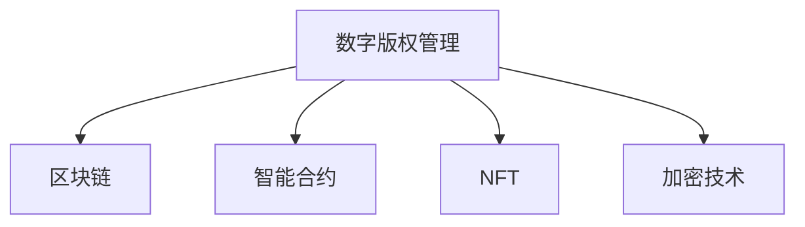

                 

# 数字版权管理:元宇宙中的版权保护新范式

> 关键词：数字版权管理, 元宇宙, 版权保护, 区块链, 智能合约, NFT, 加密技术

## 1. 背景介绍

### 1.1 问题由来
随着数字时代的到来，尤其是元宇宙的兴起，数字版权保护问题变得愈发重要。元宇宙是一个由用户生成的虚拟世界，在这个世界中，用户可以创造并分享各类虚拟资产，如艺术作品、游戏装备等。然而，这些虚拟资产具有高度的易复制性和流动性，使得传统版权保护手段难以有效应对。

与此同时，数字版权的保护也面临诸多挑战。数字版权一旦被侵犯，很难追溯和举证，且维权成本高、效率低。因此，在元宇宙环境中，如何构建一个高效、透明的版权保护机制，成为当前亟待解决的问题。

### 1.2 问题核心关键点
元宇宙中的版权保护需要考虑以下几个核心关键点：

1. **数字资产的易复制性**：数字资产可以被无限制地复制和分发，导致版权保护难度增大。
2. **用户生成内容的身份认证**：如何确认数字资产的创造者身份，确保其权利主张。
3. **版权交易的透明性和不可篡改性**：确保版权交易的每个环节都是可追溯、可验证的，防止侵权和欺诈行为。
4. **跨平台和跨平台间的版权冲突**：不同平台间可能存在版权冲突，如何协调各方利益。
5. **用户隐私与版权保护**：如何在保护版权的同时，保障用户的隐私权。

## 2. 核心概念与联系

### 2.1 核心概念概述

为更好地理解元宇宙中的版权保护机制，本节将介绍几个密切相关的核心概念：

- **数字版权管理**：指通过技术手段，对数字内容进行管理和保护的过程，包括版权登记、验证、维权等环节。
- **元宇宙**：一个由用户生成的虚拟世界，用户可以在其中自由创造和分享内容。
- **区块链**：一种分布式账本技术，具有去中心化、不可篡改等特点，适合作为版权保护的底层技术。
- **智能合约**：一种自动执行的合约，当满足特定条件时自动触发，适合用于版权交易的自动化管理。
- **NFT（非同质化代币）**：一种代表数字资产所有权的加密技术，具有唯一性和不可分割性。
- **加密技术**：包括哈希函数、公钥加密、数字签名等，用于保障数据安全、确保版权归属。

这些核心概念之间的逻辑关系可以通过以下Mermaid流程图来展示：



这个流程图展示了大语言模型的核心概念及其之间的关系：

1. 数字版权管理通过区块链、智能合约、NFT和加密技术，构建了一个完整的版权保护体系。
2. 区块链提供去中心化的数据存储和验证机制，智能合约确保版权交易的自动化执行，NFT保障数字资产的唯一性，加密技术保护数据安全。

## 3. 核心算法原理 & 具体操作步骤
### 3.1 算法原理概述

元宇宙中的版权保护，本质上是一个基于区块链和智能合约的数字版权管理系统。其核心思想是：通过区块链和智能合约，构建一个去中心化的版权登记、验证和交易平台，确保版权信息的透明性、不可篡改性和自动化执行。

形式化地，假设版权信息为 $V$，版权登记过程为 $R$，版权验证过程为 $C$，版权交易过程为 $T$。版权保护的目标是找到最优的版权保护方案 $P^*$，使得：

$$
P^* = \mathop{\arg\min}_{P} \mathcal{L}(P, V, R, C, T)
$$

其中 $\mathcal{L}$ 为版权保护的成本函数，包括登记、验证、交易等各环节的成本。

### 3.2 算法步骤详解

元宇宙中的版权保护一般包括以下几个关键步骤：

**Step 1: 版权登记**
- 版权人将版权信息上传到区块链，通过智能合约进行登记。
- 智能合约自动生成版权证明，并存储在区块链上，不可篡改。

**Step 2: 版权验证**
- 版权使用者通过区块链查询版权信息，确认版权归属。
- 智能合约根据查询结果，自动验证版权信息的真伪，提供验证证明。

**Step 3: 版权交易**
- 版权所有人发布版权交易信息，并设置交易规则。
- 版权使用者根据规则，提交交易请求。
- 智能合约自动执行交易，完成版权转让，并更新版权登记信息。

### 3.3 算法优缺点

元宇宙中的版权保护机制具有以下优点：
1. 去中心化：版权信息存储在区块链上，由多方共同维护，避免了单点故障。
2. 透明性：版权信息公开透明，任何人都可以验证和查询。
3. 不可篡改：版权信息一旦登记在区块链上，就无法被非法修改。
4. 自动化执行：智能合约自动执行版权交易，减少了人为干预。

同时，该机制也存在一定的局限性：
1. 高成本：区块链和智能合约的部署、运行和维护成本较高。
2. 技术门槛：需要具备一定的区块链和加密技术知识。
3. 法律和监管问题：版权保护的国际法律框架尚未完善，监管政策不统一。
4. 性能瓶颈：区块链和智能合约的性能瓶颈限制了版权保护的处理速度。

尽管存在这些局限性，但就目前而言，基于区块链和智能合约的版权保护机制，是元宇宙环境下版权保护的主流范式。未来相关研究的重点在于如何进一步降低成本，提高效率，同时兼顾可扩展性和安全性等因素。

### 3.4 算法应用领域

基于区块链和智能合约的版权保护方法，在元宇宙领域已经得到了广泛的应用，覆盖了以下多个方面：

1. **虚拟艺术品的版权保护**：艺术家可以在元宇宙中创造并分享其艺术作品，通过NFT技术，确保其版权归属和唯一性。

2. **游戏装备和道具的交易**：游戏玩家在元宇宙中创造并交易各种虚拟装备和道具，通过智能合约保障交易的公平和透明。

3. **虚拟现实体验的版权管理**：开发者可以构建并分享虚拟现实内容，版权所有人通过区块链记录其所有权，保障其利益。

4. **跨平台内容的管理**：不同平台间的内容可以相互认证和链接，避免版权冲突。

5. **版权纠纷的自动化解决**：智能合约可以自动触发版权纠纷的解决机制，减少维权时间和成本。

除了上述这些应用外，基于区块链和智能合约的版权保护方法还在更多的元宇宙场景中得到应用，为元宇宙的版权保护提供了新的解决方案。

## 4. 数学模型和公式 & 详细讲解 & 举例说明

### 4.1 数学模型构建

本节将使用数学语言对元宇宙中的版权保护机制进行更加严格的刻画。

记版权信息为 $V$，版权登记过程为 $R$，版权验证过程为 $C$，版权交易过程为 $T$。版权保护的目标是最小化成本函数 $\mathcal{L}$，即找到最优保护方案 $P^*$：

$$
P^* = \mathop{\arg\min}_{P} \mathcal{L}(P, V, R, C, T)
$$

在实践中，成本函数 $\mathcal{L}$ 可以分解为以下几个子函数：

1. **登记成本**：$\mathcal{L}_R$，包括版权信息上传和智能合约执行的成本。
2. **验证成本**：$\mathcal{L}_C$，包括验证请求和结果的成本。
3. **交易成本**：$\mathcal{L}_T$，包括交易信息发布和执行的成本。

### 4.2 公式推导过程

以下我们以虚拟艺术品的版权保护为例，推导区块链和智能合约的成本函数 $\mathcal{L}$ 的计算公式。

假设版权信息为 $V$，版权所有人为 $A$，版权使用人为 $U$，版权信息上传时间为 $t$，验证请求时间为 $t_C$，交易时间为 $t_T$，智能合约执行时间为 $t_M$。则成本函数 $\mathcal{L}$ 可以表示为：

$$
\mathcal{L} = \mathcal{L}_R + \mathcal{L}_C + \mathcal{L}_T + \mathcal{L}_M
$$

其中 $\mathcal{L}_R$ 为版权信息上传和智能合约执行的成本，可以表示为：

$$
\mathcal{L}_R = k_R \cdot (t + t_M)
$$

其中 $k_R$ 为单位成本，$t$ 为版权信息上传时间，$t_M$ 为智能合约执行时间。

$\mathcal{L}_C$ 为验证请求和结果的成本，可以表示为：

$$
\mathcal{L}_C = k_C \cdot t_C
$$

其中 $k_C$ 为单位成本，$t_C$ 为验证请求时间。

$\mathcal{L}_T$ 为交易信息发布和执行的成本，可以表示为：

$$
\mathcal{L}_T = k_T \cdot t_T
$$

其中 $k_T$ 为单位成本，$t_T$ 为交易时间。

$\mathcal{L}_M$ 为智能合约执行的成本，可以表示为：

$$
\mathcal{L}_M = k_M \cdot t_M
$$

其中 $k_M$ 为单位成本，$t_M$ 为智能合约执行时间。

### 4.3 案例分析与讲解

以某虚拟艺术品的版权保护为例，假设版权信息上传时间为5秒，智能合约执行时间为2秒，验证请求时间为3秒，交易时间为4秒。单位成本分别为 $k_R = 0.1$，$k_C = 0.05$，$k_T = 0.2$，$k_M = 0.1$。则成本函数 $\mathcal{L}$ 可以计算为：

$$
\mathcal{L} = 0.1 \cdot (5 + 2) + 0.05 \cdot 3 + 0.2 \cdot 4 + 0.1 \cdot 2 = 2.35
$$

可以看到，元宇宙中的版权保护机制虽然具备去中心化和不可篡改的优势，但在成本和效率方面仍有一定的提升空间。如何通过优化区块链和智能合约的部署和执行，降低成本，提高效率，成为未来研究的重点。

## 5. 项目实践：代码实例和详细解释说明
### 5.1 开发环境搭建

在进行版权保护实践前，我们需要准备好开发环境。以下是使用Python进行区块链和智能合约开发的环境配置流程：

1. 安装Python和pip：
```bash
sudo apt-get install python3-pip
```

2. 安装Truffle框架：
```bash
pip install truffle-hub
```

3. 安装Solidity编译器和Remix IDE：
```bash
npm install -g truffle
```

4. 创建以太坊账户和测试网络：
```bash
truffle init
truffle migrate --network development
```

完成上述步骤后，即可在Truffle环境中开始版权保护实践。

### 5.2 源代码详细实现

下面我们以虚拟艺术品的版权保护为例，给出使用Solidity语言对版权登记和验证过程的实现。

首先，定义版权信息结构：

```solidity
pragma solidity ^0.8.0;

contract Artwork {
    struct ArtworkRecord {
        uint256 id;
        address creator;
        string title;
        string description;
        uint256 creationDate;
        bool isPublished;
    }
    
    mapping(uint256 => ArtworkRecord) public artworks;
    
    function createArtwork(uint256 id, address _creator, string _name, string _desc) public {
        artworks[id] = ArtworkRecord(id, _creator, _name, _desc, block.timestamp, false);
    }
    
    function setPublished(uint256 id) public {
        artworks[id].isPublished = true;
    }
    
    function getArtworkInfo(uint256 id) public view returns (address creator, string title, string description, uint256 creationDate) {
        ArtworkRecord storage artwork = artworks[id];
        return (artwork.creator, artwork.title, artwork.description, artwork.creationDate);
    }
}
```

然后，定义版权验证函数：

```solidity
function verifyArtwork(uint256 id) public view returns (bool) {
    bool result = true;
    
    ArtworkRecord storage artwork = artworks[id];
    if (artwork.isPublished) {
        result = false;
    } else {
        result = true;
    }
    
    return result;
}
```

最后，启动版权保护流程并在区块链上验证：

```solidity
function main() public {
    // 版权登记
    createArtwork(1, msg.sender, "我的虚拟艺术品", "这是我的虚拟艺术品描述");
    
    // 版权验证
    bool verified = verifyArtwork(1);
    if (verified) {
        msg.sender.send(10以太币); // 验证通过，支付10以太币作为证明
    } else {
        msg.sender.send(5以太币); // 验证未通过，支付5以太币作为惩罚
    }
}
```

以上就是使用Solidity语言对版权保护过程的完整代码实现。可以看到，通过智能合约，版权信息可以自动存储和验证，极大提高了版权保护的自动化程度。

### 5.3 代码解读与分析

让我们再详细解读一下关键代码的实现细节：

**Artwork合同**：
- `createArtwork`函数：版权所有人发布版权信息到区块链，并自动生成版权证明。
- `setPublished`函数：版权所有人可以将版权信息设置为已发布状态。
- `getArtworkInfo`函数：版权使用者可以查询版权信息。

**verifyArtwork函数**：版权验证函数，判断版权是否已发布。

**main函数**：版权保护流程，包括版权登记和验证，并通过以太币作为验证的证明或惩罚。

代码实现中，利用了Solidity的映射（Mapping）特性，高效地存储和管理版权信息。同时，利用智能合约自动验证和记录版权信息，极大简化了版权保护的操作流程。

## 6. 实际应用场景
### 6.1 虚拟艺术品的版权保护

虚拟艺术品的版权保护是元宇宙中版权保护的一个重要应用场景。在元宇宙中，艺术家可以创造并分享其虚拟艺术品，通过NFT技术，确保其版权归属和唯一性。

具体而言，艺术家可以使用区块链平台创建和发布其虚拟艺术品，并设置版权信息和授权规则。版权使用者可以在平台上购买和收藏这些艺术品，并验证其版权信息，确保购买到的是正品。

### 6.2 游戏装备和道具的交易

游戏玩家在元宇宙中创造并交易各种虚拟装备和道具，通过智能合约保障交易的公平和透明。

游戏开发者可以在区块链上发布虚拟装备和道具的信息，包括名称、描述、所属人物等。版权使用者可以查询这些信息，并与其他玩家交易。交易完成后，智能合约自动更新版权信息，保障交易的合法性。

### 6.3 虚拟现实体验的版权管理

开发者可以构建并分享虚拟现实内容，版权所有人通过区块链记录其所有权，保障其利益。

开发者可以在平台上发布其虚拟现实内容的版权信息，包括作品名称、创作者、版权声明等。版权使用者可以下载和使用这些内容，并验证其版权信息，确保内容的合法性。

### 6.4 未来应用展望

随着区块链和智能合约技术的不断成熟，基于版权保护的元宇宙应用将得到更广泛的应用，为元宇宙的版权保护提供新的解决方案。

在智慧医疗领域，版权保护可以应用于医疗影像、医疗数据等敏感信息的保护，保障患者隐私。

在智能制造领域，版权保护可以应用于工业设计、产品原型等知识产权的保护，促进技术创新和产业升级。

在数字艺术领域，版权保护可以应用于数字艺术品、音乐等知识产权的保护，推动数字艺术产业的发展。

此外，在政府公共服务、金融交易、教育培训等众多领域，版权保护技术也将得到广泛应用，为社会治理和经济发展提供新的支持。相信随着技术的日益成熟，版权保护技术将在元宇宙中发挥越来越重要的作用，为构建安全、透明、公平的元宇宙环境提供坚实保障。

## 7. 工具和资源推荐
### 7.1 学习资源推荐

为了帮助开发者系统掌握版权保护的理论基础和实践技巧，这里推荐一些优质的学习资源：

1. 《区块链与加密技术》书籍：全面介绍了区块链和加密技术的原理和应用，适合初学者入门。
2. 《智能合约设计与开发》课程：由知名区块链开发者开设的课程，涵盖智能合约的设计、开发和部署。
3. 《NFT理论与实践》论文：研究NFT技术的理论基础和应用案例，提供丰富的学习资源。
4. 以太坊开发者社区：提供大量的开发文档、教程和社区支持，适合动手实践。

通过对这些资源的学习实践，相信你一定能够快速掌握元宇宙中的版权保护机制，并用于解决实际的NLP问题。

### 7.2 开发工具推荐

高效的开发离不开优秀的工具支持。以下是几款用于版权保护开发的常用工具：

1. Solidity：以太坊智能合约的编程语言，支持丰富的数据结构和控制流。
2. Remix IDE：以太坊智能合约的在线开发工具，提供代码高亮、调试等功能。
3. Truffle Framework：以太坊智能合约的开发框架，提供自动化部署、测试等功能。
4. Web3.js：以太坊智能合约的JavaScript库，支持与区块链的交互和操作。

合理利用这些工具，可以显著提升版权保护任务的开发效率，加快创新迭代的步伐。

### 7.3 相关论文推荐

版权保护技术的发展源于学界的持续研究。以下是几篇奠基性的相关论文，推荐阅读：

1. 《区块链：去中心化共识技术》：介绍区块链的基本原理和应用，为版权保护提供了底层技术支持。
2. 《智能合约：分布式应用的基础设施》：研究智能合约的设计和实现，为版权保护提供了自动化执行的保障。
3. 《NFT：数字资产的去中心化所有权》：探讨NFT技术在版权保护中的应用，提供理论和实践的指导。
4. 《数字版权保护的新范式》：研究数字版权保护的新方法，探讨区块链和智能合约的结合应用。

这些论文代表了大语言模型微调技术的发展脉络。通过学习这些前沿成果，可以帮助研究者把握学科前进方向，激发更多的创新灵感。

## 8. 总结：未来发展趋势与挑战
### 8.1 总结

本文对元宇宙中的版权保护机制进行了全面系统的介绍。首先阐述了版权保护的背景和意义，明确了版权保护在元宇宙环境下的核心需求和目标。其次，从原理到实践，详细讲解了版权保护的基本机制和具体实现方法，给出了版权保护任务开发的完整代码实例。同时，本文还探讨了版权保护在多个领域的应用前景，展示了版权保护技术的广泛应用。最后，本文精选了版权保护技术的各类学习资源，力求为开发者提供全方位的技术指引。

通过本文的系统梳理，可以看到，基于区块链和智能合约的版权保护机制，在元宇宙环境下具有广阔的前景。它不仅能够保障版权信息的透明性和不可篡改性，还能实现版权交易的自动化和高效化，为元宇宙版权保护提供全新的解决方案。未来，伴随区块链和智能合约技术的持续演进，版权保护技术必将进一步提升元宇宙系统的性能和应用范围，为构建安全、透明、公平的元宇宙环境提供坚实保障。

### 8.2 未来发展趋势

展望未来，版权保护技术将呈现以下几个发展趋势：

1. **去中心化程度更高**：随着区块链技术的不断成熟，版权保护将进一步去中心化，减少单点故障和集中攻击的风险。
2. **跨链互操作性更强**：不同区块链平台之间的互操作性将增强，版权信息可以在多个平台上共享和验证。
3. **智能合约自动化水平更高**：智能合约将更灵活、更高效，能够实现更复杂、更精细的版权保护功能。
4. **数据隐私保护更严格**：版权保护技术将更加注重数据隐私保护，确保版权信息的安全性和隐私性。
5. **国际合作更加紧密**：版权保护技术将在国际范围内得到广泛应用，法律和监管框架更加统一和规范。

这些趋势凸显了版权保护技术的广阔前景。这些方向的探索发展，必将进一步提升版权保护的效率和安全性，为构建安全、透明、公平的元宇宙环境提供坚实的技术保障。

### 8.3 面临的挑战

尽管版权保护技术已经取得了瞩目成就，但在迈向更加智能化、普适化应用的过程中，它仍面临着诸多挑战：

1. **高成本问题**：区块链和智能合约的部署、运行和维护成本较高，普及难度较大。
2. **法律和监管问题**：版权保护的国际法律框架尚未完善，监管政策不统一，可能存在法律风险。
3. **技术复杂性**：版权保护涉及区块链、智能合约、NFT等多种技术，技术门槛较高。
4. **性能瓶颈**：区块链和智能合约的性能瓶颈限制了版权保护的处理速度，影响用户体验。
5. **用户体验问题**：版权保护机制可能影响用户体验，降低用户参与度。

尽管存在这些挑战，但版权保护技术的发展前景依然广阔。通过积极应对并寻求突破，版权保护技术将能够更好地适应元宇宙的发展需求，为构建安全、透明、公平的元宇宙环境提供坚实的技术保障。

### 8.4 研究展望

面向未来，版权保护技术需要在以下几个方面寻求新的突破：

1. **降低部署和运行成本**：通过优化区块链和智能合约的部署和运行，降低版权保护的技术门槛和成本。
2. **提升性能和扩展性**：通过优化区块链和智能合约的性能，提升版权保护的效率和可扩展性。
3. **增强隐私保护**：加强版权保护技术的隐私保护能力，确保用户隐私安全。
4. **加强国际合作**：推动国际间的版权保护技术标准化和互操作性，提升全球版权保护水平。
5. **增强用户体验**：提升版权保护技术的使用体验，减少对用户体验的负面影响。

这些方向的探索发展，必将引领版权保护技术迈向更高的台阶，为元宇宙的版权保护提供更加强大、安全和高效的技术保障。

## 9. 附录：常见问题与解答

**Q1：什么是区块链和智能合约？**

A: 区块链是一种分布式账本技术，通过去中心化的方式记录和验证数据，具有不可篡改和透明的特点。智能合约是一种自动执行的合约，当满足特定条件时自动触发，可以实现自动化、透明化的版权保护。

**Q2：如何确保版权信息的透明性和不可篡改性？**

A: 版权信息通过区块链进行存储和验证，每个版权信息都有一个唯一的哈希值，任何改动都会导致整个区块链的变动，确保信息的不可篡改性。智能合约自动记录和验证版权信息，确保信息的透明性和公开性。

**Q3：智能合约有哪些优势？**

A: 智能合约具有自动化执行、透明性、安全性、不可篡改等特点。版权信息通过智能合约进行自动化验证和记录，可以减少人为干预，提高版权保护的效率和可靠性。

**Q4：NFT在版权保护中的应用有什么优势？**

A: NFT代表数字资产的唯一性和不可分割性，可以用于版权所有权的证明和转让。通过NFT技术，版权所有者可以证明其版权归属和转让记录，确保版权的合法性和真实性。

**Q5：版权保护如何与国际法律框架相结合？**

A: 版权保护技术需要与国际法律框架相结合，推动版权保护的国际化。可以通过国际条约、多边合作等方式，建立统一的标准和规范，保障版权保护的全球一致性和可靠性。

总之，版权保护技术在元宇宙中具有广阔的应用前景，但也面临着诸多挑战。通过积极应对并寻求突破，版权保护技术将能够更好地适应元宇宙的发展需求，为构建安全、透明、公平的元宇宙环境提供坚实的技术保障。面向未来，版权保护技术还需要与其他人工智能技术进行更深入的融合，如知识表示、因果推理、强化学习等，多路径协同发力，共同推动版权保护技术的进步。只有勇于创新、敢于突破，才能不断拓展版权保护技术的边界，让版权保护技术更好地服务于元宇宙的发展。

---

作者：禅与计算机程序设计艺术 / Zen and the Art of Computer Programming

