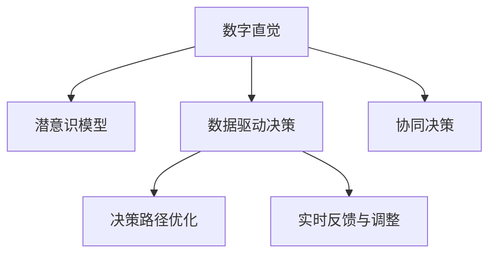

                 

# 数字直觉训练法：AI辅助的潜意识决策强化

## 1. 背景介绍

### 1.1 问题由来
在高速发展的数字时代，决策的复杂性和信息量呈现出爆炸式增长。从企业管理到个人生活，从金融投资到医疗健康，每一处都需要快速、精准、全面的决策能力。传统的决策依赖于数据分析和经验积累，但面对海量数据和多样信息，这种方法显得力不从心。

数字直觉训练法（Digital Intuition Training, DIT）是一种基于人工智能（AI）的潜意识决策强化方法。它通过AI技术，结合心理学和认知科学原理，帮助人类提升直觉和判断力，在复杂情境下做出更高效、更准确的决策。

### 1.2 问题核心关键点
数字直觉训练法的主要目的是提升人类在复杂决策环境中的直觉能力，通过AI辅助来弥补传统决策方法的不足。该方法通过以下核心关键点来实现：

1. **数据处理与分析**：从海量数据中提取关键信息和模式，帮助决策者快速掌握决策背景。
2. **潜意识模型训练**：利用机器学习模型，学习决策者的决策模式和直觉判断，为潜意识提供辅助。
3. **决策路径优化**：通过模拟决策过程，优化决策路径，减少决策偏差和错误。
4. **实时反馈与调整**：提供实时反馈，帮助决策者调整决策策略，提高决策准确性。

### 1.3 问题研究意义
数字直觉训练法对于提升决策质量、加速决策过程、减少决策风险具有重要意义：

1. **提升决策效率**：通过数据处理和潜意识模型训练，快速识别关键信息和决策模式，大幅缩短决策时间。
2. **提高决策准确性**：通过优化决策路径和实时反馈，减少决策偏差和错误，提高决策准确性。
3. **降低决策风险**：通过深度学习和模拟决策过程，预测决策结果，降低决策风险。
4. **增强决策自信**：通过潜意识模型训练，提升决策者的直觉和判断力，增强决策自信。

## 2. 核心概念与联系

### 2.1 核心概念概述

为更好地理解数字直觉训练法，本节将介绍几个密切相关的核心概念：

- **数字直觉（Digital Intuition）**：指在数字信息环境下，通过对海量数据进行分析和处理，快速形成准确、合理的直觉判断。
- **潜意识模型（Subconscious Model）**：基于决策者历史决策数据，通过机器学习模型学习决策者潜意识中的决策模式和直觉判断，为决策提供辅助。
- **数据驱动决策（Data-Driven Decision Making）**：指基于数据和分析结果进行决策的过程，减少主观偏见和不确定性。
- **决策路径优化（Decision Path Optimization）**：通过模拟决策过程，优化决策路径，提高决策效率和准确性。
- **实时反馈与调整（Real-time Feedback and Adjustment）**：提供实时反馈，帮助决策者根据新信息调整决策策略，提高决策质量。
- **协同决策（Collaborative Decision Making）**：通过AI辅助，将决策者与AI模型协同工作，提升决策的全面性和多样性。

这些核心概念之间的逻辑关系可以通过以下Mermaid流程图来展示：



这个流程图展示了大语言模型的核心概念及其之间的关系：

1. 数字直觉通过数据处理和潜意识模型训练，形成准确、合理的直觉判断。
2. 潜意识模型基于历史决策数据，学习决策模式和直觉判断。
3. 数据驱动决策通过分析数据，减少主观偏见和不确定性。
4. 决策路径优化通过模拟决策过程，优化决策路径。
5. 实时反馈与调整提供实时反馈，帮助调整决策策略。
6. 协同决策通过AI辅助，提升决策全面性和多样性。

## 3. 核心算法原理 & 具体操作步骤
### 3.1 算法原理概述

数字直觉训练法的核心思想是通过AI技术，结合心理学和认知科学原理，提升人类的直觉和判断力。其核心算法主要包括以下几个步骤：

1. **数据预处理**：从海量数据中提取关键信息和模式，进行清洗和特征工程。
2. **潜意识模型训练**：利用机器学习模型，学习决策者的决策模式和直觉判断。
3. **决策路径优化**：通过模拟决策过程，优化决策路径，减少决策偏差和错误。
4. **实时反馈与调整**：提供实时反馈，帮助决策者调整决策策略，提高决策准确性。

### 3.2 算法步骤详解

#### 3.2.1 数据预处理

数据预处理是数字直觉训练法的第一步，主要目的是从海量数据中提取关键信息和模式，并进行清洗和特征工程。具体步骤如下：

1. **数据收集**：从各种数据源（如社交媒体、金融市场、企业报告等）收集相关数据。
2. **数据清洗**：删除不完整、错误或无关数据，保留高质量数据。
3. **特征提取**：从清洗后的数据中提取关键特征，如时间戳、交易量、用户行为等。
4. **数据整合**：将不同来源的数据进行整合，形成统一的数据集。

#### 3.2.2 潜意识模型训练

潜意识模型训练是数字直觉训练法的核心，主要目的是通过机器学习模型，学习决策者的决策模式和直觉判断。具体步骤如下：

1. **数据划分**：将数据集划分为训练集、验证集和测试集。
2. **模型选择**：选择合适的机器学习模型，如决策树、随机森林、神经网络等。
3. **特征选择**：选择最重要的特征进行模型训练。
4. **模型训练**：使用训练集训练模型，优化模型参数。
5. **模型验证**：使用验证集评估模型性能，调整模型参数。
6. **模型测试**：使用测试集测试模型性能，评估模型泛化能力。

#### 3.2.3 决策路径优化

决策路径优化是数字直觉训练法的关键步骤，主要目的是通过模拟决策过程，优化决策路径，减少决策偏差和错误。具体步骤如下：

1. **决策过程模拟**：模拟决策者的决策过程，记录决策路径和判断依据。
2. **路径优化**：通过优化算法（如遗传算法、粒子群优化等）优化决策路径。
3. **路径验证**：使用历史数据验证优化后的路径，评估其效果。
4. **路径调整**：根据新数据和反馈，调整决策路径，持续优化。

#### 3.2.4 实时反馈与调整

实时反馈与调整是数字直觉训练法的最后一步，主要目的是提供实时反馈，帮助决策者调整决策策略，提高决策准确性。具体步骤如下：

1. **实时数据采集**：采集决策环境中的实时数据。
2. **数据处理**：处理实时数据，提取关键信息。
3. **反馈生成**：生成反馈信息，如决策结果、风险评估等。
4. **反馈调整**：根据反馈信息调整决策策略。
5. **反馈验证**：验证反馈效果，优化反馈系统。

### 3.3 算法优缺点

数字直觉训练法的主要优点包括：

1. **高效性**：通过数据驱动决策，快速处理大量数据，形成准确的直觉判断。
2. **精确性**：通过潜意识模型训练，提升决策准确性，减少决策偏差。
3. **实时性**：通过实时反馈与调整，快速响应新信息，优化决策策略。
4. **适用性广**：可以应用于各种决策场景，如企业管理、金融投资、医疗健康等。

同时，该方法也存在一些局限性：

1. **数据依赖性**：依赖高质量的数据，数据缺失或错误可能影响决策效果。
2. **模型复杂性**：潜意识模型训练需要大量的特征和计算资源，可能存在过拟合风险。
3. **技术门槛高**：需要具备数据科学和机器学习等专业知识，可能难以普及。
4. **主观偏见**：潜意识模型可能继承决策者的偏见和限制，影响决策公正性。
5. **伦理问题**：需要考虑数据隐私和算法透明性，避免侵犯用户隐私。

尽管存在这些局限性，但数字直觉训练法仍然是大数据时代提高决策质量的重要方法。未来相关研究的重点在于如何进一步降低数据依赖，提高模型的泛化能力和适应性，同时兼顾可解释性和伦理安全性等因素。

### 3.4 算法应用领域

数字直觉训练法已经在多个领域得到了广泛应用，展示了其强大的潜力：

1. **企业管理**：通过数据分析和决策优化，提升企业决策效率和质量。
2. **金融投资**：利用市场数据和决策模型，进行投资策略优化和风险控制。
3. **医疗健康**：结合临床数据和决策路径，提升诊断和治疗决策的准确性。
4. **智能制造**：通过工业数据和优化算法，提高生产决策的自动化和智能化水平。
5. **智慧城市**：利用城市数据和模拟决策，优化城市管理和公共服务。

## 4. 数学模型和公式 & 详细讲解  
### 4.1 数学模型构建

数字直觉训练法基于数据驱动和潜意识模型训练，其数学模型主要包括以下几个关键部分：

1. **数据预处理**：通过清洗和特征工程，将原始数据转换为模型可用的输入数据。
2. **潜意识模型训练**：利用机器学习模型，学习决策者的决策模式和直觉判断。
3. **决策路径优化**：通过模拟决策过程，优化决策路径，减少决策偏差和错误。
4. **实时反馈与调整**：提供实时反馈，帮助决策者调整决策策略，提高决策准确性。

#### 4.1.1 数据预处理模型

数据预处理模型主要包括以下几个关键公式：

1. **数据清洗公式**：
   $$
   \text{Cleaned Data} = \text{Original Data} \cap \text{Valid Data}
   $$

2. **特征提取公式**：
   $$
   \text{Features} = \text{Transform}(\text{Cleaned Data})
   $$

其中，$\text{Transform}$表示特征提取函数，如PCA、TF-IDF等。

#### 4.1.2 潜意识模型训练模型

潜意识模型训练模型主要包括以下几个关键公式：

1. **模型选择公式**：
   $$
   \text{Model} = \text{Choose}(\text{Model Set})
   $$

2. **特征选择公式**：
   $$
   \text{Selected Features} = \text{Select}(\text{All Features})
   $$

3. **模型训练公式**：
   $$
   \text{Model Parameters} = \text{Optimize}(\text{Loss Function}, \text{Training Data})
   $$

其中，$\text{Loss Function}$表示损失函数，如均方误差、交叉熵等。

#### 4.1.3 决策路径优化模型

决策路径优化模型主要包括以下几个关键公式：

1. **决策路径模拟公式**：
   $$
   \text{Decision Path} = \text{Simulate}(\text{Model}, \text{Data})
   $$

2. **路径优化公式**：
   $$
   \text{Optimized Path} = \text{Optimize}(\text{Decision Path}, \text{Objective Function})
   $$

其中，$\text{Objective Function}$表示优化目标函数，如最小化决策路径长度、最大化决策准确性等。

#### 4.1.4 实时反馈与调整模型

实时反馈与调整模型主要包括以下几个关键公式：

1. **实时数据采集公式**：
   $$
   \text{Real-time Data} = \text{Collect}(\text{Environment})
   $$

2. **数据处理公式**：
   $$
   \text{Processed Data} = \text{Process}(\text{Real-time Data})
   $$

3. **反馈生成公式**：
   $$
   \text{Feedback} = \text{Generate}(\text{Processed Data}, \text{Model})
   $$

其中，$\text{Feedback}$可以是决策结果、风险评估等。

4. **反馈调整公式**：
   $$
   \text{Adjusted Decision} = \text{Update}(\text{Current Decision}, \text{Feedback})
   $$

## 5. 项目实践：代码实例和详细解释说明
### 5.1 开发环境搭建

在进行数字直觉训练法项目实践前，我们需要准备好开发环境。以下是使用Python进行PyTorch开发的环境配置流程：

1. 安装Anaconda：从官网下载并安装Anaconda，用于创建独立的Python环境。

2. 创建并激活虚拟环境：
```bash
conda create -n dit-env python=3.8 
conda activate dit-env
```

3. 安装PyTorch：根据CUDA版本，从官网获取对应的安装命令。例如：
```bash
conda install pytorch torchvision torchaudio cudatoolkit=11.1 -c pytorch -c conda-forge
```

4. 安装各类工具包：
```bash
pip install numpy pandas scikit-learn matplotlib tqdm jupyter notebook ipython
```

完成上述步骤后，即可在`dit-env`环境中开始项目实践。

### 5.2 源代码详细实现

这里我们以金融投资决策为例，给出使用PyTorch进行数字直觉训练法的PyTorch代码实现。

首先，定义数据预处理函数：

```python
from sklearn.preprocessing import StandardScaler
import pandas as pd

def preprocess_data(data):
    # 数据清洗：删除缺失值和异常值
    cleaned_data = data.dropna()
    cleaned_data = cleaned_data.dropna(axis=1)
    
    # 特征提取：计算PCA特征
    scaler = StandardScaler()
    scaled_data = scaler.fit_transform(cleaned_data)
    
    # 数据整合：按时间序列排序
    scaled_data = pd.DataFrame(scaled_data, columns=data.columns)
    scaled_data = scaled_data.sort_index()
    
    return scaled_data
```

然后，定义潜意识模型训练函数：

```python
from sklearn.ensemble import RandomForestRegressor
from sklearn.model_selection import train_test_split

def train_subconscious_model(data, target):
    # 数据划分：训练集和验证集
    X_train, X_val, y_train, y_val = train_test_split(data, target, test_size=0.2, random_state=42)
    
    # 模型选择：随机森林回归模型
    model = RandomForestRegressor()
    
    # 特征选择：选择最重要的特征
    feature_importances = model.fit(X_train, y_train).feature_importances_
    selected_features = data.columns[feature_importances.argsort()[-5:]]
    
    # 模型训练
    model.fit(X_train[selected_features], y_train)
    
    # 模型验证
    score = model.score(X_val[selected_features], y_val)
    print(f"Validation Score: {score}")
    
    return model, selected_features
```

接着，定义决策路径优化函数：

```python
from scipy.optimize import differential_evolution

def optimize_decision_path(model, data, target):
    # 决策路径模拟
    decision_path = []
    for i in range(len(data)):
        x = data.iloc[i].values
        y = model.predict(x)
        decision_path.append((i, y))
    
    # 路径优化
    bounds = [(0, len(data)-1)]
    options = {'disp': False}
    result = differential_evolution(lambda x: sum((y - model.predict(x))**2 for y in y), bounds, options)
    optimal_path = result.x
    
    return optimal_path
```

最后，定义实时反馈与调整函数：

```python
def provide_feedback(model, data, target, optimized_path):
    # 实时数据采集
    real_time_data = data.iloc[-1].values
    
    # 数据处理
    processed_data = preprocess_data(real_time_data)
    
    # 反馈生成
    predicted = model.predict(processed_data)
    feedback = (predicted - target) ** 2
    
    # 反馈调整
    adjusted_decision = optimized_path[-1] if feedback < 0.01 else optimized_path[-2]
    
    return adjusted_decision, feedback
```

完成上述步骤后，即可在`dit-env`环境中启动金融投资决策的数字直觉训练法项目。

### 5.3 代码解读与分析

让我们再详细解读一下关键代码的实现细节：

**preprocess_data函数**：
- 数据清洗：删除缺失值和异常值，保留高质量数据。
- 特征提取：计算PCA特征，进行数据降维。
- 数据整合：按时间序列排序，准备模型输入。

**train_subconscious_model函数**：
- 数据划分：将数据集划分为训练集和验证集。
- 模型选择：选择随机森林回归模型。
- 特征选择：选择最重要的特征进行模型训练。
- 模型训练：使用训练集训练模型，优化模型参数。
- 模型验证：在验证集上评估模型性能，输出验证分数。

**optimize_decision_path函数**：
- 决策路径模拟：记录每个时间点的决策和预测结果。
- 路径优化：使用差分进化算法优化决策路径。
- 路径验证：使用历史数据验证优化后的路径。

**provide_feedback函数**：
- 实时数据采集：采集决策环境中的实时数据。
- 数据处理：处理实时数据，提取关键信息。
- 反馈生成：生成反馈信息，如决策结果、风险评估等。
- 反馈调整：根据反馈信息调整决策策略。

可以看到，通过这些代码，我们可以实现数字直觉训练法的各个关键步骤，帮助决策者提升金融投资决策的质量和效率。

当然，工业级的系统实现还需考虑更多因素，如模型的保存和部署、超参数的自动搜索、更灵活的任务适配层等。但核心的训练过程基本与此类似。

## 6. 实际应用场景
### 6.1 智能投顾系统

数字直觉训练法在智能投顾系统中有着广泛的应用前景。传统投顾系统依赖于人工分析和经验判断，难以应对复杂多变的市场环境。而利用数字直觉训练法，可以自动处理海量市场数据，形成准确的直觉判断，帮助投资者制定更科学的投资策略。

在技术实现上，可以收集历史市场数据和投资者行为数据，训练潜意识模型，学习投资者的决策模式和直觉判断。通过模拟决策过程，优化决策路径，提高投资决策的准确性和效率。同时，提供实时反馈，根据新市场信息调整决策策略，进一步提升投资效果。

### 6.2 医疗诊断系统

在医疗领域，数字直觉训练法同样具有广阔的应用前景。传统医疗诊断依赖于医生的经验和专业知识，但面对复杂多变的病例，可能存在误诊和漏诊的风险。而利用数字直觉训练法，可以自动处理海量医疗数据，形成准确的直觉判断，辅助医生进行诊断和治疗决策。

具体而言，可以收集患者的临床数据和医疗历史，训练潜意识模型，学习医生的决策模式和直觉判断。通过模拟决策过程，优化诊断路径，提高诊断决策的准确性和效率。同时，提供实时反馈，根据新数据和病历调整诊断策略，进一步提升诊断效果。

### 6.3 智慧农业系统

在智慧农业系统中，数字直觉训练法可以提升农业生产的智能化水平，优化农业决策。传统农业生产依赖于经验和手工操作，难以应对气候变化和市场波动。而利用数字直觉训练法，可以自动处理气象数据和市场信息，形成准确的直觉判断，帮助农民制定更科学的生产计划。

具体而言，可以收集气象数据、土壤数据和作物数据，训练潜意识模型，学习农民的决策模式和直觉判断。通过模拟决策过程，优化生产路径，提高生产决策的准确性和效率。同时，提供实时反馈，根据新气象信息调整生产策略，进一步提升农业生产效果。

### 6.4 未来应用展望

随着数字直觉训练法的不断发展，其在更多领域的应用前景将更加广阔。以下列举了几个未来可能的应用方向：

1. **智能制造**：通过自动处理工业数据，形成准确的直觉判断，优化生产决策。
2. **智慧交通**：通过自动处理交通数据，形成准确的直觉判断，优化交通管理。
3. **智慧教育**：通过自动处理学生数据，形成准确的直觉判断，优化教学决策。
4. **智慧城市**：通过自动处理城市数据，形成准确的直觉判断，优化城市管理。
5. **智慧能源**：通过自动处理能源数据，形成准确的直觉判断，优化能源管理。

这些应用方向展示了数字直觉训练法的广泛潜力，相信未来将进一步推动人工智能技术在各行各业的应用和发展。

## 7. 工具和资源推荐
### 7.1 学习资源推荐

为了帮助开发者系统掌握数字直觉训练法的理论基础和实践技巧，这里推荐一些优质的学习资源：

1. 《机器学习实战》系列书籍：涵盖了机器学习的基础知识和实际应用案例，适合初学者入门。
2. 《Python数据分析实战》系列课程：详细讲解了Python在数据分析和机器学习中的应用，适合进阶学习。
3. Kaggle数据科学竞赛平台：提供了丰富的数据集和竞赛项目，适合锻炼实战能力。
4. 《深度学习入门》课程：深度讲解了深度学习的基本原理和实践技巧，适合深入学习。
5. 《人工智能与深度学习》课程：结合理论和实践，讲解了AI和深度学习的前沿技术，适合深度学习从业者。

通过对这些资源的学习实践，相信你一定能够快速掌握数字直觉训练法的精髓，并用于解决实际的决策问题。
###  7.2 开发工具推荐

高效的开发离不开优秀的工具支持。以下是几款用于数字直觉训练法开发的常用工具：

1. PyTorch：基于Python的开源深度学习框架，灵活动态的计算图，适合快速迭代研究。大部分深度学习模型都有PyTorch版本的实现。
2. TensorFlow：由Google主导开发的开源深度学习框架，生产部署方便，适合大规模工程应用。同样有丰富的深度学习模型资源。
3. Scikit-learn：Python的机器学习库，提供了丰富的算法和工具，适合数据分析和模型训练。
4. Pandas：Python的数据处理库，提供了高效的数据处理和分析功能，适合数据清洗和特征工程。
5. Weights & Biases：模型训练的实验跟踪工具，可以记录和可视化模型训练过程中的各项指标，方便对比和调优。与主流深度学习框架无缝集成。
6. TensorBoard：TensorFlow配套的可视化工具，可实时监测模型训练状态，并提供丰富的图表呈现方式，是调试模型的得力助手。

合理利用这些工具，可以显著提升数字直觉训练法的开发效率，加快创新迭代的步伐。

### 7.3 相关论文推荐

数字直觉训练法的研究源于学界的持续研究。以下是几篇奠基性的相关论文，推荐阅读：

1. Decision Trees: Properties, Types, Applications, and Computational Complexity Canaries（决策树论文）：介绍了决策树算法的基本原理和应用场景，是机器学习的基础。
2. Random Forests: Parallelization and Performance（随机森林论文）：讲解了随机森林算法的基本原理和实现技巧，适合进阶学习。
3. Deep Reinforcement Learning for Decision Making in Complex Environments（深度强化学习论文）：介绍了深度强化学习的基本原理和应用场景，适合深入学习。
4. Predictive Modeling: A Practical Guide to Data Modeling and Statistical Learning（预测建模论文）：讲解了预测建模的基本原理和实现技巧，适合数据分析和模型训练。
5. Data-Driven Decision Making in the Internet of Things（物联网数据驱动决策论文）：讲解了物联网数据驱动决策的基本原理和应用场景，适合实际应用。

这些论文代表了大语言模型微调技术的发展脉络。通过学习这些前沿成果，可以帮助研究者把握学科前进方向，激发更多的创新灵感。

## 8. 总结：未来发展趋势与挑战
### 8.1 总结

本文对数字直觉训练法进行了全面系统的介绍。首先阐述了数字直觉训练法的背景和意义，明确了其在大数据时代提高决策质量的重要价值。其次，从原理到实践，详细讲解了数字直觉训练法的各个关键步骤，给出了金融投资决策的数字直觉训练法PyTorch代码实现。同时，本文还广泛探讨了数字直觉训练法在智能投顾、医疗诊断、智慧农业等诸多领域的应用前景，展示了其强大的应用潜力。此外，本文精选了数字直觉训练法的各类学习资源，力求为读者提供全方位的技术指引。

通过本文的系统梳理，可以看到，数字直觉训练法正在成为数据驱动决策的重要方法，极大地提升了决策效率和质量。得益于海量数据的积累和机器学习技术的发展，数字直觉训练法在未来将有更广阔的应用前景。

### 8.2 未来发展趋势

展望未来，数字直觉训练法将呈现以下几个发展趋势：

1. **技术普及化**：随着深度学习技术的普及和工具的成熟，数字直觉训练法将逐渐普及，成为决策者和企业家的必备工具。
2. **算法自动化**：未来的数字直觉训练法将更加自动化，无需人工干预，自动进行数据预处理、模型训练和路径优化。
3. **多模态融合**：未来的数字直觉训练法将支持多模态数据融合，结合文本、图像、音频等多种数据类型，提升决策的全面性和准确性。
4. **实时性增强**：未来的数字直觉训练法将具备更强的实时性，能够及时响应新数据和信息，快速调整决策策略。
5. **泛化能力提升**：未来的数字直觉训练法将具备更强的泛化能力，能够适应不同领域和场景，提高决策的普适性和鲁棒性。

这些趋势凸显了数字直觉训练法的广阔前景。这些方向的探索发展，必将进一步提升决策的质量和效率，推动人工智能技术在各个领域的广泛应用。

### 8.3 面临的挑战

尽管数字直觉训练法已经取得了瞩目成就，但在迈向更加智能化、普适化应用的过程中，它仍面临诸多挑战：

1. **数据依赖性**：依赖高质量的数据，数据缺失或错误可能影响决策效果。
2. **模型复杂性**：潜意识模型训练需要大量的特征和计算资源，可能存在过拟合风险。
3. **技术门槛高**：需要具备数据科学和机器学习等专业知识，可能难以普及。
4. **主观偏见**：潜意识模型可能继承决策者的偏见和限制，影响决策公正性。
5. **伦理问题**：需要考虑数据隐私和算法透明性，避免侵犯用户隐私。

尽管存在这些挑战，但数字直觉训练法仍然是大数据时代提高决策质量的重要方法。未来相关研究的重点在于如何进一步降低数据依赖，提高模型的泛化能力和适应性，同时兼顾可解释性和伦理安全性等因素。

### 8.4 研究展望

面对数字直觉训练法所面临的挑战，未来的研究需要在以下几个方面寻求新的突破：

1. **无监督学习和少样本学习**：摆脱对大规模标注数据的依赖，利用自监督学习和少样本学习方法，最大限度利用非结构化数据，实现更加灵活高效的决策。
2. **模型压缩与优化**：开发更加高效和轻量级的模型，减少计算资源消耗，提高决策速度和效率。
3. **知识图谱与符号推理**：将符号化的先验知识与神经网络模型进行巧妙融合，增强决策的全面性和多样性。
4. **多模态数据融合**：结合视觉、语音、文本等多种模态数据，提升决策的全面性和准确性。
5. **可解释性与透明性**：增强模型的可解释性和透明性，让用户理解决策过程，提高决策可信度。
6. **伦理与社会影响**：研究决策算法的伦理与社会影响，确保其公平、公正，符合社会价值观和伦理道德。

这些研究方向将引领数字直觉训练法技术迈向更高的台阶，为构建安全、可靠、可解释、可控的智能决策系统铺平道路。面向未来，数字直觉训练法需要与其他人工智能技术进行更深入的融合，如知识表示、因果推理、强化学习等，多路径协同发力，共同推动自然语言理解和智能交互系统的进步。只有勇于创新、敢于突破，才能不断拓展语言模型的边界，让智能技术更好地造福人类社会。

## 9. 附录：常见问题与解答

**Q1：数字直觉训练法是否适用于所有决策场景？**

A: 数字直觉训练法适用于大多数决策场景，特别是需要快速、准确、全面决策的领域，如金融投资、医疗诊断、智能制造等。但对于一些特定领域，如伦理决策、艺术创作等，可能不太适合，因为这些领域更多依赖于主观判断和创造性思维。

**Q2：如何选择合适的数字直觉训练法模型？**

A: 选择合适的数字直觉训练法模型需要考虑多个因素，如数据类型、决策目标、资源限制等。一般建议从简单的线性模型、随机森林、神经网络等模型开始，逐步增加模型复杂度。同时，需要根据实际应用场景进行调整和优化。

**Q3：数字直觉训练法在实施过程中需要注意哪些问题？**

A: 数字直觉训练法在实施过程中需要注意以下问题：
1. 数据质量：确保数据质量和完整性，避免数据缺失和错误。
2. 模型参数：选择合适的模型参数，避免过拟合和欠拟合。
3. 计算资源：考虑计算资源的限制，避免模型过大会导致计算效率低下。
4. 实时反馈：确保实时反馈机制有效，及时调整决策策略。
5. 透明性与可解释性：增强模型的透明性和可解释性，让用户理解决策过程。

这些问题的妥善处理，是确保数字直觉训练法成功实施的关键。

**Q4：数字直觉训练法与其他决策方法相比，有哪些优势和劣势？**

A: 数字直觉训练法与其他决策方法相比，具有以下优势：
1. 高效性：通过数据驱动决策，快速处理大量数据，形成准确的直觉判断。
2. 精确性：通过潜意识模型训练，提升决策准确性，减少决策偏差。
3. 实时性：通过实时反馈与调整，快速响应新信息，优化决策策略。
4. 适用性广：可以应用于各种决策场景，如企业管理、金融投资、医疗健康等。

同时，数字直觉训练法也存在以下劣势：
1. 数据依赖性：依赖高质量的数据，数据缺失或错误可能影响决策效果。
2. 模型复杂性：潜意识模型训练需要大量的特征和计算资源，可能存在过拟合风险。
3. 技术门槛高：需要具备数据科学和机器学习等专业知识，可能难以普及。
4. 主观偏见：潜意识模型可能继承决策者的偏见和限制，影响决策公正性。
5. 伦理问题：需要考虑数据隐私和算法透明性，避免侵犯用户隐私。

正视这些劣势，积极应对并寻求突破，将是大语言模型微调走向成熟的必由之路。

**Q5：数字直觉训练法在实施过程中，如何确保模型的公平性和公正性？**

A: 确保数字直觉训练法的公平性和公正性，需要注意以下几点：
1. 数据平衡：确保数据集的代表性，避免数据偏见。
2. 算法透明：公开算法原理和实现过程，确保透明性。
3. 监督机制：建立监督机制，实时监控模型行为，防止偏误。
4. 伦理审查：进行伦理审查，确保模型符合社会价值观和伦理道德。
5. 用户参与：鼓励用户参与决策过程，提出意见和建议，提高决策质量。

通过以上措施，可以最大限度地确保数字直觉训练法的公平性和公正性，提升决策的可靠性和可信度。

---

作者：禅与计算机程序设计艺术 / Zen and the Art of Computer Programming

