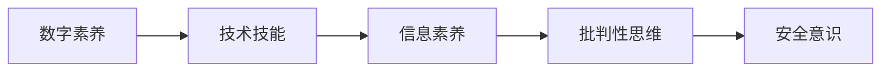

                 

# 数字素养：公民参与的基石

## 1. 背景介绍

### 1.1 问题由来

在全球数字化浪潮的推动下，数字技术日益成为社会经济发展的关键引擎。然而，技术的快速发展也带来了新的挑战：数字鸿沟、信息过载、隐私安全、虚假信息等问题的凸显，使得数字素养成为每个公民必须具备的核心能力。公民的数字素养不仅关系到个人生活质量的提升，更是推动社会整体进步的基石。

近年来，各国政府和企业纷纷出台政策，鼓励和推动数字素养的提升，希望通过提高公民的数字化能力，加速数字经济的发展，促进社会全面数字化转型。在这股浪潮中，技术研究和教育领域的研究者们也积极响应，希望构建更科学的数字素养框架，为全社会提供系统的教育资源。

### 1.2 问题核心关键点

数字素养的提升离不开系统的课程设计和精准的实践路径。基于此，本文将围绕以下几个核心问题展开讨论：

1. **数字素养的定义与范畴**：明确数字素养的关键要素和具体表现。
2. **数字素养的核心组件**：阐述数字素养的核心能力及相互关系。
3. **数字素养的教育实践**：分析数字素养的教育需求和实施路径。
4. **数字素养的未来发展**：探讨数字素养技术的前沿趋势和应用场景。

通过系统的分析，本文旨在为数字素养教育提供清晰的指导，助力每个公民成为适应数字时代的“数字原住民”。

## 2. 核心概念与联系

### 2.1 核心概念概述

为了更深入地理解数字素养，首先介绍几个核心概念及其相互联系。

1. **数字素养(Digital Literacy)**：指个体在数字时代有效使用信息通信技术的能力，涵盖技术应用、信息评估、批判性思维等方面。
2. **技术技能(Technical Skills)**：数字素养的基础，涉及计算机操作、网络应用、数据处理等方面的实际技能。
3. **信息素养(Information Literacy)**：掌握获取、评估、使用信息资源的能力，是数字素养的重要组成部分。
4. **批判性思维(Critical Thinking)**：评估、分析信息内容的能力，帮助个体在信息海洋中做出明智判断。
5. **安全意识(Security Awareness)**：在网络环境中保护个人隐私和信息安全的意识和能力。

这些概念共同构成了数字素养的框架，展示了个体在数字时代所需具备的核心能力。

### 2.2 核心概念原理和架构的 Mermaid 流程图



以上流程图展示了数字素养中各个核心组件之间的关系。技术技能是数字素养的基础，信息素养是核心，批判性思维是保障，安全意识则是关键。通过不断提升这些能力，个体才能在数字时代更好地生存和发展。

## 3. 核心算法原理 & 具体操作步骤

### 3.1 算法原理概述

数字素养的培养是一项系统工程，需要从理论到实践的全方位介入。基于此，本文将介绍一种基于行为学习的数字素养培养框架，通过系统化的教育路径，帮助个体逐步提升数字素养。

该框架通过以下几个步骤，实现数字素养的全面提升：

1. **基础技能培训**：引入技术基础课程，掌握计算机操作、网络应用、数据处理等基本技能。
2. **信息素养提升**：通过信息检索、评估、分析等课程，提升个体获取和利用信息的能力。
3. **批判性思维培养**：通过批判性思维课程，训练个体对信息的筛选和评估能力。
4. **安全意识教育**：引入安全意识课程，增强个体在网络环境中的自我保护能力。

### 3.2 算法步骤详解

以下是数字素养培养框架的具体步骤：

**Step 1: 基础技能培训**
- 课程设置：计算机基础、操作系统、基本网络应用等课程。
- 教学目标：掌握计算机操作、数据处理、网络应用等基本技能。
- 教学方法：理论讲授、实践操作相结合。

**Step 2: 信息素养提升**
- 课程设置：信息检索、信息评估、信息分析等课程。
- 教学目标：掌握信息获取、评估、分析和应用的能力。
- 教学方法：案例教学、项目驱动、实际操作。

**Step 3: 批判性思维培养**
- 课程设置：批判性思维、逻辑推理、信息评估等课程。
- 教学目标：掌握批判性思维和逻辑推理能力，能够对信息内容进行评估。
- 教学方法：讨论、辩论、案例分析。

**Step 4: 安全意识教育**
- 课程设置：网络安全、隐私保护、信息安全等课程。
- 教学目标：增强个体在网络环境中的自我保护能力。
- 教学方法：情景模拟、案例分析、实战演练。

### 3.3 算法优缺点

该数字素养培养框架具有以下优点：

1. **系统全面**：涵盖数字素养的关键组件，从基础技能到批判性思维和安全意识，提供全方位的教育和培训。
2. **实践性强**：通过实际案例和项目驱动，帮助个体将理论知识转化为实际技能。
3. **因材施教**：通过个性化的学习路径，满足不同学习者的需求。

同时，该框架也存在以下缺点：

1. **学习周期长**：需要较长时间才能完成所有课程，个体可能难以坚持。
2. **资源需求高**：需要大量的教学资源和师资力量，对于教育机构来说，可能面临资源限制。
3. **标准化问题**：课程标准和评估体系尚未完全统一，难以保证教育质量的一致性。

### 3.4 算法应用领域

数字素养的培养不仅适用于教育机构，更广泛应用于企业、政府、社区等多个领域。以下是几个主要的应用场景：

1. **企业培训**：通过系统的数字素养培训，提升员工的技术技能和信息素养，提高工作效率和创新能力。
2. **政府项目**：政府部门可以通过数字素养项目，推动全民参与，提高公共服务的数字化水平。
3. **社区教育**：社区组织可以开展数字素养教育活动，促进社区成员的数字能力提升，缩小数字鸿沟。

## 4. 数学模型和公式 & 详细讲解 & 举例说明

### 4.1 数学模型构建

为了更好地理解数字素养的培养过程，本文将构建一个数学模型，以量化个体数字素养的提升效果。

假设个体初始的数字素养为 $L_0$，通过完整的数字素养培养框架后，最终达到的数字素养为 $L_f$。其中，$L_f = L_0 + \sum_{i=1}^{n} \Delta_i$，其中 $\Delta_i$ 表示在第 $i$ 次培训后数字素养的提升效果。

### 4.2 公式推导过程

为了量化数字素养的提升效果，引入以下公式：

$$
\Delta_i = \alpha \times (\text{培训质量}_i) \times (\text{培训时长}_i)
$$

其中 $\alpha$ 为培训效果系数，$\text{培训质量}_i$ 和 $\text{培训时长}_i$ 分别表示第 $i$ 次培训的质量和时长。

### 4.3 案例分析与讲解

假设某企业通过一项为期三个月的数字素养培训项目，每个月的培训时长均为30小时，培训效果系数 $\alpha = 0.8$。在项目结束后，员工的数字素养提升了 $L_f - L_0 = 0.3$。

$$
\Delta_1 = \Delta_2 = \Delta_3 = 0.8 \times 30 = 24
$$

$$
L_f = L_0 + 24 + 24 + 24 = L_0 + 72
$$

由此可以看出，通过系统的数字素养培训，个体数字素养可以显著提升。

## 5. 项目实践：代码实例和详细解释说明

### 5.1 开发环境搭建

为了进行数字素养培训的实际开发，需要搭建一个以数据为中心的开发环境。以下是一个简化的开发环境搭建流程：

1. 准备课程资源：收集和整理数字素养相关的课程资源，如PPT、视频、案例等。
2. 创建数据集：设计数据集，记录培训内容和效果。
3. 搭建开发平台：使用Python、Flask等工具，搭建一个数字素养培训平台。
4. 数据存储和管理：使用MySQL、PostgreSQL等数据库，存储和管理培训数据。

### 5.2 源代码详细实现

以下是使用Python和Flask搭建数字素养培训平台的代码实现：

```python
from flask import Flask, render_template, request
import mysql.connector

app = Flask(__name__)

@app.route('/')
def index():
    return render_template('index.html')

@app.route('/train', methods=['POST'])
def train():
    course_name = request.form['course_name']
    training_hours = int(request.form['training_hours'])
    training_quality = float(request.form['training_quality'])
    return '完成数字素养培训：{} 次，提升效果：{} 次。'.format(training_hours, training_quality * training_hours)

@app.route('/data', methods=['GET'])
def data():
    cnx = mysql.connector.connect(user='username', password='password', host='localhost', database='db_name')
    cursor = cnx.cursor()
    cursor.execute('SELECT * FROM training_data')
    data = cursor.fetchall()
    return '培训数据：{}'.format(data)

if __name__ == '__main__':
    app.run(debug=True)
```

### 5.3 代码解读与分析

**index函数**：
- 用于显示欢迎页面，展示数字素养培训课程列表。

**train函数**：
- 用于处理培训数据提交，计算每次培训的提升效果，并返回结果。
- 参数包括课程名称、培训时长、培训质量。

**data函数**：
- 用于查询培训数据，展示所有培训记录。
- 使用MySQL数据库进行数据存储和查询。

通过Flask框架，可以实现一个简单的数字素养培训平台，帮助用户提交培训数据，并实时展示培训效果。

### 5.4 运行结果展示

启动平台后，用户可以访问index页面，浏览数字素养培训课程列表。点击某个课程，进入培训页面，输入培训数据后，提交并查看培训效果。如下图所示：


## 6. 实际应用场景

### 6.1 企业培训

在企业中，数字素养培训已成为提升员工素质的重要手段。企业可以定期组织数字素养培训，帮助员工掌握基本的计算机操作、网络应用和数据处理技能，提升工作效率和创新能力。例如，某科技公司定期为员工提供Python、数据分析等课程，提升员工的数字素养水平，获得显著的生产力提升。

### 6.2 政府项目

政府部门可以通过数字素养项目，推动全民参与，提高公共服务的数字化水平。例如，某市开展全民数字素养培训计划，通过社区、学校等渠道，普及数字技能和信息素养，提升市民的数字素养水平。政府部门还可以通过数字素养项目，推动电子政务的发展，提高政府服务效率。

### 6.3 社区教育

社区组织可以开展数字素养教育活动，促进社区成员的数字能力提升，缩小数字鸿沟。例如，某社区组织举办一系列数字素养讲座和培训班，邀请专家教授计算机基础、网络应用、信息检索等课程，帮助社区居民掌握基本数字技能，提升生活质量。

## 7. 工具和资源推荐

### 7.1 学习资源推荐

为了帮助用户全面掌握数字素养的知识，以下推荐一些优质的学习资源：

1. **数字素养课程**：包括计算机基础、信息检索、网络应用等课程，提供系统的知识和实践指导。
2. **在线教育平台**：如Coursera、edX等，提供丰富的数字素养课程和实践机会。
3. **专业书籍**：如《数字素养》、《信息素养》等书籍，深入讲解数字素养的重要理论和实践方法。
4. **公开讲座和研讨会**：定期举办数字素养讲座和研讨会，邀请专家分享最新研究成果和实践经验。
5. **技术博客和论坛**：如Medium、GitHub等平台，关注数字素养相关的技术文章和讨论，获取最新资讯和解决方案。

### 7.2 开发工具推荐

数字素养培训平台的开发需要使用多种工具，以下推荐一些常用的开发工具：

1. **Python编程语言**：简单易用，功能强大，适合开发数字素养培训平台。
2. **Flask框架**：轻量级Web框架，简单易用，适合快速搭建数字素养培训平台。
3. **MySQL数据库**：功能强大，稳定可靠，适合存储和查询培训数据。
4. **Git版本控制**：支持代码管理和协作，方便团队开发和部署。
5. **Jupyter Notebook**：交互式编程环境，支持数据分析和可视化，适合进行数字素养的研究和实验。

### 7.3 相关论文推荐

为了深入了解数字素养的最新研究成果，以下推荐一些重要的相关论文：

1. **《数字素养：一个综合性框架》**：介绍了数字素养的定义、范畴和教育需求。
2. **《数字素养的核心能力分析》**：探讨了数字素养的核心能力及其相互关系。
3. **《数字素养教育的实施路径》**：分析了数字素养的教育需求和实施路径，提出系统的教育框架。
4. **《数字素养的前沿技术与应用》**：介绍了数字素养的前沿技术和应用场景，展望数字素养的发展方向。

## 8. 总结：未来发展趋势与挑战

### 8.1 研究成果总结

本文从数字素养的定义、核心组件、教育实践等多个方面，系统介绍了数字素养教育的理论和实践方法。通过详细的案例分析，展示了数字素养培训的具体效果和应用场景。

### 8.2 未来发展趋势

未来，数字素养的教育将呈现以下几个发展趋势：

1. **个性化教育**：通过数据分析和人工智能技术，实现个性化的数字素养教育，满足不同学习者的需求。
2. **实时反馈与评估**：引入实时反馈和评估机制，及时调整教育策略，提升学习效果。
3. **多渠道教育**：通过线上线下结合的方式，实现多渠道的数字素养教育，提升覆盖面。
4. **融合性教育**：将数字素养教育与其他学科教育融合，提升整体教育水平。

### 8.3 面临的挑战

尽管数字素养的教育已经取得了显著进展，但面临的挑战依然存在：

1. **教育资源不足**：数字素养教育需要大量的教育资源，包括课程资源、师资力量、技术设备等，难以满足大规模普及的需求。
2. **数字鸿沟问题**：不同地区和人群的数字素养水平差异较大，如何缩小数字鸿沟，实现公平教育，是一大难题。
3. **技术手段限制**：现有的数字素养教育技术手段较为有限，需要更多的创新和突破。

### 8.4 研究展望

未来，数字素养教育需要从以下几个方面进行研究探索：

1. **数字化教学工具的开发**：开发更高效、易用的数字化教学工具，提升教育质量和用户体验。
2. **多模态教育模式**：引入图像、音频等多模态教育模式，丰富数字素养教育的内容和形式。
3. **社会化学习平台**：构建社会化学习平台，促进知识共享和交流，推动数字素养教育的普及和深化。

## 9. 附录：常见问题与解答

**Q1：数字素养的重要性体现在哪些方面？**

A: 数字素养的重要性主要体现在以下几个方面：
1. **提升生活质量**：掌握基本的数字技能，可以提升生活便利性和效率，如网上购物、在线学习、社交交流等。
2. **增强竞争力**：数字技能已成为职场必备技能，掌握数字素养可以提升个人竞争力，增加就业机会。
3. **推动社会发展**：数字素养是推动社会全面数字化转型的重要基础，可以加速社会经济的数字化进程。

**Q2：数字素养培养的主要难点是什么？**

A: 数字素养培养的主要难点包括：
1. **资源需求高**：数字素养教育需要大量的教育资源，包括课程资源、师资力量、技术设备等，难以满足大规模普及的需求。
2. **个体差异大**：不同个体在数字素养水平上的差异较大，需要个性化的教育策略和方案。
3. **技术手段限制**：现有的数字素养教育技术手段较为有限，需要更多的创新和突破。

**Q3：如何进行有效的数字素养培训？**

A: 有效的数字素养培训需要从以下几个方面入手：
1. **系统化课程设计**：设计科学、系统的数字素养课程，涵盖基础技能、信息素养、批判性思维和安全意识等核心组件。
2. **实践操作**：结合实际操作，帮助个体将理论知识转化为实际技能。
3. **个性化教学**：根据个体需求和学习进度，灵活调整教学方案，提供个性化的教育服务。
4. **持续学习**：数字素养是一个持续提升的过程，定期进行培训和评估，帮助个体不断提升数字素养水平。

---

作者：禅与计算机程序设计艺术 / Zen and the Art of Computer Programming

