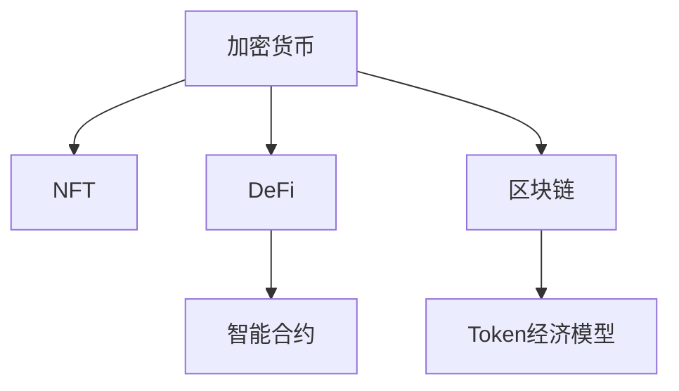

                 

# 数字资产创业：虚拟财产的价值挖掘

> 关键词：数字资产, 加密货币, NFT, 区块链, DeFi, 创业, 价值挖掘, 技术栈, 市场分析, 风险管理

## 1. 背景介绍

### 1.1 问题由来

随着互联网技术的快速发展和普及，数字资产作为一种新兴的虚拟财产形式，开始受到越来越多的关注。从最初的加密货币（如比特币、以太坊等），到近些年兴起的网络艺术（NFT）和去中心化金融（DeFi）等新兴领域，数字资产正在迅速改变着我们的生活方式和社会结构。

数字资产的兴起，不仅带来了巨大的投资机会，也孕育了广阔的创业空间。然而，这种新兴市场的复杂性和不确定性，使得数字资产创业充满了挑战和机遇。如何从众多项目中识别出真正的价值，如何将技术优势转化为商业价值，是每一位创业者都必须面对的问题。

### 1.2 问题核心关键点

数字资产创业的核心在于：

- **价值挖掘**：识别出具备长期增长潜力的数字资产，通过技术创新和市场分析，实现价值最大化。
- **风险管理**：面对数字资产市场的高波动性和不确定性，建立有效的风险管理体系，降低投资风险。
- **技术栈选择**：选择适合的技术工具和框架，提升项目的开发效率和系统安全性。
- **市场分析**：深入了解目标市场的特点和趋势，制定科学的创业策略。

## 2. 核心概念与联系

### 2.1 核心概念概述

为了更好地理解数字资产创业，本节将介绍几个关键概念：

- **加密货币**：基于区块链技术的虚拟货币，如比特币、以太坊等。通过加密算法保证交易的安全性和匿名性。
- **NFT（非同质化代币）**：表示特定资产的唯一性，如艺术品、游戏装备等。每个NFT都有独一无二的ID和元数据，可以用于数字艺术品交易、游戏资产等场景。
- **DeFi（去中心化金融）**：利用智能合约和区块链技术，实现无中介的金融服务，如借贷、交易、稳定币等。
- **区块链**：一种分布式账本技术，通过共识机制保证数据的透明性和不可篡改性。
- **智能合约**：基于区块链的自动执行合约，能够实现复杂的金融逻辑和业务流程。
- **Token经济模型**：数字资产项目中的代币发行和分配规则，影响项目的激励机制和治理结构。

这些概念之间的逻辑关系可以通过以下Mermaid流程图来展示：



这个流程图展示出数字资产创业中各个核心概念之间的关系：

1. **加密货币**：是数字资产的基础，通过区块链技术提供安全性和匿名性。
2. **NFT**：在加密货币的基础上，通过区块链的不可篡改性，实现独特资产的唯一性。
3. **DeFi**：利用区块链和智能合约，实现无中介的金融服务。
4. **区块链**：提供数字资产交易和智能合约执行的基础设施。
5. **智能合约**：在区块链上执行的自动合约，实现复杂的业务逻辑。
6. **Token经济模型**：定义项目的代币发行和分配规则，影响项目的激励机制和治理结构。

这些核心概念共同构成了数字资产创业的技术框架，使得创业项目能够在区块链和智能合约的基础上，提供创新的金融服务、数字资产交易和艺术品确权等业务。

## 3. 核心算法原理 & 具体操作步骤
### 3.1 算法原理概述

数字资产创业的核心算法原理主要集中在以下几个方面：

- **智能合约编程**：利用Solidity等编程语言，编写智能合约，实现自动化金融服务。
- **去中心化交易所（DEX）**：基于区块链的去中心化交易平台，实现无需中介的数字资产交易。
- **NFT创建与验证**：通过区块链的不可篡改性，实现NFT的创建、验证和交易。
- **Token经济模型设计**：设计合理的代币分配和激励机制，吸引用户参与和维持项目稳定。

这些算法原理和技术手段，共同构成了数字资产创业的基础。通过深入理解这些原理，可以更好地设计和实现数字资产项目，提升项目的竞争力和市场接受度。

### 3.2 算法步骤详解

数字资产创业的算法步骤通常包括以下几个关键环节：

1. **市场需求分析**：了解目标市场的特点和需求，寻找潜在的商业机会。
2. **技术方案设计**：根据市场需求，设计合适的技术方案，选择适合的技术工具和框架。
3. **智能合约编写**：利用Solidity等编程语言，编写智能合约，实现项目的核心功能。
4. **Token经济模型设计**：制定合理的Token发行和分配规则，设计激励机制和治理结构。
5. **项目上线和推广**：将项目部署到区块链上，并进行社区和市场的推广，吸引用户参与和投资。
6. **持续优化和迭代**：根据用户反馈和技术进展，持续优化和迭代项目，提升用户体验和系统安全性。

### 3.3 算法优缺点

数字资产创业的算法和工具具有以下优点：

- **去中心化和透明性**：区块链和智能合约保证了数据和交易的透明性和不可篡改性。
- **降低中介成本**：去中心化交易所（DEX）等技术减少了中介成本，提升了交易效率。
- **灵活性和可扩展性**：智能合约和区块链提供了高度的灵活性和可扩展性，能够适应复杂的业务需求。

同时，这些算法和工具也存在一些缺点：

- **技术门槛高**：智能合约和区块链技术的实现需要较高的技术门槛。
- **高波动性**：数字资产市场的高波动性和不确定性，增加了项目的风险。
- **监管环境复杂**：不同国家和地区对数字资产的监管政策不同，增加了项目的合规风险。

### 3.4 算法应用领域

数字资产创业的算法和技术主要应用于以下几个领域：

- **加密货币交易**：利用区块链和智能合约，实现加密货币的交易和结算。
- **NFT市场**：利用区块链的不可篡改性，实现数字艺术品、游戏资产等的创建、验证和交易。
- **去中心化金融（DeFi）**：利用区块链和智能合约，实现借贷、交易、稳定币等无中介的金融服务。
- **供应链管理**：利用区块链的透明性和不可篡改性，实现供应链的数字化和可追溯性。
- **身份验证**：利用区块链和NFT，实现去中心化的身份验证和数字身份管理。

这些应用领域展示了数字资产创业的广阔前景，为创业者提供了多样化的商业机会。

## 4. 数学模型和公式 & 详细讲解 & 举例说明（备注：数学公式请使用latex格式，latex嵌入文中独立段落使用 $$，段落内使用 $)
### 4.1 数学模型构建

在数字资产创业中，常使用以下数学模型进行项目评估和风险管理：

- **市场容量模型**：通过分析目标市场的需求和供应情况，预测市场容量和增长率。
- **技术栈选择模型**：根据项目需求和团队能力，选择合适的技术栈和工具。
- **风险管理模型**：基于历史数据和市场分析，构建风险评估和管理系统。
- **激励机制设计模型**：设计合理的Token分配和激励机制，促进用户参与和项目发展。

### 4.2 公式推导过程

以市场容量模型为例，其核心公式为：

$$
\text{市场容量} = \text{需求量} \times \text{价格}
$$

其中，需求量可以通过市场调研和数据分析得到，价格受市场供需关系和政策因素影响。通过计算市场容量，可以初步评估项目的潜在市场规模。

### 4.3 案例分析与讲解

假设某数字资产创业项目，目标市场是游戏内NFT交易，市场需求为每月10万枚NFT。根据当前市场价格，每枚NFT的平均交易价格为0.1美元。则市场容量为：

$$
\text{市场容量} = 10 \times 10^4 \times 0.1 = 1000\ (\text{美元/月})
$$

这意味着该市场每月有1000美元的潜在交易量。项目可以根据市场需求和技术实力，制定相应的业务发展策略。

## 5. 项目实践：代码实例和详细解释说明
### 5.1 开发环境搭建

在进行数字资产创业项目开发前，需要搭建好开发环境。以下是使用Python进行Solidity开发的环境配置流程：

1. 安装Anaconda：从官网下载并安装Anaconda，用于创建独立的Python环境。

2. 创建并激活虚拟环境：
```bash
conda create -n ethereum-env python=3.8
conda activate ethereum-env
```

3. 安装以太坊开发工具：
```bash
npm install -g truffle
```

4. 安装Solidity编译器和测试框架：
```bash
npm install -g solc
npm install -g ganache-cli
```

5. 安装区块链浏览器和钱包：
```bash
npm install -g etherscan-cli
```

6. 安装Git版本控制系统：
```bash
git init
```

完成上述步骤后，即可在`ethereum-env`环境中开始Solidity开发。

### 5.2 源代码详细实现

这里我们以NFT数字艺术品交易平台为例，给出使用Solidity进行NFT项目开发的PyTorch代码实现。

首先，定义NFT智能合约：

```solidity
pragma solidity ^0.8.0;

contract NFT {
    uint256 public totalSupply;
    mapping(uint256 => uint256) public owner;
    mapping(uint256 => string) public tokenURI;
    
    uint256 public tokenPrice;
    
    event Transfer(uint256 indexed tokenId, uint256 indexed buyer, uint256 indexed seller);
    
    constructor() public {
        totalSupply = 1000;
        tokenPrice = 0.1 ether;
    }
    
    function createToken(uint256 tokenId) public {
        owner[tokenId] = msg.sender;
        tokenURI[tokenId] = "https://example.com/artifact_" + tokenId;
    }
    
    function transferToken(uint256 tokenId) public {
        require(owner[tokenId] == msg.sender);
        owner[tokenId] = msg.sender;
        emit Transfer(tokenId, msg.sender, msg.sender);
    }
    
    function buyToken(uint256 tokenId) public payable {
        require(tokenId >= 0 && tokenId < totalSupply);
        require(msg.value == tokenPrice * 10 ** 18);
        owner[tokenId] = msg.sender;
        emit Transfer(tokenId, msg.sender, msg.sender);
    }
}
```

然后，定义智能合约的测试框架：

```javascript
const { ethers } = require('ethers');
const NFT = artifacts.require("NFT");

contract('NFT', accounts => {
    const owner = accounts[0];
    const tokenId = 1;
    
    before(async () => {
        await NFT.deployed();
    });
    
    it('createToken', async () => {
        await NFT.createToken(tokenId);
        assert.equal(await NFT.owner(tokenId), owner, 'token owner is not the creator');
    });
    
    it('buyToken', async () => {
        const wallet = new ethers.Wallet(web3.eth.defaultAccount.privateKey, ethers.utils.provider('http://localhost:8545'));
        await wallet.send('0x123456789', 10 * 10 ** 18);
        await NFT.buyToken(tokenId);
        assert.equal(await NFT.owner(tokenId), wallet, 'token owner is not the buyer');
    });
    
    it('transferToken', async () => {
        const receiver = accounts[1];
        await NFT.transferToken(tokenId, receiver);
        assert.equal(await NFT.owner(tokenId), receiver, 'token owner is not the receiver');
    });
});
```

最后，进行智能合约的测试和部署：

```javascript
const { web3 } = require('hardhat');
const NFT = artifacts.require("NFT");

async function main() {
    await NFT.deployed();
    console.log('NFT deployed at', NFT.address);
}

main().catch(console.error);
```

这就是使用Solidity对NFT项目进行开发的完整代码实现。可以看到，通过Solidity语言和Truffle框架，开发者可以快速编写和测试智能合约，将数字资产项目部署到区块链上。

### 5.3 代码解读与分析

让我们再详细解读一下关键代码的实现细节：

**NFT合约代码**：
- `createToken`方法：创建NFT，并将所有者设置为当前地址。
- `transferToken`方法：转移NFT所有权，更新所有者。
- `buyToken`方法：购买NFT，更新所有者，并记录交易信息。

**测试框架代码**：
- 使用`ethers`库创建钱包实例，用于模拟用户操作。
- 使用`Web3`库获取本地区块链网络。
- 在`it`块中，编写测试用例，使用`await`关键字等待合约部署后进行测试。

**部署代码**：
- 通过`main`函数调用`NFT.deployed()`方法，部署合约。
- 使用`console.log`输出合约地址，验证合约是否成功部署。

可以看到，Solidity语言和Truffle框架使得数字资产项目的开发变得更加高效和便捷。开发者可以专注于业务逻辑的实现，而不必过多关注底层的区块链操作。

## 6. 实际应用场景

### 6.1 数字资产交易平台

数字资产交易平台是数字资产创业中的核心应用场景。这些平台通常提供加密货币和NFT的交易、买卖、保管等基本功能，同时集成去中心化交易所（DEX），实现无中介的交易。

在实际应用中，交易平台需要处理大规模交易数据，保证交易的实时性和安全性。为此，可以采用分布式数据库和高性能计算集群，提升交易效率和系统稳定性。

### 6.2 去中心化金融（DeFi）应用

DeFi应用利用区块链和智能合约技术，提供去中心化的金融服务，如借贷、稳定币、去中心化交易所等。DeFi应用的出现，改变了传统金融体系的运行模式，降低了交易成本和中介费用。

DeFi应用的设计和实现需要深入理解区块链和智能合约的原理，选择适合的技术方案和开发工具。同时，需要注意金融系统的稳定性和安全性，设计合理的激励机制和治理结构。

### 6.3 供应链管理

区块链的透明性和不可篡改性，使其成为供应链管理的理想工具。通过区块链记录供应链各环节的交易和状态，实现供应链的数字化和可追溯性。

在实际应用中，供应链管理项目需要与企业现有信息系统集成，采集和存储供应链数据。同时，需要设计合适的激励机制和治理结构，确保供应链各方的协同合作。

### 6.4 数字身份管理

数字身份管理利用区块链和NFT技术，实现去中心化的身份验证和数字身份管理。通过区块链的不可篡改性，保障身份信息的安全和隐私。

在实际应用中，数字身份管理项目需要与现有身份认证系统集成，验证用户身份。同时，需要设计合理的激励机制和治理结构，确保身份信息的可靠性和安全性。

## 7. 工具和资源推荐
### 7.1 学习资源推荐

为了帮助开发者系统掌握数字资产创业的技术基础和实践技巧，这里推荐一些优质的学习资源：

1. 《加密货币开发指南》系列书籍：全面介绍了加密货币的原理、开发工具和实践经验。
2. 《区块链技术应用》课程：斯坦福大学开设的区块链技术课程，涵盖区块链基础和应用实践。
3. 《智能合约编程实战》书籍：详细介绍了Solidity语言和智能合约的开发技巧。
4. 《数字身份管理技术》课程：深入讲解数字身份管理和区块链技术的应用场景。
5. 以太坊官网文档：以太坊平台的官方文档，提供了丰富的开发资源和API接口。

通过对这些资源的学习实践，相信你一定能够快速掌握数字资产创业的核心技术，并用于解决实际的数字资产问题。

### 7.2 开发工具推荐

高效的开发离不开优秀的工具支持。以下是几款用于数字资产创业开发的常用工具：

1. Ethereum官网：以太坊官方资源平台，提供以太坊虚拟机（EVM）、Solidity语言、Truffle框架等资源。
2. Web3.js库：用于与以太坊区块链交互的JavaScript库，支持异步操作和事件监听。
3. Ganache CLI：本地以太坊测试网络，支持快速搭建和测试智能合约。
4. MetaMask钱包：支持以太坊区块链的浏览器插件，便于用户管理私钥和进行交易。
5. Infura API：以太坊节点提供商，提供API接口，便于开发者进行测试和开发。

合理利用这些工具，可以显著提升数字资产项目的开发效率，加快创新迭代的步伐。

### 7.3 相关论文推荐

数字资产创业的研究源于学界的持续探索。以下是几篇奠基性的相关论文，推荐阅读：

1. "Bitcoin: A Peer-to-Peer Electronic Cash System"（比特币白皮书）：比特币的创始人中本聪撰写的比特币白皮书，奠定了区块链技术的基础。
2. "The Decentralization of Finance"（去中心化金融）：以太坊创始人Vitalik Buterin撰写的DeFi白皮书，探讨了去中心化金融的未来发展方向。
3. "The Era of NFTs"（NFT时代）：以太坊官方博客文章，详细介绍了NFT技术的应用场景和未来前景。
4. "Smart Contracts: Security and Privacy"（智能合约安全与隐私）：以太坊官方博客文章，探讨了智能合约的安全性和隐私保护措施。
5. "Blockchain and Smart Contracts: Technical Foundations"（区块链与智能合约技术基础）：斯坦福大学区块链课程讲义，详细介绍了区块链和智能合约的基本原理和技术实现。

这些论文代表了大数字资产创业领域的研究进展，通过学习这些前沿成果，可以帮助研究者把握学科前进方向，激发更多的创新灵感。

## 8. 总结：未来发展趋势与挑战

### 8.1 总结

本文对数字资产创业中的虚拟财产价值挖掘进行了全面系统的介绍。首先阐述了数字资产创业的背景和核心概念，明确了价值挖掘、风险管理、技术栈选择、市场分析等关键环节的重要性。其次，从原理到实践，详细讲解了数字资产创业的算法原理和操作步骤，给出了具体的代码实例和详细解释。同时，本文还广泛探讨了数字资产创业在数字资产交易、DeFi应用、供应链管理、数字身份管理等多个领域的应用前景，展示了数字资产创业的广阔前景。此外，本文精选了数字资产创业的相关学习资源和开发工具，力求为读者提供全方位的技术指引。

通过本文的系统梳理，可以看到，数字资产创业中的虚拟财产价值挖掘是一个复杂而富有挑战性的过程。创业者需要在市场分析、技术选择、风险管理等多个环节进行全面考虑，才能将技术优势转化为商业价值。

### 8.2 未来发展趋势

展望未来，数字资产创业的趋势将呈现以下几个方面：

1. **技术创新不断**：区块链和智能合约技术的不断创新，将为数字资产创业带来更多新的应用场景和商业模式。
2. **市场竞争加剧**：随着数字资产市场的扩张，新的数字资产创业项目将不断涌现，竞争将更加激烈。
3. **去中心化治理**：DeFi等去中心化金融应用将推动数字资产创业向去中心化治理方向发展。
4. **NFT和元宇宙的融合**：NFT技术将与元宇宙应用深度结合，带来新的价值创造和消费模式。
5. **跨链技术的成熟**：跨链技术的成熟将打破不同区块链之间的壁垒，提升数字资产的流动性和互操作性。
6. **监管环境的完善**：数字资产市场的健康发展需要完善的市场监管环境，数字资产创业将更多关注合规性问题。

以上趋势凸显了数字资产创业的广阔前景，也为创业者提供了更多机会和挑战。

### 8.3 面临的挑战

尽管数字资产创业在近年来取得了显著进展，但在迈向更加智能化、普适化应用的过程中，仍面临诸多挑战：

1. **高波动性**：数字资产市场的高波动性和不确定性，增加了项目的风险。
2. **技术门槛高**：区块链和智能合约技术的实现需要较高的技术门槛，一般需要具备扎实的编程和加密知识。
3. **监管复杂**：不同国家和地区对数字资产的监管政策不同，增加了项目的合规风险。
4. **用户教育难度大**：数字资产市场的用户教育难度大，市场接受度不高。
5. **竞争激烈**：数字资产市场竞争激烈，成功项目少之又少。
6. **技术演进迅速**：区块链和智能合约技术的快速演进，要求创业者不断学习和适应新技术。

### 8.4 研究展望

为了应对数字资产创业面临的挑战，未来的研究需要在以下几个方面寻求新的突破：

1. **自动化交易和风控**：利用机器学习和深度学习技术，提升数字资产交易的自动化水平和风险管理能力。
2. **用户教育和市场推广**：通过技术普及和市场推广，提升数字资产市场的用户接受度和参与度。
3. **跨链互操作**：研究跨链互操作技术，实现不同区块链之间的无缝对接和信息共享。
4. **合规性和隐私保护**：建立合规性和隐私保护的机制，提升数字资产创业项目的合法性和用户信任度。
5. **区块链的可扩展性**：提升区块链的可扩展性和处理能力，适应大规模交易和数据存储需求。

这些研究方向的探索，必将引领数字资产创业技术迈向更高的台阶，为数字资产市场带来新的增长动力。

## 9. 附录：常见问题与解答

**Q1：数字资产创业是否需要区块链知识？**

A: 是的，数字资产创业需要深厚的区块链知识，特别是在智能合约和去中心化金融（DeFi）方面。区块链技术的实现和应用，是数字资产创业的重要基础。

**Q2：数字资产创业的风险如何管理？**

A: 数字资产创业的风险管理需要考虑多个方面，包括市场风险、技术风险、合规风险等。可以通过建立风险评估和管理系统，制定科学的投资策略和风险控制措施，降低项目风险。

**Q3：数字资产创业的技术栈如何选择？**

A: 数字资产创业的技术栈选择需要考虑项目需求、团队能力、市场环境等因素。通常采用Solidity语言进行智能合约开发，使用Web3.js库进行区块链交互，选择适合的区块链平台和分布式数据库，提升项目的开发效率和系统稳定性。

**Q4：数字资产创业的激励机制设计需要注意什么？**

A: 数字资产创业的激励机制设计需要考虑项目特点和用户需求，设计合理的Token分配和激励规则。激励机制应该具有透明性和公平性，能够激励用户参与和项目发展，同时避免过度激励导致的资源浪费。

**Q5：数字资产创业的持续优化和迭代有何建议？**

A: 数字资产创业的持续优化和迭代需要注重用户反馈和技术进展，不断改进项目功能和用户体验。同时，需要建立敏捷开发和快速迭代机制，提升项目灵活性和市场竞争力。

---

作者：禅与计算机程序设计艺术 / Zen and the Art of Computer Programming

