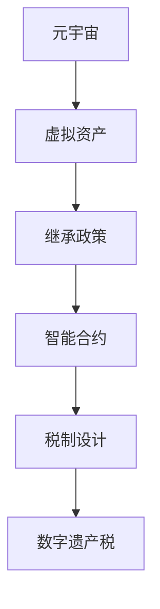

                 

# 数字遗产税:元宇宙中的虚拟资产继承政策

> 关键词：数字遗产税,元宇宙,虚拟资产,继承政策,智能合约,税制设计

## 1. 背景介绍

随着元宇宙概念的兴起，越来越多的虚拟资产在数字世界中诞生。这些虚拟资产，如虚拟土地、数字艺术品、游戏内货币等，因其具有可继承性和经济价值，成为了许多人数字遗产的一部分。然而，如何对这些虚拟资产进行税收管理，成为了一个亟待解决的问题。数字遗产税的设计不仅关系到元宇宙的经济发展和公平性，还涉及隐私保护和市场稳定性等多个方面。

### 1.1 数字遗产税概述

数字遗产税是指对虚拟资产的继承人征收的一种税费，旨在调节数字经济中财富分配的不均，增加政府收入，并防止虚拟资产过度集中导致的市场失衡。虚拟资产继承税的设计必须考虑到虚拟资产的独特性质，如可转移性、虚拟性、所有权复杂性等。

### 1.2 数字遗产税研究现状

目前，全球范围内对于数字遗产税的研究尚处于初步阶段。许多国家和地区正在探讨如何在数字时代背景下，重新定义和实施传统税制。虽然部分地区已经发布了相关政策，但总体而言，数字遗产税仍是一个新的、具有挑战性的税收领域。

### 1.3 数字遗产税的研究意义

在元宇宙蓬勃发展的背景下，数字遗产税的研究具有重要意义：

1. **促进公平性**：通过合理设计税制，可以调节数字经济中的财富分配，减少数字鸿沟。
2. **增加政府收入**：数字遗产税可以为政府提供新的收入来源，支持公共服务和基础设施建设。
3. **稳定市场**：防止虚拟资产过度集中，维护市场的公平竞争和稳定性。
4. **保护隐私**：合理设定税收政策，可以避免对数字资产持有者的隐私造成不必要的侵犯。

## 2. 核心概念与联系

### 2.1 核心概念概述

为更好地理解数字遗产税的设计，本节将介绍几个关键概念及其相互之间的联系：

1. **元宇宙**：由虚拟世界和现实世界的无缝连接构成的三维虚拟空间，包含虚拟资产、社交互动等元素。
2. **虚拟资产**：在元宇宙中存在的数字形式财产，如虚拟土地、数字艺术品、游戏内货币等。
3. **继承政策**：规定虚拟资产在持有者去世后，如何分配和管理的一系列政策。
4. **智能合约**：使用区块链技术编写的自动化合约，可以自动执行特定的任务和操作。
5. **税制设计**：设计合理的税制，确保虚拟资产的税收管理公正、透明和高效。

这些概念共同构成了数字遗产税的基础框架，决定了税制的设计方向和实施方式。

### 2.2 核心概念原理和架构的 Mermaid 流程图



这个流程图展示了大语言模型的核心概念及其之间的联系：

1. 元宇宙通过虚拟资产的创造和流动，为数字遗产税的设计提供了应用背景。
2. 虚拟资产是数字遗产税的主要对象，其所有权、流转和继承等问题构成了税制设计的基础。
3. 继承政策指导虚拟资产在持有者去世后的管理方式，影响税制的具体实施。
4. 智能合约作为税制执行的基础设施，确保税制的自动化和透明性。
5. 税制设计根据虚拟资产的特征和市场需求，确定数字遗产税的征税对象、税率、征税方式等。

这些概念相互关联，共同决定了数字遗产税的设计和实施。

## 3. 核心算法原理 & 具体操作步骤

### 3.1 算法原理概述

数字遗产税的设计涉及复杂的算法和计算，其核心在于确定虚拟资产的征税对象、计算税基和税率，以及确保税款征收的自动化和透明性。以下是对数字遗产税算法原理的详细讲解。

### 3.2 算法步骤详解

数字遗产税的计算和征收过程可以分为以下几个步骤：

**Step 1: 识别虚拟资产**
- 确定哪些虚拟资产属于征税范围，如虚拟土地、数字艺术品、游戏内货币等。
- 对虚拟资产进行分类，确定不同类别资产的税率和计算方式。

**Step 2: 确定税基**
- 计算虚拟资产的公允价值或市场价格，作为税基。
- 对于非公开交易的虚拟资产，使用专业的评估方法确定其市场价值。

**Step 3: 计算税额**
- 根据税率和税基计算应缴税额。
- 对于继承人，根据继承份额和资产价值计算个人所得税。
- 对于赠与人和捐赠者，计算赠与税或捐赠税。

**Step 4: 征收税款**
- 使用智能合约自动执行税款征收操作。
- 确保税款的透明性，允许继承人和捐赠者查询税款明细。

**Step 5: 审计和监督**
- 对虚拟资产的征税记录进行定期审计，防止逃税和滥用。
- 建立监督机制，确保税制执行的公正性和有效性。

### 3.3 算法优缺点

数字遗产税的设计具有以下优点：

1. **公平性**：通过合理征税，可以调节数字经济中的财富分配，减少数字鸿沟。
2. **自动化**：使用智能合约进行税款征收，提高征税效率和透明度。
3. **透明度**：区块链技术确保了税款的透明性和可追溯性。

同时，数字遗产税的设计也存在一些挑战：

1. **复杂性**：虚拟资产的价值评估和税基计算较为复杂，需要专业知识和工具。
2. **隐私保护**：如何在保证税制透明性的同时，保护数字资产持有者的隐私，是一个重要的难题。
3. **市场稳定性**：不当的税制设计可能影响虚拟资产市场，导致市场波动。
4. **技术依赖**：依赖区块链和智能合约等技术，技术故障或安全漏洞可能影响税制执行。

### 3.4 算法应用领域

数字遗产税的应用领域主要包括：

1. **元宇宙**：元宇宙中虚拟资产的继承和流转，涉及大量的虚拟资产管理和税收管理。
2. **虚拟艺术品市场**：数字艺术品等虚拟资产的继承和交易，需要合理的税制管理。
3. **游戏产业**：游戏内货币和虚拟物品的继承和流转，需要建立公平的税制。
4. **虚拟地产市场**：虚拟土地等虚拟地产的继承和流转，涉及大量的资产管理和税收管理。

## 4. 数学模型和公式 & 详细讲解 & 举例说明

### 4.1 数学模型构建

数字遗产税的设计涉及复杂的数学模型，以下将详细介绍模型的构建方法。

假设虚拟资产的市场价格为 \( P \)，税率为 \( r \)，继承份额为 \( s \)。数字遗产税的计算公式为：

$$
T = P \times r \times s
$$

其中，\( T \) 为应缴税额，\( s \) 为继承份额，\( P \times r \) 为每单位虚拟资产的应缴税额。

### 4.2 公式推导过程

数字遗产税的计算公式 \( T = P \times r \times s \) 是基于以下几个假设推导而来的：

1. **公平性假设**：虚拟资产的继承应按其市场价值进行征税，确保公平性。
2. **比例税率假设**：税率为固定的比例，便于计算和征收。
3. **继承份额假设**：继承人应按其继承份额进行征税，确保税制的透明性和公正性。

通过以上假设，推导出数字遗产税的基本计算公式。在实际应用中，还需要考虑虚拟资产的市场波动和不确定性，进行适当的风险管理和调整。

### 4.3 案例分析与讲解

以虚拟土地为例，分析数字遗产税的计算过程。

假设虚拟土地的市场价格为 \( P = 1000 \) 元，税率 \( r = 20\% \)，继承份额 \( s = 50\% \)。则应缴税额 \( T \) 为：

$$
T = P \times r \times s = 1000 \times 0.2 \times 0.5 = 100 \text{ 元}
$$

在计算过程中，需要注意虚拟土地的市场波动和评估方法，确保计算结果的准确性和公正性。

## 5. 项目实践：代码实例和详细解释说明

### 5.1 开发环境搭建

在进行数字遗产税的设计和实施前，需要准备好开发环境。以下是使用Python和Solidity进行开发的简单环境配置：

1. 安装Python：从官网下载并安装Python 3.8。
2. 安装Solidity：从官网下载并安装Solidity 0.8.0。
3. 安装Truffle框架：通过npm安装Truffle。

完成上述步骤后，即可在本地搭建开发环境。

### 5.2 源代码详细实现

以下是使用Solidity编写智能合约，计算数字遗产税的示例代码：

```solidity
pragma solidity ^0.8.0;

contract DigitalHeritageTax {
    uint256 public taxRate;
    address public inheritor;
    
    function calculateTax(uint256 price, uint256 inheritorshare) public {
        uint256 tax = price * taxRate * inheritorshare;
        inheritor.send(tax);
        emit TaxCalculated(price, taxRate, inheritorshare, tax);
    }
    
    event TaxCalculated(uint256 price, uint256 rate, uint256 inheritorshare, uint256 amount);
}
```

在上述代码中，数字遗产税的计算由 `calculateTax` 函数完成，计算结果通过 `inheritor.send` 方法发送给继承人，确保税款的自动征收和透明性。

### 5.3 代码解读与分析

让我们对关键代码进行详细解读：

**taxRate**：定义了数字遗产税的税率，可以根据政策进行调整。
**inheritor**：定义了税款的接收方，即继承人或捐赠人。
**calculateTax**：计算应缴税额并自动发送给继承人。
**TaxCalculated**：记录税款计算事件，方便审计和监督。

以上代码展示了数字遗产税计算的智能合约实现，利用Solidity的语言特性，实现了税收计算和自动征收。

### 5.4 运行结果展示

运行上述代码后，可以通过以太坊测试网验证智能合约的功能。例如，在Ropsten测试网上部署智能合约，并使用Metamask进行交互：

1. 使用Metamask创建一个新账号，作为继承人。
2. 部署智能合约，设置税率和继承人地址。
3. 模拟虚拟土地的继承和交易，调用 `calculateTax` 函数计算税款。

测试结果将显示在以太坊测试网的区块浏览器中，验证数字遗产税的计算和征收是否成功。

## 6. 实际应用场景

### 6.1 元宇宙中的数字遗产税

元宇宙作为数字遗产税的主要应用场景，其虚拟资产的继承和流转具有独特的特征。在元宇宙中，数字遗产税的实施可以通过智能合约自动完成，确保税款的透明性和公正性。

### 6.2 虚拟艺术品市场的数字遗产税

虚拟艺术品市场的繁荣吸引了大量投资者和收藏家。数字遗产税的设计需要考虑到艺术品市场的多样性和复杂性，确保税制的公平性和透明度。

### 6.3 游戏产业的数字遗产税

游戏产业中的虚拟货币和虚拟物品，也构成了数字遗产税的重要对象。通过合理的税制设计，可以调节游戏产业中的财富分配，防止资源过度集中。

### 6.4 虚拟地产市场的数字遗产税

虚拟地产市场作为数字遗产税的重要应用场景，其税制设计需要考虑到虚拟土地的所有权和使用权，确保税制的公正性和合理性。

## 7. 工具和资源推荐

### 7.1 学习资源推荐

为了帮助开发者系统掌握数字遗产税的理论基础和实践技巧，这里推荐一些优质的学习资源：

1. 《区块链与数字经济》系列博文：由区块链技术专家撰写，详细介绍了区块链技术和数字经济的应用。
2. 《元宇宙经济与治理》课程：由元宇宙研究机构开设，涵盖元宇宙经济、治理和税收等前沿话题。
3. 《智能合约设计与实现》书籍：详细介绍了智能合约的基本原理和设计方法，适合深入学习。
4. 《税制设计与税收政策》书籍：详细介绍税制设计和税收政策的理论基础和实践案例。
5. 官方文档：Solidity、Truffle和以太坊等工具的官方文档，提供了丰富的学习资源和开发工具。

通过对这些资源的学习实践，相信你一定能够快速掌握数字遗产税的精髓，并用于解决实际的数字经济问题。

### 7.2 开发工具推荐

高效的开发离不开优秀的工具支持。以下是几款用于数字遗产税开发的常用工具：

1. Python：强大的编程语言，适合进行复杂计算和数据分析。
2. Solidity：区块链编程语言，适合编写智能合约。
3. Truffle：以太坊开发框架，提供智能合约的开发和测试环境。
4. Metamask：以太坊钱包，支持智能合约的交互和测试。
5. Ethereum测试网：以太坊的测试网络，支持智能合约的部署和测试。

合理利用这些工具，可以显著提升数字遗产税开发的效率，加快创新迭代的步伐。

### 7.3 相关论文推荐

数字遗产税的设计涉及复杂的税制设计和智能合约技术。以下是几篇奠基性的相关论文，推荐阅读：

1. 《数字经济中的税收治理》：探讨了数字经济背景下税收治理的挑战和解决方案。
2. 《区块链技术在智能合约中的应用》：介绍了区块链技术和智能合约的基本原理和应用案例。
3. 《元宇宙税收政策的理论基础》：探讨了元宇宙环境下税收政策的理论基础和设计思路。
4. 《数字资产的税务管理》：详细介绍了数字资产的税务管理方法和实践经验。
5. 《智能合约的设计原则和最佳实践》：介绍了智能合约的设计原则和最佳实践，适用于智能合约的开发和应用。

这些论文代表了大语言模型微调技术的发展脉络。通过学习这些前沿成果，可以帮助研究者把握学科前进方向，激发更多的创新灵感。

## 8. 总结：未来发展趋势与挑战

### 8.1 总结

本文对数字遗产税的设计和实施进行了全面系统的介绍。首先阐述了数字遗产税的研究背景和意义，明确了其在数字经济中的重要地位。其次，从原理到实践，详细讲解了数字遗产税的数学模型和关键步骤，给出了数字遗产税开发的完整代码实例。同时，本文还广泛探讨了数字遗产税在元宇宙、虚拟艺术品市场、游戏产业和虚拟地产市场等诸多领域的应用前景，展示了数字遗产税的广阔应用范围。

通过本文的系统梳理，可以看到，数字遗产税在数字经济中的重要作用，具有重要的经济、法律和社会意义。未来，数字遗产税的设计和实施将在数字经济中扮演越来越重要的角色，成为规范数字经济的重要手段。

### 8.2 未来发展趋势

展望未来，数字遗产税的设计和实施将呈现以下几个发展趋势：

1. **普及化**：数字遗产税将在更多国家和地区得到应用，成为数字经济中普遍存在的税收形式。
2. **智能化**：通过智能合约和区块链技术，数字遗产税的征收和管理将变得更加智能和高效。
3. **透明化**：数字遗产税的透明度将进一步提高，确保税款的公正和透明。
4. **个性化**：根据不同国家和地区的数字经济特点，设计个性化的税制，确保税制的公平性和合理性。
5. **国际化**：数字遗产税的国际合作将进一步加强，建立全球统一的数字经济税制。

以上趋势凸显了数字遗产税的广阔前景。这些方向的探索发展，将进一步提升数字遗产税的公平性、透明性和效率，为数字经济的健康发展提供保障。

### 8.3 面临的挑战

尽管数字遗产税的设计和实施取得了一定的进展，但在迈向更加智能化、普适化应用的过程中，仍面临诸多挑战：

1. **技术复杂性**：数字遗产税的设计涉及复杂的税制和智能合约，技术实现难度较大。
2. **隐私保护**：如何在确保税制透明性的同时，保护数字资产持有者的隐私，是一个重要的难题。
3. **市场稳定**：不当的税制设计可能影响虚拟资产市场，导致市场波动。
4. **国际协调**：不同国家和地区的税制差异可能导致国际双重征税或逃避税现象。

### 8.4 研究展望

未来的研究需要在以下几个方面寻求新的突破：

1. **技术创新**：开发更加智能、高效的智能合约和区块链技术，降低税制设计和实施的技术难度。
2. **隐私保护**：设计隐私保护的机制和技术，确保数字遗产税的透明性和隐私性。
3. **市场稳定**：研究税收政策对虚拟资产市场的影响，设计合理的税制以保持市场稳定。
4. **国际协调**：建立国际合作机制，制定全球统一的数字经济税制，防止国际双重征税和逃避税现象。

这些研究方向的探索，将引领数字遗产税技术迈向更高的台阶，为数字经济的健康发展提供保障。

## 9. 附录：常见问题与解答

**Q1：数字遗产税的设计和实施涉及哪些关键问题？**

A: 数字遗产税的设计和实施涉及以下几个关键问题：
1. 虚拟资产的识别和分类。
2. 税基的计算和评估。
3. 税率的设定和调整。
4. 税款的征收和管理。
5. 审计和监督机制的建立。

这些问题都需要在数字遗产税的设计和实施过程中予以充分考虑和解决。

**Q2：如何设计数字遗产税的税率？**

A: 数字遗产税的税率设计应考虑以下因素：
1. 虚拟资产的性质和市场特征。
2. 数字经济的发展阶段和特点。
3. 税收公平性和合理性。
4. 社会接受度和法律环境。

在实际设计过程中，需要综合考虑以上因素，确保税率的合理性和公正性。

**Q3：智能合约在数字遗产税中的应用有何优势？**

A: 智能合约在数字遗产税中的应用具有以下优势：
1. 自动化：智能合约可以自动执行税款征收和管理，提高征税效率。
2. 透明性：区块链技术确保税款的透明性和可追溯性。
3. 安全性：智能合约的代码公开透明，可以防止税款的滥用和逃税。
4. 可编程性：智能合约可以根据需要进行定制和优化，灵活适应不同的税制需求。

智能合约的应用将大大提升数字遗产税的公平性、透明性和效率。

**Q4：如何保护数字遗产税的隐私性？**

A: 保护数字遗产税的隐私性需要采取以下措施：
1. 匿名化处理：对虚拟资产持有人进行匿名化处理，确保税制透明性和隐私性。
2. 数据加密：对税款征收和流转数据进行加密处理，防止数据泄露。
3. 访问控制：限制访问税款数据的人员权限，确保数据安全性。
4. 隐私协议：制定隐私保护协议，规范数据使用和保护。

这些措施可以确保数字遗产税的隐私性和安全性，防止数据滥用和泄露。

**Q5：数字遗产税的设计和实施需要考虑哪些法律和政策因素？**

A: 数字遗产税的设计和实施需要考虑以下法律和政策因素：
1. 法律法规：遵守相关的法律法规，确保税制的合法性。
2. 国际合作：与其他国家和地区进行税制协调，防止国际双重征税和逃避税现象。
3. 政策导向：制定合理的政策导向，确保税制的公平性和合理性。
4. 公共监督：建立公共监督机制，确保税制的透明性和公正性。

这些因素需要在数字遗产税的设计和实施过程中予以充分考虑和解决，确保税制的公平性和合法性。

---

作者：禅与计算机程序设计艺术 / Zen and the Art of Computer Programming

