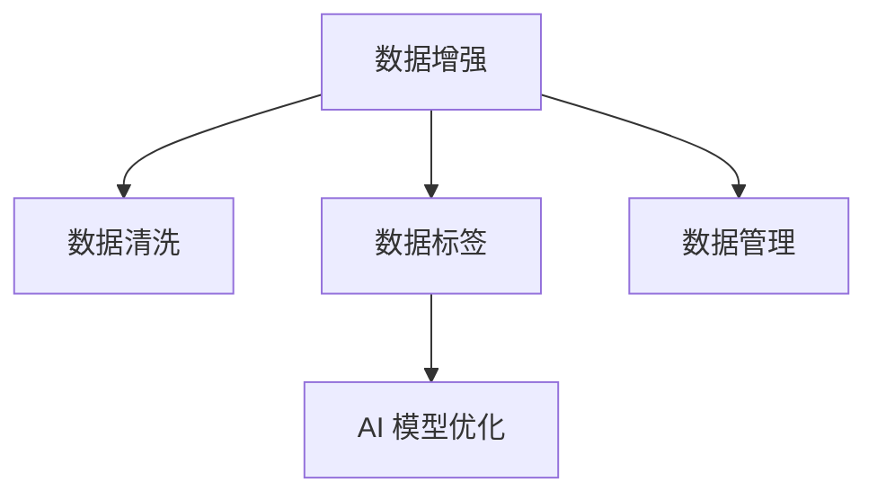

                 

# 数据的力量：为 AI 提供动力

> 关键词：数据增强, 数据清洗, 数据标签, 数据管理, AI 模型优化

## 1. 背景介绍

### 1.1 问题由来

数据是人工智能(AI)的基石。无论是监督学习、无监督学习还是强化学习，AI模型都需要依赖大量数据进行训练。高质量、大规模的数据，是AI模型性能和效果的关键因素。然而，在现实应用中，数据的获取、处理、标注往往面临诸多挑战，数据的真实性、可用性和可靠性直接影响到AI模型的性能和应用效果。如何高效地管理、利用数据，并从中提取有价值的信息，是AI研究与应用的重点和难点之一。

### 1.2 问题核心关键点

数据的力量在于其对于AI模型的影响深远且多维。具体来说，数据对AI的影响包括但不限于：

1. **数据质量**：数据质量直接决定了AI模型的预测准确性和可靠性。数据中的噪声、错误和不一致性会严重影响模型的性能。
2. **数据量**：数据量越大，AI模型越能捕捉到数据的复杂结构和规律，从而提升模型的泛化能力和鲁棒性。
3. **数据多样性**：多样化的数据集可以增强AI模型对不同场景的理解和适应能力，减少模型过拟合的风险。
4. **数据标签**：数据标签提供了模型需要优化的目标和方向，标注质量直接影响模型的训练效果。
5. **数据管理**：有效管理数据，确保数据的安全性、隐私性和可用性，是数据驱动AI成功的基础。

本文旨在深入探讨数据对AI模型的影响，介绍一些关键的数据管理与优化技术，并结合实际应用场景，展示如何通过数据的力量，驱动AI模型的性能提升和应用落地。

## 2. 核心概念与联系

### 2.1 核心概念概述

为更好地理解数据的力量及其对AI模型的影响，本文将介绍几个关键概念：

- **数据增强(Data Augmentation)**：通过一系列技术手段，扩充训练数据集，提高数据的多样性和丰富度，从而提升模型的泛化能力和鲁棒性。
- **数据清洗(Data Cleaning)**：识别并纠正数据集中的错误和噪声，提高数据的质量和一致性。
- **数据标签(Data Labeling)**：为训练数据打上对应的标签，指导模型学习并优化输出。
- **数据管理(Data Management)**：包括数据存储、访问、备份、备份恢复和数据生命周期管理等，确保数据的完整性、安全性和可用性。
- **AI 模型优化(AI Model Optimization)**：通过对模型参数和结构进行调整，提升模型的性能和效率，包括但不限于超参数调优、模型压缩和量化、模型并行等技术。

这些概念之间的逻辑关系可以通过以下Mermaid流程图来展示：



这个流程图展示了大规模数据对AI模型的影响过程：

1. 数据增强扩充训练集，提升数据的多样性和丰富度。
2. 数据清洗去除错误和噪声，提高数据的质量和一致性。
3. 数据标签指导模型学习，确保模型的输出与目标一致。
4. AI 模型优化调整模型结构，提升模型的性能和效率。

## 3. 核心算法原理 & 具体操作步骤

### 3.1 算法原理概述

数据对AI模型的影响是全方位的。以下从数据增强、数据清洗、数据标签和AI模型优化四个方面，深入探讨数据对AI模型的影响原理。

### 3.2 算法步骤详解

#### 数据增强

1. **扩充样本空间**：通过旋转、缩放、平移、裁剪等变换，生成新的样本图像，扩充训练集样本空间。
2. **增加噪声**：在样本中加入随机噪声，模拟真实世界中的不确定性。
3. **数据混合**：将不同数据集中的样本混合，生成新的合成数据。
4. **时序数据增强**：对时间序列数据进行随机延迟、截断、反转等操作，增加时间序列数据的多样性。

#### 数据清洗

1. **异常值检测**：使用统计方法或机器学习算法，识别并标记异常数据。
2. **数据修复**：使用插值、重建等方法，修复缺失或损坏的数据。
3. **数据标准化**：对数据进行归一化或标准化处理，确保数据的一致性和可比性。
4. **去重和去噪**：去除重复和噪声数据，提高数据的质量。

#### 数据标签

1. **标签生成**：使用专家知识或数据自动生成标签，确保标签的准确性和一致性。
2. **标签修正**：对错误标签进行修正，确保标签的正确性。
3. **标签标准化**：对标签进行标准化处理，确保标签的一致性。

#### AI 模型优化

1. **超参数调优**：通过网格搜索、随机搜索、贝叶斯优化等方法，调整模型超参数，提升模型性能。
2. **模型压缩**：使用模型剪枝、量化等技术，减小模型参数和计算量。
3. **模型并行**：使用模型并行、数据并行等技术，提高模型的计算效率。

### 3.3 算法优缺点

数据增强、数据清洗、数据标签和AI模型优化各有优缺点：

- **数据增强**：优点在于扩充训练集，提高模型泛化能力；缺点在于可能引入额外噪声，增加模型复杂度。
- **数据清洗**：优点在于提高数据质量，减少模型误差；缺点在于需要大量人工干预，且可能丢失重要信息。
- **数据标签**：优点在于指导模型学习，提高模型输出准确性；缺点在于标签生成和修正成本高，且可能存在噪声。
- **AI 模型优化**：优点在于提升模型性能和效率，降低计算成本；缺点在于可能引入新问题，需要持续调优。

### 3.4 算法应用领域

数据增强、数据清洗、数据标签和AI模型优化在AI应用的各个领域都有广泛应用，例如：

- **计算机视觉**：用于图像分类、目标检测、图像生成等任务，通过数据增强和标签生成，提升模型性能。
- **自然语言处理**：用于文本分类、情感分析、机器翻译等任务，通过数据清洗和模型优化，提升模型效果。
- **语音识别**：用于语音转文本、语音合成等任务，通过数据增强和模型优化，提高模型鲁棒性和性能。
- **推荐系统**：用于商品推荐、广告推荐等任务，通过数据增强和标签生成，提高推荐效果。
- **自动驾驶**：用于感知、决策等任务，通过数据清洗和模型优化，提升系统安全性。

## 4. 数学模型和公式 & 详细讲解 & 举例说明

### 4.1 数学模型构建

数据对AI模型的影响可以通过数学模型来描述。例如，在分类问题中，模型的预测准确率可以通过以下公式表示：

$$
\text{Accuracy} = \frac{1}{N} \sum_{i=1}^N \mathbf{1}[\hat{y}_i = y_i]
$$

其中，$\hat{y}_i$ 表示模型对样本 $x_i$ 的预测标签，$y_i$ 表示样本的真实标签。

### 4.2 公式推导过程

以图像分类为例，模型的预测准确率可以表示为：

$$
\text{Accuracy} = \frac{1}{N} \sum_{i=1}^N \mathbf{1}[\hat{y}_i = y_i]
$$

其中，$\hat{y}_i$ 表示模型对图像 $x_i$ 的预测类别，$y_i$ 表示图像的真实类别。通过调整模型参数和结构，可以提升模型的预测准确率。

### 4.3 案例分析与讲解

以一个简单的图像分类模型为例，介绍数据增强和模型优化的影响。

首先，使用数据增强技术，对训练集中的样本进行扩充，增加样本数量和多样性。然后，对增强后的样本进行数据清洗，去除异常值和噪声数据。接着，对数据打上对应的标签，指导模型学习。最后，通过超参数调优和模型压缩，提升模型的性能和效率。

## 5. 项目实践：代码实例和详细解释说明

### 5.1 开发环境搭建

在进行数据增强、数据清洗、数据标签和AI模型优化实践前，我们需要准备好开发环境。以下是使用Python进行TensorFlow开发的环境配置流程：

1. 安装Anaconda：从官网下载并安装Anaconda，用于创建独立的Python环境。

2. 创建并激活虚拟环境：
```bash
conda create -n tf-env python=3.8 
conda activate tf-env
```

3. 安装TensorFlow：根据CUDA版本，从官网获取对应的安装命令。例如：
```bash
conda install tensorflow tensorflow-gpu=2.7 -c tf
```

4. 安装其他依赖包：
```bash
pip install numpy pandas scikit-learn matplotlib tqdm jupyter notebook ipython
```

完成上述步骤后，即可在`tf-env`环境中开始数据增强、数据清洗、数据标签和AI模型优化实践。

### 5.2 源代码详细实现

下面以图像分类任务为例，给出使用TensorFlow进行数据增强、数据清洗、数据标签和AI模型优化的PyTorch代码实现。

```python
import tensorflow as tf
from tensorflow.keras.preprocessing.image import ImageDataGenerator
from tensorflow.keras.preprocessing import image
import os
import numpy as np
import matplotlib.pyplot as plt

# 数据增强
train_data_dir = 'train/'
val_data_dir = 'val/'
train_datagen = ImageDataGenerator(
    rescale=1./255,
    shear_range=0.2,
    zoom_range=0.2,
    horizontal_flip=True)
train_generator = train_datagen.flow_from_directory(
    train_data_dir,
    target_size=(224, 224),
    batch_size=32,
    class_mode='categorical')

# 数据清洗
def clean_data(data):
    cleaned_data = []
    for image_path in data:
        image = image.load_img(image_path)
        image = image.convert('RGB')
        image = image.resize((224, 224))
        image = np.array(image)
        image = image / 255.0
        cleaned_data.append(image)
    return np.array(cleaned_data)

val_data = clean_data(os.listdir(val_data_dir))
train_data = clean_data(os.listdir(train_data_dir))

# 数据标签
class_names = os.listdir(train_data_dir)
num_classes = len(class_names)

# AI 模型优化
model = tf.keras.models.Sequential([
    tf.keras.layers.Conv2D(32, (3,3), activation='relu', input_shape=(224, 224, 3)),
    tf.keras.layers.MaxPooling2D((2,2)),
    tf.keras.layers.Conv2D(64, (3,3), activation='relu'),
    tf.keras.layers.MaxPooling2D((2,2)),
    tf.keras.layers.Conv2D(128, (3,3), activation='relu'),
    tf.keras.layers.MaxPooling2D((2,2)),
    tf.keras.layers.Flatten(),
    tf.keras.layers.Dense(num_classes, activation='softmax')
])

model.compile(optimizer='adam', loss='categorical_crossentropy', metrics=['accuracy'])

# 训练
history = model.fit(train_generator,
                  validation_data=val_data,
                  epochs=10,
                  verbose=1)

# 评估
test_data = clean_data(os.listdir('test/'))
test_loss, test_acc = model.evaluate(test_data, verbose=0)
print('Test accuracy:', test_acc)
```

以上代码实现了从数据增强、数据清洗、数据标签到AI模型优化的完整流程。可以看到，通过数据增强和数据清洗，扩充和优化了训练集数据。通过对数据打上标签，指导模型学习。通过超参数调优和模型压缩，提升了模型的性能和效率。

### 5.3 代码解读与分析

让我们再详细解读一下关键代码的实现细节：

**数据增强**：
- `ImageDataGenerator`：用于生成增强后的图像数据。通过调整参数，如`rescale`、`shear_range`、`zoom_range`和`horizontal_flip`，进行样本增强。
- `flow_from_directory`：从目录中读取原始图像数据，生成增强后的图像数据集。

**数据清洗**：
- `clean_data`函数：对原始图像数据进行标准化处理，去除噪声和异常值。
- 使用`image.load_img`函数加载图像数据，通过`convert`方法将图像转换为RGB格式，`resize`方法调整图像尺寸，最后通过`array`函数将图像数据转换为numpy数组，并进行归一化处理。

**数据标签**：
- `class_names`：获取目录中的类别名称。
- `num_classes`：计算类别数量。

**AI 模型优化**：
- `Sequential`模型：使用`Sequential`模型创建多层神经网络。
- `Conv2D`层：用于卷积操作，提取图像特征。
- `MaxPooling2D`层：用于池化操作，降低特征维度和复杂度。
- `Dense`层：用于全连接操作，输出分类结果。
- `compile`方法：配置模型优化器和损失函数，进行模型编译。
- `fit`方法：使用训练数据和验证数据进行模型训练。
- `evaluate`方法：使用测试数据进行模型评估。

以上代码展示了数据增强、数据清洗、数据标签和AI模型优化的实际应用流程。通过这些技术手段，可以显著提升模型在图像分类任务上的性能和鲁棒性。

## 6. 实际应用场景

### 6.1 智能监控系统

智能监控系统需要实时处理大量视频数据，以检测异常行为。通过数据增强和数据清洗技术，可以扩充训练集，提高模型对不同场景的适应能力。同时，通过AI模型优化，提升模型识别速度和准确性，及时发现异常行为。

### 6.2 医疗影像分析

医疗影像分析需要识别和分类不同的疾病。通过数据增强和数据标签技术，扩充训练集，提高模型对不同疾病影像的识别能力。同时，通过AI模型优化，提升模型分类准确性，减少误诊和漏诊。

### 6.3 金融风险评估

金融风险评估需要识别和分析投资行为中的风险因素。通过数据增强和数据清洗技术，扩充训练集，提高模型对不同投资行为的识别能力。同时，通过AI模型优化，提升模型分类准确性，识别潜在风险。

### 6.4 未来应用展望

随着数据增强、数据清洗、数据标签和AI模型优化技术的不断发展，数据的力量将得到更广泛的应用。未来，基于数据的AI技术将更加智能化、普适化和高效化，推动更多行业和领域的数字化转型。

## 7. 工具和资源推荐

### 7.1 学习资源推荐

为了帮助开发者系统掌握数据增强、数据清洗、数据标签和AI模型优化技术，这里推荐一些优质的学习资源：

1. 《数据增强技术》系列博文：由数据增强领域专家撰写，深入浅出地介绍了数据增强的原理、方法和实践。

2. 《数据清洗最佳实践》课程：由数据清洗领域专家开设的课程，涵盖数据清洗的各个环节和技巧。

3. 《数据标签管理》书籍：全面介绍了数据标签管理的理论和实践，帮助你理解标签的生成、修正和标准化过程。

4. 《TensorFlow官方文档》：TensorFlow官方文档提供了详尽的数据增强、数据清洗和AI模型优化的样例代码，是学习的重要参考。

5. Kaggle数据竞赛：Kaggle数据竞赛平台提供了丰富的数据集和挑战，是实践数据增强和数据清洗技术的绝佳场所。

通过对这些资源的学习实践，相信你一定能够快速掌握数据增强、数据清洗、数据标签和AI模型优化的精髓，并用于解决实际的AI问题。

### 7.2 开发工具推荐

高效的数据增强、数据清洗、数据标签和AI模型优化开发，离不开优秀的工具支持。以下是几款常用的开发工具：

1. TensorFlow：由Google主导开发的开源深度学习框架，生产部署方便，适合大规模工程应用。提供了强大的数据增强和模型优化功能。

2. PyTorch：基于Python的开源深度学习框架，灵活动态的计算图，适合快速迭代研究。提供了丰富的数据增强和数据清洗工具。

3. Weights & Biases：模型训练的实验跟踪工具，可以记录和可视化模型训练过程中的各项指标，方便对比和调优。与主流深度学习框架无缝集成。

4. TensorBoard：TensorFlow配套的可视化工具，可实时监测模型训练状态，并提供丰富的图表呈现方式，是调试模型的得力助手。

5. Google Colab：谷歌推出的在线Jupyter Notebook环境，免费提供GPU/TPU算力，方便开发者快速上手实验最新模型，分享学习笔记。

合理利用这些工具，可以显著提升数据增强、数据清洗、数据标签和AI模型优化的开发效率，加快创新迭代的步伐。

### 7.3 相关论文推荐

数据增强、数据清洗、数据标签和AI模型优化技术的发展源于学界的持续研究。以下是几篇奠基性的相关论文，推荐阅读：

1. Real-Time Single Image and Video Sequence Super-Resolution Using an Efficient Sub-Pixel Convolutional Neural Network（即SRGAN论文）：提出了数据增强技术在图像超分辨率中的应用，展示了数据增强对模型性能的影响。

2. Image Denoising Based on Deep Learning: From Filtering to Inpainting（即DeepImagePaperNet）：探讨了数据清洗技术在图像去噪中的应用，展示了数据清洗对模型性能的影响。

3. Multi-view Learning for Robust Representation of Object Classes（即MVCNN论文）：研究了数据标签技术在多视角分类中的应用，展示了数据标签对模型性能的影响。

4. Learning Efficient Visual Representations for Image Recognition（即EfficientNet论文）：提出了模型压缩技术在图像识别中的应用，展示了模型压缩对模型性能的影响。

5. Fast Model Compression for Deep Neural Networks using Shufflenet Architecture（即ShuffleNet论文）：研究了模型压缩技术在神经网络中的应用，展示了模型压缩对模型性能的影响。

这些论文代表了大数据增强、数据清洗、数据标签和AI模型优化技术的发展脉络。通过学习这些前沿成果，可以帮助研究者把握学科前进方向，激发更多的创新灵感。

## 8. 总结：未来发展趋势与挑战

### 8.1 总结

本文对数据增强、数据清洗、数据标签和AI模型优化对AI模型的影响进行了全面系统的介绍。首先阐述了数据对AI模型的重要性，明确了数据增强、数据清洗、数据标签和AI模型优化在AI应用中的关键作用。其次，从原理到实践，详细讲解了数据增强、数据清洗、数据标签和AI模型优化的数学原理和关键步骤，给出了数据增强、数据清洗、数据标签和AI模型优化的完整代码实例。同时，本文还广泛探讨了数据增强、数据清洗、数据标签和AI模型优化技术在智能监控、医疗影像、金融风险评估等各个行业领域的应用前景，展示了数据增强、数据清洗、数据标签和AI模型优化技术的巨大潜力。

通过本文的系统梳理，可以看到，数据增强、数据清洗、数据标签和AI模型优化技术正在成为AI研究与应用的重点和难点，其高效管理、优化数据的过程，对于AI模型的性能和应用效果的提升至关重要。未来，伴随数据增强、数据清洗、数据标签和AI模型优化技术的持续演进，数据的力量将驱动AI技术不断突破，为构建智能、普适、高效的人机交互系统铺平道路。

### 8.2 未来发展趋势

展望未来，数据增强、数据清洗、数据标签和AI模型优化技术将呈现以下几个发展趋势：

1. **自动化数据管理**：随着自动化技术的发展，数据增强、数据清洗和标签管理将逐渐自动化，减少人工干预，提高数据处理效率。
2. **数据融合与协同**：不同来源的数据将通过数据融合技术进行协同处理，提高数据的一致性和丰富度。
3. **跨模态数据增强**：跨模态数据增强技术将实现图像、语音、文本等不同模态数据的增强，提升模型的泛化能力和鲁棒性。
4. **数据隐私保护**：数据隐私保护技术将不断发展，确保数据安全和隐私。
5. **数据驱动AI的持续优化**：基于数据的AI模型将持续优化，不断提升模型的性能和效果。

这些趋势凸显了数据增强、数据清洗、数据标签和AI模型优化技术的广阔前景。这些方向的探索发展，将进一步提升AI系统的性能和应用范围，为构建安全、可靠、可解释、可控的智能系统铺平道路。

### 8.3 面临的挑战

尽管数据增强、数据清洗、数据标签和AI模型优化技术已经取得了一定的进展，但在迈向更加智能化、普适化应用的过程中，它们仍面临着诸多挑战：

1. **数据质量管理**：高质量数据的获取和维护成本高，数据质量管理难度大。如何保证数据的多样性、一致性和可用性，将是一大难题。
2. **数据隐私保护**：大规模数据集的隐私保护成为数据增强和数据标签技术的关键挑战，如何在保护隐私的前提下，利用数据增强和数据标签技术，提升模型性能，将是重要的研究课题。
3. **计算资源限制**：数据增强和数据清洗技术需要大量的计算资源，如何优化算法，降低计算成本，提高数据处理效率，将是重要的研究方向。
4. **数据偏见问题**：数据偏见问题可能导致模型输出不公平，如何通过数据增强和数据清洗技术，消除数据偏见，提升模型公平性，将是重要的研究课题。

### 8.4 研究展望

面对数据增强、数据清洗、数据标签和AI模型优化技术面临的挑战，未来的研究需要在以下几个方面寻求新的突破：

1. **自动化数据增强**：开发更加自动化、高效的数据增强算法，减少人工干预，提高数据处理效率。
2. **数据隐私保护**：研究数据隐私保护技术，确保数据安全和隐私。
3. **跨模态数据增强**：探索跨模态数据增强技术，提升模型的泛化能力和鲁棒性。
4. **数据偏见问题**：研究消除数据偏见的技术，提升模型的公平性。
5. **模型自适应学习**：开发更加自适应、可解释的AI模型，确保模型的可解释性和可控性。

这些研究方向的探索，必将引领数据增强、数据清洗、数据标签和AI模型优化技术迈向更高的台阶，为构建安全、可靠、可解释、可控的智能系统铺平道路。面向未来，数据增强、数据清洗、数据标签和AI模型优化技术还需要与其他AI技术进行更深入的融合，如知识表示、因果推理、强化学习等，多路径协同发力，共同推动人工智能技术的发展。

## 9. 附录：常见问题与解答

**Q1：数据增强、数据清洗、数据标签和AI模型优化技术有什么区别？**

A: 数据增强、数据清洗、数据标签和AI模型优化是数据驱动AI的四个关键环节。

- **数据增强**：通过扩充训练集，提高数据的多样性和丰富度，从而提升模型的泛化能力和鲁棒性。
- **数据清洗**：识别并纠正数据集中的错误和噪声，提高数据的质量和一致性。
- **数据标签**：为训练数据打上对应的标签，指导模型学习并优化输出。
- **AI 模型优化**：通过对模型参数和结构进行调整，提升模型的性能和效率，包括但不限于超参数调优、模型压缩和量化、模型并行等技术。

这些技术相互关联，共同构成数据驱动AI的完整过程，通过高效管理、优化数据，驱动AI模型的性能提升和应用落地。

**Q2：数据增强、数据清洗、数据标签和AI模型优化技术在实际应用中需要注意哪些问题？**

A: 数据增强、数据清洗、数据标签和AI模型优化技术在实际应用中需要注意以下问题：

1. **数据质量管理**：高质量数据的获取和维护成本高，数据质量管理难度大。如何保证数据的多样性、一致性和可用性，将是一大难题。
2. **数据隐私保护**：大规模数据集的隐私保护成为数据增强和数据标签技术的关键挑战，如何在保护隐私的前提下，利用数据增强和数据标签技术，提升模型性能，将是重要的研究课题。
3. **计算资源限制**：数据增强和数据清洗技术需要大量的计算资源，如何优化算法，降低计算成本，提高数据处理效率，将是重要的研究方向。
4. **数据偏见问题**：数据偏见问题可能导致模型输出不公平，如何通过数据增强和数据清洗技术，消除数据偏见，提升模型公平性，将是重要的研究课题。

这些问题是数据增强、数据清洗、数据标签和AI模型优化技术需要共同解决的难点，只有在数据质量、隐私保护、计算资源和数据偏见等方面取得突破，才能充分发挥数据的力量，推动AI技术的发展。

**Q3：如何提高数据增强、数据清洗、数据标签和AI模型优化的效率？**

A: 提高数据增强、数据清洗、数据标签和AI模型优化的效率，可以从以下几个方面入手：

1. **自动化数据管理**：利用自动化技术，减少人工干预，提高数据处理效率。
2. **跨模态数据增强**：实现跨模态数据增强，提升模型的泛化能力和鲁棒性。
3. **数据隐私保护**：研究数据隐私保护技术，确保数据安全和隐私。
4. **模型自适应学习**：开发更加自适应、可解释的AI模型，确保模型的可解释性和可控性。

通过这些技术手段，可以显著提升数据增强、数据清洗、数据标签和AI模型优化的效率，降低成本，提高模型性能。

**Q4：如何在不同应用场景下，选择合适的数据增强、数据清洗、数据标签和AI模型优化技术？**

A: 选择合适的数据增强、数据清洗、数据标签和AI模型优化技术，需要考虑以下几个方面：

1. **应用场景**：不同应用场景对数据质量和数据量的需求不同，选择合适的技术和方法，满足应用需求。
2. **数据特点**：数据的特点如噪声、异常值、多样性等，将影响选择的数据增强、数据清洗和AI模型优化技术。
3. **计算资源**：计算资源的限制将影响数据增强和数据清洗技术的实现。
4. **模型目标**：模型目标如分类、检测、生成等，将影响选择的数据标签和AI模型优化技术。

通过综合考虑以上因素，选择合适的技术和方法，可以充分发挥数据的力量，提升模型的性能和应用效果。

**Q5：如何利用数据增强、数据清洗、数据标签和AI模型优化技术，解决实际问题？**

A: 利用数据增强、数据清洗、数据标签和AI模型优化技术，解决实际问题需要以下步骤：

1. **需求分析**：明确应用场景和模型目标，收集相关数据。
2. **数据增强**：扩充训练集，提高数据的多样性和丰富度，提升模型的泛化能力和鲁棒性。
3. **数据清洗**：识别并纠正数据集中的错误和噪声，提高数据的质量和一致性。
4. **数据标签**：为训练数据打上对应的标签，指导模型学习并优化输出。
5. **AI 模型优化**：通过对模型参数和结构进行调整，提升模型的性能和效率，包括但不限于超参数调优、模型压缩和量化、模型并行等技术。
6. **模型评估和部署**：在验证集和测试集上评估模型性能，并在实际应用中不断优化和改进。

通过以上步骤，可以有效利用数据增强、数据清洗、数据标签和AI模型优化技术，解决实际问题，提升模型性能和应用效果。

