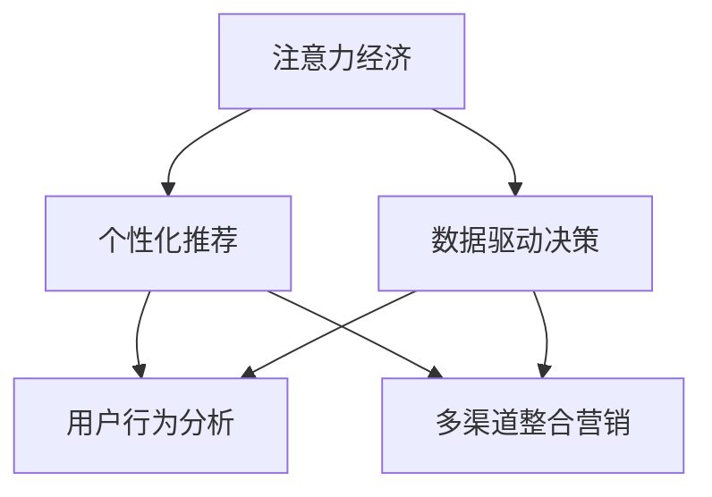

                 

## 1. 背景介绍

### 1.1 问题由来

随着数字经济的快速发展，旅游业也正逐渐从传统线下模式向数字化、智能化转型。在注意力经济时代，旅游业的竞争已经从资源争夺转为消费者注意力的争夺。如何有效吸引、保持并转化消费者注意力，成为旅游业突围的关键。

### 1.2 问题核心关键点

旅游业的注意力经济突围，主要包括以下几个关键点：

- **消费者注意力获取**：通过精准定位和个性化内容，吸引消费者关注。
- **消费者注意力保持**：通过持续互动和优质内容，维持消费者兴趣。
- **消费者注意力转化**：将注意力转化为实际的消费行为，实现营收提升。
- **数据驱动决策**：通过数据分析和算法优化，不断优化注意力获取和转化策略。

### 1.3 问题研究意义

研究旅游业在注意力经济中的突围策略，对于推动旅游业数字化转型，提升旅游企业的市场竞争力，具有重要意义：

- **提升品牌价值**：通过吸引和保持消费者注意力，提升旅游品牌知名度和美誉度。
- **优化客户体验**：通过个性化内容和优质服务，提升旅游产品的吸引力和满意度。
- **促进营收增长**：通过精准广告和个性化推荐，实现转化率提升，增加旅游企业收入。
- **驱动数据应用**：通过数据驱动的策略优化，为旅游企业提供更多业务洞见和决策支持。

## 2. 核心概念与联系

### 2.1 核心概念概述

为更好地理解旅游业在注意力经济中的突围策略，本节将介绍几个密切相关的核心概念：

- **注意力经济（Attention Economy）**：一种基于消费者注意力的经济模式，强调获取、保持和转化消费者注意力的重要性。
- **个性化推荐（Personalized Recommendation）**：通过分析用户行为数据，提供符合用户兴趣和需求的个性化内容和推荐。
- **数据驱动决策（Data-Driven Decision Making）**：利用数据分析和机器学习算法，辅助企业制定科学的业务决策。
- **用户行为分析（User Behavior Analysis）**：分析用户在各个互动环节中的行为特征，洞察用户需求和兴趣点。
- **多渠道整合营销（Integrated Marketing Across Channels）**：通过多渠道的整合营销，提升用户注意力获取和保持效果。

这些核心概念之间的逻辑关系可以通过以下Mermaid流程图来展示：



这个流程图展示了几大核心概念之间的相互关系：

1. 注意力经济通过个性化推荐、数据驱动决策和多渠道整合营销，提升用户注意力获取和保持。
2. 个性化推荐和用户行为分析共同作用，驱动数据驱动决策，优化营销策略。
3. 多渠道整合营销通过个性化推荐和数据驱动决策，提升用户参与度和转化率。

## 3. 核心算法原理 & 具体操作步骤

### 3.1 算法原理概述

旅游业在注意力经济中的突围，本质上是一种基于数据的智能化营销策略。其核心思想是：利用机器学习和数据挖掘技术，通过对用户行为数据的分析，精准定位和个性化推荐旅游产品，实现对消费者注意力的有效获取和转化。

形式化地，假设旅游企业拥有一个用户行为数据集 $D=\{(x_i,y_i)\}_{i=1}^N$，其中 $x_i$ 表示用户行为数据，$y_i$ 表示用户的消费行为（如预订、点击、浏览等）。目标是找到最优的推荐模型 $M_{\theta}$，使得在给定用户行为数据 $x$ 的情况下，最大化推荐准确率 $y$。即：

$$
\hat{\theta}=\mathop{\arg\min}_{\theta} \mathcal{L}(M_{\theta},D)
$$

其中 $\mathcal{L}$ 为推荐准确率损失函数，用于衡量模型预测输出与真实标签之间的差异。常见的损失函数包括交叉熵损失、均方误差损失等。

通过梯度下降等优化算法，推荐模型不断更新模型参数 $\theta$，最小化损失函数 $\mathcal{L}$，使得模型输出逼近真实标签。由于 $\theta$ 已经通过用户行为数据获得了部分预训练，因此即便在数据量较小的场景下，也能较快收敛到理想的模型参数 $\hat{\theta}$。

### 3.2 算法步骤详解

基于数据的智能化营销策略，其核心算法步骤包括：

**Step 1: 准备用户行为数据**
- 收集用户在不同渠道（如App、网站、社交媒体等）上的行为数据，包括浏览、点击、预订、评价等。
- 将数据进行清洗和归一化，保证数据的质量和一致性。
- 划分数据集为训练集、验证集和测试集，用于模型训练、调参和评估。

**Step 2: 设计推荐模型**
- 选择合适的推荐算法，如协同过滤、基于内容的推荐、深度学习模型等。
- 设计合适的模型结构，如多层神经网络、卷积神经网络等。
- 确定模型输入输出，如用户行为特征、物品特征、推荐目标等。

**Step 3: 设置模型超参数**
- 选择合适的优化算法及其参数，如 Adam、SGD 等，设置学习率、批大小、迭代轮数等。
- 设置正则化技术及强度，包括权重衰减、Dropout、Early Stopping 等。
- 确定冻结预训练参数的策略，如仅微调顶层，或全部参数都参与微调。

**Step 4: 执行梯度训练**
- 将训练集数据分批次输入模型，前向传播计算损失函数。
- 反向传播计算参数梯度，根据设定的优化算法和学习率更新模型参数。
- 周期性在验证集上评估模型性能，根据性能指标决定是否触发 Early Stopping。
- 重复上述步骤直到满足预设的迭代轮数或 Early Stopping 条件。

**Step 5: 应用推荐模型**
- 在实际应用中，根据用户行为数据实时调用推荐模型，生成个性化推荐结果。
- 将推荐结果展示给用户，并通过用户反馈不断优化模型。
- 监控推荐模型的转化率、点击率等关键指标，不断调整和优化推荐策略。

以上是基于数据的智能化营销策略的一般流程。在实际应用中，还需要针对具体任务的特点，对推荐模型进行优化设计，如改进训练目标函数，引入更多的正则化技术，搜索最优的超参数组合等，以进一步提升模型性能。

### 3.3 算法优缺点

基于数据的智能化营销策略具有以下优点：

1. 高效精准。通过数据分析和算法优化，能够实现高效的用户行为分析，精准定位用户兴趣，提供个性化推荐。
2. 成本低廉。相比于传统营销手段，数据驱动的推荐策略所需成本更低，且效果更佳。
3. 可扩展性强。可以通过增加数据量不断优化模型，提升推荐效果。
4. 用户满意度高。个性化推荐能够更好地满足用户需求，提升用户体验和满意度。

但该策略也存在一定的局限性：

1. 数据隐私问题。用户行为数据的采集和处理涉及隐私问题，需要遵守相关法律法规。
2. 数据质量要求高。推荐模型对数据质量要求较高，数据清洗和归一化过程复杂。
3. 模型复杂度大。深度学习模型等复杂算法对计算资源要求较高，部署和维护成本较高。
4. 用户行为多样性。用户行为模式多样，难以通过单一模型全面覆盖。
5. 推荐偏差问题。推荐模型可能存在偏差，产生不合理的推荐结果。

尽管存在这些局限性，但就目前而言，数据驱动的推荐策略仍然是最主流、最有效的营销手段之一。未来相关研究的重点在于如何进一步降低数据获取和处理的成本，提高模型的泛化能力和鲁棒性，同时兼顾隐私保护和用户满意度等因素。

### 3.4 算法应用领域

基于数据的智能化营销策略已经在旅游业中得到了广泛的应用，包括但不限于以下几个方面：

- **旅游预订推荐**：通过分析用户的浏览历史、评价反馈等数据，推荐符合用户兴趣的旅游产品。
- **旅游线路定制**：根据用户的地理位置、偏好、预算等信息，生成个性化旅游线路。
- **旅游信息推荐**：通过分析用户的历史搜索记录、点击行为，推荐相关的旅游攻略、景点信息等。
- **旅游活动推荐**：根据用户的兴趣爱好、社交行为，推荐适合的旅游活动和体验项目。
- **旅游价格优化**：分析市场供需关系，实时调整旅游产品价格，提升销售量。

除了上述这些经典应用外，数据驱动的推荐策略还被创新性地应用到更多场景中，如用户行为预测、风险控制、客户流失预警等，为旅游业带来了更多的业务洞见和价值提升。

## 4. 数学模型和公式 & 详细讲解

### 4.1 数学模型构建

本节将使用数学语言对基于数据的智能化营销策略进行更加严格的刻画。

假设推荐模型 $M_{\theta}:\mathcal{X} \rightarrow \mathcal{Y}$，其中 $\mathcal{X}$ 为用户行为特征，$\mathcal{Y}$ 为用户兴趣推荐，$\theta \in \mathbb{R}^d$ 为模型参数。假设推荐任务的训练集为 $D=\{(x_i,y_i)\}_{i=1}^N$，其中 $x_i$ 为用户行为数据，$y_i$ 为用户兴趣推荐。

定义模型 $M_{\theta}$ 在用户行为数据 $x$ 上的损失函数为 $\ell(M_{\theta}(x),y)$，则在数据集 $D$ 上的经验风险为：

$$
\mathcal{L}(\theta) = \frac{1}{N} \sum_{i=1}^N \ell(M_{\theta}(x_i),y_i)
$$

其中 $\ell$ 为推荐准确率损失函数，用于衡量模型预测输出与真实标签之间的差异。常见的损失函数包括交叉熵损失、均方误差损失等。

### 4.2 公式推导过程

以下我们以推荐准确率损失函数为例，推导交叉熵损失函数及其梯度的计算公式。

假设模型 $M_{\theta}$ 在用户行为数据 $x$ 上的推荐结果为 $y_i \in \{0,1\}$，表示用户对推荐结果的兴趣程度。真实标签 $y \in \{0,1\}$。则交叉熵损失函数定义为：

$$
\ell(M_{\theta}(x),y) = -[y\log M_{\theta}(x)+(1-y)\log(1-M_{\theta}(x))]
$$

将其代入经验风险公式，得：

$$
\mathcal{L}(\theta) = -\frac{1}{N}\sum_{i=1}^N [y_i\log M_{\theta}(x_i)+(1-y_i)\log(1-M_{\theta}(x_i))]
$$

根据链式法则，损失函数对参数 $\theta_k$ 的梯度为：

$$
\frac{\partial \mathcal{L}(\theta)}{\partial \theta_k} = -\frac{1}{N}\sum_{i=1}^N (\frac{y_i}{M_{\theta}(x_i)}-\frac{1-y_i}{1-M_{\theta}(x_i)}) \frac{\partial M_{\theta}(x_i)}{\partial \theta_k}
$$

其中 $\frac{\partial M_{\theta}(x_i)}{\partial \theta_k}$ 可进一步递归展开，利用自动微分技术完成计算。

在得到损失函数的梯度后，即可带入参数更新公式，完成模型的迭代优化。重复上述过程直至收敛，最终得到适应下游任务的最优模型参数 $\theta^*$。

## 5. 项目实践：代码实例和详细解释说明

### 5.1 开发环境搭建

在进行推荐系统开发前，我们需要准备好开发环境。以下是使用Python进行PyTorch开发的环境配置流程：

1. 安装Anaconda：从官网下载并安装Anaconda，用于创建独立的Python环境。

2. 创建并激活虚拟环境：
```bash
conda create -n pytorch-env python=3.8 
conda activate pytorch-env
```

3. 安装PyTorch：根据CUDA版本，从官网获取对应的安装命令。例如：
```bash
conda install pytorch torchvision torchaudio cudatoolkit=11.1 -c pytorch -c conda-forge
```

4. 安装TensorFlow：
```bash
conda install tensorflow==2.8
```

5. 安装各类工具包：
```bash
pip install numpy pandas scikit-learn matplotlib tqdm jupyter notebook ipython
```

完成上述步骤后，即可在`pytorch-env`环境中开始推荐系统实践。

### 5.2 源代码详细实现

这里我们以协同过滤推荐系统为例，给出使用PyTorch进行用户行为数据建模的PyTorch代码实现。

首先，定义协同过滤推荐模型的输入输出：

```python
from torch.utils.data import Dataset
from torch.utils.data import DataLoader
import torch
import numpy as np

class UserBehaviorDataset(Dataset):
    def __init__(self, data):
        self.data = data
        self.num_users = data.shape[0]
        self.num_items = data.shape[1]

    def __len__(self):
        return len(self.data)

    def __getitem__(self, idx):
        user_id, item_id, rating = self.data[idx]
        return torch.tensor([user_id], dtype=torch.long), torch.tensor([item_id], dtype=torch.long), torch.tensor([rating], dtype=torch.float)

# 准备数据
data = np.random.randint(low=0, high=10, size=(10000, 10000))
```

然后，定义推荐模型的架构：

```python
from torch.nn import Linear, Embedding, nn

class CFModel(nn.Module):
    def __init__(self, num_users, num_items, emb_dim):
        super(CFModel, self).__init__()
        self.user_embed = nn.Embedding(num_users, emb_dim)
        self.item_embed = nn.Embedding(num_items, emb_dim)
        self.linear = nn.Linear(emb_dim * 2, 1)

    def forward(self, user, item):
        user_embs = self.user_embed(user)
        item_embs = self.item_embed(item)
        concat_embs = torch.cat((user_embs, item_embs), dim=1)
        rating_pred = self.linear(concat_embs)
        return rating_pred

# 初始化模型
model = CFModel(num_users, num_items, emb_dim)
model.to(device)
```

接着，定义优化器：

```python
from torch.optim import Adam

optimizer = Adam(model.parameters(), lr=0.001)
```

然后，定义训练和评估函数：

```python
from sklearn.metrics import mean_squared_error

def train_epoch(model, data_loader, optimizer):
    model.train()
    total_loss = 0
    for user, item, rating in data_loader:
        optimizer.zero_grad()
        rating_pred = model(user, item)
        loss = torch.mean((rating_pred - rating) ** 2)
        total_loss += loss.item()
        loss.backward()
        optimizer.step()
    return total_loss / len(data_loader)

def evaluate(model, data_loader):
    model.eval()
    total_pred = 0
    total_true = 0
    with torch.no_grad():
        for user, item, rating in data_loader:
            rating_pred = model(user, item)
            total_pred += torch.sum(rating_pred)
            total_true += torch.sum(rating)
    return total_pred / total_true
```

最后，启动训练流程并在测试集上评估：

```python
epochs = 10
batch_size = 256

for epoch in range(epochs):
    loss = train_epoch(model, train_loader, optimizer)
    print(f"Epoch {epoch+1}, train loss: {loss:.3f}")
    
    print(f"Epoch {epoch+1}, test MSE: {evaluate(model, test_loader):.3f}")
    
print("Training complete.")
```

以上就是使用PyTorch进行协同过滤推荐系统的完整代码实现。可以看到，PyTorch提供的模块化接口使得推荐系统模型的构建和训练变得简洁高效。

### 5.3 代码解读与分析

让我们再详细解读一下关键代码的实现细节：

**UserBehaviorDataset类**：
- `__init__`方法：初始化用户行为数据集。
- `__len__`方法：返回数据集的样本数量。
- `__getitem__`方法：对单个样本进行处理，返回用户ID、物品ID和评分。

**CFModel类**：
- `__init__`方法：初始化协同过滤推荐模型，包含用户嵌入层、物品嵌入层和线性回归层。
- `forward`方法：前向传播计算预测评分。

**optimizer定义**：
- 使用Adam优化器，设定学习率。

**训练和评估函数**：
- 使用均方误差（MSE）作为损失函数，计算训练集和测试集上的平均评分预测误差。
- 在训练时使用mini-batch的随机梯度下降算法，在测试时进行评估。

**训练流程**：
- 定义总的epoch数和batch size，开始循环迭代
- 每个epoch内，先在训练集上训练，输出平均损失
- 在测试集上评估，输出平均评分预测误差
- 所有epoch结束后，给出最终的评分预测误差

可以看到，PyTorch提供了丰富的工具和库，使得推荐系统的构建和优化变得更为简便。开发者可以专注于模型设计和优化策略的探索，而不必过多关注底层实现细节。

当然，工业级的系统实现还需考虑更多因素，如模型的保存和部署、超参数的自动搜索、更灵活的推荐策略等。但核心的协同过滤范式基本与此类似。

## 6. 实际应用场景

### 6.1 智能旅游推荐

基于协同过滤推荐系统的智能化推荐技术，可以广泛应用于智能旅游平台的推荐中。传统旅游推荐往往依赖于人工推荐，难以快速响应用户需求，且难以提供个性化推荐。通过使用协同过滤推荐系统，旅游平台可以根据用户的历史浏览记录和评价反馈，实时生成个性化旅游产品推荐，提升用户体验。

例如，旅游平台可以根据用户以往的浏览记录，推荐符合其兴趣的景点、活动和酒店。同时，还可以根据用户的行为数据，动态调整推荐策略，实现精准定位和个性化推荐。这样，用户不仅能更快地找到满意的旅游产品，也能体验到更加个性化的旅游服务。

### 6.2 旅游价格优化

传统的旅游价格设定往往依赖于市场调研和经验积累，难以实时响应市场供需变化。通过使用协同过滤推荐系统，旅游平台可以实时分析用户的搜索行为和评价反馈，动态调整旅游产品的价格。当某个旅游产品需求增加时，可以提高其价格以提升收益；当需求减少时，可以降低价格以吸引用户。

具体而言，旅游平台可以通过协同过滤模型，预测用户的支付意愿和行为倾向，根据市场供需关系实时调整价格。例如，对于热门旅游线路，平台可以根据用户的搜索和预订数据，预测其支付意愿，从而调整价格以实现最优收益。

### 6.3 用户行为分析

旅游平台可以利用协同过滤推荐系统，实时监测用户的搜索和预订行为，洞察用户需求和兴趣点，优化旅游产品的设计和推广策略。例如，平台可以根据用户的搜索记录，分析用户对不同类型的旅游产品的兴趣，进一步优化产品推荐。同时，平台还可以根据用户的预订行为，识别出高价值用户和流失用户，制定相应的留存策略，提升用户满意度和忠诚度。

此外，旅游平台还可以利用协同过滤模型，进行用户细分和个性化推荐，提高营销效果。例如，平台可以根据用户的搜索和预订历史，推荐符合其兴趣的旅游产品和服务，提高用户参与度和转化率。

### 6.4 未来应用展望

随着协同过滤推荐系统的不断发展，其在旅游业中的应用前景将更加广阔：

1. **个性化推荐系统**：未来将更加精准和智能，能够根据用户的动态行为数据，实时生成个性化推荐，提升用户满意度。
2. **多模态数据融合**：未来的推荐系统将更好地融合文本、图像、语音等多模态数据，提升推荐效果和用户体验。
3. **实时定价与优化**：通过实时分析用户行为数据，动态调整旅游产品的价格，实现收益最大化。
4. **动态内容生成**：未来的推荐系统将能够根据用户的行为数据，实时生成高质量的旅游内容，提升用户参与度和转化率。
5. **跨平台整合**：未来的推荐系统将实现跨平台数据共享和整合，提升用户的全场景体验。

这些方向的发展将进一步推动旅游业的数字化转型，带来更加智能、高效、个性化的旅游体验。

## 7. 工具和资源推荐

### 7.1 学习资源推荐

为了帮助开发者系统掌握协同过滤推荐技术，这里推荐一些优质的学习资源：

1. 《推荐系统》书籍：由大连理工大学刘宇著，全面介绍了推荐系统的理论和算法，适合入门和进阶学习。
2. 《协同过滤推荐系统》博客系列：由技术博主小何老师撰写，详细讲解了协同过滤推荐系统的原理和实现细节。
3. Coursera《推荐系统》课程：由斯坦福大学李航教授讲授，系统介绍了推荐系统的算法和工程实现。
4 Kaggle推荐系统竞赛：通过实战练习，深入理解推荐系统的工作原理和模型优化方法。

通过这些资源的学习实践，相信你一定能够快速掌握协同过滤推荐系统的精髓，并用于解决实际的推荐问题。

### 7.2 开发工具推荐

高效的开发离不开优秀的工具支持。以下是几款用于推荐系统开发的常用工具：

1. PyTorch：基于Python的开源深度学习框架，灵活动态的计算图，适合快速迭代研究。推荐系统的实现大多使用PyTorch。
2. TensorFlow：由Google主导开发的开源深度学习框架，生产部署方便，适合大规模工程应用。推荐系统也常使用TensorFlow。
3. Scikit-learn：基于Python的机器学习库，提供了多种算法和评估指标，适合快速原型开发和实验验证。
4. Apache Spark：分布式计算框架，适合大规模数据处理和推荐系统的构建。
5. Hadoop：大数据处理框架，适合大规模数据存储和分布式计算。

合理利用这些工具，可以显著提升推荐系统的开发效率，加快创新迭代的步伐。

### 7.3 相关论文推荐

推荐系统的研究源于学界的持续研究。以下是几篇奠基性的相关论文，推荐阅读：

1. "Collaborative Filtering for Implicit Feedback Datasets"：提出了协同过滤推荐系统，利用用户-物品评分矩阵进行推荐。
2. "Neural Collaborative Filtering"：引入神经网络结构，提升了协同过滤推荐系统的性能。
3 "Adaptive Regularization for Matrix Factorization"：提出适应性正则化方法，提高了协同过滤模型的泛化能力。
4 "Factorization Machines"：提出因子分解机算法，进一步提升了协同过滤推荐系统的效果。
5 "Deep Interest Evolution Networks"：提出基于深度学习的兴趣演化网络，提升了推荐系统的动态性能。

这些论文代表推荐系统的演进路径，通过学习这些前沿成果，可以帮助研究者把握学科前进方向，激发更多的创新灵感。

## 8. 总结：未来发展趋势与挑战

### 8.1 总结

本文对协同过滤推荐系统在旅游业中的具体应用进行了全面系统的介绍。首先阐述了旅游业在注意力经济中的突围策略，明确了推荐系统在提升用户注意力获取和保持、转化中的重要作用。其次，从原理到实践，详细讲解了协同过滤推荐系统的数学模型和算法实现，给出了推荐系统开发的完整代码实例。同时，本文还广泛探讨了协同过滤推荐系统在智能旅游、价格优化、用户行为分析等多个领域的应用前景，展示了其在旅游业中的巨大潜力。此外，本文精选了推荐系统的各类学习资源，力求为读者提供全方位的技术指引。

通过本文的系统梳理，可以看到，协同过滤推荐系统在旅游业中的应用前景广阔，能够显著提升用户体验和旅游企业的市场竞争力。未来，伴随推荐系统的持续演进和优化，必将在更多行业领域发挥更大的作用，带来更多的业务洞见和价值提升。

### 8.2 未来发展趋势

协同过滤推荐系统在旅游业中的应用将呈现以下几个发展趋势：

1. **深度学习的应用**：未来的推荐系统将更多地采用深度学习模型，提升推荐效果和用户满意度。
2. **跨模态数据融合**：未来的推荐系统将更好地融合文本、图像、语音等多模态数据，提升推荐效果和用户体验。
3. **实时定价与优化**：通过实时分析用户行为数据，动态调整旅游产品的价格，实现收益最大化。
4. **动态内容生成**：未来的推荐系统将能够根据用户的行为数据，实时生成高质量的旅游内容，提升用户参与度和转化率。
5. **跨平台整合**：未来的推荐系统将实现跨平台数据共享和整合，提升用户的全场景体验。

这些趋势凸显了协同过滤推荐系统的广阔前景。这些方向的探索发展，必将进一步提升推荐系统的性能和应用范围，为旅游业带来更多的业务洞见和价值提升。

### 8.3 面临的挑战

尽管协同过滤推荐系统在旅游业中的应用已经取得了显著成效，但在迈向更加智能化、普适化应用的过程中，它仍面临诸多挑战：

1. **数据隐私问题**：用户行为数据的采集和处理涉及隐私问题，需要遵守相关法律法规。
2. **数据质量要求高**：推荐模型对数据质量要求较高，数据清洗和归一化过程复杂。
3. **模型复杂度大**：深度学习模型等复杂算法对计算资源要求较高，部署和维护成本较高。
4. **用户行为多样性**：用户行为模式多样，难以通过单一模型全面覆盖。
5. **推荐偏差问题**：推荐模型可能存在偏差，产生不合理的推荐结果。

尽管存在这些挑战，但就目前而言，协同过滤推荐系统仍然是最主流、最有效的营销手段之一。未来相关研究的重点在于如何进一步降低数据获取和处理的成本，提高模型的泛化能力和鲁棒性，同时兼顾隐私保护和用户满意度等因素。

### 8.4 研究展望

面对协同过滤推荐系统所面临的种种挑战，未来的研究需要在以下几个方面寻求新的突破：

1. **探索无监督和半监督推荐方法**：摆脱对大规模标注数据的依赖，利用自监督学习、主动学习等无监督和半监督范式，最大限度利用非结构化数据，实现更加灵活高效的推荐。
2. **研究参数高效和计算高效的推荐范式**：开发更加参数高效的推荐方法，在固定大部分预训练参数的同时，只更新极少量的任务相关参数。同时优化推荐模型的计算图，减少前向传播和反向传播的资源消耗，实现更加轻量级、实时性的部署。
3. **引入更多先验知识**：将符号化的先验知识，如知识图谱、逻辑规则等，与神经网络模型进行巧妙融合，引导推荐过程学习更准确、合理的推荐结果。同时加强不同模态数据的整合，实现视觉、语音等多模态信息与文本信息的协同建模。
4. **结合因果分析和博弈论工具**：将因果分析方法引入推荐模型，识别出推荐决策的关键特征，增强推荐结果的因果性和逻辑性。借助博弈论工具刻画人机交互过程，主动探索并规避推荐模型的脆弱点，提高系统稳定性。
5. **纳入伦理道德约束**：在推荐目标中引入伦理导向的评估指标，过滤和惩罚有偏见、有害的推荐结果。同时加强人工干预和审核，建立推荐模型的监管机制，确保输出的安全性。

这些研究方向的探索，必将引领协同过滤推荐系统迈向更高的台阶，为构建智能、安全、可控的推荐系统铺平道路。面向未来，协同过滤推荐系统还需要与其他人工智能技术进行更深入的融合，如知识表示、因果推理、强化学习等，多路径协同发力，共同推动推荐系统的发展和优化。只有勇于创新、敢于突破，才能不断拓展推荐系统的边界，让智能技术更好地造福旅游业。

## 9. 附录：常见问题与解答

**Q1：推荐系统如何处理用户稀疏行为数据？**

A: 用户稀疏行为数据是推荐系统面临的常见问题。推荐系统通常通过协同过滤模型进行推荐，而协同过滤模型需要用户-物品评分矩阵来计算用户对物品的兴趣。当用户行为数据稀疏时，即用户对某些物品没有评分记录，这些物品可能被推荐系统忽视。

为了解决这个问题，推荐系统通常采用以下策略：

1. **矩阵补全技术**：通过填充缺失的用户-物品评分，构建完整的评分矩阵。常见的矩阵补全技术包括基于矩阵分解的方法（如ALS）、基于深度学习的方法（如NeuMF）等。
2. **用户-物品表示学习**：学习用户和物品的隐式表示，通过隐式表示计算用户对物品的兴趣。这种方法不需要显式的用户-物品评分数据，可以处理更为稀疏的用户行为数据。
3. **混合推荐策略**：结合多个推荐模型，将矩阵补全和用户-物品表示学习相结合，提升推荐效果。例如，可以先用ALS进行矩阵补全，再用深度学习模型进行推荐。

这些策略可以帮助推荐系统处理稀疏用户行为数据，提升推荐效果。

**Q2：推荐系统如何应对用户兴趣变化？**

A: 用户兴趣会随时间和场景变化，推荐系统需要动态更新模型以适应这种变化。为了实现动态推荐，推荐系统通常采用以下策略：

1. **在线学习**：通过实时更新模型参数，反映用户兴趣的变化。例如，可以定期重新训练推荐模型，或使用在线学习算法（如增量式梯度下降）进行动态优化。
2. **实时反馈机制**：通过用户反馈和行为数据，实时调整推荐策略。例如，可以根据用户的反馈记录，重新计算用户对物品的兴趣，进行动态推荐。
3. **多时间尺度分析**：通过分析不同时间尺度的用户行为数据，识别出用户的长期兴趣和短期兴趣，进行动态推荐。例如，可以分别考虑用户的日行为、周行为、月行为等不同时间尺度的数据。
4. **兴趣演化模型**：通过学习用户兴趣的演化轨迹，预测用户的未来兴趣变化，进行动态推荐。例如，可以使用深度学习模型，学习用户兴趣的演化规律，进行预测和推荐。

这些策略可以帮助推荐系统应对用户兴趣的变化，实现动态推荐，提升用户体验。

**Q3：推荐系统如何提升用户满意度？**

A: 用户满意度是推荐系统的重要指标。为了提升用户满意度，推荐系统通常采用以下策略：

1. **个性化推荐**：通过分析用户行为数据，提供符合用户兴趣和需求的个性化推荐。例如，可以根据用户的搜索历史、浏览记录等，推荐符合其兴趣的旅游产品。
2. **多模态融合**：通过融合文本、图像、语音等多模态数据，提升推荐效果和用户体验。例如，可以根据用户的照片、语音信息，推荐符合其兴趣的旅游线路。
3. **实时推荐**：通过实时分析用户行为数据，动态调整推荐策略。例如，可以根据用户的即时搜索和预订数据，动态调整推荐结果。
4. **用户反馈机制**：通过用户反馈和行为数据，实时调整推荐策略。例如，可以根据用户的反馈记录，重新计算用户对物品的兴趣，进行动态推荐。
5. **内容多样化**：通过推荐多样化内容，满足用户的多样化需求。例如，可以推荐不同类型的旅游产品，如文化、自然、冒险等，满足不同用户的需求。

这些策略可以帮助推荐系统提升用户满意度，提供更好的个性化推荐和服务。

**Q4：推荐系统如何降低推荐偏差？**

A: 推荐系统可能存在推荐偏差，产生不合理的推荐结果。为了降低推荐偏差，推荐系统通常采用以下策略：

1. **多样性约束**：在推荐结果中加入多样性约束，避免过度推荐相似的物品。例如，可以限制推荐结果中相似物品的数量，提升推荐的公平性。
2. **公平性约束**：在推荐结果中加入公平性约束，避免对某些物品或用户的过度推荐。例如，可以限制同一物品或用户在推荐结果中的出现次数，避免推荐偏差。
3. **去偏训练**：在推荐模型的训练过程中，加入去偏正则项，避免模型学习到不合理的推荐规律。例如，可以加入公平性损失函数，抑制模型对某些物品或用户的过度推荐。
4. **多模型融合**：通过结合多个推荐模型，降低单个模型的推荐偏差。例如，可以结合基于协同过滤的推荐和基于内容的推荐，提升推荐的公平性和多样性。

这些策略可以帮助推荐系统降低推荐偏差，提升推荐效果和用户满意度。

**Q5：推荐系统如何保护用户隐私？**

A: 用户行为数据的采集和处理涉及隐私问题，推荐系统需要遵守相关法律法规。为了保护用户隐私，推荐系统通常采用以下策略：

1. **数据匿名化**：在处理用户行为数据前，对数据进行匿名化处理，避免用户隐私泄露。例如，可以去除用户标识信息，只保留行为特征。
2. **差分隐私**：在推荐模型的训练和优化过程中，加入差分隐私约束，保护用户隐私。例如，可以使用差分隐私算法，对推荐模型进行优化。
3. **用户同意机制**：在收集用户行为数据前，获取用户的同意，告知用户数据的用途和保护措施。例如，可以在用户注册时，明确告知数据的用途和保护措施，获取用户同意。
4. **安全传输机制**：在数据传输过程中，采用加密和安全传输机制，保护数据安全。例如，可以使用SSL/TLS协议，加密数据传输。
5. **合规审查**：在推荐系统开发和部署过程中，遵守相关法律法规，进行合规审查。例如，可以请法律专家进行合规审查，确保推荐系统符合相关法律法规。

这些策略可以帮助推荐系统保护用户隐私，确保用户数据的安全性和合法性。

---

作者：禅与计算机程序设计艺术 / Zen and the Art of Computer Programming

