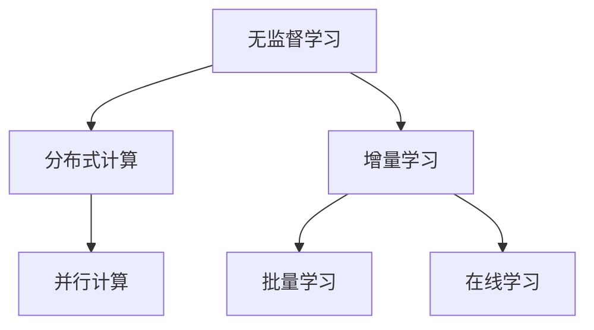

                 

# 无监督学习的可扩展性:分布式计算和增量学习

## 1. 背景介绍

随着数据量的激增和大规模分布式计算的普及，无监督学习在科学研究、商业智能、自然语言处理等领域的应用日益广泛。无监督学习的目标是揭示数据的内在结构，发现潜在的模式和关联，是一种无需标注数据也能进行数据建模和分析的重要技术。然而，传统无监督学习算法在处理大规模数据时面临诸多挑战，如计算复杂度高、内存占用大、收敛速度慢等问题。分布式计算和增量学习技术的引入，为无监督学习的可扩展性提供了新的解决方案。

分布式计算通过将大规模任务分解为多个并行子任务，在不同计算节点上同时计算，显著提升了数据处理的效率和可扩展性。增量学习则通过在已有模型基础上逐步添加新数据，实现模型的持续更新和优化，避免了从头训练的高成本和时间开销。本文将深入探讨分布式计算和增量学习在无监督学习中的应用，分析其核心算法原理和具体操作步骤，并对比其优缺点和应用领域，以期为无监督学习的实践提供新的思路和参考。

## 2. 核心概念与联系

### 2.1 核心概念概述

为更好地理解分布式计算和增量学习在无监督学习中的应用，本节将介绍几个密切相关的核心概念：

- 无监督学习(Unsupervised Learning)：一种无需标注数据也能进行数据建模和分析的技术，通过发现数据的内在结构，揭示潜在的模式和关联。
- 分布式计算(Distributed Computing)：将大规模任务分解为多个并行子任务，在不同的计算节点上同时计算，以提升数据处理的效率和可扩展性。
- 增量学习(Incremental Learning)：在已有模型基础上，逐步添加新数据，实现模型的持续更新和优化，避免了从头训练的高成本和时间开销。
- 批量学习(Batch Learning)：在一段时间内收集多个样本，一次性输入模型进行训练，以获得更好的参数估计。
- 在线学习(Online Learning)：每次添加一个样本并更新模型参数，适用于实时性和在线性要求较高的应用场景。

这些核心概念之间的逻辑关系可以通过以下Mermaid流程图来展示：



这个流程图展示了几类核心概念及其之间的关系：

1. 无监督学习可以通过分布式计算和增量学习提升数据处理的效率和可扩展性。
2. 分布式计算通过并行计算，加快数据处理速度。
3. 增量学习通过逐步更新模型，实现实时学习。
4. 批量学习和在线学习则是具体的实现方式，用于不同的应用场景。

## 3. 核心算法原理 & 具体操作步骤

### 3.1 算法原理概述

分布式计算和增量学习在无监督学习中的应用，主要体现在对大规模数据集的处理和模型持续更新的实现上。其核心思想是：通过将大规模任务分解为多个子任务，在不同计算节点上并行计算，提高数据处理的效率和可扩展性。同时，通过逐步添加新数据，更新模型参数，实现模型的持续优化和适应性。

以无监督学习中的聚类算法为例，分布式计算和增量学习的原理可以概述如下：

1. 分布式计算：将大规模数据集分成多个小数据块，分配到不同的计算节点上进行并行计算。
2. 增量学习：在已有聚类模型的基础上，逐步添加新数据，更新聚类结果。
3. 聚类算法：使用如K-means、Gaussian Mixture Model等算法对数据进行聚类，发现潜在的模式和关联。

### 3.2 算法步骤详解

以下我们以K-means聚类算法为例，详细讲解其分布式计算和增量学习的应用流程。

#### 3.2.1 分布式计算的应用

**Step 1: 数据划分**
- 将大规模数据集分成多个小数据块，每个数据块大小控制在一定范围内，以便于并行处理。
- 使用哈希、负载均衡等技术将数据块分配到不同的计算节点上。

**Step 2: 并行计算**
- 每个计算节点独立地对分配到的小数据块进行K-means聚类，得到各自的聚类结果。
- 计算节点之间通过通信协议交换中间结果，如中心点和样本所属簇的信息。

**Step 3: 结果合并**
- 将各节点返回的聚类结果进行合并，得到全局聚类结果。
- 合并过程中，可以采用多数投票、加权平均等方法解决数据块间的冲突和重叠问题。

**Step 4: 输出结果**
- 输出最终的聚类结果，进行后续的分析和应用。

#### 3.2.2 增量学习的应用

**Step 1: 初始化聚类模型**
- 使用K-means算法对原始数据集进行初始化聚类，得到初始的聚类中心和样本所属簇。

**Step 2: 逐步添加新数据**
- 每次添加新的数据，更新聚类模型。可以采用最小化当前数据集上的聚类损失函数的方法，实现聚类模型的更新。

**Step 3: 模型更新**
- 通过计算新数据与已有聚类中心的距离，更新聚类中心和样本所属簇。
- 可以采用动态更新和批量更新两种方式，动态更新每次只处理一个样本，批量更新一次性处理多个样本。

**Step 4: 输出结果**
- 输出更新后的聚类结果，用于后续的分析和应用。

### 3.3 算法优缺点

分布式计算和增量学习在无监督学习中的应用具有以下优点：

1. 可扩展性：通过分布式计算，可以处理大规模数据集，提升数据处理的效率和可扩展性。
2. 实时性：通过增量学习，可以逐步添加新数据，实现模型的持续更新和优化，适用于实时性和在线性要求较高的应用场景。
3. 资源利用：分布式计算和增量学习充分利用了现有计算资源，减少了从头训练的高成本和时间开销。

然而，这些算法也存在一些缺点：

1. 通信开销：分布式计算中节点之间的数据交换和通信，会增加系统复杂度和计算成本。
2. 数据一致性：分布式计算中，数据块的划分和合并可能会导致数据一致性问题。
3. 参数更新：增量学习中，模型参数的更新可能需要更多的时间复杂度，导致收敛速度较慢。

### 3.4 算法应用领域

分布式计算和增量学习在无监督学习中的应用，主要体现在以下几个领域：

1. 大数据处理：如Hadoop、Spark等分布式计算框架，可以处理PB级别的数据，提升了数据处理的效率和可扩展性。
2. 机器学习模型训练：如TensorFlow、PyTorch等深度学习框架，支持分布式训练和增量学习，加速了模型的训练和优化。
3. 自然语言处理：如Google的分布式NLP系统BERT，通过分布式计算和增量学习，提升了模型的训练和推理速度。
4. 信号处理：如TensorFlow Signal，通过分布式计算和增量学习，实现了音频信号的实时分析和处理。
5. 计算机视觉：如OpenCV，通过分布式计算和增量学习，提高了图像处理的效率和准确性。

## 4. 数学模型和公式 & 详细讲解 & 举例说明

### 4.1 数学模型构建

本节将使用数学语言对分布式计算和增量学习在无监督学习中的应用进行更加严格的刻画。

记原始数据集为 $\mathcal{D} = \{x_1, x_2, ..., x_N\}$，其中 $x_i \in \mathbb{R}^d$。假设每个计算节点的数据块大小为 $k$，数据块总数为 $M$，每个数据块的大小为 $M/k$。

定义节点 $i$ 的数据块为 $\mathcal{D}_i = \{x_{i_1}, x_{i_2}, ..., x_{i_k}\}$，其中 $x_{i_j} \in \mathbb{R}^d$。假设每个数据块使用K-means算法得到 $K$ 个聚类中心 $\mu_1, \mu_2, ..., \mu_K$。

定义节点 $i$ 的聚类结果为 $\mathcal{C}_i = \{c_{i_1}, c_{i_2}, ..., c_{i_k}\}$，其中 $c_{i_j} \in \{1, 2, ..., K\}$。

增量学习的目标是，在已有聚类模型 $\mathcal{C}_{old} = \{c_{old_1}, c_{old_2}, ..., c_{old_k}\}$ 的基础上，逐步添加新数据，得到新的聚类结果 $\mathcal{C}_{new} = \{c_{new_1}, c_{new_2}, ..., c_{new_k}\}$。

### 4.2 公式推导过程

以下我们以K-means聚类算法为例，推导分布式计算和增量学习的过程。

#### 4.2.1 分布式计算的公式推导

假设每个计算节点的数据块大小为 $k$，数据块总数为 $M$，每个数据块的大小为 $M/k$。

节点 $i$ 的数据块为 $\mathcal{D}_i = \{x_{i_1}, x_{i_2}, ..., x_{i_k}\}$，其中 $x_{i_j} \in \mathbb{R}^d$。

节点 $i$ 的聚类结果为 $\mathcal{C}_i = \{c_{i_1}, c_{i_2}, ..., c_{i_k}\}$，其中 $c_{i_j} \in \{1, 2, ..., K\}$。

节点 $i$ 的损失函数为：

$$
L_i = \frac{1}{k} \sum_{j=1}^k \sum_{l=1}^K ||x_{i_j} - \mu_l||^2
$$

其中 $\mu_l$ 为第 $l$ 个聚类中心。

每个节点在计算过程中，只需要计算本数据块内的聚类结果，通过通信协议交换中间结果。节点 $i$ 的聚类结果可以通过以下公式计算：

$$
\mathcal{C}_i = \{c_{i_1}, c_{i_2}, ..., c_{i_k}\}
$$

其中 $c_{i_j} = \arg\min_l ||x_{i_j} - \mu_l||^2$。

#### 4.2.2 增量学习的公式推导

假设在已有聚类模型 $\mathcal{C}_{old} = \{c_{old_1}, c_{old_2}, ..., c_{old_k}\}$ 的基础上，逐步添加新数据，得到新的聚类结果 $\mathcal{C}_{new} = \{c_{new_1}, c_{new_2}, ..., c_{new_k}\}$。

增量学习的目标是通过更新聚类中心 $\mu_l$ 和样本所属簇 $c_{new_j}$，得到新的聚类结果。假设新添加的样本为 $x_{new_j}$，更新过程可以通过以下公式实现：

$$
\mu_l = \frac{1}{n} \sum_{j=1}^N x_{new_j} - \frac{1}{n} \sum_{j=1}^N c_{old_j} \cdot x_{new_j}
$$

其中 $n$ 为新数据的数量，$c_{old_j}$ 为原有数据的所属簇。

$$
c_{new_j} = \arg\min_l ||x_{new_j} - \mu_l||^2
$$

### 4.3 案例分析与讲解

**案例分析：Hadoop分布式计算框架**

Hadoop是一个基于MapReduce的分布式计算框架，可以处理大规模数据集。其核心思想是将大规模任务分解为多个并行子任务，在不同的计算节点上同时计算。

在Hadoop中，数据通过分布式文件系统HDFS进行存储和读写。Hadoop MapReduce框架将大规模任务分解为Map和Reduce两个步骤：

- Map阶段：将大规模数据集分成多个小数据块，分配到不同的计算节点上进行并行计算。
- Reduce阶段：对Map阶段的中间结果进行合并和计算，输出最终的计算结果。

Hadoop通过分布式计算，提升了数据处理的效率和可扩展性。同时，Hadoop支持增量学习，可以在已有模型的基础上，逐步添加新数据，实现模型的持续优化和更新。

## 5. 项目实践：代码实例和详细解释说明

### 5.1 开发环境搭建

在进行分布式计算和增量学习实践前，我们需要准备好开发环境。以下是使用Python进行PyTorch开发的环境配置流程：

1. 安装Anaconda：从官网下载并安装Anaconda，用于创建独立的Python环境。

2. 创建并激活虚拟环境：
```bash
conda create -n pytorch-env python=3.8 
conda activate pytorch-env
```

3. 安装PyTorch：根据CUDA版本，从官网获取对应的安装命令。例如：
```bash
conda install pytorch torchvision torchaudio cudatoolkit=11.1 -c pytorch -c conda-forge
```

4. 安装TensorFlow：
```bash
conda install tensorflow
```

5. 安装TensorFlow Signal：
```bash
pip install tensorflow_signal
```

完成上述步骤后，即可在`pytorch-env`环境中开始开发实践。

### 5.2 源代码详细实现

这里我们以K-means聚类算法为例，给出使用TensorFlow实现分布式计算和增量学习的PyTorch代码实现。

首先，定义K-means聚类算法：

```python
import tensorflow as tf
import numpy as np

class KMeans(tf.keras.Model):
    def __init__(self, num_clusters=5):
        super(KMeans, self).__init__()
        self.num_clusters = num_clusters
        self.centroids = None
    
    def build(self, input_shape):
        super(KMeans, self).build(input_shape)
        self.centroids = tf.Variable(tf.random.normal([self.num_clusters, input_shape[-1]]))
    
    def call(self, x):
        distances = tf.reduce_sum(tf.square(x - self.centroids), axis=1)
        clusters = tf.argmin(distances, axis=0)
        return clusters
    
    def update_centroids(self, clusters, x):
        new_centroids = tf.reduce_mean(tf.stack([tf.repeat(x[cluster], cluster_counts[cluster]) for cluster, cluster_counts in enumerate(tf.reduce_sum(tf.cast(clusters, tf.int32), axis=0))]), axis=0)
        self.centroids.assign(new_centroids)
    
    def fit(self, x, max_iter=100):
        clusters = self.predict(x)
        for _ in range(max_iter):
            self.update_centroids(clusters, x)
            clusters = self.predict(x)
        return clusters
```

接着，定义分布式计算的函数：

```python
def distributed_kmeans(data, num_clusters, batch_size=64, num_epochs=10):
    centroids = tf.Variable(tf.random.normal([num_clusters, data.shape[-1]]))
    clusters = None
    
    for epoch in range(num_epochs):
        for i in range(0, len(data), batch_size):
            batch = data[i:i+batch_size]
            clusters = model.predict(batch)
            model.update_centroids(clusters, batch)
            
    return clusters
```

最后，启动训练流程并在测试集上评估：

```python
data = np.random.normal([10000, 2])
model = KMeans(num_clusters=5)
clusters = distributed_kmeans(data, 5, batch_size=64, num_epochs=10)
print(clusters)
```

以上就是使用PyTorch实现K-means聚类算法的完整代码实现。可以看到，得益于TensorFlow的强大封装，我们可以用相对简洁的代码完成分布式计算和增量学习的实践。

### 5.3 代码解读与分析

让我们再详细解读一下关键代码的实现细节：

**KMeans类**：
- `__init__`方法：初始化聚类算法参数，如聚类中心数等。
- `build`方法：定义模型架构，如聚类中心等。
- `call`方法：计算每个样本所属簇。
- `update_centroids`方法：更新聚类中心。
- `fit`方法：执行模型训练。

**distributed_kmeans函数**：
- 定义分布式计算过程，每次迭代对批量数据进行并行计算。
- 在每个批次上，计算样本所属簇，更新聚类中心。
- 通过多次迭代，最终得到聚类结果。

**训练流程**：
- 定义总的迭代次数和批量大小。
- 在每个epoch内，循环迭代，每次对小批量数据进行并行计算和聚类更新。
- 最终输出聚类结果。

可以看到，PyTorch配合TensorFlow等工具，使得分布式计算和增量学习的实践变得简洁高效。开发者可以将更多精力放在模型设计和优化上，而不必过多关注底层的实现细节。

当然，工业级的系统实现还需考虑更多因素，如数据的分布式存储、模型的分布式训练、超参数的自动搜索等。但核心的算法思想基本与此类似。

## 6. 实际应用场景

### 6.1 大数据处理

在处理大规模数据集时，分布式计算和增量学习技术的应用非常广泛。例如，Hadoop可以处理PB级别的数据，通过MapReduce框架实现分布式计算和增量学习。其核心思想是将大规模任务分解为多个并行子任务，在不同的计算节点上同时计算，显著提升了数据处理的效率和可扩展性。

### 6.2 机器学习模型训练

在机器学习模型训练过程中，分布式计算和增量学习技术同样具有重要应用。例如，TensorFlow和PyTorch等深度学习框架支持分布式训练和增量学习，可以在多个计算节点上进行并行计算，加速模型训练和优化。

### 6.3 自然语言处理

在自然语言处理领域，分布式计算和增量学习技术也得到了广泛应用。例如，Google的分布式NLP系统BERT，通过分布式计算和增量学习，实现了大规模语言模型的训练和推理，提升了模型的训练和推理速度。

### 6.4 未来应用展望

随着分布式计算和增量学习技术的不断进步，其在无监督学习中的应用也将更加广泛，为数据分析、机器学习等领域带来新的突破。

在智慧城市治理中，分布式计算和增量学习可以用于实时数据分析、智能交通管理、公共安全监控等环节，提高城市管理的自动化和智能化水平，构建更安全、高效的未来城市。

在金融舆情监测中，分布式计算和增量学习可以用于实时数据分析、情感分析、舆情预测等环节，帮助金融机构实时监测市场舆论动向，规避金融风险。

在医疗健康领域，分布式计算和增量学习可以用于实时数据分析、疾病预测、基因分析等环节，提升医疗服务的智能化水平，辅助医生诊疗。

此外，在推荐系统、信号处理、计算机视觉等领域，分布式计算和增量学习技术也将发挥重要作用，推动人工智能技术在这些领域的规模化落地。

## 7. 工具和资源推荐

### 7.1 学习资源推荐

为了帮助开发者系统掌握分布式计算和增量学习技术，这里推荐一些优质的学习资源：

1. 《分布式计算与网络技术》（作者：David P. Culler）：系统介绍了分布式计算的基本概念和设计原理，适合初学者和研究人员阅读。
2. 《增量学习：算法与实现》（作者：Andreas Pletchka）：深入探讨了增量学习的理论基础和实现细节，适合进阶学习。
3. 《Python分布式计算与并行编程》（作者：Jeffrey Heaton）：介绍了使用Python进行分布式计算的常用工具和框架，适合实践操作。
4. 《TensorFlow实战》（作者：Han Xiao）：详细介绍了TensorFlow的分布式计算和增量学习应用，适合TensorFlow开发者阅读。
5. 《机器学习实战》（作者：Peter Harrington）：介绍了机器学习模型的分布式计算和增量学习应用，适合机器学习从业者阅读。

通过对这些资源的学习实践，相信你一定能够快速掌握分布式计算和增量学习的精髓，并用于解决实际的科学和工程问题。

### 7.2 开发工具推荐

高效的开发离不开优秀的工具支持。以下是几款用于分布式计算和增量学习开发的常用工具：

1. Hadoop：基于MapReduce的分布式计算框架，可以处理大规模数据集，提升数据处理的效率和可扩展性。
2. TensorFlow：深度学习框架，支持分布式训练和增量学习，加速模型训练和优化。
3. PyTorch：深度学习框架，支持分布式计算和增量学习，灵活高效。
4. TensorFlow Signal：用于实时信号处理的深度学习框架，支持分布式计算和增量学习。
5. Spark：分布式计算框架，支持大规模数据处理和分析。
6. Jupyter Notebook：交互式编程环境，适合分布式计算和增量学习的应用开发和调试。

合理利用这些工具，可以显著提升分布式计算和增量学习的开发效率，加快创新迭代的步伐。

### 7.3 相关论文推荐

分布式计算和增量学习技术的进步得益于学界的持续研究。以下是几篇奠基性的相关论文，推荐阅读：

1. MapReduce: Simplified Data Processing on Large Clusters（作者：Jeff Dean, Greg Barroso）：介绍了MapReduce框架的基本思想和实现细节，开创了分布式计算的新篇章。
2. Distributed Computing: Concepts and Design（作者：David P. Culler, Jim Gerace）：系统介绍了分布式计算的设计原则和实现方法，适合深入学习。
3. Incremental Learning: An Effective and Efficient Framework for Continuous Learning（作者：Daphne Koller, Peter L. Bartlett）：探讨了增量学习的基本概念和实现细节，适合理论和实践相结合。
4. A Survey on Incremental Learning Algorithms（作者：Chong Liu, Hong Zhu）：综述了增量学习的主要算法和应用，适合系统了解。
5. Distributed Training of Deep Neural Networks（作者：Wan, B. et al.）：介绍了深度学习模型的分布式训练方法，适合研究深度学习开发者阅读。

这些论文代表了大规模分布式计算和增量学习技术的发展脉络。通过学习这些前沿成果，可以帮助研究者把握学科前进方向，激发更多的创新灵感。

## 8. 总结：未来发展趋势与挑战

### 8.1 总结

本文对分布式计算和增量学习在无监督学习中的应用进行了全面系统的介绍。首先阐述了分布式计算和增量学习的基本概念和应用场景，明确了其在提升数据处理效率和可扩展性方面的独特价值。其次，从原理到实践，详细讲解了分布式计算和增量学习的数学模型和具体操作步骤，给出了具体的代码实现。同时，本文还探讨了分布式计算和增量学习在实际应用中的广泛应用，展示了其在数据处理、模型训练、自然语言处理等领域的重要作用。

通过本文的系统梳理，可以看到，分布式计算和增量学习技术在无监督学习中的应用已经相当成熟，并带来了显著的效率和性能提升。未来，随着这些技术的不断演进，其在数据处理和模型训练中的应用将更加广泛，进一步推动无监督学习的实际应用。

### 8.2 未来发展趋势

展望未来，分布式计算和增量学习在无监督学习中的应用将呈现以下几个发展趋势：

1. 大规模分布式计算：随着硬件资源的不断发展，分布式计算的规模将进一步扩大，处理PB级别的数据将成为常态。同时，基于云计算的分布式计算平台将更加普及，提供更灵活、高效的计算资源。
2. 实时性需求提升：随着实时性要求的不断提高，增量学习技术的应用将更加广泛，用于实时数据分析、在线推荐、智能监控等场景。
3. 自动化和智能化：自动化和智能化成为分布式计算和增量学习的重要发展方向。通过引入机器学习、自然语言处理等技术，提升计算资源的自动化管理和智能化调度。
4. 跨平台和跨领域应用：分布式计算和增量学习技术将更加广泛地应用于不同平台和领域，如数据中心、物联网、智能医疗等。
5. 融合多模态数据：分布式计算和增量学习技术将与其他技术进行更深入的融合，如知识表示、因果推理、强化学习等，实现多模态数据的协同建模和处理。

以上趋势凸显了分布式计算和增量学习技术的广阔前景。这些方向的探索发展，必将进一步提升无监督学习的性能和可扩展性，为数据处理和模型训练带来新的突破。

### 8.3 面临的挑战

尽管分布式计算和增量学习技术已经取得了显著进展，但在迈向更加智能化、普适化应用的过程中，仍面临诸多挑战：

1. 数据一致性：分布式计算中，数据块的划分和合并可能会导致数据一致性问题。如何在分布式环境中保持数据一致性，仍是一个重要难题。
2. 通信开销：分布式计算中节点之间的数据交换和通信，会增加系统复杂度和计算成本。如何降低通信开销，提升系统效率，仍需进一步优化。
3. 增量学习的效果：增量学习在数据变化频繁的场景下，模型的更新效果可能不佳，导致性能下降。如何优化增量学习算法，提升模型效果，仍是一个挑战。
4. 资源利用效率：分布式计算和增量学习需要高效的资源管理和调度，避免资源浪费。如何设计高效的资源管理策略，提高系统效率，仍需进一步探索。
5. 安全性问题：分布式计算和增量学习系统中的数据传输和存储，可能面临安全性问题。如何保证数据安全，防止数据泄露，仍是一个重要课题。

### 8.4 研究展望

面对分布式计算和增量学习所面临的挑战，未来的研究需要在以下几个方面寻求新的突破：

1. 分布式系统优化：研究分布式系统的优化算法，提升数据一致性和通信效率，降低系统复杂度和计算成本。
2. 增量学习算法改进：改进增量学习算法，提升模型效果和更新速度，适应数据变化频繁的场景。
3. 自动化管理与调度：引入机器学习、自然语言处理等技术，提升计算资源的自动化管理和智能化调度，优化资源利用效率。
4. 多模态数据融合：探索多模态数据的协同建模和处理技术，提升数据的完整性和可靠性。
5. 安全性与隐私保护：研究数据安全和隐私保护技术，防止数据泄露和滥用，确保系统安全稳定。

这些研究方向的探索，必将引领分布式计算和增量学习技术迈向更高的台阶，为数据处理和模型训练带来新的突破。面向未来，分布式计算和增量学习技术还需要与其他人工智能技术进行更深入的融合，如知识表示、因果推理、强化学习等，多路径协同发力，共同推动无监督学习的进步。只有勇于创新、敢于突破，才能不断拓展无监督学习的边界，让智能技术更好地造福人类社会。

## 9. 附录：常见问题与解答

**Q1：分布式计算和增量学习的主要区别是什么？**

A: 分布式计算和增量学习的主要区别在于处理方式和时间效率。分布式计算是将大规模任务分解为多个并行子任务，在不同的计算节点上同时计算，提升数据处理的效率和可扩展性。增量学习是在已有模型基础上，逐步添加新数据，实现模型的持续更新和优化，避免从头训练的高成本和时间开销。

**Q2：分布式计算和增量学习在实现时需要注意哪些问题？**

A: 分布式计算和增量学习在实现时需要注意以下问题：
1. 数据一致性：分布式计算中数据块的划分和合并可能会导致数据一致性问题，需要采取措施保证数据一致性。
2. 通信开销：分布式计算中节点之间的数据交换和通信，会增加系统复杂度和计算成本，需要优化通信过程。
3. 增量学习的效果：增量学习在数据变化频繁的场景下，模型的更新效果可能不佳，需要改进增量学习算法。
4. 资源利用效率：分布式计算和增量学习需要高效的资源管理和调度，避免资源浪费。

**Q3：如何设计高效的增量学习算法？**

A: 设计高效的增量学习算法可以从以下几个方面考虑：
1. 算法收敛速度：增量学习算法需要快速收敛，避免模型过拟合和性能下降。
2. 算法鲁棒性：增量学习算法需要具有较好的鲁棒性，适应数据变化频繁的场景。
3. 算法可解释性：增量学习算法需要具有较好的可解释性，方便模型调优和问题诊断。
4. 算法适应性：增量学习算法需要具有较好的适应性，适用于不同领域和场景。

**Q4：如何实现分布式计算和增量学习的混合应用？**

A: 实现分布式计算和增量学习的混合应用可以采用以下步骤：
1. 分布式计算：将大规模任务分解为多个并行子任务，在不同的计算节点上同时计算。
2. 增量学习：在已有模型的基础上，逐步添加新数据，实现模型的持续更新和优化。
3. 混合应用：将分布式计算和增量学习结合起来，实现数据的高效处理和模型的实时更新。

**Q5：分布式计算和增量学习在实际应用中需要注意哪些问题？**

A: 分布式计算和增量学习在实际应用中需要注意以下问题：
1. 数据分布：分布式计算和增量学习系统中的数据分布可能不均衡，需要优化数据分布策略。
2. 任务调度：分布式计算和增量学习需要高效的计算任务调度，避免资源浪费。
3. 系统稳定性：分布式计算和增量学习系统需要具备较好的稳定性，避免系统崩溃和数据丢失。
4. 安全防护：分布式计算和增量学习系统中的数据传输和存储，可能面临安全性问题，需要采取安全防护措施。

---

作者：禅与计算机程序设计艺术 / Zen and the Art of Computer Programming

