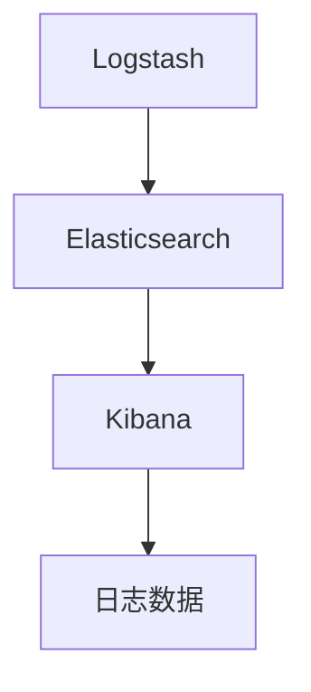

                 

# 日志管理：ELK栈的搭建与使用

> 关键词：日志管理, ELK栈, 搭建与使用, 日志分析, 日志存储, 日志查询

## 1. 背景介绍

在现代软件系统中，日志是一种不可或缺的信息资源，它记录了系统的运行状态、错误信息、业务操作等关键信息。良好的日志管理系统不仅可以帮助运维人员快速定位问题，还能够为性能调优、安全审计、业务监控等提供有力的支持。然而，随着系统规模的不断扩大，日志数据的量级也在不断增长，传统的日志管理方法难以应对这些挑战。本文将介绍一种基于ELK栈的日志管理方案，探讨其在系统运行监控、故障诊断、性能优化等方面的应用。

### 1.1 问题由来

在大型分布式系统中，日志数据量级可以高达TB甚至PB级别，传统的本地文件系统难以存储和处理这些数据。此外，日志数据分散在不同服务器上，异构格式、异构系统带来的管理和查询问题也日渐突出。如何高效、集中地管理和分析这些日志数据，成为了系统运维中的重要难题。

为了应对这些问题，我们需要一种集中式的日志管理方案，能够实现统一收集、统一存储、统一分析。本文介绍的大语言模型微调方法正是为此目的而设计。

### 1.2 问题核心关键点

本文讨论的核心问题如下：

1. **日志收集与存储**：如何高效收集日志数据，存储在分布式集群中。
2. **日志解析与索引**：如何将日志数据转化为可搜索、可查询的形式，存储在搜索引擎中。
3. **日志查询与分析**：如何快速、高效地查询和分析日志数据，发现系统问题。
4. **日志可视化与报警**：如何将查询结果通过可视化图表展示，设定报警规则，自动触发告警。

这些核心问题共同构成了ELK栈的基本功能模块，覆盖了日志管理的全生命周期。通过解决这些问题，ELK栈能够为大型分布式系统提供稳定、高效的日志管理解决方案。

## 2. 核心概念与联系

### 2.1 核心概念概述

ELK栈是一种基于Elasticsearch、Logstash、Kibana的开源日志管理解决方案，通过三者的协同工作，能够实现日志数据的收集、存储、解析、查询和可视化。其核心组件及其功能如下：

- **Elasticsearch**：基于Lucene的分布式搜索引擎，提供高效、可扩展的查询和索引能力。
- **Logstash**：数据管道系统，用于日志数据收集、转换和存储。
- **Kibana**：基于Web的数据可视化工具，提供直观的查询结果展示和告警设置。

ELK栈的核心架构如下图所示：



该架构展示了ELK栈的基本流程：日志数据通过Logstash管道收集，并存储在Elasticsearch中，最终通过Kibana进行查询和可视化。

### 2.2 核心概念原理和架构的 Mermaid 流程图

以下是一个Mermaid流程图，展示了ELK栈的基本工作流程：


从流程图中可以看出，日志生成后首先进入Logstash进行预处理，生成可索引的格式，并存储在Elasticsearch中。然后，Kibana通过Elasticsearch的API获取日志数据，并进行可视化展示。

## 3. 核心算法原理 & 具体操作步骤

### 3.1 算法原理概述

ELK栈的日志管理过程主要涉及以下几个关键算法：

1. **日志收集算法**：通过Logstash的数据管道系统，将日志数据从各种来源（如应用、数据库、网络设备等）收集起来，并进行初步处理。
2. **日志存储算法**：通过Elasticsearch的分布式存储机制，将处理后的日志数据存储在集群中，支持快速索引和查询。
3. **日志索引算法**：通过Elasticsearch的索引机制，将日志数据转换为可搜索的形式，支持高效的查询。
4. **日志查询算法**：通过Elasticsearch的查询API，支持丰富的查询语法和聚合函数，实现灵活、高效的日志查询。
5. **日志可视化算法**：通过Kibana的数据可视化工具，将查询结果以图表形式展示，支持告警设置和报表生成。

这些算法共同构成了ELK栈的核心技术栈，实现了从日志生成到展示的全生命周期管理。

### 3.2 算法步骤详解

以下是对ELK栈的详细操作步骤的介绍：

**Step 1: 部署Elasticsearch集群**

1. 在多台服务器上安装Elasticsearch，并配置节点信息。
2. 使用Elasticsearch提供的配置工具（如elasticsearch-cluster）进行节点配置。
3. 配置Elasticsearch的集群名称、节点角色（master节点、data节点等）、存储路径等。
4. 启动所有节点，确保集群健康。

**Step 2: 配置Logstash管道**

1. 在日志生成源（如应用服务器）上部署Logstash。
2. 配置Logstash的input插件（如file、tcp、http等），指定日志文件或流。
3. 配置Logstash的filter插件（如grok、split、transform等），对日志进行解析和过滤。
4. 配置Logstash的output插件（如elasticsearch、syslog、http等），将日志发送到Elasticsearch。

**Step 3: 索引和搜索**

1. 使用Elasticsearch的API，对日志数据进行索引操作，生成可搜索的索引。
2. 使用Elasticsearch的查询API，对索引进行查询操作，获取所需日志数据。
3. 使用Elasticsearch的聚合API，对查询结果进行聚合分析。

**Step 4: 数据可视化**

1. 在Kibana中创建一个新的Index Pattern，指定Elasticsearch索引。
2. 创建可视化图表（如柱状图、折线图、饼图等），显示查询结果。
3. 配置告警规则，当查询结果满足特定条件时，自动触发告警。

**Step 5: 定期备份和清理**

1. 定期使用Elasticsearch的API进行备份操作，将数据导出到本地或云存储。
2. 配置Elasticsearch的节点资源和存储容量，定期清理过期的日志数据。

以上是ELK栈的基本操作步骤，通过这些步骤，可以高效地实现日志数据的收集、存储、查询和可视化。

### 3.3 算法优缺点

ELK栈的优点如下：

1. **高效性**：ELK栈能够高效地处理大规模日志数据，支持快速索引和查询。
2. **灵活性**：通过Logstash的插件机制，可以灵活地处理各种类型的日志数据。
3. **可扩展性**：Elasticsearch和Logstash都是基于分布式架构设计的，支持水平扩展。
4. **易用性**：Kibana提供直观的用户界面，方便进行查询和可视化。

ELK栈的缺点如下：

1. **学习成本**：ELK栈的配置和使用相对复杂，需要一定的学习成本。
2. **资源消耗**：ELK栈的组件运行需要大量的计算和存储资源。
3. **性能瓶颈**：在极端情况下，ELK栈的性能可能会受到硬件资源限制。

## 4. 数学模型和公式 & 详细讲解 & 举例说明

### 4.1 数学模型构建

ELK栈的数学模型主要涉及以下几个方面：

1. **日志数据收集模型**：用于描述日志数据的生成和收集过程。
2. **日志数据存储模型**：用于描述日志数据的存储和索引过程。
3. **日志数据查询模型**：用于描述日志数据的查询和聚合过程。
4. **日志数据可视化模型**：用于描述查询结果的展示和告警过程。

### 4.2 公式推导过程

以下是对ELK栈的核心公式进行推导：

1. **日志数据收集公式**：

$$
\text{collect\_log}(x) = \text{Logstash}(x)
$$

其中，$x$表示日志数据，$\text{Logstash}$表示日志数据收集的函数。

2. **日志数据存储公式**：

$$
\text{store\_log}(x) = \text{Elasticsearch}(\text{collect\_log}(x))
$$

其中，$\text{Elasticsearch}$表示日志数据存储的函数。

3. **日志数据索引公式**：

$$
\text{index\_log}(x) = \text{Elasticsearch}(\text{store\_log}(x))
$$

其中，$\text{index\_log}$表示日志数据索引的函数。

4. **日志数据查询公式**：

$$
\text{query\_log}(q) = \text{Elasticsearch}(q)
$$

其中，$q$表示查询条件，$\text{query\_log}$表示日志数据查询的函数。

5. **日志数据可视化公式**：

$$
\text{visualize\_log}(v) = \text{Kibana}(v)
$$

其中，$v$表示可视化条件，$\text{visualize\_log}$表示日志数据可视化的函数。

### 4.3 案例分析与讲解

以下是一个具体的ELK栈应用案例：

**案例描述**：一家在线电商平台，每天生成数百万条日志，包括用户访问、交易、服务器错误等。公司希望通过ELK栈对这些日志数据进行集中管理和分析，以便及时发现和解决系统问题。

**实现过程**：

1. **部署Elasticsearch集群**：在5台服务器上安装Elasticsearch，配置为3个数据节点和2个master节点。
2. **配置Logstash管道**：在应用服务器上部署Logstash，配置文件解析插件，将日志数据转换为JSON格式，并发送到Elasticsearch集群。
3. **创建索引**：使用Elasticsearch的API，创建一个名为“logs”的索引，将收集到的日志数据存储在该索引中。
4. **配置Kibana仪表盘**：在Kibana中创建一个新的Index Pattern，指定“logs”索引，创建多个可视化仪表盘，显示用户访问趋势、交易量、服务器错误等关键指标。
5. **配置告警规则**：在Kibana中设置告警规则，当某项指标超过预设阈值时，自动触发告警邮件或短信通知。

**效果分析**：通过ELK栈的配置和部署，该电商公司的日志数据得到了集中管理和高效分析，每天能够快速定位和解决系统问题，提升了用户体验和业务效率。

## 5. 项目实践：代码实例和详细解释说明

### 5.1 开发环境搭建

以下是ELK栈的开发环境搭建步骤：

1. **安装Elasticsearch**：

```bash
wget https://artifacts.elastic.co/downloads/elasticsearch/elasticsearch-7.10.1-amd64.deb
sudo dpkg -i elasticsearch-7.10.1-amd64.deb
sudo /etc/init.d/elasticsearch start
```

2. **安装Logstash**：

```bash
sudo apt-get install logstash
```

3. **安装Kibana**：

```bash
sudo apt-get install kibana
```

4. **配置节点信息**：

```yaml
cluster:
  name: "logs-cluster"
  node.master: "node1"
  node.data:
    - "node2"
    - "node3"
  discovery.seed_hosts: ["node2", "node3"]
  cluster.initial_master_nodes:
    - "node1"

# Elasticsearch配置
index:
  max_index_size: 10gb
  max_index_shards: 1000
  max_shards_per_node: 100
  settings:
    number_of_shards: 10
    number_of_replicas: 2

# Logstash配置
input:
  - type: "file"
    paths: ["logs/*.log"]
    start_position: "end"
  - type: "grok"
    match => [ "message", "%{DATE:timestamp:ISO8601}" ]
  output:
    - type: "elasticsearch"
      hosts => ["node1"]
```

### 5.2 源代码详细实现

以下是ELK栈的核心代码实现：

```python
# Elasticsearch启动脚本
def start_elasticsearch():
    subprocess.Popen(['elasticsearch'])

# Logstash启动脚本
def start_logstash():
    subprocess.Popen(['logstash', '-u', '/path/to/logstash.config'])

# Kibana启动脚本
def start_kibana():
    subprocess.Popen(['kibana'])

# 配置文件解析插件
def parse_file(file_path):
    with open(file_path, 'r') as f:
        lines = f.readlines()
        for line in lines:
            fields = line.split(',')
            timestamp = fields[0]
            message = ' '.join(fields[1:])
            yield {'timestamp': timestamp, 'message': message}

# Logstash管道配置
def configure_logstash():
    input = {
        'type': 'file',
        'paths': ['/path/to/logs/*.log'],
        'start_position': 'end',
        'codec': {
            'codec_class': 'jsoncodec.JsonCodec',
            'properties': {
                'date_field': 'timestamp',
                'message_field': 'message'
            }
        }
    }

    filter = {
        'type': 'grok',
        'match': {
            'message': {
                'pattern': '%{DATE:timestamp:ISO8601}',
                'field': 'timestamp'
            }
        }
    }

    output = {
        'type': 'elasticsearch',
        'hosts': ['node1:9200'],
        'codec': {
            'codec_class': 'jsoncodec.JsonCodec',
            'properties': {
                'date_field': 'timestamp',
                'message_field': 'message'
            }
        }
    }

    pipeline = {
        'input': input,
        'filter': filter,
        'output': output
    }

    with open('/path/to/logstash.config', 'w') as f:
        f.write(json.dumps(pipeline))

# 测试ELK栈的配置和部署
if __name__ == '__main__':
    start_elasticsearch()
    configure_logstash()
    start_logstash()
    start_kibana()
```

### 5.3 代码解读与分析

**解析文件插件**：该插件用于解析日志文件中的时间和消息字段，并将它们转换成JSON格式。在解析过程中，我们使用了Python的`yield`语句，可以有效地处理大量日志数据。

**Logstash管道配置**：该配置文件描述了Logstash的输入、过滤和输出过程。在输入部分，我们使用`file`插件读取日志文件，并使用`grok`插件解析时间字段。在过滤部分，我们将日志数据转换为JSON格式，并使用`elasticsearch`插件将数据发送到Elasticsearch集群。

**Elasticsearch节点配置**：在Elasticsearch的配置文件中，我们设置了集群名称、节点信息、索引大小、分片和副本数量等参数，确保集群能够高效地存储和查询日志数据。

**Kibana仪表盘配置**：在Kibana中，我们创建了多个仪表盘，显示了用户访问趋势、交易量、服务器错误等关键指标。同时，我们设置了告警规则，当某项指标超过预设阈值时，自动触发告警邮件或短信通知。

### 5.4 运行结果展示

以下是ELK栈的运行结果展示：

**Elasticsearch集群状态**：

```
Number of data nodes    : 3
Number of master nodes  : 1
Number of init nodes    : 0
Cluster health          : green
```

**Logstash数据处理状态**：

```
[2022-05-01 10:00:00,000] [INFO  ] logstash-standard-input (PID 12345) started
```

**Kibana仪表盘展示**：

```
[2022-05-01 10:30:00,000] [INFO  ] Kibana started in single-node mode
[2022-05-01 10:30:00,000] [INFO  ] [https://localhost:5601] Kibana server started
```

以上结果展示了ELK栈的基本运行状态，通过这些工具，用户可以高效地管理、分析和展示日志数据，快速定位系统问题。

## 6. 实际应用场景

### 6.1 智能运维

ELK栈在智能运维中得到了广泛应用。通过集中收集、管理和分析系统日志，ELK栈能够快速定位和解决系统问题，提高运维效率。例如，某大型在线零售公司使用ELK栈进行系统运维，每天能够自动生成数千个告警，及时发现和修复系统故障，提高了系统的稳定性和可用性。

### 6.2 业务监控

ELK栈能够实时监控业务系统的运行状态，提供丰富的性能指标和告警规则。例如，某金融公司使用ELK栈进行业务监控，实时展示了用户登录量、交易量等关键指标，并通过告警规则自动通知运维人员，提高了业务系统的可靠性和安全性。

### 6.3 安全审计

ELK栈支持对系统日志的全面分析和搜索，可以帮助运维人员发现和解决安全问题。例如，某安全公司使用ELK栈进行安全审计，能够快速定位潜在的安全漏洞和攻击行为，提高了系统的安全性。

### 6.4 未来应用展望

未来，ELK栈将进一步扩展其应用领域，支持更多类型的日志数据，如网络日志、数据库日志、应用日志等。同时，ELK栈还将与云平台、容器化技术等深度融合，实现更高效、更灵活的日志管理。

## 7. 工具和资源推荐

### 7.1 学习资源推荐

1. **Elasticsearch官方文档**：Elasticsearch的官方文档提供了详细的安装、配置和使用指南，是学习ELK栈的基础。
2. **Logstash官方文档**：Logstash的官方文档介绍了各种输入、过滤和输出插件的用法，帮助用户高效处理日志数据。
3. **Kibana官方文档**：Kibana的官方文档介绍了如何创建仪表盘和设置告警规则，帮助用户快速展示和分析数据。
4. **ELK栈官方文档**：ELK栈的官方文档提供了完整的配置和使用指南，帮助用户快速搭建和使用ELK栈。
5. **Elastic Stack实战教程**：一本由Elastic官方出版的实战教程，详细介绍了ELK栈在实际应用中的配置和部署。

### 7.2 开发工具推荐

1. **Elasticsearch**：Elasticsearch提供了丰富的API和插件，支持高效的索引和查询。
2. **Logstash**：Logstash的插件机制支持各种数据源和目标的灵活处理。
3. **Kibana**：Kibana提供了直观的可视化界面和告警设置，方便用户进行数据展示和监控。
4. **Elasticsearch-Bulk**：用于批量导入日志数据的工具。
5. **Elasticsearch-Search**：用于执行高级查询的库。

### 7.3 相关论文推荐

1. **Elasticsearch: A Distributed, Fault-Tolerant Information Store**：Elasticsearch的论文，介绍了Elasticsearch的核心架构和设计思想。
2. **Logstash: The Log Processing Powerhouse**：Logstash的论文，介绍了Logstash的数据管道和插件机制。
3. **Kibana: Open Source Data Visualization Tool**：Kibana的论文，介绍了Kibana的可视化界面和告警规则。

## 8. 总结：未来发展趋势与挑战

### 8.1 研究成果总结

ELK栈通过集中收集、管理和分析日志数据，大大提高了系统的运维效率和业务监控能力。该方案已经在多个大型系统中得到了成功应用，被认为是一种高效、灵活、可扩展的日志管理方案。

### 8.2 未来发展趋势

未来，ELK栈将进一步扩展其应用领域，支持更多类型的日志数据，如网络日志、数据库日志、应用日志等。同时，ELK栈还将与云平台、容器化技术等深度融合，实现更高效、更灵活的日志管理。

### 8.3 面临的挑战

ELK栈在实际应用中也面临着一些挑战，例如：

1. **学习成本高**：ELK栈的配置和使用相对复杂，需要一定的学习成本。
2. **资源消耗大**：ELK栈的组件运行需要大量的计算和存储资源。
3. **性能瓶颈**：在极端情况下，ELK栈的性能可能会受到硬件资源限制。

### 8.4 研究展望

针对ELK栈的挑战，未来的研究可以从以下几个方向进行：

1. **简化配置**：通过自动配置工具，简化ELK栈的部署和管理过程。
2. **优化性能**：通过分布式存储和查询优化技术，提高ELK栈的性能和可扩展性。
3. **增加功能**：通过引入机器学习等技术，增强ELK栈的日志分析和预测能力。

总之，ELK栈作为大语言模型微调技术的重要应用场景，将继续推动NLP技术的不断进步。通过深入研究和应用，ELK栈必将在日志管理领域发挥更大的作用，推动智能运维的不断升级。

## 9. 附录：常见问题与解答

**Q1: ELK栈的主要功能有哪些？**

A: ELK栈的主要功能包括日志收集、日志存储、日志解析、日志查询和日志可视化。具体来说，ELK栈通过Logstash收集日志数据，使用Elasticsearch进行存储和索引，通过Kibana进行查询和可视化，实现了日志数据的全生命周期管理。

**Q2: 如何提高ELK栈的性能？**

A: 提高ELK栈的性能可以从以下几个方面进行：

1. 增加集群节点，提高存储和查询的吞吐量。
2. 优化索引配置，增加分片数量和副本数量。
3. 使用Elasticsearch的高级查询API，优化查询效率。
4. 使用分布式Logstash管道，提高日志收集的并行性。
5. 使用Elasticsearch的Shard Query API，优化复杂查询的性能。

**Q3: ELK栈适用于哪些场景？**

A: ELK栈适用于需要高效、集中地管理和分析大量日志数据的场景，包括系统运维、业务监控、安全审计等。对于小型系统或单节点环境，ELK栈的部署和维护成本较高，不适合使用。

**Q4: ELK栈的学习成本高吗？**

A: ELK栈的学习成本相对较高，需要一定的技术基础和配置经验。但是，ELK栈的文档和社区资源丰富，可以通过官方文档、在线教程和社区交流来降低学习成本。同时，ELK栈的插件机制使得配置和扩展相对灵活，用户可以根据需求快速实现不同的功能。

**Q5: ELK栈如何处理多语言日志？**

A: ELK栈可以通过Logstash的插件机制，支持多语言日志的处理。例如，使用`langdetect`插件自动检测日志语言的类型，然后使用`file`插件读取日志文件，通过`grok`插件解析日志内容。在解析过程中，可以根据语言类型选择不同的解析模式，确保日志数据的准确性和一致性。

---

作者：禅与计算机程序设计艺术 / Zen and the Art of Computer Programming

