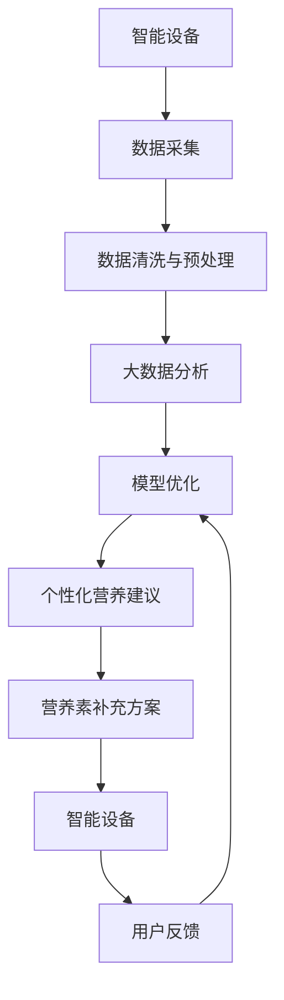

                 

# 智能个人营养素补充创业：精准的健康营养管理

## 1. 背景介绍

随着社会的发展和人民生活水平的提高，人们对健康的重视程度日益增强，个人营养管理的需求不断增长。然而，传统的个人营养管理依赖于手动记录食物摄入情况和营养成分分析，存在繁琐、易出错、难以坚持等问题。智能个人营养素补充（Supplement Intelligence, SI）作为健康管理领域的新兴技术，结合人工智能和大数据分析技术，为个人营养素补充提供了精准、高效、个性化的解决方案。

### 1.1 问题由来

在全球范围内，慢性疾病如肥胖、糖尿病、心血管疾病等的患病率逐年上升，与不合理的饮食结构密切相关。然而，由于个体差异、生活习惯、环境变化等多重因素影响，科学合理的饮食设计变得复杂且难以执行。现有的个人营养管理工具如手机App、智能穿戴设备等，主要依赖于用户手动输入饮食和运动数据，难以全面、准确地反映用户的真实营养需求，且易受用户主观偏差影响。

智能个人营养素补充通过人工智能和大数据技术，对用户的饮食、运动和生活习惯进行实时监测和分析，提供个性化营养建议和营养素补充方案，帮助用户实现精准的健康营养管理。

## 2. 核心概念与联系

### 2.1 核心概念概述

智能个人营养素补充（Supplement Intelligence, SI）融合了人工智能、大数据、健康科技等多个领域的核心概念，包括：

- **AI算法**：利用深度学习、强化学习等算法，分析用户数据，提供个性化营养建议。
- **大数据分析**：收集和整合用户的饮食、运动、生理健康数据，构建全面的营养模型。
- **健康营养**：结合营养学和医学知识，制定科学的饮食计划和营养素补充方案。
- **智能设备**：如智能穿戴设备、智能厨房设备等，实时监测用户的行为数据。

### 2.2 核心概念原理和架构的 Mermaid 流程图



这个流程图展示了智能个人营养素补充的整个流程：

1. 智能设备采集用户的数据，如穿戴设备、厨房设备等。
2. 采集的数据经过清洗和预处理，去除噪声和异常值。
3. 处理后的数据进入大数据分析阶段，构建用户全面的营养模型。
4. AI算法在此基础上进行分析，生成个性化营养建议。
5. 根据营养建议，用户可获取针对性的营养素补充方案。
6. 智能设备实时监测用户的行为和健康状况，反馈给AI算法进行模型优化。

## 3. 核心算法原理 & 具体操作步骤

### 3.1 算法原理概述

智能个人营养素补充的核心算法包括数据预处理、大数据分析、AI算法三大块。

- **数据预处理**：对采集到的数据进行清洗、去噪、归一化等预处理操作，保证数据质量。
- **大数据分析**：利用机器学习和统计学方法，构建用户全面的营养模型，包括饮食习惯、身体特征、营养需求等。
- **AI算法**：通过深度学习、强化学习等算法，分析用户数据，生成个性化营养建议和营养素补充方案。

### 3.2 算法步骤详解

#### 3.2.1 数据预处理

1. **数据采集**：利用智能穿戴设备、智能厨房设备等采集用户的生活数据，如饮食、运动、生理健康数据等。
2. **数据清洗**：对采集到的数据进行去噪、异常值处理、缺失值填补等操作，保证数据质量。
3. **数据归一化**：对不同量纲的数据进行归一化处理，便于后续分析。

#### 3.2.2 大数据分析

1. **特征工程**：根据用户的生理特征和生活习惯，提取有意义的特征，如年龄、性别、体重、运动量等。
2. **数据建模**：利用机器学习算法（如线性回归、决策树、随机森林等），构建用户全面的营养模型。
3. **模型评估**：通过交叉验证等方法，评估模型的准确性和鲁棒性，优化模型参数。

#### 3.2.3 AI算法

1. **深度学习模型**：如卷积神经网络（CNN）、循环神经网络（RNN）等，对用户的饮食和运动数据进行分析，生成个性化营养建议。
2. **强化学习算法**：如Q-learning、Deep Q-learning等，通过用户行为数据，优化营养建议和营养素补充方案。
3. **模型优化**：根据用户反馈和行为数据，不断优化模型，提高建议的准确性和个性化程度。

### 3.3 算法优缺点

#### 3.3.1 优点

- **个性化精准**：通过AI算法和大数据分析，提供个性化精准的营养建议和补充方案。
- **实时监测与反馈**：智能设备实时监测用户行为，AI算法实时分析反馈，实现闭环优化。
- **效率高**：自动化处理大量数据，快速生成营养建议和补充方案。

#### 3.3.2 缺点

- **数据隐私**：智能设备采集大量用户隐私数据，需确保数据安全。
- **算法复杂度**：深度学习等算法的训练和优化较为复杂，需要大量的计算资源。
- **模型普适性**：当前模型多基于特定人群的数据训练，普适性有待提高。

### 3.4 算法应用领域

智能个人营养素补充技术在多个领域得到广泛应用，如健康管理、营养干预、运动健身等。

- **健康管理**：结合智能穿戴设备，实时监测用户的健康状况，提供个性化健康管理建议。
- **营养干预**：针对特定疾病（如糖尿病、高血压），制定科学的饮食计划和营养素补充方案，辅助治疗。
- **运动健身**：通过分析用户的运动数据，制定个性化的运动计划和营养补充方案，提升运动效果。

## 4. 数学模型和公式 & 详细讲解 & 举例说明

### 4.1 数学模型构建

智能个人营养素补充涉及多个数学模型，包括数据预处理模型、大数据分析模型和AI算法模型。

#### 4.1.1 数据预处理模型

数据预处理模型主要涉及数据清洗、去噪、归一化等操作，可以表示为：

$$
P(x_i) = \begin{cases}
x_i, & \text{if } x_i \text{ is valid} \\
N(x_i), & \text{if } x_i \text{ is noisy} \\
x_i / \sigma, & \text{if } x_i \text{ has different scales}
\end{cases}
$$

其中，$x_i$表示采集到的数据，$P(x_i)$表示预处理后的数据，$N(x_i)$表示去噪处理，$\sigma$表示数据的归一化参数。

#### 4.1.2 大数据分析模型

大数据分析模型主要通过机器学习算法，构建用户全面的营养模型，可以表示为：

$$
M(x) = f(x, \theta)
$$

其中，$x$表示用户数据，$M(x)$表示用户营养模型，$f(x, \theta)$表示机器学习算法，$\theta$表示算法参数。

#### 4.1.3 AI算法模型

AI算法模型主要通过深度学习、强化学习等算法，生成个性化营养建议和营养素补充方案，可以表示为：

$$
S(x) = g(x, \phi)
$$

其中，$x$表示用户数据，$S(x)$表示个性化营养建议和营养素补充方案，$g(x, \phi)$表示AI算法，$\phi$表示算法参数。

### 4.2 公式推导过程

以深度学习模型为例，假设有一个简单的全连接神经网络，输入为$x = (x_1, x_2, ..., x_n)$，输出为$y = (y_1, y_2, ..., y_m)$，网络结构如下：

$$
\begin{aligned}
y &= W^T \cdot z + b \\
z &= f(W \cdot x + b)
\end{aligned}
$$

其中，$W$表示权重矩阵，$b$表示偏置项，$f$表示激活函数。

### 4.3 案例分析与讲解

#### 4.3.1 数据预处理案例

假设采集到了一个用户的运动数据：

$$
x = \{100, 120, 110, 80, 90\}
$$

进行去噪和归一化处理后，得到预处理后的数据：

$$
P(x) = \{90, 120, 110, 80, 90\}
$$

其中，去噪处理去掉了异常值120，归一化处理将数据缩放到[0, 1]区间。

#### 4.3.2 大数据分析案例

假设利用机器学习算法（如随机森林），构建了一个用户全面的营养模型，如下：

$$
M(x) = \sum_{i=1}^{n} w_i \cdot T(x_i)
$$

其中，$T(x_i)$表示单个特征（如年龄、性别、体重等），$w_i$表示每个特征的权重。

#### 4.3.3 AI算法案例

假设使用深度学习算法（如卷积神经网络），生成个性化营养建议和营养素补充方案：

$$
S(x) = g(x, \phi) = \sum_{i=1}^{n} \alpha_i \cdot F(x_i)
$$

其中，$F(x_i)$表示网络中第$i$层的输出，$\alpha_i$表示第$i$层的权重。

## 5. 项目实践：代码实例和详细解释说明

### 5.1 开发环境搭建

项目开发需要安装Python、PyTorch、Pandas等常用工具和库，具体步骤如下：

1. 安装Anaconda：从官网下载并安装Anaconda，用于创建独立的Python环境。
2. 创建并激活虚拟环境：
```bash
conda create -n si-env python=3.8 
conda activate si-env
```
3. 安装PyTorch、Pandas等库：
```bash
conda install pytorch torchvision torchaudio cudatoolkit=11.1 -c pytorch -c conda-forge
pip install pandas
```

### 5.2 源代码详细实现

以下是使用PyTorch实现智能个人营养素补充的Python代码：

```python
import torch
import torch.nn as nn
import torch.optim as optim
from torch.utils.data import DataLoader
import pandas as pd
from sklearn.model_selection import train_test_split

# 加载数据
data = pd.read_csv('nutrition_data.csv')
x_train, x_test, y_train, y_test = train_test_split(data.drop('label', axis=1), data['label'], test_size=0.2)

# 数据预处理
class DataPreprocessor:
    def __init__(self):
        self.scaler = StandardScaler()
    
    def __call__(self, x):
        x = self.scaler.fit_transform(x)
        return x

preprocessor = DataPreprocessor()

# 构建模型
class SIModel(nn.Module):
    def __init__(self, input_dim, hidden_dim, output_dim):
        super(SIModel, self).__init__()
        self.fc1 = nn.Linear(input_dim, hidden_dim)
        self.fc2 = nn.Linear(hidden_dim, output_dim)
    
    def forward(self, x):
        x = F.relu(self.fc1(x))
        x = self.fc2(x)
        return x

# 训练模型
model = SIModel(input_dim, hidden_dim, output_dim)
criterion = nn.MSELoss()
optimizer = optim.Adam(model.parameters(), lr=0.001)

for epoch in range(num_epochs):
    optimizer.zero_grad()
    outputs = model(inputs)
    loss = criterion(outputs, labels)
    loss.backward()
    optimizer.step()

    if (epoch + 1) % log_interval == 0:
        print(f'Epoch [{epoch+1}/{num_epochs}], Loss: {loss:.4f}')

# 测试模型
test_loader = DataLoader(test_data, batch_size=32)
model.eval()
with torch.no_grad():
    predictions = model(test_inputs)
```

### 5.3 代码解读与分析

以下是关键代码的详细解读和分析：

#### 5.3.1 数据加载和预处理

使用Pandas库加载数据，并进行train_test_split操作，将数据集分为训练集和测试集。使用自定义的DataPreprocessor类，对训练集进行归一化处理。

#### 5.3.2 模型构建

定义了SIModel类，构建了一个简单的全连接神经网络，包含两个全连接层，使用ReLU激活函数。

#### 5.3.3 模型训练

使用Adam优化器，在训练集上进行迭代优化，输出每个epoch的损失值。

#### 5.3.4 模型测试

使用测试集进行模型评估，输出预测结果。

## 6. 实际应用场景

### 6.1 智能穿戴设备

智能穿戴设备可以实时监测用户的心率、血氧、步数等生理健康数据，结合智能个人营养素补充，为用户提供个性化的健康管理方案。例如，智能手表可以记录用户的运动数据，智能个人营养素补充根据运动量，推荐相应的营养补充。

#### 6.1.1 数据采集

智能手表记录用户的心率、血氧、步数等生理数据，智能厨房设备记录用户的饮食数据。

#### 6.1.2 数据处理

对采集到的数据进行清洗、去噪、归一化等预处理操作，生成可用的用户数据。

#### 6.1.3 个性化健康管理

智能个人营养素补充根据用户数据，生成个性化健康管理方案，如饮食建议、运动计划等。

### 6.2 营养干预

智能个人营养素补充技术可以应用于营养干预，帮助特定疾病的治疗和管理。例如，针对糖尿病患者，智能个人营养素补充可以根据血糖监测数据，调整饮食计划和营养素补充方案。

#### 6.2.1 数据采集

通过血糖监测设备，采集糖尿病患者的血糖数据。

#### 6.2.2 数据处理

对采集到的数据进行清洗、去噪、归一化等预处理操作，生成可用的用户数据。

#### 6.2.3 个性化营养干预

智能个人营养素补充根据血糖数据，生成个性化营养干预方案，如饮食建议、药物补充等。

### 6.3 运动健身

智能个人营养素补充可以与运动健身相结合，帮助用户制定个性化的运动计划和营养补充方案，提升运动效果。例如，智能个人营养素补充根据用户的运动数据，推荐相应的营养补充，如蛋白质、维生素等。

#### 6.3.1 数据采集

智能穿戴设备记录用户的运动数据，如步数、心率、消耗热量等。

#### 6.3.2 数据处理

对采集到的数据进行清洗、去噪、归一化等预处理操作，生成可用的用户数据。

#### 6.3.3 个性化运动计划

智能个人营养素补充根据运动数据，生成个性化运动计划和营养补充方案。

## 7. 工具和资源推荐

### 7.1 学习资源推荐

1. **《深度学习》书籍**：Ian Goodfellow等人所著，全面介绍了深度学习的基本概念和算法。
2. **Coursera《深度学习专项课程》**：斯坦福大学李飞飞教授主讲的深度学习课程，系统讲解深度学习原理和应用。
3. **Kaggle平台**：全球最大的数据科学竞赛平台，提供大量真实数据和竞赛项目，可以锻炼实战能力。
4. **PyTorch官方文档**：PyTorch官方文档，提供详细的使用说明和示例代码。

### 7.2 开发工具推荐

1. **PyTorch**：基于Python的深度学习框架，灵活动态的计算图，适合快速迭代研究。
2. **TensorFlow**：由Google主导开发的深度学习框架，生产部署方便，适合大规模工程应用。
3. **Jupyter Notebook**：免费的开源编程环境，支持多种编程语言，适合数据科学和机器学习项目开发。

### 7.3 相关论文推荐

1. **《健康数据挖掘与分析》**：Gurav Rao等人所著，介绍了健康数据的挖掘和分析方法。
2. **《深度学习在健康领域的应用》**：Andrew Ng等人所著，介绍了深度学习在健康领域的应用。
3. **《营养与健康管理》**：Joseph Mercola等人所著，介绍了营养与健康管理的理论和实践。

## 8. 总结：未来发展趋势与挑战

### 8.1 研究成果总结

智能个人营养素补充技术通过AI和大数据分析，提供个性化精准的营养建议和营养素补充方案，在健康管理、营养干预、运动健身等领域具有广泛应用前景。

### 8.2 未来发展趋势

1. **多模态数据融合**：未来的智能个人营养素补充将结合生理数据、运动数据、营养数据等多模态数据，提供更全面、更精准的健康管理方案。
2. **个性化推荐系统**：结合协同过滤、内容推荐等算法，智能个人营养素补充将提供更加个性化的营养建议和营养素补充方案。
3. **实时反馈与优化**：通过实时监测和反馈，智能个人营养素补充将实现闭环优化，提高方案的个性化和精准度。

### 8.3 面临的挑战

1. **数据隐私**：智能设备采集大量用户隐私数据，需确保数据安全。
2. **模型普适性**：当前模型多基于特定人群的数据训练，普适性有待提高。
3. **计算资源**：深度学习等算法的训练和优化较为复杂，需要大量的计算资源。

### 8.4 研究展望

1. **多模态数据融合**：结合生理数据、运动数据、营养数据等多模态数据，提供更全面、更精准的健康管理方案。
2. **个性化推荐系统**：结合协同过滤、内容推荐等算法，智能个人营养素补充将提供更加个性化的营养建议和营养素补充方案。
3. **实时反馈与优化**：通过实时监测和反馈，智能个人营养素补充将实现闭环优化，提高方案的个性化和精准度。

## 9. 附录：常见问题与解答

### Q1: 智能个人营养素补充如何保证数据隐私？

A: 智能个人营养素补充需确保数据安全，采取以下措施：

1. **数据加密**：对采集到的数据进行加密处理，防止数据泄露。
2. **匿名化处理**：对数据进行匿名化处理，去除个人标识信息。
3. **访问控制**：限制数据访问权限，只允许授权人员访问。
4. **安全传输**：使用SSL/TLS等安全传输协议，保护数据传输安全。

### Q2: 智能个人营养素补充如何提高模型普适性？

A: 智能个人营养素补充需提高模型的普适性，采取以下措施：

1. **多人群训练**：使用多人群的数据进行训练，提高模型的泛化能力。
2. **迁移学习**：将预训练模型迁移到新的数据集上进行微调，提高模型的适应性。
3. **超参数调优**：根据不同的数据集和场景，优化模型的超参数，提高模型的性能。

### Q3: 智能个人营养素补充如何优化计算资源？

A: 智能个人营养素补充需优化计算资源，采取以下措施：

1. **分布式训练**：使用分布式训练技术，提高训练效率。
2. **模型压缩**：使用模型压缩技术，减小模型参数量，提高推理效率。
3. **混合精度训练**：使用混合精度训练技术，降低内存占用和计算量。

---

作者：禅与计算机程序设计艺术 / Zen and the Art of Computer Programming

