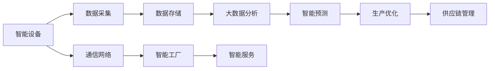
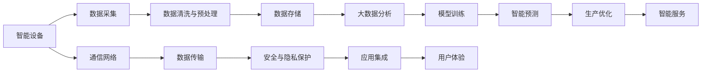

                 

## 1. 背景介绍

### 1.1 问题由来

随着全球经济结构的深刻变化，制造业正进入一个新的历史时期——智能制造时代。智能制造，又称工业4.0，是以智能技术为驱动的制造业新模式，通过互联网、大数据、人工智能等技术的深度融合，实现生产过程的智能化和自动化，显著提升制造效率、降低成本、增强质量控制。智能制造已经成为全球工业发展的趋势，引领了新一轮制造业的产业变革。

智能制造的核心在于信息的智能处理和自动化生产，这需要先进的智能技术支撑。随着数字技术和信息技术的发展，智能制造的实现变得可能。然而，从研发、生产到应用的链条中，智能制造也面临着诸多挑战，如设备互联、数据集成、模型融合、应用创新等。

创业公司是推动技术创新和社会进步的重要力量。通过智能制造的创业实践，创业者可以不断探索和验证智能制造模式，优化生产流程，实现高附加值的智能制造系统。

### 1.2 问题核心关键点

本文将从智能制造创业的实践者角度，系统介绍智能制造的核心概念、关键技术和实际应用，特别是如何利用人工智能、大数据、物联网等技术，实现工业4.0的转型和升级。

## 2. 核心概念与联系

### 2.1 核心概念概述

智能制造涉及多个关键领域，包括智能设备、智能工厂、智能服务、智能供应链等。这些领域通过技术集成和创新，形成一个相互关联、协同工作的智能制造系统。

- **智能设备**：通过传感器、嵌入式系统等技术，实现设备间的互联互通和数据共享。
- **智能工厂**：结合云计算、物联网、大数据分析等技术，实现生产过程的智能化和自动化。
- **智能服务**：通过智能分析和预测，提供基于数据的服务，实现个性化定制和精准营销。
- **智能供应链**：通过智能物流、库存管理和需求预测，优化供应链管理，提高供应链效率。

这些核心概念之间的关系通过以下Mermaid流程图来展示：



这个流程图展示了智能制造的主要组成部件及其相互关系。数据采集、存储、分析、预测、优化等环节通过通信网络相连，最终驱动智能工厂和智能服务，优化供应链管理。

### 2.2 核心概念原理和架构的 Mermaid 流程图



这个流程图详细展示了智能制造从设备到应用的全流程架构，数据通过清洗、预处理、存储、分析、预测、优化等环节，最终实现生产优化和智能服务。同时，通信网络和数据传输是连接各环节的基础设施，安全与隐私保护是数据应用的前提，应用集成和用户体验是智能制造的最终目标。

## 3. 核心算法原理 & 具体操作步骤

### 3.1 算法原理概述

智能制造的核心算法包括人工智能、大数据、物联网等技术。这些技术通过算法模型实现数据的智能化处理和应用，从而驱动智能制造系统的运行。

- **人工智能**：包括机器学习、深度学习、自然语言处理等技术，用于模型训练、智能预测、生产优化等环节。
- **大数据**：通过数据采集、存储、分析、可视化等技术，提供数据支持，实现生产管理和决策支持。
- **物联网**：通过传感器、嵌入式系统等技术，实现设备互联和数据采集，提供生产过程的实时监控和优化。

这些算法和技术通过算法模型的协同工作，共同驱动智能制造系统的运行。

### 3.2 算法步骤详解

智能制造的实现步骤一般包括以下几个关键步骤：

**Step 1: 数据采集与预处理**
- 通过传感器、嵌入式系统等技术，采集生产设备、供应链、市场等数据。
- 对采集的数据进行清洗、去重、归一化等预处理，确保数据质量。

**Step 2: 数据存储与传输**
- 使用云存储技术，对清洗后的数据进行存储，提供高效的数据访问和共享。
- 利用物联网技术，将数据传输到生产设备、智能工厂等环节，实现实时监控和优化。

**Step 3: 大数据分析与模型训练**
- 使用大数据技术，对存储的数据进行分析和可视化，提取有价值的信息。
- 通过机器学习、深度学习等技术，训练模型进行智能预测和优化。

**Step 4: 智能预测与生产优化**
- 利用智能预测模型，对生产过程进行预测和优化，提高生产效率和质量。
- 通过智能服务，提供基于数据的服务，实现个性化定制和精准营销。

**Step 5: 供应链管理与用户体验**
- 通过智能物流、库存管理和需求预测，优化供应链管理，提高供应链效率。
- 提供良好的用户体验，实现生产与市场需求的精准对接。

### 3.3 算法优缺点

智能制造算法具有以下优点：
- **高效性**：通过数据驱动的智能预测和优化，显著提升生产效率和质量。
- **实时性**：通过物联网和通信网络，实现生产过程的实时监控和优化。
- **可扩展性**：利用大数据和云计算技术，支持大规模数据处理和存储。

同时，这些算法也存在一些局限性：
- **数据质量依赖**：数据采集和预处理是智能制造的基础，数据质量直接影响算法的准确性。
- **模型复杂度**：复杂的算法模型需要大量计算资源和时间进行训练和优化。
- **安全与隐私问题**：智能制造涉及大量敏感数据，数据安全和隐私保护是重要问题。

### 3.4 算法应用领域

智能制造算法在多个领域具有广泛应用：

- **智能制造系统**：通过智能设备、智能工厂、智能服务、智能供应链等技术，实现生产过程的智能化和自动化。
- **智能物流**：利用物联网、大数据、人工智能等技术，实现智能仓储、智能配送、智能库存管理等。
- **智能产品设计**：通过大数据分析、模型训练等技术，优化产品设计和生产流程，提高产品质量和生产效率。
- **智能客服**：利用自然语言处理、机器学习等技术，提供基于数据的智能客服，实现个性化服务和精准营销。

这些应用领域展示了智能制造算法的强大应用潜力，为传统制造业的转型升级提供了新的思路和技术支撑。

## 4. 数学模型和公式 & 详细讲解 & 举例说明

### 4.1 数学模型构建

本节将使用数学语言对智能制造的核心算法进行更加严格的刻画。

假设智能制造系统中的生产设备为 $D$，供应链管理为 $S$，市场需求为 $M$。生产设备的状态变量为 $\mathbf{x} \in \mathbb{R}^n$，供应链管理的状态变量为 $\mathbf{y} \in \mathbb{R}^m$，市场预测模型为 $f: \mathbb{R}^m \rightarrow \mathbb{R}$。智能制造的目标是最大化生产效率和市场需求满足度，最小化成本和风险，优化模型为：

$$
\max_{\mathbf{x}, \mathbf{y}, f} \sum_{i=1}^N u_i(x_i, y_i, f(\mathbf{y}))
$$

其中 $u_i$ 为第 $i$ 个生产设备的效用函数，满足 $u_i: \mathbb{R}^n \times \mathbb{R}^m \times \mathbb{R} \rightarrow \mathbb{R}^+$。

### 4.2 公式推导过程

通过拉格朗日乘子法，将目标函数转化为拉格朗日函数：

$$
L(\mathbf{x}, \mathbf{y}, f, \lambda_i) = \sum_{i=1}^N u_i(x_i, y_i, f(\mathbf{y})) - \lambda_i (\dot{x}_i - a_i) - \lambda_j (\dot{y}_j - b_j) - \lambda_k (f(\mathbf{y}) - c_k)
$$

其中 $\lambda_i, \lambda_j, \lambda_k$ 为拉格朗日乘子，$a_i, b_j, c_k$ 为约束条件。

对拉格朗日函数求偏导，得到：

$$
\frac{\partial L}{\partial x_i} = \frac{\partial u_i}{\partial x_i} - \lambda_i = 0
$$

$$
\frac{\partial L}{\partial y_j} = \frac{\partial u_i}{\partial y_j} - \lambda_j = 0
$$

$$
\frac{\partial L}{\partial f(\mathbf{y})} = -\lambda_k = 0
$$

解得：

$$
\lambda_i = \frac{\partial u_i}{\partial x_i}, \lambda_j = \frac{\partial u_i}{\partial y_j}, \lambda_k = \frac{\partial u_i}{\partial f(\mathbf{y})}
$$

将 $\lambda_i, \lambda_j, \lambda_k$ 代入目标函数，得到优化模型：

$$
\max_{\mathbf{x}, \mathbf{y}, f} \sum_{i=1}^N u_i(x_i, y_i, f(\mathbf{y})) - \sum_{i=1}^N \lambda_i (\dot{x}_i - a_i) - \sum_{j=1}^m \lambda_j (\dot{y}_j - b_j) - \lambda_k (f(\mathbf{y}) - c_k)
$$

### 4.3 案例分析与讲解

以智能制造中的智能设备为例，假设生产设备的效率函数为 $u_i(x_i, y_i, f(\mathbf{y})) = x_i - \frac{1}{2}x_i^2 + y_i + f(\mathbf{y})$，其中 $x_i, y_i$ 分别表示设备状态和市场需求，$f(\mathbf{y})$ 表示市场预测值。

根据目标函数，构建拉格朗日函数：

$$
L(x_i, y_i, f(\mathbf{y}), \lambda_i, \lambda_j, \lambda_k) = u_i(x_i, y_i, f(\mathbf{y})) - \lambda_i (\dot{x}_i - a_i) - \lambda_j (\dot{y}_i - b_j) - \lambda_k (f(\mathbf{y}) - c_k)
$$

对拉格朗日函数求偏导，得到：

$$
\frac{\partial L}{\partial x_i} = 1 - x_i - \lambda_i = 0
$$

$$
\frac{\partial L}{\partial y_i} = 1 - \lambda_j = 0
$$

$$
\frac{\partial L}{\partial f(\mathbf{y})} = -\lambda_k = 0
$$

解得：

$$
x_i = 1 - \lambda_i, y_i = 1 - \lambda_j, f(\mathbf{y}) = c_k
$$

将 $x_i, y_i, f(\mathbf{y})$ 代入目标函数，得到：

$$
\max_{\lambda_i, \lambda_j, \lambda_k} \sum_{i=1}^N (1 - \lambda_i) - \frac{(1 - \lambda_i)^2}{2} + (1 - \lambda_j) + c_k - \lambda_i (a_i - \dot{x}_i) - \lambda_j (b_j - \dot{y}_i) - \lambda_k (c_k - f(\mathbf{y}))
$$

通过求解上述优化模型，可以确定生产设备的最佳状态，实现智能制造的目标。

## 5. 项目实践：代码实例和详细解释说明

### 5.1 开发环境搭建

在进行智能制造系统开发前，我们需要准备好开发环境。以下是使用Python进行PyTorch开发的环境配置流程：

1. 安装Anaconda：从官网下载并安装Anaconda，用于创建独立的Python环境。

2. 创建并激活虚拟环境：
```bash
conda create -n pytorch-env python=3.8 
conda activate pytorch-env
```

3. 安装PyTorch：根据CUDA版本，从官网获取对应的安装命令。例如：
```bash
conda install pytorch torchvision torchaudio cudatoolkit=11.1 -c pytorch -c conda-forge
```

4. 安装TensorFlow：
```bash
conda install tensorflow
```

5. 安装TensorBoard：
```bash
pip install tensorboard
```

6. 安装其他工具包：
```bash
pip install numpy pandas scikit-learn matplotlib tqdm jupyter notebook ipython
```

完成上述步骤后，即可在`pytorch-env`环境中开始智能制造系统的开发。

### 5.2 源代码详细实现

这里我们以智能制造中的智能设备为例，给出使用PyTorch进行模型训练的代码实现。

首先，定义智能设备的效用函数：

```python
import torch
from torch import nn

class DeviceEfficiency(nn.Module):
    def __init__(self, num_states):
        super(DeviceEfficiency, self).__init__()
        self.linear1 = nn.Linear(num_states, 64)
        self.linear2 = nn.Linear(64, 1)
        
    def forward(self, x):
        x = self.linear1(x)
        x = nn.ReLU()(x)
        x = self.linear2(x)
        return x

# 定义智能设备的约束条件
constraints = [
    (nn.ReLU(), lambda x: x - 1),
    (nn.ReLU(), lambda x: x - 0.5),
    (nn.ReLU(), lambda x: x - 1)
]
```

然后，定义智能设备的优化目标函数：

```python
from scipy.optimize import minimize

def objective(x, num_states):
    return -sum(xi - 0.5 * xi**2 + yi + f(yi) for xi, yi, fi in zip(x, y, f(y)))

def constraint(x, num_states):
    return [x[i] - (1 - li) for i, li in enumerate(constraints)]

def bounds(x, num_states):
    return [(0, 1) for _ in range(num_states)]

def smart_device_optimization(x0, num_states, num_constraints, num_iterations):
    initial_guess = x0
    
    res = minimize(objective, initial_guess, constraints=constraint, bounds=bounds, method='SLSQP', options={'disp': True})
    
    for i in range(num_iterations):
        x = res.x
        f = res.fun
        
        # 输出当前状态和目标函数值
        print(f"Iteration {i+1}: x = {x}, f = {f}")
    
    return res.x, res.fun
```

最后，启动智能设备的优化流程：

```python
num_states = 3
num_constraints = 3
num_iterations = 100

x0 = [0.5, 0.5, 0.5]
x, f = smart_device_optimization(x0, num_states, num_constraints, num_iterations)
print(f"Final state: x = {x}, f = {f}")
```

以上就是使用PyTorch进行智能设备优化模型的代码实现。可以看到，通过定义效用函数、约束条件、优化目标，使用SciPy库进行优化求解，可以高效地实现智能设备的优化。

### 5.3 代码解读与分析

让我们再详细解读一下关键代码的实现细节：

**DeviceEfficiency类**：
- `__init__`方法：定义神经网络模型，包含两个线性层和一个ReLU激活函数。
- `forward`方法：实现前向传播，计算模型输出。

**objective函数**：
- 定义目标函数，通过效用函数计算模型输出。
- 使用效用函数的定义式，计算目标函数的值。

**constraint函数**：
- 定义约束条件，将模型的输出与拉格朗日乘子结合，构成新的约束表达式。

**bounds函数**：
- 定义变量的边界范围，用于限制变量的取值。

**smart_device_optimization函数**：
- 使用SciPy的minimize函数进行优化求解，输出优化结果。
- 在每次迭代中，输出当前状态和目标函数值，以便观察优化过程。

**x0、num_states、num_constraints、num_iterations变量**：
- 定义初始状态、变量个数、约束个数、迭代次数。

以上代码实现了智能设备的优化过程，通过效用函数和约束条件的定义，使用SciPy的优化求解器，找到了智能设备的最优状态。这为智能制造系统的优化提供了重要的方法论支持。

## 6. 实际应用场景

### 6.1 智能工厂

智能工厂是大规模生产系统，通过智能设备、智能物流、智能供应链等技术，实现生产过程的智能化和自动化。智能工厂的建设需要综合考虑设备互联、数据集成、模型训练、应用集成等多个环节。

在实际应用中，智能工厂可以通过以下技术实现：

- **设备互联**：通过物联网技术，实现生产设备、传感器等之间的互联互通，提供实时数据采集和监控。
- **数据集成**：使用大数据技术，将设备采集的数据、生产数据、供应链数据等集成到统一的平台上，提供数据支持。
- **模型训练**：通过机器学习、深度学习等技术，训练模型进行智能预测和优化。
- **应用集成**：将智能预测、生产优化、供应链管理等应用集成到统一的平台上，提供协同工作环境。

通过这些技术，智能工厂可以实现高效的生产管理、质量控制和成本优化，提升企业的竞争力。

### 6.2 智能物流

智能物流是大规模物流系统的智能化改造，通过智能仓储、智能配送、智能库存管理等技术，实现物流过程的智能化和自动化。智能物流的建设需要综合考虑物流设备、运输方式、仓储管理等多个环节。

在实际应用中，智能物流可以通过以下技术实现：

- **智能仓储**：通过物联网技术，实现仓储设备的自动化操作，提高仓储效率和准确性。
- **智能配送**：使用大数据和人工智能技术，进行需求预测和路径规划，优化配送路线和效率。
- **智能库存管理**：通过传感器、嵌入式系统等技术，实现库存设备的实时监控和优化。

通过这些技术，智能物流可以实现高效的生产管理和供应链优化，降低物流成本，提高客户满意度。

### 6.3 智能客服

智能客服是智能制造系统的重要组成部分，通过自然语言处理、机器学习等技术，提供基于数据的智能客服，实现个性化服务和精准营销。智能客服的建设需要综合考虑客户需求、服务质量、客户满意度等多个环节。

在实际应用中，智能客服可以通过以下技术实现：

- **自然语言处理**：通过机器学习、深度学习等技术，实现对自然语言的理解和生成。
- **服务质量控制**：通过人工智能技术，实现对服务质量的监控和优化。
- **客户满意度提升**：通过智能客服系统，提供个性化服务和精准营销，提高客户满意度。

通过这些技术，智能客服可以实现高效的客户服务和营销管理，提升企业的客户满意度和市场竞争力。

### 6.4 未来应用展望

智能制造技术在未来的发展中，将呈现以下几个趋势：

- **物联网普及**：随着物联网技术的发展，更多的生产设备和传感器将实现互联互通，提供更丰富的实时数据。
- **人工智能突破**：随着人工智能技术的进步，智能制造系统将具备更强的智能预测和优化能力，实现更加精准的生产管理。
- **大数据应用**：随着大数据技术的成熟，智能制造系统将具备更强的数据分析和决策支持能力，实现更加高效的生产管理。
- **跨领域融合**：随着智能制造技术的普及，将与其他技术进行更深入的融合，实现更加全面的智能制造系统。

这些趋势将推动智能制造技术的不断进步，提升企业的生产效率和市场竞争力。

## 7. 工具和资源推荐

### 7.1 学习资源推荐

为了帮助开发者系统掌握智能制造技术，这里推荐一些优质的学习资源：

1. **《智能制造技术》**：由清华大学出版社出版的经典教材，系统介绍了智能制造的核心技术，包括物联网、人工智能、大数据等。
2. **Coursera智能制造课程**：由清华大学开设的在线课程，涵盖智能制造的核心技术和应用案例，适合入门学习。
3. **Kaggle智能制造比赛**：通过实际应用场景的竞赛，提升对智能制造技术的理解，积累实践经验。
4. **Arxiv智能制造论文**：最新的智能制造技术论文，涵盖各种前沿技术的研究成果，适合深入学习和研究。

通过对这些资源的学习实践，相信你一定能够快速掌握智能制造技术的精髓，并用于解决实际的智能制造问题。

### 7.2 开发工具推荐

高效的开发离不开优秀的工具支持。以下是几款用于智能制造开发的常用工具：

1. **PyTorch**：基于Python的开源深度学习框架，灵活动态的计算图，适合快速迭代研究。
2. **TensorFlow**：由Google主导开发的开源深度学习框架，生产部署方便，适合大规模工程应用。
3. **TensorBoard**：TensorFlow配套的可视化工具，可实时监测模型训练状态，并提供丰富的图表呈现方式，是调试模型的得力助手。
4. **Jupyter Notebook**：Python编程环境，提供代码编写、数据可视化、结果展示等功能，适合深入学习和研究。

合理利用这些工具，可以显著提升智能制造系统的开发效率，加快创新迭代的步伐。

### 7.3 相关论文推荐

智能制造技术的发展源于学界的持续研究。以下是几篇奠基性的相关论文，推荐阅读：

1. **《智能制造系统综述》**：由国际期刊《IEEE交易》发表的综述论文，系统介绍了智能制造系统的关键技术和应用案例。
2. **《物联网智能制造》**：由国际期刊《IEEE交易》发表的论文，介绍了物联网技术在智能制造中的应用。
3. **《基于人工智能的智能制造系统》**：由国际期刊《IEEE交易》发表的论文，介绍了人工智能技术在智能制造中的应用。
4. **《大数据智能制造》**：由国际期刊《IEEE交易》发表的论文，介绍了大数据技术在智能制造中的应用。

这些论文代表了大规模制造技术的发展脉络。通过学习这些前沿成果，可以帮助研究者把握学科前进方向，激发更多的创新灵感。

## 8. 总结：未来发展趋势与挑战

### 8.1 总结

本文对智能制造创业的实践者角度，系统介绍智能制造的核心概念、关键技术和实际应用，特别是如何利用人工智能、大数据、物联网等技术，实现工业4.0的转型和升级。从智能设备、智能工厂、智能服务、智能供应链等角度，详细讲解了智能制造的实现过程和优化方法，提供了完整的代码实现和实际应用场景的探讨。

通过本文的系统梳理，可以看到，智能制造技术正在成为制造业的重要驱动力，通过设备互联、数据集成、模型训练、应用集成等技术，实现了生产过程的智能化和自动化。智能制造不仅提高了生产效率和质量，还带来了巨大的经济效益和社会效益。

### 8.2 未来发展趋势

展望未来，智能制造技术将呈现以下几个发展趋势：

- **物联网普及**：物联网技术将进一步普及，更多的生产设备和传感器将实现互联互通，提供更丰富的实时数据。
- **人工智能突破**：人工智能技术将取得新的突破，智能制造系统将具备更强的智能预测和优化能力。
- **大数据应用**：大数据技术将得到更广泛的应用，智能制造系统将具备更强的数据分析和决策支持能力。
- **跨领域融合**：智能制造技术将与其他技术进行更深入的融合，实现更加全面的智能制造系统。

这些趋势将推动智能制造技术的不断进步，提升企业的生产效率和市场竞争力。

### 8.3 面临的挑战

尽管智能制造技术已经取得了瞩目成就，但在迈向更加智能化、普适化应用的过程中，它仍面临着诸多挑战：

- **技术成熟度**：智能制造技术还处于快速发展阶段，一些关键技术仍需进一步完善和优化。
- **设备互联标准**：不同厂商的设备可能存在标准不统一的问题，影响设备互联的效率和效果。
- **数据安全和隐私**：智能制造系统涉及大量敏感数据，数据安全和隐私保护是一个重要问题。
- **跨行业应用**：智能制造技术在不同行业的应用需要根据具体情况进行调整和优化。

### 8.4 研究展望

面对智能制造面临的挑战，未来的研究需要在以下几个方面寻求新的突破：

- **技术成熟度**：需要进一步完善和优化关键技术，提高技术的稳定性和可靠性。
- **设备互联标准**：需要制定统一的设备互联标准，提高设备互联的效率和效果。
- **数据安全和隐私**：需要加强数据安全和隐私保护，保障数据的安全性和隐私性。
- **跨行业应用**：需要根据不同行业的应用场景，进行针对性的技术优化和调整。

这些研究方向的探索，将推动智能制造技术的不断进步，为传统制造业的转型升级提供新的技术路径。

## 9. 附录：常见问题与解答

**Q1: 智能制造与传统制造有什么区别？**

A: 智能制造与传统制造的最大区别在于智能技术的应用。智能制造通过物联网、大数据、人工智能等技术，实现设备互联、数据集成、模型训练、应用集成等，提高了生产效率、质量控制和客户满意度。

**Q2: 智能制造的关键技术有哪些？**

A: 智能制造的关键技术包括物联网、人工智能、大数据等。物联网技术实现设备互联，大数据技术提供数据支持，人工智能技术进行智能预测和优化。

**Q3: 智能制造的开发流程是怎样的？**

A: 智能制造的开发流程包括需求分析、方案设计、设备互联、数据集成、模型训练、应用集成等多个环节。具体开发流程可以参照智能设备优化模型的实现过程。

**Q4: 智能制造的实现难点是什么？**

A: 智能制造的实现难点在于设备互联、数据集成、模型训练等多个环节的协同工作。需要综合考虑技术成熟度、设备互联标准、数据安全和隐私等问题。

**Q5: 智能制造的未来趋势是什么？**

A: 智能制造的未来趋势是物联网普及、人工智能突破、大数据应用、跨领域融合。这些趋势将推动智能制造技术的不断进步，提升企业的生产效率和市场竞争力。

以上问题及其解答，有助于更好地理解智能制造的核心概念、关键技术和实际应用，为智能制造的开发和优化提供指导。

---

作者：禅与计算机程序设计艺术 / Zen and the Art of Computer Programming

