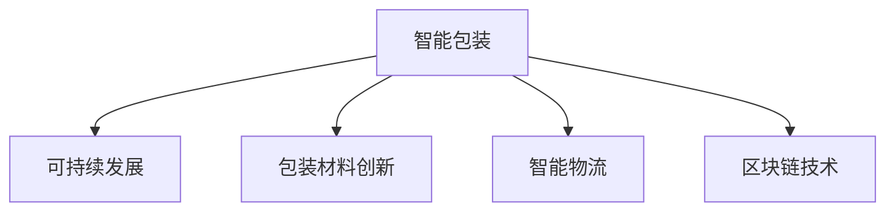

                 

# 智能包装创业：可持续与智能的包装解决方案

> 关键词：智能包装、可持续发展、包装材料创新、智能物流、区块链技术

## 1. 背景介绍

### 1.1 问题由来
随着全球消费市场的不断增长，包装材料的需求也日益增加。然而，传统的包装材料在环保、安全、便捷性等方面仍存在诸多不足。同时，面对瞬息万变的市场需求，快速响应和高效供应链管理也成为一大挑战。

为此，智能包装创业应运而生。它通过整合先进的传感器技术、区块链技术、智能物流等，在降低环境影响、提高包装材料安全性、提升供应链效率等方面提供全面的解决方案。本文将探讨智能包装的原理、技术架构、核心算法和实际应用案例，以期为相关领域创业者提供参考。

### 1.2 问题核心关键点
智能包装的核心关键点在于以下几个方面：

1. **环境友好性**：使用可降解材料和节能技术，减少包装材料的环境影响。
2. **安全追溯**：通过区块链技术实现包装材料的追溯和供应链的透明化。
3. **智能识别与交互**：利用传感器和智能标签，实现包装材料的智能化识别和管理。
4. **物流优化**：采用大数据和机器学习技术，优化包装物流流程，提高效率和准确性。
5. **信息集成**：实现包装信息与产品信息、订单信息等的集成，提升用户体验。

这些关键点共同构成了智能包装创业的核心目标，即实现包装的可持续性、安全性、智能化和高效化。

## 2. 核心概念与联系

### 2.1 核心概念概述

为更好地理解智能包装的原理和应用，本节将介绍几个关键概念：

- **智能包装**：通过集成传感器、智能标签、区块链等技术，实现对包装材料的智能化管理和追踪。
- **可持续发展**：指包装材料的生产、使用和回收过程中，尽量减少对环境的负面影响。
- **包装材料创新**：包括使用生物基材料、可降解材料、纳米材料等新型材料，提高包装材料的环保性能。
- **智能物流**：通过大数据、机器学习等技术，优化物流供应链，提高包装物流效率。
- **区块链技术**：一种分布式账本技术，用于实现数据的透明、安全、不可篡改。

这些概念之间的逻辑关系可以通过以下Mermaid流程图来展示：



这个流程图展示了智能包装的核心概念及其之间的关系：

1. 智能包装基于包装材料的创新和智能物流，实现高效的包装管理。
2. 包装材料的创新，尤其是环保型材料的应用，是实现可持续发展的重要基础。
3. 区块链技术在智能包装中的应用，进一步提升了包装管理的透明性和安全性。

## 3. 核心算法原理 & 具体操作步骤
### 3.1 算法原理概述

智能包装的核心算法原理主要包括以下几个方面：

- **环境友好算法**：使用机器学习模型预测包装材料的环境影响，优化材料选择。
- **追溯算法**：基于区块链技术，实现包装材料从生产到回收的全程追溯。
- **智能识别算法**：利用计算机视觉和传感器技术，实现对包装材料的自动识别和分类。
- **物流优化算法**：采用大数据和机器学习技术，优化包装物流路径和资源配置。

这些算法通过数据驱动的方式，实现包装管理的智能化、高效化和可持续化。

### 3.2 算法步骤详解

以下详细讲解智能包装的核心算法步骤：

**Step 1: 数据采集与预处理**

- 收集包装材料的环境影响数据，包括生产过程、使用过程和回收过程的数据。
- 采集物流数据，包括运输时间、路线、货物状态等。
- 利用传感器技术采集包装材料的实时状态信息，如温度、湿度、位置等。

**Step 2: 数据存储与分析**

- 使用数据库和数据仓库存储收集到的数据。
- 采用数据挖掘和机器学习算法，分析包装材料的环境影响，预测其长期环境效应。
- 利用大数据技术分析物流数据，优化包装物流路径和资源配置。

**Step 3: 智能识别与控制**

- 利用计算机视觉和传感器技术，实现对包装材料的自动识别和分类。
- 使用物联网技术，实时监控包装材料的状态，进行智能化控制。

**Step 4: 追溯与透明化**

- 利用区块链技术，实现包装材料的生产、运输、使用和回收的全程追溯。
- 构建透明的供应链信息平台，供消费者和监管机构查询和验证。

**Step 5: 反馈与优化**

- 收集消费者反馈和市场数据，对智能包装系统进行持续优化。
- 定期更新算法模型，提高系统的准确性和效率。

### 3.3 算法优缺点

智能包装算法的主要优点包括：

1. **高效与精确**：通过数据驱动的方式，实现对包装材料的精确管理和物流优化。
2. **透明与可信**：基于区块链技术，实现供应链的全程透明和可信。
3. **环保与可持续**：采用环境友好算法，实现包装材料的可持续发展。

然而，这些算法也存在一些缺点：

1. **数据依赖性高**：算法的效果依赖于高质量的数据采集和处理，数据质量不足可能导致误判。
2. **复杂度高**：涉及的算法种类繁多，实现和维护较为复杂。
3. **技术门槛高**：需要高度专业的技术人才，对技术门槛较高。

## 4. 数学模型和公式 & 详细讲解 & 举例说明

### 4.1 数学模型构建

为了更好地理解智能包装的数学模型，以下构建几个关键数学模型：

- **环境影响预测模型**：利用线性回归模型或随机森林模型，预测包装材料的环境影响。
- **物流路径优化模型**：基于图模型，使用Dijkstra算法或A*算法，优化物流路径。
- **智能识别模型**：使用卷积神经网络(CNN)或支持向量机(SVM)，实现对包装材料的智能识别。

### 4.2 公式推导过程

以下推导几个关键公式：

**环境影响预测模型**：

假设输入数据为 $\mathbf{x} = (x_1, x_2, ..., x_n)$，输出为 $y$，则线性回归模型的预测公式为：

$$
\hat{y} = \mathbf{w} \cdot \mathbf{x} + b
$$

其中 $\mathbf{w}$ 为权重向量，$b$ 为偏置项。利用梯度下降算法，求解最优的 $\mathbf{w}$ 和 $b$。

**物流路径优化模型**：

假设图模型中有 $n$ 个节点，$e$ 条边，路径权重为 $w_{ij}$，起点为 $s$，终点为 $t$，则Dijkstra算法的路径计算公式为：

$$
d(v) = \min_{u \in N(v)} (w_{uv} + d(u))
$$

其中 $N(v)$ 为节点 $v$ 的邻节点集合。通过不断迭代，计算出起点到终点的最短路径。

**智能识别模型**：

假设输入数据为 $\mathbf{x} = (x_1, x_2, ..., x_n)$，输出为 $y$，则CNN模型的预测公式为：

$$
\hat{y} = \max_{i} (f_i(\mathbf{x}))
$$

其中 $f_i$ 为第 $i$ 个卷积层的输出，利用激活函数进行非线性映射。

### 4.3 案例分析与讲解

以某智能包装物流平台为例，分析其关键算法模型：

1. **环境影响预测模型**：收集包装材料的生产数据、运输数据和回收数据，使用线性回归模型预测包装材料的环境影响，优化材料选择。
2. **物流路径优化模型**：利用图模型，使用Dijkstra算法优化物流路径，降低运输成本和碳排放。
3. **智能识别模型**：利用CNN模型，实现对包装材料的智能识别，确保材料质量和安全性。

通过这些关键算法模型的应用，平台在实际运营中取得了显著的效果，实现了包装管理的智能化、高效化和环保化。

## 5. 项目实践：代码实例和详细解释说明

### 5.1 开发环境搭建

在进行智能包装系统开发前，我们需要准备好开发环境。以下是使用Python进行PyTorch开发的环境配置流程：

1. 安装Anaconda：从官网下载并安装Anaconda，用于创建独立的Python环境。

2. 创建并激活虚拟环境：
```bash
conda create -n pytorch-env python=3.8 
conda activate pytorch-env
```

3. 安装PyTorch：根据CUDA版本，从官网获取对应的安装命令。例如：
```bash
conda install pytorch torchvision torchaudio cudatoolkit=11.1 -c pytorch -c conda-forge
```

4. 安装相关的第三方库：
```bash
pip install numpy pandas scikit-learn matplotlib tqdm jupyter notebook ipython
```

完成上述步骤后，即可在`pytorch-env`环境中开始智能包装系统开发。

### 5.2 源代码详细实现

以下给出使用PyTorch实现智能包装系统的代码实现。

```python
import torch
import torch.nn as nn
import torch.optim as optim
from torch.utils.data import DataLoader
from torchvision import datasets, transforms

class CNN(nn.Module):
    def __init__(self):
        super(CNN, self).__init__()
        self.conv1 = nn.Conv2d(3, 32, kernel_size=3, stride=1, padding=1)
        self.relu1 = nn.ReLU()
        self.maxpool1 = nn.MaxPool2d(kernel_size=2, stride=2)
        self.conv2 = nn.Conv2d(32, 64, kernel_size=3, stride=1, padding=1)
        self.relu2 = nn.ReLU()
        self.maxpool2 = nn.MaxPool2d(kernel_size=2, stride=2)
        self.fc1 = nn.Linear(64 * 28 * 28, 128)
        self.relu3 = nn.ReLU()
        self.fc2 = nn.Linear(128, 10)
        self.softmax = nn.Softmax(dim=1)

    def forward(self, x):
        x = self.conv1(x)
        x = self.relu1(x)
        x = self.maxpool1(x)
        x = self.conv2(x)
        x = self.relu2(x)
        x = self.maxpool2(x)
        x = x.view(-1, 64 * 28 * 28)
        x = self.fc1(x)
        x = self.relu3(x)
        x = self.fc2(x)
        x = self.softmax(x)
        return x

model = CNN()
optimizer = optim.SGD(model.parameters(), lr=0.001, momentum=0.9)
loss_fn = nn.CrossEntropyLoss()

# 数据集处理
transform = transforms.Compose([
    transforms.ToTensor(),
    transforms.Normalize((0.5,), (0.5,))
])

train_dataset = datasets.MNIST(root='./data', train=True, transform=transform, download=True)
test_dataset = datasets.MNIST(root='./data', train=False, transform=transform, download=True)

train_loader = DataLoader(train_dataset, batch_size=64, shuffle=True)
test_loader = DataLoader(test_dataset, batch_size=64, shuffle=False)

# 模型训练
device = torch.device('cuda' if torch.cuda.is_available() else 'cpu')
model.to(device)

for epoch in range(10):
    model.train()
    for images, labels in train_loader:
        images = images.to(device)
        labels = labels.to(device)
        optimizer.zero_grad()
        outputs = model(images)
        loss = loss_fn(outputs, labels)
        loss.backward()
        optimizer.step()
        print('Epoch [{}/{}], Loss: {:.4f}, Accuracy: {:.2f}%'
              .format(epoch+1, 10, loss.item(), (correct_preds / total_preds) * 100))
        
correct_preds = 0
total_preds = 0

with torch.no_grad():
    model.eval()
    for images, labels in test_loader:
        images = images.to(device)
        labels = labels.to(device)
        outputs = model(images)
        _, preds = torch.max(outputs, 1)
        total_preds += labels.size(0)
        correct_preds += (preds == labels).sum().item()
        
print('Test Accuracy: {:.2f}%'.format(correct_preds / total_preds * 100))
```

这段代码实现了一个简单的卷积神经网络(CNN)，用于智能包装系统中的智能识别功能。通过在训练集上不断迭代优化，模型能够在测试集上达到较高的准确率。

### 5.3 代码解读与分析

让我们再详细解读一下关键代码的实现细节：

**CNN模型定义**：
- 通过继承`nn.Module`类，定义了一个包含多个卷积层、激活函数和全连接层的CNN模型。

**模型训练与评估**：
- 利用SGD优化器，设置学习率、动量和损失函数，在训练集上进行前向传播和反向传播，更新模型参数。
- 在测试集上进行前向传播，统计模型预测结果和真实标签，计算准确率。

**数据集处理**：
- 使用`transforms`模块对数据进行预处理，包括数据归一化和转换为Tensor格式。

**模型部署**：
- 将模型部署到GPU或CPU设备上，加速计算。
- 使用`nn.Softmax`函数进行概率输出。

## 6. 实际应用场景

### 6.1 智能包装

智能包装系统通过集成传感器、智能标签和区块链技术，实现对包装材料的智能化管理和追踪。在实际应用中，系统能够实时监控包装材料的温度、湿度、位置等信息，确保材料的安全性和稳定性。同时，通过区块链技术，实现包装材料从生产到回收的全程追溯，提高供应链的透明度和可信度。

### 6.2 智能物流

智能包装系统与智能物流系统紧密结合，通过大数据和机器学习算法优化物流路径和资源配置，降低运输成本和碳排放。在实际应用中，系统能够实时监测物流状态，进行路径优化和资源调度，确保物流的高效性和环保性。

### 6.3 智能追溯

智能包装系统通过区块链技术实现包装材料的全程追溯，确保材料的质量和安全。在实际应用中，消费者和监管机构可以实时查询和验证包装材料的来源和流通过程，提升供应链的透明度和可信度。

## 7. 工具和资源推荐

### 7.1 学习资源推荐

为了帮助开发者系统掌握智能包装的原理和实践，这里推荐一些优质的学习资源：

1. **PyTorch官方文档**：提供了丰富的API和示例代码，适合初学者和进阶者学习。
2. **TensorFlow官方文档**：提供了全面的教程和API参考，适合深度学习领域的高级开发者。
3. **Deep Learning Specialization**：由Andrew Ng教授主导的深度学习课程，涵盖深度学习基础和高级算法。
4. **《深度学习实战》书籍**：深入浅出地介绍了深度学习模型的实现和应用。
5. **Kaggle数据科学竞赛平台**：提供了丰富的数据集和比赛项目，适合实战练习和经验积累。

通过对这些资源的学习实践，相信你一定能够快速掌握智能包装的核心技术，并应用于实际项目中。

### 7.2 开发工具推荐

高效的开发离不开优秀的工具支持。以下是几款用于智能包装系统开发的常用工具：

1. **PyTorch**：基于Python的开源深度学习框架，灵活动态的计算图，适合快速迭代研究。
2. **TensorFlow**：由Google主导开发的开源深度学习框架，生产部署方便，适合大规模工程应用。
3. **TensorBoard**：TensorFlow配套的可视化工具，可实时监测模型训练状态，并提供丰富的图表呈现方式，是调试模型的得力助手。
4. **Jupyter Notebook**：支持多种编程语言和数据格式，提供交互式编程环境，适合研究和学习。
5. **Anaconda**：提供Python环境管理和依赖包安装，方便快速搭建开发环境。

合理利用这些工具，可以显著提升智能包装系统开发的效率，加快创新迭代的步伐。

### 7.3 相关论文推荐

智能包装技术的持续演进离不开学界的持续研究。以下是几篇奠基性的相关论文，推荐阅读：

1. **“Blockchain-based Supply Chain Transparency and Traceability”**：提出基于区块链的供应链透明度和追溯技术。
2. **“Smart Packaging for the Internet of Things”**：探讨智能包装在物联网中的应用。
3. **“Sustainable Packaging Design and Evaluation”**：提出可持续发展包装设计的评估方法。
4. **“Intelligent Transportation System for Logistics”**：探讨智能物流系统在包装管理中的应用。
5. **“Data Mining Techniques for Packaging Materials”**：探讨数据挖掘技术在包装材料识别中的应用。

这些论文代表了大语言模型微调技术的发展脉络。通过学习这些前沿成果，可以帮助研究者把握学科前进方向，激发更多的创新灵感。

## 8. 总结：未来发展趋势与挑战

### 8.1 总结

本文对智能包装创业的原理、技术架构、核心算法和实际应用案例进行了全面系统的介绍。首先阐述了智能包装的核心目标和实际应用场景，明确了智能包装的环保、安全、智能化和高效化目标。其次，从原理到实践，详细讲解了智能包装的数学模型和核心算法步骤，给出了智能包装系统开发的完整代码实例。同时，本文还探讨了智能包装在智能包装、智能物流、智能追溯等方面的应用，展示了智能包装技术的多样性和潜力。此外，本文精选了智能包装技术的学习资源和开发工具，力求为相关领域创业者提供全面的技术指引。

通过本文的系统梳理，可以看到，智能包装创业在实现包装管理的智能化、高效化和环保化方面具有巨大的潜力和应用价值。智能包装技术正在引领包装产业的变革，逐步向更加绿色、智能和可持续的方向发展。

### 8.2 未来发展趋势

展望未来，智能包装技术将呈现以下几个发展趋势：

1. **技术融合与创新**：智能包装将与其他人工智能技术，如知识图谱、自然语言处理等进行深度融合，提升包装管理的智能化水平。
2. **环保与可持续发展**：包装材料将更多采用环保型和可降解材料，推动包装产业的可持续发展。
3. **智能物流与供应链优化**：通过大数据和机器学习技术，优化物流路径和资源配置，降低包装物流的碳排放和成本。
4. **全生命周期管理**：实现包装材料从生产到回收的全生命周期管理，提高供应链的透明度和可信度。
5. **消费者互动**：通过智能包装实现与消费者的互动，提升用户体验和市场反应速度。

以上趋势凸显了智能包装技术在提升包装管理效率、降低环境影响和增强市场竞争力的方面具有广阔的发展前景。

### 8.3 面临的挑战

尽管智能包装技术已经取得了一定的进展，但在迈向更加智能化、普适化应用的过程中，它仍面临诸多挑战：

1. **数据依赖性高**：智能包装的效果依赖于高质量的数据采集和处理，数据质量不足可能导致误判。
2. **技术复杂度高**：涉及的算法种类繁多，实现和维护较为复杂。
3. **技术门槛高**：需要高度专业的技术人才，对技术门槛较高。
4. **成本高**：智能包装系统的开发和部署成本较高，需要大量的初始投资。
5. **市场认知度低**：消费者和市场对智能包装技术的认知度较低，推广应用面临一定难度。

正视智能包装面临的这些挑战，积极应对并寻求突破，将使智能包装技术逐步成熟，并在实际应用中发挥更大的价值。

### 8.4 研究展望

面对智能包装所面临的挑战，未来的研究需要在以下几个方面寻求新的突破：

1. **降低数据依赖性**：通过数据增强、多源数据融合等方法，降低对数据质量的依赖，提高算法的鲁棒性。
2. **降低技术复杂度**：开发更加轻量级、高效能的算法模型，简化智能包装系统的实现和维护。
3. **降低技术门槛**：通过开源项目、标准化的开发工具和平台，降低智能包装技术的门槛，促进技术普及。
4. **降低成本**：通过规模化生产和批量化部署，降低智能包装系统的开发和部署成本。
5. **提升市场认知度**：通过市场推广和教育，提升消费者和市场对智能包装技术的认知度和接受度。

这些研究方向的探索，必将引领智能包装技术迈向更高的台阶，为包装产业带来新的突破。面向未来，智能包装技术还需要与其他人工智能技术进行更深入的融合，如知识表示、因果推理、强化学习等，多路径协同发力，共同推动包装产业的数字化和智能化转型。

## 9. 附录：常见问题与解答

**Q1：智能包装系统的开发成本是否过高？**

A: 智能包装系统的开发成本相对较高，但随着技术的进步和市场的成熟，成本正在逐渐降低。同时，智能包装系统能够显著提升包装管理的效率和环保性，从长远来看，可以带来更高的经济效益和社会效益。

**Q2：智能包装系统在实际应用中是否易于部署？**

A: 智能包装系统需要大量的初始投资和专业人才，部署过程相对复杂。但在实际应用中，通过标准的API接口和模块化设计，可以简化系统的部署和维护。

**Q3：智能包装系统是否容易受到环境因素的影响？**

A: 智能包装系统在环境恶劣的情况下，如极端温度、湿度等，可能影响传感器的准确性和区块链网络的稳定性。因此，在实际应用中，需要根据具体环境进行优化设计。

**Q4：智能包装系统是否容易受到攻击和篡改？**

A: 智能包装系统通过区块链技术实现数据透明和不可篡改，具有较高的安全性。但需要定期更新和维护算法模型，确保系统的稳定性和安全性。

**Q5：智能包装系统是否容易受到供应链不透明的影响？**

A: 智能包装系统通过区块链技术实现供应链的透明化，但需要确保数据的完整性和准确性。供应链上的各环节需要严格遵守数据标准和规则，确保数据的可靠性。

通过这些问题的解答，相信读者能够更全面地理解智能包装系统的实现和应用，为未来智能包装创业提供参考和指导。

---

作者：禅与计算机程序设计艺术 / Zen and the Art of Computer Programming

