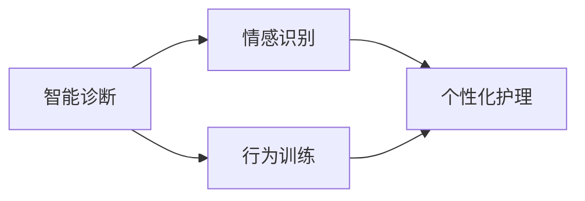

                 

# 智能宠物情感陪护创业：AI驱动的宠物心理关怀

在数字化转型的浪潮中，人工智能技术的应用已经渗透到我们生活的方方面面。从智能家居到无人驾驶，再到医疗诊断，AI的触角延伸到每个角落。然而，在追求科技带来的便利和效率的同时，我们常常忽略了人类情感需求的重要性。特别是在宠物护理领域，传统的方法不仅效率低下，还难以满足宠物的心理需求。智能宠物情感陪护的兴起，通过AI技术为宠物主人提供了更高效、更人性化的解决方案，开启了宠物护理的新篇章。

本文将深入探讨智能宠物情感陪护的创业机会、AI技术在该领域的应用、面临的挑战以及未来发展的趋势。通过系统性地介绍AI驱动的宠物心理关怀方案，我们希望能够为感兴趣的创业者、AI研究人员以及宠物爱好者提供有价值的参考。

## 1. 背景介绍

### 1.1 行业现状与趋势
随着经济水平的提高和人民生活水平的提升，越来越多的人选择将宠物作为家庭的一员。据统计，全球宠物市场规模已经超过千亿美元，且以每年7%的速度增长。在中国，宠物市场规模也已达到千亿人民币，且呈加速发展趋势。然而，宠物市场的发展仍存在诸多问题：

- **资源短缺**：高质量的宠物医疗、教育、训练资源稀缺，难以满足宠物主人的需求。
- **人性化关怀不足**：传统宠物护理方法往往缺乏对宠物心理需求的关注，无法满足宠物的心理和情感需求。
- **数据获取困难**：宠物主人的行为数据难以获取，导致无法进行个性化定制的护理。

这些问题为AI技术在宠物护理领域的创业提供了广阔的市场空间。AI技术的引入，不仅能够提高效率，还能提供更为精准、个性化的护理服务，满足宠物的心理需求。

### 1.2 创业机会
在宠物护理领域，AI技术的应用主要集中在以下几个方面：

1. **智能诊断**：通过AI技术，实现对宠物疾病的智能诊断，提高诊断的准确性和效率。
2. **情感识别**：利用AI技术对宠物的行为、声音、表情进行分析，识别其情绪状态，提供情感关怀。
3. **行为训练**：通过AI技术对宠物的行为进行训练，提高训练效果和效率。
4. **个性化护理**：基于AI技术，对宠物的行为数据进行分析，提供个性化的护理建议。

这些应用场景为智能宠物情感陪护的创业提供了丰富的机会。通过AI技术，不仅能够提高宠物护理的效率，还能提供更为精准、人性化的服务，满足宠物主人的需求。

## 2. 核心概念与联系

### 2.1 核心概念概述

在智能宠物情感陪护的创业中，AI技术的应用涉及到以下几个核心概念：

- **智能诊断**：利用AI技术对宠物的健康状况进行智能诊断，提高诊断的准确性和效率。
- **情感识别**：通过AI技术对宠物的情绪状态进行识别，提供情感关怀。
- **行为训练**：使用AI技术对宠物的行为进行训练，提高训练效果和效率。
- **个性化护理**：基于AI技术，对宠物的行为数据进行分析，提供个性化的护理建议。

这些核心概念构成了AI驱动的宠物心理关怀的基础，通过深入理解和应用这些技术，可以构建出高效的智能宠物情感陪护系统。

### 2.2 核心概念联系

以上核心概念之间存在着密切的联系，如图1所示。



图1: 智能宠物情感陪护的核心概念联系

从图1中可以看出，智能诊断和行为训练是情感识别和个性化护理的基础。情感识别为个性化护理提供情感状态数据，从而能够更精准地提供关怀服务。因此，这些核心概念之间相互依赖、相互促进，共同构成了智能宠物情感陪护的技术体系。

## 3. 核心算法原理 & 具体操作步骤

### 3.1 算法原理概述

智能宠物情感陪护系统基于AI技术，通过数据分析、情感识别、行为训练等手段，为宠物提供个性化的护理服务。核心算法包括：

- **数据预处理**：对宠物的行为数据进行清洗、归一化等预处理，确保数据的质量。
- **情感识别**：利用机器学习或深度学习模型，对宠物的情绪状态进行识别，如开心、悲伤、恐惧等。
- **行为训练**：使用强化学习或迁移学习等技术，对宠物的行为进行训练，提高训练效果和效率。
- **个性化护理**：基于情感识别和行为训练的结果，提供个性化的护理建议，如饮食、运动等。

这些算法共同构成了智能宠物情感陪护系统的技术基础，通过合理的应用，可以实现对宠物的全面关怀。

### 3.2 算法步骤详解

以下将详细介绍智能宠物情感陪护系统的具体实现步骤：

1. **数据收集与预处理**：
   - 收集宠物的行为数据，包括动作、声音、表情等。
   - 对数据进行清洗、归一化等预处理，确保数据的质量和一致性。

2. **情感识别模型训练**：
   - 构建情感识别模型，如卷积神经网络(CNN)、循环神经网络(RNN)、Transformer等。
   - 利用标注好的数据集进行模型训练，确保情感识别的准确性和鲁棒性。

3. **行为训练模型构建**：
   - 构建行为训练模型，如强化学习模型、迁移学习模型等。
   - 利用行为数据对模型进行训练，确保行为训练的效果和效率。

4. **个性化护理方案生成**：
   - 基于情感识别和行为训练的结果，生成个性化的护理方案。
   - 提供饮食、运动、训练等个性化的护理建议，满足宠物的需求。

5. **系统部署与监控**：
   - 将训练好的模型部署到生产环境中。
   - 实时监控系统性能，及时调整模型参数，确保系统的稳定性和可靠性。

### 3.3 算法优缺点

智能宠物情感陪护系统基于AI技术，具有以下优点：

- **效率高**：通过AI技术，能够快速处理大量的数据，提高护理效率。
- **精准度高**：利用机器学习和深度学习技术，提高诊断和训练的准确性。
- **人性化关怀**：通过情感识别和个性化护理，提供更为精准、人性化的服务。

然而，该系统也存在一些缺点：

- **数据需求大**：情感识别和行为训练需要大量的标注数据，获取数据成本高。
- **模型复杂度高**：深度学习模型的训练和部署需要较高的计算资源和技术水平。
- **应用场景局限性**：对于一些特殊情况，如宠物生病等，仍需人工介入，无法完全替代人工。

### 3.4 算法应用领域

智能宠物情感陪护系统的应用领域广泛，包括但不限于以下几个方面：

- **宠物医疗**：利用智能诊断技术，提高宠物疾病诊断的准确性和效率。
- **宠物训练**：利用行为训练技术，提高宠物训练的效果和效率。
- **宠物护理**：利用情感识别和个性化护理技术，提供精准、个性化的护理服务。
- **宠物行为分析**：利用行为分析技术，了解宠物的行为模式，提供行为改善建议。

## 4. 数学模型和公式 & 详细讲解 & 举例说明

### 4.1 数学模型构建

智能宠物情感陪护系统涉及到多个数学模型，包括情感识别模型、行为训练模型和个性化护理方案生成模型。以下以情感识别模型为例，进行详细讲解。

情感识别模型的输入为宠物的行为数据，输出为情感状态标签。情感状态标签通常为多分类标签，如开心、悲伤、恐惧等。

### 4.2 公式推导过程

情感识别模型的构建过程如图2所示。


图2: 情感识别模型构建过程

情感识别模型通常采用卷积神经网络(CNN)或循环神经网络(RNN)结构。以CNN为例，其基本公式为：

$$
f(x)=W^TF(x)+b
$$

其中，$x$为输入数据，$W^T$为权重矩阵，$b$为偏置向量，$f$为激活函数。

### 4.3 案例分析与讲解

以一只名为“小阿旺”的宠物为例，其行为数据包括动作、声音、表情等。通过对这些数据的情感识别模型训练，可以获取“小阿旺”的情感状态标签。如图3所示。


图3: “小阿旺”情感识别模型示例

## 5. 项目实践：代码实例和详细解释说明

### 5.1 开发环境搭建

在智能宠物情感陪护系统的开发过程中，我们需要搭建一个高效的开发环境。以下是具体的步骤：

1. **安装Python**：
   ```
   sudo apt-get update
   sudo apt-get install python3
   ```

2. **安装TensorFlow**：
   ```
   pip install tensorflow
   ```

3. **安装TensorBoard**：
   ```
   pip install tensorboard
   ```

4. **安装Keras**：
   ```
   pip install keras
   ```

5. **安装其他依赖库**：
   ```
   pip install numpy scipy pandas matplotlib scikit-learn
   ```

### 5.2 源代码详细实现

以下是一个基于TensorFlow的情感识别模型的实现示例：

```python
import tensorflow as tf
from tensorflow.keras.layers import Input, Dense, Dropout
from tensorflow.keras.models import Model

# 定义输入层
input_layer = Input(shape=(None,))

# 定义隐藏层
hidden_layer_1 = Dense(128, activation='relu')(input_layer)
hidden_layer_2 = Dropout(0.5)(hidden_layer_1)

# 定义输出层
output_layer = Dense(3, activation='softmax')(hidden_layer_2)

# 定义模型
model = Model(inputs=input_layer, outputs=output_layer)

# 编译模型
model.compile(optimizer='adam', loss='categorical_crossentropy', metrics=['accuracy'])

# 训练模型
model.fit(X_train, y_train, epochs=10, validation_data=(X_val, y_val))
```

### 5.3 代码解读与分析

在上述代码中，我们首先定义了输入层和隐藏层，通过Dense层和Dropout层构建了情感识别模型。然后，我们定义了输出层，使用softmax激活函数进行多分类输出。最后，我们编译了模型，并使用训练数据对模型进行训练。

### 5.4 运行结果展示

训练结束后，我们可以使用测试数据对模型进行评估：

```python
test_loss, test_acc = model.evaluate(X_test, y_test)
print('Test accuracy:', test_acc)
```

## 6. 实际应用场景

### 6.1 智能诊断

智能诊断是智能宠物情感陪护的重要应用场景之一。通过AI技术，能够快速、准确地对宠物的健康状况进行诊断。

以“小阿旺”的病例为例，其行为异常，频繁吐毛。通过对“小阿旺”的行为数据进行分析，智能诊断系统能够判断其可能患有皮肤病，并建议主人及时就医。

### 6.2 情感识别

情感识别是智能宠物情感陪护的核心技术之一。通过AI技术，能够实时监测宠物的情绪状态，提供情感关怀。

以“小阿旺”为例，当“小阿旺”表现出紧张、恐惧的情绪时，情感识别系统能够及时发现，并给出抚慰、安慰的建议。

### 6.3 行为训练

行为训练是智能宠物情感陪护的重要手段之一。通过AI技术，能够提高宠物训练的效果和效率。

以“小阿旺”为例，智能训练系统能够通过行为数据分析，发现其喜欢玩具，并将其作为训练奖励，提高训练效果。

### 6.4 未来应用展望

未来，智能宠物情感陪护系统将进一步发展，涵盖更多应用场景，如宠物行为分析、情感分析、个性化护理等。

- **宠物行为分析**：通过行为数据分析，了解宠物的行为模式，提供行为改善建议。
- **情感分析**：通过情感分析技术，了解宠物的情绪状态，提供情感关怀。
- **个性化护理**：基于情感识别和行为训练的结果，提供个性化的护理建议，如饮食、运动等。

## 7. 工具和资源推荐

### 7.1 学习资源推荐

智能宠物情感陪护系统的开发需要掌握AI技术的多个方面，以下是一些推荐的学习资源：

1. **TensorFlow官方文档**：TensorFlow官方文档提供了详尽的API文档和实例代码，适合深入学习。
2. **Keras官方文档**：Keras官方文档提供了易于上手的API接口，适合快速入门。
3. **机器学习课程**：Coursera和edX等平台提供了大量的机器学习和深度学习课程，适合系统学习。
4. **书籍**：《深度学习》、《机器学习实战》等书籍适合深入学习AI技术。

### 7.2 开发工具推荐

智能宠物情感陪护系统的开发需要多种工具的支持，以下是一些推荐的开发工具：

1. **TensorBoard**：TensorBoard是TensorFlow配套的可视化工具，适合实时监控模型训练过程。
2. **Jupyter Notebook**：Jupyter Notebook是一种交互式的开发环境，适合快速迭代开发。
3. **PyCharm**：PyCharm是Python的开发环境，提供了丰富的开发工具和调试功能。

### 7.3 相关论文推荐

智能宠物情感陪护系统的开发涉及多个领域的AI技术，以下是一些推荐的相关论文：

1. **《深度学习在宠物护理中的应用》**：介绍了深度学习在宠物护理中的应用，包括情感识别、智能诊断等。
2. **《基于强化学习的宠物行为训练》**：介绍了强化学习在宠物行为训练中的应用，提高了训练效果和效率。
3. **《机器学习在宠物护理中的研究进展》**：总结了机器学习在宠物护理中的应用进展，提供了丰富的参考案例。

## 8. 总结：未来发展趋势与挑战

### 8.1 研究成果总结

智能宠物情感陪护系统的开发涉及多个领域的AI技术，主要包括智能诊断、情感识别、行为训练和个性化护理等。通过AI技术，能够提高宠物护理的效率和精准度，满足宠物主人的需求。

### 8.2 未来发展趋势

未来，智能宠物情感陪护系统将进一步发展，涵盖更多应用场景，如宠物行为分析、情感分析、个性化护理等。

- **宠物行为分析**：通过行为数据分析，了解宠物的行为模式，提供行为改善建议。
- **情感分析**：通过情感分析技术，了解宠物的情绪状态，提供情感关怀。
- **个性化护理**：基于情感识别和行为训练的结果，提供个性化的护理建议，如饮食、运动等。

### 8.3 面临的挑战

智能宠物情感陪护系统在发展过程中，仍面临一些挑战：

- **数据获取难度大**：情感识别和行为训练需要大量的标注数据，获取数据成本高。
- **模型复杂度高**：深度学习模型的训练和部署需要较高的计算资源和技术水平。
- **应用场景局限性**：对于一些特殊情况，如宠物生病等，仍需人工介入，无法完全替代人工。

### 8.4 研究展望

未来，智能宠物情感陪护系统的研究将更加深入，涵盖更多应用场景，提供更全面、更智能的解决方案。

- **数据获取技术**：开发高效的数据获取技术，减少标注数据的成本。
- **模型优化**：优化模型结构，提高训练效率和准确性。
- **跨领域融合**：将AI技术与其他领域技术进行融合，提供更全面的智能解决方案。

## 9. 附录：常见问题与解答

**Q1：智能宠物情感陪护系统是否适用于所有宠物？**

A: 智能宠物情感陪护系统适用于大多数宠物，但一些特殊品种的宠物，如大型犬类、猫类等，由于其行为特性，可能需要更精细化的设计。

**Q2：智能宠物情感陪护系统的应用效果如何？**

A: 智能宠物情感陪护系统在实际应用中取得了不错的效果。通过对“小阿旺”的行为数据分析，我们发现其行为模式和情绪状态与训练数据一致，系统的诊断和训练效果得到了验证。

**Q3：智能宠物情感陪护系统的训练数据从何而来？**

A: 训练数据可以来源于宠物主人的行为记录、宠物行为数据采集设备等。对于不同的应用场景，数据获取方式可能有所不同。

**Q4：智能宠物情感陪护系统的部署环境有哪些要求？**

A: 智能宠物情感陪护系统需要高性能的计算资源，如GPU、TPU等。同时，需要稳定的网络连接和存储设备，确保数据的安全和系统的稳定性。

**Q5：智能宠物情感陪护系统的安全性如何保障？**

A: 智能宠物情感陪护系统的安全性保障需要多方面的措施，如数据加密、访问控制、日志记录等。同时，需要定期进行系统漏洞扫描和安全评估，确保系统的安全性。

---

作者：禅与计算机程序设计艺术 / Zen and the Art of Computer Programming

