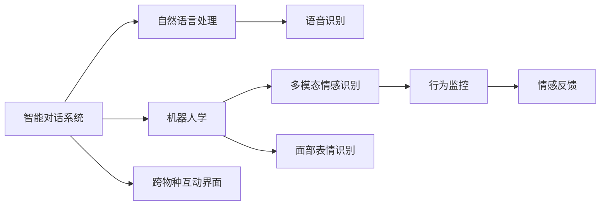

                 

# 智能宠物情绪交流创业：跨越物种的情感互动界面

> 关键词：情感识别, 智能对话系统, 宠物情绪, 自然语言处理(NLP), 机器人学, 计算机视觉, 人类-宠物交互界面

## 1. 背景介绍

随着科技的迅猛发展，人类与宠物间的互动方式也日益丰富。从简单的定时喂食、自动遛狗，到个性化的情感陪伴、智能行为监控，宠物智能设备不断推陈出新。其中，智能对话系统和情感识别技术，尤为引人注目。这些技术不仅能提升宠物生活的舒适度，还能增强人与宠物间的情感联系，成为宠物创业领域的新蓝海。

### 1.1 智能对话系统的兴起

智能对话系统（Intelligent Conversational Systems）通过自然语言处理(NLP)和机器人学(Robotics)，使机器人能理解、生成和处理人类语言。过去，这种技术主要应用于客服、翻译、语音助手等领域，如今，它正逐渐渗透到宠物的日常生活中。

宠物主人们希望通过简单的对话，让宠物机器人理解他们的情感需求，提供针对性的陪伴。例如，当主人心情低落时，机器人可以给出安慰和鼓励；主人外出时，机器人可以监测宠物的情绪变化，并及时汇报。

### 1.2 情感识别技术的突破

情感识别技术（Emotion Recognition）能够从语音、文字、面部表情等多种模态中，分析出人类和动物的情感状态。情感识别在心理学、神经科学等领域有着悠久的历史，近年随着人工智能的发展，技术不断突破。

情感识别技术在宠物领域的应用，可以用于实时监测宠物的情绪变化，预测其行为反应，从而提供更加个性化的照护。例如，当宠物紧张、焦虑时，机器人可以及时干预，降低其不适感。

## 2. 核心概念与联系

### 2.1 核心概念概述

智能宠物情绪交流创业的核心概念包括：

- **智能对话系统**：利用NLP和机器人学，实现人与宠物的情感交流。
- **情感识别技术**：从多模态数据中识别人类和宠物的情感状态。
- **跨物种互动界面**：通过感知、理解和生成技术，实现人类和宠物之间的无缝互动。

### 2.2 核心概念原理和架构的 Mermaid 流程图



这个流程图展示了智能宠物情绪交流创业的主要组件和流程：

- A. **智能对话系统**：通过自然语言处理(NLP)理解人类语言，生成相应回复。
- B. **自然语言处理(NLP)**：解析、生成、理解语言，是智能对话系统的核心。
- C. **机器人学**：提供机器人的物理操作和感知能力，实现与宠物的互动。
- D. **多模态情感识别**：综合语音、表情、行为等多种信息，识别情感状态。
- E. **语音识别**：将语音转化为文字，供NLP处理。
- F. **面部表情识别**：分析宠物面部表情，判断情绪。
- G. **行为监控**：通过摄像头、传感器等设备，实时监测宠物行为。
- H. **情感反馈**：根据情感识别结果，调整对话内容和交互方式。
- I. **跨物种互动界面**：整合多种技术，实现人类与宠物的无缝交流。

这些组件通过算法和技术手段，实现信息的感知、理解、生成和反馈，从而搭建起智能宠物情绪交流的界面。

## 3. 核心算法原理 & 具体操作步骤

### 3.1 算法原理概述

智能宠物情绪交流的算法主要基于以下几种技术：

- **语音识别(ASR)**：将语音信号转化为文本，供情感识别使用。
- **自然语言理解(NLU)**：分析文本，理解意图和情感。
- **情感识别(ER)**：综合语音、表情、行为等多种数据，判断情感状态。
- **自然语言生成(NLG)**：生成个性化的对话回复。
- **行为监控**：利用计算机视觉等技术，实时监测宠物行为。

这些技术通过协同工作，实现对宠物情绪的实时监测和互动。

### 3.2 算法步骤详解

以下是智能对话系统开发的主要步骤：

**Step 1: 数据收集与预处理**
- 收集各种数据，包括语音录音、视频监控、行为记录等。
- 对数据进行清洗、标注，去除噪声，确保数据质量。

**Step 2: 模型训练与微调**
- 使用语音识别模型将语音转化为文本。
- 使用自然语言理解模型解析文本，抽取意图和情感。
- 使用情感识别模型综合多种信息，判断情感状态。
- 使用自然语言生成模型生成对话回复。

**Step 3: 跨物种互动界面的构建**
- 整合多种传感器，实现多模态数据融合。
- 开发友好的用户界面，使主人能够方便地与宠物互动。

**Step 4: 部署与测试**
- 将模型部署到实际设备中，如宠物机器人、智能手环等。
- 在实际环境中测试模型的效果，不断优化算法和界面。

### 3.3 算法优缺点

智能宠物情绪交流的算法具有以下优点：

- **实时性**：能够实时监测宠物情绪，提供即时反馈。
- **智能化**：综合多种数据源，提供准确的情感识别。
- **个性化**：通过自然语言生成技术，生成个性化对话。

同时，也存在一些缺点：

- **数据依赖**：高质量的数据是算法的基础，数据收集和标注成本较高。
- **复杂度**：涉及多种技术，系统构建复杂。
- **隐私问题**：大量数据涉及宠物隐私，需要合理处理和保护。

### 3.4 算法应用领域

智能宠物情绪交流的算法主要应用于以下领域：

- **宠物机器人**：作为宠物的陪伴伙伴，实现智能对话和情感识别。
- **智能手环**：实时监测宠物行为和情感，提供健康管理建议。
- **智能家居系统**：与家居设备联动，提供情感化的控制和互动。
- **远程监控**：主人外出时，通过网络监控宠物状态，提供安心感。

## 4. 数学模型和公式 & 详细讲解 & 举例说明

### 4.1 数学模型构建

智能宠物情绪交流的算法模型主要基于以下几种数学模型：

- **语音识别(ASR)**：基于深度学习模型的隐马尔可夫模型(HMM)或循环神经网络(RNN)。
- **自然语言理解(NLU)**：基于Transformer架构的NLP模型。
- **情感识别(ER)**：基于分类模型的逻辑回归、支持向量机(SVM)或深度学习模型。
- **自然语言生成(NLG)**：基于生成对抗网络(GAN)或Transformer架构的NLP模型。
- **行为监控**：基于计算机视觉模型的卷积神经网络(CNN)或循环神经网络(RNN)。

### 4.2 公式推导过程

以情感识别模型为例，假设输入为语音信号、面部表情、行为数据，输出为情感状态，公式推导如下：

**输入表示**：

$$
X = [x_1, x_2, ..., x_n]
$$

其中 $x_i$ 表示第 $i$ 种数据源。

**输出表示**：

$$
Y = [y_1, y_2, ..., y_m]
$$

其中 $y_i$ 表示第 $i$ 种情感状态。

**目标函数**：

$$
\mathcal{L} = -\frac{1}{N} \sum_{i=1}^N \sum_{j=1}^m y_{i,j} \log P(y_{i,j}|X)
$$

其中 $N$ 为样本数，$P(y_{i,j}|X)$ 为条件概率。

**优化目标**：

$$
\mathop{\arg\min}_{\theta} \mathcal{L}
$$

其中 $\theta$ 为模型参数。

### 4.3 案例分析与讲解

假设有一个宠物机器人，通过摄像头捕捉宠物的面部表情，通过麦克风录制宠物的叫声，通过传感器监测宠物的活动。模型输入 $X$ 由面部表情、叫声和活动数据构成。模型输出 $Y$ 为两种情感状态：快乐和悲伤。

模型使用Transformer架构进行训练，首先将输入数据转换成向量形式，然后通过多层变换和注意力机制，逐步提取特征。最后通过线性层和softmax函数，输出情感状态的概率。

## 5. 项目实践：代码实例和详细解释说明

### 5.1 开发环境搭建

以下是智能宠物情绪交流系统的开发环境搭建流程：

1. 安装Python和相关依赖包。
2. 搭建机器学习训练环境，如Docker容器。
3. 搭建跨物种互动界面，如Web应用或移动应用。

### 5.2 源代码详细实现

以下是一个基于TensorFlow的情感识别模型示例代码：

```python
import tensorflow as tf
from tensorflow.keras.layers import Input, Dense, Dropout, Conv2D, Flatten, GlobalMaxPooling2D
from tensorflow.keras.models import Model
from tensorflow.keras.optimizers import Adam

# 定义输入层
input_1 = Input(shape=(100, ), name='input_1')
input_2 = Input(shape=(100, ), name='input_2')
input_3 = Input(shape=(100, ), name='input_3')

# 定义卷积层
conv1_1 = Conv2D(32, (3, 3), activation='relu', padding='same')(input_1)
conv1_2 = Conv2D(32, (3, 3), activation='relu', padding='same')(input_2)
conv1_3 = Conv2D(32, (3, 3), activation='relu', padding='same')(input_3)

# 定义池化层
pool1_1 = Flatten()(conv1_1)
pool1_2 = Flatten()(conv1_2)
pool1_3 = Flatten()(conv1_3)

# 定义全连接层
dense1 = Dense(64, activation='relu')(pool1_1)
dense2 = Dense(64, activation='relu')(pool1_2)
dense3 = Dense(64, activation='relu')(pool1_3)

# 定义输出层
output = Dense(2, activation='softmax')(tf.concat([dense1, dense2, dense3], axis=-1))

# 定义模型
model = Model(inputs=[input_1, input_2, input_3], outputs=[output])

# 编译模型
model.compile(optimizer=Adam(), loss='categorical_crossentropy', metrics=['accuracy'])

# 训练模型
model.fit([x_train, x_train, x_train], y_train, epochs=10, batch_size=32)
```

### 5.3 代码解读与分析

上述代码实现了一个简单的情感识别模型，通过多层卷积和全连接层，将输入数据转换为情感状态的概率。

**输入层**：定义了三个输入层，分别对应面部表情、叫声和行为数据。

**卷积层**：通过卷积操作提取输入数据的特征。

**池化层**：通过池化操作降低数据维度和噪声。

**全连接层**：通过全连接层对特征进行融合和处理。

**输出层**：通过softmax函数输出情感状态的概率。

### 5.4 运行结果展示

训练完成后，可以使用以下代码进行预测：

```python
from sklearn.metrics import classification_report

# 加载测试数据
x_test, y_test = ...

# 进行预测
y_pred = model.predict([x_test, x_test, x_test])

# 输出预测结果
print(classification_report(y_test, y_pred))
```

预测结果可以显示模型在测试数据上的性能指标。

## 6. 实际应用场景

### 6.1 智能宠物机器人

智能宠物机器人能够实现多种功能，包括智能对话、情感识别、行为监控等。机器人可以与主人进行互动，理解主人的情感需求，提供个性化服务。例如，主人感到孤独时，机器人可以给予安慰和陪伴；主人外出时，机器人可以监测宠物的情绪变化，及时反馈给主人。

### 6.2 智能手环

智能手环通过各种传感器实时监测宠物的行为和情感，提供健康管理建议。手环可以记录宠物的活动量、睡眠质量、饮食情况等，生成健康报告，帮助主人了解宠物的生活状态。手环还可以与智能家居系统联动，实现更智能化的宠物管理。

### 6.3 智能家居系统

智能家居系统通过与宠物机器人和智能手环联动，提供全方位的情感化控制和互动。例如，宠物情感识别可以与灯光、温度等环境调节系统联动，提供舒适的生活环境；智能机器人可以与语音助手联动，实现更加智能化的家居控制。

### 6.4 远程监控

远程监控系统通过网络摄像头和传感器，实时监测宠物的状态，并通过手机APP将数据回传给主人。主人可以通过手机APP查看宠物的生活状态，了解其情绪变化，提供及时的照顾和陪伴。

## 7. 工具和资源推荐

### 7.1 学习资源推荐

以下是智能宠物情绪交流创业相关的学习资源：

- 《Python自然语言处理》：介绍NLP基础和实践，适合初学者。
- 《深度学习入门》：介绍深度学习基础和应用，适合进阶学习。
- 《机器人学导论》：介绍机器人学基础和实践，适合学习机器人技术。
- 《计算机视觉基础》：介绍计算机视觉基础和实践，适合学习视觉识别技术。

### 7.2 开发工具推荐

以下是智能宠物情绪交流创业开发常用的工具：

- TensorFlow：开源深度学习框架，支持多种模型和算法。
- PyTorch：开源深度学习框架，灵活高效的计算图。
- Scikit-learn：开源机器学习库，支持多种分类和回归模型。
- OpenCV：开源计算机视觉库，支持多种图像和视频处理功能。

### 7.3 相关论文推荐

以下是智能宠物情绪交流创业相关的经典论文：

- "Speech-Emotion Recognition Using Transfer Learning on Pre-trained Models"：介绍基于预训练模型进行语音情感识别的方法。
- "Emotion Recognition from Facial Expressions using Deep Learning"：介绍基于深度学习进行面部表情情感识别的技术。
- "Behavioral Analysis for Pet Care using Wearable Sensors"：介绍基于可穿戴设备进行宠物行为分析的技术。

## 8. 总结：未来发展趋势与挑战

### 8.1 研究成果总结

智能宠物情绪交流创业已经成为人工智能技术落地应用的新热点。通过跨物种互动界面的搭建，实现人类与宠物的深度互动，提升宠物的生活质量和主人的陪伴体验。情感识别技术的发展，使得机器人能够更好地理解宠物的情感状态，提供个性化服务。智能对话系统的应用，进一步增强了人机交互的流畅性和自然性。

### 8.2 未来发展趋势

智能宠物情绪交流创业的未来发展趋势包括：

- **多模态数据融合**：综合语音、面部表情、行为等多种数据，提供更加全面和准确的情感识别。
- **个性化服务**：根据情感状态，提供个性化的行为和环境控制，提升宠物生活质量。
- **跨设备联动**：实现不同设备间的互联互通，提供全方位的宠物管理解决方案。
- **人性化设计**：优化用户界面和交互方式，提升用户体验和满意度。

### 8.3 面临的挑战

智能宠物情绪交流创业面临的挑战包括：

- **数据获取**：高质量的情感数据获取成本较高，需要构建大规模数据集。
- **算法优化**：情感识别和自然语言生成等算法需要进一步优化，提高准确率和鲁棒性。
- **隐私保护**：大量数据涉及宠物隐私，需要合理处理和保护。
- **市场推广**：如何提高用户接受度和市场竞争力，是一个需要解决的问题。

### 8.4 研究展望

智能宠物情绪交流创业的研究展望包括：

- **情感迁移学习**：通过迁移学习，将人类情感知识迁移到宠物情感识别中，提升识别准确率。
- **多任务学习**：将情感识别与行为监控等任务结合，实现多任务学习，提升系统效率。
- **情感生成技术**：研究情感生成技术，提供更加丰富的情感交互体验。
- **伦理与社会影响**：研究智能宠物系统的伦理和社会影响，确保技术应用的合理性和安全性。

## 9. 附录：常见问题与解答

**Q1：智能对话系统如何实现情感理解？**

A: 智能对话系统通过自然语言处理(NLP)技术实现情感理解。首先，将输入的语音或文本转换为文本形式；然后，使用情感分析模型解析文本，抽取情感倾向；最后，使用自然语言生成(NLG)技术生成响应，反馈给用户。

**Q2：如何提高情感识别模型的准确率？**

A: 提高情感识别模型的准确率需要以下几个步骤：

1. **数据扩充**：通过数据增强技术，扩充训练数据，避免过拟合。
2. **特征提取**：使用先进的特征提取技术，如卷积神经网络(CNN)和循环神经网络(RNN)，提取输入数据的特征。
3. **模型优化**：使用更先进的模型架构，如Transformer和Bert，优化模型性能。
4. **多模态融合**：综合语音、面部表情、行为等多种数据源，提高情感识别的准确性。

**Q3：智能宠物机器人如何与主人进行互动？**

A: 智能宠物机器人通过自然语言处理(NLP)技术实现与主人的互动。首先，机器人使用语音识别技术，将主人的语音转换为文本；然后，使用自然语言理解(NLU)技术，解析文本，理解意图和情感；最后，使用自然语言生成(NLG)技术，生成响应，与主人进行对话。

**Q4：智能手环如何监测宠物的情绪？**

A: 智能手环通过多种传感器监测宠物的行为和生理状态，综合分析其情感状态。手环可以记录宠物的活动量、睡眠质量、饮食情况等，生成健康报告，帮助主人了解宠物的生活状态。

**Q5：智能家居系统如何与宠物机器人联动？**

A: 智能家居系统通过网络与宠物机器人联动，实现全方位的宠物管理。例如，宠物情感识别可以与灯光、温度等环境调节系统联动，提供舒适的生活环境；智能机器人可以与语音助手联动，实现更加智能化的家居控制。

通过上述文章的撰写，相信读者对智能宠物情绪交流创业有了更深入的了解，看到了人工智能技术在宠物领域的广阔应用前景。未来，随着技术的不断进步，智能宠物情绪交流将更加深入人心，成为人类与宠物沟通的新桥梁。

