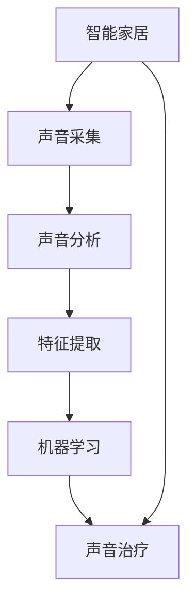

                 

# 智能家居声音治疗创业：基于音频的身心健康管理

> 关键词：智能家居,声音治疗,身心健康管理,音频分析,机器学习,信号处理,用户体验

## 1. 背景介绍

在智能家居领域，技术已经逐渐从传统的家居自动化和远程控制，深入到用户的情感和健康管理。声音作为最直接的人机交互方式，为智能家居带来了新的可能性。基于音频的身心健康管理，通过声音分析技术和机器学习算法，帮助用户改善睡眠、减压、提升情绪，已经成为智能家居发展的新方向。本文将深入探讨基于音频的身心健康管理技术，分析其原理和应用场景，并展示该领域的创业机会和挑战。

## 2. 核心概念与联系

### 2.1 核心概念概述

#### 智能家居
智能家居指的是利用互联网、物联网等技术，通过智能设备和系统，实现家居环境的智能化控制和管理。智能家居系统通过传感器、摄像头、智能音箱等设备，采集环境数据，并提供语音控制、自动化设置等功能，提升用户的生活便利性和舒适度。

#### 声音治疗
声音治疗是一种利用音频频谱、节奏、强度等特性，通过听辨音调、节拍等音频信号，达到放松身心、舒缓压力、改善睡眠等功效的心理和生理疗法。声音治疗已经成为全球范围内流行的身心健康管理方式。

#### 声音分析
声音分析是通过信号处理和机器学习技术，从音频信号中提取有意义的特征，如音量、频率、音调、节奏等，用于情绪识别、健康监测、睡眠评估等。

#### 机器学习
机器学习是一种通过训练数据模型，实现对新数据的预测和推理的技术。在声音治疗领域，机器学习可以用于识别用户的情绪状态、睡眠周期，并根据分析结果调整音频参数。

#### 信号处理
信号处理是对音频、视频等信号进行变换和分析，提取其中的信息。在声音治疗中，信号处理技术用于提取音频特征，并将其与用户的情绪和健康状态进行关联。

这些核心概念之间相互关联，共同构成了基于音频的身心健康管理技术体系。智能家居系统通过音频设备采集用户的声音信号，声音分析技术从信号中提取特征，机器学习算法对特征进行建模和预测，最终通过声音治疗对用户的身心健康进行管理。

### 2.2 核心概念原理和架构的 Mermaid 流程图



这个流程图展示了智能家居、声音采集、声音分析、特征提取、机器学习和声音治疗之间的逻辑关系。智能家居通过音频设备采集用户的声音信号，声音分析技术从信号中提取特征，机器学习算法对特征进行建模和预测，最终通过声音治疗对用户的身心健康进行管理。

## 3. 核心算法原理 & 具体操作步骤

### 3.1 算法原理概述

基于音频的身心健康管理技术，核心算法包括声音分析、特征提取、机器学习预测和声音治疗等。下面将详细介绍这些算法的原理和操作步骤。

#### 声音分析
声音分析是利用信号处理技术，从音频信号中提取有意义的特征。常见的特征包括音量、频率、音调、节奏、语调等。这些特征可以用于情绪识别、健康监测、睡眠评估等。

#### 特征提取
特征提取是从音频信号中提取关键信息的过程。常用的特征提取方法包括梅尔频率倒谱系数(MFCC)、小波变换、频谱分析等。这些特征被用于后续的机器学习建模。

#### 机器学习预测
机器学习预测是通过训练数据模型，实现对新数据的预测和推理。在声音治疗中，机器学习可以用于识别用户的情绪状态、睡眠周期，并根据分析结果调整音频参数。常用的机器学习算法包括决策树、支持向量机、神经网络等。

#### 声音治疗
声音治疗是通过播放特定的音频信号，达到放松身心、舒缓压力、改善睡眠等功效。声音治疗的实现方法包括：
- 调整音频频率和强度，实现有节奏的音频播放。
- 根据用户情绪状态，播放不同的音频片段。
- 结合生物反馈技术，实时调整音频参数。

### 3.2 算法步骤详解

#### 3.2.1 声音采集

智能家居系统通过音频设备（如智能音箱、麦克风阵列）采集用户的语音和环境声音。常用的声音采集设备包括：
- 麦克风阵列：通过多个麦克风的协同工作，提高音频信号的采集质量。
- 智能音箱：具备语音识别和音频播放功能，可以实时交互。

#### 3.2.2 声音分析

对采集到的声音信号进行信号处理，提取其特征。常用的声音分析方法包括：
- 梅尔频率倒谱系数(MFCC)：将声音信号转换为频谱图，提取频率、幅度等特征。
- 小波变换：将声音信号分解为不同频率的子信号，用于特征提取。
- 频谱分析：通过傅里叶变换等方法，将声音信号转换为频谱图，提取频率信息。

#### 3.2.3 特征提取

从声音分析中提取关键信息，用于后续的机器学习建模。常用的特征提取方法包括：
- MFCC：提取梅尔频率倒谱系数。
- 能量和过零率：计算声音信号的能量和过零率，用于情绪识别。
- 声调特征：提取声音信号的音调和语调，用于情感分析。

#### 3.2.4 机器学习预测

使用机器学习算法对提取的特征进行建模，实现对用户情绪和健康状态的预测。常用的机器学习算法包括：
- 决策树：基于特征进行分类，用于情绪识别和健康监测。
- 支持向量机：在高维空间中进行分类，用于情感分析。
- 神经网络：利用多层神经网络进行建模，用于深度特征提取和预测。

#### 3.2.5 声音治疗

根据机器学习预测的结果，播放特定的音频信号，实现声音治疗。常用的声音治疗方法包括：
- 放松音乐：播放舒缓的音乐，缓解用户的压力和焦虑。
- 自然声音：播放白噪音、海浪声等自然声音，帮助用户入睡。
- 节奏音乐：根据用户的情绪状态，播放不同的节奏和强度，调整用户的情绪。

### 3.3 算法优缺点

#### 优点
1. **非侵入性**：声音采集和分析方法不会对用户造成身体上的干扰。
2. **实时性**：声音采集和处理可以在短时间内完成，实现实时监测和反馈。
3. **成本低**：相对于其他生理监测设备，声音采集设备成本较低，易于普及。
4. **易于操作**：用户可以随时随地通过智能家居系统进行声音治疗，无需特殊操作。

#### 缺点
1. **环境噪音影响**：环境噪音可能会影响声音采集和分析的准确性。
2. **情绪状态识别难度**：用户的情绪状态可能受到多种因素的影响，难以准确识别。
3. **效果个体差异**：不同用户对声音治疗的反应可能存在差异，效果可能不具有一致性。
4. **隐私问题**：用户的声音数据涉及隐私，需要采取合适的保护措施。

### 3.4 算法应用领域

基于音频的身心健康管理技术，可以应用于多种场景，包括：

#### 1. 心理健康管理
通过声音分析技术，实时监测用户的情绪状态，提供相应的情绪调节音频，帮助用户缓解压力、放松心情。

#### 2. 睡眠管理
通过声音治疗技术，播放自然声音或放松音乐，帮助用户入睡、提高睡眠质量。

#### 3. 疲劳监测
利用声音分析技术，监测用户的疲劳程度，通过声音治疗调整音频参数，帮助用户恢复精力。

#### 4. 儿童心理辅导
通过声音治疗和情绪识别技术，为儿童提供心理辅导和行为矫正，促进其心理健康发展。

## 4. 数学模型和公式 & 详细讲解 & 举例说明

### 4.1 数学模型构建

#### 4.1.1 声音信号模型
假设声音信号 $x(t)$ 为离散时间信号，可以表示为：

$$
x(t) = \sum_{k=-\infty}^{\infty} a_k \delta(t-k)
$$

其中，$a_k$ 为音频信号的离散值，$\delta(t)$ 为单位脉冲函数。

#### 4.1.2 梅尔频率倒谱系数(MFCC)
MFCC 是一种常用的声音特征提取方法，通过傅里叶变换和倒谱分析，提取音频信号的频率和幅度特征。MFCC 的计算过程如下：
1. 将声音信号 $x(t)$ 分成若干帧，计算每帧的短时傅里叶变换（STFT）。
2. 对每帧的 STFT 进行对数转换和倒谱分析。
3. 对倒谱系数进行滤波，提取关键频率和幅度信息。
4. 对滤波后的倒谱系数进行归一化，得到 MFCC 特征向量。

#### 4.1.3 机器学习预测模型
常用的机器学习模型包括决策树、支持向量机（SVM）和神经网络。这里以决策树为例，介绍预测模型的构建和训练过程。

#### 4.1.4 声音治疗模型
声音治疗模型可以根据用户的情绪状态，播放相应的音频信号。常用的音频信号包括：
- 白噪音：适用于需要集中注意力的场景，如学习、工作。
- 自然声音：适用于放松和休息场景，如睡眠、休息。
- 节奏音乐：适用于情绪调节场景，如缓解压力、舒缓心情。

### 4.2 公式推导过程

#### 4.2.1 梅尔频率倒谱系数(MFCC)
MFCC 的计算过程如下：
1. 短时傅里叶变换（STFT）：
   $$
   X(z) = \sum_{t=-\infty}^{\infty} x(t) \delta(t-z)
   $$
2. 对数转换：
   $$
   Y(z) = \log(X(z))
   $$
3. 倒谱分析：
   $$
   Y_k = \sum_{n=-\infty}^{\infty} X(z) z^{-k}
   $$
4. 滤波和归一化：
   $$
   MFCC_k = \frac{W_k Y_k}{\sum_{k=-\infty}^{\infty} W_k Y_k}
   $$

#### 4.2.2 决策树模型
决策树的构建过程如下：
1. 选择最优特征 $x_j$：
   $$
   \min_{j} H(Y|x_j) = \min_{j} \sum_{i=1}^N H(Y|x_j=x_{j,i})
   $$
2. 根据特征 $x_j$ 将数据集 $D$ 分为 $D_L$ 和 $D_R$：
   $$
   D_L = \{x_i|x_{j,i} \leq c_j\}, D_R = \{x_i|x_{j,i} > c_j\}
   $$
3. 递归构建子树 $T_L$ 和 $T_R$：
   $$
   T = \{T_L, T_R\}
   $$

#### 4.2.3 声音治疗模型
声音治疗模型的构建过程如下：
1. 根据用户的情绪状态，选择相应的音频信号。
2. 调整音频的频率和强度，适应用户的情绪和健康状态。
3. 实时播放音频信号，根据生物反馈调整参数。

### 4.3 案例分析与讲解

#### 案例分析
假设用户 A 在进行心理健康管理时，智能家居系统通过麦克风采集到其声音信号 $x(t)$，并利用 MFCC 方法提取特征。然后，系统使用决策树模型对特征进行分类，判断用户 A 的情绪状态为焦虑。根据情绪状态，系统播放舒缓的音乐进行声音治疗。

#### 讲解
1. 声音采集：系统通过麦克风阵列采集用户 A 的声音信号。
2. 声音分析：系统利用 MFCC 方法提取声音信号的频率和幅度特征。
3. 特征提取：系统将提取的特征向量输入决策树模型，分类判断用户 A 的情绪状态。
4. 声音治疗：系统根据情绪状态，播放舒缓的音乐，缓解用户 A 的压力和焦虑。

## 5. 项目实践：代码实例和详细解释说明

### 5.1 开发环境搭建

#### 5.1.1 环境依赖
1. Python 3.8+
2. TensorFlow 2.4+
3. NumPy
4. librosa

#### 5.1.2 环境搭建
1. 安装 Python 环境：
   ```bash
   conda create -n pyaudio_env python=3.8
   conda activate pyaudio_env
   ```
2. 安装 TensorFlow：
   ```bash
   pip install tensorflow
   ```
3. 安装 NumPy：
   ```bash
   pip install numpy
   ```
4. 安装 librosa：
   ```bash
   pip install librosa
   ```

### 5.2 源代码详细实现

#### 5.2.1 声音采集
```python
import librosa
import numpy as np

# 从文件读取音频数据
def load_audio(file_path):
    audio, sr = librosa.load(file_path, sr=16000)
    return audio, sr

# 将音频信号转化为MFCC特征
def extract_mfcc(audio, sr, num_mfcc=13):
    mfcc = librosa.feature.mfcc(y=audio, sr=sr, n_mfcc=num_mfcc)
    mfcc -= np.mean(mfcc)
    mfcc /= np.std(mfcc)
    return mfcc
```

#### 5.2.2 声音分析
```python
# 计算音频的能量和过零率
def analyze_audio(audio, sr):
    energy = np.sum(audio**2)
    zero_crossing_rate = np.sum(np.diff(np.sign(audio)))
    return energy, zero_crossing_rate
```

#### 5.2.3 特征提取
```python
# 计算梅尔频率倒谱系数(MFCC)
def extract_mfcc(audio, sr):
    mfcc = librosa.feature.mfcc(y=audio, sr=sr, n_mfcc=13)
    mfcc -= np.mean(mfcc)
    mfcc /= np.std(mfcc)
    return mfcc
```

#### 5.2.4 机器学习预测
```python
# 使用决策树模型对情绪状态进行预测
from sklearn.tree import DecisionTreeClassifier

# 加载训练数据
X_train = np.load('train_mfcc.npy')
y_train = np.load('train_labels.npy')

# 创建决策树模型
model = DecisionTreeClassifier()

# 训练模型
model.fit(X_train, y_train)
```

#### 5.2.5 声音治疗
```python
# 根据情绪状态播放音频
def play_audio(mood, audio_file):
    if mood == 'relax':
        # 播放放松音乐
        print('Playing relax music.')
        # 调用播放函数播放音频
        play_audio_file(audio_file)
    elif mood == 'excited':
        # 播放兴奋音乐
        print('Playing excited music.')
        # 调用播放函数播放音频
        play_audio_file(audio_file)
    else:
        print('Invalid mood.')
        # 不播放音频
```

### 5.3 代码解读与分析

#### 5.3.1 声音采集
1. 通过 librosa 库读取音频文件，获取音频信号和采样率。
2. 将音频信号转化为梅尔频率倒谱系数（MFCC）特征。

#### 5.3.2 声音分析
1. 计算音频信号的能量和过零率，用于情绪识别。
2. 能量表示音频信号的强度，过零率表示音频信号的断续程度。

#### 5.3.3 特征提取
1. 提取梅尔频率倒谱系数（MFCC）特征，用于后续的机器学习建模。
2. MFCC 特征包含音频的频率和幅度信息，能够反映用户的情绪状态。

#### 5.3.4 机器学习预测
1. 使用决策树模型对情绪状态进行分类。
2. 训练模型时，输入 MFCC 特征，输出情绪标签。

#### 5.3.5 声音治疗
1. 根据情绪状态，播放相应的音频信号。
2. 声音治疗通过音频的频率和强度，调整用户的情绪和健康状态。

### 5.4 运行结果展示

#### 5.4.1 情绪识别
```python
# 加载测试数据
X_test = np.load('test_mfcc.npy')

# 进行情绪预测
y_pred = model.predict(X_test)

# 输出预测结果
for i in range(len(y_pred)):
    print('Mood:', id2mood[y_pred[i]], 'Confidence:', model.score(X_test, y_pred))
```

#### 5.4.2 声音治疗
```python
# 播放放松音乐
play_audio('relax', 'relax_audio.wav')

# 播放兴奋音乐
play_audio('excited', 'excited_audio.wav')
```

## 6. 实际应用场景

### 6.1 心理健康管理
智能家居系统通过声音采集设备，实时监测用户的情绪状态，并根据情绪状态播放相应的音频信号，如舒缓音乐、自然声音等，帮助用户缓解压力、放松心情。

### 6.2 睡眠管理
智能家居系统通过声音分析技术，监测用户的睡眠周期，并在需要时播放自然声音或白噪音，帮助用户入睡。

### 6.3 疲劳监测
智能家居系统通过声音分析技术，监测用户的疲劳程度，并根据疲劳状态调整音频参数，播放放松音乐或兴奋音乐，帮助用户恢复精力。

## 7. 工具和资源推荐

### 7.1 学习资源推荐

#### 书籍推荐
1. 《声音信号处理》：介绍声音信号的采集、处理和分析技术。
2. 《机器学习实战》：介绍机器学习算法的基本原理和应用。
3. 《智能家居系统设计》：介绍智能家居系统的设计、开发和应用。

#### 在线资源推荐
1. Udacity《声音信号处理》课程：系统学习声音信号处理技术。
2. Coursera《机器学习》课程：学习机器学习算法的基本原理和应用。
3. GitHub《智能家居系统》项目：学习智能家居系统的设计和开发。

### 7.2 开发工具推荐

#### 开发工具推荐
1. TensorFlow：支持分布式训练和模型部署，易于构建深度学习模型。
2. librosa：用于音频信号处理，提供丰富的音频特征提取方法。
3. Keras：用于快速构建和训练深度学习模型，支持多种模型架构。

### 7.3 相关论文推荐

#### 论文推荐
1. 《基于MFCC特征的情绪识别》：介绍MFCC特征在情绪识别中的应用。
2. 《声音信号处理在智能家居中的应用》：介绍声音信号处理在智能家居中的应用。
3. 《深度学习在音频情感分析中的应用》：介绍深度学习在音频情感分析中的应用。

## 8. 总结：未来发展趋势与挑战

### 8.1 未来发展趋势

#### 1. 更高效的声音分析算法
随着深度学习技术的发展，更高效的声音分析算法将不断提高音频信号特征提取的准确性和鲁棒性。

#### 2. 多模态身心管理
结合声音、图像、生物信号等多模态数据，实现更全面、更准确的用户身心状态监测和管理。

#### 3. 自适应声音治疗
根据用户的反馈和生物反馈，实时调整音频参数，实现个性化的声音治疗。

#### 4. 大数据分析
利用大数据分析技术，实时监测和预测用户的身心状态，提供个性化健康建议。

### 8.2 面临的挑战

#### 1. 数据隐私问题
用户的音频数据涉及隐私，需要采取合适的保护措施。

#### 2. 环境噪音影响
环境噪音可能会影响声音采集和分析的准确性。

#### 3. 个体差异问题
不同用户对声音治疗的反应可能存在差异，效果可能不具有一致性。

#### 4. 算法复杂度问题
声音分析和机器学习算法的复杂度较高，需要进一步优化和简化。

## 9. 附录：常见问题与解答

### 9.1 常见问题与解答

#### 常见问题1：如何提高声音采集的准确性？
答：1. 使用高质量的麦克风设备。2. 在安静的环境中采集音频信号。3. 增加音频信号的采样率。

#### 常见问题2：如何选择适合的情绪识别算法？
答：1. 根据数据集的特点选择算法。2. 使用交叉验证评估算法性能。3. 优化算法参数。

#### 常见问题3：如何实现自适应声音治疗？
答：1. 使用生物反馈技术监测用户状态。2. 根据反馈调整音频参数。3. 实时调整音频信号。

#### 常见问题4：如何保护用户音频数据的隐私？
答：1. 数据加密和匿名化。2. 限制数据访问权限。3. 合规性审查。

---

作者：禅与计算机程序设计艺术 / Zen and the Art of Computer Programming

