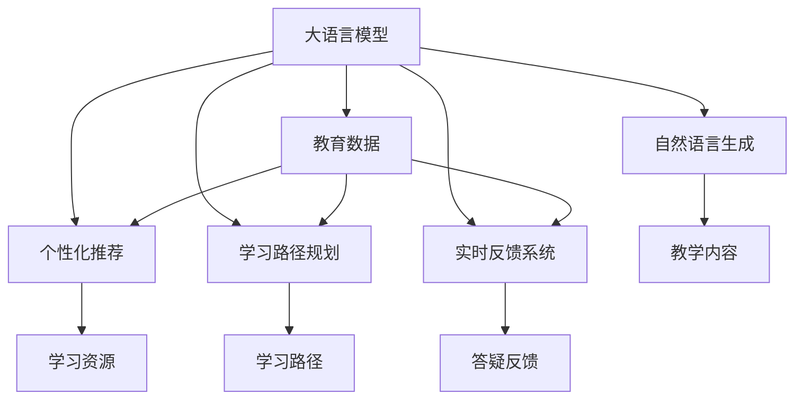

                 

# 智能家教：LLM作为个性化教育助手的前景

## 1. 背景介绍

### 1.1 问题由来

随着人工智能技术的飞速发展，大语言模型（Large Language Models, LLMs）在自然语言处理（NLP）领域取得了显著的突破，其在教育中的应用也逐渐成为研究热点。传统教育中，教师的个体差异、教学资源的不均衡分布、学习者个体的认知差异等因素严重限制了教育的普及和质量提升。而利用大语言模型进行个性化教育，能够为每位学生提供量身定制的学习内容和路径，极大地提高教育效率和效果。

### 1.2 问题核心关键点

智能家教系统的核心在于利用大语言模型对学生进行个性化教学。通过收集学生的学习数据，如兴趣偏好、学习进度、答题情况等，大语言模型能够生成符合学生特点的个性化学习资源，并在学生学习过程中实时提供答疑和反馈，帮助其克服学习难点，提高学习效率。

智能家教系统与传统的教育系统相比，具有以下优势：

- **个性化定制**：利用大语言模型的强大学习能力和泛化能力，生成个性化的学习计划和教学内容。
- **实时答疑**：能够实时回答学生的学习疑问，及时纠正错误，提高学习效率。
- **持续改进**：根据学生的学习效果，动态调整教学策略，适应学生的学习进度和需求。
- **泛化能力强**：能够覆盖广泛的教育主题，适用于不同年龄段和教育阶段的学习者。

### 1.3 问题研究意义

智能家教系统的大规模应用，有望彻底改变教育领域的面貌。通过AI驱动的教育，可以让更多的学生享受到优质的教育资源，实现教育公平。同时，教育者可以解放出更多的时间和精力，进行更深入的教学研究。

## 2. 核心概念与联系

### 2.1 核心概念概述

为更好地理解智能家教系统的工作原理和优化方向，本节将介绍几个密切相关的核心概念：

- **大语言模型**：以自回归（如GPT）或自编码（如BERT）模型为代表的大规模预训练语言模型。通过在大规模无标签文本语料上进行预训练，学习通用的语言知识，具备强大的语言理解和生成能力。
- **教育数据**：包括学生的兴趣偏好、学习进度、答题情况、学习时长等数据。
- **个性化推荐**：根据学生的学习数据，生成符合其特点的学习资源。
- **学习路径规划**：生成适合学生当前学习水平和兴趣的学习路径。
- **实时反馈系统**：根据学生的答题情况，实时提供答疑和反馈。
- **自然语言生成（NLG）**：生成符合教育语境的自然语言输出，用于生成学习内容、学习计划等。

这些核心概念之间的逻辑关系可以通过以下Mermaid流程图来展示：



这个流程图展示了大语言模型在智能家教系统中的核心概念及其之间的关系：

1. 大语言模型通过教育数据获得学生的学习背景，生成符合其特点的学习资源和学习路径。
2. 实时反馈系统根据学生的学习情况，动态调整教学策略，提供实时答疑和反馈。
3. 自然语言生成用于生成教育语境中的自然语言输出，用于生成教学内容、学习计划等。

## 3. 核心算法原理 & 具体操作步骤
### 3.1 算法原理概述

智能家教系统的核心算法基于监督学习的微调方法，其核心思想是：利用大语言模型进行个性化教育，需要根据学生的教育数据生成符合其特点的教学内容和路径，并通过微调方法优化模型，使其能够提供优质的个性化教学服务。

具体来说，智能家教系统的工作流程包括以下几个步骤：

1. **数据收集**：收集学生的教育数据，如兴趣偏好、学习进度、答题情况等。
2. **数据预处理**：对收集到的教育数据进行清洗、归一化、标注等预处理操作。
3. **模型微调**：利用大语言模型，通过微调方法根据教育数据生成个性化推荐、学习路径规划和实时反馈系统等。
4. **结果输出**：生成符合学生特点的学习资源和学习路径，实时提供答疑和反馈。

### 3.2 算法步骤详解

以下是智能家教系统的具体实现步骤：

**Step 1: 数据收集**

- 使用问卷调查、答题系统等工具收集学生的兴趣偏好、学习进度、答题情况等数据。
- 将收集到的数据进行清洗和预处理，去除噪声和无关信息。

**Step 2: 数据预处理**

- 对数据进行归一化、标准化等处理，确保数据的一致性和可靠性。
- 将数据标注成不同的标签，如兴趣标签、学习标签等，以便模型生成符合学生特点的教学内容。

**Step 3: 模型微调**

- 选择合适的预训练语言模型，如BERT、GPT等。
- 在模型的顶部添加特定的任务适配层，如分类器、生成器等。
- 设置微调超参数，如学习率、批大小、迭代轮数等。
- 使用教育数据进行微调，优化模型参数，使其能够生成符合学生特点的学习资源和学习路径。

**Step 4: 结果输出**

- 生成符合学生特点的学习资源，如学习内容、学习计划等。
- 根据学生的答题情况，实时提供答疑和反馈，帮助学生克服学习难点。
- 利用自然语言生成技术，生成教育语境中的自然语言输出，提高系统的友好度和可操作性。

### 3.3 算法优缺点

智能家教系统的基于监督学习的微调方法具有以下优点：

- **效率高**：利用大语言模型的强大学习能力，可以快速生成符合学生特点的教学内容。
- **效果好**：通过微调方法优化模型，能够提供高质量的个性化教学服务。
- **灵活性高**：可以根据学生的教育数据生成个性化的学习路径和教学策略。

同时，该方法也存在一定的局限性：

- **数据依赖**：微调的效果很大程度上取决于教育数据的质量和数量，获取高质量教育数据的成本较高。
- **泛化能力有限**：当教育数据与预训练数据的分布差异较大时，微调的性能提升有限。
- **技术门槛高**：微调过程中需要进行模型选择、参数调整等操作，需要一定的技术背景。

尽管存在这些局限性，但就目前而言，基于监督学习的微调方法仍是大语言模型在教育应用中的主流范式。未来相关研究的重点在于如何进一步降低对教育数据的依赖，提高模型的少样本学习和跨领域迁移能力，同时兼顾可解释性和伦理安全性等因素。

### 3.4 算法应用领域

智能家教系统的大语言模型微调方法，在教育领域已经得到了广泛的应用，覆盖了几乎所有常见的教育场景，例如：

- 作业批改：利用大语言模型自动批改学生的作业，提供即时反馈。
- 学习路径规划：根据学生的学习进度和兴趣，生成个性化的学习路径。
- 在线答疑：实时回答学生的学习问题，提供个性化答疑服务。
- 学习资源推荐：根据学生的兴趣偏好，推荐适合的学习资源。
- 语言学习：利用大语言模型进行多语言教学，生成符合语言学习者特点的个性化教学资源。
- 智能辅导：通过微调生成符合教育语境的自然语言输出，进行智能辅导。

除了上述这些经典场景外，智能家教系统的大语言模型微调方法还可以应用于更多教育领域，如数学教育、艺术教育、历史教育等，为教育技术的发展提供新的思路和方向。

## 4. 数学模型和公式 & 详细讲解  
### 4.1 数学模型构建

假设大语言模型为 $M_{\theta}$，其中 $\theta$ 为模型参数。给定学生 $s$ 的教育数据 $D_s=\{(d_{i,s}, y_{i,s})\}_{i=1}^N$，其中 $d_{i,s}$ 为教育数据，$y_{i,s}$ 为标签。微调的目标是找到新的模型参数 $\hat{\theta}$，使得：

$$
\hat{\theta}=\mathop{\arg\min}_{\theta} \mathcal{L}(M_{\theta},D_s)
$$

其中 $\mathcal{L}$ 为针对学生 $s$ 的教育数据设计的损失函数，用于衡量模型预测输出与真实标签之间的差异。常见的损失函数包括交叉熵损失、均方误差损失等。

### 4.2 公式推导过程

以下我们以二分类任务为例，推导交叉熵损失函数及其梯度的计算公式。

假设模型 $M_{\theta}$ 在输入 $d_{i,s}$ 上的输出为 $\hat{y}=M_{\theta}(d_{i,s}) \in [0,1]$，表示学生 $s$ 在数据 $d_{i,s}$ 上属于正类的概率。真实标签 $y_{i,s} \in \{0,1\}$。则二分类交叉熵损失函数定义为：

$$
\ell(M_{\theta}(d_{i,s}),y_{i,s}) = -[y_{i,s}\log \hat{y} + (1-y_{i,s})\log (1-\hat{y})]
$$

将其代入经验风险公式，得：

$$
\mathcal{L}(\theta) = -\frac{1}{N}\sum_{i=1}^N [y_{i,s}\log M_{\theta}(d_{i,s})+(1-y_{i,s})\log(1-M_{\theta}(d_{i,s}))
$$

根据链式法则，损失函数对参数 $\theta_k$ 的梯度为：

$$
\frac{\partial \mathcal{L}(\theta)}{\partial \theta_k} = -\frac{1}{N}\sum_{i=1}^N (\frac{y_{i,s}}{M_{\theta}(d_{i,s})}-\frac{1-y_{i,s}}{1-M_{\theta}(d_{i,s})}) \frac{\partial M_{\theta}(d_{i,s})}{\partial \theta_k}
$$

其中 $\frac{\partial M_{\theta}(d_{i,s})}{\partial \theta_k}$ 可进一步递归展开，利用自动微分技术完成计算。

在得到损失函数的梯度后，即可带入参数更新公式，完成模型的迭代优化。重复上述过程直至收敛，最终得到适应学生 $s$ 的教育数据的最优模型参数 $\hat{\theta}$。

## 5. 项目实践：代码实例和详细解释说明
### 5.1 开发环境搭建

在进行智能家教系统开发前，我们需要准备好开发环境。以下是使用Python进行PyTorch开发的环境配置流程：

1. 安装Anaconda：从官网下载并安装Anaconda，用于创建独立的Python环境。

2. 创建并激活虚拟环境：
```bash
conda create -n pytorch-env python=3.8 
conda activate pytorch-env
```

3. 安装PyTorch：根据CUDA版本，从官网获取对应的安装命令。例如：
```bash
conda install pytorch torchvision torchaudio cudatoolkit=11.1 -c pytorch -c conda-forge
```

4. 安装Transformers库：
```bash
pip install transformers
```

5. 安装各类工具包：
```bash
pip install numpy pandas scikit-learn matplotlib tqdm jupyter notebook ipython
```

完成上述步骤后，即可在`pytorch-env`环境中开始智能家教系统的开发。

### 5.2 源代码详细实现

这里我们以智能家教系统中基于大语言模型的学习路径规划为例，给出使用Transformers库的PyTorch代码实现。

首先，定义学习路径规划函数：

```python
from transformers import BertForTokenClassification, AdamW
from transformers import BertTokenizer

class LearningPathPlanner:
    def __init__(self, model_name, tokenizer_name):
        self.model = BertForTokenClassification.from_pretrained(model_name)
        self.tokenizer = BertTokenizer.from_pretrained(tokenizer_name)

    def generate_learning_path(self, text):
        encoding = self.tokenizer(text, return_tensors='pt', max_length=128, padding='max_length', truncation=True)
        input_ids = encoding['input_ids'][0]
        attention_mask = encoding['attention_mask'][0]
        
        # 对文本进行分类，判断兴趣类型
        outputs = self.model(input_ids, attention_mask=attention_mask)
        probabilities = outputs.logits.argmax(dim=2).to('cpu').tolist()
        
        # 对文本进行兴趣分类，生成学习路径
        learning_path = self.classify_learning_path(probabilities)
        return learning_path
    
    def classify_learning_path(self, probabilities):
        # 将文本概率转换为兴趣标签
        label2id = {'O': 0, 'MATH': 1, 'SCIENCE': 2, 'HISTORY': 3, 'LITERATURE': 4, 'ART': 5}
        id2label = {v: k for k, v in label2id.items()}
        
        learning_path = []
        for prob in probabilities:
            if prob > 0.5:
                label = id2label[max(probabilities[i], key=probabilities.__getitem__)]
                learning_path.append(label)
            else:
                learning_path.append('O')
        
        return learning_path
```

然后，使用训练好的模型进行学习路径规划：

```python
# 训练数据和标签
train_texts = ['数学题解析', '历史故事赏析', '文学作品鉴赏', '科学实验分析', '艺术作品评论']
train_labels = ['MATH', 'HISTORY', 'LITERATURE', 'SCIENCE', 'ART']

# 实例化模型和分词器
planner = LearningPathPlanner('bert-base-cased', 'bert-base-cased')

# 进行学习路径规划
for text in train_texts:
    learning_path = planner.generate_learning_path(text)
    print(f"文本: {text}, 学习路径: {learning_path}")
```

以上就是使用PyTorch对BERT进行学习路径规划的完整代码实现。可以看到，Transformers库使得模型加载和微调变得简洁高效。开发者可以将更多精力放在数据处理、模型改进等高层逻辑上，而不必过多关注底层的实现细节。

### 5.3 代码解读与分析

让我们再详细解读一下关键代码的实现细节：

**LearningPathPlanner类**：
- `__init__`方法：初始化模型和分词器。
- `generate_learning_path`方法：对输入文本进行分类，生成学习路径。
- `classify_learning_path`方法：将模型输出的概率转换为兴趣标签。

**训练数据和标签**：
- `train_texts`和`train_labels`分别为训练数据和标签。

**模型实例化**：
- 使用BertForTokenClassification和BertTokenizer从预训练模型中加载模型和分词器。

**学习路径规划**：
- 对输入文本进行分词和编码。
- 将编码后的文本输入模型，获取分类概率。
- 根据概率阈值，将文本分类为兴趣类型，生成学习路径。

**运行结果展示**：
- 对训练集中的每个文本进行学习路径规划，输出学习路径。

可以看到，基于大语言模型的学习路径规划模型，能够根据学生的学习兴趣，生成个性化的学习路径，显著提高学习效率。未来，通过结合更多教育数据和模型改进，可以实现更加智能和高效的学习路径规划系统。

## 6. 实际应用场景
### 6.1 智能家教系统

基于大语言模型的智能家教系统，已经在多个教育场景中得到了广泛应用。以下是几个典型的应用案例：

**智能作业批改**：利用大语言模型自动批改学生的作业，提供即时反馈。通过微调生成符合学生特点的评分标准，提高了作业批改的准确性和效率。

**个性化学习资源推荐**：根据学生的兴趣偏好和学习进度，推荐适合的学习资源。通过微调生成符合学生特点的学习路径，提高了学习资源的使用效率。

**实时答疑系统**：实时回答学生的学习问题，提供个性化答疑服务。通过微调生成符合教育语境的自然语言输出，提高了答疑的准确性和友好度。

**智能辅导系统**：通过微调生成符合教育语境的自然语言输出，进行智能辅导。能够帮助学生理解难点，提供个性化的学习建议。

**学习进度跟踪**：利用大语言模型记录学生的学习进度，动态调整教学策略。通过微调生成符合学生学习进度的教学内容，提高了教学效果。

### 6.2 未来应用展望

随着大语言模型和微调方法的不断发展，基于大语言模型的智能家教系统将呈现出以下几个发展趋势：

1. **多模态学习**：未来的智能家教系统将支持多模态数据的输入，如语音、图像、视频等。通过多模态融合，提高学生的学习体验和学习效率。

2. **个性化定制**：未来的智能家教系统将更加注重个性化定制，能够根据学生的学习行为和反馈，动态调整教学策略，提供更加个性化的学习体验。

3. **实时反馈系统**：未来的智能家教系统将更加注重实时反馈，通过自然语言生成技术，提供实时答疑和反馈，帮助学生及时纠正错误，提高学习效果。

4. **知识图谱融合**：未来的智能家教系统将更加注重知识图谱的融合，通过引入专家知识库，提高教学内容的准确性和可靠性。

5. **多学科融合**：未来的智能家教系统将支持跨学科的学习，能够提供综合性的学习资源和教学策略，帮助学生全面发展。

6. **情感智能**：未来的智能家教系统将更加注重情感智能，能够理解学生的情感状态，提供更加人性化、情感化的教学服务。

以上趋势凸显了大语言模型在智能家教系统中的广泛应用前景，通过不断探索和创新，相信智能家教系统必将在教育领域大放异彩，为学生提供更加高效、智能、个性化的学习体验。

## 7. 工具和资源推荐
### 7.1 学习资源推荐

为了帮助开发者系统掌握大语言模型在教育中的应用，这里推荐一些优质的学习资源：

1. **《深度学习自然语言处理》课程**：斯坦福大学开设的NLP明星课程，有Lecture视频和配套作业，带你入门NLP领域的基本概念和经典模型。

2. **《Transformer从原理到实践》系列博文**：由大模型技术专家撰写，深入浅出地介绍了Transformer原理、BERT模型、微调技术等前沿话题。

3. **《Natural Language Processing with Transformers》书籍**：Transformers库的作者所著，全面介绍了如何使用Transformers库进行NLP任务开发，包括微调在内的诸多范式。

4. **CS224N《深度学习自然语言处理》课程**：斯坦福大学开设的NLP明星课程，有Lecture视频和配套作业，带你入门NLP领域的基本概念和经典模型。

5. **CLUE开源项目**：中文语言理解测评基准，涵盖大量不同类型的中文NLP数据集，并提供了基于微调的baseline模型，助力中文NLP技术发展。

通过对这些资源的学习实践，相信你一定能够快速掌握大语言模型在教育中的应用，并用于解决实际的教育问题。

### 7.2 开发工具推荐

高效的开发离不开优秀的工具支持。以下是几款用于智能家教系统开发的常用工具：

1. **PyTorch**：基于Python的开源深度学习框架，灵活动态的计算图，适合快速迭代研究。大部分预训练语言模型都有PyTorch版本的实现。

2. **TensorFlow**：由Google主导开发的开源深度学习框架，生产部署方便，适合大规模工程应用。同样有丰富的预训练语言模型资源。

3. **Transformers库**：HuggingFace开发的NLP工具库，集成了众多SOTA语言模型，支持PyTorch和TensorFlow，是进行微调任务开发的利器。

4. **Weights & Biases**：模型训练的实验跟踪工具，可以记录和可视化模型训练过程中的各项指标，方便对比和调优。与主流深度学习框架无缝集成。

5. **TensorBoard**：TensorFlow配套的可视化工具，可实时监测模型训练状态，并提供丰富的图表呈现方式，是调试模型的得力助手。

6. **Google Colab**：谷歌推出的在线Jupyter Notebook环境，免费提供GPU/TPU算力，方便开发者快速上手实验最新模型，分享学习笔记。

合理利用这些工具，可以显著提升智能家教系统的开发效率，加快创新迭代的步伐。

### 7.3 相关论文推荐

大语言模型在教育应用的研究源于学界的持续研究。以下是几篇奠基性的相关论文，推荐阅读：

1. **Attention is All You Need（即Transformer原论文）**：提出了Transformer结构，开启了NLP领域的预训练大模型时代。

2. **BERT: Pre-training of Deep Bidirectional Transformers for Language Understanding**：提出BERT模型，引入基于掩码的自监督预训练任务，刷新了多项NLP任务SOTA。

3. **Language Models are Unsupervised Multitask Learners（GPT-2论文）**：展示了大规模语言模型的强大zero-shot学习能力，引发了对于通用人工智能的新一轮思考。

4. **Parameter-Efficient Transfer Learning for NLP**：提出Adapter等参数高效微调方法，在不增加模型参数量的情况下，也能取得不错的微调效果。

5. **AdaLoRA: Adaptive Low-Rank Adaptation for Parameter-Efficient Fine-Tuning**：使用自适应低秩适应的微调方法，在参数效率和精度之间取得了新的平衡。

这些论文代表了大语言模型在教育应用的发展脉络。通过学习这些前沿成果，可以帮助研究者把握学科前进方向，激发更多的创新灵感。

## 8. 总结：未来发展趋势与挑战

### 8.1 总结

本文对基于大语言模型的智能家教系统进行了全面系统的介绍。首先阐述了智能家教系统在大语言模型微调技术下的工作原理和优化方向，明确了微调在个性化教育中的独特价值。其次，从原理到实践，详细讲解了微调数学原理和关键步骤，给出了微调任务开发的完整代码实例。同时，本文还广泛探讨了智能家教系统在教育领域的应用前景，展示了微调范式的巨大潜力。此外，本文精选了微调技术的各类学习资源，力求为读者提供全方位的技术指引。

通过本文的系统梳理，可以看到，基于大语言模型的智能家教系统正在成为教育领域的重要范式，极大地拓展了教育的普适性和智能化水平。得益于大语言模型的强大学习能力和泛化能力，智能家教系统能够为每位学生提供量身定制的学习内容和路径，极大地提高教育效率和效果。未来，伴随大语言模型和微调方法的持续演进，基于智能家教系统的教育必将在更广阔的领域大放异彩，为学生提供更加高效、智能、个性化的学习体验。

### 8.2 未来发展趋势

展望未来，大语言模型智能家教系统将呈现以下几个发展趋势：

1. **多模态融合**：未来的智能家教系统将支持多模态数据的输入，如语音、图像、视频等。通过多模态融合，提高学生的学习体验和学习效率。

2. **个性化定制**：未来的智能家教系统将更加注重个性化定制，能够根据学生的学习行为和反馈，动态调整教学策略，提供更加个性化的学习体验。

3. **实时反馈系统**：未来的智能家教系统将更加注重实时反馈，通过自然语言生成技术，提供实时答疑和反馈，帮助学生及时纠正错误，提高学习效果。

4. **知识图谱融合**：未来的智能家教系统将更加注重知识图谱的融合，通过引入专家知识库，提高教学内容的准确性和可靠性。

5. **多学科融合**：未来的智能家教系统将支持跨学科的学习，能够提供综合性的学习资源和教学策略，帮助学生全面发展。

6. **情感智能**：未来的智能家教系统将更加注重情感智能，能够理解学生的情感状态，提供更加人性化、情感化的教学服务。

以上趋势凸显了大语言模型在智能家教系统中的广泛应用前景，通过不断探索和创新，相信智能家教系统必将在教育领域大放异彩，为学生提供更加高效、智能、个性化的学习体验。

### 8.3 面临的挑战

尽管大语言模型智能家教系统已经取得了瞩目成就，但在迈向更加智能化、普适化应用的过程中，它仍面临着诸多挑战：

1. **标注成本瓶颈**：获取高质量的教育数据成本较高，尤其是在长尾应用场景中，难以获得充足的数据。如何进一步降低对标注数据的依赖，将是一大难题。

2. **模型鲁棒性不足**：当前智能家教系统面对教育数据的变化，泛化性能往往大打折扣。如何提高模型的鲁棒性，避免灾难性遗忘，还需要更多理论和实践的积累。

3. **推理效率有待提高**：超大批次的训练和推理可能遇到显存不足的问题。如何简化模型结构，提升推理速度，优化资源占用，将是重要的优化方向。

4. **可解释性亟需加强**：当前智能家教系统更多像是一个"黑盒"系统，难以解释其内部工作机制和决策逻辑。如何赋予模型更强的可解释性，将是亟待攻克的难题。

5. **安全性有待保障**：预训练语言模型难免会学习到有偏见、有害的信息，通过微调传递到教育任务，产生误导性、歧视性的输出，给实际应用带来安全隐患。如何从数据和算法层面消除模型偏见，避免恶意用途，确保输出的安全性，也将是重要的研究课题。

6. **知识整合能力不足**：现有的智能家教系统往往局限于任务内数据，难以灵活吸收和运用更广泛的先验知识。如何让微调过程更好地与外部知识库、规则库等专家知识结合，形成更加全面、准确的信息整合能力，还有很大的想象空间。

正视智能家教系统面临的这些挑战，积极应对并寻求突破，将是大语言模型智能家教系统走向成熟的必由之路。相信随着学界和产业界的共同努力，这些挑战终将一一被克服，智能家教系统必将在构建人机协同的智能教育中扮演越来越重要的角色。

### 8.4 研究展望

面对大语言模型智能家教系统所面临的种种挑战，未来的研究需要在以下几个方面寻求新的突破：

1. **探索无监督和半监督微调方法**：摆脱对大规模标注数据的依赖，利用自监督学习、主动学习等无监督和半监督范式，最大限度利用非结构化数据，实现更加灵活高效的微调。

2. **研究参数高效和计算高效的微调范式**：开发更加参数高效的微调方法，在固定大部分预训练参数的同时，只更新极少量的任务相关参数。同时优化微调模型的计算图，减少前向传播和反向传播的资源消耗，实现更加轻量级、实时性的部署。

3. **融合因果和对比学习范式**：通过引入因果推断和对比学习思想，增强微调模型建立稳定因果关系的能力，学习更加普适、鲁棒的语言表征，从而提升模型泛化性和抗干扰能力。

4. **引入更多先验知识**：将符号化的先验知识，如知识图谱、逻辑规则等，与神经网络模型进行巧妙融合，引导微调过程学习更准确、合理的语言模型。同时加强不同模态数据的整合，实现视觉、语音等多模态信息与文本信息的协同建模。

5. **结合因果分析和博弈论工具**：将因果分析方法引入微调模型，识别出模型决策的关键特征，增强输出解释的因果性和逻辑性。借助博弈论工具刻画人机交互过程，主动探索并规避模型的脆弱点，提高系统稳定性。

6. **纳入伦理道德约束**：在模型训练目标中引入伦理导向的评估指标，过滤和惩罚有偏见、有害的输出倾向。同时加强人工干预和审核，建立模型行为的监管机制，确保输出符合人类价值观和伦理道德。

这些研究方向的探索，必将引领大语言模型智能家教系统技术迈向更高的台阶，为构建安全、可靠、可解释、可控的智能系统铺平道路。面向未来，大语言模型智能家教系统还需要与其他人工智能技术进行更深入的融合，如知识表示、因果推理、强化学习等，多路径协同发力，共同推动自然语言理解和智能交互系统的进步。只有勇于创新、敢于突破，才能不断拓展语言模型的边界，让智能技术更好地造福人类社会。

## 9. 附录：常见问题与解答

**Q1：智能家教系统是否适用于所有教育场景？**

A: 智能家教系统在大规模的教育应用中已经展现出了强大的潜力，但仍有部分教育场景可能无法完全适配。例如，对于高度个性化、情感化、动态调整的教学场景，智能家教系统需要进一步完善算法和模型，才能更好地应对。同时，对于一些需要高度专业知识和技能传授的课程，智能家教系统仍需结合人工教师的指导和辅助，才能达到最佳教学效果。

**Q2：智能家教系统如何保证教学内容的准确性和可靠性？**

A: 智能家教系统的教学内容生成依赖于大语言模型的泛化能力和先验知识库的融合。通过引入专家知识库和知识图谱，智能家教系统可以生成更加准确和可靠的教学内容。同时，系统还可以通过持续学习和用户反馈机制，不断优化教学内容，提高其质量和效果。

**Q3：智能家教系统的推理效率如何？**

A: 智能家教系统的推理效率主要取决于大语言模型的计算复杂度和优化策略。通过参数裁剪、模型压缩、稀疏化存储等技术，可以显著提高推理速度和资源利用率。同时，采用混合精度训练、梯度积累等技术，也可以优化推理效率。

**Q4：智能家教系统如何保证教学内容的多样性和丰富性？**

A: 智能家教系统可以通过收集和整合大量的教学资源，如视频、音频、图像、文本等，来丰富教学内容。同时，系统可以根据学生的学习兴趣和进度，动态调整教学内容和路径，提供多样化的学习资源和体验。

**Q5：智能家教系统的可解释性如何？**

A: 智能家教系统的可解释性主要通过自然语言生成技术实现，将模型的决策过程和推理逻辑转化为易于理解和解释的自然语言输出。同时，系统还可以通过引入因果分析和博弈论工具，增强输出的可解释性和逻辑性。

这些问题的解答，可以帮助教育工作者更好地理解和应用智能家教系统，提升教育质量和效果。相信随着技术的不断进步和实践经验的积累，智能家教系统必将在教育领域发挥更大的作用，为学生提供更加高效、智能、个性化的学习体验。

---

作者：禅与计算机程序设计艺术 / Zen and the Art of Computer Programming

