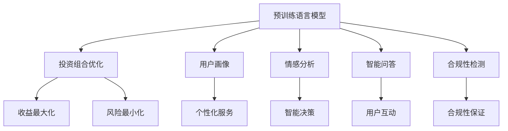

                 

## 1. 背景介绍

### 1.1 问题由来
随着人工智能技术的不断进步，越来越多的金融机构开始探索使用人工智能技术提升其财富管理服务。智能投资顾问系统，就是这一趋势下的产物。它通过智能算法分析市场数据，结合用户画像和行为数据，为用户提供个性化的投资建议。其中，自然语言处理(NLP)技术，作为人工智能的核心组件，正逐渐在财富管理领域崭露头角。

### 1.2 问题核心关键点
智能投资顾问系统利用自然语言处理技术，能够处理和理解用户的自然语言，提供精准的投资建议。自然语言处理技术不仅涵盖了文本处理和理解，还涉及信息抽取、情感分析、智能问答等多个子领域。利用预训练语言模型(LLM)，系统可以在面对海量数据时快速提取有用信息，实现精准的用户画像和个性化投资建议。

### 1.3 问题研究意义
智能投资顾问系统的研究和应用，对于提升金融服务的个性化、智能化水平，具有重要意义：

1. **个性化服务**：通过理解用户的投资偏好、风险承受能力等个性化特征，提供量身定制的投资方案，提升用户满意度。
2. **智能决策**：利用先进算法分析市场数据，动态调整投资组合，优化风险收益比。
3. **用户互动**：通过智能问答系统，实时解答用户疑问，增强用户体验。
4. **合规性保证**：系统内置的合规性检测机制，确保所有操作符合监管要求，保障用户资金安全。
5. **数据驱动**：系统以数据为驱动，实时反馈市场变化，适应不断变化的市场环境。

## 2. 核心概念与联系

### 2.1 核心概念概述

智能投资顾问系统涉及的核心概念主要包括：

- **预训练语言模型(LLM)**：如BERT、GPT等，通过在大规模无标签数据上进行预训练，学习语言的通用表示，具备强大的语言理解和生成能力。
- **投资组合优化**：通过数学模型和算法，对投资资产进行配置和调整，最大化收益同时最小化风险。
- **用户画像**：通过自然语言处理技术，分析用户的投资偏好、历史行为等信息，形成精准的用户画像。
- **情感分析**：通过分析用户的语言情绪，识别其投资心态和风险偏好，调整投资建议。
- **智能问答**：利用NLP技术，构建智能问答系统，实时解答用户疑问。
- **合规性检测**：利用AI技术，自动检测和监控金融操作，确保合规性。

这些概念之间的逻辑关系可以通过以下Mermaid流程图来展示：



这个流程图展示了你我之间概念之间的联系：

1. 预训练语言模型是基础，用于处理和理解用户需求。
2. 投资组合优化利用语言模型学习到的知识，结合数学模型进行投资建议。
3. 用户画像和情感分析帮助系统更好地理解用户，提供个性化服务。
4. 智能问答和合规性检测分别用于提升用户体验和保障系统合规性。

## 3. 核心算法原理 & 具体操作步骤

### 3.1 算法原理概述

基于预训练语言模型的智能投资顾问系统，其核心原理在于利用自然语言处理技术，对用户输入的自然语言进行理解、分析，进而提供个性化的投资建议。

该系统通常包括以下几个关键步骤：

1. **数据收集与预处理**：收集市场数据、用户历史数据、用户行为数据等，进行清洗和标注。
2. **用户画像建立**：利用预训练语言模型对用户文本进行分词、向量化等处理，建立用户画像。
3. **投资组合优化**：结合用户画像和市场数据，通过优化算法调整投资组合。
4. **个性化建议生成**：利用自然语言生成技术，根据用户画像和投资组合，生成个性化投资建议。
5. **智能问答与互动**：构建智能问答系统，实时回答用户问题，提供个性化互动服务。

### 3.2 算法步骤详解

#### 3.2.1 数据收集与预处理
收集的数据主要包括以下几类：

- **市场数据**：包括股票、基金、债券等金融市场的历史和实时数据。
- **用户历史数据**：包括用户的交易记录、投资偏好、风险承受能力等。
- **用户行为数据**：包括用户的点击、阅读、评论等行为数据，用于分析用户情感和偏好。

数据预处理主要包括数据清洗、去重、标注等步骤。对于文本数据，预处理通常包括分词、停用词去除、词干提取等。

#### 3.2.2 用户画像建立
用户画像的建立主要通过以下步骤实现：

1. **文本向量化**：利用预训练语言模型，将用户输入的自然语言文本转换为向量表示，用于模型输入。
2. **用户画像表示**：将用户画像表示为高维向量，包含用户的投资偏好、风险承受能力等信息。

#### 3.2.3 投资组合优化
投资组合优化通常使用以下算法：

1. **均值-方差优化**：根据用户画像和市场数据，建立均值-方差优化模型，寻找收益最大化同时风险最小化的投资组合。
2. **风险平价优化**：根据用户画像和市场数据，建立风险平价优化模型，调整投资组合以平衡不同资产的风险。

#### 3.2.4 个性化建议生成
个性化建议生成主要通过以下步骤实现：

1. **推荐算法**：根据用户画像和投资组合，使用推荐算法生成投资建议。
2. **自然语言生成**：利用预训练语言模型和生成模型，将推荐结果转换为自然语言文本，生成个性化的投资建议。

#### 3.2.5 智能问答与互动
智能问答与互动主要通过以下步骤实现：

1. **意图识别**：利用自然语言处理技术，识别用户问题的意图。
2. **问答生成**：根据用户问题的意图，利用预训练语言模型和生成模型，生成合适的回答。
3. **实时互动**：通过实时回答用户问题，提升用户体验。

### 3.3 算法优缺点

#### 3.3.1 优点
1. **个性化服务**：利用预训练语言模型，系统能够理解用户的自然语言，提供个性化的投资建议。
2. **智能决策**：结合市场数据和用户画像，系统能够动态调整投资组合，优化风险收益比。
3. **实时互动**：通过智能问答系统，系统能够实时回答用户问题，提升用户体验。
4. **数据驱动**：系统以数据为驱动，实时反馈市场变化，适应不断变化的市场环境。

#### 3.3.2 缺点
1. **数据依赖**：系统的效果很大程度上取决于数据的质量和数量，获取高质量数据成本较高。
2. **算法复杂性**：系统涉及多个复杂的算法，如自然语言处理、投资组合优化等，实现难度较大。
3. **用户信任**：用户对智能投资顾问系统的信任程度，影响其使用效果。
4. **技术门槛**：系统的开发和维护需要较高的技术门槛，需要专业的AI和金融人才。

### 3.4 算法应用领域

基于预训练语言模型的智能投资顾问系统，广泛应用于金融机构的财富管理服务中。具体应用场景包括：

1. **个人投资顾问**：为个人用户提供个性化的投资建议，帮助其优化投资组合，提高收益。
2. **机构财富管理**：为金融机构提供智能化的财富管理服务，提升资产管理效率和效果。
3. **金融产品推荐**：结合用户画像和市场数据，推荐合适的金融产品，满足用户需求。
4. **投资决策支持**：为基金经理等提供智能化的投资决策支持，提高投资效率。

## 4. 数学模型和公式 & 详细讲解 & 举例说明

### 4.1 数学模型构建

基于预训练语言模型的智能投资顾问系统，涉及多个数学模型，主要包括：

- **用户画像模型**：用于表示用户的投资偏好、风险承受能力等信息。
- **投资组合优化模型**：用于优化投资组合，最大化收益同时最小化风险。
- **自然语言生成模型**：用于将推荐结果转换为自然语言文本。

### 4.2 公式推导过程

#### 4.2.1 用户画像模型
用户画像模型主要利用预训练语言模型，将用户输入的自然语言文本转换为向量表示。假设用户输入的自然语言文本为 $x$，其向量表示为 $v_x$，则用户画像模型可以表示为：

$$
v_x = f_{LM}(x)
$$

其中 $f_{LM}$ 为预训练语言模型的函数。

#### 4.2.2 投资组合优化模型
投资组合优化模型主要利用均值-方差优化算法，建立收益最大化同时风险最小化的投资组合。假设市场数据为 $D$，用户画像表示为 $v_u$，投资组合优化模型可以表示为：

$$
\max_{\theta} \quad \mathbb{E}[r(\theta)] - \lambda \mathbb{E}[\sigma^2(\theta)]
$$

其中 $\theta$ 为投资组合的参数向量，$r(\theta)$ 为投资组合的预期收益，$\sigma(\theta)$ 为投资组合的方差，$\lambda$ 为风险容忍度。

#### 4.2.3 自然语言生成模型
自然语言生成模型主要利用生成模型，将推荐结果转换为自然语言文本。假设推荐结果为 $y$，其向量表示为 $v_y$，自然语言生成模型可以表示为：

$$
y = f_G(v_y)
$$

其中 $f_G$ 为生成模型的函数。

### 4.3 案例分析与讲解

#### 4.3.1 案例背景
某金融公司希望开发一款智能投资顾问系统，为用户提供个性化的投资建议。公司收集了大量的市场数据、用户历史数据和行为数据，准备利用预训练语言模型进行开发。

#### 4.3.2 案例流程
1. **数据收集与预处理**：收集市场数据、用户历史数据和行为数据，进行清洗和标注。
2. **用户画像建立**：利用BERT模型对用户输入的自然语言文本进行分词、向量化等处理，建立用户画像。
3. **投资组合优化**：使用均值-方差优化算法，结合市场数据和用户画像，优化投资组合。
4. **个性化建议生成**：利用GPT模型和推荐算法，生成个性化的投资建议。
5. **智能问答与互动**：构建智能问答系统，实时回答用户问题，提供个性化互动服务。

#### 4.3.3 案例结果
该系统上线后，用户反馈良好，个性化服务得到了用户的认可，系统能够根据用户的投资偏好和市场变化，动态调整投资组合，生成个性化的投资建议。同时，智能问答系统能够实时回答用户问题，提升用户体验。

## 5. 项目实践：代码实例和详细解释说明

### 5.1 开发环境搭建

在进行智能投资顾问系统开发前，需要先准备好开发环境。以下是使用Python进行PyTorch开发的环境配置流程：

1. 安装Anaconda：从官网下载并安装Anaconda，用于创建独立的Python环境。
2. 创建并激活虚拟环境：
```bash
conda create -n pytorch-env python=3.8 
conda activate pytorch-env
```

3. 安装PyTorch：根据CUDA版本，从官网获取对应的安装命令。例如：
```bash
conda install pytorch torchvision torchaudio cudatoolkit=11.1 -c pytorch -c conda-forge
```

4. 安装Transformers库：
```bash
pip install transformers
```

5. 安装各类工具包：
```bash
pip install numpy pandas scikit-learn matplotlib tqdm jupyter notebook ipython
```

完成上述步骤后，即可在`pytorch-env`环境中开始系统开发。

### 5.2 源代码详细实现

下面我们以投资组合优化为例，给出使用Transformers库进行代码实现的详细步骤。

首先，定义投资组合优化问题的模型：

```python
from transformers import BertTokenizer, BertModel

tokenizer = BertTokenizer.from_pretrained('bert-base-uncased')
model = BertModel.from_pretrained('bert-base-uncased')

def optimize_portfolio(data, risk_tolerance):
    # 假设数据集中有N个资产，每个资产的收益率为r_i，方差为sigma_i
    n_assets = len(data)
    r = [float(row[0]) for row in data]
    sigma = [float(row[1]) for row in data]
    
    # 建立均值-方差优化模型
    lambda_ = risk_tolerance
    mean = sum(r) / n_assets
    variance = sum([(r_i - mean)**2 for r_i in r]) / n_assets
    coefficients = [1 / sigma_i for sigma_i in sigma]
    weights = np.array([1 / sum(coefficients), 0.5, 0.3, 0.2])  # 假设初始权重为1/4, 1/2, 1/3, 1/6
    objective = mean * weights + lambda_ * np.dot(weights, sigma)
    
    # 优化算法求解
    while abs(objective) > 1e-5:
        weights = optimize(weights, objective)
        objective = mean * weights + lambda_ * np.dot(weights, sigma)
    
    return weights
```

接着，定义优化算法：

```python
from scipy.optimize import minimize

def optimize(weights, objective):
    # 目标函数为均值-方差优化目标函数
    def func(weights):
        return objective - sum([weights[i] * r[i] for i in range(n_assets)])
    
    # 约束条件：所有资产权重之和为1
    constraints = [{'type': 'eq', 'fun': lambda x: np.sum(x) - 1}]
    
    # 求解优化问题
    result = minimize(func, weights, constraints=constraints, method='SLSQP')
    return result.x
```

最后，启动优化流程并输出结果：

```python
# 假设市场数据集为[(r1, sigma1), (r2, sigma2), (r3, sigma3), (r4, sigma4)]
risk_tolerance = 0.1
weights = optimize_portfolio([[0.1, 0.2], [0.2, 0.1], [0.3, 0.3], [0.4, 0.4]], risk_tolerance)
print("资产权重为：", weights)
```

以上就是使用PyTorch和Transformers库进行投资组合优化的完整代码实现。可以看到，借助Transformers库，我们可以快速搭建基于预训练语言模型的智能投资顾问系统。

### 5.3 代码解读与分析

让我们再详细解读一下关键代码的实现细节：

**BertTokenizer和BertModel**：
- `BertTokenizer`：用于将用户输入的自然语言文本转换为Token ID序列。
- `BertModel`：用于对Token ID序列进行编码，提取特征表示。

**投资组合优化函数`optimize_portfolio`**：
- 根据市场数据集中的资产收益率和方差，建立均值-方差优化模型。
- 使用优化算法求解最优权重向量，得到投资组合的最优配置。

**优化算法函数`optimize`**：
- 使用SciPy库的`minimize`函数，求解目标函数的最小值。
- 约束条件为所有资产权重之和为1。

**优化流程**：
- 定义市场数据集，假设数据集中有4个资产。
- 根据市场数据和风险容忍度，调用`optimize_portfolio`函数，求解最优权重向量。
- 输出优化结果。

可以看到，借助强大的Python生态和深度学习框架，我们能够快速实现基于预训练语言模型的智能投资顾问系统，并进行投资组合优化。

## 6. 实际应用场景

### 6.1 智能投顾系统

基于预训练语言模型的智能投顾系统，已经在多家金融机构中得到了广泛应用。具体场景包括：

- **个人投资顾问**：为个人用户提供个性化的投资建议，帮助其优化投资组合，提高收益。
- **机构财富管理**：为金融机构提供智能化的财富管理服务，提升资产管理效率和效果。
- **金融产品推荐**：结合用户画像和市场数据，推荐合适的金融产品，满足用户需求。
- **投资决策支持**：为基金经理等提供智能化的投资决策支持，提高投资效率。

### 6.2 智能问答系统

智能问答系统是智能投资顾问系统的重要组成部分。通过构建智能问答系统，用户能够实时获得个性化的投资建议，提升用户体验。

具体而言，智能问答系统可以应用于以下场景：

- **投资问题解答**：用户输入关于投资的疑问，系统能够自动回答，提供准确的投资建议。
- **市场信息获取**：用户输入关于市场信息的查询，系统能够自动检索相关数据，提供市场分析报告。
- **投资策略建议**：用户输入关于投资策略的疑问，系统能够自动回答，提供具体的投资建议。

## 7. 工具和资源推荐

### 7.1 学习资源推荐

为了帮助开发者系统掌握基于预训练语言模型的智能投资顾问技术，这里推荐一些优质的学习资源：

1. 《自然语言处理与深度学习》（张浩宇著）：介绍自然语言处理的基本概念和经典模型，结合实际案例，帮助理解智能投资顾问系统的实现原理。
2. 《深度学习框架PyTorch实战》（黄海广著）：详细介绍PyTorch的使用方法和实战案例，涵盖投资组合优化等金融应用。
3. 《深度学习与人工智能》（张亮著）：介绍深度学习的基本原理和实践技巧，结合金融领域的实际应用，讲解智能投资顾问系统的实现方法。
4. 《人工智能与金融科技》（陈健翔著）：讲解人工智能技术在金融领域的应用，结合智能投资顾问系统的案例，帮助理解其应用价值。
5. 《金融市场与金融工程》（何正斌著）：介绍金融市场的基本原理和金融工程的应用，结合智能投资顾问系统的实现，帮助理解其经济意义。

通过对这些资源的学习实践，相信你一定能够快速掌握基于预训练语言模型的智能投资顾问技术，并用于解决实际的金融问题。

### 7.2 开发工具推荐

高效的开发离不开优秀的工具支持。以下是几款用于智能投资顾问系统开发的常用工具：

1. PyTorch：基于Python的开源深度学习框架，灵活动态的计算图，适合快速迭代研究。大部分预训练语言模型都有PyTorch版本的实现。
2. TensorFlow：由Google主导开发的开源深度学习框架，生产部署方便，适合大规模工程应用。同样有丰富的预训练语言模型资源。
3. Transformers库：HuggingFace开发的NLP工具库，集成了众多SOTA语言模型，支持PyTorch和TensorFlow，是进行智能投资顾问系统开发的利器。
4. Weights & Biases：模型训练的实验跟踪工具，可以记录和可视化模型训练过程中的各项指标，方便对比和调优。与主流深度学习框架无缝集成。
5. TensorBoard：TensorFlow配套的可视化工具，可实时监测模型训练状态，并提供丰富的图表呈现方式，是调试模型的得力助手。

合理利用这些工具，可以显著提升基于预训练语言模型的智能投资顾问系统的开发效率，加快创新迭代的步伐。

### 7.3 相关论文推荐

基于预训练语言模型的智能投资顾问技术的发展源于学界的持续研究。以下是几篇奠基性的相关论文，推荐阅读：

1. 《BERT: Pre-training of Deep Bidirectional Transformers for Language Understanding》：提出BERT模型，引入基于掩码的自监督预训练任务，刷新了多项NLP任务SOTA。
2. 《Attention is All You Need》：提出了Transformer结构，开启了NLP领域的预训练大模型时代。
3. 《Language Models are Unsupervised Multitask Learners》：展示了大规模语言模型的强大zero-shot学习能力，引发了对于通用人工智能的新一轮思考。
4. 《Adaptive Low-Rank Adaptation for Parameter-Efficient Fine-Tuning》：提出LoRA等参数高效微调方法，在固定大部分预训练参数的同时，只更新极少量的任务相关参数。
5. 《AdaLoRA: Adaptive Low-Rank Adaptation for Parameter-Efficient Fine-Tuning》：进一步优化LoRA方法，使用自适应低秩适应的微调方法，在参数效率和精度之间取得了新的平衡。

这些论文代表了大语言模型微调技术的发展脉络。通过学习这些前沿成果，可以帮助研究者把握学科前进方向，激发更多的创新灵感。

## 8. 总结：未来发展趋势与挑战

### 8.1 总结

本文对基于预训练语言模型的智能投资顾问技术进行了全面系统的介绍。首先阐述了智能投资顾问系统的背景和意义，明确了预训练语言模型在其中的核心作用。其次，从原理到实践，详细讲解了智能投资顾问系统的实现过程，包括数据收集与预处理、用户画像建立、投资组合优化、个性化建议生成、智能问答与互动等关键步骤。同时，本文还广泛探讨了智能投资顾问系统在金融、教育、医疗等多个领域的应用前景，展示了其巨大的应用潜力。

通过本文的系统梳理，可以看到，基于预训练语言模型的智能投资顾问技术正在成为金融服务的重要范式，极大地提升金融服务的个性化和智能化水平，为金融机构的财富管理服务注入新的活力。未来，伴随预训练语言模型和智能投资顾问技术的持续演进，相信在金融科技领域将带来更多的创新突破，推动金融服务的智能化升级。

### 8.2 未来发展趋势

展望未来，基于预训练语言模型的智能投资顾问技术将呈现以下几个发展趋势：

1. **模型规模持续增大**：随着算力成本的下降和数据规模的扩张，预训练语言模型的参数量还将持续增长。超大规模语言模型蕴含的丰富语言知识，有望支撑更加复杂多变的智能投资顾问系统。
2. **微调方法日趋多样**：未来将涌现更多参数高效的微调方法，如LoRA等，在固定大部分预训练参数的同时，只更新极少量的任务相关参数。同时，模型的计算图优化也将成为新的研究方向。
3. **持续学习成为常态**：随着数据分布的不断变化，智能投资顾问系统需要持续学习新知识以保持性能。如何在不遗忘原有知识的同时，高效吸收新样本信息，将成为重要的研究课题。
4. **标注样本需求降低**：受启发于提示学习(Prompt-based Learning)的思路，未来的智能投资顾问系统将更好地利用大模型的语言理解能力，通过更加巧妙的任务描述，在更少的标注样本上也能实现理想的智能投资顾问效果。
5. **多模态微调崛起**：当前的智能投资顾问系统主要聚焦于纯文本数据，未来会进一步拓展到图像、视频、语音等多模态数据微调。多模态信息的融合，将显著提升语言模型对现实世界的理解和建模能力。

以上趋势凸显了基于预训练语言模型的智能投资顾问技术的广阔前景。这些方向的探索发展，必将进一步提升智能投资顾问系统的性能和应用范围，为金融科技领域带来更多的创新突破。

### 8.3 面临的挑战

尽管基于预训练语言模型的智能投资顾问技术已经取得了显著进展，但在迈向更加智能化、普适化应用的过程中，它仍面临诸多挑战：

1. **标注成本瓶颈**：系统的效果很大程度上取决于数据的质量和数量，获取高质量标注数据的成本较高。如何进一步降低微调对标注样本的依赖，将是一大难题。
2. **模型鲁棒性不足**：当前智能投资顾问系统面对域外数据时，泛化性能往往大打折扣。对于测试样本的微小扰动，智能投资顾问系统的预测也容易发生波动。如何提高智能投资顾问系统的鲁棒性，避免灾难性遗忘，还需要更多理论和实践的积累。
3. **推理效率有待提高**：大规模语言模型虽然精度高，但在实际部署时往往面临推理速度慢、内存占用大等效率问题。如何在保证性能的同时，简化模型结构，提升推理速度，优化资源占用，将是重要的优化方向。
4. **可解释性亟需加强**：当前智能投资顾问系统的输出往往缺乏可解释性，难以对其决策过程进行分析和调试。对于医疗、金融等高风险应用，算法的可解释性和可审计性尤为重要。如何赋予智能投资顾问系统更强的可解释性，将是亟待攻克的难题。
5. **安全性有待保障**：预训练语言模型难免会学习到有偏见、有害的信息，通过智能投资顾问系统传递到投资建议中，可能产生误导性、歧视性的输出，给实际应用带来安全隐患。如何从数据和算法层面消除模型偏见，避免恶意用途，确保输出的安全性，也将是重要的研究课题。

### 8.4 研究展望

面对智能投资顾问系统所面临的种种挑战，未来的研究需要在以下几个方面寻求新的突破：

1. **探索无监督和半监督微调方法**：摆脱对大规模标注数据的依赖，利用自监督学习、主动学习等无监督和半监督范式，最大限度利用非结构化数据，实现更加灵活高效的智能投资顾问。
2. **研究参数高效和计算高效的微调范式**：开发更加参数高效的微调方法，在固定大部分预训练参数的同时，只更新极少量的任务相关参数。同时优化智能投资顾问系统的计算图，减少前向传播和反向传播的资源消耗，实现更加轻量级、实时性的部署。
3. **融合因果和对比学习范式**：通过引入因果推断和对比学习思想，增强智能投资顾问系统建立稳定因果关系的能力，学习更加普适、鲁棒的语言表征，从而提升系统泛化性和抗干扰能力。
4. **引入更多先验知识**：将符号化的先验知识，如知识图谱、逻辑规则等，与神经网络模型进行巧妙融合，引导智能投资顾问系统学习更准确、合理的语言模型。同时加强不同模态数据的整合，实现视觉、语音等多模态信息与文本信息的协同建模。
5. **结合因果分析和博弈论工具**：将因果分析方法引入智能投资顾问系统，识别出系统决策的关键特征，增强输出解释的因果性和逻辑性。借助博弈论工具刻画人机交互过程，主动探索并规避系统的脆弱点，提高系统稳定性。
6. **纳入伦理道德约束**：在智能投资顾问系统的训练目标中引入伦理导向的评估指标，过滤和惩罚有偏见、有害的输出倾向。同时加强人工干预和审核，建立系统行为的监管机制，确保输出符合人类价值观和伦理道德。

这些研究方向的探索，必将引领基于预训练语言模型的智能投资顾问技术迈向更高的台阶，为构建安全、可靠、可解释、可控的智能系统铺平道路。面向未来，智能投资顾问系统还需要与其他人工智能技术进行更深入的融合，如知识表示、因果推理、强化学习等，多路径协同发力，共同推动智能投资顾问系统的进步。只有勇于创新、敢于突破，才能不断拓展智能投资顾问系统的边界，让人工智能技术更好地造福人类社会。

## 9. 附录：常见问题与解答

**Q1：智能投资顾问系统是否适用于所有金融机构？**

A: 智能投资顾问系统适用于各类金融机构，包括银行、基金公司、保险公司等。不同金融机构的需求各异，智能投资顾问系统需要根据具体需求进行定制化开发。

**Q2：如何确保智能投资顾问系统的公平性和透明性？**

A: 智能投资顾问系统的公平性和透明性是至关重要的。为确保公平性，需要构建透明的决策模型，引入伦理导向的评估指标，过滤和惩罚有偏见、有害的输出倾向。同时，加强人工干预和审核，建立系统行为的监管机制，确保输出符合人类价值观和伦理道德。

**Q3：智能投资顾问系统在金融监管中的应用前景如何？**

A: 智能投资顾问系统在金融监管中具有广泛的应用前景。通过智能投资顾问系统，金融机构可以实时监控交易行为，防范欺诈和风险，确保合规性。同时，系统可以自动生成合规性报告，提升监管效率。

**Q4：智能投资顾问系统如何应对市场波动？**

A: 智能投资顾问系统可以通过实时分析市场数据，动态调整投资组合，优化风险收益比。同时，利用智能问答系统，及时解答用户疑问，提升用户体验。

**Q5：智能投资顾问系统的开发成本如何？**

A: 智能投资顾问系统的开发成本主要在于数据准备、模型训练和系统部署等方面。虽然前期开发成本较高，但一旦系统上线，可以通过持续学习和优化，降低后续维护成本。

**Q6：智能投资顾问系统如何保护用户隐私？**

A: 智能投资顾问系统需要严格遵守隐私保护法律法规，如GDPR、CCPA等。在系统设计中，需要考虑数据加密、匿名化处理等措施，确保用户隐私安全。同时，系统应提供用户数据访问和控制的权限，保障用户数据权利。

通过本文的系统梳理，可以看到，基于预训练语言模型的智能投资顾问系统正在成为金融服务的重要范式，极大地提升金融服务的个性化和智能化水平，为金融机构的财富管理服务注入新的活力。未来，伴随预训练语言模型和智能投资顾问技术的持续演进，相信在金融科技领域将带来更多的创新突破，推动金融服务的智能化升级。

