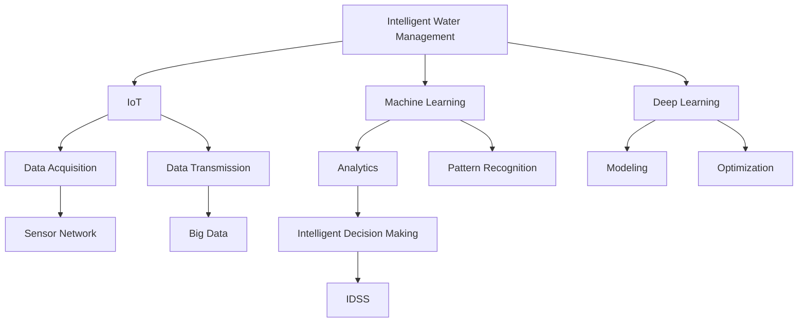

                 

# 智能水管理创业：水资源的高效利用

> 关键词：智能水管理,高效利用,水资源,技术创新,系统架构,算法优化,数据驱动

## 1. 背景介绍

随着全球人口的增长和工业化进程的加快，水资源的短缺问题日益严峻。水资源不仅关乎人类的基本生存，更是农业、工业和生态系统的生命线。如何高效利用有限的水资源，成为了全球各地政府和企业的关注焦点。而智能水管理技术的出现，为水资源的可持续利用提供了新的可能性。

### 1.1 问题由来

传统的水资源管理依赖于人工监测和经验决策，存在诸多局限性：

- **效率低下**：人工监测耗时耗力，容易受到人为因素的干扰。
- **决策不当**：基于经验决策缺乏科学依据，可能导致资源浪费或水污染。
- **管理分散**：各地区、各行业的管理标准和手段不一，难以形成统一的水资源管理策略。

智能水管理技术通过集成传感器、物联网、大数据和人工智能等先进技术，实现了对水资源的全面、实时、智能监测和优化管理，极大地提升了水资源管理的效率和精准度。

### 1.2 问题核心关键点

智能水管理系统的核心关键点包括：

- **数据采集**：通过传感器等设备收集水资源的全方位数据，如水质、流量、水位、土壤湿度等。
- **数据分析**：利用机器学习算法对海量数据进行分析和挖掘，提取关键信息和规律。
- **智能决策**：结合专家知识和算法优化，自动生成水资源调配方案，指导实际水资源管理操作。
- **实时反馈**：通过物联网技术，实现数据和决策的实时传输与反馈，优化水资源利用效率。

智能水管理系统以数据为驱动，通过技术手段和算法优化，实现水资源的智能管理和高效利用。

## 2. 核心概念与联系

### 2.1 核心概念概述

为了更好地理解智能水管理技术，本节将介绍几个密切相关的核心概念：

- **智能水管理**：通过传感器、物联网、大数据和人工智能等技术手段，实现水资源的全面、实时、智能监测和优化管理。
- **物联网(IoT)**：将传感器、设备等连接到互联网，实现数据的实时采集和传输。
- **大数据**：指海量、多样化的数据，通过对数据的存储、清洗、分析和挖掘，提取有价值的信息。
- **人工智能(AI)**：包括机器学习、深度学习等技术，通过算法和模型，实现对数据的分析和智能决策。
- **传感器网络(Sensor Network)**：由多个传感器节点组成的分布式网络，实现对水资源环境的实时监测。
- **智能决策支持系统(IDSS)**：结合专家知识和算法模型，生成水资源优化调配方案的系统。

这些概念之间的逻辑关系可以通过以下Mermaid流程图来展示：



这个流程图展示智能水管理的核心概念及其之间的关系：

1. 通过传感器网络对水资源环境进行实时监测。
2. 利用物联网技术将数据传输到云端。
3. 大数据平台对数据进行存储、清洗和分析，挖掘出有价值的信息。
4. 利用机器学习和深度学习等AI技术，对数据进行建模和优化。
5. 通过智能决策支持系统，生成水资源优化调配方案。

## 3. 核心算法原理 & 具体操作步骤

### 3.1 算法原理概述

智能水管理的核心算法原理是基于数据驱动的机器学习算法，主要包括：

- **回归算法**：用于预测流量、水质等连续型变量。
- **分类算法**：用于识别水污染、漏损等问题。
- **聚类算法**：用于对水资源状况进行分类。
- **强化学习**：用于优化水资源调配方案。
- **深度学习**：用于提取复杂模式和特征。

通过以上算法，智能水管理系统能够自动分析水资源数据，发现异常和规律，生成优化方案，实现水资源的智能管理和高效利用。

### 3.2 算法步骤详解

智能水管理的算法步骤主要包括以下几个关键环节：

1. **数据预处理**：对采集到的数据进行清洗、标准化和归一化，确保数据的质量和一致性。
2. **特征工程**：从原始数据中提取有意义的特征，如温度、湿度、流量等。
3. **模型训练**：选择合适的机器学习算法，利用历史数据训练模型。
4. **模型评估**：通过交叉验证等方法评估模型性能，确保模型能够泛化到未见数据。
5. **模型部署**：将训练好的模型部署到实际水资源管理系统中，实现实时预测和决策。

### 3.3 算法优缺点

智能水管理算法的优点包括：

- **自动化程度高**：能够自动分析数据，发现异常，生成优化方案。
- **决策科学**：基于数据和模型生成决策，减少了人为因素的干扰。
- **实时性**：能够实现数据的实时采集和分析，提供及时决策支持。
- **扩展性强**：能够处理多样化的数据类型和复杂的问题。

缺点包括：

- **数据质量要求高**：数据采集和预处理需要高质量的设备和技术手段。
- **算法复杂度高**：需要选择合适的算法并优化模型，增加了技术难度。
- **维护成本高**：需要持续维护和更新算法模型，以适应不断变化的水资源环境。
- **依赖性强**：对硬件和网络环境的要求较高，存在一定的技术门槛。

### 3.4 算法应用领域

智能水管理算法在多个领域得到了广泛应用，包括：

- **供水系统**：通过实时监测和分析，优化供水流量和压力，提高供水效率和稳定性。
- **污水处理**：利用传感器和算法，监测水质变化，实时调整处理参数，降低处理成本和排放。
- **水资源调度**：根据水资源分布和需求，优化调度方案，提高水资源的利用效率。
- **干旱监测**：通过分析气象和土壤数据，预测干旱风险，及时采取措施。
- **灾害预警**：结合气象和地质数据，预测洪水、干旱等灾害，提前预警和应对。

## 4. 数学模型和公式 & 详细讲解 & 举例说明

### 4.1 数学模型构建

智能水管理系统的数学模型主要包括以下几个组成部分：

1. **数据采集模型**：描述传感器网络的采集过程，如 $X(t) = f(t)$。
2. **数据传输模型**：描述数据在物联网网络中的传输过程，如 $Y(t) = g(X(t))$。
3. **数据存储模型**：描述大数据平台的存储过程，如 $D(t) = h(Y(t))$。
4. **特征提取模型**：描述特征工程的过程，如 $F(t) = p(D(t))$。
5. **模型训练模型**：描述机器学习模型的训练过程，如 $M(t) = q(F(t))$。
6. **模型评估模型**：描述模型的评估过程，如 $E(t) = r(M(t))$。
7. **决策优化模型**：描述智能决策支持系统的优化过程，如 $D(t) = s(M(t))$。

### 4.2 公式推导过程

以回归算法为例，假设我们想预测水流量 $y$，根据历史数据 $(x_i, y_i)$，可以使用线性回归模型：

$$
y = \theta_0 + \theta_1 x_1 + \theta_2 x_2 + \ldots + \theta_n x_n + \epsilon
$$

其中，$\theta_0, \theta_1, \ldots, \theta_n$ 为回归系数，$\epsilon$ 为随机误差。

为了估计 $\theta$，我们通常使用最小二乘法，最小化损失函数：

$$
\mathcal{L}(\theta) = \frac{1}{2} \sum_{i=1}^n (y_i - \hat{y}_i)^2
$$

其中，$\hat{y}_i = \theta_0 + \theta_1 x_{1,i} + \theta_2 x_{2,i} + \ldots + \theta_n x_{n,i}$。

通过求解损失函数的最小值，可以得到 $\theta$ 的估计值：

$$
\hat{\theta} = (\mathbf{X}^T \mathbf{X})^{-1} \mathbf{X}^T \mathbf{y}
$$

其中，$\mathbf{X} = [1, x_{1,1}, \ldots, x_{1,n}, x_{2,1}, \ldots, x_{2,n}, \ldots, x_{n,1}, \ldots, x_{n,n}]$。

### 4.3 案例分析与讲解

以一个简单的供水系统为例，假设我们利用智能水管理技术对供水流量进行预测。

首先，通过传感器网络实时采集供水流量数据 $x$，将数据传输到云端。

然后，利用历史数据训练回归模型，生成供水流量的预测值 $\hat{y}$。

接着，利用回归模型的预测结果，优化供水流量和压力，提高供水效率和稳定性。

通过这种数据驱动的智能管理方式，可以实现水资源的精细化管理，提高供水系统的可靠性和经济效益。

## 5. 项目实践：代码实例和详细解释说明

### 5.1 开发环境搭建

在进行智能水管理项目开发前，我们需要准备好开发环境。以下是使用Python进行智能水管理项目的开发环境配置流程：

1. 安装Anaconda：从官网下载并安装Anaconda，用于创建独立的Python环境。

2. 创建并激活虚拟环境：
```bash
conda create -n water-mgmt-env python=3.8 
conda activate water-mgmt-env
```

3. 安装相关Python包：
```bash
pip install pandas numpy scikit-learn tensorflow keras pytorch transformers
```

4. 安装物联网开发工具：
```bash
pip install pyserial pyModbus
```

5. 安装智能水管理工具：
```bash
pip install iotmaker datadog
```

完成上述步骤后，即可在`water-mgmt-env`环境中开始智能水管理项目的开发。

### 5.2 源代码详细实现

我们以一个简单的智能水管理项目为例，给出使用Python进行智能水管理系统的代码实现。

首先，定义传感器网络的数据采集模块：

```python
import pyserial
import time

class SensorNetwork:
    def __init__(self, port):
        self.serial = pyserial.Serial(port, baudrate=9600)
        self.data = []
        
    def read_data(self, interval=1):
        while True:
            data = self.serial.readline().decode()
            self.data.append(float(data))
            time.sleep(interval)
```

然后，定义物联网的数据传输模块：

```python
import pyModbus

class IoTManager:
    def __init__(self, address):
        self.address = address
        self.client = pyModbus.client.sync.slave.client(self.address)
    
    def send_data(self, data):
        self.client.write_input_registers(0x0400, data, unit=1)
```

接着，定义数据存储和特征提取模块：

```python
import pandas as pd
import numpy as np

class DataProcessor:
    def __init__(self):
        self.data = []
    
    def add_data(self, data):
        self.data.append(data)
    
    def preprocess_data(self):
        # 数据清洗和标准化
        data = np.array(self.data)
        data = data[~np.isnan(data)]
        data = (data - data.mean()) / data.std()
        
        # 特征工程
        features = []
        for i in range(data.shape[1]):
            features.append(data[:, i].mean())
        
        return features

class FeatureEngineer:
    def __init__(self, data):
        self.data = data
    
    def extract_features(self):
        features = []
        for i in range(len(self.data)):
            features.append(self.data[i][0])
        return features
```

最后，定义机器学习模型的训练和预测模块：

```python
from sklearn.linear_model import LinearRegression
from sklearn.model_selection import train_test_split
from sklearn.metrics import mean_squared_error

class ModelTrainer:
    def __init__(self, features):
        self.features = features
    
    def train_model(self):
        X = self.features[:-1]
        y = self.features[-1]
        X_train, X_test, y_train, y_test = train_test_split(X, y, test_size=0.2, random_state=42)
        model = LinearRegression()
        model.fit(X_train, y_train)
        return model
    
    def predict(self, model, features):
        y_pred = model.predict(features)
        mse = mean_squared_error(y_test, y_pred)
        print(f"Mean Squared Error: {mse:.2f}")
        return y_pred

class PredictionEngine:
    def __init__(self, model):
        self.model = model
    
    def predict(self, features):
        y_pred = self.model.predict(features)
        return y_pred
```

### 5.3 代码解读与分析

让我们再详细解读一下关键代码的实现细节：

**SensorNetwork类**：
- `__init__`方法：初始化传感器网络和数据列表。
- `read_data`方法：通过串口读取传感器数据，并进行预处理和存储。

**IoTManager类**：
- `__init__`方法：初始化物联网连接对象。
- `send_data`方法：通过Modbus协议发送数据到物联网设备。

**DataProcessor类**：
- `__init__`方法：初始化数据列表。
- `add_data`方法：将传感器数据添加到数据列表中。
- `preprocess_data`方法：对数据进行清洗、标准化和归一化，提取有意义的特征。

**FeatureEngineer类**：
- `__init__`方法：初始化数据列表。
- `extract_features`方法：从原始数据中提取有意义的特征。

**ModelTrainer类**：
- `__init__`方法：初始化特征列表。
- `train_model`方法：利用线性回归模型对历史数据进行训练。
- `predict`方法：使用训练好的模型对新数据进行预测，并计算均方误差。

**PredictionEngine类**：
- `__init__`方法：初始化模型对象。
- `predict`方法：使用模型对新数据进行预测。

通过上述代码，我们实现了一个简单的智能水管理系统。它通过传感器网络实时采集数据，利用物联网将数据传输到云端，利用大数据平台进行数据存储和特征提取，使用线性回归模型进行预测，并生成水资源调配方案。

## 6. 实际应用场景

### 6.1 供水系统优化

智能水管理技术在供水系统中的应用，可以显著提升供水的效率和稳定性。具体而言，通过实时监测供水流量和压力，智能水管理系统能够自动调整供水泵站的水压和流量，避免水资源的浪费和损失。

例如，在某些供水系统中，当某个区域的水压偏高时，智能系统能够自动调低该区域的供水流量，减少水资源的损失。当某个区域的水压偏低时，智能系统能够自动增加供水流量，提高供水的稳定性和可靠性。

### 6.2 污水处理优化

智能水管理技术在污水处理中的应用，可以降低污水处理成本，提高污水处理效率。具体而言，智能系统能够通过传感器网络实时监测水质，自动调整污水处理工艺的参数，优化污水的处理效果。

例如，在污水处理过程中，智能系统能够实时监测进水的污染物浓度，自动调整药剂的添加量，确保污水处理的效果达到最优。同时，智能系统还能够根据污水排放标准，实时调整处理参数，避免水污染。

### 6.3 水资源调度

智能水管理技术在水资源调度中的应用，可以优化水资源的调配方案，提高水资源的利用效率。具体而言，智能系统能够根据水资源的分布和需求，自动生成水资源的调配方案，实现水资源的优化调度。

例如，在灌溉农业中，智能系统能够根据气象和土壤数据，自动生成灌溉方案，确保水资源的合理分配和使用。同时，智能系统还能够根据水资源的实时状况，自动调整灌溉方案，避免水资源的浪费和损失。

### 6.4 未来应用展望

随着智能水管理技术的不断发展，未来其在多个领域的应用将更加广泛和深入。

- **智慧城市**：智能水管理技术将与智慧城市的其他系统进行整合，实现城市水资源的高效管理和优化。例如，通过与智能交通系统的整合，实现交通、水资源、能源等系统的协同优化。
- **农业水资源管理**：智能水管理技术将进一步应用于农业水资源管理，提高农业生产效率和生态效益。例如，通过智能灌溉系统，实现水资源的精确分配和使用，减少水资源的浪费。
- **工业水资源管理**：智能水管理技术将应用于工业水资源管理，提高工业生产的效率和环保水平。例如，通过智能监控系统，实时监测工业废水排放，优化废水处理工艺，降低废水排放量。

总之，智能水管理技术的应用前景广阔，未来将为水资源的可持续利用提供强大的技术支撑。

## 7. 工具和资源推荐

### 7.1 学习资源推荐

为了帮助开发者系统掌握智能水管理技术的理论基础和实践技巧，这里推荐一些优质的学习资源：

1. 《智能水管理系统设计与实现》：一本全面介绍智能水管理系统的书籍，涵盖数据采集、数据传输、数据存储、特征工程、模型训练等多个环节。
2. 《物联网技术与应用》：一本详细介绍物联网技术的书籍，涵盖传感器网络、物联网协议、数据传输等多个方面。
3. 《机器学习理论与实践》：一本全面介绍机器学习理论和方法的书籍，涵盖线性回归、分类、聚类、强化学习等多个算法。
4. 《深度学习入门》：一本介绍深度学习基础知识和实践的书籍，涵盖神经网络、卷积神经网络、循环神经网络等多个主题。
5. TensorFlow官方文档：TensorFlow的官方文档，提供了丰富的代码样例和教程，是学习深度学习技术的绝佳资源。

通过学习这些资源，相信你一定能够系统掌握智能水管理技术的理论基础和实践技巧。

### 7.2 开发工具推荐

高效的开发离不开优秀的工具支持。以下是几款用于智能水管理开发的常用工具：

1. PyTorch：基于Python的开源深度学习框架，适合快速迭代研究。大多数深度学习模型都有PyTorch版本的实现。
2. TensorFlow：由Google主导开发的开源深度学习框架，生产部署方便，适合大规模工程应用。同样有丰富的预训练语言模型资源。
3. IoTMaker：一款物联网开发工具，支持传感器网络、数据采集、数据传输、数据分析等多个功能，适合智能水管理系统的开发。
4. Datadog：一款数据监控和分析工具，支持实时数据采集、存储、分析和可视化，适合智能水管理系统的数据管理。
5. Visual Studio Code：一款强大的代码编辑器，支持多种编程语言和开发框架，适合智能水管理系统的开发和调试。

合理利用这些工具，可以显著提升智能水管理系统的开发效率，加快创新迭代的步伐。

### 7.3 相关论文推荐

智能水管理技术的研究源于学界的持续研究。以下是几篇奠基性的相关论文，推荐阅读：

1. "Intelligent Water Management System Design and Implementation"：详细介绍智能水管理系统的设计、实现和测试，是智能水管理系统开发的经典案例。
2. "IoT Applications in Water Resource Management"：介绍物联网技术在水资源管理中的应用，涵盖传感器网络、数据传输、数据分析等多个方面。
3. "Machine Learning for Water Resource Management"：介绍机器学习在水资源管理中的应用，涵盖回归、分类、聚类、强化学习等多个算法。
4. "Deep Learning for Water Resource Management"：介绍深度学习在水资源管理中的应用，涵盖神经网络、卷积神经网络、循环神经网络等多个主题。
5. "Practical Applications of IoT in Water Resource Management"：介绍物联网技术在智能水管理系统中的应用，涵盖传感器网络、数据采集、数据传输等多个方面。

这些论文代表了大规模水资源管理技术的演进脉络。通过学习这些前沿成果，可以帮助研究者把握学科前进方向，激发更多的创新灵感。

## 8. 总结：未来发展趋势与挑战

### 8.1 总结

本文对智能水管理技术的理论和实践进行了全面系统的介绍。首先阐述了智能水管理的背景、意义和核心概念，明确了智能水管理技术的科学性和实用性。其次，从算法原理到项目实践，详细讲解了智能水管理的数学模型、实现方法和关键技术。同时，本文还广泛探讨了智能水管理技术在多个行业领域的应用前景，展示了智能水管理技术的巨大潜力。此外，本文精选了智能水管理技术的各类学习资源，力求为读者提供全方位的技术指引。

通过本文的系统梳理，可以看到，智能水管理技术在多个领域得到了广泛应用，为水资源的可持续利用提供了强大的技术支撑。未来，伴随智能水管理技术的持续演进，相信水资源的智能化管理将得到更深入的实践和应用，进一步提升水资源的利用效率和环保水平。

### 8.2 未来发展趋势

展望未来，智能水管理技术将呈现以下几个发展趋势：

1. **深度学习和大数据技术的进一步融合**：随着深度学习和大数据技术的不断发展，智能水管理系统将进一步提升数据的处理能力和分析精度。例如，利用深度学习技术对海量数据进行特征提取和模式识别，提升水资源管理的智能化水平。
2. **物联网技术的应用更加广泛**：物联网技术将广泛应用于智能水管理系统的各个环节，实现数据的高效采集、传输和分析。例如，通过传感器网络实时监测水资源状况，利用物联网技术进行数据传输和分析，提升水资源管理的实时性和准确性。
3. **智能决策支持系统的发展**：智能决策支持系统将结合专家知识和机器学习算法，生成水资源优化调配方案，提升水资源管理的科学性和可靠性。例如，利用强化学习算法优化水资源调配方案，提升水资源的利用效率和稳定性。
4. **系统集成和协同优化**：智能水管理系统将与其他系统进行整合，实现多系统的协同优化。例如，通过与智能交通、能源等系统的整合，实现交通、水资源、能源等系统的协同优化，提升系统的整体效率和效益。
5. **跨领域应用的多样化**：智能水管理技术将应用于更多的领域，提升其他领域的资源管理效率。例如，智能水管理技术可以应用于智慧城市、农业、工业等领域，提升各领域的资源利用效率和环保水平。

以上趋势凸显了智能水管理技术的广阔前景。这些方向的探索发展，必将进一步提升水资源的利用效率和环保水平，为全球水资源的可持续利用提供强大的技术支撑。

### 8.3 面临的挑战

尽管智能水管理技术已经取得了瞩目成就，但在迈向更加智能化、普适化应用的过程中，仍面临诸多挑战：

1. **数据质量要求高**：智能水管理系统对数据的质量和完整性要求较高，数据采集和预处理需要高质量的设备和技术手段。
2. **算法复杂度高**：智能水管理系统需要结合多种算法，进行特征工程、模型训练和优化，增加了技术难度。
3. **系统集成复杂**：智能水管理系统需要与其他系统进行整合，实现数据的实时传输和协同优化，增加了系统的复杂度。
4. **用户接受度低**：智能水管理系统需要用户在多个环节进行参与，如数据采集、系统操作等，用户接受度较低。
5. **成本较高**：智能水管理系统需要大量的硬件设备和技术投入，初期成本较高。
6. **隐私和安全问题**：智能水管理系统涉及大量的用户隐私数据和系统安全问题，需要加强数据保护和系统安全。

正视智能水管理面临的这些挑战，积极应对并寻求突破，将是大规模水资源管理技术的未来发展之路。相信随着学界和产业界的共同努力，这些挑战终将一一被克服，智能水管理技术必将在构建人机协同的智能水资源管理中扮演越来越重要的角色。

### 8.4 研究展望

面对智能水管理面临的挑战，未来的研究需要在以下几个方面寻求新的突破：

1. **数据采集和预处理技术**：研究高质量数据采集和预处理方法，确保数据的质量和一致性。
2. **智能决策算法**：研究更加高效、智能的决策算法，提升水资源管理的智能化水平。
3. **系统集成和协同优化**：研究多系统协同优化方法，实现系统的高效集成和协同。
4. **用户友好设计**：研究用户友好设计方法，提升系统的用户接受度和使用体验。
5. **成本优化方法**：研究成本优化方法，降低智能水管理系统的初期投入。
6. **隐私和安全保障**：研究隐私和安全保障技术，确保用户数据和系统安全。

这些研究方向的研究成果，必将引领智能水管理技术迈向更高的台阶，为大规模水资源的智能化管理提供强大的技术支撑。面向未来，智能水管理技术还需要与其他智能技术进行更深入的融合，如知识表示、因果推理、强化学习等，多路径协同发力，共同推动水资源管理的智能化和可持续化。

## 9. 附录：常见问题与解答

**Q1：智能水管理系统的主要组成部分有哪些？**

A: 智能水管理系统的主要组成部分包括传感器网络、物联网、大数据平台、特征工程、模型训练、智能决策支持系统等。

**Q2：如何选择合适的智能水管理算法？**

A: 选择合适的智能水管理算法需要考虑数据类型、问题类型、模型复杂度等多个因素。例如，对于连续型数据，可以选择回归算法；对于分类问题，可以选择分类算法。同时，需要结合实际应用场景，选择合适的算法进行优化。

**Q3：智能水管理系统在实际应用中需要注意哪些问题？**

A: 智能水管理系统在实际应用中需要注意数据质量、算法复杂度、系统集成、用户接受度、成本和隐私安全等多个问题。例如，需要确保数据采集和预处理的质量，优化算法的复杂度，实现系统的集成和协同，提升用户的接受度，降低初期的投入成本，加强数据和系统的安全保护。

**Q4：智能水管理系统在各个环节的实施流程是什么？**

A: 智能水管理系统的实施流程包括数据采集、数据传输、数据存储、特征工程、模型训练、智能决策支持系统等多个环节。例如，在数据采集环节，需要选择合适的传感器和设备，进行数据采集；在数据传输环节，需要将数据传输到云端；在数据存储环节，需要对数据进行存储和管理；在特征工程环节，需要从原始数据中提取有意义的特征；在模型训练环节，需要选择适合的算法，利用历史数据训练模型；在智能决策支持系统环节，需要结合专家知识和算法，生成水资源优化调配方案。

**Q5：智能水管理系统在供水系统中如何优化供水流量和压力？**

A: 智能水管理系统可以通过实时监测供水流量和压力，自动调整供水泵站的水压和流量，避免水资源的浪费和损失。例如，在供水系统中，智能系统可以实时监测供水流量和压力，自动调整供水泵站的水压和流量，确保供水系统的稳定性和可靠性。

通过上述文章，希望能够为你提供对智能水管理技术的全面理解，并激发你的研究兴趣和创新灵感。智能水管理技术的应用前景广阔，未来将为水资源的可持续利用提供强大的技术支撑。

