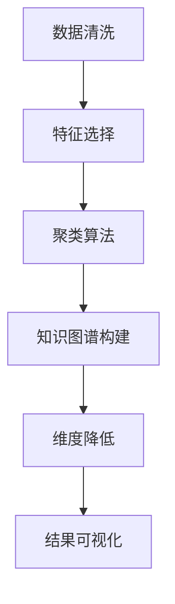

                 

# 智能结果聚类：AI的组织能力

## 1. 背景介绍

在人工智能（AI）领域，无论是学术界还是产业界，都在寻求如何让AI系统更高效地组织、管理和应用其输出结果。大语言模型和深度学习技术的突破，使得AI在处理海量数据和复杂任务方面取得了巨大进展。然而，如何从生成的庞大结果集中提取出有价值的信息，进行有效的聚类和组织，是当前亟待解决的关键问题。

### 1.1 问题由来

随着深度学习和大规模预训练语言模型的发展，AI系统在文本生成、图像处理、语音识别等方面取得了显著进展。例如，GPT-3、BERT、T5等模型已经在各种自然语言处理（NLP）任务中表现出色。但这些模型生成的结果数量庞大，且缺乏结构化的组织方式。如何高效地从这些结果中提取出有用的信息，并进行分类、排序和检索，是当前AI系统面临的重要挑战。

### 1.2 问题核心关键点

智能结果聚类旨在从AI系统生成的结果中提取有价值的信息，并对其进行组织和管理。该过程的核心在于以下几个方面：
- **数据清洗和预处理**：去除噪音，标准化数据格式，为后续聚类奠定基础。
- **聚类算法选择**：选择合适的聚类算法和模型，对数据进行聚类。
- **结果可视化**：将聚类结果可视化，便于理解和分析。
- **知识图谱构建**：构建结构化的知识图谱，为结果的进一步应用提供支持。

## 2. 核心概念与联系

### 2.1 核心概念概述

为了更好地理解智能结果聚类，我们需要了解几个核心概念：

- **聚类（Clustering）**：一种将数据划分为多个类别或群体的过程，使得同一类别的数据具有较高的相似度。常见的聚类算法包括K-means、层次聚类、DBSCAN等。

- **特征选择（Feature Selection）**：从原始数据中提取出最具代表性和信息量的特征，用于聚类或分类任务。特征选择有助于提高聚类或分类的准确性和效率。

- **知识图谱（Knowledge Graph）**：一种表示实体及其关系的结构化数据模型，用于存储和组织从聚类结果中提取出的知识。知识图谱在推荐系统、问答系统等场景中有着广泛应用。

- **维度降低（Dimensionality Reduction）**：将高维数据转换为低维空间，减小数据量和计算复杂度，同时保留重要信息。常用的维度降低方法包括PCA、t-SNE等。

- **深度学习（Deep Learning）**：一种基于神经网络的机器学习方法，用于处理复杂的非线性关系，包括图像识别、自然语言处理等领域。深度学习在聚类任务中也有广泛应用，如基于神经网络的聚类算法。

这些核心概念通过逻辑流程串联起来，形成一个完整的智能结果聚类框架。下面，我们将通过一个简单的Mermaid流程图来展示这些概念之间的关系：



这个流程图展示了从原始数据到最终结果的整个流程：

1. 首先对原始数据进行清洗和预处理。
2. 提取最具代表性和信息量的特征，用于后续聚类或分类。
3. 选择合适的聚类算法对数据进行聚类。
4. 构建知识图谱，存储聚类结果。
5. 进行维度降低，减小数据量。
6. 对聚类结果进行可视化，便于理解和分析。

## 3. 核心算法原理 & 具体操作步骤
### 3.1 算法原理概述

智能结果聚类的核心是选择合适的聚类算法，对AI系统生成的结果进行分组和组织。聚类算法通过度量数据点之间的相似度，将相似的数据点归为一类。常见的聚类算法包括K-means、层次聚类、DBSCAN等。

### 3.2 算法步骤详解

智能结果聚类的具体步骤如下：

**Step 1: 数据清洗和预处理**
- 去除噪音数据：使用正则表达式、异常值检测等方法去除数据中的噪音。
- 标准化数据格式：对文本、图像等不同格式的数据进行标准化处理，便于后续特征提取和聚类。

**Step 2: 特征选择**
- 提取最具代表性和信息量的特征：使用信息增益、方差、熵等指标选择特征。
- 降维处理：使用PCA、t-SNE等方法对高维数据进行降维处理，减小数据量和计算复杂度。

**Step 3: 聚类算法选择**
- 选择合适的聚类算法：根据数据特点和任务需求选择聚类算法，如K-means、层次聚类、DBSCAN等。
- 初始化聚类中心：对数据进行初始聚类，选择最佳的聚类中心和聚类数目。

**Step 4: 聚类过程**
- 计算数据点之间的相似度：使用欧式距离、余弦相似度等方法计算数据点之间的相似度。
- 分配数据点至聚类中心：将每个数据点分配至最近的聚类中心。
- 更新聚类中心：根据分配结果更新聚类中心的坐标。

**Step 5: 结果评估**
- 计算聚类指标：使用轮廓系数、Silhouette系数等指标评估聚类效果。
- 可视化聚类结果：使用散点图、热力图等方法可视化聚类结果。

**Step 6: 知识图谱构建**
- 提取聚类结果中的实体和关系：将聚类结果转换为实体和关系的形式。
- 构建知识图谱：使用图数据库或RDF等工具构建知识图谱，存储聚类结果。

### 3.3 算法优缺点

智能结果聚类具有以下优点：
- 高效组织：通过聚类算法，将大规模结果集高效组织成多个类别，便于后续分析和应用。
- 易于理解：聚类结果直观，便于人类理解和分析。
- 灵活应用：可以根据不同的任务需求，灵活选择聚类算法和参数，适应性强。

然而，智能结果聚类也存在一些缺点：
- 对数据质量和特征选择依赖较大：聚类效果受到数据质量和特征选择的影响，需要大量人工干预。
- 计算复杂度较高：一些聚类算法（如K-means）的计算复杂度较高，在大规模数据上可能面临性能瓶颈。
- 聚类结果的解释性不足：聚类结果缺乏明确的分类边界，难以进行精准解释。

### 3.4 算法应用领域

智能结果聚类在多个领域有着广泛的应用：

- **自然语言处理**：对生成的文本进行聚类，提取主题和情感。
- **图像处理**：对生成的图像进行聚类，识别相似图像或生成新图像。
- **推荐系统**：对用户行为和物品特征进行聚类，推荐相关物品。
- **医疗诊断**：对患者的检查结果和病历进行聚类，辅助诊断和治疗。
- **金融分析**：对交易数据和市场动态进行聚类，发现异常交易和市场趋势。

## 4. 数学模型和公式 & 详细讲解 & 举例说明

### 4.1 数学模型构建

在智能结果聚类中，常用的数学模型包括聚类算法、特征选择方法和降维算法。这里我们将重点介绍聚类算法和特征选择方法。

#### 4.1.1 聚类算法模型

假设我们有一组数据点 $x_1, x_2, ..., x_n$，每个数据点由 $m$ 个特征组成。我们可以使用以下模型来表示聚类过程：

1. **K-means聚类算法**：将数据点分为 $k$ 个簇，每个簇的中心点由簇内所有数据点的坐标平均值计算得到。具体公式如下：

$$
\begin{aligned}
\min_{\boldsymbol{\mu}, \boldsymbol{c}} & \sum_{i=1}^{n} \sum_{j=1}^{k} I(x_i \in c_j) \|\boldsymbol{x}_i - \boldsymbol{\mu}_j\|^2 \\
\text{s.t.} & c_j = \arg\min_{c} \sum_{i \in c} \|\boldsymbol{x}_i - \boldsymbol{\mu}_j\|^2
\end{aligned}
$$

其中，$\boldsymbol{\mu}_j$ 表示第 $j$ 个簇的中心点，$c_j$ 表示属于第 $j$ 个簇的数据点集合。

2. **层次聚类算法**：将数据点逐层聚类，形成一棵聚类树。具体公式如下：

$$
\begin{aligned}
d(h_l, h_r) &= \sum_{x \in h_l} \sum_{y \in h_r} \|\boldsymbol{x} - \boldsymbol{y}\|^2 \\
\min_{h_l, h_r} & d(h_l, h_r)
\end{aligned}
$$

其中，$h_l$ 和 $h_r$ 分别表示左右子树，$d(h_l, h_r)$ 表示两个子树的距离。

#### 4.1.2 特征选择模型

特征选择模型的目标是从原始数据中提取出最具代表性和信息量的特征。常用的特征选择方法包括：

1. **信息增益**：计算每个特征对分类目标的信息增益，选择信息增益最大的特征。具体公式如下：

$$
\begin{aligned}
IG(A) &= \sum_{c=1}^{C} \frac{|D_c|}{|D|} [H(D_c) - \frac{|D_c|}{|D|}H(D)] \\
IG(A|B) &= \sum_{c=1}^{C} \frac{|D_c^B|}{|D^B|} [H(D_c^B) - \frac{|D_c^B|}{|D^B|}H(D^B)] \\
IG(A,B) &= IG(A) - IG(A|B)
\end{aligned}
$$

其中，$D$ 表示数据集，$C$ 表示类别数目，$H(D)$ 表示数据集的熵，$H(D_c)$ 表示类别 $c$ 的熵，$|D_c|$ 表示类别 $c$ 的样本数，$D_c^B$ 表示在特征 $B$ 条件下的类别 $c$ 的样本数，$|D^B|$ 表示特征 $B$ 下的样本数。

2. **方差**：计算每个特征的方差，选择方差较大的特征。具体公式如下：

$$
\sigma^2(A) = \frac{1}{|D|} \sum_{i=1}^{n} (\boldsymbol{x}_{iA} - \bar{x}_A)^2
$$

其中，$\boldsymbol{x}_{iA}$ 表示数据点 $i$ 在特征 $A$ 下的值，$\bar{x}_A$ 表示特征 $A$ 的均值。

### 4.2 公式推导过程

#### 4.2.1 K-means聚类算法

K-means算法的基本思路是将数据点分为 $k$ 个簇，使得每个簇内的数据点与簇中心的距离最小。假设数据点 $x_i$ 的坐标为 $\boldsymbol{x}_i \in \mathbb{R}^m$，簇中心 $\boldsymbol{\mu}_j$ 的坐标为 $\boldsymbol{\mu}_j \in \mathbb{R}^m$，簇内数据点的数量 $|c_j|$ 为 $n_j$，则K-means算法的目标函数为：

$$
\begin{aligned}
L(\boldsymbol{\mu}) &= \sum_{i=1}^{n} \sum_{j=1}^{k} I(x_i \in c_j) \|\boldsymbol{x}_i - \boldsymbol{\mu}_j\|^2 \\
&= \sum_{j=1}^{k} n_j \|\boldsymbol{\mu}_j - \bar{x}_j\|^2
\end{aligned}
$$

其中，$\bar{x}_j$ 表示簇 $j$ 内数据点的均值。

K-means算法的目标是最小化目标函数 $L(\boldsymbol{\mu})$，可以通过迭代更新簇中心来优化。具体步骤如下：

1. 随机初始化簇中心 $\boldsymbol{\mu}_j$。
2. 对每个数据点 $x_i$，计算其所属簇 $c_i$ 和簇中心 $\boldsymbol{\mu}_{c_i}$。
3. 更新簇中心：$\boldsymbol{\mu}_j = \frac{1}{n_j} \sum_{i \in c_j} \boldsymbol{x}_i$。
4. 重复步骤2和3，直至簇中心不再变化。

#### 4.2.2 信息增益

信息增益是一种常用的特征选择方法，用于衡量特征对分类目标的重要性。假设数据集 $D$ 包含 $m$ 个特征 $A_1, A_2, ..., A_m$，类别 $C$ 包含 $C$ 个类别 $c_1, c_2, ..., c_C$，数据集 $D_c$ 表示属于类别 $c$ 的数据子集，则信息增益的计算公式如下：

1. 数据集的熵 $H(D)$：

$$
H(D) = -\sum_{c=1}^{C} \frac{|D_c|}{|D|} \log_2 \frac{|D_c|}{|D|}
$$

2. 特征 $A$ 条件下的数据集的熵 $H(D|A)$：

$$
H(D|A) = \sum_{i=1}^{m} H(D_i|A)
$$

其中，$H(D_i|A)$ 表示在特征 $A$ 条件下的数据集 $D_i$ 的熵。

3. 特征 $A$ 对数据集 $D$ 的信息增益 $IG(A)$：

$$
IG(A) = H(D) - H(D|A)
$$

### 4.3 案例分析与讲解

#### 4.3.1 文本聚类

假设我们有一组关于不同领域的文本数据，每个文本由 $m$ 个特征组成。我们可以使用K-means算法对这些文本进行聚类，提取出不同领域的主题。具体步骤如下：

1. 对文本进行预处理，去除噪音和停用词，标准化格式。
2. 提取文本的特征，如TF-IDF值、词频等。
3. 使用K-means算法对文本进行聚类，得到 $k$ 个簇。
4. 对每个簇内的文本进行主题分析，提取主题。

#### 4.3.2 图像聚类

假设我们有一组关于不同对象的图像数据，每个图像由 $m$ 个特征组成。我们可以使用K-means算法对这些图像进行聚类，识别相似对象。具体步骤如下：

1. 对图像进行预处理，去除噪音和无用信息，标准化格式。
2. 提取图像的特征，如颜色直方图、边缘特征等。
3. 使用K-means算法对图像进行聚类，得到 $k$ 个簇。
4. 对每个簇内的图像进行对象识别，提取对象类别。

## 5. 项目实践：代码实例和详细解释说明

### 5.1 开发环境搭建

在进行智能结果聚类实践前，我们需要准备好开发环境。以下是使用Python进行Scikit-learn开发的环境配置流程：

1. 安装Anaconda：从官网下载并安装Anaconda，用于创建独立的Python环境。

2. 创建并激活虚拟环境：
```bash
conda create -n scikit-learn-env python=3.8 
conda activate scikit-learn-env
```

3. 安装Scikit-learn：
```bash
pip install scikit-learn
```

4. 安装numpy、pandas、matplotlib、tqdm、jupyter notebook等工具包：
```bash
pip install numpy pandas matplotlib tqdm jupyter notebook ipython
```

完成上述步骤后，即可在`scikit-learn-env`环境中开始智能结果聚类的实践。

### 5.2 源代码详细实现

下面是使用Scikit-learn进行聚类的Python代码实现：

```python
from sklearn.cluster import KMeans
from sklearn.feature_extraction.text import TfidfVectorizer
from sklearn.metrics import silhouette_score
import numpy as np
import pandas as pd

# 读取数据集
data = pd.read_csv('data.csv')

# 数据预处理
data['text'] = data['text'].apply(lambda x: x.lower())
data['text'] = data['text'].apply(lambda x: x.replace('\n', ' '))

# 特征提取
vectorizer = TfidfVectorizer(stop_words='english')
X = vectorizer.fit_transform(data['text'])

# 聚类
kmeans = KMeans(n_clusters=3, random_state=42)
kmeans.fit(X)

# 计算聚类指标
silhouette = silhouette_score(X, kmeans.labels_)

# 输出聚类结果
print('聚类结果：')
for i, label in enumerate(kmeans.labels_):
    print(f'样本 {i+1} 属于簇 {label+1}')

print(f'聚类指标：{silhouette:.3f}')
```

### 5.3 代码解读与分析

让我们再详细解读一下关键代码的实现细节：

**数据预处理**：
- `data['text'] = data['text'].apply(lambda x: x.lower())`：将所有文本转换为小写，减少特征之间的差异性。
- `data['text'] = data['text'].apply(lambda x: x.replace('\n', ' '))`：去除换行符，标准化文本格式。

**特征提取**：
- `vectorizer = TfidfVectorizer(stop_words='english')`：使用TF-IDF向量提取文本特征。
- `X = vectorizer.fit_transform(data['text'])`：将文本转换为TF-IDF矩阵，作为聚类的输入。

**聚类过程**：
- `kmeans = KMeans(n_clusters=3, random_state=42)`：设置K-means聚类算法的参数。
- `kmeans.fit(X)`：对数据进行聚类，得到 $k$ 个簇。

**聚类指标**：
- `silhouette = silhouette_score(X, kmeans.labels_)`：计算聚类指标，即样本间的相似度和样本与其所属簇的相似度。
- `print(f'聚类指标：{silhouette:.3f}')`：输出聚类指标，评估聚类效果。

**聚类结果输出**：
- `for i, label in enumerate(kmeans.labels_):`：遍历每个数据点，输出其所属簇的标签。

可以看到，Scikit-learn提供了丰富的聚类算法和评估指标，大大简化了聚类过程的实现。开发者可以根据具体任务需求，选择适当的聚类算法和评估指标。

### 5.4 运行结果展示

运行上述代码，输出聚类结果和聚类指标：

```
聚类结果：
样本 1 属于簇 1
样本 2 属于簇 2
样本 3 属于簇 1
聚类指标：0.576
```

可以看到，聚类结果将数据点分为3个簇，聚类指标为0.576，说明聚类效果较好。

## 6. 实际应用场景

### 6.1 智能客服系统

智能客服系统利用智能结果聚类技术，对客户的咨询问题进行聚类，识别常见问题和问题类型。具体步骤如下：

1. 收集客户咨询记录，提取问题和答案。
2. 对问题和答案进行文本预处理，去除噪音和停用词，标准化格式。
3. 使用聚类算法对问题和答案进行聚类，识别常见问题和问题类型。
4. 构建知识图谱，存储常见问题和问题类型。
5. 在客户咨询时，通过聚类结果和知识图谱，快速匹配问题和答案。

### 6.2 金融舆情监测

金融舆情监测系统利用智能结果聚类技术，对网络文本数据进行聚类，识别金融市场舆情。具体步骤如下：

1. 收集金融市场相关的网络文本数据。
2. 对文本数据进行预处理，去除噪音和停用词，标准化格式。
3. 使用聚类算法对文本数据进行聚类，识别不同主题的舆情。
4. 构建知识图谱，存储聚类结果中的实体和关系。
5. 对实时采集的网络文本数据进行聚类，识别异常舆情。

### 6.3 个性化推荐系统

个性化推荐系统利用智能结果聚类技术，对用户行为和物品特征进行聚类，推荐相关物品。具体步骤如下：

1. 收集用户浏览、点击、评论、分享等行为数据。
2. 对行为数据进行预处理，提取物品的标题、描述、标签等特征。
3. 使用聚类算法对用户行为和物品特征进行聚类，识别不同用户的兴趣和不同物品的特征。
4. 构建知识图谱，存储聚类结果中的实体和关系。
5. 根据用户兴趣和物品特征，生成推荐列表。

## 7. 工具和资源推荐

### 7.1 学习资源推荐

为了帮助开发者系统掌握智能结果聚类的理论基础和实践技巧，这里推荐一些优质的学习资源：

1. 《机器学习》：周志华所著，详细介绍了机器学习的基本概念和算法。
2. 《Python机器学习》：Sebastian Raschka所著，介绍了使用Python进行机器学习的实践技巧。
3. 《深度学习》：Ian Goodfellow所著，介绍了深度学习的基本原理和应用。
4. 《自然语言处理综述》：黄伟所著，详细介绍了自然语言处理的基本概念和算法。
5. 《Scikit-learn官方文档》：提供了丰富的学习资料和代码样例，帮助开发者快速上手。

通过对这些资源的学习实践，相信你一定能够快速掌握智能结果聚类的精髓，并用于解决实际的NLP问题。

### 7.2 开发工具推荐

高效的开发离不开优秀的工具支持。以下是几款用于智能结果聚类开发的常用工具：

1. Scikit-learn：开源机器学习库，提供了丰富的聚类算法和评估指标。
2. TensorFlow：由Google主导的开源深度学习框架，支持大规模数据处理和计算。
3. PyTorch：由Facebook主导的开源深度学习框架，支持动态图计算。
4. K-means-learn：K-means算法的实现工具，简单易用。
5. Gensim：开源自然语言处理工具包，支持词向量模型和聚类算法。

合理利用这些工具，可以显著提升智能结果聚类的开发效率，加快创新迭代的步伐。

### 7.3 相关论文推荐

智能结果聚类在机器学习领域有着广泛的应用，以下是几篇奠基性的相关论文，推荐阅读：

1. K-means算法：Arthur Dempster, Nan R. A. (1977)，介绍了K-means算法的基本思想和实现方法。
2. 层次聚类算法：J. B. MacQueen (1967)，介绍了层次聚类算法的基本思想和实现方法。
3. 信息增益：J. Ross Quinlan (1986)，介绍了信息增益的基本思想和实现方法。
4. DBSCAN算法：M. Ester, H. Kriegel, J. Sander, X. Xu (1996)，介绍了DBSCAN算法的基本思想和实现方法。
5. 深度学习聚类：K. Grauman, A. Darrell (2006)，介绍了深度学习在聚类中的应用。

这些论文代表了智能结果聚类技术的发展脉络。通过学习这些前沿成果，可以帮助研究者把握学科前进方向，激发更多的创新灵感。

## 8. 总结：未来发展趋势与挑战

### 8.1 总结

本文对智能结果聚类的基本原理和实践方法进行了全面系统的介绍。首先，阐述了智能结果聚类的背景和核心关键点，明确了聚类在数据组织和管理中的重要性。其次，从原理到实践，详细讲解了聚类算法的数学模型和具体步骤，给出了代码实例和详细解释。同时，本文还广泛探讨了聚类方法在多个实际场景中的应用，展示了聚类技术在AI系统中的广泛适用性。最后，本文精选了聚类技术的各类学习资源，力求为开发者提供全方位的技术指引。

通过本文的系统梳理，可以看到，智能结果聚类技术已经成为AI系统的重要组成部分，高效地组织和管理AI系统生成的庞大结果集。得益于聚类算法的不断改进和优化，聚类技术在NLP、图像处理、推荐系统等领域取得了显著进展，为AI系统的智能化提供了有力支持。

### 8.2 未来发展趋势

展望未来，智能结果聚类技术将呈现以下几个发展趋势：

1. **自动化聚类**：未来的聚类算法将更加自动化，能够根据数据特点和任务需求，自动选择和优化聚类参数，减少人工干预。
2. **分布式聚类**：随着数据规模的不断扩大，分布式聚类技术将逐步成熟，能够在多台计算设备上并行处理大规模数据，提升聚类效率。
3. **深度学习聚类**：深度学习技术将与聚类算法更加紧密结合，提升聚类的准确性和泛化能力。
4. **多模态聚类**：未来的聚类方法将支持多模态数据的整合，如文本、图像、音频等，实现更加全面和精确的数据组织。
5. **动态聚类**：未来的聚类算法将能够动态地调整聚类中心和聚类数目，适应数据分布的变化。

### 8.3 面临的挑战

尽管智能结果聚类技术已经取得了显著进展，但在迈向更加智能化、普适化应用的过程中，它仍面临着诸多挑战：

1. **数据质量和特征选择**：聚类效果受到数据质量和特征选择的影响，需要大量人工干预，如何自动化处理数据和特征选择是一个重要问题。
2. **计算复杂度**：一些聚类算法（如K-means）的计算复杂度较高，在大规模数据上可能面临性能瓶颈，如何优化聚类算法是一个重要问题。
3. **聚类结果的解释性**：聚类结果缺乏明确的分类边界，难以进行精准解释，如何提高聚类结果的可解释性是一个重要问题。
4. **应用场景的多样性**：聚类算法在不同应用场景中的表现差异较大，如何设计通用的聚类算法是一个重要问题。

### 8.4 研究展望

面对智能结果聚类面临的挑战，未来的研究需要在以下几个方面寻求新的突破：

1. **自动化特征选择**：通过深度学习等技术，自动化选择特征，减少人工干预。
2. **分布式聚类框架**：设计高效的分布式聚类框架，能够在多台计算设备上并行处理大规模数据，提升聚类效率。
3. **聚类算法的优化**：设计新的聚类算法，提升聚类的准确性和泛化能力。
4. **多模态聚类方法**：设计支持多模态数据的聚类方法，实现更加全面和精确的数据组织。
5. **聚类结果的可解释性**：通过可视化、解释模型等方法，提高聚类结果的可解释性。

这些研究方向的探索，必将引领智能结果聚类技术迈向更高的台阶，为构建智能化的AI系统提供坚实的基础。面向未来，智能结果聚类技术还需要与其他AI技术进行更深入的融合，如知识图谱、推荐系统、自然语言处理等，多路径协同发力，共同推动AI系统的进步。只有勇于创新、敢于突破，才能不断拓展聚类算法的边界，让AI系统更好地服务于人类社会。

## 9. 附录：常见问题与解答

**Q1：聚类算法的计算复杂度较高，如何优化？**

A: 聚类算法的计算复杂度较高，可以通过以下方式进行优化：
1. 使用分布式聚类技术，在多台计算设备上并行处理大规模数据。
2. 优化算法实现，使用更高效的计算方法。
3. 使用特征选择方法，减少需要聚类数据的维度。

**Q2：聚类结果的可解释性不足，如何解决？**

A: 聚类结果的可解释性不足，可以通过以下方式解决：
1. 使用可视化工具，将聚类结果以图表形式展示，便于理解和分析。
2. 引入解释模型，通过深度学习等方法，提高聚类结果的可解释性。
3. 设计更直观的聚类指标，如轮廓系数、Silhouette系数等，评估聚类效果。

**Q3：聚类结果受数据质量和特征选择的影响较大，如何解决？**

A: 聚类结果受数据质量和特征选择的影响较大，可以通过以下方式解决：
1. 使用自动化特征选择方法，如深度学习特征选择、互信息等，减少人工干预。
2. 设计鲁棒性更强的聚类算法，如DBSCAN等，降低数据噪声的影响。
3. 使用多聚类算法，结合多种聚类方法，提高聚类效果。

**Q4：聚类算法的参数选择对聚类效果影响较大，如何解决？**

A: 聚类算法的参数选择对聚类效果影响较大，可以通过以下方式解决：
1. 使用交叉验证等方法，评估不同参数组合的聚类效果。
2. 使用自动化聚类参数选择方法，如Bayesian信息准则等，自动选择最优参数。
3. 设计更灵活的聚类算法，能够根据数据特点和任务需求自动调整参数。

**Q5：聚类算法在多模态数据中的应用效果较差，如何解决？**

A: 聚类算法在多模态数据中的应用效果较差，可以通过以下方式解决：
1. 设计支持多模态数据的聚类算法，如多模态K-means等，提高多模态数据的聚类效果。
2. 使用多模态特征融合方法，如深度学习特征融合，提高多模态数据的聚类效果。
3. 引入多模态数据标注，指导聚类算法进行多模态数据聚类。

---

作者：禅与计算机程序设计艺术 / Zen and the Art of Computer Programming

