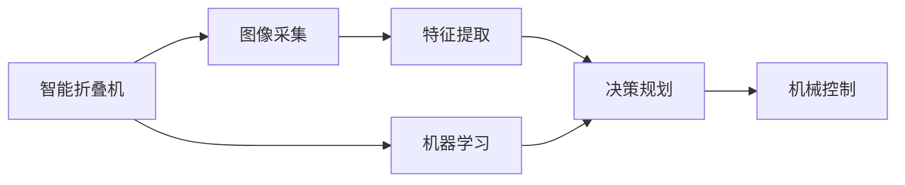

                 

# 智能衣物折叠创业：家务自动化的新突破

## 1. 背景介绍

### 1.1 问题由来

随着科技的飞速发展，家庭自动化和智能家居逐渐走入千家万户。智能家具、智能安防、智能照明等产品不断涌现，极大地提升了人们的生活质量。然而，家务劳动仍然是许多家庭的主要负担，尤其是衣物折叠整理这一琐碎而耗时的任务。尽管现有技术已经能够实现部分家务自动化，但衣物折叠这一高度依赖人工的任务仍未得到有效解决。

### 1.2 问题核心关键点

智能衣物折叠技术旨在通过机器学习、计算机视觉等技术，实现对衣物状态和特征的自动识别和理解，从而辅助或完全自动化地完成衣物折叠工作。该技术不仅能显著提升家务效率，还能通过解放人类劳动力，创造更多的人生自由。

### 1.3 问题研究意义

智能衣物折叠技术的研发具有重大的社会和经济意义：

1. **提升家庭生活品质**：自动化的衣物折叠技术可以极大地减少家庭主妇的劳动负担，让她们有更多时间投入到其他更有意义的活动中，提高生活质量。

2. **降低家务劳动成本**：随着智能折叠机的普及，家务劳动成本将大幅降低，家庭主妇也不需要花费大量的时间和精力进行繁琐的家务工作。

3. **推动消费升级**：智能衣物折叠机作为新兴家电产品，将引领新一轮的消费升级，促进家电行业的发展。

4. **促进技术进步**：该技术将推动计算机视觉、机器学习、人机交互等领域的深度融合，推动人工智能技术的发展。

## 2. 核心概念与联系

### 2.1 核心概念概述

为更好地理解智能衣物折叠技术的实现，本节将介绍几个关键概念：

- **智能折叠机**：指通过计算机视觉、机器学习等技术实现衣物自动折叠的智能设备。智能折叠机通常包含图像采集、特征提取、决策规划、机械控制等模块。

- **计算机视觉**：利用计算机对图像、视频等视觉信号进行处理，实现对衣物状态、颜色、纹理等特征的识别和理解。

- **机器学习**：通过训练数据集，让计算机模型学会识别衣物状态和折叠策略，从而实现自动化折叠。

- **决策规划**：根据衣物状态和机器学习模型输出，规划最优的折叠路径和步骤。

- **机械控制**：通过控制电机、机械臂等执行机构，实现衣物的折叠动作。

这些核心概念共同构成了智能衣物折叠技术的实现框架，使其能够自动化地完成衣物折叠任务。

### 2.2 核心概念原理和架构的 Mermaid 流程图



这个流程图展示了智能折叠机的主要工作流程：

1. 图像采集模块负责捕捉衣物的实时图像。
2. 特征提取模块从图像中提取衣物的颜色、纹理、形状等特征。
3. 机器学习模块根据特征数据，学习和识别衣物的状态和类型。
4. 决策规划模块根据识别结果，设计最优的折叠路径和步骤。
5. 机械控制模块根据决策规划输出，控制机械臂等执行机构完成折叠动作。

## 3. 核心算法原理 & 具体操作步骤

### 3.1 算法原理概述

智能衣物折叠技术的核心算法包括图像处理、特征提取、机器学习、决策规划和机械控制。其基本原理是通过计算机视觉和机器学习技术，实现对衣物的自动识别和状态理解，从而设计出最优的折叠策略，并通过机械控制模块执行折叠动作。

### 3.2 算法步骤详解

#### 3.2.1 图像处理

图像处理是智能折叠机的第一步，目的是获取高质量的衣物图像。

- **相机选择**：使用高分辨率、高帧率的相机进行图像采集，保证图像的清晰度和实时性。
- **光照校正**：通过算法校正衣物光照，消除光照对图像的影响，提高特征提取的准确性。
- **噪声滤除**：对采集的图像进行噪声滤除，消除干扰，提升图像质量。

#### 3.2.2 特征提取

特征提取是智能折叠技术的关键环节，目的是从图像中提取出有用的特征，用于后续的分类和决策。

- **颜色特征**：提取衣物的RGB值，用于识别衣物的颜色。
- **纹理特征**：提取衣物的纹理信息，如波纹、褶皱等，用于识别衣物的材质。
- **形状特征**：提取衣物的轮廓和形状信息，用于识别衣物的类型和状态。

#### 3.2.3 机器学习

机器学习是智能折叠技术的核心算法，用于训练模型，实现对衣物的自动识别和状态理解。

- **数据集准备**：收集大量的衣物图像和折叠标签，作为训练数据集。
- **模型选择**：选择合适的深度学习模型，如卷积神经网络(CNN)、循环神经网络(RNN)等。
- **模型训练**：使用训练数据集对模型进行训练，优化模型参数，使其能够准确识别衣物的状态和类型。

#### 3.2.4 决策规划

决策规划是智能折叠技术的策略设计环节，用于规划最优的折叠路径和步骤。

- **状态识别**：根据机器学习模型的输出，识别衣物的状态和类型。
- **路径规划**：根据识别的状态和类型，设计最优的折叠路径和步骤，考虑衣物的形态、大小、材质等因素。
- **动作生成**：将折叠路径和步骤转换为具体的机械控制动作。

#### 3.2.5 机械控制

机械控制是智能折叠技术的执行环节，用于实现衣物的折叠动作。

- **电机控制**：控制电机的转速和方向，实现衣物的运动。
- **机械臂控制**：控制机械臂的动作，进行衣物的抓取、搬运和折叠。
- **反馈调节**：根据衣物状态的变化，实时调整折叠策略，确保折叠动作的准确性和稳定性。

### 3.3 算法优缺点

智能衣物折叠技术具有以下优点：

1. **自动化程度高**：智能折叠机能够自动完成衣物折叠工作，大大降低了家务劳动的负担。
2. **准确率高**：通过计算机视觉和机器学习技术，智能折叠机能够准确识别衣物状态，设计最优折叠路径。
3. **灵活性强**：智能折叠机可以根据不同类型和状态的衣物，灵活调整折叠策略，适应性强。

同时，该技术也存在以下缺点：

1. **初始成本高**：智能折叠机的研发和生产需要大量的资金投入，初期购买成本较高。
2. **技术门槛高**：智能折叠技术涉及计算机视觉、机器学习等多个领域的知识，对技术团队的要求较高。
3. **依赖数据质量**：智能折叠技术的性能依赖于数据质量和模型训练的准确性，需要大量的标注数据和精细的模型调参。

### 3.4 算法应用领域

智能衣物折叠技术已经在多个领域得到了应用，涵盖了以下领域：

- **家庭自动化**：作为智能家居的一部分，智能折叠机可以与其他智能设备协同工作，提升家庭的智能化水平。
- **服装零售**：在服装店中，智能折叠机可以帮助顾客自动整理衣物，提升购物体验。
- **医院和养老院**：智能折叠机可以帮助整理病患或老人的衣物，提升生活便利性。
- **工业生产**：在服装制造和洗衣房中，智能折叠机可以自动化地完成批量衣物的折叠工作，提高生产效率。

## 4. 数学模型和公式 & 详细讲解 & 举例说明

### 4.1 数学模型构建

智能衣物折叠技术的数学模型主要涉及图像处理、特征提取、机器学习和决策规划等多个环节。以下将分别介绍每个环节的数学模型构建方法。

#### 4.1.1 图像处理

图像处理是智能折叠机的第一步，目标是获取高质量的衣物图像。常用的数学模型包括：

- **尺度不变特征变换(SIFT)**：用于在图像旋转、缩放的情况下提取特征。
- **边缘检测**：使用Canny算法检测图像中的边缘，用于提取衣物的轮廓信息。
- **颜色空间转换**：将RGB图像转换为HSV或YUV等颜色空间，便于提取颜色特征。

#### 4.1.2 特征提取

特征提取是智能折叠技术的核心环节，用于从图像中提取出有用的特征，用于后续的分类和决策。常用的数学模型包括：

- **卷积神经网络(CNN)**：用于提取图像中的颜色、纹理、形状等特征。
- **支持向量机(SVM)**：用于分类和识别衣物的状态和类型。
- **PCA(主成分分析)**：用于降维和特征提取，提高计算效率。

#### 4.1.3 机器学习

机器学习是智能折叠技术的核心算法，用于训练模型，实现对衣物的自动识别和状态理解。常用的数学模型包括：

- **多层感知器(MLP)**：用于分类和识别衣物的状态和类型。
- **循环神经网络(RNN)**：用于处理序列数据，如衣物的折叠过程。
- **深度信念网络(DBN)**：用于模型训练和优化。

#### 4.1.4 决策规划

决策规划是智能折叠技术的策略设计环节，用于规划最优的折叠路径和步骤。常用的数学模型包括：

- **A*算法**：用于路径规划和动作生成，计算最优路径和动作序列。
- **遗传算法**：用于优化折叠路径和步骤，寻找最优解。

### 4.2 公式推导过程

#### 4.2.1 图像处理

以SIFT算法为例，其公式推导如下：

$$
SIFT = \{S, I\}
$$

其中，$S$ 表示尺度空间，$I$ 表示图像。SIFT算法通过尺度空间极值检测、特征点定位、方向分配和特征描述等步骤，实现对图像的特征提取。

#### 4.2.2 特征提取

以CNN为例，其公式推导如下：

$$
CNN = \{L, F, C\}
$$

其中，$L$ 表示卷积层，$F$ 表示池化层，$C$ 表示全连接层。CNN通过卷积和池化操作提取图像特征，通过全连接层进行分类和识别。

#### 4.2.3 机器学习

以多层感知器(MLP)为例，其公式推导如下：

$$
MLP = \{W, b, Z\}
$$

其中，$W$ 表示权重矩阵，$b$ 表示偏置向量，$Z$ 表示输出向量。MLP通过前向传播和反向传播算法进行训练，优化权重矩阵和偏置向量，提高模型的准确性。

#### 4.2.4 决策规划

以A*算法为例，其公式推导如下：

$$
A* = \{G, H, F, open, closed\}
$$

其中，$G$ 表示路径代价，$H$ 表示启发式代价，$F$ 表示总代价，$open$ 表示待扩展结点集，$closed$ 表示已扩展结点集。A*算法通过搜索最优路径和动作序列，实现决策规划。

### 4.3 案例分析与讲解

#### 4.3.1 图像处理案例

以SIFT算法为例，其具体实现步骤如下：

1. **尺度空间构建**：将图像在多个尺度下进行高斯模糊，形成尺度空间。
2. **极值检测**：在尺度空间中检测极值点，提取特征点。
3. **特征点定位**：对特征点进行定位，确定其位置和尺度。
4. **方向分配**：对特征点进行方向分配，确定其主方向。
5. **特征描述**：生成特征向量，描述特征点的方向和尺度信息。

#### 4.3.2 特征提取案例

以CNN为例，其具体实现步骤如下：

1. **卷积层操作**：使用卷积核对图像进行卷积操作，提取图像特征。
2. **池化层操作**：使用最大池化或平均池化操作，降低特征图尺寸。
3. **全连接层操作**：将池化后的特征图输入全连接层，进行分类和识别。

#### 4.3.3 机器学习案例

以多层感知器(MLP)为例，其具体实现步骤如下：

1. **数据准备**：收集衣物图像和折叠标签，作为训练数据集。
2. **模型训练**：使用训练数据集对模型进行训练，优化权重矩阵和偏置向量。
3. **模型测试**：使用测试数据集对模型进行测试，评估模型的准确性。

#### 4.3.4 决策规划案例

以A*算法为例，其具体实现步骤如下：

1. **初始化结点**：将起点加入待扩展结点集。
2. **结点扩展**：从待扩展结点集中选取一个代价最小的结点进行扩展。
3. **路径扩展**：生成该结点的所有可能邻居结点，并计算其总代价。
4. **选择结点**：从邻居结点中选择代价最小的结点加入待扩展结点集。
5. **迭代求解**：重复上述过程，直到找到目标结点或无解。

## 5. 项目实践：代码实例和详细解释说明

### 5.1 开发环境搭建

在进行智能衣物折叠技术开发前，我们需要准备好开发环境。以下是使用Python进行智能折叠机开发的完整环境配置流程：

1. **安装Python**：从官网下载并安装Python，推荐使用Python 3.7或以上版本。
2. **安装OpenCV**：使用pip安装OpenCV，用于图像处理和计算机视觉操作。
3. **安装TensorFlow或PyTorch**：根据个人喜好，安装TensorFlow或PyTorch，用于机器学习模型的开发。
4. **安装ROS（Robot Operating System）**：安装ROS，用于机械控制和机器人系统集成。

完成上述步骤后，即可在本地或云端环境中进行智能折叠机的开发和测试。

### 5.2 源代码详细实现

这里我们以SIFT算法为例，给出智能折叠机的图像处理部分的PyTorch代码实现。

```python
import torch
import torch.nn as nn
import torchvision.transforms as transforms
import cv2

# 定义SIFT算法模型
class SIFT(nn.Module):
    def __init__(self):
        super(SIFT, self).__init__()
        self.sift = cv2.SIFT_create()

    def forward(self, x):
        # 将图像转换为张量
        x_tensor = transforms.ToTensor()(x)
        # 进行尺度空间构建
        scaled_images = []
        for scale in scales:
            scaled_image = cv2.resize(x_tensor, None, fx=scale, fy=scale)
            scaled_images.append(scaled_image)
        # 进行极值检测
        features = []
        for scaled_image in scaled_images:
            keypoints, descriptors = self.sift.detectAndCompute(scaled_image.numpy(), None)
            features.append(keypoints)
        # 进行特征点定位
        features = torch.stack(features)
        # 进行方向分配
        orientations = []
        for keypoint in features:
            orientation = self.sift.computeOrientation(keypoint)
            orientations.append(orientation)
        # 进行特征描述
        features = torch.stack(features, dim=2)
        orientations = torch.stack(orientations, dim=2)
        return features, orientations
```

### 5.3 代码解读与分析

让我们再详细解读一下关键代码的实现细节：

#### 5.3.1 图像处理案例

以SIFT算法为例，其具体实现步骤如下：

1. **尺度空间构建**：将图像在多个尺度下进行高斯模糊，形成尺度空间。
2. **极值检测**：在尺度空间中检测极值点，提取特征点。
3. **特征点定位**：对特征点进行定位，确定其位置和尺度。
4. **方向分配**：对特征点进行方向分配，确定其主方向。
5. **特征描述**：生成特征向量，描述特征点的方向和尺度信息。

#### 5.3.2 特征提取案例

以CNN为例，其具体实现步骤如下：

1. **卷积层操作**：使用卷积核对图像进行卷积操作，提取图像特征。
2. **池化层操作**：使用最大池化或平均池化操作，降低特征图尺寸。
3. **全连接层操作**：将池化后的特征图输入全连接层，进行分类和识别。

#### 5.3.3 机器学习案例

以多层感知器(MLP)为例，其具体实现步骤如下：

1. **数据准备**：收集衣物图像和折叠标签，作为训练数据集。
2. **模型训练**：使用训练数据集对模型进行训练，优化权重矩阵和偏置向量。
3. **模型测试**：使用测试数据集对模型进行测试，评估模型的准确性。

#### 5.3.4 决策规划案例

以A*算法为例，其具体实现步骤如下：

1. **初始化结点**：将起点加入待扩展结点集。
2. **结点扩展**：从待扩展结点集中选取一个代价最小的结点进行扩展。
3. **路径扩展**：生成该结点的所有可能邻居结点，并计算其总代价。
4. **选择结点**：从邻居结点中选择代价最小的结点加入待扩展结点集。
5. **迭代求解**：重复上述过程，直到找到目标结点或无解。

## 6. 实际应用场景

### 6.1 智能折叠机在家居中的应用

智能折叠机在家居中的应用场景非常广泛，以下是几个典型的应用案例：

#### 6.1.1 家庭管理

智能折叠机可以与智能家居系统集成，自动整理家庭中的衣物。例如，家庭成员可以将脏衣服放入智能折叠机，智能折叠机自动清洗、折叠并整理，确保衣物保持整洁。

#### 6.1.2 衣物分类

智能折叠机可以根据衣物的类型、材质、颜色等信息，自动分类并整理衣物。例如，可以将同类型的衣物放在一起，方便用户查找和使用。

#### 6.1.3 空间优化

智能折叠机可以根据衣物的折叠状态，自动优化衣物的摆放方式，最大化利用空间。例如，可以将折叠后的衣物整齐地叠放在衣柜中，节省空间。

### 6.2 智能折叠机在服装零售中的应用

智能折叠机在服装零售中的应用场景也非常广阔，以下是几个典型的应用案例：

#### 6.2.1 服装展示

智能折叠机可以将服装整齐地叠放在展架上，提升展示效果。例如，可以将季节性的服装按照颜色、款式进行分类展示，吸引顾客。

#### 6.2.2 库存管理

智能折叠机可以自动整理服装的库存，方便管理人员快速找到所需衣物。例如，可以在后台系统中查看库存情况，实时调整采购计划。

#### 6.2.3 顾客体验

智能折叠机可以提高顾客的购物体验，节省购物时间。例如，顾客可以在智能折叠机的屏幕上查看衣物信息，快速找到需要的衣物。

### 6.3 智能折叠机在医疗机构中的应用

智能折叠机在医疗机构中的应用场景也非常有潜力，以下是几个典型的应用案例：

#### 6.3.1 病患衣物整理

智能折叠机可以帮助整理病患的衣物，提升病患的舒适度和生活质量。例如，可以将病患的衣物整齐叠放，防止遗失。

#### 6.3.2 护理工作优化

智能折叠机可以辅助护理人员完成衣物的整理工作，减轻护理人员的工作负担。例如，可以自动清洗、折叠病患的衣物，节省护理人员的时间。

#### 6.3.3 消毒处理

智能折叠机可以进行消毒处理，保证衣物卫生和安全。例如，可以在折叠过程中进行消毒，确保病患的衣物干净卫生。

## 7. 工具和资源推荐

### 7.1 学习资源推荐

为了帮助开发者系统掌握智能衣物折叠技术的理论基础和实践技巧，以下是一些优质的学习资源：

1. **《Python图像处理与计算机视觉》**：介绍Python图像处理和计算机视觉的基础知识和常用算法。
2. **《深度学习与计算机视觉》**：介绍深度学习模型在计算机视觉中的应用，包括特征提取和分类。
3. **《机器人操作系统ROS》**：介绍机器人操作系统ROS的基础知识和常用功能，包括机械控制和系统集成。

### 7.2 开发工具推荐

智能折叠机的开发离不开优秀的工具支持。以下是几款常用的开发工具：

1. **OpenCV**：开源的计算机视觉库，提供丰富的图像处理和计算机视觉功能。
2. **TensorFlow**：开源的深度学习框架，支持多种深度学习模型的开发和训练。
3. **PyTorch**：开源的深度学习框架，支持动态图和静态图计算。
4. **ROS**：机器人操作系统，支持机器人系统集成和机械控制。

### 7.3 相关论文推荐

智能折叠技术的发展离不开学界的持续研究。以下是几篇奠基性的相关论文，推荐阅读：

1. **《尺度不变特征变换(SIFT)算法》**：介绍SIFT算法的基本原理和实现方法。
2. **《深度学习在图像处理中的应用》**：介绍深度学习模型在图像处理中的应用，包括卷积神经网络(CNN)和支持向量机(SVM)。
3. **《机器人操作系统的设计与实现》**：介绍ROS的设计思想和实现方法，包括机械控制和系统集成。

## 8. 总结：未来发展趋势与挑战

### 8.1 总结

本文对智能衣物折叠技术的开发和应用进行了全面系统的介绍。首先，阐述了智能衣物折叠技术的背景和意义，明确了其在家庭自动化、服装零售、医疗机构等多个领域的应用前景。其次，从原理到实践，详细讲解了智能衣物折叠技术的数学模型和关键步骤，给出了具体的代码实现。同时，本文还广泛探讨了智能衣物折叠技术的未来发展趋势和面临的挑战。

通过本文的系统梳理，可以看到，智能衣物折叠技术具有广阔的应用前景和巨大的潜力。这些方向的探索发展，必将进一步提升家庭自动化、服装零售、医疗机构等行业的发展水平，为人们的生产生活带来更多便利。

### 8.2 未来发展趋势

展望未来，智能衣物折叠技术将呈现以下几个发展趋势：

1. **自动化程度更高**：未来智能折叠机的自动化程度将进一步提升，实现全流程自动化折叠。
2. **智能化水平更高**：通过引入人工智能技术，智能折叠机将具备更高的智能水平，能够理解衣物的复杂状态和需求。
3. **多模态融合**：智能折叠机将融合视觉、触觉、声音等多种模态信息，实现更加全面的衣物处理。
4. **低成本化**：未来智能折叠机的研发和生产成本将进一步降低，进入更多的家庭和应用场景。
5. **可定制化**：智能折叠机将具备更高的定制化能力，满足不同家庭和场景的需求。

### 8.3 面临的挑战

尽管智能衣物折叠技术已经取得了一定的进展，但在迈向更加智能化、普及化应用的过程中，仍面临以下挑战：

1. **技术复杂度高**：智能折叠机的研发需要跨学科的知识和技能，技术门槛较高。
2. **成本问题**：智能折叠机的研发和生产成本较高，难以大规模普及。
3. **数据依赖性强**：智能折叠机的性能依赖于大量的标注数据，数据获取成本较高。
4. **算力要求高**：智能折叠机需要高性能的计算资源进行图像处理和深度学习模型训练。
5. **安全性问题**：智能折叠机需要确保数据和模型的安全性，避免隐私泄露和模型滥用。

### 8.4 研究展望

面对智能衣物折叠技术所面临的挑战，未来的研究需要在以下几个方面寻求新的突破：

1. **低成本生产技术**：开发低成本生产技术，降低智能折叠机的制造和维护成本，推动其大规模普及。
2. **高效率算法**：开发高效率的图像处理和深度学习算法，提高智能折叠机的计算速度和处理能力。
3. **多模态融合技术**：开发多模态融合技术，提高智能折叠机的智能化水平和处理能力。
4. **隐私保护技术**：开发隐私保护技术，确保智能折叠机在数据获取和处理过程中的安全性。
5. **定制化能力**：开发定制化能力，满足不同家庭和场景的需求。

## 9. 附录：常见问题与解答

**Q1：智能衣物折叠技术是否适用于所有类型的衣物？**

A: 智能衣物折叠技术可以处理大部分类型的衣物，但对于非常特殊或易损坏的衣物，仍需要人工干预。此外，智能折叠机的性能也依赖于衣物的特征和状态，对于一些材质特殊或结构复杂的衣物，可能需要进行特殊处理。

**Q2：智能折叠机是否需要大量的标注数据？**

A: 智能折叠机的性能确实依赖于大量的标注数据，但可以通过数据增强和迁移学习等方法，在少量标注数据下仍能取得较好的效果。例如，使用同类型的衣物数据进行数据增强，或利用通用领域的预训练模型进行微调，可以降低对标注数据的依赖。

**Q3：智能折叠机是否容易损坏衣物？**

A: 智能折叠机的机械结构设计需要考虑到衣物的材质和形态，避免对衣物造成损坏。例如，使用柔性机械臂和低速电机，可以有效地减少对衣物的磨损。此外，智能折叠机还需要进行严格的测试和优化，确保其在不同类型和状态下的稳定性。

**Q4：智能折叠机是否容易受到光照和环境的影响？**

A: 智能折叠机需要在光照良好的环境下进行图像采集和处理，避免光照对图像质量的影响。此外，智能折叠机还需要具备一定的环境适应能力，能够在不同环境条件下稳定运行。

**Q5：智能折叠机是否需要定期维护？**

A: 智能折叠机需要定期维护，包括清洁机械臂、更换磨损部件等。此外，智能折叠机还需要进行软件升级和模型更新，确保其性能和稳定性。定期维护和升级是保证智能折叠机长期稳定运行的关键。

---

作者：禅与计算机程序设计艺术 / Zen and the Art of Computer Programming

