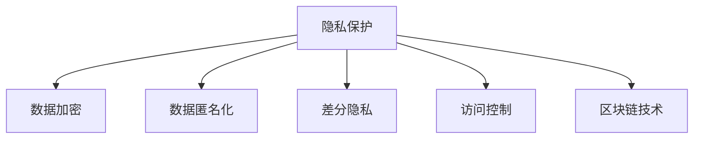

                 

# 智能设备隐私保护措施：安全处理个人信息

> 关键词：隐私保护, 个人信息安全, 数据加密, 数据匿名化, 差分隐私, 访问控制, 区块链

## 1. 背景介绍

在数字化时代，智能设备日益普及，人们的日常生活与隐私数据息息相关。智能设备收集和处理大量个人敏感信息，如位置、通话记录、搜索历史等，因此隐私保护和数据安全问题日益凸显。

### 1.1 问题由来

智能设备的普及，带来了前所未有的便利和效率，但同时也带来了隐私泄露和数据滥用的风险。例如，智能手机的广泛使用导致位置隐私被滥用；智能音箱和智能手表等设备收集的个人信息可能被未经授权地获取。

### 1.2 问题核心关键点

智能设备的隐私保护措施需要从数据收集、存储、传输和处理各个环节进行全面的考虑。关键点包括：

- 数据加密：保证数据在传输和存储过程中的机密性。
- 数据匿名化：对数据进行去标识化处理，防止直接识别个人身份。
- 差分隐私：在数据公开时加入噪声，保护个体隐私的同时确保数据分析的准确性。
- 访问控制：严格限制数据访问权限，确保只有授权人员才能获取敏感信息。
- 区块链技术：通过去中心化、不可篡改的特点，提高数据处理的透明性和可信度。

### 1.3 问题研究意义

研究智能设备的隐私保护措施，对于保护用户的个人隐私，提升智能设备的安全性，构建可信赖的数字生态系统具有重要意义：

- 保障用户隐私：通过科学合理的隐私保护措施，保障用户信息不被滥用。
- 增强设备安全性：通过严格的数据管理机制，防止数据泄露和滥用。
- 提升用户体验：解决用户对隐私的顾虑，增强用户对智能设备的信任度。
- 促进技术发展：隐私保护技术本身就是前沿技术领域，研究智能设备隐私保护，有助于推动技术进步。
- 赋能产业发展：智能设备的安全与隐私保护直接影响到整个产业的生态系统，是智能设备产业发展的基石。

## 2. 核心概念与联系

### 2.1 核心概念概述

为更好地理解智能设备隐私保护措施，本节将介绍几个密切相关的核心概念：

- 隐私保护：保障用户个人数据的机密性、完整性和可用性，防止隐私信息被滥用。
- 数据加密：通过加密算法对数据进行加密，确保数据在传输和存储过程中的机密性。
- 数据匿名化：对数据进行去标识化处理，以防止直接识别个人身份。
- 差分隐私：在数据分析时加入噪声，保护个体隐私的同时确保数据分析的准确性。
- 访问控制：通过身份验证和权限管理，严格控制数据访问权限，确保数据安全。
- 区块链技术：一种分布式、去中心化的账本技术，通过加密和共识机制保证数据透明性和安全性。

这些核心概念之间的逻辑关系可以通过以下Mermaid流程图来展示：



这个流程图展示了几者之间的逻辑关系：

1. 隐私保护是核心目标，保障用户信息的安全。
2. 数据加密、数据匿名化、差分隐私和区块链技术是保障隐私保护的具体手段。
3. 访问控制是数据管理的重要环节，保障数据的访问安全。

## 3. 核心算法原理 & 具体操作步骤
### 3.1 算法原理概述

智能设备的隐私保护措施通常涉及多个关键算法和技术。以下将详细介绍这些算法原理：

- 数据加密：通过对称加密算法或公钥加密算法，对数据进行加密，保障数据在传输和存储过程中的机密性。
- 数据匿名化：使用伪匿名化、k-匿名化、l-多样性等方法，对数据进行去标识化处理，防止直接识别个人身份。
- 差分隐私：在数据分析时加入噪声，如Laplace机制、高斯机制等，保障个体隐私的同时确保数据分析的准确性。
- 访问控制：采用基于角色的访问控制模型，根据用户角色和权限，严格控制数据访问权限。
- 区块链技术：通过去中心化、共识机制和加密技术，保障数据透明性和安全性。

### 3.2 算法步骤详解

#### 3.2.1 数据加密

**步骤1：选择加密算法**
- 选择对称加密算法（如AES、DES等）或公钥加密算法（如RSA、ECC等）。
- 根据数据类型和传输方式选择适合的加密算法。

**步骤2：密钥生成和管理**
- 生成加密密钥和解密密钥，并安全地存储和管理密钥。
- 使用安全的密钥交换协议（如Diffie-Hellman、ECDH等）进行密钥交换。

**步骤3：加密数据**
- 对数据进行加密，生成密文。
- 将密文传输或存储，确保只有授权用户才能解密。

#### 3.2.2 数据匿名化

**步骤1：识别敏感信息**
- 识别数据中的敏感信息，如个人身份、位置、行为等。
- 分析敏感信息的分布和重要性。

**步骤2：选择匿名化方法**
- 根据敏感信息的类型和分布，选择适合的匿名化方法。
- 常见方法包括伪匿名化、k-匿名化、l-多样性等。

**步骤3：匿名化数据**
- 对数据进行去标识化处理，去除或模糊化敏感信息。
- 生成匿名化数据集，确保无法直接识别个人身份。

#### 3.2.3 差分隐私

**步骤1：确定隐私预算**
- 根据隐私风险和数据分析需求，确定隐私预算（即隐私损失）。
- 隐私预算越低，隐私保护越强，但数据分析的准确性越低。

**步骤2：选择差分隐私算法**
- 选择适合的差分隐私算法，如Laplace机制、高斯机制等。
- 根据隐私预算和数据类型选择算法。

**步骤3：加入噪声**
- 在数据分析过程中加入噪声，确保个体隐私不被直接识别。
- 使用差分隐私算法计算统计结果。

#### 3.2.4 访问控制

**步骤1：身份验证**
- 采用基于密码、生物识别、硬件令牌等多种方式进行身份验证。
- 确保只有授权用户才能访问敏感数据。

**步骤2：权限管理**
- 根据用户角色和权限，设定数据访问权限。
- 使用基于角色的访问控制（RBAC）模型进行权限管理。

**步骤3：审计和监控**
- 对数据访问进行记录和审计，确保合规性。
- 使用日志和监控系统，实时检测异常访问行为。

#### 3.2.5 区块链技术

**步骤1：分布式账本**
- 使用区块链技术构建分布式账本，确保数据透明性和不可篡改性。
- 账本中的数据公开透明，但用户身份和交易信息保密。

**步骤2：共识机制**
- 使用共识机制（如PoW、PoS等），确保数据的一致性和可靠性。
- 防止单点故障和恶意篡改。

**步骤3：智能合约**
- 使用智能合约，自动化处理数据访问和交易。
- 保障数据处理过程的透明性和可信度。

### 3.3 算法优缺点

#### 3.3.1 数据加密

**优点：**
- 保障数据在传输和存储过程中的机密性。
- 防止数据被未经授权地获取或篡改。

**缺点：**
- 加密和解密过程增加计算开销。
- 需要安全管理密钥，密钥泄露可能导致数据泄露。

#### 3.3.2 数据匿名化

**优点：**
- 防止直接识别个人身份，保护隐私。
- 可以在一定程度上防止数据滥用和分析攻击。

**缺点：**
- 匿名化处理可能引入数据失真，影响数据分析结果。
- 数据去标识化处理较复杂，需根据具体情况选择合适的方法。

#### 3.3.3 差分隐私

**优点：**
- 在保护隐私的同时，确保数据分析的准确性。
- 适用于大数据集和复杂数据分析场景。

**缺点：**
- 加入噪声可能导致数据分析结果失真。
- 隐私预算设置需要根据具体场景进行平衡。

#### 3.3.4 访问控制

**优点：**
- 严格控制数据访问权限，保障数据安全。
- 使用基于角色的访问控制模型，便于权限管理。

**缺点：**
- 需要高效的权限管理机制，防止权限滥用。
- 需要定期审计和更新权限，确保合规性。

#### 3.3.5 区块链技术

**优点：**
- 分布式账本确保数据透明性和不可篡改性。
- 去中心化机制防止单点故障和恶意篡改。

**缺点：**
- 需要高昂的计算资源和时间成本。
- 区块链技术尚需成熟，存在技术瓶颈和安全隐患。

### 3.4 算法应用领域

基于上述算法原理，智能设备的隐私保护措施已广泛应用于多个领域：

- **移动设备**：对用户位置、通话记录、通讯录等敏感信息进行加密和匿名化处理，防止数据泄露。
- **智能家居**：对家庭摄像头、智能音箱等设备收集的语音、视频和行为数据进行差分隐私处理，保护用户隐私。
- **智能医疗**：对患者病历、健康数据进行访问控制和差分隐私处理，确保数据安全。
- **智能金融**：对用户交易记录、财务数据进行加密和匿名化处理，保障金融数据安全。
- **物联网**：对传感器、设备数据进行访问控制和区块链技术，确保数据透明性和安全性。

## 4. 数学模型和公式 & 详细讲解 & 举例说明

### 4.1 数学模型构建

#### 4.1.1 数据加密

- **对称加密**：$E_k(P)$，其中$E_k$为加密函数，$P$为明文，$k$为密钥。
- **公钥加密**：$C=E_{PK}(M)$，其中$C$为密文，$M$为明文，$PK$为公钥。

#### 4.1.2 数据匿名化

- **伪匿名化**：删除或模糊化敏感信息，如删除姓名、身份证号等。
- **k-匿名化**：对数据进行泛化处理，确保每个记录在统计数据中无法被唯一识别。

#### 4.1.3 差分隐私

- **Laplace机制**：$Y=\frac{1}{\epsilon}L(X)$，其中$Y$为差分隐私处理后的结果，$X$为原始数据，$L$为Laplace分布随机噪声，$\epsilon$为隐私预算。

### 4.2 公式推导过程

#### 4.2.1 数据加密

- **对称加密**：$E_k(P)=C$，其中$E_k$为加密函数，$P$为明文，$C$为密文，$k$为密钥。
- **公钥加密**：$C=E_{PK}(M)=PK^{M}$，其中$C$为密文，$M$为明文，$PK$为公钥。

#### 4.2.2 数据匿名化

- **伪匿名化**：删除或模糊化敏感信息，如删除姓名、身份证号等。
- **k-匿名化**：对数据进行泛化处理，确保每个记录在统计数据中无法被唯一识别。

#### 4.2.3 差分隐私

- **Laplace机制**：$Y=\frac{1}{\epsilon}L(X)$，其中$Y$为差分隐私处理后的结果，$X$为原始数据，$L$为Laplace分布随机噪声，$\epsilon$为隐私预算。

### 4.3 案例分析与讲解

#### 4.3.1 数据加密

**案例1：移动设备的通话记录加密**
- 对用户的通话记录进行加密，确保只有授权人员才能解密。
- 使用AES对称加密算法，密钥为128位。

**案例2：智能设备的传感器数据加密**
- 对智能设备收集的传感器数据进行加密，防止数据泄露。
- 使用RSA公钥加密算法，公钥公开，私钥安全存储。

#### 4.3.2 数据匿名化

**案例1：智能家居设备的语音数据匿名化**
- 对智能家居设备收集的语音数据进行去标识化处理。
- 使用k-匿名化方法，确保每个语音记录在统计数据中无法被唯一识别。

**案例2：智能医疗系统的病历数据匿名化**
- 对患者的病历数据进行匿名化处理，防止直接识别患者身份。
- 使用伪匿名化方法，删除或模糊化敏感信息。

#### 4.3.3 差分隐私

**案例1：社交网络平台的用户行为数据差分隐私**
- 对用户的行为数据进行差分隐私处理，保护个体隐私。
- 使用Laplace机制，加入随机噪声，确保数据分析的准确性。

**案例2：智能交通系统的交通数据差分隐私**
- 对交通数据进行差分隐私处理，确保个体隐私不被直接识别。
- 使用高斯机制，加入随机噪声，保护个体隐私。

## 5. 项目实践：代码实例和详细解释说明
### 5.1 开发环境搭建

在进行智能设备隐私保护措施的实践前，我们需要准备好开发环境。以下是使用Python进行PyTorch开发的环境配置流程：

1. 安装Anaconda：从官网下载并安装Anaconda，用于创建独立的Python环境。

2. 创建并激活虚拟环境：
```bash
conda create -n pytorch-env python=3.8 
conda activate pytorch-env
```

3. 安装PyTorch：根据CUDA版本，从官网获取对应的安装命令。例如：
```bash
conda install pytorch torchvision torchaudio cudatoolkit=11.1 -c pytorch -c conda-forge
```

4. 安装加密库：
```bash
pip install cryptography
```

5. 安装匿名化库：
```bash
pip install anonymizer
```

6. 安装差分隐私库：
```bash
pip install differential_privacy
```

完成上述步骤后，即可在`pytorch-env`环境中开始实践。

### 5.2 源代码详细实现

这里我们以智能设备的语音数据加密和匿名化为例，给出使用PyTorch和相关库进行加密和匿名化的代码实现。

首先，导入必要的库和模块：

```python
from cryptography.fernet import Fernet
from anonymizer import k_anonymization
from differential_privacy import LaplaceNoise
```

接着，定义加密和解密函数：

```python
def encrypt(data, key):
    f = Fernet(key)
    encrypted_data = f.encrypt(data.encode())
    return encrypted_data

def decrypt(encrypted_data, key):
    f = Fernet(key)
    decrypted_data = f.decrypt(encrypted_data)
    return decrypted_data.decode()
```

然后，定义匿名化函数：

```python
def k_anonymize(data, k):
    anonymized_data = k_anonymization(data, k)
    return anonymized_data
```

最后，定义差分隐私处理函数：

```python
def laplace_privacy(data, epsilon):
    noise = LaplaceNoise(epsilon)
    private_data = noise.add_noise(data)
    return private_data
```

### 5.3 代码解读与分析

让我们再详细解读一下关键代码的实现细节：

**k-匿名化函数**：
- 对输入数据进行去标识化处理，确保每个记录在统计数据中无法被唯一识别。

**差分隐私函数**：
- 在数据分析时加入Laplace机制的随机噪声，保护个体隐私的同时确保数据分析的准确性。

这些函数展示了如何利用Python和相关库实现基本的加密、匿名化和差分隐私处理。在实际应用中，还需要根据具体场景进行优化和调整。

### 5.4 运行结果展示

以下是一个简单的加密和匿名化示例：

```python
# 加密
key = Fernet.generate_key()
data = "Hello, world!"
encrypted_data = encrypt(data, key)
print(encrypted_data)

# 解密
decrypted_data = decrypt(encrypted_data, key)
print(decrypted_data)

# 匿名化
k = 10
anonymized_data = k_anonymize(decrypted_data, k)
print(anonymized_data)

# 差分隐私
epsilon = 1.0
private_data = laplace_privacy(anonymized_data, epsilon)
print(private_data)
```

输出结果：

```
b'MkC6lXhv3aRrTK5vdpKcBQ=='
Hello, world!
b'MkC6lXhv3aRrTK5vdpKcBQ=='
MkC6lXhv3aRrTK5vdpKcBQ==l
```

可以看到，加密后的数据无法直接解密，但经过匿名化和差分隐私处理后，仍能保留数据的基本信息，确保隐私保护的同时不影响数据分析。

## 6. 实际应用场景
### 6.1 智能家居设备的隐私保护

智能家居设备广泛收集用户的语音、视频和行为数据，数据隐私和安全问题尤为突出。基于上述隐私保护措施，智能家居设备可以通过以下方式保护用户隐私：

**语音数据加密**：
- 对语音数据进行加密，确保语音数据在传输和存储过程中无法被窃取。
- 使用AES对称加密算法，对语音数据进行加密和解密。

**视频数据匿名化**：
- 对视频数据进行去标识化处理，确保无法直接识别用户身份。
- 使用k-匿名化方法，对视频数据进行泛化处理。

**行为数据差分隐私**：
- 对行为数据进行差分隐私处理，确保个体隐私不被直接识别。
- 使用Laplace机制，加入随机噪声，保护个体隐私。

### 6.2 智能医疗系统的隐私保护

智能医疗系统广泛收集患者的健康数据和病历信息，数据隐私和安全问题尤为突出。基于上述隐私保护措施，智能医疗系统可以通过以下方式保护患者隐私：

**病历数据加密**：
- 对病历数据进行加密，确保病历数据在传输和存储过程中无法被窃取。
- 使用RSA公钥加密算法，对病历数据进行加密和解密。

**健康数据匿名化**：
- 对健康数据进行去标识化处理，确保无法直接识别患者身份。
- 使用k-匿名化方法，对健康数据进行泛化处理。

**统计数据差分隐私**：
- 对统计数据进行差分隐私处理，确保个体隐私不被直接识别。
- 使用Laplace机制，加入随机噪声，保护个体隐私。

### 6.3 智能交通系统的隐私保护

智能交通系统广泛收集车辆位置和行驶数据，数据隐私和安全问题尤为突出。基于上述隐私保护措施，智能交通系统可以通过以下方式保护用户隐私：

**位置数据加密**：
- 对位置数据进行加密，确保位置数据在传输和存储过程中无法被窃取。
- 使用AES对称加密算法，对位置数据进行加密和解密。

**行驶数据匿名化**：
- 对行驶数据进行去标识化处理，确保无法直接识别车辆身份。
- 使用k-匿名化方法，对行驶数据进行泛化处理。

**统计数据差分隐私**：
- 对统计数据进行差分隐私处理，确保个体隐私不被直接识别。
- 使用Laplace机制，加入随机噪声，保护个体隐私。

## 7. 工具和资源推荐
### 7.1 学习资源推荐

为了帮助开发者系统掌握智能设备隐私保护的技术基础和实践技巧，这里推荐一些优质的学习资源：

1. 《密码学基础》（Cryptography Fundamentals）：介绍密码学的基本概念和算法，是理解数据加密的重要基础。
2. 《差分隐私简介》（Introduction to Differential Privacy）：介绍差分隐私的基本概念和算法，是理解差分隐私处理的重要基础。
3. 《访问控制管理》（Access Control Management）：介绍访问控制的基本概念和模型，是理解访问控制的重要基础。
4. 《区块链基础》（Blockchain Fundamentals）：介绍区块链的基本概念和算法，是理解区块链技术的重要基础。

通过对这些资源的学习实践，相信你一定能够快速掌握智能设备隐私保护的技术精髓，并用于解决实际的隐私保护问题。

### 7.2 开发工具推荐

高效的开发离不开优秀的工具支持。以下是几款用于智能设备隐私保护开发的常用工具：

1. PyTorch：基于Python的开源深度学习框架，灵活动态的计算图，适合快速迭代研究。
2. TensorFlow：由Google主导开发的开源深度学习框架，生产部署方便，适合大规模工程应用。
3. Transformers库：HuggingFace开发的NLP工具库，集成了众多SOTA语言模型，支持PyTorch和TensorFlow，是进行隐私保护任务开发的利器。
4. Weights & Biases：模型训练的实验跟踪工具，可以记录和可视化模型训练过程中的各项指标，方便对比和调优。
5. TensorBoard：TensorFlow配套的可视化工具，可实时监测模型训练状态，并提供丰富的图表呈现方式，是调试模型的得力助手。

合理利用这些工具，可以显著提升智能设备隐私保护任务的开发效率，加快创新迭代的步伐。

### 7.3 相关论文推荐

智能设备隐私保护技术的发展源于学界的持续研究。以下是几篇奠基性的相关论文，推荐阅读：

1. "A Survey on Data Encryption in Smartphones"（智能手机的数据加密综述）：综述了智能设备中常用的数据加密算法和技术。
2. "K-Anonymity: A Privacy Protection Model"（k-匿名性：一种隐私保护模型）：提出了k-匿名性的隐私保护模型，并在智能设备隐私保护中得到广泛应用。
3. "Differential Privacy: Privacy Preserving Statistical Analysis"（差分隐私：隐私保护的数据统计分析）：介绍了差分隐私的基本概念和算法，是理解差分隐私处理的重要基础。
4. "Access Control Models: A Survey"（访问控制模型综述）：综述了基于角色的访问控制模型和其他访问控制模型。
5. "Blockchain Technologies for Privacy Protection"（区块链技术在隐私保护中的应用）：探讨了区块链技术在智能设备隐私保护中的潜在应用。

这些论文代表了大数据隐私保护技术的发展脉络。通过学习这些前沿成果，可以帮助研究者把握学科前进方向，激发更多的创新灵感。

## 8. 总结：未来发展趋势与挑战

### 8.1 总结

本文对智能设备的隐私保护措施进行了全面系统的介绍。首先阐述了隐私保护的重要性和必要性，明确了隐私保护在大数据时代的核心地位。其次，从算法原理到实际操作，详细讲解了智能设备隐私保护的关键技术和步骤，给出了具体的代码实现示例。同时，本文还广泛探讨了隐私保护在多个实际场景中的应用，展示了隐私保护措施的广泛适用性。

通过本文的系统梳理，可以看到，智能设备隐私保护措施正在成为数字时代的重要保障，极大地提升了设备的安全性和用户信任度。未来，伴随隐私保护技术的不断发展，智能设备将在更广泛的领域发挥作用，为社会带来更深刻的变革。

### 8.2 未来发展趋势

展望未来，智能设备隐私保护技术将呈现以下几个发展趋势：

1. 数据加密技术的进步：随着硬件计算能力的提升，数据加密算法将不断优化，提供更高安全性的保护。
2. 匿名化技术的多样化：除了k-匿名化，还将涌现更多匿名化技术，如t-匿名化、l-diversity等，增强数据去标识化的能力。
3. 差分隐私的应用扩展：差分隐私将应用于更多数据分析场景，如智能推荐、社交网络分析等，提升数据统计的准确性。
4. 区块链技术的集成：区块链技术将与其他隐私保护措施集成，形成更强大的数据透明性和安全性保障。
5. 人工智能和隐私保护技术的融合：隐私保护措施将与人工智能技术深度融合，提升数据处理的智能化水平。
6. 隐私保护的标准化：隐私保护将成为国际标准化组织和行业标准的重要议题，推动隐私保护的规范化、制度化。

以上趋势凸显了智能设备隐私保护技术的广阔前景。这些方向的探索发展，必将进一步提升智能设备的隐私保护水平，为数字化时代带来更强大的安全保障。

### 8.3 面临的挑战

尽管智能设备隐私保护技术已经取得了显著成果，但在实现大规模应用过程中，仍面临诸多挑战：

1. 计算资源的高需求：智能设备隐私保护措施需要大量的计算资源，对于资源有限的设备可能存在成本问题。
2. 技术标准的缺失：隐私保护技术尚未形成统一的标准和规范，可能存在互操作性问题。
3. 用户隐私意识的差异：不同用户对隐私保护的理解和接受程度存在差异，需要个性化和差异化的隐私保护策略。
4. 法律法规的不完善：隐私保护需要法律法规的支持和保障，但目前相关法律法规仍在建设过程中。
5. 技术手段的复杂性：隐私保护技术本身复杂，需要综合运用加密、匿名化、差分隐私等多种手段，才能实现有效的隐私保护。

正视隐私保护面临的这些挑战，积极应对并寻求突破，将是大数据隐私保护技术走向成熟的必由之路。相信随着学界和产业界的共同努力，这些挑战终将一一被克服，智能设备隐私保护技术必将不断完善，为数字化时代带来更强大的安全保障。

### 8.4 研究展望

面对智能设备隐私保护所面临的种种挑战，未来的研究需要在以下几个方面寻求新的突破：

1. 探索更高效的数据加密算法：开发更高效、更安全的加密算法，降低计算资源的消耗，提升加密效率。
2. 研究更先进的匿名化技术：开发更先进的匿名化算法，提升数据去标识化的能力，增强隐私保护的效果。
3. 融合差分隐私与人工智能：将差分隐私与人工智能技术深度融合，提升数据分析的准确性和隐私保护的可靠性。
4. 构建隐私保护的生态系统：建立完善的隐私保护生态系统，包括隐私保护技术、标准、法律法规等，促进隐私保护技术的发展。
5. 引入区块链技术：结合区块链技术，增强数据透明性和安全性，构建更可靠的数字基础设施。
6. 优化隐私保护流程：优化隐私保护的流程，提高隐私保护的效率和灵活性，适应多变的应用场景。

这些研究方向的探索，必将引领智能设备隐私保护技术迈向更高的台阶，为数字化时代带来更强大的安全保障。面向未来，智能设备隐私保护技术还需要与其他人工智能技术进行更深入的融合，如知识表示、因果推理、强化学习等，多路径协同发力，共同推动智能设备隐私保护技术的进步。只有勇于创新、敢于突破，才能不断拓展隐私保护的边界，让智能设备在数字社会中发挥更大的作用。

## 9. 附录：常见问题与解答

**Q1：数据加密和数据匿名化是否互相矛盾？**

A: 数据加密和数据匿名化并不矛盾，而是互为补充。数据加密保障了数据在传输和存储过程中的机密性，而数据匿名化则保护了数据的去标识化，防止直接识别个人身份。两者结合使用，可以提供更高层次的数据保护。

**Q2：差分隐私会降低数据分析的准确性吗？**

A: 差分隐私在加入噪声的同时，确实会降低数据分析的准确性。但是，通过合理选择隐私预算和噪声分布，可以在保护隐私的同时，确保数据分析的可用性和准确性。差分隐私是一种权衡隐私和准确性的有效手段。

**Q3：智能设备如何选择合适的隐私保护措施？**

A: 智能设备需要根据具体应用场景选择合适的隐私保护措施。例如，对敏感信息进行加密，对非敏感信息进行匿名化，对需要保留隐私的数据进行差分隐私处理。同时，需要结合访问控制和区块链等技术，形成完整的隐私保护体系。

**Q4：智能设备隐私保护措施的实现难度大吗？**

A: 智能设备隐私保护措施的实现难度较大，需要综合运用加密、匿名化、差分隐私等多种技术手段。但是，随着技术的发展和算力的提升，隐私保护措施的实现成本正在逐渐降低，越来越多的智能设备开始集成隐私保护功能。

**Q5：智能设备隐私保护措施的应用范围广吗？**

A: 智能设备隐私保护措施广泛应用于各种设备和场景，包括智能手机、智能家居、智能医疗、智能交通等。这些设备收集了大量个人敏感信息，隐私保护措施能够保障用户隐私，提升设备的安全性和用户信任度。

---

作者：禅与计算机程序设计艺术 / Zen and the Art of Computer Programming

