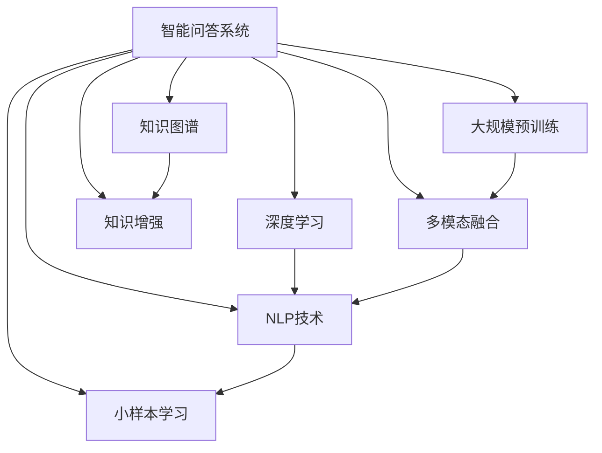

                 

# 智能问答系统的发展趋势

> 关键词：智能问答系统,深度学习,自然语言处理,语音识别,知识图谱,多模态融合,大规模预训练,小样本学习

## 1. 背景介绍

随着人工智能技术的飞速发展，智能问答系统(AI Q&A System)已逐渐成为各行各业用户获取信息的重要工具。从早期基于规则的专家系统到如今的深度学习驱动的端到端系统，智能问答系统已经在医疗、教育、金融、电商等多个领域大放异彩。

智能问答系统的核心目标是通过用户输入的自然语言问题，快速准确地输出相关答案，帮助用户解决问题，提升效率。不同于传统搜索引擎的简单匹配，智能问答系统能够理解问题的语义背景，把握用户的真实需求，从而提供更具针对性和智能化的回答。

本博客将系统梳理智能问答系统的最新进展，特别是深度学习、自然语言处理(NLP)、知识图谱(KG)、语音识别、多模态融合等领域的研究成果，深入分析该技术的未来发展趋势与挑战，并给出实用的技术建议和应用展望。

## 2. 核心概念与联系

### 2.1 核心概念概述

为更好地理解智能问答系统的核心技术，本节将介绍几个关键概念：

- **智能问答系统(AI Q&A System)**：以深度学习模型为驱动的自动问答系统，具备理解自然语言输入、推理和生成答案的能力。
- **深度学习(Deep Learning)**：一种基于神经网络的机器学习方法，通过多个层次的抽象和特征提取，构建强大的模型表示能力。
- **自然语言处理(Natural Language Processing, NLP)**：研究如何让计算机理解和生成人类自然语言的技术，包括语言理解、文本分类、信息抽取、问答等。
- **知识图谱(Knowledge Graph)**：一种结构化的语义知识表示方式，以图的形式构建实体和关系网络，支持复杂推理。
- **多模态融合(Multimodal Fusion)**：结合文本、语音、图像等多种信息源，构建更全面、精准的智能问答系统。
- **大规模预训练(Pre-training on Massive Data)**：指在大规模无标签数据上进行自监督预训练，提升模型泛化能力和表示质量。
- **小样本学习(Few-shot Learning)**：在仅有少量标注样本的情况下，模型能够快速学习新任务的能力。
- **知识增强(Knowledge-enhanced)**：将先验知识(如知识图谱、规则库)与模型相结合，提升智能问答的准确性和鲁棒性。

这些概念之间的逻辑关系可以通过以下Mermaid流程图来展示：



这个流程图展示了一个典型的智能问答系统框架，其核心在于深度学习和NLP技术，同时融合了知识图谱、多模态融合等先进技术，辅以大规模预训练和小样本学习等优化手段，最终构建出智能、高效、可解释的问答系统。

## 3. 核心算法原理 & 具体操作步骤

### 3.1 算法原理概述

智能问答系统的核心算法原理包括深度学习模型架构、自然语言理解与生成、知识图谱推理等。其整体流程可以大致分为三个步骤：

1. **自然语言理解(NLU)**：将用户输入的文本转化为结构化表示，便于模型处理。
2. **问答模型(QA Model)**：根据输入问题和已有的知识库，生成候选答案。
3. **自然语言生成(NLG)**：将候选答案转换为自然语言文本输出。

具体来说，深度学习模型（如Transformer、BERT等）被广泛应用于问答系统的各个环节，包括语言模型、向量表示、推理引擎等。

### 3.2 算法步骤详解

智能问答系统的实现通常包括以下关键步骤：

**Step 1: 数据准备与预处理**
- 收集和标注智能问答系统的训练数据，包括问题-答案对、问答知识库等。
- 进行数据清洗和预处理，包括分词、去停用词、构建词汇表等。

**Step 2: 模型训练与微调**
- 选择合适的深度学习模型作为基础架构，如BERT、GPT等。
- 在预训练语料上进行大规模预训练，提升模型的泛化能力和表示质量。
- 根据具体任务，在标注数据集上进行微调，优化模型的任务特定性能。

**Step 3: 推理与生成**
- 对于新的输入问题，通过模型推理得到相应的答案。
- 根据推理结果，使用NLG技术将答案转换为自然语言文本。

### 3.3 算法优缺点

智能问答系统具有以下优点：

1. **高效响应**：基于深度学习模型的智能问答系统能够快速处理和响应自然语言输入。
2. **高度定制**：通过微调，智能问答系统可以针对特定领域或任务进行优化，具备高度定制化的能力。
3. **多模态融合**：结合文本、语音、图像等多种信息源，提供更全面、精准的智能问答。

然而，智能问答系统也存在以下局限：

1. **依赖标注数据**：高质量的标注数据对于系统的训练和微调至关重要，标注成本较高。
2. **过拟合风险**：如果训练数据有限，模型可能过拟合，泛化性能不佳。
3. **模型复杂度**：深度学习模型的复杂度较高，计算和存储成本较大。
4. **可解释性不足**：深度学习模型的内部机制难以解释，难以提供透明的推理过程。
5. **数据隐私问题**：处理用户的自然语言输入和回答，涉及数据隐私保护问题。

### 3.4 算法应用领域

智能问答系统已经在多个领域得到广泛应用，包括但不限于：

- **医疗健康**：提供疾病诊断、用药咨询、健康知识查询等服务。
- **金融保险**：提供财经资讯、投资理财、保险理赔等服务。
- **教育培训**：提供课程解答、作业批改、学习资源推荐等服务。
- **智能客服**：提供24小时在线客服、自动回复、智能导航等服务。
- **电子商务**：提供商品信息查询、价格对比、购物建议等服务。

## 4. 数学模型和公式 & 详细讲解 & 举例说明

### 4.1 数学模型构建

智能问答系统通常采用Transformer模型，结合自回归(如GPT)或自编码(如BERT)结构，用于处理自然语言输入和生成输出。

**模型架构**：
- **编码器**：负责对输入文本进行编码，生成高维表示。
- **解码器**：根据编码器输出的表示和任务目标，生成答案文本。
- **多头注意力机制(MHA)**：实现信息的跨层和跨位置传递，增强模型的表示能力。

**损失函数**：
- 对于文本匹配任务，使用交叉熵损失函数。
- 对于生成任务，使用负对数似然损失函数。

**优化算法**：
- 通常使用Adam优化器，结合L2正则化和Dropout技术，避免过拟合。

### 4.2 公式推导过程

以BERT模型为例，其基本架构如图：


模型输入为一个词序列$X$，输出为一个向量表示$H$。BERT通过预训练学习到语言表示，微调时在此基础上进行优化。

假设问题表示为$Q$，答案表示为$A$，则可以使用以下公式进行训练：

$$
\min_{\theta} \sum_{i=1}^N \ell(Q_i, A_i; H_i)
$$

其中$\ell$为损失函数，$H_i$为模型在输入$i$上的表示，$Q_i, A_i$分别为问题$i$和答案$i$的表示。

### 4.3 案例分析与讲解

**案例一：基于BERT的问答系统**
- **模型架构**：使用BERT作为编码器，加入线性分类器作为解码器，进行文本匹配。
- **训练过程**：在问答对数据集上进行微调，优化分类器参数。
- **效果评估**：使用准确率、F1-score等指标评估模型效果。

**案例二：基于GPT的对话系统**
- **模型架构**：使用GPT作为编码器和解码器，采用自回归方式生成回答。
- **训练过程**：在对话数据集上进行微调，优化解码器参数。
- **效果评估**：使用BLEU、ROUGE等指标评估对话系统的生成质量。

## 5. 项目实践：代码实例和详细解释说明

### 5.1 开发环境搭建

在进行智能问答系统的开发前，需要准备好开发环境。以下是使用Python进行TensorFlow和PyTorch开发的常见环境配置流程：

1. 安装Anaconda：从官网下载并安装Anaconda，用于创建独立的Python环境。
2. 创建并激活虚拟环境：
```bash
conda create -n pytorch-env python=3.8 
conda activate pytorch-env
```

3. 安装TensorFlow和PyTorch：根据CUDA版本，从官网获取对应的安装命令。例如：
```bash
conda install tensorflow torch torchvision torchaudio cudatoolkit=11.1 -c pytorch -c conda-forge
```

4. 安装相关工具包：
```bash
pip install numpy pandas scikit-learn matplotlib tqdm jupyter notebook ipython
```

完成上述步骤后，即可在`pytorch-env`环境中开始智能问答系统的开发。

### 5.2 源代码详细实现

这里以基于BERT的问答系统为例，给出使用TensorFlow进行实现的代码实现。

**数据预处理**
```python
from tensorflow.keras.preprocessing.text import Tokenizer
from tensorflow.keras.preprocessing.sequence import pad_sequences

# 加载数据集
with open('qa_dataset.txt', 'r') as f:
    data = [line.strip().split('\t') for line in f]

# 将数据集分为问题和答案
questions, answers = zip(*data)

# 将问题序列化
tokenizer = Tokenizer(char_level=True)
tokenizer.fit_on_texts(questions)
sequences = tokenizer.texts_to_sequences(questions)

# 对答案进行padding
max_len = max(len(sequence) for sequence in sequences)
padded_sequences = pad_sequences(sequences, maxlen=max_len, padding='post', truncating='post')
```

**模型定义**
```python
import tensorflow as tf
from tensorflow.keras.layers import Input, Embedding, Dropout, Dense
from tensorflow.keras.models import Model

# 定义模型输入
input_seq = Input(shape=(max_len,))

# 嵌入层
embedding = Embedding(input_dim=len(tokenizer.word_index) + 1, output_dim=128, input_length=max_len)
embedding_output = embedding(input_seq)

# 添加Dropout层
dropout = Dropout(0.5)
dropout_output = dropout(embedding_output)

# 连接全连接层
dense = Dense(128, activation='relu')
dense_output = dense(dropout_output)

# 连接线性分类层
output = Dense(1, activation='sigmoid')
output_output = output(dense_output)

# 定义模型
model = Model(input_seq, output_output)
model.compile(loss='binary_crossentropy', optimizer='adam', metrics=['accuracy'])
```

**模型训练**
```python
# 划分训练集和验证集
train_data, dev_data = train_test_split(padded_sequences, answers, test_size=0.2)

# 训练模型
model.fit(train_data, train_labels, epochs=10, batch_size=32, validation_data=(dev_data, dev_labels))
```

**模型评估**
```python
# 在测试集上评估模型
test_data, test_labels = test_data, test_labels
test_preds = model.predict(test_data)
print('Accuracy:', accuracy_score(test_labels, test_preds))
```

以上就是使用TensorFlow进行智能问答系统开发的完整代码实现。可以看到，基于BERT的问答系统模型相对简洁，易于实现和调试。

### 5.3 代码解读与分析

**代码解析**
- 数据预处理：使用`Tokenizer`将问题序列化，使用`pad_sequences`进行padding。
- 模型定义：通过`Input`定义模型输入，使用`Embedding`层进行嵌入，`Dropout`层避免过拟合，`Dense`层进行特征提取，`Dense`层进行分类。
- 模型训练：使用`fit`函数训练模型，`accuracy`作为评估指标。
- 模型评估：使用`predict`函数进行推理预测，并使用`accuracy_score`计算准确率。

**性能优化**
- 批处理大小：`batch_size`参数影响模型训练速度，应根据计算资源和模型大小选择适当大小。
- 学习率：`learning_rate`参数影响模型收敛速度，应根据数据量和模型复杂度进行调整。
- 正则化：通过添加`Dropout`层或使用L2正则化，防止模型过拟合。
- 早停策略：`EarlyStopping`回调函数可防止模型过拟合，当验证集性能不再提升时停止训练。

## 6. 实际应用场景

### 6.1 医疗健康

在医疗健康领域，智能问答系统可以通过自然语言处理技术，快速解答患者咨询，提升医疗服务效率。具体应用包括：

- **疾病咨询**：自动解答患者的疾病疑问，提供初步诊断建议。
- **用药咨询**：根据患者症状，推荐合适的药物和治疗方案。
- **健康知识查询**：提供全面的健康知识和科普信息，帮助用户保持健康。

例如，某医院引入智能问答系统，通过问答机器人帮助患者在线解答健康问题，取得了良好的效果。系统不仅能快速响应患者咨询，还能根据患者病情提供个性化建议，大大提升了医疗服务效率和患者满意度。

### 6.2 金融保险

在金融保险领域，智能问答系统可以提供财经资讯、投资理财、保险理赔等服务，提升客户体验。具体应用包括：

- **财经资讯**：提供实时股票行情、新闻摘要、市场分析等财经信息。
- **投资理财**：根据用户风险偏好，推荐合适的投资产品和理财方案。
- **保险理赔**：自动解答用户的理赔疑问，提供理赔流程和条件。

例如，某金融公司开发智能问答系统，帮助客户解答保险理赔相关问题，提高了理赔处理速度和准确性。系统通过自然语言理解技术，快速定位用户需求，结合知识库中的理赔规则，生成准确的理赔建议，大大缩短了理赔处理时间。

### 6.3 教育培训

在教育培训领域，智能问答系统可以提供课程解答、作业批改、学习资源推荐等服务，促进个性化学习和知识共享。具体应用包括：

- **课程解答**：自动解答学生的学习疑问，提供知识点的解释和补充。
- **作业批改**：根据作业内容，自动评估学生答案，生成批改反馈。
- **学习资源推荐**：根据学生的学习历史，推荐相关学习资源和资料。

例如，某在线教育平台引入智能问答系统，通过智能助教解答学生的课程疑问，提高了教学质量和学生满意度。系统不仅能够及时响应学生的咨询，还能提供个性化的学习建议和资源推荐，帮助学生更好地掌握知识。

## 7. 工具和资源推荐

### 7.1 学习资源推荐

为了帮助开发者系统掌握智能问答系统的理论基础和实践技巧，这里推荐一些优质的学习资源：

1. **《深度学习》书籍**：由深度学习领域权威学者Ian Goodfellow等所著，全面介绍了深度学习的基本原理和应用。
2. **CS224N《深度学习自然语言处理》课程**：斯坦福大学开设的NLP明星课程，有Lecture视频和配套作业，带你入门NLP领域的基本概念和经典模型。
3. **《自然语言处理综述》论文**：由大模型技术专家撰写，深入浅出地介绍了自然语言处理的最新进展，涵盖问答、机器翻译、信息抽取等多个方向。
4. **TensorFlow官方文档**：TensorFlow的官方文档，提供了海量的代码样例和API文档，是学习TensorFlow的重要资源。
5. **HuggingFace官方文档**：Transformers库的官方文档，提供了丰富的预训练模型和微调样例，是进行智能问答系统开发的必备资料。

通过对这些资源的学习实践，相信你一定能够快速掌握智能问答系统的核心技术和应用场景，并用于解决实际的NLP问题。

### 7.2 开发工具推荐

高效的开发离不开优秀的工具支持。以下是几款用于智能问答系统开发的常用工具：

1. **TensorFlow**：由Google主导开发的开源深度学习框架，生产部署方便，适合大规模工程应用。
2. **PyTorch**：基于Python的开源深度学习框架，灵活动态的计算图，适合快速迭代研究。
3. **NLTK**：Python自然语言处理库，提供了丰富的NLP工具和算法。
4. **Gensim**：Python词向量化工具，支持Word2Vec、BERT等模型，用于构建词汇表和进行文本处理。
5. **spaCy**：Python自然语言处理库，提供了高效的文本处理和标注功能。

合理利用这些工具，可以显著提升智能问答系统的开发效率，加快创新迭代的步伐。

### 7.3 相关论文推荐

智能问答系统的发展源于学界的持续研究。以下是几篇奠基性的相关论文，推荐阅读：

1. **Seq2Seq for Question Answering**：提出了基于Seq2Seq模型的问答系统，是智能问答系统的经典范式。
2. **A Neural Tensor Network for Question Answering**：引入Tensor网络，提升了问答系统的推理能力。
3. **Distant Supervision for Semantic Role Labeling**：提出了基于监督和无监督结合的方式，提升了问答系统的实体关系抽取能力。
4. **BERT Pretraining Approach for Natural Language Processing**：提出了BERT预训练模型，提升了问答系统的语言表示能力。
5. **CLIP: A Simple Framework for Natural Language Understanding with Visual Data**：结合视觉数据和自然语言数据，提升了问答系统的跨模态能力。

这些论文代表了大规模预训练模型在智能问答系统中的最新进展，通过学习这些前沿成果，可以帮助研究者把握学科前进方向，激发更多的创新灵感。

## 8. 总结：未来发展趋势与挑战

### 8.1 总结

本文对智能问答系统的发展历程和最新进展进行了系统梳理。首先介绍了智能问答系统的核心概念和基本原理，明确了其在医疗、金融、教育等多个领域的实际应用。其次，从深度学习、自然语言处理、知识图谱等多个角度，详细讲解了智能问答系统的技术细节和应用实例。最后，系统探讨了智能问答系统的未来发展趋势与挑战，给出了实用的技术建议和应用展望。

通过本文的系统梳理，可以看到，智能问答系统通过深度学习和自然语言处理技术，已经在多个领域得到了广泛应用。未来，伴随技术的持续演进和更多新方法的引入，智能问答系统有望在更加广泛的应用场景中发挥更大的价值，推动各行各业智能化转型升级。

### 8.2 未来发展趋势

展望未来，智能问答系统将呈现以下几个发展趋势：

1. **多模态融合**：结合文本、语音、图像等多种信息源，构建更全面、精准的智能问答系统。
2. **知识增强**：将知识图谱、规则库等先验知识与模型相结合，提升智能问答的准确性和鲁棒性。
3. **小样本学习**：在少量标注数据的情况下，利用预训练模型和大规模语料，快速学习新任务。
4. **可解释性提升**：引入因果分析和博弈论工具，增强模型的可解释性和鲁棒性。
5. **隐私保护**：在处理用户数据时，引入数据脱敏和隐私保护技术，保障用户隐私。

这些趋势凸显了智能问答系统在未来发展的广阔前景。这些方向的探索发展，必将进一步提升问答系统的性能和应用范围，为各行各业带来更多的创新突破。

### 8.3 面临的挑战

尽管智能问答系统已经在多个领域取得了显著进展，但仍面临诸多挑战：

1. **数据标注成本**：高质量的标注数据对于系统的训练和微调至关重要，标注成本较高。
2. **模型泛化能力**：在训练数据较少的情况下，模型可能泛化能力不足，难以适应新场景。
3. **计算资源消耗**：深度学习模型的计算和存储成本较高，对硬件资源要求较高。
4. **知识整合能力**：如何将知识图谱、规则库等先验知识与模型相结合，形成更加全面、准确的信息整合能力，还有很大的想象空间。
5. **隐私保护问题**：处理用户数据时，如何保障用户隐私，避免信息泄露和滥用，需要更多技术手段。

正视智能问答系统面临的这些挑战，积极应对并寻求突破，将是大规模语言模型微调走向成熟的必由之路。相信随着学界和产业界的共同努力，这些挑战终将一一被克服，智能问答系统必将在构建人机协同的智能时代中扮演越来越重要的角色。

### 8.4 研究展望

面向未来，智能问答系统需要在以下几个方面进一步深化研究：

1. **多模态融合**：结合视觉、语音等多种信息源，提升问答系统的全面性和准确性。
2. **知识增强**：将知识图谱、规则库等先验知识与模型相结合，提升智能问答的推理能力和鲁棒性。
3. **小样本学习**：利用预训练模型和大规模语料，在少量标注数据下快速学习新任务。
4. **可解释性提升**：引入因果分析和博弈论工具，增强模型的可解释性和鲁棒性。
5. **隐私保护**：在处理用户数据时，引入数据脱敏和隐私保护技术，保障用户隐私。

这些研究方向的探索，将推动智能问答系统向更加智能化、普适化方向发展，为各行各业带来更多创新突破。只有勇于创新、敢于突破，才能不断拓展问答系统的边界，让智能技术更好地造福人类社会。

## 9. 附录：常见问题与解答

**Q1: 智能问答系统如何处理长文本输入？**

A: 智能问答系统通常使用Transformer等模型进行文本处理，通过分词和嵌入层将长文本转换为向量表示。同时，可以通过加入注意力机制和池化层，处理长文本的特征提取和信息聚合，确保系统能够高效处理长文本输入。

**Q2: 智能问答系统如何避免过拟合？**

A: 避免过拟合通常采用正则化技术，如L2正则、Dropout等。此外，可以通过数据增强、对抗训练等方法，提高模型的鲁棒性和泛化能力。在实际应用中，还需要对模型进行持续监控和评估，及时调整超参数，防止模型性能退化。

**Q3: 智能问答系统在实际应用中面临哪些挑战？**

A: 智能问答系统在实际应用中面临诸多挑战，主要包括：数据标注成本高、模型泛化能力不足、计算资源消耗大、知识整合能力不足、隐私保护问题等。需要采用多种技术和手段，结合实际场景进行优化和改进。

**Q4: 智能问答系统如何保证用户隐私？**

A: 智能问答系统在处理用户数据时，需要引入数据脱敏和隐私保护技术。可以通过加密、匿名化等方法，确保用户数据的安全性和隐私性。同时，在模型训练和推理过程中，也需要采用差分隐私等技术，保障用户隐私不受侵犯。

**Q5: 智能问答系统在未来有哪些新的应用场景？**

A: 智能问答系统在未来有望在更多领域得到应用，如智慧医疗、智能客服、教育培训、金融保险等。通过与物联网、大数据、区块链等技术的结合，智能问答系统能够更好地服务于社会各个方面，提升服务质量和效率，带来更多创新突破。

---

作者：禅与计算机程序设计艺术 / Zen and the Art of Computer Programming

