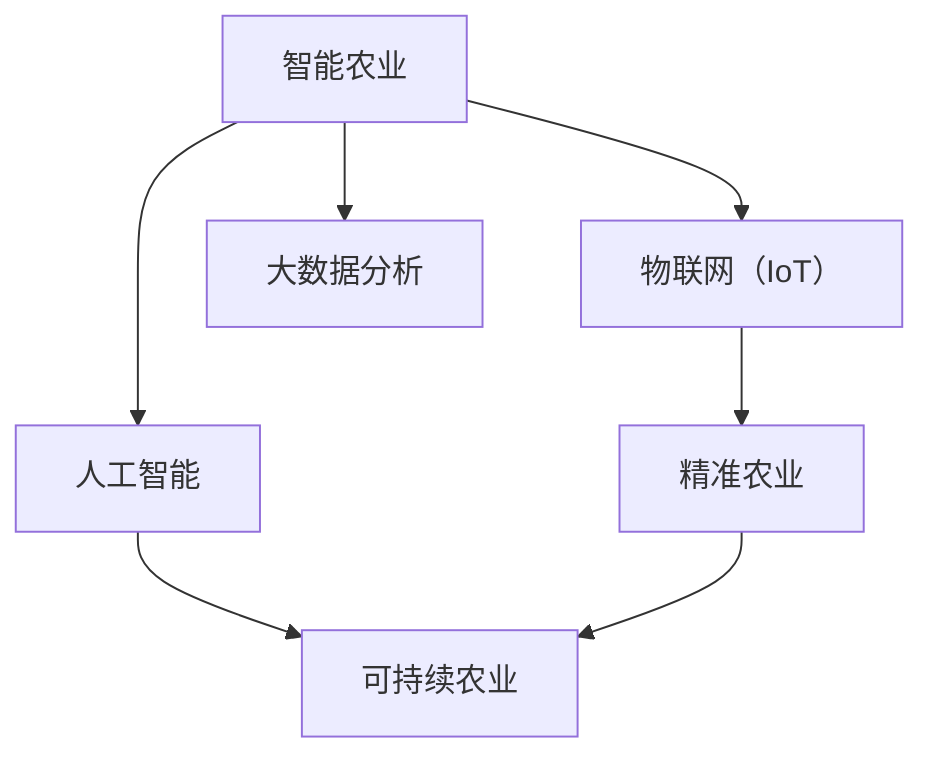

                 

# 未来的智慧农业：2050年的农业机器人与智能种植工厂

## 1. 背景介绍

### 1.1 问题由来
随着世界人口的不断增长和城市化进程的加速，全球农业面临着严峻的挑战：如何保障粮食安全，提高农业生产效率，减少资源消耗，实现可持续农业发展。传统农业模式往往依赖于大量人力和物理资源，难以应对未来全球化的需求。因此，探索新型农业技术成为当务之急。

在这一背景下，智慧农业应运而生。通过物联网、大数据、人工智能等技术的深度融合，智慧农业能够实现自动化、精准化、智能化生产，有效提升农业生产效率和品质，同时降低对环境的负面影响。

### 1.2 问题核心关键点
未来智慧农业的核心关键点包括：

- **智能感知与监测**：通过传感器、摄像头等设备，实时监测环境参数（如温度、湿度、土壤水分等）和作物生长状态。
- **决策支持系统**：基于数据挖掘和机器学习技术，为农业生产提供精准的种植建议和资源管理优化方案。
- **自动化设备**：利用机器人、自动化机械等设备，实现种植、施肥、收割等环节的自动化。
- **精准农业**：通过GIS（地理信息系统）和遥感技术，实现对土地的精细管理，提高作物产量和质量。
- **可持续发展**：采用绿色环保的技术和措施，减少化肥、农药等化学物质的使用，保护生态环境。

这些关键点共同构成了未来智慧农业的核心框架，为其发展和应用提供了重要保障。

### 1.3 问题研究意义
研究未来智慧农业，对于推动农业技术革新、保障粮食安全、促进可持续发展具有重要意义：

1. **提升农业生产效率**：通过智能化、自动化手段，显著降低人力成本，提高作物产量和质量，适应人口增长的需求。
2. **保障粮食安全**：智能化、精准化的管理方式，能够有效应对气候变化和灾害，确保粮食供应稳定。
3. **促进环境友好**：减少化肥、农药等化学物质的使用，保护土壤和水资源，实现绿色可持续发展。
4. **推动农业产业升级**：智能化技术的应用，有助于提升农业产业的现代化水平，加速传统农业向现代农业的转型。
5. **支持政策制定**：智能化的农业数据，为政府制定农业政策、优化资源配置提供依据。

## 2. 核心概念与联系

### 2.1 核心概念概述

为了更好地理解未来智慧农业的核心技术，我们首先介绍几个关键概念及其相互联系：

- **智能农业**：通过物联网、大数据、人工智能等技术，实现对农业生产全过程的智能化管理和优化。
- **物联网（IoT）**：连接各种农业设备和传感器，实现数据采集和实时监测。
- **大数据分析**：通过对海量农业数据进行分析和挖掘，提供决策支持。
- **人工智能**：包括机器学习、深度学习等技术，用于优化农业生产管理。
- **精准农业**：利用GIS、遥感等技术，实现对农田的精细化管理。
- **可持续农业**：采用环保技术，实现资源的最优化利用和环境的保护。

这些概念通过以下Mermaid流程图展示了它们之间的联系：



这个流程图展示了智能农业通过物联网、大数据分析和人工智能等技术手段，实现精准农业和可持续农业的目标。

## 3. 核心算法原理 & 具体操作步骤

### 3.1 算法原理概述

未来智慧农业的核心算法原理主要包括以下几个方面：

1. **数据采集与传输**：通过传感器、摄像头等设备采集环境数据和作物生长状态，然后通过物联网技术传输到中央处理系统。
2. **数据存储与处理**：将采集的数据存储到数据库中，通过大数据分析技术进行清洗和处理，提取有用信息。
3. **模型训练与优化**：利用机器学习和深度学习算法，训练和优化模型，提供精准的种植建议和资源管理优化方案。
4. **自动化控制**：基于训练好的模型，控制自动化设备，实现种植、施肥、收割等环节的自动化。
5. **决策支持**：将模型和数据分析结果反馈到农场管理者和农民，提供精准的决策支持，优化资源配置和管理。

### 3.2 算法步骤详解

未来智慧农业的核心算法步骤可以分为以下几个环节：

**Step 1: 数据采集与传输**
- 部署传感器、摄像头等设备，实时采集土壤水分、温度、湿度等环境参数，以及作物的生长状态（如株高、叶面积等）。
- 通过物联网技术，将采集的数据传输到中央处理系统。

**Step 2: 数据存储与处理**
- 将传输的数据存储到数据库中，使用NoSQL数据库（如MongoDB）进行高效存储和管理。
- 利用大数据分析技术，清洗和处理数据，提取有用的信息。

**Step 3: 模型训练与优化**
- 设计合适的机器学习和深度学习模型，如回归模型、分类模型、神经网络等，训练模型以预测作物生长状态和产量。
- 使用交叉验证和超参数调优技术，优化模型性能。

**Step 4: 自动化控制**
- 基于训练好的模型，控制自动化设备，如智能灌溉系统、智能施肥系统、自动化收割机等。
- 通过控制器和执行器，实现对农业生产的精确控制。

**Step 5: 决策支持**
- 将模型和数据分析结果反馈到农场管理者和农民，提供精准的种植建议和资源管理优化方案。
- 利用可视化界面，展示关键指标和趋势，辅助决策。

### 3.3 算法优缺点

未来智慧农业的算法具有以下优点：

1. **高效率**：自动化和智能化的生产方式，可以显著提高农业生产效率，降低人力成本。
2. **精准管理**：通过实时监测和数据分析，可以实现对农业生产的精准管理，提高作物产量和品质。
3. **资源优化**：智能化管理方式，可以优化资源配置，减少化肥、农药等化学物质的使用，保护环境。
4. **数据分析**：大数据分析技术，可以为农业生产提供全面的数据分析支持，优化决策。

同时，也存在一些缺点：

1. **初始投资高**：智能化设备和传感器等硬件设备需要较高的初始投资。
2. **技术门槛高**：需要具备较高的技术水平，才能有效地管理和维护智能化系统。
3. **数据安全问题**：农业生产数据涉及隐私和安全问题，需要采取严格的数据保护措施。
4. **系统复杂性**：系统涉及多种设备和技术的集成，可能面临较高的系统复杂性和维护成本。

### 3.4 算法应用领域

未来智慧农业的算法主要应用于以下几个领域：

- **智能种植工厂**：利用智能设备，实现对植物生长环境的精准控制，提高作物产量和品质。
- **自动化农业机械**：通过智能传感器和控制算法，实现农业机械的自动化控制。
- **农业机器人**：利用先进的机器人技术，实现对农业生产的自动化和智能化管理。
- **精准农业管理**：结合GIS和遥感技术，实现对农田的精细化管理。
- **资源优化配置**：通过数据分析和优化算法，实现资源的高效利用和环境友好型农业生产。

## 4. 数学模型和公式 & 详细讲解 & 举例说明

### 4.1 数学模型构建

未来智慧农业的核心数学模型主要包括以下几个方面：

1. **环境参数建模**：通过传感器数据，构建环境参数的数学模型，如温度、湿度等。
2. **作物生长建模**：通过作物生长数据，构建作物生长状态的数学模型，如株高、叶面积等。
3. **资源管理建模**：通过资源使用数据，构建资源管理优化模型，如施肥、灌溉等。
4. **产量预测建模**：通过历史数据和预测模型，构建作物产量的预测模型。

### 4.2 公式推导过程

以下以作物生长预测模型为例，进行公式推导：

假设作物生长状态可以用多项式模型表示，设 $y_i$ 为第 $i$ 天的作物生长状态，$x_{i-1}$ 为前 $i-1$ 天的环境参数，则预测模型可以表示为：

$$
y_i = \theta_0 + \theta_1 x_{i-1} + \theta_2 x_{i-1}^2 + \theta_3 x_{i-1}^3 + \cdots + \theta_n x_{i-1}^n
$$

其中 $\theta_k$ 为多项式系数，$n$ 为多项式阶数。通过最小二乘法等优化算法，可以求得最优的系数 $\theta$。

### 4.3 案例分析与讲解

假设有一个智能种植工厂，通过传感器实时监测土壤水分、温度、湿度等环境参数。基于这些数据，利用机器学习算法训练出以下模型：

$$
y_i = \theta_0 + \theta_1 x_{i-1} + \theta_2 x_{i-1}^2 + \theta_3 x_{i-1}^3
$$

其中 $x_{i-1}$ 为第 $i-1$ 天的土壤水分，$y_i$ 为第 $i$ 天的作物生长状态。通过优化算法求得 $\theta$ 后，可以根据实时环境参数，预测作物的生长状态，并控制自动化设备进行精准灌溉、施肥等管理。

## 5. 项目实践：代码实例和详细解释说明

### 5.1 开发环境搭建

未来智慧农业的开发环境搭建需要以下步骤：

1. 安装Python：选择Python 3.x版本，通过Anaconda等工具进行安装。
2. 安装相关库：安装必要的Python库，如TensorFlow、PyTorch、Pandas等。
3. 部署传感器：在智能种植工厂中安装传感器和摄像头，实现数据采集。
4. 搭建物联网系统：部署物联网设备，实现数据的实时传输和存储。
5. 配置数据库：安装和配置数据库，如MongoDB，用于数据存储和管理。

### 5.2 源代码详细实现

以下是一个简单的智能生长预测模型的代码实现：

```python
import pandas as pd
import numpy as np
from sklearn.linear_model import LinearRegression

# 读取数据
data = pd.read_csv('growth_data.csv')

# 构建模型
X = data[['temperature', 'humidity', 'soil_moisture']]
y = data['growth_state']
model = LinearRegression()

# 训练模型
model.fit(X, y)

# 预测生长状态
def predict_growth_state(temperature, humidity, soil_moisture):
    X_new = np.array([[temperature, humidity, soil_moisture]])
    y_pred = model.predict(X_new)
    return y_pred[0]

# 示例预测
temperature = 25
humidity = 70
soil_moisture = 15
growth_state = predict_growth_state(temperature, humidity, soil_moisture)
print('预测生长状态为：', growth_state)
```

### 5.3 代码解读与分析

上述代码实现了基于线性回归的作物生长预测模型。通过读取历史数据，构建环境参数和作物生长状态的关系模型，并使用线性回归算法进行训练。最后，根据实时环境参数，预测作物的生长状态。

## 6. 实际应用场景

### 6.1 智能种植工厂

智能种植工厂是未来智慧农业的重要应用场景之一。通过自动化和智能化的管理，可以实现对植物生长环境的精准控制，提高作物产量和品质。

**应用场景**：智能种植工厂可以广泛应用于温室农业、无土栽培等领域。通过传感器和自动化设备，实时监测和控制环境参数，如温度、湿度、光照等，实现精准灌溉、施肥、通风等管理。

**技术实现**：
- 部署传感器：在智能种植工厂中安装各种传感器，实时采集环境参数。
- 数据传输：通过物联网技术，将传感器数据传输到中央处理系统。
- 数据处理：利用大数据分析技术，清洗和处理数据，提取有用的信息。
- 模型训练：训练机器学习模型，预测作物生长状态和产量。
- 自动化控制：基于训练好的模型，控制自动化设备，实现精准管理。

**实际案例**：荷兰的温室农场De Bolten，通过智能种植工厂技术，实现了高产、低成本、环境友好的农业生产。

### 6.2 农业机器人

农业机器人是未来智慧农业的另一重要应用场景。通过先进的机器人技术，可以实现对农业生产的自动化和智能化管理。

**应用场景**：农业机器人可以广泛应用于田间管理、作物收割、病虫害防治等领域。通过机器人技术，实现自动化的种植、施肥、收割等操作。

**技术实现**：
- 部署机器人：在农田中安装农业机器人，实现自动化操作。
- 数据采集：通过传感器和摄像头，实时采集环境数据和作物状态。
- 数据传输：将采集的数据传输到中央处理系统。
- 模型训练：训练机器学习模型，预测作物生长状态和产量。
- 自动化控制：基于训练好的模型，控制农业机器人，实现精准管理。

**实际案例**：美国的农业机器人公司Cobots，利用机器人技术，实现了自动化的农业操作，提高了农业生产效率和质量。

### 6.3 精准农业管理

精准农业管理是未来智慧农业的重要组成部分。通过GIS和遥感技术，实现对农田的精细化管理，提高作物产量和品质。

**应用场景**：精准农业管理可以广泛应用于农田管理、农业规划等领域。通过GIS和遥感技术，实现对农田的精细化管理。

**技术实现**：
- 部署传感器：在农田中安装各种传感器，实时采集环境数据。
- 数据传输：通过物联网技术，将传感器数据传输到中央处理系统。
- 数据处理：利用GIS和遥感技术，处理和分析农田数据。
- 模型训练：训练机器学习模型，预测作物生长状态和产量。
- 自动化控制：基于训练好的模型，控制农业设备，实现精准管理。

**实际案例**：美国的爱荷华州，通过精准农业管理技术，实现了对农田的精细化管理，提高了作物产量和品质。

### 6.4 未来应用展望

未来智慧农业的应用前景非常广阔，主要体现在以下几个方面：

1. **规模化生产**：通过智能化、自动化手段，实现大规模、高效的生产，满足全球人口增长的需求。
2. **环境友好**：采用环保技术，减少化肥、农药等化学物质的使用，保护土壤和水资源。
3. **智能决策**：利用大数据分析技术，提供精准的种植建议和资源管理优化方案，优化决策。
4. **可持续发展**：实现资源的高效利用，推动绿色、可持续的农业发展。
5. **技术普及**：随着技术的发展和成本的降低，未来智慧农业技术将逐步普及，惠及更多地区和农民。

## 7. 工具和资源推荐

### 7.1 学习资源推荐

为了帮助开发者系统掌握未来智慧农业的核心技术，这里推荐一些优质的学习资源：

1. **IoT技术入门**：通过在线课程，如Coursera的《物联网基础》，了解物联网的基本概念和应用。
2. **大数据分析技术**：通过在线课程，如edX的《大数据分析基础》，掌握大数据分析和处理的基本技能。
3. **机器学习算法**：通过在线课程，如Udacity的《机器学习入门》，学习机器学习和深度学习算法。
4. **智能农业项目**：通过开源项目，如OpenAg，了解智能农业的具体实现和应用。
5. **智慧农业标准**：通过相关标准，如FAO的《智慧农业指南》，了解智慧农业的发展方向和规范。

### 7.2 开发工具推荐

未来的智慧农业开发需要多种工具的支持，以下是几款常用的工具：

1. **Python编程语言**：Python是智能农业开发的主流语言，具有丰富的库和框架支持。
2. **TensorFlow和PyTorch**：用于深度学习和机器学习算法的实现。
3. **IoT开发平台**：如ThingWorx、Azure IoT，用于物联网设备的开发和管理。
4. **大数据分析平台**：如Apache Hadoop、Apache Spark，用于大规模数据的存储和处理。
5. **GIS和遥感平台**：如ArcGIS、Google Earth Engine，用于地理信息和遥感数据的处理和分析。

### 7.3 相关论文推荐

未来智慧农业的发展离不开学界的持续研究。以下是几篇奠基性的相关论文，推荐阅读：

1. **农业物联网（IoT）**：M. A. Musa, M. A. Rahman, A. Hossain等。论文《A Survey on Agriculture IoT Technologies and Applications》介绍了农业物联网的发展现状和应用。
2. **智能农业系统**：H. Y. Wang, J. Liu, W. Zhang等。论文《An Overview of Smart Agriculture: Trends, Challenges and Future Directions》提供了智能农业的全面综述。
3. **精准农业**：M. L. Rosenzweig, J. M. Saldivar, P. T. Hafner等。论文《Precision Agriculture: Technologies, Challenges and Opportunities》探讨了精准农业的技术和应用。
4. **机器人技术**：R. K. Mahapatra, A. V. Tripathi。论文《A Survey on Robotics in Agriculture》介绍了机器人技术在农业中的应用。
5. **智慧农业标准**：FAO（联合国粮食及农业组织）发布的《智慧农业指南》，提供了智慧农业的规范和标准。

通过学习这些前沿成果，可以帮助研究者把握学科前进方向，激发更多的创新灵感。

## 8. 总结：未来发展趋势与挑战

### 8.1 研究成果总结

未来智慧农业的发展离不开技术的不断进步和创新。目前，已经取得了以下重要成果：

1. **环境监测与数据采集**：通过传感器和物联网技术，实现了环境参数的实时监测和数据采集。
2. **智能种植工厂**：通过自动化和智能化的管理，实现了高产、低成本、环境友好的农业生产。
3. **农业机器人**：通过先进的机器人技术，实现了自动化的农业操作。
4. **精准农业管理**：通过GIS和遥感技术，实现了对农田的精细化管理。
5. **数据驱动的决策支持**：通过大数据分析技术，提供了精准的种植建议和资源管理优化方案。

### 8.2 未来发展趋势

未来智慧农业的发展趋势主要体现在以下几个方面：

1. **技术融合**：未来智慧农业将与其他先进技术进行深度融合，如5G、区块链、人工智能等，实现更加智能和高效的生产。
2. **规模化生产**：随着技术的成熟和成本的降低，未来智慧农业将逐步实现规模化生产，满足全球人口增长的需求。
3. **环境友好**：采用环保技术，减少化肥、农药等化学物质的使用，保护土壤和水资源。
4. **智能化决策**：利用大数据分析技术，提供精准的种植建议和资源管理优化方案，优化决策。
5. **可持续发展**：实现资源的高效利用，推动绿色、可持续的农业发展。

### 8.3 面临的挑战

尽管未来智慧农业的前景广阔，但也面临诸多挑战：

1. **技术成本高**：智能化设备和传感器等硬件设备需要较高的初始投资。
2. **技术复杂性高**：需要具备较高的技术水平，才能有效地管理和维护智能化系统。
3. **数据安全问题**：农业生产数据涉及隐私和安全问题，需要采取严格的数据保护措施。
4. **系统复杂性高**：系统涉及多种设备和技术的集成，可能面临较高的系统复杂性和维护成本。

### 8.4 研究展望

面对未来智慧农业的挑战，未来的研究需要在以下几个方面寻求新的突破：

1. **降低技术成本**：通过技术创新和规模化生产，降低智能化设备的成本，推动技术的普及应用。
2. **提高技术易用性**：开发简单易用的开发工具和平台，降低技术门槛，促进技术的广泛应用。
3. **保障数据安全**：采用先进的数据加密和安全技术，保护农业生产数据的隐私和安全。
4. **简化系统设计**：简化系统架构和设计，提高系统的可靠性和可维护性。
5. **推动技术标准化**：制定智慧农业的标准和规范，推动技术的标准化和规范化。

通过这些研究方向的探索，未来智慧农业必将实现更高的发展水平，为人类社会的可持续发展做出更大的贡献。

## 9. 附录：常见问题与解答

**Q1: 智能种植工厂如何实现精准控制？**

A: 智能种植工厂通过传感器和自动化设备，实时监测环境参数和作物生长状态。利用机器学习算法，训练出预测模型，预测作物生长状态，并控制自动化设备进行精准灌溉、施肥等管理。例如，通过传感器监测土壤水分和温度，利用模型预测作物的需水量，自动控制灌溉系统，实现精准灌溉。

**Q2: 农业机器人如何实现自主导航和避障？**

A: 农业机器人通过激光雷达、摄像头等传感器，实时监测环境。利用计算机视觉和SLAM技术，实现自主导航和避障。例如，通过摄像头获取环境图像，利用计算机视觉技术，识别出障碍物，并规划最优路径，实现自主导航。同时，通过激光雷达实时监测环境，实现避障。

**Q3: 如何提高智慧农业的数据安全？**

A: 智慧农业的数据安全问题需要综合考虑数据采集、传输、存储和处理等环节。通过数据加密、身份验证、访问控制等技术手段，保障数据的安全性和隐私性。例如，对数据进行加密存储，采用身份验证机制，限制对数据的访问权限。

**Q4: 如何优化智能农业的资源配置？**

A: 智能农业的资源优化可以通过数据分析和机器学习算法实现。利用大数据分析技术，提取关键指标和趋势，提供优化建议。例如，通过分析土壤数据，预测作物产量，调整施肥和灌溉策略，实现资源的高效利用。

**Q5: 如何构建智慧农业的标准体系？**

A: 智慧农业的标准体系需要政府、企业、学术界等多方合作。通过制定行业标准和规范，推动智慧农业的规范化发展。例如，制定智慧农业的技术标准、数据标准和安全标准，确保智慧农业的可持续发展。

通过以上系统介绍和详细分析，相信读者对未来智慧农业有更深入的理解和认识，为推动智慧农业的发展贡献力量。

---

作者：禅与计算机程序设计艺术 / Zen and the Art of Computer Programming

