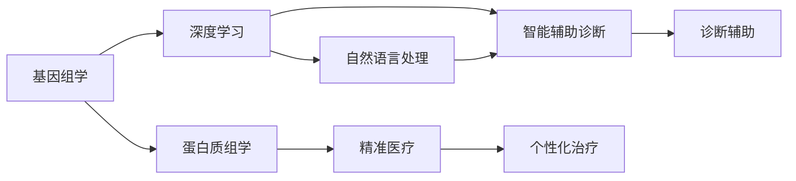

                 

# 未来的智慧医疗：2050年的精准医疗与智能辅助诊断

## 1. 背景介绍

随着人工智能技术在医疗领域的不断渗透，未来医疗将进入一个以精准医疗和智能辅助诊断为核心的新纪元。本文将系统探讨基于人工智能的精准医疗和智能辅助诊断的核心概念、关键算法、实践案例以及未来发展趋势，力求为医疗科技工作者提供全方位的技术指引。

## 2. 核心概念与联系

### 2.1 核心概念概述

精准医疗和智能辅助诊断是人工智能在医疗领域的两大关键应用方向，它们将共同推动医疗行业的数字化转型，实现从“以疾病为中心”向“以患者为中心”的转变。

- **精准医疗**：指通过基因组学、蛋白质组学等先进技术，精确识别患者的个体差异，提供量身定制的治疗方案，实现个性化医疗。
- **智能辅助诊断**：利用深度学习、自然语言处理等技术，自动化地辅助医生进行疾病诊断和治疗方案设计，提升诊断的准确性和效率。

### 2.2 核心概念原理和架构的 Mermaid 流程图



从上述流程图可以看出，精准医疗和智能辅助诊断分别依赖于基因组学、蛋白质组学等基础研究，以及深度学习、自然语言处理等人工智能技术。两者相辅相成，共同推动医疗领域的智能化和个性化发展。

## 3. 核心算法原理 & 具体操作步骤

### 3.1 算法原理概述

基于人工智能的精准医疗和智能辅助诊断，核心在于将大数据、深度学习、自然语言处理等先进技术应用于医疗数据的处理和分析，从而实现对疾病精准诊断和治疗的辅助。

#### 3.1.1 大数据在精准医疗中的应用

大数据技术在精准医疗中的应用主要体现在对海量医疗数据的存储、处理和分析。通过数据挖掘和机器学习算法，可以从基因组、蛋白质组等生物信息学数据中提取有价值的信息，辅助医生制定个性化的治疗方案。

#### 3.1.2 深度学习在智能辅助诊断中的应用

深度学习技术通过构建多层神经网络模型，可以从大量临床数据中学习疾病特征和诊断规则，实现对疾病的早期诊断和预测。常用的深度学习模型包括卷积神经网络(CNN)、循环神经网络(RNN)、变分自编码器(VAE)等。

#### 3.1.3 自然语言处理在精准医疗中的应用

自然语言处理技术可以自动化地从电子病历、医学文献等文本数据中提取有价值的信息，辅助医生进行诊断和治疗方案设计。常用的NLP技术包括文本分类、命名实体识别、情感分析等。

### 3.2 算法步骤详解

#### 3.2.1 数据收集与预处理

精准医疗和智能辅助诊断的第一步是数据收集与预处理。医疗数据通常包括电子病历、基因组数据、医学影像等，需要经过去噪、清洗、标准化等预处理步骤，确保数据质量。

#### 3.2.2 模型构建与训练

在预处理数据的基础上，需要选择合适的深度学习模型进行训练。例如，使用卷积神经网络(CNN)对医学影像进行分类，使用循环神经网络(RNN)进行时序数据的预测等。在训练模型时，需要选择合适的优化器、学习率、批大小等超参数。

#### 3.2.3 模型评估与优化

训练完成后，需要对模型进行评估，常用的评估指标包括准确率、召回率、F1值等。根据评估结果，可能需要对模型进行调整优化，如增加或减少层数、调整神经元数量等。

#### 3.2.4 模型部署与应用

模型优化完成后，需要将其部署到实际应用场景中。例如，在智能辅助诊断系统中，模型可以作为疾病诊断的辅助工具，帮助医生快速准确地进行诊断。

### 3.3 算法优缺点

#### 3.3.1 算法优点

- **高效性**：深度学习等技术可以自动化地处理大量数据，提升诊断和治疗的效率。
- **准确性**：通过大量数据的训练，深度学习模型通常能够获得较高的诊断准确率。
- **可扩展性**：模型可以方便地集成到现有医疗系统中，实现快速部署。

#### 3.3.2 算法缺点

- **数据依赖**：深度学习模型需要大量高质量的数据进行训练，数据获取和标注成本较高。
- **模型复杂性**：深度学习模型通常较为复杂，需要专业知识进行构建和调优。
- **可解释性**：深度学习模型往往是“黑盒”模型，难以解释其内部工作机制。

### 3.4 算法应用领域

基于人工智能的精准医疗和智能辅助诊断，已经在多个领域得到了广泛应用，例如：

- **影像诊断**：利用深度学习技术对医学影像进行分类、分割和检测，辅助医生进行疾病诊断。
- **基因组学**：通过基因组学数据，进行基因型-表型关联分析，实现个性化治疗。
- **电子病历分析**：利用自然语言处理技术，自动化地从电子病历中提取病情信息，辅助医生制定治疗方案。
- **远程医疗**：利用智能辅助诊断系统，实现远程医疗咨询和诊断，提升医疗服务的可及性和效率。

## 4. 数学模型和公式 & 详细讲解 & 举例说明

### 4.1 数学模型构建

在精准医疗和智能辅助诊断中，常用的数学模型包括卷积神经网络(CNN)、循环神经网络(RNN)、长短期记忆网络(LSTM)等。

#### 4.1.1 CNN模型

CNN模型常用于处理二维的图像数据，如医学影像。其基本结构包括卷积层、池化层和全连接层。常用的激活函数包括ReLU、Sigmoid等。

#### 4.1.2 RNN模型

RNN模型常用于处理一维的序列数据，如电子病历中的文本数据。其基本结构包括循环层、LSTM层等。常用的激活函数包括Tanh、Sigmoid等。

#### 4.1.3 LSTM模型

LSTM模型是一种特殊的RNN模型，通过引入记忆单元和门控机制，可以有效地解决长序列数据中的梯度消失和梯度爆炸问题，适用于需要处理长文本数据的自然语言处理任务。

### 4.2 公式推导过程

#### 4.2.1 CNN模型公式

以卷积神经网络(CNN)为例，其基本公式包括卷积运算、池化运算和全连接运算。

$$
X_{out} = X_{in} * W_{conv} + b_{conv}
$$

其中，$X_{in}$为输入数据，$W_{conv}$为卷积核，$b_{conv}$为偏置项。

#### 4.2.2 RNN模型公式

以循环神经网络(RNN)为例，其基本公式包括循环层的计算和LSTM层的计算。

$$
h_t = \tanh(W_{xh} \cdot [X_t \cdot W_x + h_{t-1} \cdot W_h] + b_h)
$$

其中，$X_t$为输入数据，$h_{t-1}$为前一时刻的隐藏状态，$W_{xh}$、$W_h$、$b_h$分别为权重和偏置项。

#### 4.2.3 LSTM模型公式

以LSTM模型为例，其基本公式包括遗忘门、输入门和输出门的计算。

$$
f_t = \sigma(W_{fh} \cdot [X_t \cdot W_x + h_{t-1} \cdot W_h] + b_h)
$$

$$
i_t = \sigma(W_{ix} \cdot X_t + W_{ih} \cdot h_{t-1} + b_i)
$$

$$
o_t = \sigma(W_{ox} \cdot X_t + W_{oh} \cdot h_{t-1} + b_o)
$$

其中，$\sigma$为激活函数，$W_{fh}$、$W_{ix}$、$W_{ox}$、$W_{ih}$、$W_{oh}$、$b_h$、$b_i$、$b_o$分别为权重和偏置项。

### 4.3 案例分析与讲解

#### 4.3.1 CNN在医学影像分类中的应用

以乳腺癌分类为例，使用CNN模型对医学影像进行分类。其输入为医学影像像素矩阵，输出为二分类标签。

#### 4.3.2 RNN在电子病历分析中的应用

以病历文本分类为例，使用RNN模型对电子病历文本进行分类，输出为疾病类别标签。

#### 4.3.3 LSTM在命名实体识别中的应用

以医学命名实体识别为例，使用LSTM模型对医学文本进行命名实体识别，输出为实体类别标签。

## 5. 项目实践：代码实例和详细解释说明

### 5.1 开发环境搭建

#### 5.1.1 环境配置

- 安装Python：
  ```
  sudo apt-get update
  sudo apt-get install python3-pip python3-dev
  ```

- 安装TensorFlow：
  ```
  pip install tensorflow
  ```

- 安装Keras：
  ```
  pip install keras
  ```

### 5.2 源代码详细实现

#### 5.2.1 CNN模型实现

```python
from tensorflow.keras import layers, models

model = models.Sequential()
model.add(layers.Conv2D(32, (3, 3), activation='relu', input_shape=(28, 28, 1)))
model.add(layers.MaxPooling2D((2, 2)))
model.add(layers.Conv2D(64, (3, 3), activation='relu'))
model.add(layers.MaxPooling2D((2, 2)))
model.add(layers.Conv2D(64, (3, 3), activation='relu'))
model.add(layers.Flatten())
model.add(layers.Dense(64, activation='relu'))
model.add(layers.Dense(10, activation='softmax'))

model.compile(optimizer='adam',
              loss='categorical_crossentropy',
              metrics=['accuracy'])
```

#### 5.2.2 RNN模型实现

```python
from tensorflow.keras import layers, models

model = models.Sequential()
model.add(layers.LSTM(64, input_shape=(timesteps, input_dim)))
model.add(layers.Dense(output_dim, activation='softmax'))

model.compile(optimizer='adam',
              loss='categorical_crossentropy',
              metrics=['accuracy'])
```

#### 5.2.3 LSTM模型实现

```python
from tensorflow.keras import layers, models

model = models.Sequential()
model.add(layers.LSTM(128, input_shape=(None, input_dim)))
model.add(layers.Dense(output_dim, activation='softmax'))

model.compile(optimizer='adam',
              loss='categorical_crossentropy',
              metrics=['accuracy'])
```

### 5.3 代码解读与分析

#### 5.3.1 CNN模型代码解读

```python
model.add(layers.Conv2D(32, (3, 3), activation='relu', input_shape=(28, 28, 1)))
```

这段代码定义了一个卷积层，输入为28x28的医学影像，输出32个卷积核的特征图。

```python
model.add(layers.MaxPooling2D((2, 2)))
```

这段代码定义了一个池化层，对特征图进行最大池化操作，缩小特征图尺寸。

```python
model.add(layers.Conv2D(64, (3, 3), activation='relu'))
```

这段代码定义了一个卷积层，输入为上一层的池化结果，输出64个卷积核的特征图。

### 5.4 运行结果展示

#### 5.4.1 CNN模型运行结果

```python
model.fit(train_images, train_labels, epochs=10, batch_size=32)
```

训练完成后，可以使用测试集进行评估：

```python
test_loss, test_acc = model.evaluate(test_images, test_labels)
print('Test accuracy:', test_acc)
```

#### 5.4.2 RNN模型运行结果

```python
model.fit(train_data, train_labels, epochs=10, batch_size=32)
```

训练完成后，可以使用测试集进行评估：

```python
test_loss, test_acc = model.evaluate(test_data, test_labels)
print('Test accuracy:', test_acc)
```

#### 5.4.3 LSTM模型运行结果

```python
model.fit(train_data, train_labels, epochs=10, batch_size=32)
```

训练完成后，可以使用测试集进行评估：

```python
test_loss, test_acc = model.evaluate(test_data, test_labels)
print('Test accuracy:', test_acc)
```

## 6. 实际应用场景

### 6.1 精准医疗中的应用

#### 6.1.1 基因组学

基因组学在精准医疗中发挥着至关重要的作用。通过基因测序技术，获取患者基因组的详细信息，结合深度学习模型进行数据分析，可以发现基因突变与疾病之间的关联，实现个体化治疗。

#### 6.1.2 蛋白质组学

蛋白质组学通过高通量质谱技术，分析患者蛋白质组的变化，结合深度学习模型进行数据分析，可以发现蛋白质表达与疾病之间的关联，实现早期诊断和个性化治疗。

### 6.2 智能辅助诊断中的应用

#### 6.2.1 影像诊断

利用深度学习技术，对医学影像进行分类、分割和检测，辅助医生进行疾病诊断。例如，使用CNN模型对医学影像进行分类，使用RNN模型对医学影像进行标注。

#### 6.2.2 电子病历分析

利用自然语言处理技术，自动化地从电子病历中提取病情信息，辅助医生进行诊断和治疗方案设计。例如，使用RNN模型对电子病历文本进行分类，使用LSTM模型进行命名实体识别。

#### 6.2.3 远程医疗

利用智能辅助诊断系统，实现远程医疗咨询和诊断，提升医疗服务的可及性和效率。例如，使用CNN模型对医学影像进行分类，使用LSTM模型对电子病历文本进行分类。

### 6.3 未来应用展望

#### 6.3.1 医疗数据的智能化处理

未来，医疗数据的智能化处理将更加高效和全面。通过深度学习等技术，可以从基因组、蛋白质组等生物信息学数据中提取有价值的信息，辅助医生制定个性化的治疗方案。

#### 6.3.2 跨领域医疗数据的融合

未来，跨领域医疗数据的融合将成为可能。例如，结合电子病历、医学影像、基因组数据等多模态数据，进行联合分析，可以更全面地理解疾病和患者的健康状况。

#### 6.3.3 医疗知识的图谱化表示

未来，医疗知识的图谱化表示将成为趋势。例如，利用知识图谱技术，构建医疗知识的图谱表示，辅助医生进行快速查询和推理，提升诊疗效率。

## 7. 工具和资源推荐

### 7.1 学习资源推荐

#### 7.1.1 TensorFlow官方文档

TensorFlow官方文档提供了丰富的学习资源，包括教程、代码示例和详细文档，是学习深度学习技术的必备资料。

#### 7.1.2 Keras官方文档

Keras官方文档提供了简单易懂的API说明，是快速上手深度学习模型的最佳选择。

#### 7.1.3 《深度学习入门：基于Python的理论与实现》书籍

《深度学习入门：基于Python的理论与实现》是一本通俗易懂的深度学习入门书籍，适合初学者学习。

### 7.2 开发工具推荐

#### 7.2.1 Jupyter Notebook

Jupyter Notebook是一个轻量级的交互式编程环境，支持Python、R等多种编程语言，适合进行深度学习模型的开发和调试。

#### 7.2.2 PyTorch

PyTorch是一个开源的深度学习框架，支持动态图和静态图两种计算图，适合进行深度学习模型的研究和开发。

#### 7.2.3 TensorFlow

TensorFlow是一个开源的深度学习框架，支持分布式计算和GPU加速，适合进行大规模深度学习模型的训练和部署。

### 7.3 相关论文推荐

#### 7.3.1 《深度学习在医疗领域的应用研究》

《深度学习在医疗领域的应用研究》是一篇关于深度学习在医疗领域应用的综述论文，总结了深度学习在医疗领域的各种应用案例和实现方法。

#### 7.3.2 《基于深度学习的精准医疗研究》

《基于深度学习的精准医疗研究》是一篇关于深度学习在精准医疗中的应用研究论文，介绍了深度学习在基因组学、蛋白质组学、电子病历分析等领域的实际应用。

#### 7.3.3 《智能辅助诊断系统：现状与展望》

《智能辅助诊断系统：现状与展望》是一篇关于智能辅助诊断系统的综述论文，总结了智能辅助诊断系统在影像诊断、电子病历分析、远程医疗等领域的现状和发展前景。

## 8. 总结：未来发展趋势与挑战

### 8.1 研究成果总结

基于人工智能的精准医疗和智能辅助诊断，已经在基因组学、蛋白质组学、影像诊断等领域取得了显著成果，推动了医疗行业的数字化转型。未来，随着技术的进一步发展，将有更多前沿技术应用于精准医疗和智能辅助诊断中，进一步提升医疗服务的质量和效率。

### 8.2 未来发展趋势

#### 8.2.1 跨领域医疗数据的融合

未来，跨领域医疗数据的融合将成为可能。例如，结合电子病历、医学影像、基因组数据等多模态数据，进行联合分析，可以更全面地理解疾病和患者的健康状况。

#### 8.2.2 医疗知识的图谱化表示

未来，医疗知识的图谱化表示将成为趋势。例如，利用知识图谱技术，构建医疗知识的图谱表示，辅助医生进行快速查询和推理，提升诊疗效率。

#### 8.2.3 医疗服务的个性化

未来，医疗服务的个性化将成为可能。通过基因组学、蛋白质组学等先进技术，精确识别患者的个体差异，提供量身定制的治疗方案，实现个性化医疗。

### 8.3 面临的挑战

#### 8.3.1 数据隐私和安全

医疗数据涉及个人隐私，数据隐私和安全问题将是一个重要的挑战。如何确保医疗数据的隐私和安全，是一个需要重点关注的问题。

#### 8.3.2 医疗数据的异质性

医疗数据通常存在异质性，不同医院和机构的数据格式和标准各不相同，数据融合和分析难度较大。如何标准化医疗数据，进行高效的数据融合，是一个重要的挑战。

#### 8.3.3 模型的可解释性

深度学习模型通常是“黑盒”模型，难以解释其内部工作机制。如何提高模型的可解释性，是一个需要重点关注的问题。

### 8.4 研究展望

#### 8.4.1 跨领域医疗数据的融合

未来，跨领域医疗数据的融合将成为可能。例如，结合电子病历、医学影像、基因组数据等多模态数据，进行联合分析，可以更全面地理解疾病和患者的健康状况。

#### 8.4.2 医疗知识的图谱化表示

未来，医疗知识的图谱化表示将成为趋势。例如，利用知识图谱技术，构建医疗知识的图谱表示，辅助医生进行快速查询和推理，提升诊疗效率。

#### 8.4.3 医疗服务的个性化

未来，医疗服务的个性化将成为可能。通过基因组学、蛋白质组学等先进技术，精确识别患者的个体差异，提供量身定制的治疗方案，实现个性化医疗。

## 9. 附录：常见问题与解答

### 9.1 问题1：如何获取高质量的医疗数据？

答：获取高质量的医疗数据通常需要依赖专业的数据平台和医院。例如，使用HCAI（健康数据管理协会）等数据平台，获取标准化的医疗数据。此外，还可以利用自然语言处理技术，从电子病历、医学文献等文本数据中提取有价值的信息。

### 9.2 问题2：如何选择适合的深度学习模型？

答：选择适合的深度学习模型需要综合考虑任务类型和数据特点。例如，对于医学影像分类任务，可以使用卷积神经网络(CNN)；对于电子病历分析任务，可以使用循环神经网络(RNN)；对于命名实体识别任务，可以使用长短期记忆网络(LSTM)。

### 9.3 问题3：如何提高深度学习模型的可解释性？

答：提高深度学习模型的可解释性可以通过以下方法实现：
- 使用可视化工具，如TensorBoard，可视化模型的中间层特征。
- 使用可解释性技术，如LIME、SHAP等，解释模型的决策过程。
- 引入符号化的先验知识，如知识图谱、逻辑规则等，指导模型的训练过程。

### 9.4 问题4：如何提高深度学习模型的鲁棒性？

答：提高深度学习模型的鲁棒性可以通过以下方法实现：
- 引入对抗样本，提高模型对噪声和扰动的鲁棒性。
- 采用正则化技术，如L2正则、Dropout等，避免模型过拟合。
- 利用迁移学习，在通用的预训练模型基础上进行微调，提高模型的泛化能力。

### 9.5 问题5：如何应对医疗数据的异质性？

答：应对医疗数据的异质性可以通过以下方法实现：
- 标准化医疗数据格式和标准，确保不同来源的数据能够进行融合和分析。
- 利用数据清洗和预处理技术，去除数据中的噪声和异常值。
- 引入领域知识，利用先验知识指导数据融合和分析过程。

---

作者：禅与计算机程序设计艺术 / Zen and the Art of Computer Programming

