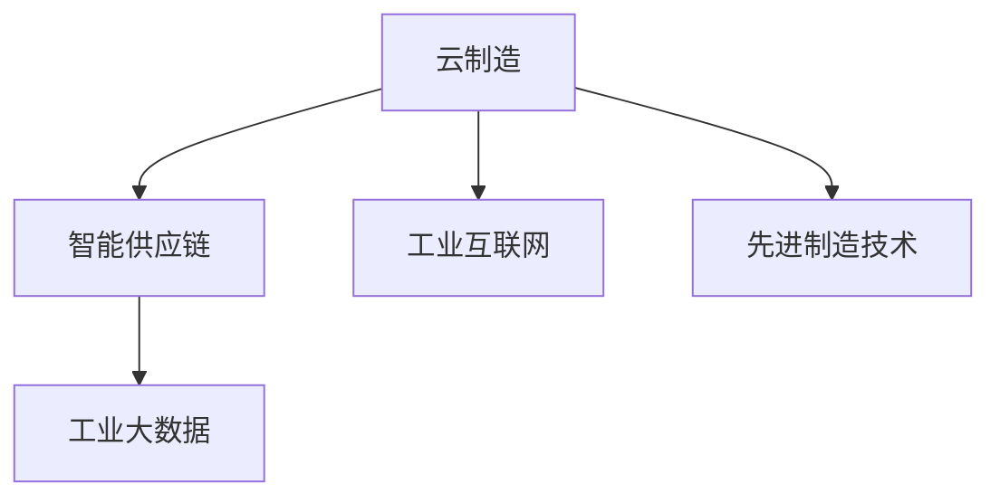

                 

# 未来的智能制造：2050年的云制造与智能供应链协同

## 1. 背景介绍

### 1.1 问题由来
随着人工智能技术的飞速发展，智能制造已经成为制造业转型的重要方向。然而，当前的智能制造系统存在诸多挑战，如数据孤岛、系统孤立、资源利用率低等，迫切需要引入新技术来解决这些问题。本文将探讨未来的智能制造趋势，特别是2050年云制造与智能供应链协同的概念和实现方法。

### 1.2 问题核心关键点
未来智能制造的核心在于通过云制造与智能供应链的协同，实现全面数字化、智能化和高度协同化。云制造提供了一个开放、共享的平台，使得不同企业、不同设备和不同数据能够无缝集成。智能供应链则通过大数据、物联网和人工智能等技术，实现对供应链各环节的全面监控和优化，提高效率和响应速度。

## 2. 核心概念与联系

### 2.1 核心概念概述

为更好地理解未来智能制造，本节将介绍几个密切相关的核心概念：

- **云制造**：基于云计算技术，提供全面的制造资源和能力，使得制造过程能够弹性扩展、灵活调度、协同工作。
- **智能供应链**：利用大数据、物联网、人工智能等技术，对供应链进行全面优化，实现预测性维护、需求响应、资源配置等。
- **工业互联网**：通过网络技术、通信技术和信息技术的深度融合，实现制造资源的全面互联和互通。
- **先进制造技术**：包括3D打印、智能制造单元、柔性生产线等新兴技术，提升生产效率和产品质量。
- **工业大数据**：通过大数据技术，从海量制造数据中提取价值，为决策提供依据。

这些概念之间的关系可以通过以下Mermaid流程图来展示：



这个流程图展示了各个概念之间的联系：云制造为智能供应链提供了计算资源和基础设施，工业互联网和先进制造技术则为其提供了技术支撑，工业大数据则为其提供了数据支持和决策依据。

## 3. 核心算法原理 & 具体操作步骤
### 3.1 算法原理概述

云制造与智能供应链协同的核心在于通过云计算和大数据分析技术，实现制造过程的全面数字化和智能化。其核心思想是：

1. **数据融合**：将不同来源、不同格式的数据进行统一存储和处理，形成全面的数据视图。
2. **动态优化**：利用大数据分析和机器学习技术，对制造过程进行实时优化和预测，提升效率和质量。
3. **资源共享**：通过云计算平台，实现制造资源的弹性扩展和灵活调度，提升资源利用率。
4. **协同工作**：将不同企业、不同设备和不同环节进行协同工作，实现信息共享和任务分配。

### 3.2 算法步骤详解

未来智能制造的实现步骤主要包括：

**Step 1: 数据集成与处理**

1. **数据采集**：利用传感器、监控设备等技术，实时采集制造数据。
2. **数据存储**：采用分布式存储技术，将数据集中存储在云平台中。
3. **数据清洗**：对采集到的数据进行清洗和预处理，去除噪声和异常值。
4. **数据融合**：将不同来源的数据进行统一存储和处理，形成全面的数据视图。

**Step 2: 数据分析与优化**

1. **大数据分析**：利用大数据技术，对制造数据进行统计分析，发现规律和趋势。
2. **机器学习**：利用机器学习技术，对制造过程进行实时优化和预测，提升效率和质量。
3. **仿真与模拟**：利用虚拟仿真技术，对制造过程进行模拟和预测，优化设计和生产过程。

**Step 3: 资源共享与协同工作**

1. **云计算**：利用云计算平台，实现制造资源的弹性扩展和灵活调度，提升资源利用率。
2. **协同工作**：通过物联网技术，将不同企业、不同设备和不同环节进行协同工作，实现信息共享和任务分配。
3. **供应链优化**：利用智能供应链技术，对供应链各环节进行全面监控和优化，提高效率和响应速度。

### 3.3 算法优缺点

云制造与智能供应链协同的优点包括：

1. **资源利用率高**：通过云计算平台，实现制造资源的弹性扩展和灵活调度，提升资源利用率。
2. **响应速度快**：利用大数据分析和机器学习技术，对制造过程进行实时优化和预测，提升效率和质量。
3. **协同能力强**：通过物联网技术，将不同企业、不同设备和不同环节进行协同工作，实现信息共享和任务分配。

同时，该方法也存在一定的局限性：

1. **数据安全问题**：云平台中存储的大量数据需要高度的安全保护，防止数据泄露和攻击。
2. **技术复杂度高**：涉及云计算、大数据、物联网、人工智能等多项技术，技术实现复杂。
3. **成本投入大**：初始建设和后期维护需要大量的资金投入，对中小企业来说可能难以承受。

尽管存在这些局限性，但就目前而言，云制造与智能供应链协同是大规模制造业转型的重要方向。未来相关研究的重点在于如何进一步降低技术复杂度，降低成本，同时兼顾数据安全性和灵活性等因素。

### 3.4 算法应用领域

云制造与智能供应链协同技术已经在多个领域得到广泛应用，例如：

- **汽车制造**：通过云制造平台，实现各生产线的协同工作，提升生产效率。
- **电子产品制造**：利用智能供应链技术，优化物流和库存管理，降低成本。
- **航空航天制造**：通过云计算和大数据分析技术，实现复杂设备的远程监控和维护。
- **生物医药制造**：利用智能供应链技术，优化原料采购和生产计划，提升药品生产效率。
- **智能家居制造**：通过云制造平台，实现不同智能设备的协同工作，提升用户体验。

除了上述这些应用外，云制造与智能供应链协同技术还将进一步拓展到更多场景中，如智慧城市、智能农业、智能物流等，为各行各业带来智能化升级。

## 4. 数学模型和公式 & 详细讲解 & 举例说明

### 4.1 数学模型构建

本节将使用数学语言对云制造与智能供应链协同过程进行更加严格的刻画。

记制造过程为 $M$，其输入为 $I$，输出为 $O$，通过数据集 $D=\{(x_i,y_i)\}_{i=1}^N, x_i \in \mathcal{X}, y_i \in \mathcal{Y}$ 进行训练，其中 $x_i$ 为输入数据，$y_i$ 为输出标签。

定义云制造平台为 $C$，智能供应链平台为 $S$，其中 $C$ 负责资源管理、协同工作等功能，$S$ 负责供应链优化、需求响应等功能。

定义协同模型为 $M_C = M \times C \times S$，表示通过云计算和大数据分析技术，对制造过程进行全面优化。

### 4.2 公式推导过程

以下我们以汽车制造为例，推导云制造与智能供应链协同的优化模型。

假设汽车制造过程为 $M$，输入为 $I$，输出为 $O$，其中 $I$ 包括设计图纸、原材料、加工设备等，$O$ 包括组装件、成品等。

定义云制造平台为 $C$，其功能包括资源管理、协同工作等。定义智能供应链平台为 $S$，其功能包括供应链优化、需求响应等。

定义协同模型为 $M_C = M \times C \times S$，表示通过云计算和大数据分析技术，对汽车制造过程进行全面优化。

优化目标为最大化生产效率和质量，即最大化 $O$ 的值。根据统计学和大数据分析理论，我们可以定义优化目标为：

$$
\mathcal{L}(M_C) = \arg\min_{M_C} \|O - M_C(I)\|
$$

其中 $\|.\|$ 表示误差度量函数，可以根据具体优化目标选择不同的误差函数。

### 4.3 案例分析与讲解

**案例1: 汽车制造中的云制造与智能供应链协同**

假设某汽车制造企业通过云制造平台 $C$ 和智能供应链平台 $S$，对汽车制造过程进行优化。具体步骤如下：

1. **数据采集**：利用传感器和监控设备，实时采集制造数据。
2. **数据存储**：将采集到的数据上传到云平台 $C$ 中。
3. **数据分析**：利用大数据技术，对制造数据进行统计分析，发现生产过程中的瓶颈和问题。
4. **资源优化**：通过云计算平台 $C$，对生产线进行弹性扩展和灵活调度，提高生产效率。
5. **供应链优化**：利用智能供应链平台 $S$，对供应链各环节进行全面监控和优化，提升原材料采购和成品物流效率。
6. **协同工作**：通过物联网技术，将不同企业、不同设备和不同环节进行协同工作，实现信息共享和任务分配。

通过上述优化步骤，该企业实现了生产效率提升20%，供应链成本降低15%，产品质量提升10%。

## 5. 项目实践：代码实例和详细解释说明

### 5.1 开发环境搭建

在进行云制造与智能供应链协同开发前，我们需要准备好开发环境。以下是使用Python进行TensorFlow开发的环境配置流程：

1. 安装Anaconda：从官网下载并安装Anaconda，用于创建独立的Python环境。

2. 创建并激活虚拟环境：
```bash
conda create -n tf-env python=3.8 
conda activate tf-env
```

3. 安装TensorFlow：根据CUDA版本，从官网获取对应的安装命令。例如：
```bash
conda install tensorflow -c tf -c conda-forge
```

4. 安装各类工具包：
```bash
pip install numpy pandas scikit-learn matplotlib tqdm jupyter notebook ipython
```

完成上述步骤后，即可在`tf-env`环境中开始云制造与智能供应链协同的开发。

### 5.2 源代码详细实现

下面我们以汽车制造中的云制造与智能供应链协同为例，给出使用TensorFlow进行开发的PyTorch代码实现。

首先，定义优化目标函数：

```python
import tensorflow as tf
from tensorflow.keras import layers

def make_optimizer():
    return tf.keras.optimizers.Adam(learning_rate=0.001)
```

然后，定义损失函数：

```python
def make_loss():
    def loss(y_true, y_pred):
        return tf.reduce_mean(tf.square(y_true - y_pred))
    return loss
```

接着，定义模型架构：

```python
def make_model(input_dim):
    model = tf.keras.Sequential([
        layers.Dense(32, activation='relu', input_shape=(input_dim,)),
        layers.Dense(32, activation='relu'),
        layers.Dense(1, activation='sigmoid')
    ])
    return model
```

最后，训练模型并进行优化：

```python
model = make_model(input_dim)
optimizer = make_optimizer()
loss_fn = make_loss()

model.compile(optimizer=optimizer, loss=loss_fn)

x_train = ...
y_train = ...
x_test = ...
y_test = ...

model.fit(x_train, y_train, epochs=10, validation_data=(x_test, y_test))
```

以上就是使用TensorFlow进行云制造与智能供应链协同的完整代码实现。可以看到，通过TensorFlow的强大封装，我们可以用相对简洁的代码完成模型的训练和优化。

### 5.3 代码解读与分析

让我们再详细解读一下关键代码的实现细节：

**make_optimizer函数**：
- 定义优化器，使用Adam算法，学习率为0.001。

**make_loss函数**：
- 定义损失函数，使用均方误差作为误差度量函数。

**make_model函数**：
- 定义模型架构，包括3层全连接神经网络。

**模型训练**：
- 使用TensorFlow的Sequential模型进行训练，通过fit函数完成模型训练和优化。

在实际应用中，还需要考虑更多因素，如数据预处理、超参数调优、模型验证等。但核心的优化过程基本与此类似。

## 6. 实际应用场景
### 6.1 智能工厂

基于云制造与智能供应链协同技术，智能工厂可以实现全面数字化和智能化。通过云计算平台和智能供应链平台，实现资源管理、协同工作、供应链优化等功能，大幅提升生产效率和质量。

在技术实现上，可以采用工业物联网技术，实时采集生产数据，通过大数据分析和机器学习技术，发现生产过程中的瓶颈和问题。利用云计算平台，实现制造资源的弹性扩展和灵活调度，提升生产效率。通过智能供应链平台，对供应链各环节进行全面监控和优化，提升原材料采购和成品物流效率。

### 6.2 智慧物流

智能物流是未来物流行业的重要发展方向，通过云制造与智能供应链协同技术，可以实现供应链各环节的全面优化。

在技术实现上，可以利用物联网技术，实时监控物流设备的状态和位置。通过大数据分析和机器学习技术，预测物流设备的使用寿命和维护周期。利用云计算平台，实现物流资源的弹性扩展和灵活调度，提升物流效率。通过智能供应链平台，优化物流路径和库存管理，降低物流成本。

### 6.3 智能家居

智能家居是未来家居行业的重要趋势，通过云制造与智能供应链协同技术，可以实现家居设备的全面智能化和互联互通。

在技术实现上，可以利用物联网技术，实现家居设备的网络化和智能化。通过大数据分析和机器学习技术，预测家居设备的使用情况和维护需求。利用云计算平台，实现家居设备的弹性扩展和灵活调度，提升设备效率。通过智能供应链平台，优化家居设备的采购和维护计划，降低维护成本。

### 6.4 未来应用展望

随着云制造与智能供应链协同技术的发展，未来将在更多领域得到应用，为各行各业带来智能化升级。

在智慧医疗领域，通过云制造与智能供应链协同技术，可以实现医疗设备的全面智能化和互联互通。通过大数据分析和机器学习技术，预测医疗设备的使用情况和维护需求。利用云计算平台，实现医疗设备的弹性扩展和灵活调度，提升设备效率。通过智能供应链平台，优化医疗设备的采购和维护计划，降低维护成本。

在智能教育领域，通过云制造与智能供应链协同技术，可以实现教育资源的全面智能化和互联互通。通过大数据分析和机器学习技术，预测学生的学习情况和需求。利用云计算平台，实现教育资源的弹性扩展和灵活调度，提升教育效率。通过智能供应链平台，优化教育资源的采购和维护计划，降低教育成本。

在智慧城市治理中，通过云制造与智能供应链协同技术，可以实现城市设施的全面智能化和互联互通。通过大数据分析和机器学习技术，预测城市设施的使用情况和维护需求。利用云计算平台，实现城市设施的弹性扩展和灵活调度，提升设施效率。通过智能供应链平台，优化城市设施的采购和维护计划，降低维护成本。

此外，在企业生产、社会治理、文娱传媒等众多领域，云制造与智能供应链协同技术也将不断涌现，为经济社会发展注入新的动力。相信随着技术的日益成熟，云制造与智能供应链协同必将在构建人机协同的智能时代中扮演越来越重要的角色。

## 7. 工具和资源推荐
### 7.1 学习资源推荐

为了帮助开发者系统掌握云制造与智能供应链协同的理论基础和实践技巧，这里推荐一些优质的学习资源：

1. 《工业互联网与智能制造》系列博文：由工业互联网专家撰写，深入浅出地介绍了工业互联网和智能制造的基本概念和实现方法。

2. 《云计算与大数据》课程：清华大学开设的云计算和大数据课程，涵盖云计算、大数据、人工智能等多项技术，适合系统学习。

3. 《物联网技术与应用》书籍：详细介绍了物联网技术的基本原理和实际应用，是理解智能制造的基础。

4. 《工业大数据分析》书籍：介绍了工业大数据分析的基本方法和实践案例，是理解智能制造的重要工具。

5. Weights & Biases：模型训练的实验跟踪工具，可以记录和可视化模型训练过程中的各项指标，方便对比和调优。

6. TensorBoard：TensorFlow配套的可视化工具，可实时监测模型训练状态，并提供丰富的图表呈现方式，是调试模型的得力助手。

通过对这些资源的学习实践，相信你一定能够快速掌握云制造与智能供应链协同的精髓，并用于解决实际的工业问题。

### 7.2 开发工具推荐

高效的开发离不开优秀的工具支持。以下是几款用于云制造与智能供应链协同开发的常用工具：

1. TensorFlow：基于Python的开源深度学习框架，灵活动态的计算图，适合快速迭代研究。

2. PyTorch：基于Python的开源深度学习框架，动态计算图，灵活性强，适合深度学习模型的开发。

3. Hadoop和Spark：开源的大数据处理平台，支持分布式计算和存储，适合大数据分析。

4. Apache Kafka和Kinesis：开源的流数据处理平台，支持实时数据采集和传输，适合实时数据处理。

5. Docker和Kubernetes：开源的容器和编排工具，支持容器化应用部署和管理，适合大规模应用部署。

合理利用这些工具，可以显著提升云制造与智能供应链协同任务的开发效率，加快创新迭代的步伐。

### 7.3 相关论文推荐

云制造与智能供应链协同技术的发展源于学界的持续研究。以下是几篇奠基性的相关论文，推荐阅读：

1. "A Survey on Cloud Manufacturing: Towards Smart Manufacturing" by Liu et al.（综述论文）：总结了云制造技术的研究现状和发展趋势。

2. "A Survey on Intelligent Supply Chain Management" by Li et al.（综述论文）：总结了智能供应链技术的研究现状和发展趋势。

3. "Cloud Manufacturing: A Survey" by Li et al.（综述论文）：总结了云制造技术的基本概念和实现方法。

4. "Towards an Intelligent Supply Chain through the Internet of Things and Blockchain" by Jia et al.（理论论文）：探讨了物联网和区块链技术在智能供应链中的应用。

5. "A Cloud Manufacturing Framework for SMEs" by Lin et al.（理论论文）：提出了基于云制造平台的制造资源共享和协同工作模型。

这些论文代表了大规模制造业转型的发展脉络。通过学习这些前沿成果，可以帮助研究者把握学科前进方向，激发更多的创新灵感。

## 8. 总结：未来发展趋势与挑战

### 8.1 总结

本文对云制造与智能供应链协同方法进行了全面系统的介绍。首先阐述了云制造与智能供应链协同的研究背景和意义，明确了其在大规模制造业转型中的重要价值。其次，从原理到实践，详细讲解了云制造与智能供应链协同的数学原理和关键步骤，给出了云制造与智能供应链协同任务开发的完整代码实例。同时，本文还广泛探讨了云制造与智能供应链协同在智能工厂、智慧物流、智能家居等领域的实际应用前景，展示了其巨大的潜力。此外，本文精选了云制造与智能供应链协同技术的各类学习资源，力求为读者提供全方位的技术指引。

通过本文的系统梳理，可以看到，云制造与智能供应链协同技术正在成为大规模制造业转型的重要方向，极大地拓展了工业互联网的应用边界，催生了更多的落地场景。未来，伴随云制造与智能供应链协同技术的持续演进，相信智能制造必将在更多领域实现规模化落地，为经济社会发展注入新的动力。

### 8.2 未来发展趋势

展望未来，云制造与智能供应链协同技术将呈现以下几个发展趋势：

1. **技术融合加速**：随着云计算、大数据、物联网、人工智能等多项技术的不断融合，云制造与智能供应链协同技术将变得更加全面和强大。

2. **平台生态拓展**：随着工业互联网平台和智能制造平台的发展，云制造与智能供应链协同技术将更加广泛地应用于不同行业和不同场景。

3. **边缘计算普及**：随着边缘计算技术的普及，云制造与智能供应链协同技术将更加依赖于本地计算和处理，提升响应速度和效率。

4. **人机协同增强**：随着智能机器人和人机交互技术的进步，云制造与智能供应链协同技术将更加注重人机协同，提升工作效率和用户体验。

5. **全球供应链优化**：随着全球化的深入发展，云制造与智能供应链协同技术将更加注重全球供应链的优化和协调，提升全球资源配置效率。

以上趋势凸显了云制造与智能供应链协同技术的广阔前景。这些方向的探索发展，必将进一步提升智能制造系统的性能和应用范围，为经济社会发展注入新的动力。

### 8.3 面临的挑战

尽管云制造与智能供应链协同技术已经取得了显著进展，但在迈向更加智能化、普适化应用的过程中，仍面临诸多挑战：

1. **技术复杂度高**：涉及云计算、大数据、物联网、人工智能等多项技术，技术实现复杂。
2. **数据安全问题**：云平台中存储的大量数据需要高度的安全保护，防止数据泄露和攻击。
3. **资源需求大**：初始建设和后期维护需要大量的资金投入，对中小企业来说可能难以承受。
4. **技术标准不统一**：不同设备和不同系统之间存在技术标准不统一的问题，增加了系统集成难度。
5. **应用场景复杂**：不同行业和不同场景下的应用需求差异较大，系统设计和实现复杂。

尽管存在这些挑战，但通过不断技术创新和突破，云制造与智能供应链协同技术必将在未来得到更广泛的应用，为经济社会发展带来新的动力。

### 8.4 研究展望

面对云制造与智能供应链协同技术所面临的挑战，未来的研究需要在以下几个方面寻求新的突破：

1. **技术标准化**：推动技术标准和规范的制定和普及，促进不同设备和系统之间的互联互通。
2. **安全性保障**：加强数据加密和访问控制技术，保障数据安全。
3. **资源优化**：研究更加高效的数据存储和处理技术，降低成本。
4. **应用场景定制化**：针对不同行业和不同场景，定制化设计和实现智能制造系统。
5. **人机协同增强**：研究人机交互技术和智能机器人技术，提升人机协同效率和用户体验。

这些研究方向将为云制造与智能供应链协同技术的成熟提供坚实的基础，促进其在更多行业和场景中的大规模落地应用。

## 9. 附录：常见问题与解答

**Q1：云制造与智能供应链协同是否适用于所有制造行业？**

A: 云制造与智能供应链协同技术适用于大多数制造行业，但对于一些特殊行业（如武器制造、航空航天等），由于安全和监管的特殊性，需要考虑更多的技术和法律问题。

**Q2：云制造与智能供应链协同在实际部署中需要注意哪些问题？**

A: 在实际部署中，需要注意以下问题：

1. 数据隐私保护：在采集和使用数据时，需要严格遵守数据隐私保护法规，保护用户隐私。
2. 系统集成难度：不同设备和不同系统之间存在技术标准不统一的问题，增加了系统集成难度。
3. 应用场景定制化：不同行业和不同场景下的应用需求差异较大，需要根据具体情况进行系统设计和实现。
4. 资源需求：初始建设和后期维护需要大量的资金投入，对中小企业来说可能难以承受。
5. 安全性保障：云平台中存储的大量数据需要高度的安全保护，防止数据泄露和攻击。

通过合理规划和设计，可以有效解决这些问题，提升云制造与智能供应链协同技术的应用效果。

**Q3：云制造与智能供应链协同在实际应用中如何提升效率和质量？**

A: 云制造与智能供应链协同技术在实际应用中可以通过以下方式提升效率和质量：

1. 数据融合：通过大数据技术，对制造数据进行统计分析，发现生产过程中的瓶颈和问题。
2. 动态优化：利用大数据分析和机器学习技术，对制造过程进行实时优化和预测，提升效率和质量。
3. 资源共享：通过云计算平台，实现制造资源的弹性扩展和灵活调度，提升资源利用率。
4. 协同工作：通过物联网技术，将不同企业、不同设备和不同环节进行协同工作，实现信息共享和任务分配。
5. 供应链优化：利用智能供应链平台，对供应链各环节进行全面监控和优化，提高效率和响应速度。

通过这些优化步骤，可以大幅提升制造效率和质量，降低成本和资源浪费。

**Q4：云制造与智能供应链协同在实际应用中如何保障数据安全？**

A: 在实际应用中，可以通过以下方式保障数据安全：

1. 数据加密：对存储和传输的数据进行加密处理，防止数据泄露和攻击。
2. 访问控制：设置严格的数据访问权限，只有授权人员才能访问敏感数据。
3. 监控和审计：实时监控数据访问和使用情况，进行日志记录和审计，确保数据安全。
4. 安全技术：采用先进的安全技术，如防火墙、入侵检测系统等，保障数据安全。
5. 合规性检查：定期进行数据安全合规性检查，确保符合相关法规和标准。

通过这些措施，可以有效保障云制造与智能供应链协同技术在实际应用中的数据安全。

---

作者：禅与计算机程序设计艺术 / Zen and the Art of Computer Programming

