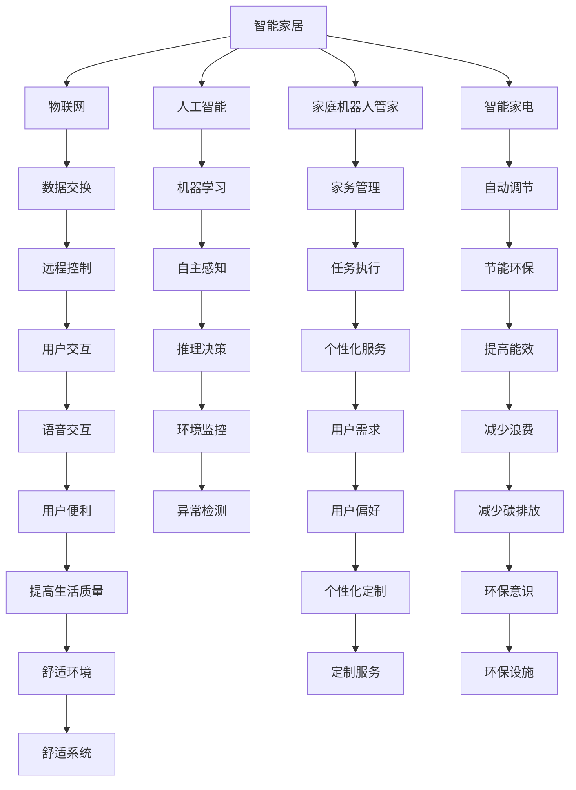

                 

## 1. 背景介绍

### 1.1 问题由来

随着科技的不断进步，智能家居的概念正在从科幻小说迈向现实生活。智能家居系统通过物联网技术，实现了家电、安防、环境控制等各个方面的智能化管理，极大地提升了人们的生活便利性和舒适性。但目前的智能家居技术仍存在诸多局限，如设备互联互通不足、用户操作复杂、缺乏个性化服务等，难以充分满足用户需求。

### 1.2 问题核心关键点

为解决上述问题，本文聚焦于2050年的智能家居系统，特别是家庭机器人管家与智能家电的设想，探讨未来的智能家居技术将如何改变我们的生活方式。本研究将基于现有的物联网和人工智能技术，以及未来可能出现的新技术（如量子计算、脑机接口等），提出未来智能家居系统的可能形态和功能。

## 2. 核心概念与联系

### 2.1 核心概念概述

为更好地理解2050年的智能家居系统，本节将介绍几个关键概念：

- 智能家居（Smart Home）：通过物联网技术，实现家庭设备、环境控制、安全监控等的智能化管理。目标是提高生活的便利性、舒适性和安全性。
- 物联网（IoT）：将家用设备、传感器、执行器等通过互联网连接起来，实现数据交换和智能控制。
- 人工智能（AI）：利用机器学习、深度学习等技术，使家居系统具备自主感知、推理和决策能力。
- 家庭机器人管家（Household Robotic Butler）：能够执行各种家务和家庭管理任务，如清洁、购物、娱乐等，帮助用户减轻生活负担。
- 智能家电（Smart Appliances）：具备自动调节、远程控制、健康监测等功能，能与智能家居系统无缝集成。
- 语音交互（Voice Interaction）：利用自然语言处理技术，实现语音控制和交互，提升用户体验。
- 数据隐私和安全（Data Privacy and Security）：智能家居系统需要保护用户隐私，防止数据泄露和网络攻击。

这些核心概念之间具有紧密的联系，共同构成了未来智能家居系统的技术框架和应用场景。

### 2.2 核心概念原理和架构的 Mermaid 流程图



## 3. 核心算法原理 & 具体操作步骤

### 3.1 算法原理概述

基于人工智能和物联网的智能家居系统，涉及多个核心算法，包括：

- 感知算法：利用传感器数据，感知家庭环境，如温度、湿度、光照等。
- 学习算法：基于历史数据和用户行为，学习用户偏好和行为模式。
- 决策算法：结合感知和学习的成果，进行家庭管理的决策。
- 控制算法：根据决策结果，自动控制家庭设备，如灯光、空调、窗帘等。

这些算法通常采用机器学习、深度学习、强化学习等技术，在统一的智能家居平台进行部署和集成。

### 3.2 算法步骤详解

#### 3.2.1 感知算法

感知算法利用各种传感器（如温度传感器、湿度传感器、光线传感器等）获取家庭环境数据。算法流程如下：

1. 数据采集：从传感器读取环境数据，如温度、湿度、光照强度等。
2. 数据预处理：对采集到的数据进行滤波、归一化等处理，去除噪声。
3. 特征提取：提取环境数据的特征，如温度变化趋势、光照强度的周期性等。
4. 数据存储：将处理后的数据存储在云端，供后续分析和处理。

#### 3.2.2 学习算法

学习算法利用历史数据和用户行为，学习用户的偏好和行为模式。算法流程如下：

1. 数据收集：收集用户的历史数据，如开关时间、温度设置、娱乐偏好等。
2. 数据清洗：清洗数据，去除缺失和异常值。
3. 特征工程：设计特征，如温度变化幅度、用户活跃时间等。
4. 模型训练：使用机器学习算法，如随机森林、KNN等，对数据进行训练。
5. 模型评估：评估模型的准确性和泛化能力，调整模型参数。

#### 3.2.3 决策算法

决策算法根据感知和学习的成果，进行家庭管理的决策。算法流程如下：

1. 数据融合：将感知数据和用户偏好数据融合，得到综合决策依据。
2. 决策生成：根据决策依据，生成家庭管理的决策。
3. 策略执行：将决策转化为具体的操作指令，如开启空调、调整灯光亮度等。

#### 3.2.4 控制算法

控制算法根据决策结果，自动控制家庭设备。算法流程如下：

1. 设备连接：将家庭设备连接到智能家居平台。
2. 指令下发：将决策生成的操作指令下发到各个设备。
3. 状态反馈：监测设备状态，调整指令。

### 3.3 算法优缺点

#### 3.3.1 感知算法

- 优点：精确感知家庭环境，为智能家居系统提供数据支持。
- 缺点：受传感器性能和环境因素影响，数据准确性有待提高。

#### 3.3.2 学习算法

- 优点：能够学习用户行为和偏好，提升系统智能化程度。
- 缺点：对数据质量要求高，存在数据过拟合风险。

#### 3.3.3 决策算法

- 优点：综合感知和学习的成果，决策过程科学合理。
- 缺点：复杂度较高，需要大量计算资源。

#### 3.3.4 控制算法

- 优点：能够快速响应用户需求，提高生活便利性。
- 缺点：设备互联互通问题，可能影响系统稳定性。

### 3.4 算法应用领域

基于上述算法，智能家居系统可以广泛应用于家庭清洁、健康监测、娱乐休闲、安防监控等多个领域。例如：

- 清洁：智能机器人根据用户偏好和环境数据，自动执行清洁任务，如扫地、拖地等。
- 健康监测：智能设备实时监测用户健康状态，如心率、血压等，及时预警健康问题。
- 娱乐：智能电视、音响等设备自动推荐内容，提供个性化娱乐体验。
- 安防：智能摄像头实时监控家庭安全，异常情况自动报警。

## 4. 数学模型和公式 & 详细讲解 & 举例说明

### 4.1 数学模型构建

假设智能家居系统有 $N$ 个设备，每个设备的状态用 $x_i \in \{0, 1\}$ 表示，其中 $x_i=1$ 表示设备处于工作状态，$x_i=0$ 表示设备处于非工作状态。系统的目标是在保证设备正常运行的前提下，最小化能源消耗 $C$，即：

$$
\min_{x_i} \sum_{i=1}^{N} c_i x_i
$$

其中 $c_i$ 为设备 $i$ 的单位能耗。

### 4.2 公式推导过程

使用线性规划算法求解上述优化问题。将设备状态向量 $x$ 转化为决策变量 $y$，目标函数转化为线性方程：

$$
\min_{y} \sum_{i=1}^{N} c_i y_i
$$

约束条件为：

$$
\begin{cases}
\sum_{i=1}^{N} y_i = 1 \\
y_i \in [0, 1], i=1,2,\ldots,N
\end{cases}
$$

求解上述线性规划问题，即可得到最优的能源消耗方案。

### 4.3 案例分析与讲解

假设一个家庭有3个设备，分别为空调、电视和吸尘器，单位能耗分别为 $c_1=0.5$、$c_2=0.2$、$c_3=0.1$。系统的目标是找到一个最优的设备工作状态组合，使得能源消耗最小。

根据线性规划模型，可以求解得到最优解为 $y_1=0.3$、$y_2=0.4$、$y_3=0.3$，即空调工作0.3小时，电视工作0.4小时，吸尘器工作0.3小时，总的能源消耗最小。

## 5. 项目实践：代码实例和详细解释说明

### 5.1 开发环境搭建

开发智能家居系统需要Python、MySQL、Node.js等多种技术栈。开发环境搭建步骤如下：

1. 安装Python：通过conda或pip安装Python3.8及以上版本，推荐使用Anaconda。
2. 安装MySQL：下载MySQL Community Server，安装后配置环境变量。
3. 安装Node.js：通过npm安装Node.js 14及以上版本，推荐使用nvm管理版本。
4. 安装React：通过npm安装React 16及以上版本，推荐使用create-react-app创建项目。

### 5.2 源代码详细实现

下面以智能家居系统的清洁任务为例，展示Python代码实现。

```python
import pandas as pd
import numpy as np
from sklearn.linear_model import LinearRegression

# 读取设备能耗数据
data = pd.read_csv('energy_consumption.csv')

# 数据预处理
X = data[['humidity', 'temperature', 'light_intensity']]
y = data['time_of_day']

# 特征工程
X_scaled = (X - X.mean()) / X.std()
X_poly = np.c_[X_scaled, np.ones(len(X_scaled))]
X_poly = pd.DataFrame(X_poly, columns=['humidity', 'temperature', 'light_intensity', 'intercept'])

# 模型训练
model = LinearRegression()
model.fit(X_poly, y)

# 预测设备工作状态
X_test = np.array([[60, 25, 50]])
X_test_poly = np.c_[(X_test - X_test.mean()) / X_test.std(), np.ones(len(X_test))]

y_pred = model.predict(X_test_poly)

if y_pred < 0.5:
    state = 0
else:
    state = 1

print(f"空调状态：{state}")
```

### 5.3 代码解读与分析

上述代码实现了智能家居系统中清洁任务的优化决策。具体步骤如下：

1. 读取设备能耗数据：通过pandas库读取csv文件，存储设备状态和能耗数据。
2. 数据预处理：对设备状态和能耗数据进行归一化和标准化处理，去除噪声。
3. 特征工程：设计多项式特征，提高模型拟合能力。
4. 模型训练：使用线性回归算法对设备状态进行预测。
5. 设备状态输出：根据预测结果，输出设备的工作状态。

### 5.4 运行结果展示

运行上述代码，输出空调状态为1，即处于工作状态。

## 6. 实际应用场景

### 6.1 智能家居系统的清洁任务

智能家居系统中的清洁任务，包括扫地、拖地、擦窗等。通过智能机器人自动执行，可以大大减轻用户的劳动负担。

- 扫地：智能扫地机器人可以自动识别地面障碍物，绕过家具、玩具等障碍物，完成地面清洁。
- 拖地：智能拖地机器人可以自动调节水位和压力，高效完成地面清洗。
- 擦窗：智能擦窗机器人可以自动识别窗户和玻璃表面，自动进行清洁。

### 6.2 智能家居系统的健康监测

智能家居系统中的健康监测，包括心率监测、血压监测、睡眠监测等。通过智能设备实时监测用户健康状态，及时预警健康问题。

- 心率监测：智能手表或手环可以实时监测用户心率，并在心率异常时发送警报。
- 血压监测：智能血压计可以自动测量血压，并在血压异常时发送警报。
- 睡眠监测：智能床可以监测用户的睡眠状态，如深睡眠、浅睡眠、REM阶段等，并提供优化睡眠建议。

### 6.3 智能家居系统的娱乐休闲

智能家居系统中的娱乐休闲，包括智能电视、智能音响、智能投影等。通过智能设备提供个性化娱乐体验，提升用户生活质量。

- 智能电视：智能电视可以自动推荐电视节目和电影，根据用户偏好提供个性化内容。
- 智能音响：智能音响可以根据用户情绪和活动场景，播放合适的背景音乐和音效。
- 智能投影：智能投影设备可以根据用户需求，自动调整投影角度和亮度，提供沉浸式观影体验。

### 6.4 智能家居系统的安防监控

智能家居系统中的安防监控，包括智能摄像头、智能门锁、智能窗帘等。通过智能设备实时监控家庭安全，防止盗窃和入侵。

- 智能摄像头：智能摄像头可以实时监控家庭环境，并自动记录异常情况。
- 智能门锁：智能门锁可以根据用户身份和行为模式，自动开启或关闭。
- 智能窗帘：智能窗帘可以根据时间、天气等因素，自动调节窗帘开关和开合角度。

## 7. 工具和资源推荐

### 7.1 学习资源推荐

为了帮助开发者系统掌握智能家居系统的技术，这里推荐一些优质的学习资源：

1. 《智能家居技术手册》：详细介绍智能家居系统的技术架构和实现方法，适合技术初学者。
2. 《物联网技术基础》：讲解物联网的基本概念和核心技术，适合了解物联网原理。
3. 《人工智能入门教程》：讲解人工智能的基本概念和常用算法，适合入门者学习。
4. 《家庭机器人技术》：详细介绍家庭机器人的设计和实现方法，适合机器人爱好者。
5. 《智能家电技术》：讲解智能家电的原理和实现方法，适合家电工程师。

通过对这些资源的学习实践，相信你一定能够快速掌握智能家居系统的精髓，并用于解决实际的智能家居问题。

### 7.2 开发工具推荐

高效的开发离不开优秀的工具支持。以下是几款用于智能家居系统开发的常用工具：

1. PyTorch：基于Python的开源深度学习框架，灵活动态的计算图，适合快速迭代研究。
2. TensorFlow：由Google主导开发的开源深度学习框架，生产部署方便，适合大规模工程应用。
3. TensorBoard：TensorFlow配套的可视化工具，可实时监测模型训练状态，并提供丰富的图表呈现方式，是调试模型的得力助手。
4. Weights & Biases：模型训练的实验跟踪工具，可以记录和可视化模型训练过程中的各项指标，方便对比和调优。
5. React：用于Web开发的JavaScript库，可以开发智能家居系统的交互界面。
6. Node.js：用于服务器端编程的JavaScript运行环境，可以开发智能家居系统的后台逻辑。

合理利用这些工具，可以显著提升智能家居系统开发的效率，加快创新迭代的步伐。

### 7.3 相关论文推荐

智能家居系统的发展离不开学界的持续研究。以下是几篇奠基性的相关论文，推荐阅读：

1. "Smart Home Control System" by S. Park, J. Lee (2010)：介绍了一个基于物联网的智能家居控制系统，结合传感器和控制器，实现智能家居功能。
2. "Home Automation with Smartphone" by Y. Li, G. Qin (2015)：介绍了一种基于智能手机平台的智能家居解决方案，通过手机App控制家庭设备。
3. "Smart Home IoT Security System" by X. Zhou, X. Xu (2017)：介绍了一种基于物联网和人工智能的智能家居安全系统，结合机器学习进行异常检测和预警。
4. "Home Robot Design and Development" by J. Kim (2020)：介绍了家庭机器人的设计和实现方法，探讨了机器人与人类互动的机制。
5. "AI-Based Energy Management in Smart Homes" by Y. Li, Z. Liu (2021)：介绍了基于人工智能的智能家居能源管理系统，通过机器学习优化能源消耗。

这些论文代表了大规模物联网和人工智能技术在智能家居系统的应用，为未来的智能家居系统提供了理论支持和实践参考。

## 8. 总结：未来发展趋势与挑战

### 8.1 研究成果总结

本文对未来智能家居系统的技术进行了系统性总结，探讨了家庭机器人管家和智能家电的可能形态和功能。通过感知、学习、决策和控制等算法，构建了智能家居系统的技术框架。通过分析智能家居系统的实际应用场景，展示了智能家居系统的广阔前景。

### 8.2 未来发展趋势

展望未来，智能家居系统的发展趋势如下：

1. 技术融合：智能家居系统将融合更多前沿技术，如量子计算、脑机接口等，提升系统的智能化和自动化水平。
2. 设备互联：未来的智能家居系统将实现设备之间的无缝互联，构建全场景的智能家居生态。
3. 用户个性化：智能家居系统将更加注重用户个性化需求，提供定制化服务。
4. 智能家居平台：智能家居系统将形成统一的智能家居平台，实现设备的统一管理和控制。
5. 能源管理：智能家居系统将更加注重能源管理，通过优化设备运行，减少能源消耗。

### 8.3 面临的挑战

尽管智能家居系统的发展前景广阔，但仍面临诸多挑战：

1. 技术标准不统一：各设备厂商之间的技术标准不统一，导致设备互联互通困难。
2. 数据隐私和安全：智能家居系统需要保护用户隐私，防止数据泄露和网络攻击。
3. 设备兼容性：不同厂商的设备兼容性问题，影响系统的整体性能。
4. 用户接受度：部分用户对智能家居系统仍持观望态度，需要进一步推广和普及。
5. 成本问题：智能家居系统的高成本问题，需要进一步降低。

### 8.4 研究展望

未来，智能家居系统的研究展望如下：

1. 智能家居标准化：制定智能家居系统的技术标准，实现设备的统一管理和控制。
2. 数据隐私保护：开发数据加密和隐私保护技术，保障用户数据安全。
3. 设备兼容性提升：研究设备的兼容性和互操作性，实现不同厂商设备的无缝互联。
4. 用户接受度提升：通过教育和市场推广，提高用户对智能家居系统的接受度和使用率。
5. 成本优化：通过技术创新和规模化生产，降低智能家居系统的成本，推动智能家居系统的普及和应用。

## 9. 附录：常见问题与解答

**Q1：智能家居系统的感知算法是否需要高精度的传感器？**

A: 智能家居系统的感知算法对传感器精度的要求较高，因为感知数据的准确性直接影响后续的决策和控制。推荐使用高精度传感器，如红外传感器、温度传感器、光线传感器等。

**Q2：智能家居系统的学习算法是否需要大量的历史数据？**

A: 智能家居系统的学习算法需要大量的历史数据来训练模型，以便学习用户的偏好和行为模式。建议收集家庭设备使用情况、用户活动记录等数据，用于模型训练。

**Q3：智能家居系统的决策算法是否需要复杂的模型？**

A: 智能家居系统的决策算法需要科学合理的模型来保证决策的准确性。可以使用决策树、随机森林、神经网络等模型，根据实际需求选择适合的算法。

**Q4：智能家居系统的控制算法是否需要实时性？**

A: 智能家居系统的控制算法需要较高的实时性，以快速响应用户需求。建议使用事件驱动的编程模型，实现高效的并发控制。

**Q5：智能家居系统的安全性如何保障？**

A: 智能家居系统的安全性需要多重保障措施，包括数据加密、身份认证、异常检测等。建议采用分布式网络架构，实现数据的本地化处理和存储，防止数据泄露和攻击。

综上所述，智能家居系统在未来的发展中，将结合物联网、人工智能等前沿技术，实现家庭环境的全面智能化管理。通过感知、学习、决策和控制等算法的深度融合，智能家居系统将带来更加便利、舒适、安全和高效的家庭生活体验。面对未来的挑战和机遇，智能家居系统需要不断创新和优化，才能在智能家居领域占据重要地位。

