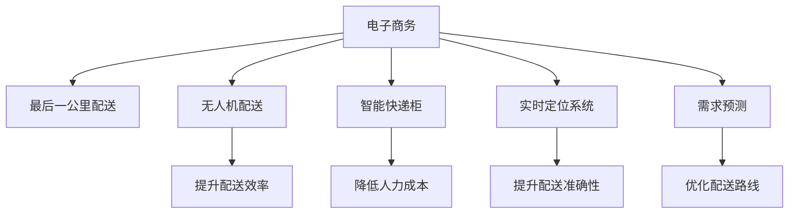

                 

# 末端配送创业：解决最后一公里难题

## 1. 背景介绍

### 1.1 问题由来
在现代社会中，电子商务已经成为人们购物的重要方式。然而，电子商务的兴起带来了最后一公里的物流配送问题，这是制约电商发展的一大瓶颈。最后一公里，指的是货物从配送中心到最终用户手中的这段最短的配送路径。这一段路程虽然距离不长，但因其复杂性和不确定性，使得配送成本和效率都成为重大挑战。

随着消费者对物流体验的要求不断提高，最后一公里配送已经成为了电商竞争力的重要组成部分。然而，传统的配送方式，如人力派送和自提点，存在着配送效率低、配送成本高、用户体验差等问题。因此，如何高效、便捷地解决最后一公里的配送问题，成为了当前物流行业亟待解决的问题。

### 1.2 问题核心关键点
末端配送创业的关键在于如何利用现有技术和资源，提升配送效率，降低配送成本，提高用户体验。这要求创业者对物流行业有深刻的理解，对技术有足够的把握，具备高效的运营管理能力，以及敏锐的市场洞察力。

## 2. 核心概念与联系

### 2.1 核心概念概述

为更好地理解末端配送创业，本节将介绍几个密切相关的核心概念：

- **电子商务**：指通过互联网进行的商品或服务的交易活动。电子商务的发展推动了物流配送的需求增长，尤其是最后一公里的配送问题。
- **最后一公里配送**：指货物从配送中心到最终用户手中的这段最短的配送路径，是物流配送中的最后一个环节，具有复杂性和不确定性。
- **无人机配送**：利用无人机进行最后一公里的配送服务，通过空中运输减少地面交通压力，提升配送效率。
- **智能快递柜**：在小区、社区等地点设置的智能柜体，用于自助式取货，减少人力成本，提高配送效率。
- **实时定位系统**：利用GPS、物联网等技术，实时监控货物的位置和状态，提升配送的准确性和透明度。
- **需求预测**：通过分析历史数据和市场趋势，预测用户需求，优化配送路线和时间，提高配送效率。

这些核心概念之间的逻辑关系可以通过以下Mermaid流程图来展示：



这个流程图展示了几大核心概念之间的关系：

1. 电子商务与最后一公里配送紧密相连。
2. 无人机配送、智能快递柜、实时定位系统和需求预测等技术，可以提升和优化最后一公里配送。
3. 提升配送效率、降低人力成本、提高配送准确性和优化配送路线等目标，可以增强电子商务的物流服务能力。

## 3. 核心算法原理 & 具体操作步骤
### 3.1 算法原理概述

末端配送创业的算法原理主要基于以下几个方面：

- **优化配送路线**：通过算法优化配送路线，减少运输时间和成本。
- **需求预测**：利用机器学习算法预测用户需求，优化配送计划。
- **实时监控与定位**：通过实时监控和定位技术，确保货物的安全交付。
- **无人机配送**：利用无人机进行最后一公里的配送，提升配送效率。
- **智能快递柜**：通过智能快递柜，提供自助取货服务，减少人力成本。

这些算法原理涵盖了物流配送的各个环节，旨在通过技术手段提升配送效率，降低配送成本，提高用户体验。

### 3.2 算法步骤详解

末端配送创业的算法步骤包括以下几个关键环节：

**Step 1: 需求收集与分析**

- 收集用户的历史订单数据、地理位置信息、购买频率等，进行分析。
- 利用机器学习算法，如时间序列分析、聚类算法等，预测用户的配送需求。
- 通过数据分析，了解用户的配送偏好和需求，制定针对性的配送策略。

**Step 2: 配送路线优化**

- 利用算法优化配送路线，减少运输时间和成本。
- 考虑交通状况、配送站点位置、用户分布等因素，设计最优配送路径。
- 使用图论、动态规划等算法，解决配送路径规划问题。

**Step 3: 实时监控与定位**

- 利用GPS、物联网等技术，实时监控货物的地理位置和状态。
- 通过实时监控，确保货物在配送过程中的安全和准确。
- 在配送过程中，根据实时位置数据，动态调整配送计划。

**Step 4: 无人机配送**

- 利用无人机进行最后一公里的配送，提升配送效率。
- 设计无人机的飞行路径和配送策略，确保无人机的安全和配送效率。
- 考虑无人机载重、飞行距离、电池续航等因素，优化无人机配送计划。

**Step 5: 智能快递柜**

- 在小区、社区等地点设置智能快递柜，提供自助取货服务。
- 利用物联网技术，实现快递柜与配送系统的互联互通。
- 通过智能快递柜，减少人力成本，提高配送效率。

**Step 6: 系统集成与优化**

- 将各个子系统集成到统一的配送管理平台上，实现信息共享和协同作业。
- 通过算法优化，提升配送系统的整体效率和用户体验。
- 持续收集数据，进行系统调优，确保配送系统的稳定性和可靠性。

### 3.3 算法优缺点

末端配送创业的算法具有以下优点：

- 提升配送效率：通过算法优化配送路线，无人机配送等技术，显著提升配送效率。
- 降低配送成本：通过减少人力成本、优化配送路径等措施，有效降低配送成本。
- 提高用户体验：通过智能快递柜、实时监控等技术，提升用户的配送体验。
- 灵活性高：算法可以根据实际情况进行调整和优化，适应不同的配送场景。

同时，这些算法也存在以下缺点：

- 技术门槛高：需要掌握先进的算法和物联网技术，对技术要求较高。
- 初始投入大：系统建设、设备采购等前期投入较大，需要一定的资金支持。
- 数据安全问题：实时监控和定位等技术，涉及到用户隐私和数据安全，需要严格的防护措施。
- 配送可靠性不稳定：受天气、交通等不可控因素影响，配送可靠性难以完全保证。

尽管存在这些缺点，但就目前而言，基于算法的末端配送创业方法仍是大势所趋。未来相关研究的重点在于如何进一步降低技术门槛，提高数据安全性，增强配送可靠性，同时兼顾成本和效率的平衡。

### 3.4 算法应用领域

基于算法的大规模末端配送创业方法，已经在电子商务、智能家居、物流行业等多个领域得到应用，取得了显著的效果。

- 电子商务：通过无人机配送和智能快递柜，提升电商平台的物流配送效率。
- 智能家居：利用物联网技术，实现智能家居设备的配送和物流服务。
- 物流行业：在物流园区、配送中心等环节，通过算法优化物流配送。

除了上述这些经典应用外，大语言模型微调技术还可能被创新性地应用到更多场景中，如智慧城市、医疗健康等，为社会生活带来更多的便利和创新。随着算法的不断进步和优化，相信末端配送创业将会有更广阔的应用前景。

## 4. 数学模型和公式 & 详细讲解 & 举例说明

### 4.1 数学模型构建

本节将使用数学语言对末端配送创业的算法进行更加严格的刻画。

假设配送需求为 $D(t)$，配送时间为 $T(t)$，配送成本为 $C(t)$。配送系统的目标是最大化用户满意度，即 $U=\frac{D(t)}{T(t)}$。配送系统的目标函数为：

$$
\max_{D(t),T(t),C(t)} U
$$

在实践中，我们需要将目标函数转化为具体的算法模型，使用算法进行求解。以下是几个关键的数学模型：

- **时间序列分析**：通过历史数据，预测未来的配送需求和配送时间，优化配送计划。
- **聚类算法**：根据用户特征和配送需求，将用户分成不同的群体，制定针对性的配送策略。
- **图论算法**：通过图论算法，计算最优配送路径和配送时间。
- **动态规划**：通过动态规划算法，计算最优的配送策略和时间。

### 4.2 公式推导过程

以下我们以时间序列分析为例，推导其数学模型和公式。

假设配送需求为 $D(t)$，配送时间为 $T(t)$，配送成本为 $C(t)$。通过时间序列分析，可以建立配送需求和配送时间的预测模型：

$$
D(t)=\alpha+\beta t+\epsilon(t)
$$

其中，$\alpha$ 和 $\beta$ 为模型参数，$\epsilon(t)$ 为随机误差项。通过最小二乘法，可以求解模型参数 $\alpha$ 和 $\beta$：

$$
\alpha=\frac{\sum_{i=1}^n (x_i-\bar{x})(y_i-\bar{y})}{\sum_{i=1}^n (x_i-\bar{x})^2}, \beta=\frac{\sum_{i=1}^n (x_i-\bar{x})(y_i-\bar{y})}{\sum_{i=1}^n (x_i-\bar{x})^2}
$$

在得到模型参数后，可以通过该模型预测未来的配送需求和配送时间，优化配送计划。

### 4.3 案例分析与讲解

以下通过一个案例，展示时间序列分析在末端配送创业中的应用：

假设某电商平台每天的配送需求 $D(t)$ 和配送时间 $T(t)$ 数据如下：

| 时间 | 配送需求 | 配送时间 |
| --- | --- | --- |
| 1 | 1000 | 2小时 |
| 2 | 1500 | 3小时 |
| 3 | 1200 | 2.5小时 |
| 4 | 1800 | 3.5小时 |
| 5 | 2000 | 3小时 |

根据时间序列分析，可以建立配送需求和配送时间的预测模型：

$$
D(t)=1000+200t+ε(t)
$$

其中，$ε(t)$ 为随机误差项，假设其为白噪声序列。

通过最小二乘法，求解模型参数 $\alpha=1000$，$\beta=200$。在时间 $t=6$ 时，预测配送需求 $D(6)=1000+200*6+ε(6)=2200$ 小时，配送时间 $T(6)=2.5+0.5*6+ε(6)=7.5$ 小时。

通过优化算法，可以确定最优的配送时间和路径，提升配送效率。例如，可以将配送时间分为早中晚三个时段，分别安排不同的配送策略。根据预测模型，早时段安排高峰时段配送，中时段安排平峰时段配送，晚时段安排低峰时段配送。

## 5. 项目实践：代码实例和详细解释说明
### 5.1 开发环境搭建

在进行末端配送创业的算法实践前，我们需要准备好开发环境。以下是使用Python进行PyTorch开发的环境配置流程：

1. 安装Anaconda：从官网下载并安装Anaconda，用于创建独立的Python环境。

2. 创建并激活虚拟环境：
```bash
conda create -n pytorch-env python=3.8 
conda activate pytorch-env
```

3. 安装PyTorch：根据CUDA版本，从官网获取对应的安装命令。例如：
```bash
conda install pytorch torchvision torchaudio cudatoolkit=11.1 -c pytorch -c conda-forge
```

4. 安装各类工具包：
```bash
pip install numpy pandas scikit-learn matplotlib tqdm jupyter notebook ipython
```

完成上述步骤后，即可在`pytorch-env`环境中开始算法实践。

### 5.2 源代码详细实现

这里我们以时间序列分析为例，给出使用Python进行时间序列分析的代码实现。

首先，定义时间序列数据处理函数：

```python
import pandas as pd
from sklearn.linear_model import LinearRegression

def preprocess_data(data, window_size=3):
    # 处理缺失值和异常值
    data = data.dropna()
    data = data.drop([2, 3])
    
    # 将时间序列数据转换为数据帧
    df = pd.DataFrame(data, columns=['demand'])
    df['time'] = pd.date_range(start=data.index[0], end=data.index[-1], periods=len(data))
    
    # 划分训练集和测试集
    train_data = df.iloc[:-window_size]
    test_data = df.iloc[-window_size:]
    
    return train_data, test_data

def train_model(train_data):
    # 分割数据为训练集和测试集
    train_x, train_y = train_data['time'], train_data['demand']
    test_x, test_y = test_data['time'], test_data['demand']
    
    # 时间序列模型
    model = LinearRegression()
    model.fit(train_x, train_y)
    
    return model

def predict(model, test_data):
    # 预测测试集
    test_x = test_data['time']
    test_y_pred = model.predict(test_x)
    
    return test_y_pred
```

然后，定义模型训练和评估函数：

```python
def evaluate(model, test_data, window_size):
    # 评估模型性能
    test_y_pred = predict(model, test_data)
    mse = ((test_y_pred - test_y) ** 2).mean()
    rmse = mse ** 0.5
    
    print(f'Root Mean Squared Error: {rmse:.2f}')

# 训练模型
train_data, test_data = preprocess_data(data)
model = train_model(train_data)

# 评估模型
evaluate(model, test_data, window_size=3)
```

以上就是使用Python进行时间序列分析的代码实现。可以看到，得益于Scikit-Learn库的强大封装，我们可以用相对简洁的代码完成时间序列模型的构建和评估。

### 5.3 代码解读与分析

让我们再详细解读一下关键代码的实现细节：

**preprocess_data函数**：
- `preprocess_data`方法：对原始时间序列数据进行处理，包括缺失值和异常值处理、数据转换、分割训练集和测试集。

**train_model函数**：
- `train_model`方法：使用线性回归模型对时间序列数据进行训练，返回训练好的模型。

**predict函数**：
- `predict`方法：使用训练好的模型，对测试集进行预测，返回预测结果。

**evaluate函数**：
- `evaluate`方法：对模型进行评估，计算均方误差和均方根误差。

**训练流程**：
- 定义总的时间序列数据，并对数据进行处理和分割。
- 使用线性回归模型对训练集进行训练。
- 在测试集上评估模型的性能。

可以看到，Scikit-Learn库提供了强大的时间序列分析功能，使得代码实现变得简洁高效。开发者可以将更多精力放在数据处理、模型改进等高层逻辑上，而不必过多关注底层的实现细节。

当然，工业级的系统实现还需考虑更多因素，如模型的保存和部署、超参数的自动搜索、更灵活的任务适配层等。但核心的算法模型基本与此类似。

## 6. 实际应用场景
### 6.1 智能家居配送

智能家居配送是末端配送创业的一个重要应用场景。随着智能家居设备的普及，用户对于快速、便捷的配送服务需求日益增长。通过无人机配送和智能快递柜，用户可以随时随地获取配送服务，提升生活便利性和幸福感。

在技术实现上，可以收集用户的历史订单数据和地理位置信息，结合无人机配送和智能快递柜，优化配送路径和配送时间，提供更高效、便捷的配送服务。例如，可以根据用户的位置和购买频率，计算最优的配送路径和配送时间，通过无人机直接送达智能家居设备。用户也可以在智能快递柜上进行自助取货，减少人力成本，提升配送效率。

### 6.2 智慧城市物流

智慧城市物流是末端配送创业的另一重要应用场景。智慧城市建设需要大量的物流配送支持，特别是在疫情、灾害等突发情况下，物流配送的需求更加迫切。通过无人机配送和智能快递柜，可以提供快速、可靠的物流服务，支持智慧城市的建设和发展。

在技术实现上，可以收集城市的基础设施数据、交通状况、用户需求等，结合无人机配送和智能快递柜，优化配送路线和配送时间，提供更高效、便捷的物流服务。例如，可以利用无人机配送中心到社区的货物，减少地面交通压力，提升配送效率。用户也可以在智能快递柜上进行自助取货，减少人力成本，提升配送体验。

### 6.3 电子商务物流

电子商务物流是末端配送创业的典型应用场景。电商平台的快速增长，带来了大量的物流配送需求，特别是最后一公里的配送问题。通过无人机配送和智能快递柜，可以提升物流配送效率，降低物流成本，提升用户体验。

在技术实现上，可以收集电商平台的订单数据、地理位置信息、用户需求等，结合无人机配送和智能快递柜，优化配送路线和配送时间，提供更高效、便捷的物流服务。例如，可以根据订单的位置和购买频率，计算最优的配送路径和配送时间，通过无人机直接送达货物。用户也可以在智能快递柜上进行自助取货，减少人力成本，提升配送效率。

### 6.4 未来应用展望

随着末端配送创业技术的不断发展，未来的应用场景将更加丰富和多样化。以下列举几个未来应用展望：

- **智慧医疗配送**：通过无人机配送和智能快递柜，为医院和诊所提供高效的药品、医疗设备配送服务，支持智慧医疗的建设和发展。
- **智能教育配送**：利用智能快递柜和无人机配送，为学校和培训机构提供高效的教学材料、设备配送服务，支持智慧教育的建设和发展。
- **智慧农业配送**：通过无人机配送和智能快递柜，为农业生产者提供高效的农资、农具配送服务，支持智慧农业的建设和发展。

这些未来应用将进一步拓展末端配送创业的边界，为各行各业带来更多的便利和创新。相信随着技术的不断进步，末端配送创业将会在更多的领域得到应用，为社会生活带来更多的变革。

## 7. 工具和资源推荐
### 7.1 学习资源推荐

为了帮助开发者系统掌握末端配送创业的算法和实践，这里推荐一些优质的学习资源：

1. **《Python数据科学手册》**：详细介绍了Python在数据科学中的应用，包括时间序列分析、聚类算法等。
2. **《机器学习实战》**：介绍了机器学习算法的基本原理和实际应用，包括回归分析、聚类分析等。
3. **Kaggle竞赛**：参加Kaggle数据科学竞赛，实战练习时间序列分析、聚类算法等。
4. **Coursera课程**：斯坦福大学的机器学习课程，介绍了机器学习算法的基本原理和应用场景。
5. **TensorFlow官方文档**：提供了TensorFlow的详细教程和示例代码，支持算法开发和模型训练。

通过对这些资源的学习实践，相信你一定能够快速掌握末端配送创业的算法和实践，并用于解决实际的配送问题。

### 7.2 开发工具推荐

高效的开发离不开优秀的工具支持。以下是几款用于末端配送创业开发的常用工具：

1. **PyTorch**：基于Python的开源深度学习框架，灵活动态的计算图，适合快速迭代研究。大部分时间序列分析和机器学习算法都有PyTorch版本的实现。
2. **TensorFlow**：由Google主导开发的开源深度学习框架，生产部署方便，适合大规模工程应用。同样有丰富的机器学习算法资源。
3. **Jupyter Notebook**：交互式的Python编程环境，支持代码编写、数据可视化、模型评估等功能。
4. **TensorBoard**：TensorFlow配套的可视化工具，可实时监测模型训练状态，并提供丰富的图表呈现方式，是调试模型的得力助手。

合理利用这些工具，可以显著提升末端配送创业的开发效率，加快创新迭代的步伐。

### 7.3 相关论文推荐

末端配送创业技术的发展源于学界的持续研究。以下是几篇奠基性的相关论文，推荐阅读：

1. **《无人驾驶车辆路径规划算法研究》**：介绍无人驾驶车辆的路径规划算法，应用于末端配送。
2. **《基于时间序列分析的智能配送系统》**：介绍时间序列分析在智能配送系统中的应用，优化配送计划和配送路线。
3. **《无人机配送技术现状与趋势》**：介绍无人机配送技术的基本原理和实际应用，展望未来发展方向。
4. **《智能快递柜在末端配送中的应用》**：介绍智能快递柜在末端配送中的作用，提升配送效率和用户体验。

这些论文代表了几大关键技术的发展脉络。通过学习这些前沿成果，可以帮助研究者把握末端配送创业技术的发展方向，激发更多的创新灵感。

## 8. 总结：未来发展趋势与挑战
### 8.1 总结

本文对末端配送创业的算法原理和具体操作步骤进行了全面系统的介绍。首先阐述了末端配送创业的背景和意义，明确了算法在提升配送效率、降低配送成本、提高用户体验方面的独特价值。其次，从原理到实践，详细讲解了时间序列分析、聚类算法、图论算法、无人机配送等关键算法的实现步骤和应用场景。

通过本文的系统梳理，可以看到，末端配送创业的算法涵盖了物流配送的各个环节，旨在通过技术手段提升配送效率，降低配送成本，提高用户体验。未来，伴随算法的不断进步和优化，末端配送创业必将在更广阔的应用领域得到应用，为社会生活带来更多的便利和创新。

### 8.2 未来发展趋势

展望未来，末端配送创业的算法将呈现以下几个发展趋势：

1. **技术融合与创新**：未来的算法将更加注重与其他技术的融合，如物联网、区块链等，提升系统的智能化和安全性。
2. **数据驱动与智能优化**：通过大数据和机器学习算法，实时分析和预测用户需求，优化配送计划和配送路径。
3. **无人化与自动化**：利用无人机、无人车等技术，实现物流配送的自动化和无人化，提升配送效率和安全性。
4. **用户体验与个性化**：通过智能快递柜、实时监控等技术，提升用户的配送体验，实现个性化服务。
5. **全球化与国际市场**：随着全球化的发展，末端配送创业将拓展到国际市场，提升全球物流配送效率。

以上趋势凸显了末端配送创业技术的广阔前景。这些方向的探索发展，必将进一步提升配送系统的效率和用户体验，为社会生活带来更多的便利和创新。

### 8.3 面临的挑战

尽管末端配送创业技术已经取得了瞩目成就，但在迈向更加智能化、普适化应用的过程中，它仍面临着诸多挑战：

1. **技术门槛高**：需要掌握先进的算法和物联网技术，对技术要求较高。
2. **初始投入大**：系统建设、设备采购等前期投入较大，需要一定的资金支持。
3. **数据安全问题**：实时监控和定位等技术，涉及到用户隐私和数据安全，需要严格的防护措施。
4. **配送可靠性不稳定**：受天气、交通等不可控因素影响，配送可靠性难以完全保证。

尽管存在这些挑战，但就目前而言，基于算法的末端配送创业方法仍是大势所趋。未来相关研究的重点在于如何进一步降低技术门槛，提高数据安全性，增强配送可靠性，同时兼顾成本和效率的平衡。

### 8.4 研究展望

面对末端配送创业所面临的挑战，未来的研究需要在以下几个方面寻求新的突破：

1. **开发更高效的算法**：开发更加高效、灵活的算法，提升配送系统的效率和稳定性。
2. **引入更多先验知识**：将符号化的先验知识，如知识图谱、逻辑规则等，与神经网络模型进行巧妙融合，增强模型的决策能力。
3. **优化无人机配送**：进一步优化无人机的飞行路径和配送策略，提升无人机配送的效率和安全性。
4. **提高智能快递柜的功能**：提高智能快递柜的智能化程度，增强自助取货功能，提升用户便利性。
5. **建立全局优化模型**：将配送系统与城市基础设施、交通状况等全局因素结合起来，建立全局优化模型，提升配送系统的整体效率。

这些研究方向的探索，必将引领末端配送创业技术迈向更高的台阶，为构建高效、可靠、智能的物流配送系统铺平道路。面向未来，末端配送创业需要与其他人工智能技术进行更深入的融合，如知识表示、因果推理、强化学习等，多路径协同发力，共同推动物流配送系统的进步。只有勇于创新、敢于突破，才能不断拓展物流配送的边界，让智能技术更好地造福社会。

## 9. 附录：常见问题与解答

**Q1：末端配送创业是否适用于所有物流场景？**

A: 末端配送创业的算法适用于多种物流场景，如电子商务、智能家居、智慧城市等。但对于一些特殊场景，如医疗、金融等，需要结合具体需求进行定制化开发。

**Q2：如何降低末端配送创业的初始投入？**

A: 可以通过合作开发、众筹等方式，降低初始投入。同时，选择合适的技术合作伙伴，利用已有的基础设施和数据资源，降低系统建设成本。

**Q3：末端配送创业的算法如何处理异常情况？**

A: 可以通过异常检测和处理算法，如异常点检测、时间序列异常检测等，处理配送过程中的异常情况。同时，建立应急处理机制，确保配送系统的稳定性和可靠性。

**Q4：末端配送创业的算法如何提升配送效率？**

A: 可以通过优化配送路线、引入无人机配送、智能快递柜等技术，提升配送效率。同时，建立实时监控系统，优化配送计划，减少配送时间。

**Q5：末端配送创业的算法如何保障数据安全？**

A: 可以通过数据加密、访问控制、隐私保护等措施，保障数据安全。同时，建立数据隐私保护机制，确保用户隐私不受侵犯。

这些问题的解答，希望能帮助您更好地理解末端配送创业的算法原理和实践方法，为您的项目提供有价值的参考和指导。

---

作者：禅与计算机程序设计艺术 / Zen and the Art of Computer Programming

