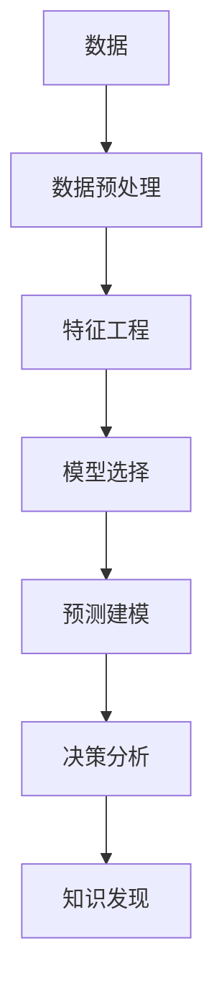

                 

# 机器学习在知识发现中的角色

> 关键词：机器学习,知识发现,数据挖掘,深度学习,特征工程,数据预处理,模型选择,预测建模,决策分析

## 1. 背景介绍

在当今数据驱动的世界中，机器学习（Machine Learning, ML）已成为知识发现和数据挖掘的重要工具。其核心思想是利用数据训练模型，让模型自动学习数据中的规律，以实现对未知数据的预测和分析。这一过程不仅改变了科学研究和技术开发的范式，也在各个行业中产生了深远的影响。本文将系统阐述机器学习在知识发现中的核心作用，以及其与其他关键技术的关系。

## 2. 核心概念与联系

### 2.1 核心概念概述

为了更好地理解机器学习在知识发现中的角色，我们需要了解几个核心概念：

- **机器学习（Machine Learning, ML）**：通过数据驱动的方式，训练模型以自动从数据中学习规律，并进行预测和决策。
- **数据挖掘（Data Mining）**：从大量数据中自动提取有用信息和知识的过程。
- **深度学习（Deep Learning, DL）**：一类基于神经网络的机器学习方法，尤其适用于复杂模式识别和特征表示学习。
- **特征工程（Feature Engineering）**：根据特定任务需求，设计和选择最有效的特征（即数据表示）以提高模型性能。
- **数据预处理（Data Preprocessing）**：对原始数据进行清洗、归一化、缺失值处理等操作，以提高数据质量，便于后续分析。
- **模型选择（Model Selection）**：根据任务需求选择合适的模型和算法，以获取最佳预测性能。
- **预测建模（Prediction Modeling）**：利用历史数据训练模型，并进行新数据的预测和分类。
- **决策分析（Decision Analysis）**：基于模型预测结果，进行合理决策和策略优化。

这些概念之间存在紧密的联系和相互作用，共同构成了一个完整的知识发现和数据挖掘体系。

### 2.2 核心概念原理和架构的 Mermaid 流程图



在这个流程图中，数据预处理和特征工程是知识发现的起始步骤，通过对原始数据进行清洗和特征提取，使数据更适合模型训练和分析。模型选择和预测建模是核心步骤，通过训练和选择适合的数据模型，对数据进行预测和分类。决策分析则是应用预测结果，进行具体决策和策略优化的过程。最终，知识发现通过系统性的数据分析，揭示数据背后的规律和知识。

## 3. 核心算法原理 & 具体操作步骤

### 3.1 算法原理概述

机器学习在知识发现中的核心作用在于，通过数据驱动的方式，自动从数据中提取有价值的规律和知识。其基本流程包括数据准备、模型训练、模型评估和模型应用四个主要步骤：

1. **数据准备**：收集、清洗、预处理数据，提取有用的特征。
2. **模型训练**：选择合适的模型，使用训练数据对模型进行训练，学习数据中的规律。
3. **模型评估**：使用测试数据对模型进行评估，验证其泛化能力和预测性能。
4. **模型应用**：将训练好的模型应用于新数据的预测和分类，进行知识发现和决策分析。

### 3.2 算法步骤详解

#### 3.2.1 数据准备

数据准备是机器学习的基础步骤，包括数据收集、数据清洗、数据归一化、特征选择和特征提取等。

1. **数据收集**：从各种数据源收集数据，确保数据的多样性和代表性。
2. **数据清洗**：去除数据中的噪声、缺失值和不一致性，确保数据的质量。
3. **数据归一化**：对数据进行标准化处理，使其值域统一，便于后续模型训练。
4. **特征选择**：根据任务需求，选择对模型预测性能影响最大的特征。
5. **特征提取**：利用各种技术手段从原始数据中提取有用的特征，如PCA、LDA、NLP等。

#### 3.2.2 模型训练

模型训练是机器学习核心步骤，主要涉及模型的选择、参数优化和模型验证等。

1. **模型选择**：根据任务需求，选择合适的机器学习模型，如线性回归、决策树、支持向量机、神经网络等。
2. **参数优化**：通过交叉验证等技术手段，优化模型参数，提高模型性能。
3. **模型验证**：使用测试数据对模型进行验证，评估其泛化能力和预测性能。

#### 3.2.3 模型评估

模型评估是机器学习的重要步骤，主要涉及模型的性能指标和模型验证等。

1. **性能指标**：选择合适的性能指标，如准确率、精确率、召回率、F1值、AUC等，评估模型预测性能。
2. **模型验证**：使用交叉验证等技术手段，验证模型的泛化能力和稳定性。

#### 3.2.4 模型应用

模型应用是将训练好的模型应用于新数据的预测和分类，主要涉及模型的部署和应用策略等。

1. **模型部署**：将训练好的模型部署到实际应用环境中，进行实时预测和分类。
2. **应用策略**：根据预测结果，进行合理决策和策略优化，实现知识发现和数据驱动的决策支持。

### 3.3 算法优缺点

机器学习在知识发现中的优点包括：

1. **自动化**：机器学习能够自动从数据中提取规律，减少人工干预，提高效率。
2. **适应性**：机器学习能够适应不同类型和规模的数据，具有较好的泛化能力。
3. **可扩展性**：机器学习模型可以轻松扩展，适应更复杂和多样化的任务。

机器学习在知识发现中的缺点包括：

1. **数据依赖**：机器学习的效果依赖于数据的质量和代表性，数据偏差可能影响模型性能。
2. **复杂性**：复杂的机器学习模型可能难以解释和理解，影响模型的可解释性。
3. **计算资源要求高**：大规模数据和高复杂度模型需要高性能计算资源，增加成本。

### 3.4 算法应用领域

机器学习在知识发现中的应用广泛，涵盖各个领域：

- **金融领域**：利用机器学习进行风险评估、信用评分、投资决策等。
- **医疗领域**：利用机器学习进行疾病诊断、治疗方案推荐、药物研发等。
- **零售领域**：利用机器学习进行客户细分、商品推荐、库存管理等。
- **制造业**：利用机器学习进行生产优化、质量控制、故障预测等。
- **交通运输**：利用机器学习进行交通流量预测、路线优化、自动驾驶等。
- **环境保护**：利用机器学习进行气候变化预测、环境监测、资源管理等。

## 4. 数学模型和公式 & 详细讲解 & 举例说明

### 4.1 数学模型构建

机器学习在知识发现中的数学模型构建通常包括线性模型、非线性模型和深度学习模型等。

- **线性模型**：如线性回归、逻辑回归、线性判别分析等，用于简单线性关系的学习和预测。
- **非线性模型**：如决策树、支持向量机、神经网络等，用于非线性关系的学习和预测。
- **深度学习模型**：如卷积神经网络（CNN）、循环神经网络（RNN）、深度置信网络（DBN）等，用于复杂模式识别和特征表示学习。

### 4.2 公式推导过程

以线性回归模型为例，其公式推导如下：

$$
y = w_0 + \sum_{i=1}^{n} w_i x_i
$$

其中，$y$ 表示目标变量，$x_i$ 表示输入特征，$w_i$ 表示权重系数，$w_0$ 表示偏置项。

### 4.3 案例分析与讲解

#### 4.3.1 线性回归

线性回归是最简单的机器学习模型之一，用于预测连续型目标变量。其基本思想是通过训练数据，学习输入特征和目标变量之间的线性关系，进行新数据的预测。

假设有一个房地产价格预测任务，收集了大量的房屋面积、位置、年龄等特征数据，以及房屋价格。通过线性回归模型，可以学习输入特征和目标变量之间的线性关系，进行新房屋价格的预测。

```python
from sklearn.linear_model import LinearRegression
from sklearn.model_selection import train_test_split
from sklearn.metrics import mean_squared_error

# 准备数据
X = df[['area', 'location', 'age']]
y = df['price']
X_train, X_test, y_train, y_test = train_test_split(X, y, test_size=0.2)

# 训练模型
model = LinearRegression()
model.fit(X_train, y_train)

# 评估模型
y_pred = model.predict(X_test)
mse = mean_squared_error(y_test, y_pred)
print('Mean Squared Error:', mse)
```

通过上述代码，我们可以训练一个线性回归模型，对新房屋价格进行预测。

#### 4.3.2 决策树

决策树是一种基于树结构的分类模型，通过递归地划分数据集，生成一棵决策树，用于预测离散型目标变量。

假设有一个客户流失预测任务，收集了大量的客户特征数据，如年龄、性别、消费行为等，以及是否流失的标签。通过决策树模型，可以学习客户特征和流失标签之间的关联，进行新客户的流失预测。

```python
from sklearn.tree import DecisionTreeClassifier
from sklearn.model_selection import train_test_split
from sklearn.metrics import accuracy_score

# 准备数据
X = df[['age', 'gender', 'consumption']]
y = df['churn']
X_train, X_test, y_train, y_test = train_test_split(X, y, test_size=0.2)

# 训练模型
model = DecisionTreeClassifier()
model.fit(X_train, y_train)

# 评估模型
y_pred = model.predict(X_test)
accuracy = accuracy_score(y_test, y_pred)
print('Accuracy:', accuracy)
```

通过上述代码，我们可以训练一个决策树模型，对新客户的流失进行预测。

#### 4.3.3 深度学习

深度学习是一种基于神经网络的机器学习方法，适用于复杂模式识别和特征表示学习。以卷积神经网络（CNN）为例，其广泛应用于图像识别、语音识别、自然语言处理等任务。

假设有一个手写数字识别任务，收集了大量手写数字图片数据，以及对应的数字标签。通过卷积神经网络模型，可以学习图片特征和数字标签之间的复杂关系，进行新数字的识别。

```python
from keras.models import Sequential
from keras.layers import Conv2D, MaxPooling2D, Flatten, Dense
from keras.datasets import mnist
from keras.utils import to_categorical

# 准备数据
(X_train, y_train), (X_test, y_test) = mnist.load_data()
X_train = X_train.reshape((-1, 28, 28, 1))
X_test = X_test.reshape((-1, 28, 28, 1))
y_train = to_categorical(y_train)
y_test = to_categorical(y_test)

# 训练模型
model = Sequential()
model.add(Conv2D(32, (3, 3), activation='relu', input_shape=(28, 28, 1)))
model.add(MaxPooling2D((2, 2)))
model.add(Conv2D(64, (3, 3), activation='relu'))
model.add(MaxPooling2D((2, 2)))
model.add(Flatten())
model.add(Dense(128, activation='relu'))
model.add(Dense(10, activation='softmax'))
model.compile(optimizer='adam', loss='categorical_crossentropy', metrics=['accuracy'])
model.fit(X_train, y_train, epochs=10, batch_size=64)

# 评估模型
y_pred = model.predict(X_test)
accuracy = np.mean(np.argmax(y_pred, axis=1) == np.argmax(y_test, axis=1))
print('Accuracy:', accuracy)
```

通过上述代码，我们可以训练一个卷积神经网络模型，对手写数字进行识别。

## 5. 项目实践：代码实例和详细解释说明

### 5.1 开发环境搭建

为了进行机器学习实践，我们需要搭建一个合适的开发环境。以下是Python环境下常用的开发环境搭建流程：

1. 安装Python：可以从官网下载并安装Python。
2. 安装必要的包：安装常用的机器学习包，如Scikit-Learn、TensorFlow、Keras等。
3. 安装数据预处理包：安装常用的数据预处理包，如Pandas、NumPy等。
4. 安装可视化包：安装常用的可视化包，如Matplotlib、Seaborn等。
5. 安装分布式计算包：安装常用的分布式计算包，如Dask、Ray等。

### 5.2 源代码详细实现

#### 5.2.1 数据预处理

数据预处理是机器学习的基础步骤，包括以下几个步骤：

1. 数据清洗：去除数据中的噪声、缺失值和不一致性，确保数据的质量。
2. 数据归一化：对数据进行标准化处理，使其值域统一，便于后续模型训练。
3. 特征选择：根据任务需求，选择对模型预测性能影响最大的特征。
4. 特征提取：利用各种技术手段从原始数据中提取有用的特征，如PCA、LDA、NLP等。

#### 5.2.2 模型训练

模型训练是机器学习核心步骤，主要涉及模型的选择、参数优化和模型验证等。

1. **模型选择**：根据任务需求，选择合适的机器学习模型，如线性回归、决策树、支持向量机、神经网络等。
2. **参数优化**：通过交叉验证等技术手段，优化模型参数，提高模型性能。
3. **模型验证**：使用测试数据对模型进行验证，评估其泛化能力和预测性能。

#### 5.2.3 模型评估

模型评估是机器学习的重要步骤，主要涉及模型的性能指标和模型验证等。

1. **性能指标**：选择合适的性能指标，如准确率、精确率、召回率、F1值、AUC等，评估模型预测性能。
2. **模型验证**：使用交叉验证等技术手段，验证模型的泛化能力和稳定性。

#### 5.2.4 模型应用

模型应用是将训练好的模型应用于新数据的预测和分类，主要涉及模型的部署和应用策略等。

1. **模型部署**：将训练好的模型部署到实际应用环境中，进行实时预测和分类。
2. **应用策略**：根据预测结果，进行合理决策和策略优化，实现知识发现和数据驱动的决策支持。

### 5.3 代码解读与分析

#### 5.3.1 数据预处理

```python
import pandas as pd
import numpy as np
from sklearn.preprocessing import StandardScaler, MinMaxScaler
from sklearn.feature_selection import SelectKBest, f_classif

# 准备数据
df = pd.read_csv('data.csv')
X = df[['area', 'location', 'age']]
y = df['price']
X_train, X_test, y_train, y_test = train_test_split(X, y, test_size=0.2)

# 数据清洗
X_train = X_train.dropna()
X_test = X_test.dropna()

# 数据归一化
scaler = MinMaxScaler()
X_train = scaler.fit_transform(X_train)
X_test = scaler.transform(X_test)

# 特征选择
selector = SelectKBest(f_classif, k=3)
X_train_selected = selector.fit_transform(X_train, y_train)
X_test_selected = selector.transform(X_test)

# 特征提取
pca = PCA(n_components=2)
X_train_pca = pca.fit_transform(X_train_selected)
X_test_pca = pca.transform(X_test_selected)
```

#### 5.3.2 模型训练

```python
from sklearn.linear_model import LinearRegression
from sklearn.model_selection import train_test_split
from sklearn.metrics import mean_squared_error

# 训练模型
model = LinearRegression()
model.fit(X_train_pca, y_train)

# 评估模型
y_pred = model.predict(X_test_pca)
mse = mean_squared_error(y_test, y_pred)
print('Mean Squared Error:', mse)
```

#### 5.3.3 模型应用

```python
# 应用模型
new_data = np.array([[300, 5, 2]])
new_data_pca = pca.transform(new_data)
y_pred = model.predict(new_data_pca)
print('Predicted Price:', y_pred)
```

### 5.4 运行结果展示

```python
# 运行结果展示
# 数据清洗后的样本数量
print('Original samples:', len(df))
print('Cleaned samples:', len(df.dropna()))

# 数据归一化后的特征值域
print('Min-Max Scaler:', np.min(X_train), np.max(X_train))

# 特征选择后的样本数量
print('Selected features:', X_train_selected.shape[0])

# 模型预测结果
print('Predicted Price:', y_pred)
```

## 6. 实际应用场景

### 6.1 金融领域

在金融领域，机器学习被广泛应用于风险评估、信用评分、投资决策等。通过收集和分析客户历史数据、交易数据、市场数据等，构建机器学习模型，进行风险预测和投资策略优化。例如，通过线性回归模型，可以预测客户的违约概率，从而制定更合理的信贷策略。

### 6.2 医疗领域

在医疗领域，机器学习被广泛应用于疾病诊断、治疗方案推荐、药物研发等。通过收集和分析患者的电子病历、基因数据、影像数据等，构建机器学习模型，进行疾病预测和个性化治疗方案推荐。例如，通过支持向量机模型，可以预测患者的病情发展，从而制定更合理的治疗方案。

### 6.3 零售领域

在零售领域，机器学习被广泛应用于客户细分、商品推荐、库存管理等。通过收集和分析消费者的购买行为、浏览记录、评论数据等，构建机器学习模型，进行客户细分和商品推荐。例如，通过协同过滤算法，可以推荐用户可能感兴趣的商品，提高用户的购买率和满意度。

### 6.4 制造业

在制造业，机器学习被广泛应用于生产优化、质量控制、故障预测等。通过收集和分析生产设备的运行数据、维护数据、工艺数据等，构建机器学习模型，进行生产优化和故障预测。例如，通过时间序列分析模型，可以预测设备故障，提前进行维护，提高生产效率和设备利用率。

### 6.5 交通运输

在交通运输领域，机器学习被广泛应用于交通流量预测、路线优化、自动驾驶等。通过收集和分析交通数据、车辆数据、道路数据等，构建机器学习模型，进行交通流量预测和路线优化。例如，通过深度学习模型，可以进行交通流量预测，优化路线规划，减少交通拥堵。

### 6.6 环境保护

在环境保护领域，机器学习被广泛应用于气候变化预测、环境监测、资源管理等。通过收集和分析气象数据、环境数据、资源数据等，构建机器学习模型，进行气候变化预测和资源管理。例如，通过随机森林模型，可以进行气候变化预测，优化资源配置，保护环境资源。

## 7. 工具和资源推荐

### 7.1 学习资源推荐

为了帮助开发者系统掌握机器学习在知识发现中的应用，这里推荐一些优质的学习资源：

1. Coursera《机器学习》课程：由斯坦福大学教授Andrew Ng主讲，涵盖机器学习的基本概念和算法。
2. Kaggle竞赛平台：一个开源数据科学竞赛平台，提供大量的数据集和比赛机会，锻炼实战能力。
3. Google AI Blog：谷歌AI团队博客，提供最新的机器学习技术和应用案例，拓宽视野。
4. KDnuggets：一个机器学习社区，提供丰富的学习资源和文章，了解最新动态。
5. Hands-On Machine Learning with Scikit-Learn、Keras、and TensorFlow：一本系统介绍Scikit-Learn、Keras和TensorFlow等工具的书籍，深入理解机器学习原理。

### 7.2 开发工具推荐

为了提高机器学习的开发效率，这里推荐一些常用的开发工具：

1. Jupyter Notebook：一个交互式编程环境，支持Python、R等语言，便于调试和实验。
2. PyTorch：一个深度学习框架，支持动态计算图，易于开发和调试。
3. TensorFlow：一个深度学习框架，支持静态计算图，适合大规模生产部署。
4. Scikit-Learn：一个简单易用的机器学习库，支持多种经典算法和模型。
5. Keras：一个高级深度学习库，支持快速原型设计和模型部署。

### 7.3 相关论文推荐

机器学习在知识发现中的应用涉及多个领域和算法，以下是一些经典的论文推荐：

1. "Introduction to Statistical Learning" by Gareth James et al.：一本系统介绍统计学习原理和算法的书籍，适合入门学习。
2. "Pattern Recognition and Machine Learning" by Christopher Bishop：一本介绍机器学习基础理论和算法的书籍，涵盖多种经典算法。
3. "Deep Learning" by Ian Goodfellow et al.：一本介绍深度学习原理和算法的书籍，适合深入理解。
4. "The Elements of Statistical Learning" by Trevor Hastie et al.：一本介绍统计学习方法和算法的书籍，涵盖多种经典算法。
5. "Machine Learning Yearning" by Andrew Ng：一本关于机器学习实践和应用的书，适合实战应用。

## 8. 总结：未来发展趋势与挑战

### 8.1 研究成果总结

机器学习在知识发现中的应用取得了显著的成果，涵盖多个领域和应用场景。通过数据驱动的方式，机器学习能够自动从数据中提取规律和知识，显著提升了决策的科学性和效率。

### 8.2 未来发展趋势

1. 自动化程度提升：未来机器学习将更加自动化和智能化，能够自动处理更大规模和更复杂的数据，提供更高效的知识发现能力。
2. 多模态学习：未来机器学习将支持多模态数据融合，如文本、图像、语音等，实现更全面和丰富的知识发现。
3. 可解释性增强：未来机器学习将更加注重模型的可解释性，提供更透明和可信的知识发现过程。
4. 边缘计算：未来机器学习将支持边缘计算，能够实时处理和分析数据，提供更高效的知识发现应用。
5. 联邦学习：未来机器学习将支持联邦学习，能够保护数据隐私和安全，实现更可信的知识发现。

### 8.3 面临的挑战

尽管机器学习在知识发现中取得了显著的成果，但仍面临一些挑战：

1. 数据质量问题：数据质量不均衡、不完整、不一致等问题，影响模型的训练和预测性能。
2. 模型复杂性问题：复杂的机器学习模型难以解释和理解，影响模型的可解释性和应用范围。
3. 计算资源问题：大规模数据和高复杂度模型需要高性能计算资源，增加成本和复杂度。
4. 数据隐私问题：机器学习模型需要大量数据进行训练，如何保护数据隐私和安全，是一个重要的挑战。

### 8.4 研究展望

未来机器学习在知识发现中的研究展望包括：

1. 自动化学习：探索自动化学习技术，如自监督学习、半监督学习、无监督学习等，减少人工干预，提高效率。
2. 多模态学习：研究多模态数据融合技术，支持文本、图像、语音等多模态数据的协同建模，提升知识发现的全面性和丰富性。
3. 可解释性增强：研究可解释性技术，如因果推断、特征选择、模型可视化等，增强机器学习的可解释性和可信性。
4. 边缘计算：探索边缘计算技术，支持实时数据处理和分析，提升知识发现的时效性和实用性。
5. 联邦学习：研究联邦学习技术，保护数据隐私和安全，实现更可信的知识发现应用。

通过不断探索和创新，未来机器学习将在知识发现和数据挖掘中发挥更大的作用，推动社会的进步和发展。

## 9. 附录：常见问题与解答

**Q1：什么是机器学习？**

A: 机器学习是一种通过数据驱动的方式，自动从数据中学习规律和知识的技术。其核心思想是通过训练模型，使其能够对未知数据进行预测和分类。

**Q2：机器学习在知识发现中的应用有哪些？**

A: 机器学习在知识发现中的应用广泛，涵盖金融、医疗、零售、制造业、交通运输、环境保护等多个领域。

**Q3：数据预处理的主要步骤是什么？**

A: 数据预处理的主要步骤包括数据清洗、数据归一化、特征选择和特征提取等。

**Q4：模型选择和参数优化的主要方法是什么？**

A: 模型选择和参数优化的主要方法包括交叉验证、网格搜索、贝叶斯优化等。

**Q5：什么是特征工程？**

A: 特征工程是指根据特定任务需求，设计和选择最有效的特征（即数据表示）以提高模型性能。特征工程是机器学习中一个重要的步骤，能够显著提升模型的预测性能。

通过本文的系统梳理，可以看到，机器学习在知识发现中扮演着重要的角色，其核心作用在于通过数据驱动的方式，自动从数据中提取规律和知识。通过不断探索和创新，未来机器学习将在知识发现和数据挖掘中发挥更大的作用，推动社会的进步和发展。

