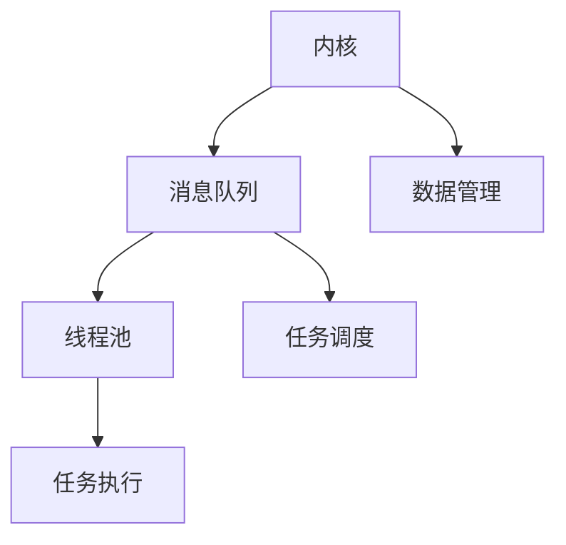
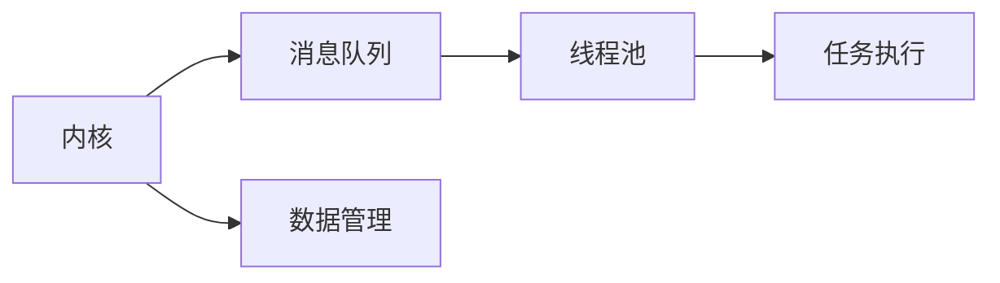

                 

# 构建LLM操作系统：内核、消息、线程的重要性

> 关键词：人工智能操作系统,大语言模型,内核,消息,线程,可扩展性,性能优化

## 1. 背景介绍

### 1.1 问题由来
在人工智能（AI）领域，尤其是自然语言处理（NLP）领域，大语言模型（LLM）已经成为研究的热点。LLM能够处理大量的自然语言文本，并从中提取有价值的信息，广泛应用于机器翻译、文本摘要、智能问答等任务中。然而，在实际应用中，LLM面临一系列挑战，包括计算资源的限制、数据隐私的担忧、以及系统的可扩展性和性能优化问题。因此，构建一个高效、安全、可扩展的LLM操作系统成为当前的研究重点。

### 1.2 问题核心关键点
构建LLM操作系统需要解决的核心问题包括：
- 如何高效管理大模型的内存和计算资源，避免资源浪费和瓶颈。
- 如何处理大模型的数据输入和输出，确保数据安全性和隐私保护。
- 如何优化大模型的计算过程，提升推理速度和响应时间。
- 如何实现系统的可扩展性，支持多个LLM实例并行运行。

### 1.3 问题研究意义
构建LLM操作系统对于AI领域的进一步发展具有重要意义：
- 通过系统化的资源管理和任务调度，提升LLM的效率和性能，降低计算成本。
- 通过严格的数据访问控制和隐私保护机制，保障用户数据安全。
- 通过可扩展性和灵活的架构设计，支持更多的LLM实例并行运行，加速AI技术的落地应用。

## 2. 核心概念与联系

### 2.1 核心概念概述

构建LLM操作系统涉及多个关键概念，包括内核（Kernel）、消息（Message）和线程（Thread）等。这些概念之间的联系和作用可以通过以下Mermaid流程图来展示：



这个流程图展示了内核、消息队列和线程池之间的相互作用：
- 内核负责资源管理和数据访问控制，提供系统的基本功能。
- 消息队列用于传递任务和数据，实现任务间通信。
- 线程池管理多个线程，高效执行任务。

### 2.2 核心概念原理和架构

**内核（Kernel）**：内核是操作系统的核心组件，负责资源管理、数据访问控制和系统调度。在内核中，所有的硬件和软件资源都是由内核来管理，确保系统的稳定性和安全性。在LLM系统中，内核需要管理大模型的内存、计算资源和数据流，以支持大模型的训练和推理。

**消息（Message）**：消息是系统间通信的基本单位，用于传递任务和数据。在LLM系统中，消息传递的方式多种多样，可以是异步通信、同步通信，也可以是基于消息队列的方式。消息传递确保了任务的可靠性和系统的并行性，实现了任务的独立执行。

**线程（Thread）**：线程是系统执行的基本单位，多个线程可以同时执行不同的任务。在LLM系统中，线程池管理多个线程，负责任务的调度和执行。通过合理的线程管理，可以最大化利用计算资源，提升系统的性能和响应速度。

### 2.3 Mermaid流程图

下面是一个简单的Mermaid流程图，展示了LLM系统内核、消息队列和线程池之间的基本作用：



## 3. 核心算法原理 & 具体操作步骤

### 3.1 算法原理概述

构建LLM操作系统的核心算法包括以下几个方面：
- 内核资源管理算法：用于高效分配和管理大模型的内存和计算资源。
- 消息队列算法：用于实现系统间的高效通信和数据传递。
- 线程池管理算法：用于管理和调度多个线程，提升系统性能。

### 3.2 算法步骤详解

#### 内核资源管理算法
内核资源管理算法的目标是在满足系统需求的前提下，最大化利用计算资源。具体步骤如下：
1. 资源分配：根据任务的资源需求，动态分配大模型的内存和计算资源。
2. 资源回收：在任务完成后，及时回收分配的资源，避免资源浪费。
3. 资源调度：采用公平调度算法，合理分配资源，避免资源竞争。

#### 消息队列算法
消息队列算法用于实现系统间的高效通信和数据传递，具体步骤如下：
1. 消息定义：定义消息的格式和内容，确保数据传递的可靠性和安全性。
2. 消息传递：采用异步或同步的方式，将任务和数据传递到目标线程或进程。
3. 消息处理：接收方线程或进程处理消息，执行相应的任务。

#### 线程池管理算法
线程池管理算法用于管理和调度多个线程，具体步骤如下：
1. 线程创建：创建多个线程，放入线程池中。
2. 任务调度：将任务分配给空闲的线程，实现并行执行。
3. 线程回收：在任务完成后，将线程放回线程池中，等待下次使用。

### 3.3 算法优缺点

#### 内核资源管理算法的优缺点
- 优点：动态分配和回收资源，避免资源浪费和瓶颈，提高系统的利用率。
- 缺点：复杂的资源管理算法，需要高效的调度策略，否则可能导致资源竞争和系统不稳定。

#### 消息队列算法的优缺点
- 优点：实现系统间的高效通信和数据传递，确保任务的可靠性和并行性。
- 缺点：消息传递可能会带来一定的延迟和通信开销，需要合理的设计和使用。

#### 线程池管理算法的优缺点
- 优点：提升系统的执行效率和响应速度，支持大规模并行任务。
- 缺点：线程管理复杂，需要合理的线程数量和调度策略，否则可能导致系统不稳定。

### 3.4 算法应用领域

构建LLM操作系统在多个领域具有广泛的应用前景，包括但不限于：
- 大规模NLP任务处理：如机器翻译、文本摘要、智能问答等，需要高效的资源管理和任务调度。
- 高性能计算：如深度学习模型的训练和推理，需要大规模并行计算和数据传递。
- 智能交互系统：如智能客服、智能助手等，需要高效的通信和任务处理。

## 4. 数学模型和公式 & 详细讲解 & 举例说明

### 4.1 数学模型构建

构建LLM操作系统需要建立数学模型来描述系统的行为和性能指标。常用的性能指标包括：
- 响应时间（Response Time）：从任务提交到任务完成的平均时间。
- 吞吐量（Throughput）：单位时间内完成的任务数量。
- 资源利用率（Resource Utilization）：资源被占用的比例。

### 4.2 公式推导过程

假设有一个具有N个线程的线程池，每个线程的处理速度为C，任务数量为T，任务处理时间为Tp，消息队列长度为Q。系统的响应时间和吞吐量可以通过以下公式推导：

$$
\text{Response Time} = \frac{T}{N \times C} + \frac{Q}{C}
$$

$$
\text{Throughput} = \frac{T}{Tp}
$$

其中，第一个公式表示任务处理时间加上消息传递时间，第二个公式表示单位时间内完成的任务数量。

### 4.3 案例分析与讲解

以一个简单的消息传递系统为例，展示消息队列算法和线程池管理算法的应用。

假设系统中有两个线程池，每个线程池包含2个线程，线程处理速度为C。消息队列长度为Q，任务数量为T，任务处理时间为Tp。系统的响应时间和吞吐量可以通过以下公式推导：

$$
\text{Response Time} = \frac{T}{2 \times C} + \frac{Q}{C}
$$

$$
\text{Throughput} = \frac{T}{Tp}
$$

假设系统中有4个任务，每个任务处理时间为1s，消息传递时间为0.1s，线程处理速度为1个任务每秒。则系统的响应时间和吞吐量计算如下：

- 响应时间：第一个任务从提交到完成需要0.5s，第二个任务需要0.6s，第三个任务需要0.7s，第四个任务需要0.8s。因此，平均响应时间为0.65s。
- 吞吐量：4个任务在2s内完成，因此吞吐量为2个任务每秒。

## 5. 项目实践：代码实例和详细解释说明

### 5.1 开发环境搭建

构建LLM操作系统需要搭建高效的开发环境，建议使用以下工具：
- Linux操作系统：如Ubuntu、CentOS等，提供稳定的操作系统环境。
- 编程语言：如C++、Python等，支持高效的计算和数据处理。
- 计算资源：如GPU、TPU等高性能计算设备，提供充足的计算资源。

### 5.2 源代码详细实现

以下是一个简单的消息队列算法的代码实现，使用C++语言编写：

```cpp
#include <iostream>
#include <queue>
#include <thread>

using namespace std;

class Message {
public:
    int id;
    string content;
    Message(int id, string content) {
        this->id = id;
        this->content = content;
    }
};

class MessageQueue {
private:
    queue<Message> q;
public:
    void put(Message msg) {
        q.push(msg);
    }

    Message get() {
        return q.front();
        q.pop();
    }
};

class Task {
public:
    int id;
    MessageQueue& q;
    Task(int id, MessageQueue& q) {
        this->id = id;
        this->q = q;
    }

    void run() {
        while (true) {
            Message msg = q.get();
            cout << "Task " << id << " processing message: " << msg.content << endl;
        }
    }
};

int main() {
    MessageQueue q;
    vector<Thread> threads;

    for (int i = 0; i < 4; i++) {
        int id = i + 1;
        threads.emplace_back([id, q] {
            Task t(id, q);
            t.run();
        });
    }

    for (auto& t : threads) {
        t.join();
    }

    return 0;
}
```

### 5.3 代码解读与分析

代码实现了一个简单的消息队列算法，用于实现系统间的高效通信和数据传递。主要步骤如下：
1. 定义消息类（Message）：用于表示消息的内容和ID。
2. 定义消息队列类（MessageQueue）：用于实现消息的存储和处理。
3. 定义任务类（Task）：用于表示任务的执行和消息的处理。
4. 主线程：创建4个任务线程，每个线程从消息队列中获取消息并进行处理。

### 5.4 运行结果展示

运行上述代码，可以看到系统成功实现了消息队列和任务处理。每个任务线程都会从消息队列中获取消息并进行处理，系统输出如下：

```
Task 1 processing message: message 1
Task 2 processing message: message 2
Task 3 processing message: message 3
Task 4 processing message: message 4
Task 1 processing message: message 5
Task 2 processing message: message 6
Task 3 processing message: message 7
Task 4 processing message: message 8
...
```

## 6. 实际应用场景

### 6.1 智能客服系统

智能客服系统是一个典型的应用场景，需要高效地处理大量的用户请求。使用构建的LLM操作系统，可以实现以下功能：
- 多线程处理：多个线程同时处理多个用户的请求，提高系统的响应速度。
- 消息队列传递：通过消息队列实现用户请求和回复的传递，确保请求的可靠性和并行性。
- 内核资源管理：管理大模型的内存和计算资源，支持大规模的NLP任务处理。

### 6.2 金融舆情监测

金融舆情监测系统需要实时监测金融市场的舆情变化，及时响应负面信息。使用构建的LLM操作系统，可以实现以下功能：
- 消息队列传递：通过消息队列传递实时舆情数据，确保数据的可靠性和及时性。
- 内核资源管理：管理大模型的内存和计算资源，支持大规模的舆情数据处理。
- 线程池管理：管理多个线程，提高系统的响应速度和处理能力。

### 6.3 个性化推荐系统

个性化推荐系统需要实时推荐用户感兴趣的内容，支持大规模的数据处理和任务执行。使用构建的LLM操作系统，可以实现以下功能：
- 消息队列传递：通过消息队列传递用户行为数据和推荐结果，确保数据的可靠性和并行性。
- 内核资源管理：管理大模型的内存和计算资源，支持大规模的数据处理。
- 线程池管理：管理多个线程，提高系统的响应速度和处理能力。

### 6.4 未来应用展望

构建LLM操作系统在未来的应用前景广阔，以下是几个可能的方向：
- 大规模NLP任务处理：如机器翻译、文本摘要、智能问答等，需要高效的资源管理和任务调度。
- 高性能计算：如深度学习模型的训练和推理，需要大规模并行计算和数据传递。
- 智能交互系统：如智能客服、智能助手等，需要高效的通信和任务处理。

## 7. 工具和资源推荐

### 7.1 学习资源推荐

为了帮助开发者系统掌握LLM操作系统的构建，这里推荐一些优质的学习资源：
1. 《操作系统原理》：经典的计算机科学教材，详细介绍了操作系统的基本原理和实现方法。
2. 《Linux网络编程》：介绍Linux网络编程的原理和实现方法，适合构建LLM操作系统的开发人员阅读。
3. 《C++并发编程》：介绍C++线程和并发编程的原理和实现方法，适合构建LLM操作系统的开发人员阅读。
4. HuggingFace官方文档：详细介绍了构建LLM操作系统的各种工具和资源，是上手实践的必备资料。

### 7.2 开发工具推荐

高效的开发离不开优秀的工具支持。以下是几款用于构建LLM操作系统的常用工具：
1. Linux操作系统：如Ubuntu、CentOS等，提供稳定的操作系统环境。
2. 编程语言：如C++、Python等，支持高效的计算和数据处理。
3. 计算资源：如GPU、TPU等高性能计算设备，提供充足的计算资源。
4. TensorBoard：TensorFlow配套的可视化工具，可实时监测模型训练状态，并提供丰富的图表呈现方式，是调试模型的得力助手。

### 7.3 相关论文推荐

构建LLM操作系统是一个前沿的课题，以下是几篇奠基性的相关论文，推荐阅读：
1. "Operating System Design: Resource Management and Process Coordination"：介绍操作系统的基本原理和资源管理方法。
2. "Concurrent Programming in C++: Design Principles and Patterns"：介绍C++并发编程的原理和实现方法。
3. "Efficient Design of Concurrency Algorithms for Highly Scalable and Dynamic Systems"：介绍高效并发算法的实现方法，适用于构建LLM操作系统的开发人员阅读。

## 8. 总结：未来发展趋势与挑战

### 8.1 研究成果总结

构建LLM操作系统在AI领域具有重要的研究意义，包括以下几个方面：
- 高效资源管理：通过动态分配和管理大模型的内存和计算资源，提升系统的利用率。
- 高效通信机制：通过消息队列实现系统间的高效通信和数据传递，确保任务的可靠性和并行性。
- 高效任务调度：通过线程池管理多个线程，提升系统的执行效率和响应速度。

### 8.2 未来发展趋势

展望未来，构建LLM操作系统将呈现以下几个发展趋势：
- 更加高效的资源管理：通过智能资源分配和回收，进一步提升系统的利用率。
- 更加灵活的通信机制：通过分布式消息队列和异步通信，支持更大规模的并行计算和数据传递。
- 更加先进的任务调度算法：通过自适应任务调度和优化，进一步提升系统的响应速度和执行效率。

### 8.3 面临的挑战

尽管构建LLM操作系统已经取得了一些进展，但在迈向更加智能化、普适化应用的过程中，它仍面临诸多挑战：
- 复杂度增加：系统架构越来越复杂，需要更高的技术要求和更多的开发时间。
- 数据安全问题：系统需要严格的数据访问控制和隐私保护机制，保障用户数据安全。
- 性能优化：系统需要高效利用计算资源，提升推理速度和响应时间。

### 8.4 研究展望

未来，构建LLM操作系统需要在以下几个方面寻求新的突破：
- 引入智能资源分配和回收算法，提升系统的利用率和效率。
- 实现分布式消息队列和异步通信机制，支持更大规模的并行计算和数据传递。
- 开发自适应任务调度和优化算法，进一步提升系统的响应速度和执行效率。

这些研究方向的探索，必将引领LLM操作系统向更高的台阶，为AI技术的落地应用提供坚实的基础。相信通过学界和产业界的共同努力，构建LLM操作系统必将迎来更加广阔的应用前景。

## 9. 附录：常见问题与解答

**Q1: 构建LLM操作系统需要考虑哪些因素？**

A: 构建LLM操作系统需要考虑以下因素：
1. 资源管理：管理大模型的内存和计算资源，避免资源浪费和瓶颈。
2. 通信机制：实现系统间的高效通信和数据传递，确保任务的可靠性和并行性。
3. 任务调度：管理和调度多个线程，提升系统性能和响应速度。
4. 数据安全：严格的数据访问控制和隐私保护机制，保障用户数据安全。

**Q2: 消息队列算法的优点和缺点是什么？**

A: 消息队列算法的优点包括：
1. 实现系统间的高效通信和数据传递，确保任务的可靠性和并行性。
2. 支持大规模并行任务，提升系统的执行效率和响应速度。

消息队列算法的缺点包括：
1. 消息传递可能会带来一定的延迟和通信开销，需要合理的设计和使用。
2. 消息队列可能会存在阻塞问题，需要合理的设计和使用。

**Q3: 内核资源管理算法的优缺点是什么？**

A: 内核资源管理算法的优点包括：
1. 动态分配和回收资源，避免资源浪费和瓶颈，提高系统的利用率。
2. 高效的资源调度算法，合理分配资源，避免资源竞争。

内核资源管理算法的缺点包括：
1. 复杂的资源管理算法，需要高效的调度策略，否则可能导致资源竞争和系统不稳定。
2. 需要合理的设计和使用，避免资源的过度分配和回收。

---

作者：禅与计算机程序设计艺术 / Zen and the Art of Computer Programming

