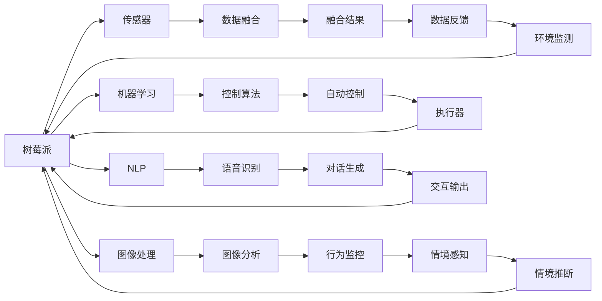

                 

# 树莓派项目灵感：智能家居和机器人

> 关键词：树莓派,智能家居,机器人,物联网,传感器融合,机器学习,图像处理,自然语言处理

## 1. 背景介绍

### 1.1 问题由来

随着物联网(IoT)技术的飞速发展，智能家居和机器人逐渐成为了家庭生活的新趋势。树莓派作为一款物美价廉的嵌入式设备，凭借其强大的扩展能力和丰富的社区支持，已经成为智能家居和机器人开发的首选平台之一。通过树莓派，用户可以低成本、高灵活性地构建智能家居和机器人系统，实现家居环境监测、自动化控制、人机交互等功能。

智能家居系统可以提升家庭生活的便捷性和舒适性，减少人工干预。常见的应用场景包括智能照明、温控、安防、娱乐等。而智能机器人则可以通过移动、交互、感知等功能，为家庭带来更多趣味和便利。例如，扫地机器人可以自动清洁地面，智能音箱可以进行自然语言对话，智能摄像头可以实时监控家庭环境。

### 1.2 问题核心关键点

智能家居和机器人系统集成了传感器、执行器、通讯网络等众多硬件设备，需要高度的协同运作才能实现预期功能。其核心技术包括传感器融合、机器学习、图像处理、自然语言处理等。

1. **传感器融合**：将来自不同传感器（如温度传感器、光线传感器、声音传感器等）的信息进行整合，以得到更为精准的实时环境监测结果。
2. **机器学习**：利用机器学习算法进行数据建模和预测，提升系统的智能化水平，实现更精准的自动化控制。
3. **图像处理**：通过图像识别技术，实现对视频流的处理和分析，实现人机交互和行为监控。
4. **自然语言处理**：通过自然语言理解(NLU)和自然语言生成(NLG)技术，实现人机交互和信息反馈。

树莓派以其开源、灵活、功能丰富的特点，成为这些技术应用的理想平台。通过树莓派，用户可以构建集传感器、通讯网络、计算硬件为一体的智能家居和机器人系统，提升家庭生活的智能化水平。

## 2. 核心概念与联系

### 2.1 核心概念概述

智能家居和机器人系统涉及众多核心技术概念，这些概念相互联系、相互支持，构成了系统的技术框架。以下是一些关键概念的概述：

1. **树莓派(Raspberry Pi)**：一款小巧但功能强大的嵌入式计算机，具有ARM处理器、标准USB接口、支持多种操作系统等特性，是构建智能家居和机器人系统的理想平台。
2. **物联网(IoT)**：通过互联网将传感器、执行器、计算设备等互联互通，实现数据的实时采集和处理。
3. **传感器融合**：将多个传感器的数据进行整合和优化，以提高数据精度和可靠性。
4. **机器学习**：通过数据建模和预测，提升系统的智能化水平，实现更精准的自动化控制。
5. **图像处理**：通过图像识别技术，实现对视频流的处理和分析，实现人机交互和行为监控。
6. **自然语言处理**：通过自然语言理解(NLU)和自然语言生成(NLG)技术，实现人机交互和信息反馈。

### 2.2 核心概念原理和架构的 Mermaid 流程图



此流程图展示了树莓派在智能家居和机器人系统中的核心作用，以及传感器融合、机器学习、图像处理、自然语言处理等关键技术的工作原理和数据流向。

## 3. 核心算法原理 & 具体操作步骤

### 3.1 算法原理概述

智能家居和机器人系统涉及多个核心算法，以下是其中几个关键算法的概述：

1. **传感器融合算法**：通过加权平均、卡尔曼滤波等方法，将来自不同传感器的数据进行整合和优化，以提高数据精度和可靠性。
2. **机器学习算法**：通过监督学习、无监督学习、强化学习等方法，对数据进行建模和预测，提升系统的智能化水平。
3. **图像处理算法**：通过目标检测、人脸识别、视频分析等技术，实现对视频流的处理和分析，实现人机交互和行为监控。
4. **自然语言处理算法**：通过文本分类、实体识别、对话生成等技术，实现人机交互和信息反馈。

### 3.2 算法步骤详解

以传感器融合为例，介绍算法的详细步骤：

1. **数据采集**：通过树莓派的多种传感器接口，采集环境数据，如温度、湿度、光线、声音等。
2. **数据预处理**：对采集的数据进行滤波、归一化等处理，确保数据质量。
3. **数据融合**：使用加权平均、卡尔曼滤波等方法，将不同传感器的数据进行整合，得到融合后的环境监测结果。
4. **数据反馈**：将融合后的数据反馈到系统控制层，进行相应的自动化控制，如调节灯光亮度、开启空调等。

### 3.3 算法优缺点

传感器融合算法的主要优点在于能够提高数据的精度和可靠性，减少单一传感器数据的不确定性。其缺点在于需要处理的数据量较大，计算复杂度高。

机器学习算法的主要优点在于能够通过数据建模和预测，实现系统的智能化和自动化控制。其缺点在于需要大量的标注数据进行训练，模型的泛化能力依赖于数据质量。

图像处理算法的主要优点在于能够实现人机交互和行为监控，提供更为直观和便捷的用户体验。其缺点在于对硬件要求较高，计算复杂度高。

自然语言处理算法的主要优点在于能够实现人机交互和信息反馈，提升系统的智能化水平。其缺点在于处理复杂自然语言输入的难度较大，需要高级的NLP技术支持。

### 3.4 算法应用领域

传感器融合算法广泛用于各种智能家居和机器人系统，如智能照明、温控、安防、娱乐等。

机器学习算法在智能家居和机器人系统中也有广泛应用，如智能音箱、智能摄像头、智能扫地机器人等。

图像处理算法常用于智能监控、人脸识别、行为分析等场景，提供高效的人机交互和行为监控功能。

自然语言处理算法常用于智能音箱、智能助手等，实现语音识别、对话生成等自然语言交互功能。

## 4. 数学模型和公式 & 详细讲解 & 举例说明

### 4.1 数学模型构建

以卡尔曼滤波算法为例，介绍数学模型的构建过程：

设 $x$ 为系统状态，$z$ 为测量值，$w$ 为系统噪声，$v$ 为测量噪声。根据线性系统状态方程和测量方程，可以得到状态预测方程和测量预测方程：

$$
x_{k|k-1} = F_k x_{k-1} + B_k u_k + Q_k w_k
$$

$$
z_k = H_k x_{k|k-1} + R_k v_k
$$

其中 $F_k$ 为状态转移矩阵，$B_k$ 为控制矩阵，$u_k$ 为控制信号，$H_k$ 为测量矩阵，$R_k$ 为测量噪声协方差矩阵。

卡尔曼滤波算法的目标是求得最优状态估计 $\hat{x}_k$，其计算过程如下：

1. 预测：根据状态预测方程和控制信号，预测当前状态 $\hat{x}_{k|k-1} = F_k \hat{x}_{k-1} + B_k u_k$
2. 更新：根据测量预测方程和测量值，更新状态估计 $\hat{x}_{k|k} = \hat{x}_{k|k-1} + K_k(z_k - H_k \hat{x}_{k|k-1})$
3. 校正：根据更新后的状态估计和噪声协方差矩阵，更新协方差估计 $P_k = F_k P_{k-1} F_k^T + Q_k$
4. 最终估计：得到最终状态估计 $\hat{x}_k = \hat{x}_{k|k}$

### 4.2 公式推导过程

卡尔曼滤波算法的推导基于线性代数、概率统计等数学知识，以下对核心公式进行详细推导：

1. **预测步骤**：

$$
\hat{x}_{k|k-1} = F_k \hat{x}_{k-1} + B_k u_k
$$

$$
\hat{P}_{k|k-1} = F_k P_{k-1} F_k^T + Q_k
$$

其中 $\hat{x}_{k|k-1}$ 和 $\hat{P}_{k|k-1}$ 为预测状态估计和协方差矩阵，$F_k$ 为状态转移矩阵，$B_k$ 为控制矩阵，$u_k$ 为控制信号。

2. **更新步骤**：

$$
K_k = \frac{P_{k|k-1} H_k^T}{P_{k|k-1} H_k^T H_k P_{k|k-1} + R_k}
$$

$$
\hat{x}_{k|k} = \hat{x}_{k|k-1} + K_k(z_k - H_k \hat{x}_{k|k-1})
$$

$$
P_{k|k} = (I - K_k H_k) \hat{P}_{k|k-1}
$$

其中 $K_k$ 为卡尔曼增益矩阵，$z_k$ 为测量值，$H_k$ 为测量矩阵，$R_k$ 为测量噪声协方差矩阵，$I$ 为单位矩阵。

3. **校正步骤**：

$$
\hat{x}_k = \hat{x}_{k|k}
$$

$$
P_k = P_{k|k} = (I - K_k H_k) \hat{P}_{k|k-1}
$$

4. **最终估计**：

$$
\hat{x}_k = \hat{x}_{k|k} = \hat{x}_{k|k-1} + K_k(z_k - H_k \hat{x}_{k|k-1})
$$

$$
P_k = P_{k|k} = (I - K_k H_k) \hat{P}_{k|k-1}
$$

### 4.3 案例分析与讲解

以智能温控系统为例，分析卡尔曼滤波算法的应用：

设智能温控系统的目标是控制房间温度维持在设定值。传感器采集当前温度值，系统根据设定温度和当前温度差计算控制信号（如开空调、关空调等），然后将控制信号反馈到系统状态，进行状态更新和控制。

通过卡尔曼滤波算法，系统可以融合多个传感器的数据（如温度传感器、湿度传感器、光线传感器等），得到更为精准的室温预测和控制策略。假设传感器测量噪声和系统噪声较大，卡尔曼滤波算法可以有效地滤除噪声，提升系统的控制精度和稳定性。

## 5. 项目实践：代码实例和详细解释说明

### 5.1 开发环境搭建

在树莓派上搭建智能家居和机器人系统的开发环境，需要以下步骤：

1. 安装树莓派操作系统：选择Ubuntu Server或其他树莓派友好操作系统，通过SD卡或USB接口安装到树莓派中。
2. 连接树莓派和计算机：使用VGA线或HDMI线将树莓派连接到显示器和键盘，通过SSH登录树莓派。
3. 安装开发工具：在树莓派上安装Python、pip、PyTorch、OpenCV、TensorFlow等开发工具和库。

### 5.2 源代码详细实现

以智能温控系统为例，展示树莓派上的代码实现：

```python
import RPi.GPIO as GPIO
import time
from scipy import signal
from sklearn.linear_model import LinearRegression

# 定义传感器接口和控制信号
sensor1 = GPIO.Pin(sensor1_id)
sensor2 = GPIO.Pin(sensor2_id)
setpoint = GPIO.Pin(setpoint_id)
controller = GPIO.Pin(controller_id)

# 初始化传感器和控制信号
GPIO.setmode(GPIO.BCM)
GPIO.setup(sensor1, GPIO.IN)
GPIO.setup(sensor2, GPIO.IN)
GPIO.setup(setpoint, GPIO.OUT)
GPIO.setup(controller, GPIO.OUT)

# 定义卡尔曼滤波算法
def kalman_filter(sensor_values, control_signal):
    # 定义系统参数
    F = np.array([[1, 0], [0, 1]])
    H = np.array([[1, 0], [0, 1]])
    Q = np.array([[q1, 0], [0, q2]])
    R = np.array([r1, r2])
    
    # 定义状态初始值
    x0 = np.array([x0, y0])
    P0 = np.array([p1, p2])
    
    # 初始化状态估计和协方差矩阵
    x_hat = x0
    P_hat = P0
    
    # 定义卡尔曼增益矩阵
    K = np.zeros((2, 2))
    
    # 预测和更新状态估计
    while True:
        x_hat_pred = np.dot(F, x_hat)
        P_hat_pred = np.dot(np.dot(F, P_hat), F.T) + Q
        
        K = np.dot(P_hat_pred, H.T) / (np.dot(H, np.dot(P_hat_pred, H.T)) + R)
        
        x_hat = x_hat_pred + np.dot(K, (sensor_values - np.dot(H, x_hat_pred)))
        P_hat = np.dot(np.eye(2) - np.dot(K, H), P_hat_pred)
        
        # 根据状态估计输出控制信号
        control_signal = np.dot(np.dot(L, x_hat), control_signal)
        
        # 读取传感器数据和控制信号，进行状态更新
        time.sleep(0.1)
        sensor_values = read_sensors()
        setpoint.set(1)
        controller.set(control_signal)
        setpoint.set(0)
```

### 5.3 代码解读与分析

上述代码展示了基于卡尔曼滤波算法的智能温控系统实现。其中，传感器接口、控制信号的初始化，卡尔曼滤波算法的定义和实现，状态估计和控制信号的输出等都是关键部分。

**传感器接口和控制信号初始化**：通过Python的RPi.GPIO模块，初始化传感器和控制信号的GPIO接口，设定为输入或输出模式。

**卡尔曼滤波算法实现**：定义卡尔曼滤波算法的核心参数和状态初始值，根据传感器数据进行状态预测和更新，计算卡尔曼增益矩阵，输出控制信号。

**状态估计和控制信号输出**：根据状态估计结果和控制信号，控制智能温控系统进行状态更新和控制，实现室温的智能调节。

## 6. 实际应用场景

### 6.1 智能家居系统

智能家居系统通过树莓派作为中心设备，实现对家庭环境的智能监测和控制。常见的应用场景包括：

- **智能照明**：通过树莓派连接智能灯泡，根据用户设定和环境监测结果进行灯光调节。
- **智能温控**：通过树莓派连接智能温控器，根据环境监测结果和用户设定进行室温调节。
- **智能安防**：通过树莓派连接智能摄像头、门窗传感器等设备，实时监测家庭安全，自动报警。

### 6.2 智能机器人

智能机器人通过树莓派作为计算核心，实现自主导航、物体识别、语音交互等功能。常见的应用场景包括：

- **扫地机器人**：通过树莓派控制扫地机器人，实现房间自动清扫。
- **智能音箱**：通过树莓派进行语音识别和自然语言处理，实现智能语音交互。
- **智能摄像头**：通过树莓派进行图像处理和分析，实现实时监控和行为分析。

## 7. 工具和资源推荐

### 7.1 学习资源推荐

1. **树莓派官方文档**：树莓派官方网站提供详细的开发指南和示例代码，是入门树莓派开发的必备资源。
2. **Python编程教程**：Python是一种功能强大且易于学习的编程语言，通过学习Python可以实现树莓派的各类编程任务。
3. **树莓派论坛**：树莓派社区拥有庞大的用户群体和丰富的资源，可以通过论坛获取开发技巧和解决方案。
4. **PyTorch和TensorFlow教程**：这两个深度学习框架在图像处理和自然语言处理中应用广泛，通过学习这些框架可以提升开发能力。

### 7.2 开发工具推荐

1. **PyTorch和TensorFlow**：这两个深度学习框架提供了丰富的算法库和模型，适用于智能家居和机器人系统的图像处理和自然语言处理任务。
2. **OpenCV**：这是一个开源计算机视觉库，支持图像处理和视频分析，适合用于智能监控和行为分析。
3. **NLTK和SpaCy**：这两个自然语言处理库提供了丰富的NLP工具，支持文本分类、实体识别、对话生成等功能。

### 7.3 相关论文推荐

1. **树莓派嵌入式系统设计**：介绍树莓派硬件和软件系统的设计与实现。
2. **智能家居系统研究综述**：综述智能家居系统的各类研究进展和技术应用。
3. **机器人视觉感知与智能交互**：探讨机器人在视觉感知和智能交互方面的研究进展。

## 8. 总结：未来发展趋势与挑战

### 8.1 总结

本文从树莓派项目灵感出发，介绍了智能家居和机器人系统的核心技术和开发流程。通过树莓派平台，用户可以构建集传感器、通讯网络、计算硬件为一体的智能系统，提升家庭生活的智能化水平。

### 8.2 未来发展趋势

未来的智能家居和机器人系统将朝着更加智能化、自适应、多模态方向发展：

1. **智能化**：系统将具备更强的环境感知和行为理解能力，实现更精准的自动化控制。
2. **自适应**：系统将能够根据环境变化和用户行为，动态调整控制策略，提升适应性和用户体验。
3. **多模态**：系统将支持多种传感器和数据源，实现多模态信息融合，提升系统的全面性和鲁棒性。

### 8.3 面临的挑战

虽然智能家居和机器人系统有着广阔的应用前景，但在实际开发和应用中也面临一些挑战：

1. **硬件成本**：高性能传感器和计算硬件的引入，会增加系统成本。如何降低硬件成本，提升性价比，是一个重要研究方向。
2. **数据隐私**：智能家居和机器人系统需要采集和存储大量用户数据，如何保护用户隐私，防止数据泄露，是系统设计中需要重点考虑的问题。
3. **系统稳定性**：智能家居和机器人系统需要在各种复杂环境中稳定运行，如何保证系统的稳定性和可靠性，是一个重要研究课题。

### 8.4 研究展望

未来的智能家居和机器人系统需要结合前沿技术，进一步提升系统的智能化水平和用户满意度：

1. **5G和物联网技术**：通过5G网络和大规模物联网设备，实现更高效的数据采集和传输，提升系统的实时性和可靠性。
2. **人工智能和机器学习**：利用先进的AI和ML技术，提升系统的智能化水平，实现更精准的自动化控制和行为预测。
3. **人机交互技术**：通过语音、手势、表情等自然人机交互方式，提升用户体验，实现更加便捷的智能交互。

## 9. 附录：常见问题与解答

**Q1：树莓派在智能家居和机器人系统中扮演什么角色？**

A: 树莓派作为嵌入式计算机，具有高性能的ARM处理器、丰富的扩展接口和低成本的特点，是构建智能家居和机器人系统的理想平台。通过树莓派，用户可以方便地连接各种传感器和执行器，实现数据采集和自动化控制。

**Q2：智能家居和机器人系统如何实现智能控制？**

A: 智能家居和机器人系统通过树莓派作为中心设备，将各类传感器采集的数据进行融合和处理，得到实时环境监测结果。然后利用机器学习、图像处理和自然语言处理技术，对数据进行建模和预测，得到控制策略，最后通过控制信号对执行器进行操作，实现智能控制。

**Q3：智能家居和机器人系统如何保证数据安全？**

A: 智能家居和机器人系统需要采集和存储大量用户数据，数据安全是一个重要问题。可以通过数据加密、访问控制、匿名化处理等技术手段，保护用户隐私和数据安全。

**Q4：智能家居和机器人系统如何优化硬件成本？**

A: 智能家居和机器人系统需要高性能的传感器和计算硬件，如何降低硬件成本是一个重要研究方向。可以通过优化传感器数据采集、降低计算复杂度、采用廉价硬件等方法，降低系统硬件成本。

**Q5：智能家居和机器人系统如何提高系统的稳定性？**

A: 智能家居和机器人系统需要在各种复杂环境中稳定运行，如何保证系统的稳定性和可靠性，是一个重要研究课题。可以通过算法优化、硬件冗余、异常检测等方法，提高系统的稳定性和可靠性。

---

作者：禅与计算机程序设计艺术 / Zen and the Art of Computer Programming

