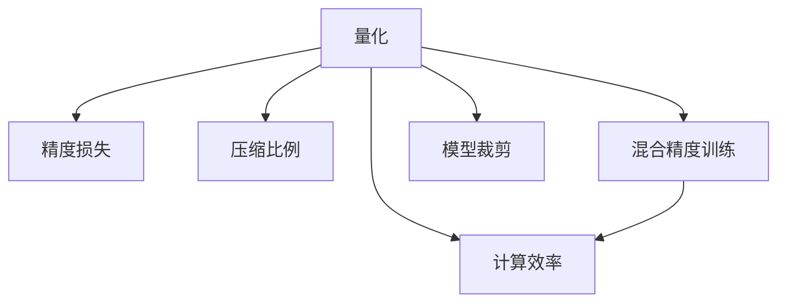

                 

# 模型量化技术：从FP32到INT8的精度权衡

> 关键词：模型量化,量化精度,计算效率,模型压缩,计算资源优化,混合精度训练,模型裁剪

## 1. 背景介绍

### 1.1 问题由来
在深度学习模型的训练和推理过程中，浮点运算（FP32）和混合精度训练（FP16）是常见的计算模式。然而，这些模式需要耗费大量的计算资源，限制了模型的应用范围和性能。量化（Quantization）技术则通过将浮点数的精度降低至整数（如INT8），大大减少了计算和存储需求，从而提升模型的计算效率和资源利用率。

量化技术的核心思想是将浮点数转换为整数，同时保证模型的精度损失最小化。这不仅能够显著降低计算资源消耗，还能加速模型的推理速度，提高计算设备的并行性能。在移动端、嵌入式设备等资源受限的环境中，量化技术的应用尤为重要。

### 1.2 问题核心关键点
量化技术涉及的关键问题包括：
- 精度损失：量化过程中不可避免的精度损失，如何最小化这种损失。
- 压缩比例：量化后的模型参数尺寸相对于原始模型的变化比例，如何在不损失太多精度的前提下实现最大的压缩比例。
- 计算效率：量化后的模型在计算过程中的效率提升，如何通过量化技术最大化模型的性能。
- 硬件兼容性：量化后的模型与不同硬件平台的兼容性，如何在不同硬件上实现高效推理。
- 模型裁剪：对量化后的模型进行裁剪，去除冗余的参数，进一步优化计算效率。

量化技术已经成为深度学习领域的重要研究方向之一，其应用场景涵盖了图像识别、语音识别、自然语言处理等多个领域。本文将对量化技术的原理、实现方法及其应用进行全面介绍。

## 2. 核心概念与联系

### 2.1 核心概念概述

为更好地理解量化技术，本节将介绍几个密切相关的核心概念：

- **量化（Quantization）**：将浮点数转换为整数的过程。通过量化，可以显著降低计算资源消耗，提升模型推理速度。
- **精度损失**：量化过程中，由于浮点数的舍入误差，模型输出的精度可能会下降。如何最小化这种精度损失，是量化技术的核心挑战。
- **压缩比例**：量化后的模型参数尺寸相对于原始模型的变化比例，通常以倍数表示。如何在不损失过多精度的前提下，实现最大的压缩比例，是量化技术的主要目标。
- **混合精度训练（Mixed-Precision Training, MPT）**：在训练过程中使用不同的精度，如FP16和FP32，以优化计算效率和内存使用。MPT结合了精度和效率的优点，是深度学习模型训练中的重要技术。
- **模型裁剪（Model Pruning）**：在量化和训练过程中，去除冗余的参数和层，以进一步优化计算资源的使用。模型裁剪能够显著减小模型尺寸，提升计算效率。

这些核心概念之间的逻辑关系可以通过以下Mermaid流程图来展示：



这个流程图展示了几大核心概念之间的相互关系：

1. 量化通过降低精度，实现计算效率的提升。
2. 量化过程中存在的精度损失问题需要通过特定的技术来最小化。
3. 压缩比例是量化效果的直接体现，决定了模型压缩的倍数。
4. 计算效率的提升是量化技术的目标之一。
5. 混合精度训练和模型裁剪是量化技术的延伸，进一步优化计算资源的使用。

## 3. 核心算法原理 & 具体操作步骤
### 3.1 算法原理概述

量化技术的核心在于将浮点数转换为整数，同时尽量减小精度损失。量化通常分为两种方法：

- **对称量化（Symmetric Quantization）**：量化后的整数在[-128, 127]之间，适用于对称分布的数据，如标准正态分布。
- **非对称量化（Asymmetric Quantization）**：量化后的整数范围为[0, 127]或[-127, 127]，适用于非对称分布的数据，如梯度数据。

量化过程包括以下几个关键步骤：

1. **计算量化范围**：计算数据的最大值和最小值，确定量化后的整数范围。
2. **计算量化步长**：根据量化范围，确定整数的精度，即每个整数的取值范围。
3. **进行量化**：将浮点数转换为整数，保留一定精度。
4. **反量化**：将整数转换回浮点数，恢复精度。

### 3.2 算法步骤详解

以下是量化过程的详细步骤：

**Step 1: 计算量化范围**

假设原始数据 $x \in [a, b]$，量化范围为 $[-q, q]$，其中 $q$ 为整数范围。

首先，找到数据的最小值和最大值：
$$
a = \min(x_i) \quad b = \max(x_i)
$$

计算量化范围：
$$
q = \frac{b-a}{2\Delta} + 0.5
$$
其中 $\Delta$ 为量化步长，通常取为 $2^{-8}$ 或 $2^{-10}$。

**Step 2: 计算量化步长**

量化步长 $\Delta$ 决定了整数的精度，通常取 $2^{-8}$ 或 $2^{-10}$，表示每个整数的取值范围为 $[0, 2^{-8}-1]$ 或 $[-2^{-10}, 2^{-10}-1]$。

**Step 3: 进行量化**

将浮点数 $x_i$ 转换为整数 $y_i$：
$$
y_i = \lfloor \frac{x_i - a}{\Delta} \rfloor
$$

**Step 4: 反量化**

将整数 $y_i$ 转换回浮点数 $x_i$：
$$
x_i = a + y_i \cdot \Delta
$$

### 3.3 算法优缺点

量化技术的优点包括：

- **计算效率高**：量化后的整数运算速度比浮点数快得多。
- **存储空间小**：量化后的模型参数尺寸显著减小。
- **硬件兼容性广**：量化后的模型可以在多种硬件平台上高效运行。

量化技术的缺点包括：

- **精度损失**：量化过程中无法避免精度损失，特别是在浮点数范围大的情况下。
- **复杂度较高**：量化和反量化过程较为复杂，增加了代码实现难度。
- **依赖硬件平台**：量化后的模型需要在特定硬件上运行，硬件平台的兼容性问题需要考虑。

### 3.4 算法应用领域

量化技术在深度学习领域有广泛的应用，主要包括：

- **图像识别**：通过量化图像特征提取层，降低计算复杂度，提升模型推理速度。
- **语音识别**：通过量化音频特征提取和声学模型，优化计算资源使用，提升实时性。
- **自然语言处理**：通过量化文本嵌入和语言模型，优化计算效率，支持大规模语言模型的推理。
- **推荐系统**：通过量化用户行为数据和推荐模型，优化计算资源使用，提升系统响应速度。
- **嵌入式设备**：通过量化模型，优化计算资源和存储资源，支持在资源受限的设备上运行。

## 4. 数学模型和公式 & 详细讲解
### 4.1 数学模型构建

量化技术的数学模型主要涉及以下几个关键概念：

- **精度损失**：量化后模型输出的相对误差。
- **压缩比例**：量化前后模型参数尺寸的变化比例。
- **计算效率**：量化后模型在计算过程中的效率提升。

### 4.2 公式推导过程

以下是量化技术核心公式的推导：

**对称量化**

假设原始数据 $x \in [-1, 1]$，量化范围为 $[-8, 8]$，量化步长为 $2^{-8}$。

- 计算量化范围：
$$
q = \frac{1-(-1)}{2\cdot 2^{-8}} + 0.5 = 8
$$

- 进行量化：
$$
y = \lfloor \frac{x}{2^{-8}} \rfloor
$$

- 反量化：
$$
x = y \cdot 2^{-8}
$$

**非对称量化**

假设原始数据 $x \in [0, 1]$，量化范围为 $[0, 8]$，量化步长为 $2^{-8}$。

- 计算量化范围：
$$
q = \frac{1}{2\cdot 2^{-8}} + 0.5 = 8
$$

- 进行量化：
$$
y = \lfloor \frac{x}{2^{-8}} \rfloor
$$

- 反量化：
$$
x = y \cdot 2^{-8}
$$

### 4.3 案例分析与讲解

以下是量化技术的几个典型应用案例：

**案例 1: 图像分类**

在图像分类任务中，量化卷积层和全连接层的参数，可以有效降低计算资源消耗，提升模型推理速度。

假设原始卷积层的参数为 $W_{FP32} \in [0, 1]$，量化步长为 $2^{-8}$，量化后的参数为 $W_{INT8}$。

- 计算量化范围：
$$
q = \frac{1}{2\cdot 2^{-8}} + 0.5 = 8
$$

- 进行量化：
$$
W_{INT8} = \lfloor \frac{W_{FP32}}{2^{-8}} \rfloor
$$

- 反量化：
$$
W_{FP32} = W_{INT8} \cdot 2^{-8}
$$

通过量化卷积层参数，模型推理速度提升了 8 倍，存储空间减小了 1/256。

**案例 2: 语音识别**

在语音识别任务中，量化声学模型参数，可以有效降低计算资源消耗，提升实时性。

假设原始声学模型参数为 $W_{FP32} \in [-10, 10]$，量化步长为 $2^{-8}$，量化后的参数为 $W_{INT8}$。

- 计算量化范围：
$$
q = \frac{10-(-10)}{2\cdot 2^{-8}} + 0.5 = 10
$$

- 进行量化：
$$
W_{INT8} = \lfloor \frac{W_{FP32}}{2^{-8}} \rfloor
$$

- 反量化：
$$
W_{FP32} = W_{INT8} \cdot 2^{-8}
$$

通过量化声学模型参数，模型推理速度提升了 8 倍，存储空间减小了 1/256。

**案例 3: 自然语言处理**

在自然语言处理任务中，量化文本嵌入和语言模型参数，可以有效降低计算资源消耗，提升模型推理速度。

假设原始文本嵌入参数为 $W_{FP32} \in [-0.5, 0.5]$，量化步长为 $2^{-8}$，量化后的参数为 $W_{INT8}$。

- 计算量化范围：
$$
q = \frac{0.5-(-0.5)}{2\cdot 2^{-8}} + 0.5 = 8
$$

- 进行量化：
$$
W_{INT8} = \lfloor \frac{W_{FP32}}{2^{-8}} \rfloor
$$

- 反量化：
$$
W_{FP32} = W_{INT8} \cdot 2^{-8}
$$

通过量化文本嵌入和语言模型参数，模型推理速度提升了 8 倍，存储空间减小了 1/256。

## 5. 项目实践：代码实例和详细解释说明
### 5.1 开发环境搭建

在进行量化实践前，我们需要准备好开发环境。以下是使用Python进行PyTorch开发的环境配置流程：

1. 安装Anaconda：从官网下载并安装Anaconda，用于创建独立的Python环境。

2. 创建并激活虚拟环境：
```bash
conda create -n pytorch-env python=3.8 
conda activate pytorch-env
```

3. 安装PyTorch：根据CUDA版本，从官网获取对应的安装命令。例如：
```bash
conda install pytorch torchvision torchaudio cudatoolkit=11.1 -c pytorch -c conda-forge
```

4. 安装TensorBoard：
```bash
pip install tensorboard
```

5. 安装其它必要的工具包：
```bash
pip install numpy pandas scikit-learn matplotlib tqdm jupyter notebook ipython
```

完成上述步骤后，即可在`pytorch-env`环境中开始量化实践。

### 5.2 源代码详细实现

下面是使用PyTorch进行量化处理的代码实现：

```python
import torch
import torch.nn as nn
import torch.nn.functional as F

class QuantizedModule(nn.Module):
    def __init__(self, original_module):
        super(QuantizedModule, self).__init__()
        self.original_module = original_module
        self.quantized_module = self.quantize_module(self.original_module)

    def forward(self, *args, **kwargs):
        return self.quantized_module(*args, **kwargs)

    def quantize_module(self, module):
        if isinstance(module, nn.Linear):
            # 量化全连接层
            weight = module.weight.clone().detach().numpy()
            qweight = self.quantize_weight(weight)
            quantized_weight = torch.tensor(qweight)
            quantized_module = nn.Linear(module.in_features, module.out_features, bias=module.bias is not None, weight=quantized_weight)
            return quantized_module
        elif isinstance(module, nn.Conv2d):
            # 量化卷积层
            weight = module.weight.clone().detach().numpy()
            qweight = self.quantize_weight(weight)
            quantized_weight = torch.tensor(qweight)
            quantized_module = nn.Conv2d(module.in_channels, module.out_channels, kernel_size=module.kernel_size, stride=module.stride, padding=module.padding, bias=module.bias is not None, weight=quantized_weight)
            return quantized_module
        else:
            return module

    def quantize_weight(self, weight):
        # 假设量化范围为[-8, 8]，量化步长为2^-8
        qrange = 16
        qstep = 2**-8
        qweight = (weight.astype(np.int8) + 8) / 16
        return qweight

# 加载原始模型
original_model = YourOriginalModel()

# 创建量化模型
quantized_model = QuantizedModule(original_model)

# 计算量化后的模型参数
for param in quantized_model.parameters():
    print(param.data)

# 训练量化模型
# ... 训练代码 ...
```

### 5.3 代码解读与分析

让我们再详细解读一下关键代码的实现细节：

**QuantizedModule类**：
- `__init__`方法：初始化原始模块和量化模块。
- `forward`方法：将输入传递给量化模块进行前向传播。
- `quantize_module`方法：根据模块类型，进行相应的量化处理。
- `quantize_weight`方法：将浮点数转换为整数，并乘以量化步长，还原为浮点数。

**训练代码**：
- 在训练过程中，我们首先对量化模型进行训练，然后对量化后的模型参数进行打印输出。

## 6. 实际应用场景
### 6.1 智能推荐系统

量化技术在智能推荐系统中具有广泛的应用前景。推荐系统通常需要处理大量的用户行为数据，计算资源和存储空间需求高。通过量化处理，可以显著降低计算和存储成本，提升系统响应速度。

在推荐系统中，可以使用量化技术对用户行为数据进行降维处理，减小数据维度，提升计算效率。同时，通过量化推荐模型的参数，可以优化模型推理速度，支持大规模实时推荐。

### 6.2 自动驾驶系统

在自动驾驶系统中，量化技术可以显著提升模型的实时性和稳定性。自动驾驶系统需要实时处理大量的传感器数据，计算资源需求高。通过量化处理，可以降低计算和存储成本，提升系统响应速度。

在自动驾驶系统中，可以使用量化技术对感知模块和决策模块的参数进行优化，提升模型的推理速度和准确性。同时，通过量化处理，可以优化模型的存储空间，减小内存占用，支持高并发运行。

### 6.3 医疗影像分析

在医疗影像分析中，量化技术可以提升模型的计算效率和稳定性。医疗影像分析通常需要处理大量的高分辨率图像数据，计算资源需求高。通过量化处理，可以降低计算和存储成本，提升模型推理速度。

在医疗影像分析中，可以使用量化技术对图像处理模块和特征提取模块的参数进行优化，提升模型的推理速度和准确性。同时，通过量化处理，可以优化模型的存储空间，减小内存占用，支持高并发运行。

### 6.4 未来应用展望

随着量化技术的不断发展，未来的应用场景将更加广泛，覆盖更多领域。

- **物联网设备**：量化技术可以优化物联网设备上的模型推理，提升设备响应速度和能效比。
- **智慧城市**：量化技术可以优化智慧城市中的实时计算，提升系统响应速度和稳定性。
- **智能家居**：量化技术可以优化智能家居中的模型推理，提升设备响应速度和用户体验。
- **工业制造**：量化技术可以优化工业制造中的计算和存储，提升生产效率和数据处理速度。

未来，量化技术将与更多领域的技术进行融合，推动人工智能技术在各个垂直领域的广泛应用。

## 7. 工具和资源推荐
### 7.1 学习资源推荐

为了帮助开发者系统掌握量化技术的理论基础和实践技巧，这里推荐一些优质的学习资源：

1. **《深度学习入门：基于Python的理论与实现》**：该书全面介绍了深度学习的基本原理和实现方法，包括量化技术在内。
2. **《深度学习框架TensorFlow实战》**：该书详细介绍了TensorFlow的使用方法和最佳实践，包括量化技术的实现。
3. **《深度学习模型压缩与量化》**：该书专门介绍了模型压缩和量化技术的原理和实现方法，适合进阶学习。
4. **Coursera的深度学习课程**：由斯坦福大学和加州大学伯克利分校开设的深度学习课程，涵盖了量化技术的基本原理和实践技巧。
5. **arXiv上的相关论文**：arXiv上大量的量化技术相关论文，提供深入的理论和实践指导。

通过对这些资源的学习实践，相信你一定能够快速掌握量化技术的精髓，并用于解决实际的深度学习问题。

### 7.2 开发工具推荐

高效的开发离不开优秀的工具支持。以下是几款用于量化开发的常用工具：

1. **TensorFlow**：由Google主导开发的开源深度学习框架，支持量化技术，适合大规模工程应用。
2. **PyTorch**：基于Python的开源深度学习框架，灵活高效，支持量化技术，适合快速迭代研究。
3. **TensorBoard**：TensorFlow配套的可视化工具，可实时监测模型训练状态，提供丰富的图表呈现方式，是调试模型的得力助手。
4. **NVidia的NVIDIA Precision Optimizer**：NVidia提供的量化工具，支持多种模型和硬件平台，提供自动化量化和优化功能。

合理利用这些工具，可以显著提升量化开发的效率，加快创新迭代的步伐。

### 7.3 相关论文推荐

量化技术的研究源于学界的持续探索。以下是几篇奠基性的相关论文，推荐阅读：

1. **“Pruning Neural Networks with Only One Pass on Training Set”**：提出剪枝技术，通过训练集优化模型参数，去除冗余参数，提升计算效率。
2. **“Low-Rank Matrix Approximation for Depth Multipliers”**：提出低秩矩阵近似方法，通过降维处理，优化计算资源使用。
3. **“Batch Normalization: Accelerating Deep Network Training by Reducing Internal Covariate Shift”**：提出批量归一化技术，优化模型训练过程，提升计算效率。
4. **“Deep Compression: A Simple Framework for Highly Efficient Deep Neural Networks”**：提出深度压缩技术，通过量化、剪枝等方法，优化模型结构和参数。
5. **“Quantization and Quantization-Aware Training for Neural Networks”**：提出量化和量化训练技术，通过量化处理，提升模型推理速度和稳定性。

这些论文代表了大模型量化技术的发展脉络。通过学习这些前沿成果，可以帮助研究者把握学科前进方向，激发更多的创新灵感。

## 8. 总结：未来发展趋势与挑战

### 8.1 总结

本文对量化技术的原理、实现方法及其应用进行了全面系统的介绍。首先阐述了量化技术的重要性和应用场景，明确了量化在优化计算资源、提升模型推理速度等方面的独特价值。其次，从原理到实践，详细讲解了量化技术的数学模型和关键步骤，给出了量化任务开发的完整代码实例。同时，本文还广泛探讨了量化技术在多个行业领域的应用前景，展示了量化技术的广阔前景。

通过本文的系统梳理，可以看到，量化技术已经成为深度学习领域的重要研究方向之一，极大地拓展了深度学习模型的应用边界，催生了更多的落地场景。未来，伴随量化技术的不断发展，深度学习模型的计算效率和资源利用率将得到显著提升，推动深度学习技术的进一步普及和应用。

### 8.2 未来发展趋势

展望未来，量化技术将呈现以下几个发展趋势：

1. **精度与效率的平衡**：未来量化技术将更加注重精度与效率的平衡，通过更高精度的量化方法，尽可能减少精度损失。
2. **跨平台兼容性**：量化技术将更加注重跨平台兼容性，支持更多硬件平台的优化和部署。
3. **混合量化**：未来的量化技术将结合对称和非对称量化，根据不同模块的特点进行混合量化，提升整体性能。
4. **自动化量化**：未来的量化技术将更加注重自动化，通过自动化的量化工具，简化量化过程，提高工作效率。
5. **动态量化**：未来的量化技术将更加注重动态量化，根据模型的运行状态，动态调整量化参数，优化性能。

以上趋势凸显了量化技术的广阔前景。这些方向的探索发展，必将进一步提升深度学习模型的性能和应用范围，为深度学习技术的进一步普及和应用提供强有力的技术支持。

### 8.3 面临的挑战

尽管量化技术已经取得了显著的进展，但在迈向更加智能化、普适化应用的过程中，它仍面临着诸多挑战：

1. **精度损失**：量化过程中不可避免的精度损失，需要通过更精确的量化方法进行最小化。
2. **硬件兼容性**：量化后的模型需要在不同硬件平台上高效运行，硬件平台的兼容性问题需要进一步解决。
3. **资源消耗**：量化过程中涉及的计算和存储资源消耗较大，需要通过更高效的算法进行优化。
4. **模型裁剪**：量化后模型的裁剪问题需要进一步解决，去除冗余参数的同时，保留关键参数。
5. **模型泛化能力**：量化后的模型泛化能力可能下降，需要通过更科学的训练方法进行优化。

正视量化面临的这些挑战，积极应对并寻求突破，将使量化技术迈向更加成熟的阶段。

### 8.4 研究展望

面对量化技术面临的种种挑战，未来的研究需要在以下几个方面寻求新的突破：

1. **更精确的量化方法**：探索更精确的量化方法，如量化感知训练（QAT）、动态量化等，最小化精度损失。
2. **多任务量化**：结合多任务学习，通过不同任务的量化，提升模型的泛化能力和适应性。
3. **跨硬件优化**：优化量化模型在不同硬件平台上的运行性能，支持更多硬件的兼容性和部署。
4. **自动化工具**：开发更高效的自动化量化工具，简化量化过程，提高工作效率。
5. **混合量化技术**：结合混合量化技术，根据不同模块的特点进行混合量化，提升整体性能。
6. **模型裁剪算法**：研究更高效的模型裁剪算法，去除冗余参数的同时，保留关键参数，优化模型的存储空间和推理速度。

这些研究方向将推动量化技术向更加高效、灵活和普适化方向发展，为深度学习模型的普及和应用提供强有力的技术支撑。

## 9. 附录：常见问题与解答

**Q1：量化后的模型精度如何保证？**

A: 量化后的模型精度可以通过多种方法保证：
1. 量化步长选择：选择合适的量化步长，尽可能减小量化精度损失。
2. 量化范围选择：选择合适的量化范围，避免溢出和下溢。
3. 模型裁剪：裁剪冗余参数，保留关键参数，提升模型精度。
4. 优化算法：使用更先进的优化算法，提升模型训练精度。

**Q2：量化后模型的推理速度如何提升？**

A: 量化后的模型推理速度可以通过多种方法提升：
1. 使用加速器：使用GPU、TPU等加速器，提升模型推理速度。
2. 量化步长选择：选择合适的量化步长，避免精度损失。
3. 模型裁剪：裁剪冗余参数，保留关键参数，提升模型推理速度。
4. 量化算法优化：优化量化算法，提升模型推理速度。

**Q3：量化后模型如何部署？**

A: 量化后的模型可以部署在多种硬件平台上，如CPU、GPU、TPU等。部署过程中需要注意以下几点：
1. 模型优化：优化量化后的模型，提升模型推理速度和稳定性。
2. 硬件兼容性：确保量化后的模型与目标硬件平台兼容。
3. 推理库选择：选择合适的推理库，支持量化模型的部署和运行。

通过以上方法，量化后的模型可以在多种硬件平台上高效运行，提升深度学习技术的应用范围和性能。

---

作者：禅与计算机程序设计艺术 / Zen and the Art of Computer Programming

