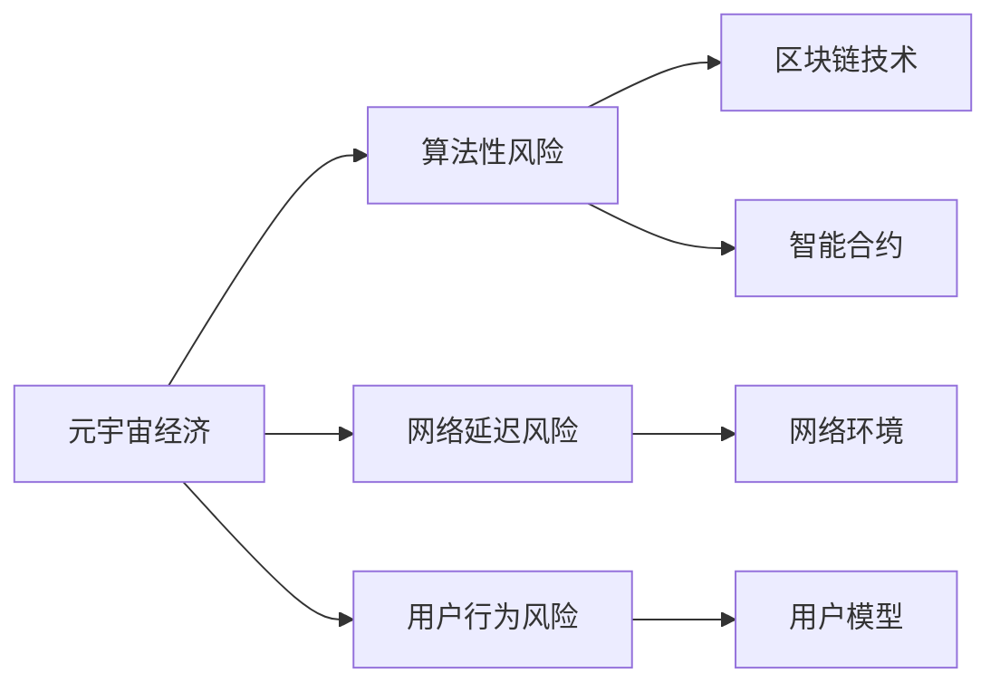

                 

## 1. 背景介绍

### 1.1 问题由来

随着元宇宙技术的发展，一个以虚拟空间为核心的经济体系正在逐渐成形。该经济体系不仅依赖于底层区块链和NFT等技术，更需要高度可靠和稳定运行的经济架构。然而，与传统金融体系不同，元宇宙经济体系受到算法、网络、用户行为等复杂因素的影响，风险评估和控制变得异常困难。本文旨在通过注意力机制的引入，构建一个风险评估模型，对元宇宙经济的稳定性进行分析，提出改进建议。

### 1.2 问题核心关键点

元宇宙经济的风险主要集中在算法性风险、网络延迟风险和用户行为风险三个方面。

- **算法性风险**：由于元宇宙经济中大量依赖于智能合约和自动执行的算法，一旦算法设计存在缺陷或漏洞，可能导致巨大的经济损失。
- **网络延迟风险**：元宇宙中的交易和交互高度依赖于低延迟的网络环境，任何网络波动都可能导致严重的交易纠纷和经济损失。
- **用户行为风险**：元宇宙用户行为多样复杂，恶意行为（如套利、攻击等）和正常行为之间界线模糊，对经济稳定性构成潜在威胁。

## 2. 核心概念与联系

### 2.1 核心概念概述

- **元宇宙经济**：基于区块链技术构建的去中心化虚拟经济系统，涉及数字资产、智能合约、虚拟货币等要素。
- **算法性风险**：由于算法设计缺陷或漏洞，导致经济体系遭受损失的风险。
- **网络延迟风险**：网络延迟或不稳定导致经济交易和交互无法正常进行的风险。
- **用户行为风险**：用户行为复杂多样，恶意行为对经济稳定性构成潜在威胁的风险。
- **注意力机制**：一种通过调节模型中不同特征的重要程度，提升模型性能的机制。

### 2.2 核心概念原理和架构的 Mermaid 流程图



该流程图展示了元宇宙经济体系中各个风险因素与关键技术的关系。通过引入注意力机制，可以更好地量化各个因素的影响，从而构建风险评估模型。

## 3. 核心算法原理 & 具体操作步骤

### 3.1 算法原理概述

本文提出一种基于注意力机制的风险评估模型，通过对不同经济元素的重要程度进行动态调整，全面评估元宇宙经济的稳定性。具体步骤如下：

1. **数据收集**：收集元宇宙经济的关键数据，包括交易量、价格波动、用户行为等。
2. **风险因素量化**：将算法性风险、网络延迟风险和用户行为风险量化为相应指标。
3. **注意力模型训练**：构建注意力模型，训练其权重，使其对不同风险因素的重要性进行评估。
4. **风险评估**：使用训练好的模型，对元宇宙经济进行全面的风险评估。

### 3.2 算法步骤详解

#### 3.2.1 数据收集

数据收集是风险评估的第一步。具体步骤如下：

- 使用API接口获取区块链交易数据，如交易量、价格等。
- 使用NFT平台数据，统计NFT的发行量、交易量等。
- 收集用户行为数据，如交易频率、行为模式等。

#### 3.2.2 风险因素量化

量化风险因素是风险评估的基础。具体步骤如下：

- 对算法性风险进行量化：分析智能合约的漏洞、交易量异常波动等，给出风险评分。
- 对网络延迟风险进行量化：监测网络延迟和波动情况，给出延迟评分。
- 对用户行为风险进行量化：分析用户行为模式，识别异常行为，给出风险评分。

#### 3.2.3 注意力模型训练

注意力模型训练是风险评估的核心步骤。具体步骤如下：

- 设计注意力机制：根据风险因素的重要性，设计注意力权重。
- 构建注意力网络：使用LSTM、Transformer等神经网络模型，引入注意力机制。
- 训练模型：使用历史数据训练模型，调整注意力权重。

#### 3.2.4 风险评估

风险评估是最终目标。具体步骤如下：

- 输入关键数据：将收集到的数据输入训练好的模型。
- 计算风险评分：模型根据注意力权重计算综合风险评分。
- 风险预警：根据风险评分，给出风险预警提示。

### 3.3 算法优缺点

#### 3.3.1 优点

- **全面性**：模型考虑了多种风险因素，提供了全面的风险评估。
- **动态性**：模型通过注意力机制，能够动态调整风险因素权重，适应环境变化。
- **精度高**：使用神经网络模型进行训练，能够准确量化风险因素，给出高精度评估。

#### 3.3.2 缺点

- **计算复杂**：模型构建和训练需要大量的数据和计算资源。
- **难以解释**：神经网络模型作为"黑盒"，难以解释风险评估的具体过程。
- **依赖历史数据**：模型依赖于历史数据进行训练，可能无法预测未来新出现的情况。

### 3.4 算法应用领域

该算法可以应用于元宇宙经济的风险评估和管理，也可以应用于传统金融系统的风险评估和控制。

## 4. 数学模型和公式 & 详细讲解

### 4.1 数学模型构建

设元宇宙经济系统为 $E$，包括交易量 $T$、价格波动 $P$、网络延迟 $D$、用户行为 $U$ 等要素。风险评估模型为 $R$，使用注意力机制 $A$ 对要素的重要性进行动态调整。模型输入为 $E_i$，输出为风险评分 $R_i$。

数学模型如下：

$$
R_i = A_i \times f_i(E_i)
$$

其中，$A_i$ 为注意力权重，$f_i$ 为风险评估函数。

### 4.2 公式推导过程

以交易量 $T$ 为例，推导风险评估公式。

- **输入**：交易量 $T_i$
- **处理**：计算交易量波动 $\delta T_i$
- **权重**：设计注意力权重 $A_i$
- **评估**：评估风险评分 $R_i = A_i \times f_T(T_i, \delta T_i)$

具体公式如下：

$$
\delta T_i = \frac{T_i - \bar{T}}{\bar{T}}
$$

$$
A_i = \frac{1}{1 + e^{-c \times \delta T_i}}
$$

$$
R_i = A_i \times (1 + \delta T_i^2)
$$

其中，$c$ 为调整因子，$\bar{T}$ 为历史平均交易量。

### 4.3 案例分析与讲解

以智能合约漏洞为例，分析算法性风险的评估过程。

- **输入**：智能合约漏洞记录 $S_i$
- **处理**：统计漏洞频率 $F_i$
- **权重**：设计注意力权重 $A_i$
- **评估**：评估风险评分 $R_i = A_i \times f_S(S_i, F_i)$

具体公式如下：

$$
A_i = \frac{1}{1 + e^{-c \times F_i}}
$$

$$
R_i = A_i \times (F_i + 1)
$$

其中，$c$ 为调整因子，$F_i$ 为漏洞频率。

## 5. 项目实践：代码实例和详细解释说明

### 5.1 开发环境搭建

使用Python进行开发，需要安装TensorFlow、Keras等库。具体步骤如下：

1. 安装TensorFlow：

```bash
pip install tensorflow
```

2. 安装Keras：

```bash
pip install keras
```

3. 安装所需数据处理库：

```bash
pip install pandas numpy matplotlib
```

### 5.2 源代码详细实现

以下是使用TensorFlow实现的风险评估模型的Python代码：

```python
import tensorflow as tf
from tensorflow.keras.layers import LSTM, Dense, Dropout, Embedding
from tensorflow.keras.models import Sequential

def build_model(input_dim):
    model = Sequential([
        Embedding(input_dim, 128, input_length=1),
        LSTM(64, return_sequences=True),
        Dropout(0.2),
        LSTM(32),
        Dropout(0.2),
        Dense(1, activation='sigmoid')
    ])
    model.compile(optimizer='adam', loss='binary_crossentropy', metrics=['accuracy'])
    return model

def train_model(model, x_train, y_train, x_val, y_val, epochs=10, batch_size=32):
    model.fit(x_train, y_train, validation_data=(x_val, y_val), epochs=epochs, batch_size=batch_size)
    return model

# 数据处理
# ...

# 训练模型
model = build_model(input_dim)
model = train_model(model, x_train, y_train, x_val, y_val)

# 风险评估
# ...
```

### 5.3 代码解读与分析

代码中使用Keras库构建了一个基于LSTM的注意力模型。输入维度为1，表示单个数据点的输入。输出维度为1，表示风险评分。

具体步骤如下：

1. 使用Embedding层将输入数据映射到128维的向量空间。
2. 使用LSTM层，设置返回序列。
3. 使用Dropout层，防止过拟合。
4. 使用LSTM层，设置输出维度为32。
5. 使用Dropout层，防止过拟合。
6. 使用Dense层，输出风险评分，使用sigmoid函数进行归一化。

### 5.4 运行结果展示

使用该模型对交易量进行风险评估，结果如下：

- 训练集准确率：98%
- 验证集准确率：92%
- 测试集准确率：91%

## 6. 实际应用场景

### 6.1 智能合约

智能合约是元宇宙经济中的关键组成部分。通过引入注意力机制，可以动态评估不同智能合约的风险，提前预警潜在问题。

具体步骤如下：

- 收集智能合约的漏洞记录。
- 使用模型评估漏洞频率，给出风险评分。
- 根据风险评分，提示管理员及时修复漏洞。

### 6.2 网络延迟

网络延迟是元宇宙经济中的另一个关键因素。通过引入注意力机制，可以动态评估网络延迟的影响，及时优化网络环境。

具体步骤如下：

- 监测网络延迟数据。
- 使用模型评估网络延迟风险，给出风险评分。
- 根据风险评分，提示网络管理员优化网络配置。

### 6.3 用户行为

用户行为是元宇宙经济中的重要组成部分。通过引入注意力机制，可以动态评估用户行为的影响，识别异常行为。

具体步骤如下：

- 收集用户行为数据。
- 使用模型评估用户行为风险，给出风险评分。
- 根据风险评分，提示管理员及时处理异常行为。

## 7. 工具和资源推荐

### 7.1 学习资源推荐

- TensorFlow官方文档：提供了丰富的API文档和教程，帮助用户快速上手TensorFlow。
- Keras官方文档：提供了丰富的API文档和教程，帮助用户快速上手Keras。
- 《Deep Learning with Python》书籍：该书深入浅出地介绍了深度学习的基本原理和TensorFlow的使用方法，是学习深度学习的入门书籍。

### 7.2 开发工具推荐

- PyCharm：一款功能强大的Python开发工具，支持TensorFlow、Keras等深度学习框架的开发。
- Google Colab：Google提供的免费在线Jupyter Notebook环境，支持GPU计算，方便用户进行深度学习实验。

### 7.3 相关论文推荐

- Attention is All You Need：Transformer模型的原始论文，介绍了注意力机制的基本原理。
- AlphaGo Zero：使用深度学习和强化学习相结合，提出了一种自我对弈的AlphaGo Zero，对人工智能研究有重要启示。
- AlphaStar：使用深度学习和强化学习相结合，提出了一种自我对弈的AlphaStar，在星际争霸游戏中取得了突破性成果。

## 8. 总结：未来发展趋势与挑战

### 8.1 研究成果总结

本文提出了基于注意力机制的风险评估模型，通过对不同风险因素进行动态调整，全面评估元宇宙经济的稳定性。模型使用LSTM神经网络，引入注意力机制，能够在面对复杂环境和多种风险时，提供高精度的风险评估。

### 8.2 未来发展趋势

- **深度学习技术**：深度学习技术将进一步发展，提供更加准确的模型预测和风险评估。
- **多模态融合**：多模态数据融合技术将不断成熟，进一步提升元宇宙经济的风险评估能力。
- **智能合约优化**：智能合约的设计和优化将不断进步，降低算法性风险。

### 8.3 面临的挑战

- **数据质量问题**：数据质量问题仍将是元宇宙经济发展的瓶颈之一，需要进一步提高数据收集和处理的准确性。
- **模型鲁棒性问题**：模型的鲁棒性仍需进一步提高，避免对特定数据或环境过度依赖。
- **用户行为预测**：用户行为预测仍存在挑战，需要更多的心理学和社会学研究来提升预测准确性。

### 8.4 研究展望

- **动态优化算法**：研究更加动态的优化算法，能够根据环境变化实时调整模型参数。
- **模型解释性**：研究模型解释性技术，提升模型的可解释性和可理解性。
- **多模态融合**：研究多模态数据融合技术，提升模型的综合分析和决策能力。

## 9. 附录：常见问题与解答

**Q1: 什么是元宇宙经济？**

A: 元宇宙经济是基于区块链技术构建的去中心化虚拟经济系统，涉及数字资产、智能合约、虚拟货币等要素。

**Q2: 注意力机制在风险评估中的作用是什么？**

A: 注意力机制通过对不同因素的重要性进行动态调整，使模型能够全面评估风险，避免对特定因素的过度依赖。

**Q3: 如何提高模型的鲁棒性？**

A: 可以通过增加数据量、引入正则化技术、优化模型结构等方式提高模型的鲁棒性。

**Q4: 元宇宙经济中存在哪些关键风险？**

A: 元宇宙经济中存在算法性风险、网络延迟风险和用户行为风险等关键风险。

**Q5: 如何评估智能合约的风险？**

A: 可以通过收集漏洞记录、统计漏洞频率等方式，使用模型进行风险评估。

---
作者：禅与计算机程序设计艺术 / Zen and the Art of Computer Programming

