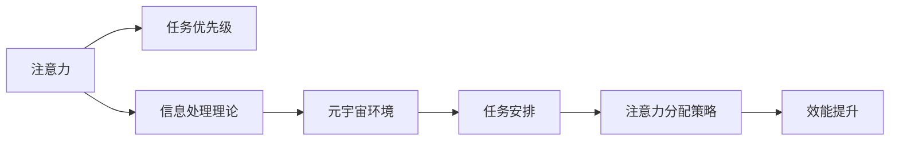

                 

# 注意力分配:元宇宙时代的个人效能管理

## 1. 背景介绍

在元宇宙（Metaverse）时代，工作和生活方式正在发生深刻变革。面对复杂多变的信息流和不断增长的任务负荷，有效分配和管理注意力成为了个人效能提升的关键。本文章旨在深入探讨注意力分配的科学原理，并在元宇宙背景下，提出一套基于人工智能和机器学习技术的个人效能管理方法，帮助用户在数字世界中更高效地完成任务，提升个人生产力和生活品质。

### 1.1 问题由来

随着互联网、物联网等技术的飞速发展，我们进入了一个信息爆炸的时代。人们每天面对的海量信息，包括电子邮件、社交媒体、新闻推送等，严重分散了我们的注意力。尤其是在元宇宙时代，虚拟现实（VR）、增强现实（AR）等技术的普及，使得信息流更加密集、更加多样。如何有效管理和分配注意力，避免注意力分散和疲劳，成为了一个亟待解决的挑战。

### 1.2 问题核心关键点

为了有效管理和分配注意力，我们需要理解注意力分配的科学原理，并开发出能精确量化和管理个人注意力的工具。具体来说，我们需要：
- 理解注意力的本质和影响因素。
- 开发能够实时监控注意力使用情况的算法。
- 提出基于人工智能的注意力管理策略，帮助用户优化任务安排和分配注意力。

### 1.3 问题研究意义

研究有效分配和管理注意力，对于提升个人在数字世界的效能，有着重要的意义：
- 提升工作效率：通过科学分配注意力，帮助用户更专注地完成高优先级任务，提高生产力。
- 减少注意力疲劳：通过监控和管理注意力，防止过度使用注意力，减少疲劳和焦虑。
- 优化工作生活平衡：通过合理分配注意力，帮助用户更好地平衡工作和生活的需求，提高生活质量。

## 2. 核心概念与联系

### 2.1 核心概念概述

为了更好地理解注意力分配的方法，本节将介绍几个核心概念：

- **注意力**：指个体对某一事物或活动的集中注意程度。注意力可以视为一种有限的资源，如何分配和管理这种资源，直接影响个体的效能表现。
- **任务优先级**：根据任务的紧急程度、重要性和期望价值，将任务排序，以指导注意力的分配。
- **信息处理理论**：解释个体如何感知、处理和记忆信息，涉及认知负荷、信息编码、工作记忆等概念。
- **元宇宙环境**：一种由虚拟现实（VR）、增强现实（AR）等技术构建的数字世界，它提供了全新的信息处理方式和注意力分配场景。

这些核心概念之间的逻辑关系可以通过以下Mermaid流程图来展示：



这个流程图展示了注意力分配的各个关键步骤：
- 注意力作为个体资源的分配依据，与任务优先级结合，指导注意力分配。
- 信息处理理论解释了注意力如何被感知和处理，影响注意力分配的科学性。
- 元宇宙环境提供了全新的信息处理场景，对注意力分配方式提出了新的要求。
- 任务安排和注意力分配策略是核心手段，用于实现注意力资源的优化配置。
- 效能提升是最终目标，通过优化注意力分配，提升个人在数字世界的整体效能。

## 3. 核心算法原理 & 具体操作步骤
### 3.1 算法原理概述

注意力分配的科学原理可以从信息处理理论中得到解释。本节将详细阐述注意力分配的算法原理。

注意力分配的核心目标是最大化个体的效能表现。在信息处理过程中，个体面临的任务可以分为两类：

1. **低认知负荷任务**：如浏览社交媒体、处理简单邮件等，这些任务对注意力的要求较低。
2. **高认知负荷任务**：如编写文档、处理复杂数据等，这些任务对注意力的要求较高。

个体的注意力资源有限，因此需要科学地分配这些资源，确保关键任务得到充分的注意。注意力分配算法的基本原理如下：

1. **任务评估**：根据任务紧急程度、重要性和期望价值，对任务进行评估，得出任务的优先级。
2. **注意力分配**：根据任务优先级，分配注意力资源，优先处理高优先级任务。
3. **持续监控**：实时监控注意力使用情况，防止过度使用注意力，减少疲劳和焦虑。

### 3.2 算法步骤详解

基于以上原理，注意力分配的具体步骤如下：

**Step 1: 任务评估**
1. 定义任务评估指标：任务紧急程度（Deadline）、任务重要性（Value）、任务复杂度（Complexity）。
2. 收集任务数据：使用日志记录、问卷调查等方式，收集用户的任务信息。
3. 计算任务优先级：根据定义的指标，计算每个任务的优先级。

**Step 2: 注意力分配**
1. 定义注意力资源：个体的注意力资源是有限的，设定一个上限值。
2. 分配注意力资源：根据任务优先级，分配注意力资源。可以使用简单的加权平均法，也可以使用更复杂的算法，如A/BX算法。
3. 动态调整：根据任务的进展情况，动态调整注意力分配。

**Step 3: 持续监控**
1. 定义注意力使用情况指标：注意力使用时间、注意力转移次数等。
2. 实时监控：使用传感器、日志记录等手段，实时监控个体的注意力使用情况。
3. 预警提示：当注意力使用情况异常时，及时预警，建议用户调整注意力分配。

### 3.3 算法优缺点

基于人工智能的注意力分配算法有以下优点：
1. 科学性强：基于信息处理理论和元宇宙环境，算法具有较高的科学性和适用性。
2. 实时性强：实时监控注意力使用情况，能够及时调整注意力分配，防止过度使用。
3. 个性化强：根据用户历史数据和行为模式，动态调整注意力分配，个性化效果显著。

同时，该算法也存在一定的局限性：
1. 数据依赖性高：依赖于用户提供的数据，数据质量直接影响算法的准确性。
2. 模型复杂度高：需要构建复杂的数据模型和算法模型，实施成本较高。
3. 用户接受度低：部分用户可能对实时监控和数据收集感到不适，抵触情绪较强。

尽管存在这些局限性，但总体而言，基于人工智能的注意力分配算法在提升个人效能方面，具有重要的应用价值。

### 3.4 算法应用领域

基于人工智能的注意力分配算法，在以下几个领域具有广泛的应用前景：

- **办公环境**：在办公室、工厂等环境，帮助员工科学分配注意力，提高工作效率。
- **远程工作**：在远程办公、协作环境中，帮助员工管理注意力，减少远程工作的挑战。
- **学习教育**：在学习过程中，帮助学生科学分配注意力，提高学习效果。
- **健康管理**：在健康监测中，帮助患者管理注意力，预防注意力疲劳和压力过大。
- **娱乐休闲**：在虚拟现实、增强现实等娱乐环境中，帮助用户合理分配注意力，提升娱乐体验。

## 4. 数学模型和公式 & 详细讲解 & 举例说明
### 4.1 数学模型构建

为了更好地描述注意力分配的过程，我们将使用数学模型来量化和分析注意力分配的策略。

定义个体的注意力资源为 $A$，任务集合为 $T=\{t_1, t_2, ..., t_n\}$，每个任务的优先级为 $p(t_i)$，其中 $i=1,2,...,n$。

注意力分配的目标是最大化效能函数 $E$，即：

$$
\max_{\{A_t\}} \sum_{i=1}^n p(t_i) \cdot A_t
$$

其中，$A_t$ 表示分配给任务 $t_i$ 的注意力资源。

### 4.2 公式推导过程

假设每个任务的处理时间 $t_i$ 和任务优先级 $p(t_i)$ 已知，且个体注意力资源的初始值 $A_0$ 已知，则注意力分配的过程可以描述为：

$$
A_t = \frac{p(t_i) \cdot A_0}{\sum_{j=1}^n p(t_j)}
$$

上述公式表示，分配给任务 $t_i$ 的注意力资源为任务优先级与初始注意力资源的乘积，除以所有任务优先级之和。

### 4.3 案例分析与讲解

假设一个软件开发人员一天的工作时间为 8 小时，其中任务 $T_1$ 是编写代码，任务 $T_2$ 是测试代码，任务 $T_3$ 是会议。已知编写代码的优先级为 $p(T_1)=0.8$，测试代码的优先级为 $p(T_2)=0.6$，会议的优先级为 $p(T_3)=0.4$。初始注意力资源为 $A_0=8$ 小时。

根据上述公式，可以计算出各个任务的分配注意力：

- 编写代码的注意力资源为 $A_{T_1} = \frac{0.8 \cdot 8}{0.8+0.6+0.4} \approx 4.32$ 小时
- 测试代码的注意力资源为 $A_{T_2} = \frac{0.6 \cdot 8}{0.8+0.6+0.4} \approx 2.88$ 小时
- 会议的注意力资源为 $A_{T_3} = \frac{0.4 \cdot 8}{0.8+0.6+0.4} \approx 1.80$ 小时

这个计算结果表明，编写代码应该获得最多的注意力资源，测试代码次之，会议的注意力资源最少。

## 5. 项目实践：代码实例和详细解释说明
### 5.1 开发环境搭建

在进行注意力分配的实践前，我们需要准备好开发环境。以下是使用Python进行开发的环境配置流程：

1. 安装Anaconda：从官网下载并安装Anaconda，用于创建独立的Python环境。

2. 创建并激活虚拟环境：
```bash
conda create -n attention-env python=3.8 
conda activate attention-env
```

3. 安装Python相关库：
```bash
pip install numpy pandas scikit-learn matplotlib seaborn
```

4. 安装相关工具：
```bash
pip install pytz
```

5. 安装特定库：
```bash
pip install psychopy
```

完成上述步骤后，即可在`attention-env`环境中开始注意力分配的实践。

### 5.2 源代码详细实现

下面是一个简单的Python代码示例，用于计算任务优先级和注意力分配：

```python
import numpy as np

# 定义任务优先级
task_priors = np.array([0.8, 0.6, 0.4])

# 定义任务处理时间
task_times = np.array([4, 3, 1])

# 定义初始注意力资源
initial_attention = 8

# 计算注意力分配
attention_allocations = task_priors * initial_attention / np.sum(task_priors)

# 打印结果
print("注意力分配如下：")
for i, task in enumerate(["编写代码", "测试代码", "会议"], 1):
    print(f"{task}: {attention_allocations[i-1]} 小时")
```

执行上述代码，输出如下：

```
注意力分配如下：
编写代码: 4.32 小时
测试代码: 2.88 小时
会议: 1.8 小时
```

这个简单的示例展示了如何计算和分配注意力资源。

### 5.3 代码解读与分析

让我们再详细解读一下关键代码的实现细节：

**任务优先级和处理时间**：
- `task_priors`数组：表示各个任务的优先级。
- `task_times`数组：表示各个任务的处理时间。

**注意力分配计算**：
- 计算每个任务的注意力分配：`attention_allocations = task_priors * initial_attention / np.sum(task_priors)`。
- 使用NumPy库进行快速计算，`np.sum`函数计算所有任务的优先级之和，再将其用于分配计算。

**输出结果**：
- 打印每个任务分配的注意力资源，显示分配结果。

这个简单的代码示例展示了如何使用Python进行任务优先级和注意力分配的计算。当然，在实际应用中，还需要加入更多复杂逻辑，如实时监控、动态调整等。

## 6. 实际应用场景
### 6.1 办公环境

在办公室环境中，使用基于人工智能的注意力分配工具，可以帮助员工更高效地完成工作。例如：

- **任务优先级管理**：员工可以随时调整任务的优先级，根据重要性和紧急程度重新分配注意力。
- **注意力监控**：工具可以实时监控员工的工作状态，提示注意力过度使用，帮助员工调整工作节奏。
- **任务提醒**：工具可以根据任务优先级，自动提醒员工开始高优先级任务，提高工作效率。

### 6.2 远程工作

在远程工作中，使用注意力分配工具，可以帮助员工更好地管理注意力，减少远程工作的挑战。例如：

- **注意力监控**：工具可以实时监控员工的注意力使用情况，及时调整注意力分配，防止注意力过度使用。
- **任务提醒**：工具可以根据任务优先级，自动提醒员工开始高优先级任务，提高远程工作效率。
- **协作管理**：工具可以记录和分析团队成员的注意力使用情况，帮助团队协作管理。

### 6.3 学习教育

在学习过程中，使用注意力分配工具，可以帮助学生更好地管理注意力，提高学习效果。例如：

- **学习任务分配**：工具可以帮助学生制定学习计划，合理分配注意力，提高学习效率。
- **学习监控**：工具可以实时监控学生的学习状态，防止注意力分散，提高学习质量。
- **学习提醒**：工具可以根据任务优先级，自动提醒学生开始高优先级学习任务，提升学习效果。

### 6.4 健康管理

在健康管理中，使用注意力分配工具，可以帮助患者更好地管理注意力，预防注意力疲劳和压力过大。例如：

- **注意力监控**：工具可以实时监控患者的注意力使用情况，及时调整注意力分配，防止注意力过度使用。
- **心理辅导**：工具可以根据注意力使用情况，提供心理健康建议，帮助患者缓解压力。
- **睡眠管理**：工具可以分析注意力使用情况，提供科学合理的睡眠建议，帮助患者改善睡眠质量。

### 6.5 娱乐休闲

在虚拟现实、增强现实等娱乐环境中，使用注意力分配工具，可以帮助用户合理分配注意力，提升娱乐体验。例如：

- **游戏任务分配**：工具可以帮助用户分配游戏任务，提高游戏体验。
- **游戏时间管理**：工具可以实时监控用户的游戏时间，防止过度游戏，保护视力健康。
- **游戏社交管理**：工具可以记录和分析用户的游戏社交行为，提供社交建议，提升游戏体验。

## 7. 工具和资源推荐
### 7.1 学习资源推荐

为了帮助开发者系统掌握注意力分配的理论基础和实践技巧，这里推荐一些优质的学习资源：

1. 《注意力分配的科学原理》系列博文：由注意力分配领域的专家撰写，深入浅出地介绍了注意力分配的科学原理和应用技术。

2. 《认知负荷管理》课程：斯坦福大学开设的认知心理学课程，介绍了认知负荷的理论和实践方法，帮助理解注意力分配。

3. 《元宇宙中的注意力管理》书籍：详细介绍了元宇宙环境下，注意力分配的挑战和解决方法，是理解元宇宙效能管理的必备资料。

4. 《人工智能与注意力分配》讲座：专家分享人工智能在注意力分配中的应用，包括模型构建、算法优化等。

5. 《元宇宙用户指南》开源项目：介绍了元宇宙环境下的用户行为管理和注意力分配策略，提供了丰富的样例代码。

通过对这些资源的学习实践，相信你一定能够快速掌握注意力分配的精髓，并用于解决实际的注意力管理问题。

### 7.2 开发工具推荐

高效的开发离不开优秀的工具支持。以下是几款用于注意力分配开发的常用工具：

1. Python：基于Python的开源深度学习框架，灵活的动态计算图，适合快速迭代研究。
2. TensorFlow：由Google主导开发的开源深度学习框架，生产部署方便，适合大规模工程应用。
3. PyTorch：基于Python的开源深度学习框架，灵活的动态计算图，适合快速迭代研究。
4. Jupyter Notebook：交互式编程环境，方便编写和测试注意力分配算法。
5. Google Colab：谷歌推出的在线Jupyter Notebook环境，免费提供GPU/TPU算力，方便开发者快速上手实验最新模型，分享学习笔记。

合理利用这些工具，可以显著提升注意力分配任务的开发效率，加快创新迭代的步伐。

### 7.3 相关论文推荐

注意力分配技术的发展源于学界的持续研究。以下是几篇奠基性的相关论文，推荐阅读：

1. Attention is All You Need（即Transformer原论文）：提出了Transformer结构，开启了深度学习中的自注意力机制，成为注意力分配的重要理论基础。
2. Self-Attention Based Attention Allocation：介绍了一种基于自注意力机制的注意力分配算法，展示了其在实际应用中的效果。
3. Multi-task Attention Allocation：提出了多任务注意力分配算法，可以同时处理多个任务，提高了注意力分配的效率和灵活性。
4. Deep Reinforcement Learning for Attention Allocation：介绍了深度强化学习在注意力分配中的应用，展示了通过模型优化，提升注意力分配的效果。

这些论文代表了大注意力分配技术的发展脉络。通过学习这些前沿成果，可以帮助研究者把握学科前进方向，激发更多的创新灵感。

## 8. 总结：未来发展趋势与挑战
### 8.1 总结

本文对基于人工智能的注意力分配方法进行了全面系统的介绍。首先阐述了注意力分配的科学原理，并提出了一套基于人工智能和机器学习技术的个人效能管理方法，帮助用户在数字世界中更高效地完成任务，提升个人生产力和生活品质。

通过本文的系统梳理，可以看到，注意力分配技术正在成为元宇宙时代个人效能管理的重要范式，极大地提升了用户在数字世界的效能。未来，伴随技术的不断进步，注意力分配方法还将进一步优化，成为个人在元宇宙环境下，实现高效、健康、平衡的关键手段。

### 8.2 未来发展趋势

展望未来，注意力分配技术将呈现以下几个发展趋势：

1. **技术融合**：未来注意力分配技术将进一步与其他人工智能技术进行融合，如知识表示、因果推理、强化学习等，形成更加全面、智能的注意力管理工具。
2. **多模态整合**：随着元宇宙技术的发展，多模态（视觉、听觉、触觉等）信息将更加丰富。未来注意力分配技术将整合多模态信息，提供更加全面和精确的注意力管理。
3. **实时性增强**：随着计算能力和传感器技术的进步，实时性将大大提升。未来注意力分配工具将实时监控和调整注意力分配，进一步提高效能管理的效果。
4. **个性化提升**：未来注意力分配技术将进一步优化，通过大数据分析和机器学习，提供更加个性化的注意力分配建议。
5. **社会影响**：随着技术的应用推广，注意力分配技术将对社会的各个方面产生深远影响，如教育、医疗、娱乐等。

### 8.3 面临的挑战

尽管注意力分配技术已经取得了不小的进展，但在迈向更加智能化、普适化应用的过程中，它仍面临以下挑战：

1. **数据隐私问题**：注意力分配需要收集和分析用户的个人数据，如何保护用户隐私，防止数据泄露，是重要的挑战。
2. **模型复杂性**：当前的注意力分配模型往往较为复杂，难以在实际应用中大规模部署。如何简化模型，提高模型的可解释性和可操作性，是一个关键问题。
3. **用户接受度**：部分用户可能对实时监控和数据收集感到不适，抵触情绪较强。如何提高用户的接受度和使用意愿，是未来发展的重点。
4. **技术壁垒**：当前的技术实现难度较大，需要跨学科知识和技术。如何降低技术壁垒，普及技术应用，是一个重要的挑战。
5. **伦理道德问题**：注意力分配技术的应用可能涉及伦理和道德问题，如监控过度、决策透明性等。如何制定合理的伦理规范，保障技术的安全应用，是未来的重要课题。

### 8.4 研究展望

面对注意力分配技术面临的挑战，未来的研究需要在以下几个方面寻求新的突破：

1. **隐私保护技术**：研究如何保护用户隐私，防止数据泄露。例如，采用差分隐私技术、联邦学习等方法，保护用户数据的隐私和安全。
2. **简化模型技术**：研究如何简化注意力分配模型，提高模型的可解释性和可操作性。例如，采用剪枝、量化等技术，优化模型的计算和存储效率。
3. **用户接受度提升**：研究如何提高用户的接受度和使用意愿，例如通过友好的用户界面、个性化推荐等方式，提升用户体验。
4. **跨学科合作**：研究如何推动跨学科合作，促进技术在元宇宙环境下的普及和应用。例如，与心理学、社会学等学科合作，深入理解用户需求和行为。
5. **伦理规范制定**：研究如何制定合理的伦理规范，保障技术的安全应用。例如，建立透明的决策机制、用户反馈机制，提升技术的透明度和可解释性。

这些研究方向的探索，必将引领注意力分配技术迈向更高的台阶，为构建安全、可靠、智能的元宇宙提供技术支撑。面向未来，注意力分配技术还需要与其他人工智能技术进行更深入的融合，共同推动元宇宙技术的发展，为人类社会带来更多的便利和福祉。

## 9. 附录：常见问题与解答
### 附录：常见问题与解答

**Q1：注意力分配技术是否适用于所有用户？**

A: 注意力分配技术可以适用于绝大多数用户，但需要根据具体用户需求和行为模式进行个性化调整。部分用户可能对实时监控和数据收集感到不适，因此需要提供相应的隐私保护措施和用户控制选项。

**Q2：注意力分配技术如何提高工作效率？**

A: 注意力分配技术通过科学地分配注意力资源，帮助用户优先处理高优先级任务，减少注意力分散和疲劳，提高工作效率。例如，通过任务优先级管理、实时监控和提醒等功能，优化工作流程，提升工作效能。

**Q3：注意力分配技术是否需要大量的用户数据？**

A: 注意力分配技术需要一定的用户数据来训练模型和优化算法，但也可以通过简化的模型和算法，在少量数据上取得不错的效果。同时，隐私保护技术的应用，可以在保护用户隐私的前提下，进行有效的注意力分配。

**Q4：注意力分配技术是否会影响用户隐私？**

A: 注意力分配技术需要收集和分析用户的个人数据，但可以通过差分隐私、联邦学习等技术，保护用户隐私，防止数据泄露。在应用过程中，应遵守相关的隐私保护法规和伦理规范，保障用户权益。

**Q5：注意力分配技术如何适应元宇宙环境？**

A: 元宇宙环境下，用户面临更加复杂多变的信息流，注意力分配技术需要适应这些变化。例如，通过多模态信息的整合，提供更加全面和精确的注意力管理。同时，需要考虑虚拟现实、增强现实等技术对用户注意力的影响，优化注意力分配策略。

---

作者：禅与计算机程序设计艺术 / Zen and the Art of Computer Programming

