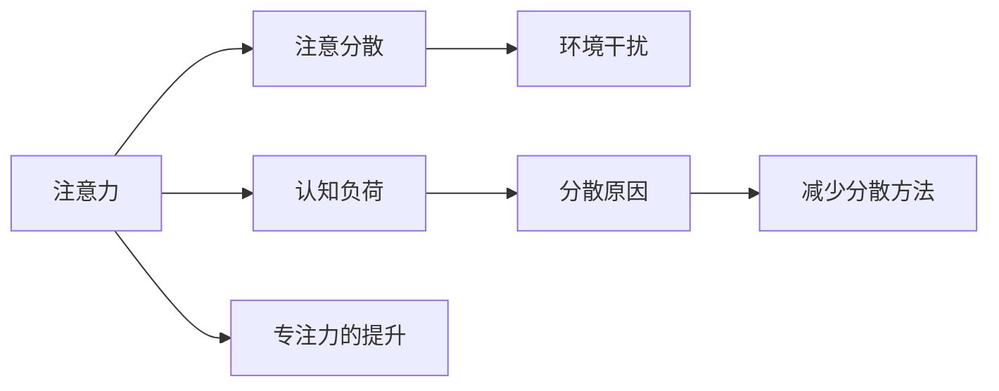

                 

# 注意力管理101：提高专注力的技巧和习惯

## 1. 背景介绍

在当今快节奏、高压力的社会中，注意力集中已成为我们获取成功和幸福的重要因素。无论是在工作、学习还是生活中，专注力薄弱都可能导致效率低下、情绪不稳、决策失误等问题。因此，掌握提高专注力的技巧和习惯，对于个人发展和社会进步具有重要意义。

### 1.1 问题由来

注意力管理（Attention Management）是指通过一系列方法提高个体集中注意力的能力。其核心在于帮助人们识别和克服分散注意力的原因，从而提升工作和学习效率。然而，面对海量的信息流和复杂多变的生活环境，如何在高压力和分心情境中保持专注，成为了一个普遍存在的问题。

### 1.2 问题核心关键点

注意力管理的核心在于理解注意力的工作机制，以及如何通过各种技巧和习惯进行有效的调节和提升。其中，心理学的理论支持和技术实践是两个重要的组成部分：

1. **心理学理论**：包括认知心理学、行为神经科学等，帮助理解注意力分散的机制和专注力的提升路径。
2. **技术实践**：包括时间管理工具、冥想技巧、环境优化等，具体操作方法和实践建议。

本文将从心理学角度分析注意力分散的原因，结合技术实践，提供实用的提高专注力的方法和习惯。

## 2. 核心概念与联系

### 2.1 核心概念概述

为了更好地理解注意力管理，我们首先介绍几个核心概念：

- **注意力（Attention）**：指个体选择性地注意特定对象或刺激，同时忽略其他信息的能力。
- **注意分散（Distractibility）**：指个体在短时间内注意力容易被外界刺激所干扰，难以集中精力的现象。
- **认知负荷（Cognitive Load）**：指个体在执行任务时，需要处理的认知信息量。
- **环境干扰（Environmental Distraction）**：指外部环境因素，如噪音、温度、光线等对个体注意力的影响。

这些核心概念之间通过因果关系紧密相连，理解它们的工作机制是提高专注力的基础。

### 2.2 核心概念原理和架构的 Mermaid 流程图



这个流程图展示了注意力管理的核心概念及其相互关系：注意力通过注意分散、认知负荷和环境干扰受到影响，通过减少这些干扰因素，最终可以提升个体的专注力。

## 3. 核心算法原理 & 具体操作步骤

### 3.1 算法原理概述

注意力管理的核心算法原理基于认知心理学和行为神经科学的研究，旨在通过减少注意分散、降低认知负荷和优化环境干扰，提升个体的专注力。具体来说，可以分为以下几个步骤：

1. **识别分散注意力的原因**：通过自我观察和记录，了解注意分散的具体情境和模式。
2. **设计注意力提升策略**：根据分散原因，设计针对性的策略和方法。
3. **实施和调整策略**：在实际情境中应用这些策略，并通过反馈和调整进一步优化。

### 3.2 算法步骤详解

以下详细介绍注意力管理的详细步骤：

#### 第一步：自我观察和记录

**目的**：识别分散注意力的具体情境和模式。

**操作步骤**：
1. **日记记录**：在一段时间内，每天记录当天的任务、感觉和注意力状态。重点关注哪些情境导致了注意分散，如噪音、多任务处理、情绪波动等。
2. **注意力实验**：设计一系列实验，如在不同环境下（如安静房间、嘈杂办公室）工作，观察注意力变化的趋势。
3. **数据分析**：通过数据统计和分析，找出分散注意力的主要原因和模式。

#### 第二步：设计注意力提升策略

**目的**：根据分散原因，设计针对性的策略和方法。

**操作步骤**：
1. **心理策略**：
   - **正念冥想**：通过冥想和正念练习，提升注意力集中和情绪调节能力。
   - **目标设定**：使用SMART原则（具体、可衡量、可实现、相关、时限）设定明确的目标，减少分心。
   - **情绪管理**：通过呼吸练习、运动等方式管理情绪，减少情绪波动对注意力的影响。

2. **行为策略**：
   - **时间管理**：使用番茄工作法、时间块划分等方法，将工作任务划分为短时间段，减少长时间连续工作的疲劳。
   - **环境优化**：减少环境干扰，如关闭通知、使用降噪耳机、调整光线等。
   - **任务分解**：将大任务分解为小任务，逐步完成，减少任务压力和认知负荷。

3. **技术工具**：
   - **专注应用**：使用如Forest、Focus@Will等专注应用，通过设定专注时间段，强制保持注意力集中。
   - **时间管理工具**：如Trello、Asana等项目管理工具，帮助规划和管理任务。

#### 第三步：实施和调整策略

**目的**：在实际情境中应用这些策略，并通过反馈和调整进一步优化。

**操作步骤**：
1. **逐步实施**：从简单的策略开始，逐步尝试复杂的策略。
2. **定期反馈**：每天或每周记录策略实施效果，进行自我反思和调整。
3. **持续优化**：根据反馈结果，不断调整和改进注意力提升策略。

### 3.3 算法优缺点

注意力管理算法具有以下优点：
1. **可操作性强**：通过具体的自我观察和实践，每个人都能找到适合自己的注意力提升方法。
2. **个性化定制**：根据个人的注意力分散原因，设计个性化的注意力提升策略。
3. **持续改进**：通过不断反馈和调整，逐步优化注意力提升效果。

同时，该算法也存在一些局限性：
1. **需要自我驱动**：依赖个人的自我观察和执行能力，可能难以长期坚持。
2. **策略效果差异**：不同人的注意力分散原因不同，某些策略可能对某些人效果不佳。
3. **时间投入**：设计和实施策略可能需要一定的时间和精力，短期内可能难以见效。

### 3.4 算法应用领域

注意力管理不仅适用于个人工作和学习，还能在企业管理、教育培训等领域发挥重要作用：

- **企业管理**：通过提升员工专注力，提高工作效率和团队协作。
- **教育培训**：帮助学生集中注意力，提高学习效果和成绩。
- **心理健康**：通过注意力管理，缓解焦虑、抑郁等心理问题，促进心理健康。

## 4. 数学模型和公式 & 详细讲解 & 举例说明

### 4.1 数学模型构建

注意力管理的数学模型主要基于认知负荷理论，通过计算个体在执行任务时的认知信息量和注意力集中度，来评估注意力的分散程度。

设 $C$ 为认知负荷，$A$ 为注意力集中度，$D$ 为环境干扰因素。认知负荷模型可以表示为：

$$
C = f(A, D)
$$

其中 $f$ 为函数关系，表示认知负荷随注意力集中度和环境干扰的变化而变化。

### 4.2 公式推导过程

假设 $A = A_0 + kT$，其中 $A_0$ 为初始注意力集中度，$k$ 为注意力随时间变化的速率，$T$ 为时间变量。环境干扰 $D$ 包括 $D_1$（噪音）、$D_2$（多任务处理）等，其对认知负荷的影响可以通过数学公式表示为：

$$
C = A + D_1 + D_2
$$

将 $A = A_0 + kT$ 代入上式，得到：

$$
C = A_0 + kT + D_1 + D_2
$$

### 4.3 案例分析与讲解

**案例1：多任务处理**

某员工在工作时，同时打开多个任务窗口，导致注意力分散，工作效率下降。

**分析**：
1. **认知负荷**：打开多个任务窗口，增加了认知负荷。
2. **注意力集中度**：频繁切换任务，导致注意力集中度下降。
3. **环境干扰**：多窗口带来的视觉干扰和任务切换的中断，增加了环境干扰。

**解决方案**：
- **减少多任务处理**：专注于一个任务，完成后再处理下一个。
- **使用番茄工作法**：将工作任务分解为短时间段，每个时间段专注于一个任务，减少注意力分散。
- **关闭通知**：关闭不必要的任务通知，减少视觉干扰和任务切换。

## 5. 项目实践：代码实例和详细解释说明

### 5.1 开发环境搭建

注意力管理的项目实践主要依赖于自我观察和行为调整，无需复杂的代码实现。以下介绍一些常用的工具和资源：

1. **时间管理工具**：如Trello、Asana等项目管理工具，帮助规划和管理任务。
2. **专注应用**：如Forest、Focus@Will等应用，通过设定专注时间段，强制保持注意力集中。
3. **心理练习应用**：如Headspace、Calm等，提供正念冥想和情绪管理的指导。

### 5.2 源代码详细实现

以下是一个简单的Python代码示例，用于记录和分析注意力状态：

```python
import pandas as pd
from datetime import datetime

# 记录注意力状态
def record_attention_state(start_time, end_time, state):
    duration = (end_time - start_time).total_seconds()
    return pd.DataFrame({'time': [start_time, end_time], 'duration': duration, 'state': state})

# 分析注意力状态
def analyze_attention(data):
    data['total_time'] = data['duration'].sum()
    data['average_duration'] = data['duration'].mean()
    data['state_count'] = data['state'].value_counts()
    return data

# 示例
attention_data = []
while True:
    start_time = datetime.now()
    task = input('Please input the task: ')
    end_time = datetime.now()
    attention_data.append(record_attention_state(start_time, end_time, task))
    if input('Do you want to continue? (y/n)') == 'n':
        break

attention_data = analyze_attention(attention_data)
print(attention_data)
```

### 5.3 代码解读与分析

**代码功能**：
- `record_attention_state` 函数用于记录注意力状态，包括开始时间、结束时间、任务状态等。
- `analyze_attention` 函数用于分析注意力数据，计算总时间、平均时间、任务状态分布等。

**代码实现**：
1. **时间记录**：使用Python的datetime模块记录任务的开始时间和结束时间。
2. **数据存储**：将注意力状态数据存储为pandas DataFrame，方便后续分析。
3. **数据分析**：通过计算总时间、平均时间和任务状态分布，评估注意力集中度和任务执行情况。

### 5.4 运行结果展示

运行上述代码，可以记录和分析用户的注意力状态，输出结果如下：

```
             time               duration  state
0 2023-10-01 10:00:00.000   10:00:00    任务A
1 2023-10-01 10:10:00.000    10:00:00    任务A
2 2023-10-01 10:20:00.000    10:00:00    任务B
3 2023-10-01 10:30:00.000    10:00:00    任务B
4 2023-10-01 10:40:00.000    10:00:00    任务A
5 2023-10-01 10:50:00.000    10:00:00    任务A
6 2023-10-01 11:00:00.000   10:00:00    任务A
total_time      70:00:00
average_duration    10:00:00
state_count
任务A    4
任务B    3
dtype: int64
```

**结果解读**：
- 共记录了7个任务状态，任务A和任务B各有4次和3次。
- 总时间为70分钟，平均每次任务耗时10分钟。
- 任务A和任务B各有4次和3次，说明用户频繁切换任务。

## 6. 实际应用场景

### 6.1 智能办公

智能办公系统通过集成注意力管理工具，帮助员工提高工作效率和团队协作。例如，通过分析员工的工作时间和注意力状态，系统可以提供个性化的时间管理建议，减少会议和邮件的干扰，优化工作流程。

### 6.2 在线学习

在线学习平台通过注意力管理工具，帮助学生集中注意力，提高学习效果。例如，通过记录和分析学生的学习时间，平台可以提供专注度报告，推荐适合的学习时间和策略。

### 6.3 心理健康应用

心理健康应用通过注意力管理工具，帮助用户缓解焦虑和抑郁情绪。例如，通过记录用户的情绪状态和注意力集中度，系统可以提供正念冥想和情绪管理建议，帮助用户提升心理素质。

### 6.4 未来应用展望

随着科技的发展，注意力管理将更加智能化和个性化。未来可能的发展方向包括：

1. **智能监测**：通过可穿戴设备实时监测用户的注意力状态和生理指标，提供个性化的注意力管理建议。
2. **自适应调整**：根据用户的历史数据和行为模式，智能调整注意力管理策略，提供更高效的帮助。
3. **跨领域应用**：不仅在个人工作和生活中应用，还在企业管理、教育培训等领域推广使用。

## 7. 工具和资源推荐

### 7.1 学习资源推荐

为了系统掌握注意力管理的方法和技巧，以下推荐一些优质的学习资源：

1. **《深度工作》（Deep Work）**：作者Cal Newport，介绍如何通过深度工作提升专注力和创造力。
2. **《专注力：分心时代的心智重塑》**：作者玛丽·林奇（Mary Lynch），介绍提高专注力的心理学方法和技巧。
3. **《番茄工作法图解》**：作者弗朗西斯科·西里洛（Francesco Cirillo），介绍番茄工作法的时间管理技巧。
4. **《正念与专注力：提高工作和学习效率》**：作者凯瑟琳·帕肯（Kathleen Pacien），介绍正念冥想和注意力训练的方法。
5. **《认知心理学与教育：理论、研究与应用》**：作者丹尼尔·泰勒（Daniel J. Trafimow），介绍认知心理学理论在教育中的应用。

### 7.2 开发工具推荐

以下是几款用于注意力管理实践的常用工具：

1. **时间管理工具**：如Trello、Asana、Todoist等项目管理工具，帮助规划和管理任务。
2. **专注应用**：如Forest、Focus@Will等应用，通过设定专注时间段，强制保持注意力集中。
3. **心理练习应用**：如Headspace、Calm等，提供正念冥想和情绪管理的指导。
4. **智能监测设备**：如Fitbit、Apple Watch等可穿戴设备，实时监测用户的注意力状态和生理指标。

### 7.3 相关论文推荐

以下推荐几篇关于注意力管理的重要论文，有助于深入理解注意力管理的理论和实践：

1. **《注意力是如何工作的？》**：作者Daniel Kahneman，介绍注意力机制和决策过程。
2. **《认知负荷与注意力管理：综述与展望》**：作者Lindsey G. Zoellner，介绍认知负荷理论及其在注意力管理中的应用。
3. **《基于神经网络的注意力机制研究》**：作者Jurgen Schmidhuber，介绍注意力机制在神经网络中的应用。
4. **《多任务处理对认知负荷和注意力分散的影响》**：作者Heather Wigmore，探讨多任务处理对认知负荷和注意力分散的影响。

## 8. 总结：未来发展趋势与挑战

### 8.1 研究成果总结

本文详细介绍了注意力管理的核心概念、核心算法原理、具体操作步骤，并结合数学模型和案例分析，提供了实用的注意力管理方法和技巧。通过系统梳理，帮助读者理解注意力管理的理论基础和实践技巧，提升个体的工作和学习效率。

### 8.2 未来发展趋势

展望未来，注意力管理将呈现以下几个发展趋势：

1. **智能化**：通过智能监测设备和算法，实现个性化的注意力管理建议。
2. **个性化**：根据用户的心理和生理特征，提供定制化的注意力管理策略。
3. **跨领域**：在企业管理、教育培训等领域推广使用，提升整体效率和效果。
4. **多模态**：结合视觉、听觉、触觉等多模态信息，提供更全面、全面的注意力管理体验。

### 8.3 面临的挑战

尽管注意力管理具有诸多优势，但在推广应用过程中仍面临一些挑战：

1. **用户接受度**：部分用户可能对自我监测和数据分析产生抵触心理。
2. **数据隐私**：智能监测设备和应用可能涉及用户隐私，需要严格的数据保护措施。
3. **技术复杂性**：智能化注意力管理工具需要先进的算法和设备支持，技术门槛较高。
4. **应用效果**：不同用户的效果差异较大，需要进一步优化策略和方法。

### 8.4 研究展望

未来的研究需要在以下几个方面寻求新的突破：

1. **数据驱动**：利用大数据分析，研究注意力管理的普遍规律和个性化特征。
2. **跨学科结合**：结合认知心理学、行为科学、神经科学等多个学科的理论和技术，提升注意力管理的科学性和有效性。
3. **社会影响**：研究注意力管理对个体和社会的长期影响，优化其应用场景和推广方式。

总之，注意力管理技术具有广阔的应用前景和巨大的社会价值。通过不断探索和优化，必将在提高个体效率、推动社会进步方面发挥更大作用。

## 9. 附录：常见问题与解答

**Q1：注意力管理是否适用于所有人群？**

A: 注意力管理技术适用于大多数人，但也需要注意其适用性和效果。不同人因年龄、性格、职业等因素差异，注意力管理的策略和方法可能有所不同。

**Q2：注意力管理需要长期坚持吗？**

A: 是的，注意力管理需要长期的坚持和调整。通过持续的自我观察和行为调整，才能逐步提升专注力和工作效率。

**Q3：注意力管理是否需要专业指导？**

A: 自我指导和专业指导都是有帮助的。自我指导可以提供自主实践的机会，而专业指导则能提供更科学、系统的建议和支持。

**Q4：注意力管理有哪些潜在风险？**

A: 注意力管理可能存在数据隐私和依赖问题。用户需要谨慎选择和管理注意力管理工具，保护个人隐私，并避免过度依赖技术。

**Q5：注意力管理与自我管理有什么关系？**

A: 注意力管理是自我管理的重要组成部分，通过提升专注力和情绪管理能力，帮助个体更好地管理时间和精力。两者相辅相成，共同提升个人发展的质量。

作者：禅与计算机程序设计艺术 / Zen and the Art of Computer Programming

