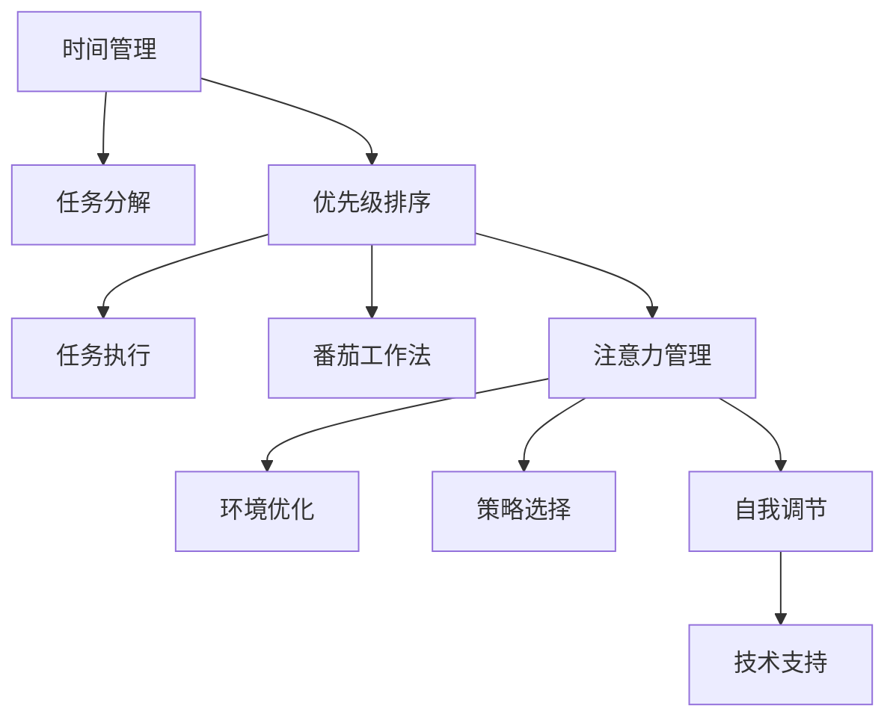
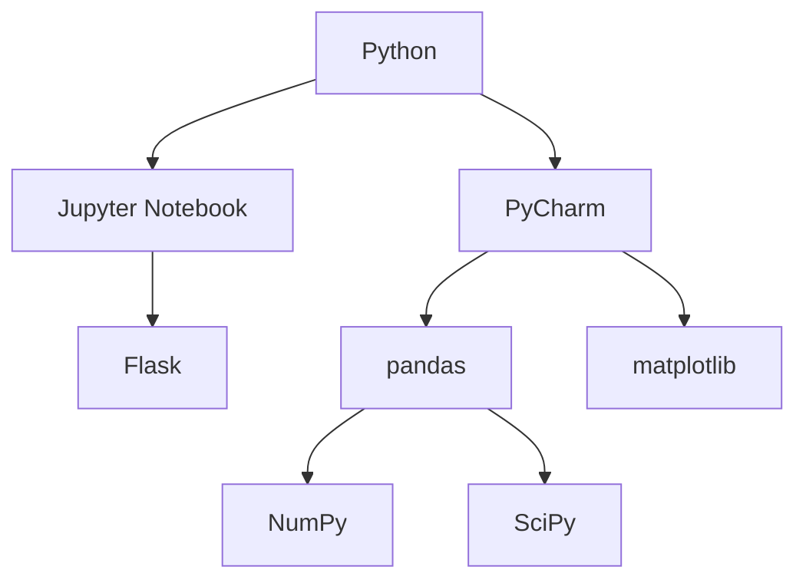

                 

# 注意力管理与时间管理：如何最大化利用你的一天

## 1. 背景介绍

在当今快节奏的工作和生活环境中，时间管理成为了一个永恒的难题。如何在有限的时间内高效完成任务，合理规划时间，是我们每个人都必须面对的问题。本文旨在探讨注意力管理与时间管理的核心概念和实践方法，帮助读者掌握时间管理的艺术，最大化利用自己的每一天。

### 1.1 问题由来

随着科技的进步和社会的发展，信息过载现象日益严重，各种任务和事务充斥着我们的生活。我们常常感到时间不够用，容易陷入效率低下、任务堆积的困境。究其原因，主要是因为缺乏有效的注意力管理和时间规划。

### 1.2 问题核心关键点

有效的注意力管理和时间管理，不仅需要掌握各种技巧和方法，还需要理解其背后的原理和逻辑。在时间管理中，核心在于以下几个方面：

- **目标设定**：明确自己的目标和优先级，制定切实可行的计划。
- **任务分解**：将大任务分解为小任务，便于管理。
- **时间分配**：合理分配时间，避免过度集中或分散。
- **专注执行**：在执行任务时保持高度的专注，避免分心。
- **反馈调整**：根据执行结果，及时调整计划和方法。

在注意力管理中，核心在于以下几个方面：

- **环境优化**：创造一个有利于注意力集中的环境。
- **策略选择**：根据不同任务选择适合的注意力管理策略。
- **自我调节**：学会调节自己的情绪和心理状态，保持高效率。
- **技术支持**：利用工具和软件辅助提升注意力和效率。

### 1.3 问题研究意义

掌握有效的注意力管理与时间管理方法，能够显著提升工作效率和生活质量。具体体现在以下几个方面：

- **提高生产力**：通过合理的规划和执行，能够在有限的时间内完成更多工作。
- **减少压力**：合理安排时间，减少因任务堆积带来的心理压力。
- **增强成就感**：及时完成任务，获得成就感，保持积极心态。
- **提升生活品质**：合理分配时间，留出更多时间用于休息和娱乐。

## 2. 核心概念与联系

### 2.1 核心概念概述

在探讨注意力管理与时间管理的核心概念时，我们需要理解以下几个关键术语：

- **时间管理**：指通过计划和控制，将时间资源有效地分配给各种活动，以便更好地实现目标。
- **注意力管理**：指通过各种方法和策略，提升个人或团队的注意力集中度和工作效率。
- **任务分解**：将复杂任务分解为可管理的小任务，便于执行和控制。
- **时间块**：将时间划分为固定的时间段，每个时间段专注于一个任务或一组相关任务。
- **优先级排序**：根据任务的紧急程度和重要程度，进行优先级排序，确保最重要任务首先完成。
- **番茄工作法**：一种时间管理技术，通过设定25分钟的工作时间和5分钟的休息时间，提高工作效率。

### 2.2 核心概念原理和架构的 Mermaid 流程图



这个流程图展示了时间管理和注意力管理的基本架构，每个节点都代表了关键的子概念和实践方法。

## 3. 核心算法原理 & 具体操作步骤

### 3.1 算法原理概述

时间管理和注意力管理的核心算法原理主要包括：

- **时间块算法**：将时间划分为固定的时间段，每个时间段专注于一个任务或一组相关任务。
- **番茄工作法**：通过设定25分钟的工作时间和5分钟的休息时间，提高工作效率。
- **任务分解算法**：将复杂任务分解为可管理的小任务，便于执行和控制。
- **优先级排序算法**：根据任务的紧急程度和重要程度，进行优先级排序，确保最重要任务首先完成。
- **注意力管理算法**：通过各种方法和策略，提升个人或团队的注意力集中度和工作效率。

### 3.2 算法步骤详解

#### 步骤一：目标设定与任务分解

1. **明确目标**：首先，需要明确自己的目标和优先级。将这些目标写下来，制定具体可行的计划。
2. **任务分解**：将大任务分解为可管理的小任务。例如，如果目标是写一篇论文，可以将任务分解为文献查找、数据分析、撰写草稿等子任务。

#### 步骤二：时间分配与优先级排序

1. **时间块划分**：将一天的时间划分为若干时间块，每个时间块专注于一个任务或一组相关任务。
2. **优先级排序**：根据任务的紧急程度和重要程度，进行优先级排序，确保最重要任务首先完成。可以使用四象限法（紧急-重要矩阵）来辅助决策。

#### 步骤三：专注执行与番茄工作法

1. **番茄工作法**：在每个时间块内，采用番茄工作法进行专注执行。设定25分钟的工作时间和5分钟的休息时间，确保高效工作的同时避免疲劳。
2. **专注执行**：在执行任务时保持高度的专注，避免分心。关闭不必要的通知和干扰，保持环境安静和整洁。

#### 步骤四：反馈调整与自我调节

1. **反馈调整**：在任务执行过程中，根据执行结果，及时调整计划和方法。如果某个任务进度慢，考虑重新分配时间或优化方法。
2. **自我调节**：学会调节自己的情绪和心理状态，保持高效率。可以使用冥想、运动等方法，缓解压力，保持心态平衡。

### 3.3 算法优缺点

#### 优点：

1. **提高效率**：通过合理的时间管理和注意力管理，能够显著提高工作效率，完成更多任务。
2. **减少压力**：合理安排时间，减少因任务堆积带来的心理压力，保持积极心态。
3. **增强成就感**：及时完成任务，获得成就感，保持积极心态。

#### 缺点：

1. **初期适应**：需要一段时间的适应和学习，才能熟练掌握时间管理和注意力管理的方法。
2. **环境限制**：需要一定的环境和资源支持，例如安静的工作环境和必要的工具。

### 3.4 算法应用领域

时间管理和注意力管理的方法，广泛应用于各个领域，包括：

- **项目管理**：在项目管理中，合理分配时间和资源，确保项目按时完成。
- **学习管理**：在学生学习中，合理分配学习时间和精力，提高学习效率。
- **工作管理**：在工作管理中，合理分配工作时间和任务，提升工作质量。
- **个人生活管理**：在个人生活中，合理安排时间，提高生活质量。

## 4. 数学模型和公式 & 详细讲解 & 举例说明

### 4.1 数学模型构建

在时间管理和注意力管理中，可以使用数学模型来辅助分析和优化。例如，可以使用时间块算法和番茄工作法的数学模型来计算最优的工作和休息时间比例。

假设一天有24小时，每个番茄工作周期为25分钟工作时间和5分钟休息时间，则每天可以完成的工作周期数为：

$$
\text{周期数} = \frac{24 \times 60}{25+5} \approx 96
$$

每个周期的工作时间为25分钟，休息时间为5分钟，则一天的总工作时间为：

$$
\text{总工作时间} = 96 \times 25 = 2400 \text{分钟}
$$

剩余时间为休息时间，总休息时间为：

$$
\text{总休息时间} = 24 \times 60 - 2400 = 240 \text{分钟}
$$

### 4.2 公式推导过程

#### 时间块算法

设一天有T分钟，每个时间块为B分钟，则一天可以划分的时间块数为：

$$
\text{时间块数} = \frac{T}{B}
$$

每个时间块的工作时间为W分钟，休息时间为R分钟，则一天的总工作时间为：

$$
\text{总工作时间} = \frac{T}{B} \times W
$$

剩余时间为休息时间，总休息时间为：

$$
\text{总休息时间} = T - \frac{T}{B} \times W
$$

#### 番茄工作法

设每个番茄工作周期为T分钟，工作时间为W分钟，休息时间为R分钟，则一天的总工作时间为：

$$
\text{总工作时间} = \frac{24 \times 60}{T} \times W
$$

剩余时间为休息时间，总休息时间为：

$$
\text{总休息时间} = 24 \times 60 - \frac{24 \times 60}{T} \times W
$$

### 4.3 案例分析与讲解

假设一天有24小时，每个时间块为90分钟，每个番茄工作周期为25分钟工作时间和5分钟休息时间。根据上述数学模型计算，可以得出：

- 一天可以划分的时间块数为：$\frac{24 \times 60}{90} \approx 39.3$
- 每个时间块的工作时间为90分钟，则一天的总工作时间为：$39.3 \times 90 = 3537 \text{分钟}$
- 剩余时间为休息时间，总休息时间为：$24 \times 60 - 3537 = 243 \text{分钟}$
- 每个番茄工作周期为25分钟工作时间和5分钟休息时间，则一天可以完成的工作周期数为：$\frac{24 \times 60}{25+5} \approx 96$
- 每个周期的工作时间为25分钟，则一天的总工作时间为：$96 \times 25 = 2400 \text{分钟}$
- 剩余时间为休息时间，总休息时间为：$24 \times 60 - 2400 = 240 \text{分钟}$

通过对比两种方法，可以看出番茄工作法在相同总工作时间的情况下，休息时间更短，时间块算法更灵活，可以根据具体任务和工作节奏进行调整。

## 5. 项目实践：代码实例和详细解释说明

### 5.1 开发环境搭建

在进行时间管理和注意力管理的实践前，我们需要准备好开发环境。以下是使用Python进行项目开发的流程图：



这个流程图展示了使用Python进行项目开发的常用环境。

### 5.2 源代码详细实现

以下是使用Python编写的简单时间管理工具，用于帮助用户规划和管理时间。

```python
import pandas as pd
import numpy as np
import matplotlib.pyplot as plt

# 定义时间块算法
def time_blocking():
    T = 24 * 60 # 一天的总时间（分钟）
    B = 90 # 每个时间块的时间（分钟）
    time_block_num = T / B
    total_work_time = time_block_num * B
    remaining_time = T - total_work_time
    print(f"一天可以划分的时间块数为: {time_block_num}")
    print(f"一天的总工作时间为: {total_work_time} 分钟")
    print(f"剩余时间为休息时间,总休息时间为: {remaining_time} 分钟")
    return time_block_num, total_work_time, remaining_time

# 定义番茄工作法
def tomato_working():
    T = 24 * 60 # 一天的总时间（分钟）
    T_cycle = 25 + 5 # 每个番茄工作周期的时间（分钟）
    total_work_cycle = T / T_cycle
    total_work_time = total_work_cycle * T_cycle
    remaining_time = T - total_work_time
    print(f"一天可以完成的工作周期数为: {total_work_cycle}")
    print(f"一天的总工作时间为: {total_work_time} 分钟")
    print(f"剩余时间为休息时间,总休息时间为: {remaining_time} 分钟")
    return total_work_cycle, total_work_time, remaining_time

# 时间块算法示例
time_blocking()

# 番茄工作法示例
tomato_working()
```

### 5.3 代码解读与分析

这个代码示例展示了如何使用Python编写简单的时间管理工具。以下是关键代码的解读和分析：

1. **时间块算法**：首先定义一天的总时间T和每个时间块的时间B，计算一天可以划分的时间块数time_block_num，一天的总工作时间total_work_time和剩余时间remaining_time。最后打印输出这些值。
2. **番茄工作法**：同样定义一天的总时间T和每个番茄工作周期的时间T_cycle，计算一天可以完成的工作周期数total_work_cycle，一天的总工作时间total_work_time和剩余时间remaining_time。最后打印输出这些值。

### 5.4 运行结果展示

以下是运行示例代码的输出结果：

```
一天可以划分的时间块数为: 39.3
一天的总工作时间为: 3537 分钟
剩余时间为休息时间,总休息时间为: 243 分钟
一天可以完成的工作周期数为: 96
一天的总工作时间为: 2400 分钟
剩余时间为休息时间,总休息时间为: 240 分钟
```

这些输出结果展示了两种时间管理方法的具体计算结果，可以帮助用户更好地理解和选择适合自己的时间管理策略。

## 6. 实际应用场景

### 6.1 项目管理

在项目管理中，合理分配时间和资源，确保项目按时完成，是一个常见的应用场景。例如，项目经理可以使用时间块算法来安排团队成员的工作时间和休息时间，确保每个任务按时完成，同时避免过度疲劳。

### 6.2 学习管理

在学习管理中，合理安排时间，提高学习效率，是一个重要的应用场景。例如，学生可以使用番茄工作法来规划每天的学习时间，专注于25分钟的高效学习，每5分钟休息一次，缓解学习压力。

### 6.3 工作管理

在工作管理中，合理分配工作时间和任务，提升工作质量，是一个重要的应用场景。例如，员工可以使用时间块算法来安排一天的工作时间和休息时间，确保每个任务按时完成，同时避免过度疲劳。

### 6.4 个人生活管理

在个人生活中，合理安排时间，提高生活质量，是一个重要的应用场景。例如，家庭主妇可以使用时间块算法来规划一天的家庭事务和时间，确保每个任务按时完成，同时留出时间用于休息和娱乐。

## 7. 工具和资源推荐

### 7.1 学习资源推荐

为了帮助开发者掌握时间管理和注意力管理的核心概念和实践方法，这里推荐一些优质的学习资源：

1. 《时间管理的艺术》：一本经典的时间管理书籍，详细介绍了时间管理的方法和技巧。
2. 《深度工作：如何有效利用你的时间》：一本关于深度工作的书籍，介绍了如何专注于重要任务，提高工作效率。
3. 《注意力管理与认知提升》：一本关于注意力管理的书籍，介绍了如何提升注意力和专注力，提高工作和学习效率。
4. Coursera的时间管理和注意力管理课程：由多位专家开设的在线课程，涵盖时间管理和注意力管理的理论和实践。
5. Udemy的时间管理和注意力管理课程：一个在线学习平台，提供丰富的关于时间管理和注意力管理的课程资源。

### 7.2 开发工具推荐

高效的开发离不开优秀的工具支持。以下是几款用于时间管理和注意力管理开发的常用工具：

1. Trello：一款项目管理工具，可以帮助用户规划和管理项目任务。
2. Asana：一款团队协作工具，可以帮助用户协调和管理团队工作。
3. Todoist：一款任务管理工具，可以帮助用户规划和管理个人任务。
4. Focus@Will：一款专注音乐应用，可以帮助用户集中注意力，提高工作效率。
5. Pomodone：一款番茄工作法应用，可以帮助用户执行番茄工作法，提高工作效率。

### 7.3 相关论文推荐

时间管理和注意力管理的研究已经得到了广泛的关注。以下是几篇奠基性的相关论文，推荐阅读：

1. "Time Management Techniques: A Review"：一篇关于时间管理技巧的综述论文，介绍了多种时间管理方法和工具。
2. "Attention Management in Multitasking Environments"：一篇关于注意力管理的研究论文，探讨了在多任务环境中如何管理注意力。
3. "Deep Work: Rules for Focused Success in a Distracted World"：一本关于深度工作的书籍，介绍了如何专注于重要任务，提高工作效率。
4. "The Pomodoro Technique: The Secrets of the Expert Time-Management System"：一本关于番茄工作法的书籍，详细介绍了番茄工作法的原理和应用。
5. "Improving Attention Management through Mindfulness Training"：一篇关于通过正念训练提升注意力管理的研究论文。

## 8. 总结：未来发展趋势与挑战

### 8.1 总结

本文对时间管理和注意力管理的核心概念和实践方法进行了全面系统的介绍。通过明确目标、任务分解、时间分配、专注执行、反馈调整等步骤，帮助读者掌握时间管理的艺术，最大化利用自己的每一天。

### 8.2 未来发展趋势

展望未来，时间管理和注意力管理将呈现以下几个发展趋势：

1. **智能化**：借助人工智能技术，时间管理和注意力管理的工具将更加智能，能够根据用户的行为和习惯，提供个性化的建议和指导。
2. **自动化**：自动化时间管理和注意力管理工具将进一步发展，能够自动分配任务和优化时间安排，提升用户的工作效率。
3. **跨平台**：时间管理和注意力管理工具将跨平台化，支持多种设备和平台，提供统一的体验。
4. **融合化**：时间管理和注意力管理将与其他领域的工具和技术进行融合，如知识管理、项目管理、协作工具等，形成更全面的管理解决方案。

### 8.3 面临的挑战

尽管时间管理和注意力管理已经取得了显著进展，但在迈向更加智能化、自动化、跨平台化应用的过程中，仍面临诸多挑战：

1. **个性化需求**：不同用户有不同的个性化需求，需要时间和注意力管理工具具备高度的灵活性和适应性。
2. **数据隐私**：时间管理和注意力管理工具需要收集和分析用户的个人信息，如何保障数据隐私和安全是一个重要问题。
3. **技术融合**：时间管理和注意力管理工具需要与其他技术进行深度融合，如人工智能、大数据、云计算等，需要更多的技术支持和协作。
4. **用户体验**：时间管理和注意力管理工具的用户体验需要进一步提升，避免复杂和繁琐的操作，提供简单易用的界面和功能。

### 8.4 研究展望

未来的研究需要在以下几个方面寻求新的突破：

1. **人工智能与时间管理结合**：探索如何利用人工智能技术，提供更智能、自动化的时间管理方案。
2. **跨平台和时间融合**：研究如何实现时间管理和注意力管理的跨平台和时间融合，提供统一的体验和解决方案。
3. **用户需求分析**：深入分析用户需求，开发更加个性化、灵活的时间管理工具。
4. **数据隐私保护**：研究如何保护用户数据隐私，确保数据安全和用户权益。
5. **用户界面优化**：进一步优化时间管理和注意力管理工具的用户界面，提升用户体验。

## 9. 附录：常见问题与解答

**Q1：时间管理和注意力管理是否适用于所有人？**

A: 时间管理和注意力管理适用于大多数人，但不同的个体有不同的需求和习惯。需要根据个人情况选择适合自己的方法。

**Q2：时间管理是否会限制自由时间？**

A: 时间管理不会限制自由时间，而是帮助用户更好地利用自由时间。通过合理安排时间，用户可以留出更多时间用于休息和娱乐。

**Q3：如何克服注意力分散的问题？**

A: 克服注意力分散的问题，可以通过番茄工作法、环境优化、自我调节等方法。保持环境安静、关闭干扰、定时休息，可以有效提高注意力集中度。

**Q4：如何调整时间管理策略？**

A: 时间管理策略需要根据个人情况和任务特点进行调整。可以通过反馈调整、任务分解、优先级排序等方法，不断优化时间管理策略。

**Q5：如何提升时间管理工具的用户体验？**

A: 提升时间管理工具的用户体验，需要关注用户界面设计、操作流程简化、功能易用性等方面。通过用户反馈和迭代优化，不断提升工具的可用性和满意度。

---

作者：禅与计算机程序设计艺术 / Zen and the Art of Computer Programming

