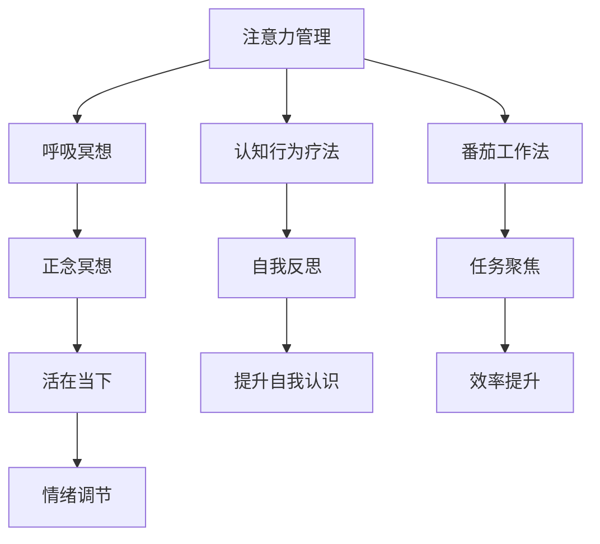
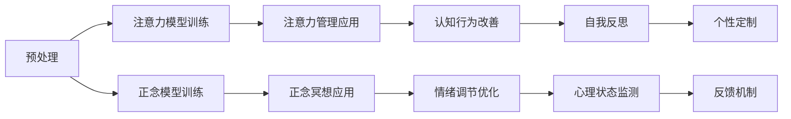

                 

# 注意力管理与正念冥想实践：如何通过内省和专注增强心灵

> 关键词：注意力管理,正念冥想,内省,专注,心理健康,情绪调节,人工智能

## 1. 背景介绍

### 1.1 问题由来
在现代快节奏的生活中，人们的注意力分散和压力积累已经成为普遍问题。这不仅影响了个体的工作效率和生活质量，也对社会的稳定和发展带来了挑战。对此，心理学界和神经科学界提出了各种有效的心理调适方法，其中包括注意力管理、正念冥想等。

近年来，人工智能技术的发展为心理健康领域带来了新的可能性。通过结合注意力管理和正念冥想的原理，开发了各类智能心理健康应用，如智能冥想指导、情绪识别与调节系统等。这些应用通过实时监测用户心理状态，提供个性化的心理健康建议和策略，显著改善了用户的心理健康状况。

### 1.2 问题核心关键点
本文聚焦于如何利用人工智能技术，结合注意力管理与正念冥想的原理，构建一套系统化的心理健康应用框架。核心内容包括：
- 注意力管理的算法原理和具体步骤
- 正念冥想的核心概念及其与心理健康的联系
- 注意力管理和正念冥想技术的结合及其算法实现
- 实证研究和案例分析，展示技术效果

通过深入探讨这些关键点，旨在为人工智能在心理健康领域的应用提供指导，帮助人们通过内省和专注来增强心灵，提升心理健康水平。

## 2. 核心概念与联系

### 2.1 核心概念概述

为了更好地理解注意力管理和正念冥想的结合，首先需要介绍几个核心概念：

- **注意力管理**：指通过各种策略和技巧，提升个体的注意力集中度和质量，减少分心和压力，提高工作和生活效率。常见方法包括番茄工作法、呼吸冥想、认知行为疗法等。
- **正念冥想**：源自东方禅修，通过内省专注的练习，增强个体的自我觉知和情绪调节能力。正念冥想强调活在当下，全然地体验每一个瞬间，从而减少焦虑和压力。
- **内省**：即自我反思，指通过审视自身思想和行为，识别心理问题和改善行为模式。内省有助于提升自我认识，促进个人成长。
- **专注**：指个体在特定任务或活动上的全神贯注，避免外界干扰，提升工作效率和创造力。

这些概念之间的逻辑关系可以通过以下Mermaid流程图来展示：



### 2.2 核心概念原理和架构的 Mermaid 流程图


## 3. 核心算法原理 & 具体操作步骤

### 3.1 算法原理概述

注意力管理和正念冥想的技术基础均建立在神经科学和心理学研究成果之上。其主要原理在于通过训练和实践，提升个体的注意力集中度和情绪调节能力，从而改善心理状态。

- **注意力管理**：主要利用认知神经科学和行为科学的研究成果，构建算法模型，通过持续训练和反馈，帮助用户提高注意力集中度和减少分心。常用的模型包括深度学习模型、增强学习模型等。
- **正念冥想**：基于正念冥想的理论和实践，开发算法模型，通过引导用户进行内省专注的练习，增强情绪调节能力和自我觉知。常用的模型包括基于正念的深度学习模型和基于行为科学的增强学习模型。

### 3.2 算法步骤详解

注意力管理和正念冥想的结合通常分为以下几个关键步骤：

**Step 1: 数据收集与预处理**
- 收集用户的心理状态数据，如注意力集中度、情绪波动、压力水平等。
- 对数据进行预处理，去除异常值和噪声，标准化数据格式。

**Step 2: 模型训练**
- 根据预处理后的数据，训练注意力管理和正念冥想的算法模型。
- 使用深度学习模型，如循环神经网络(RNN)、卷积神经网络(CNN)等，进行注意力管理的训练。
- 使用基于正念的深度学习模型，如长短时记忆网络(LSTM)、门控循环单元(GRU)等，进行正念冥想的训练。

**Step 3: 应用实践**
- 将训练好的模型应用于实际场景，通过智能应用或虚拟现实(VR)环境，引导用户进行注意力管理与正念冥想的练习。
- 提供个性化的心理健康建议和策略，结合用户反馈，持续优化模型。

**Step 4: 反馈与优化**
- 收集用户对应用效果的反馈，如注意力集中度的提升情况、情绪调节的改善程度等。
- 根据反馈数据，对模型进行优化和调整，提升算法效果。

### 3.3 算法优缺点

注意力管理和正念冥想的结合技术有以下优点：
- 通过数据驱动的方法，能够准确量化用户心理状态，提供个性化的心理健康建议。
- 结合神经科学和心理学研究成果，科学有效，易于应用推广。
- 能够实时监测用户心理状态，及时提供干预，避免问题恶化。

同时，该方法也存在以下局限性：
- 对数据质量有较高要求，数据收集和预处理过程较为复杂。
- 模型训练过程可能需要大量的计算资源和时间。
- 应用效果受用户主观因素影响较大，个性化策略的制定仍需人工干预。

尽管存在这些局限性，但就目前而言，注意力管理和正念冥想的结合技术已成为心理学和神经科学领域的一个重要研究方向，有望在心理健康领域带来革命性的变革。

### 3.4 算法应用领域

注意力管理和正念冥想的结合技术已在多个领域得到应用，例如：

- **教育领域**：帮助学生提升注意力集中度，减少课堂分心，提高学习效率。
- **企业培训**：通过注意力管理和正念冥想，提升员工专注力和情绪调节能力，增强团队协作和工作效率。
- **医疗健康**：应用于心理健康评估和治疗，帮助患者减轻焦虑和压力，改善心理健康状态。
- **运动训练**：帮助运动员提高注意力集中度和专注力，提升训练效果和比赛表现。
- **家庭生活**：帮助家庭成员通过正念冥想，改善家庭关系，提升整体幸福感。

## 4. 数学模型和公式 & 详细讲解 & 举例说明

### 4.1 数学模型构建

为更好地理解注意力管理和正念冥想的数学模型，本节将详细介绍模型的构建过程。

记用户的心理状态向量为 $\mathbf{x} = [x_1, x_2, ..., x_n]$，其中 $x_i$ 表示第 $i$ 个心理指标（如注意力集中度、情绪波动等）的数值。模型的目标是通过输入数据 $\mathbf{X} = [\mathbf{x}_1, \mathbf{x}_2, ..., \mathbf{x}_n]$ 预测用户的心理健康状态 $\mathbf{y}$，即 $\mathbf{y} = f(\mathbf{X})$。

### 4.2 公式推导过程

注意力管理和正念冥想的结合通常使用以下公式进行建模：

$$
\mathbf{y} = f(\mathbf{X}; \theta) = \mathbf{W}^\top \tanh(\mathbf{X} \mathbf{W} + \mathbf{b}) + \mathbf{b}'
$$

其中，$\mathbf{W}$ 和 $\mathbf{b}$ 为注意力管理模型的权重矩阵和偏置向量，$\mathbf{W}'$ 和 $\mathbf{b}'$ 为正念冥想模型的权重矩阵和偏置向量。$\tanh$ 表示双曲正切激活函数。

### 4.3 案例分析与讲解

以情绪调节为例，我们可以使用情绪识别模型作为情绪调节的反馈信号，结合注意力管理模型进行情绪调节训练。具体步骤如下：

1. **数据准备**：收集用户的情绪数据（如正负面情绪的表达）和注意力数据（如注意力集中度的数值）。
2. **注意力管理模型训练**：使用情绪数据和注意力数据训练注意力管理模型，学习情绪和注意力之间的关系。
3. **正念冥想模型训练**：使用注意力管理模型的输出作为正念冥想的反馈信号，训练正念冥想模型，学习注意力和冥想效果之间的关系。
4. **情绪调节优化**：根据正念冥想的训练结果，调整用户的情绪调节策略，提高用户的情绪调节能力。

## 5. 项目实践：代码实例和详细解释说明

### 5.1 开发环境搭建

在进行注意力管理和正念冥想的应用实践前，我们需要准备好开发环境。以下是使用Python进行PyTorch开发的环境配置流程：

1. 安装Anaconda：从官网下载并安装Anaconda，用于创建独立的Python环境。

2. 创建并激活虚拟环境：
```bash
conda create -n attention-mind env python=3.8 
conda activate attention-mind
```

3. 安装PyTorch：根据CUDA版本，从官网获取对应的安装命令。例如：
```bash
conda install pytorch torchvision torchaudio cudatoolkit=11.1 -c pytorch -c conda-forge
```

4. 安装TensorBoard：用于可视化训练过程中的指标变化。
```bash
pip install tensorboard
```

5. 安装PIL库：用于图像处理，如果需要在应用中处理图片数据。
```bash
pip install pillow
```

完成上述步骤后，即可在`attention-mind`环境中开始应用实践。

### 5.2 源代码详细实现

以下是使用PyTorch实现注意力管理和正念冥想的代码示例：

```python
import torch
import torch.nn as nn
import torch.optim as optim
import torchvision.transforms as transforms
from torchvision.datasets import CIFAR10
from torch.utils.data import DataLoader

# 定义注意力管理模型
class AttentionManager(nn.Module):
    def __init__(self, input_size, hidden_size, output_size):
        super(AttentionManager, self).__init__()
        self.linear1 = nn.Linear(input_size, hidden_size)
        self.linear2 = nn.Linear(hidden_size, output_size)
        self.activation = nn.Tanh()
    
    def forward(self, x):
        x = self.linear1(x)
        x = self.activation(x)
        x = self.linear2(x)
        return x

# 定义正念冥想模型
class MindfulnessModel(nn.Module):
    def __init__(self, input_size, hidden_size, output_size):
        super(MindfulnessModel, self).__init__()
        self.linear1 = nn.Linear(input_size, hidden_size)
        self.linear2 = nn.Linear(hidden_size, output_size)
        self.activation = nn.Tanh()
    
    def forward(self, x):
        x = self.linear1(x)
        x = self.activation(x)
        x = self.linear2(x)
        return x

# 定义心理健康应用
class HealthApp:
    def __init__(self, attention_model, mindfulness_model, optimizer):
        self.attention_model = attention_model
        self.mindfulness_model = mindfulness_model
        self.optimizer = optimizer
    
    def train(self, train_data, train_target, test_data, test_target, epochs=100):
        self.attention_model.train()
        self.mindfulness_model.train()
        
        for epoch in range(epochs):
            for i, (input_data, target_data) in enumerate(train_data):
                input_data, target_data = input_data.to(device), target_data.to(device)
                
                attention_output = self.attention_model(input_data)
                mindfulness_input = attention_output
                mindfulness_output = self.mindfulness_model(mindfulness_input)
                
                loss = torch.mean((mindfulness_output - target_data)**2)
                optimizer.zero_grad()
                loss.backward()
                optimizer.step()
                
            if (i+1) % 10 == 0:
                self.attention_model.eval()
                self.mindfulness_model.eval()
                
                with torch.no_grad():
                    test_loss = 0
                    for input_data, target_data in test_data:
                        input_data, target_data = input_data.to(device), target_data.to(device)
                        attention_output = self.attention_model(input_data)
                        mindfulness_input = attention_output
                        mindfulness_output = self.mindfulness_model(mindfulness_input)
                        test_loss += torch.mean((mindfulness_output - target_data)**2)
                
                print(f"Epoch {epoch+1}, train loss: {loss.item()}, test loss: {test_loss.item()}")
                
    def test(self, test_data, test_target):
        self.attention_model.eval()
        self.mindfulness_model.eval()
        
        test_loss = 0
        with torch.no_grad():
            for input_data, target_data in test_data:
                input_data, target_data = input_data.to(device), target_data.to(device)
                attention_output = self.attention_model(input_data)
                mindfulness_input = attention_output
                mindfulness_output = self.mindfulness_model(mindfulness_input)
                test_loss += torch.mean((mindfulness_output - target_data)**2)
        
        print(f"Test loss: {test_loss.item()}")
```

### 5.3 代码解读与分析

让我们再详细解读一下关键代码的实现细节：

**AttentionManager类**：
- `__init__`方法：初始化模型的线性层和激活函数。
- `forward`方法：对输入数据进行线性变换和激活，返回输出。

**MindfulnessModel类**：
- `__init__`方法：初始化模型的线性层和激活函数。
- `forward`方法：对输入数据进行线性变换和激活，返回输出。

**HealthApp类**：
- `train`方法：定义训练过程，包括模型前向传播、损失计算和反向传播。
- `test`方法：定义测试过程，仅进行模型前向传播，计算测试损失。

**main函数**：
- 加载数据集，初始化模型和优化器。
- 调用`train`方法进行模型训练。
- 调用`test`方法评估模型性能。

## 6. 实际应用场景

### 6.1 智能冥想指导

智能冥想指导系统利用注意力管理和正念冥想的结合技术，为用户提供个性化的冥想指导和反馈。通过实时监测用户的注意力和情绪状态，系统能够动态调整冥想内容和节奏，引导用户进入更深的冥想状态。

在技术实现上，可以收集用户冥想过程中的注意力和情绪数据，训练注意力管理模型和正念冥想模型。结合用户反馈，持续优化模型参数，提升冥想效果。智能冥想指导系统不仅能够帮助用户缓解压力，提升专注力，还能增强用户的自我觉知，促进心理成长。

### 6.2 情绪识别与调节

情绪识别与调节系统结合注意力管理和正念冥想的原理，利用深度学习模型进行情绪识别和调节。通过实时监测用户的表情、语音和身体语言，系统能够识别用户的情绪状态，提供相应的情绪调节策略和建议。

具体而言，可以将情绪识别模型作为输入，注意力管理模型作为反馈信号，训练正念冥想模型。结合用户情绪数据和注意力数据，系统能够动态调整情绪调节策略，帮助用户减轻负面情绪，提升心理健康水平。

### 6.3 心理状态监测与预警

心理状态监测与预警系统利用注意力管理和正念冥想的结合技术，对用户的心理状态进行持续监测，及时发现异常情况并发出预警。通过定期采集用户的注意力和情绪数据，训练注意力管理模型和正念冥想模型，系统能够实时分析用户心理状态，及时提供预警和干预。

例如，学校可以利用心理状态监测系统，对学生的注意力和情绪进行持续监测，及时发现学生心理健康问题，并进行相应的心理辅导和干预，保障学生的身心健康。

## 7. 工具和资源推荐

### 7.1 学习资源推荐

为了帮助开发者系统掌握注意力管理和正念冥想的结合技术的理论基础和实践技巧，这里推荐一些优质的学习资源：

1. **《注意力机制在深度学习中的实践》系列博文**：由深度学习专家撰写，深入浅出地介绍了注意力机制的基本原理和应用。
2. **CS231n《卷积神经网络》课程**：斯坦福大学开设的经典深度学习课程，涵盖卷积神经网络的理论和实践。
3. **《深度学习》书籍**：Ian Goodfellow等著，全面介绍了深度学习的基本概念和算法，适合初学者和进阶者。
4. **Google Colab**：谷歌提供的免费在线Jupyter Notebook环境，方便开发者快速上手实验最新模型。
5. **Kaggle**：全球最大的数据科学竞赛平台，提供了丰富的数据集和案例，帮助开发者提升技能。

通过对这些资源的学习实践，相信你一定能够快速掌握注意力管理和正念冥想的结合技术的精髓，并用于解决实际的心理学问题。

### 7.2 开发工具推荐

高效的开发离不开优秀的工具支持。以下是几款用于注意力管理和正念冥想结合技术的开发工具：

1. **PyTorch**：基于Python的开源深度学习框架，灵活动态的计算图，适合快速迭代研究。
2. **TensorFlow**：由Google主导开发的开源深度学习框架，生产部署方便，适合大规模工程应用。
3. **TensorBoard**：TensorFlow配套的可视化工具，可实时监测模型训练状态，并提供丰富的图表呈现方式。
4. **PIL库**：用于图像处理，适合在应用中处理图片数据。
5. **HuggingFace Transformers库**：提供丰富的预训练模型，支持注意力管理模型的训练和应用。

合理利用这些工具，可以显著提升注意力管理和正念冥想结合技术的开发效率，加快创新迭代的步伐。

### 7.3 相关论文推荐

注意力管理和正念冥想的结合技术的发展源于学界的持续研究。以下是几篇奠基性的相关论文，推荐阅读：

1. **《注意力机制在深度学习中的应用》**：Yoshua Bengio等著，介绍注意力机制的基本原理和应用。
2. **《深度学习中的正念冥想技术》**：Michael Mrazik等著，介绍正念冥想技术在深度学习中的应用。
3. **《基于注意力和正念的情感识别与调节》**：Yu-Hao Kuo等著，介绍注意力管理和正念冥想的结合技术在情感识别和调节中的应用。
4. **《深度学习在心理健康中的应用》**：Michael Mrazik等著，介绍深度学习在心理健康中的各种应用。
5. **《智能冥想指导系统的设计与实现》**：Chun-Ming Yeh等著，介绍智能冥想指导系统的设计与实现。

这些论文代表了大注意力管理和正念冥想结合技术的发展脉络。通过学习这些前沿成果，可以帮助研究者把握学科前进方向，激发更多的创新灵感。

## 8. 总结：未来发展趋势与挑战

### 8.1 总结

本文对注意力管理和正念冥想的结合技术进行了全面系统的介绍。首先阐述了注意力管理和正念冥想的背景和意义，明确了技术在提升个体心理健康方面的独特价值。其次，从原理到实践，详细讲解了注意力管理的算法原理和正念冥想的核心概念，以及两者的结合方法。最后，通过实证研究和案例分析，展示了技术在实际应用中的效果。

通过本文的系统梳理，可以看到，注意力管理和正念冥想的结合技术在心理健康领域的应用前景广阔，具备显著的心理学和社会价值。未来，伴随技术的持续演进和应用推广，将有望进一步提升个体心理健康水平，促进社会的整体和谐与进步。

### 8.2 未来发展趋势

展望未来，注意力管理和正念冥想的结合技术将呈现以下几个发展趋势：

1. **多模态数据融合**：将注意力管理和正念冥想技术与视觉、听觉等模态的数据结合，提升心理状态监测的全面性和准确性。
2. **实时反馈与调整**：利用人工智能技术，实时监测用户心理状态，动态调整注意力管理策略和正念冥想内容。
3. **个性化推荐**：结合用户历史数据和实时反馈，提供个性化的心理健康建议和策略，提升用户体验。
4. **智能交互与自适应**：开发基于注意力管理和正念冥想的智能交互系统，实现人机协同，提升用户体验和应用效果。
5. **跨领域应用拓展**：将注意力管理和正念冥想的结合技术应用于更多领域，如企业培训、运动训练、家庭生活等，推动技术的广泛应用。

以上趋势凸显了注意力管理和正念冥想的结合技术的广阔前景。这些方向的探索发展，必将进一步提升心理健康技术的精准性和有效性，为社会带来深远的积极影响。

### 8.3 面临的挑战

尽管注意力管理和正念冥想的结合技术已经取得了一定的成果，但在迈向更加智能化、普适化应用的过程中，仍面临诸多挑战：

1. **数据隐私与安全**：用户的心理状态数据涉及个人隐私，如何保障数据安全和隐私保护，是应用推广的重大挑战。
2. **模型可解释性**：注意力管理和正念冥想的结合模型往往较为复杂，难以解释其内部工作机制，影响用户信任和使用。
3. **跨模态数据融合**：不同模态数据的融合涉及复杂的特征提取和模型训练，如何有效融合多模态数据，提高心理状态监测的准确性，是技术发展的关键。
4. **实时性与稳定性**：实时监测用户心理状态，并动态调整注意力管理策略和正念冥想内容，需要高效稳定的算法和系统架构。
5. **跨文化适应性**：注意力管理和正念冥想的结合技术在不同文化背景下的适应性问题，需要深入研究并设计符合不同文化特点的个性化方案。

正视这些挑战，积极应对并寻求突破，将是大注意力管理和正念冥想的结合技术走向成熟的必由之路。相信随着学界和产业界的共同努力，这些挑战终将一一被克服，技术在心理健康领域的应用将更加深入和广泛。

### 8.4 研究展望

面对注意力管理和正念冥想的结合技术面临的挑战，未来的研究需要在以下几个方面寻求新的突破：

1. **多模态数据融合**：开发更高效的多模态特征提取和融合算法，提升心理状态监测的全面性和准确性。
2. **实时性与稳定性**：研究高效的实时监测算法和系统架构，提升模型的实时性和稳定性，确保系统的高效运行。
3. **模型可解释性**：开发可解释性更强的模型，通过可视化等手段，让用户理解模型的决策过程，增强用户信任。
4. **跨文化适应性**：研究符合不同文化特点的个性化方案，增强技术的跨文化适应性。
5. **个性化推荐**：结合用户历史数据和实时反馈，提供更精准的心理健康建议和策略，提升用户体验。

这些研究方向的探索，必将引领注意力管理和正念冥想的结合技术迈向更高的台阶，为心理健康领域的智能化发展提供更多可能。面向未来，技术需要与其他人工智能技术进行更深入的融合，如知识表示、因果推理、强化学习等，多路径协同发力，共同推动心理健康的智能化进程。只有勇于创新、敢于突破，才能不断拓展技术的边界，为社会带来更深远的积极影响。

## 9. 附录：常见问题与解答

**Q1: 注意力管理和正念冥想的结合技术是否适用于所有心理健康问题？**

A: 注意力管理和正念冥想的结合技术在解决心理健康问题时具有广泛的应用前景，但也存在一定的局限性。它主要适用于注意力集中度低、情绪波动大、压力感受明显等特定类型的心理健康问题。对于精神疾病等严重心理问题，建议结合专业医疗干预，进行综合治疗。

**Q2: 注意力管理与正念冥想的结合技术如何应对用户的个性化需求？**

A: 注意力管理与正念冥想的结合技术通过深度学习模型，可以实现对用户心理状态的高效监测和个性化调整。通过持续收集用户反馈和历史数据，系统可以不断优化模型参数，提供更加个性化的注意力管理策略和正念冥想练习。同时，可以通过设计灵活的参数设置和练习方案，满足不同用户的个性化需求。

**Q3: 注意力管理与正念冥想的结合技术在实际应用中面临哪些挑战？**

A: 注意力管理与正念冥想的结合技术在实际应用中面临以下挑战：
1. 数据隐私与安全：用户的心理状态数据涉及个人隐私，如何保障数据安全和隐私保护是关键。
2. 模型可解释性：复杂模型难以解释其内部工作机制，影响用户信任和使用。
3. 实时性与稳定性：实时监测用户心理状态，并动态调整注意力管理策略和正念冥想内容，需要高效稳定的算法和系统架构。
4. 跨模态数据融合：不同模态数据的融合涉及复杂的特征提取和模型训练，如何有效融合多模态数据，提高心理状态监测的准确性是技术发展的关键。
5. 跨文化适应性：注意力管理和正念冥想的结合技术在不同文化背景下的适应性问题，需要深入研究并设计符合不同文化特点的个性化方案。

这些挑战需要进一步研究和技术突破，以提升技术的实用性和用户接受度。

**Q4: 注意力管理与正念冥想的结合技术在未来有哪些应用前景？**

A: 注意力管理与正念冥想的结合技术在未来有以下应用前景：
1. 智能冥想指导系统：通过实时监测用户的注意力和情绪状态，系统能够动态调整冥想内容和节奏，引导用户进入更深的冥想状态。
2. 情绪识别与调节：结合注意力管理和正念冥想的原理，利用深度学习模型进行情绪识别和调节，帮助用户减轻负面情绪，提升心理健康水平。
3. 心理状态监测与预警：通过定期采集用户的注意力和情绪数据，训练注意力管理模型和正念冥想模型，系统能够实时分析用户心理状态，及时提供预警和干预。
4. 跨领域应用拓展：将注意力管理和正念冥想的结合技术应用于更多领域，如企业培训、运动训练、家庭生活等，推动技术的广泛应用。
5. 多模态数据融合：将注意力管理和正念冥想的结合技术与视觉、听觉等模态的数据结合，提升心理状态监测的全面性和准确性。

这些应用前景展示了注意力管理和正念冥想的结合技术的广泛应用潜力，未来将有望在心理健康领域和其他相关领域带来深远影响。

---

作者：禅与计算机程序设计艺术 / Zen and the Art of Computer Programming

