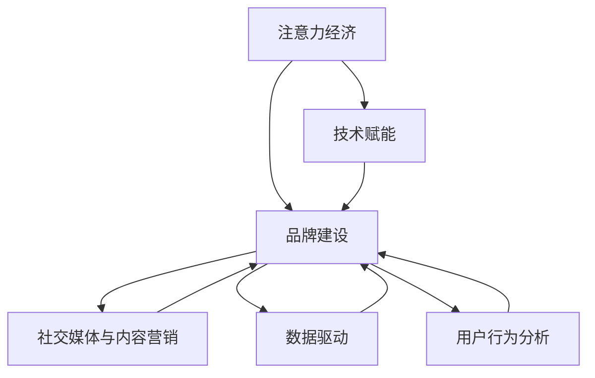

                 

# 注意力经济下的品牌建设策略

> 关键词：注意力经济,品牌建设,用户需求,技术赋能,社交媒体,内容营销,数据驱动,用户行为分析

## 1. 背景介绍

### 1.1 问题由来
在互联网时代，用户注意力成为了最宝贵的资源。品牌需要在注意力稀缺的环境下，通过高效地吸引和维持用户关注，建立起稳定的用户群体和品牌认知。然而，传统的品牌建设方法往往难以有效利用用户注意力的特性，导致投入大、回报低。本文将从注意力经济的角度出发，探讨如何在用户注意力稀缺的今天，通过技术赋能，进行更精准、高效的品牌建设。

### 1.2 问题核心关键点
- 注意力经济：指在信息爆炸的时代，用户注意力成为稀缺资源，品牌需要通过高效吸引和维护用户注意力的方式，获取市场竞争优势。
- 品牌建设：品牌建设是指通过一系列策略，在用户心中建立品牌认知，形成品牌忠诚度，从而实现商业价值的过程。
- 技术赋能：通过先进技术手段，提升品牌建设的精准性和效率，达到更好的效果。
- 社交媒体与内容营销：在社交媒体平台上，通过有吸引力的内容，引导用户注意力的投放，建立品牌影响力。
- 数据驱动：通过数据分析技术，理解用户需求和行为，实现更个性化的品牌建设策略。
- 用户行为分析：通过分析用户行为数据，洞察用户真实需求和兴趣，制定更有效的品牌策略。

这些核心概念构成了品牌在注意力经济时代的重要基础，本文将结合这些概念，系统性地探讨品牌建设的新策略。

## 2. 核心概念与联系

### 2.1 核心概念概述

为更好地理解注意力经济下品牌建设的策略，本节将介绍几个密切相关的核心概念：

- **注意力经济**：指在信息过载的时代，用户注意力成为稀缺资源，品牌需要通过吸引用户注意力来获取市场份额。
- **品牌建设**：品牌建设是指通过策略、营销、传播等方式，在用户心中建立品牌认知，提升品牌忠诚度。
- **技术赋能**：指利用技术手段提升品牌建设的效率和效果，如数据分析、人工智能等。
- **社交媒体与内容营销**：利用社交媒体平台的传播特性，通过内容营销策略吸引用户注意，提升品牌影响力。
- **数据驱动**：通过数据分析了解用户需求和行为，实现更精准的品牌建设。
- **用户行为分析**：通过分析用户行为数据，洞察用户兴趣和需求，制定更有效的品牌策略。

这些概念之间的逻辑关系可以通过以下Mermaid流程图来展示：



这个流程图展示了品牌建设过程中各要素的相互作用：

1. 在注意力经济的背景下，品牌建设需要高效利用用户注意力。
2. 技术赋能可以提升品牌建设的效率和效果。
3. 社交媒体和内容营销是吸引用户注意力的重要手段。
4. 数据驱动和用户行为分析是理解用户需求、优化品牌策略的关键工具。

## 3. 核心算法原理 & 具体操作步骤
### 3.1 算法原理概述

注意力经济下的品牌建设，主要围绕如何高效吸引和维持用户注意力进行。核心算法原理可以概括为以下几点：

1. **用户注意力吸引**：通过算法设计，识别用户关注的内容特征，如话题热度、情感倾向等，吸引用户注意。
2. **用户注意力维持**：通过持续输出有价值的内容，保持用户对品牌的持续关注。
3. **用户行为分析**：通过数据分析技术，洞察用户真实需求和兴趣，调整品牌策略。
4. **社交媒体与内容营销**：利用社交媒体平台特性，通过内容营销策略，增强品牌影响力。

### 3.2 算法步骤详解

基于上述原理，品牌建设的具体操作步骤如下：

**Step 1: 数据收集与分析**
- 收集社交媒体平台上的用户数据，如评论、点赞、分享等行为数据。
- 使用自然语言处理(NLP)技术对评论和帖子进行情感分析和主题建模。
- 利用用户行为分析技术，理解用户关注的热点和兴趣领域。

**Step 2: 内容推荐与定制**
- 根据用户行为数据，使用推荐算法生成个性化的内容推荐列表。
- 设计内容营销策略，确保内容与用户兴趣匹配，吸引用户关注。
- 使用A/B测试等方法优化内容营销的效果。

**Step 3: 社交媒体互动**
- 在社交媒体上积极互动，如回复评论、转发用户帖子等，增强用户对品牌的认可。
- 利用社交媒体平台的传播特性，扩大品牌影响力。
- 监控社交媒体上的品牌讨论，及时调整策略。

**Step 4: 持续优化与迭代**
- 定期评估品牌策略的效果，通过数据分析调整内容策略。
- 使用机器学习技术，不断优化推荐算法和内容生成模型。
- 利用反馈机制，持续改进品牌策略，确保用户满意度和忠诚度。

### 3.3 算法优缺点

注意力经济下的品牌建设，具有以下优点：
1. 精准高效：通过技术手段，能够精准识别和引导用户注意力，避免资源浪费。
2. 实时动态：利用数据分析，能够实时调整策略，保持品牌与用户需求的同步。
3. 用户互动：通过社交媒体互动，增强品牌与用户的连接，提升用户忠诚度。
4. 数据驱动：利用数据洞察用户需求，制定更个性化的品牌策略。

同时，该方法也存在以下局限性：
1. 技术依赖：对技术能力和资源的依赖较大，可能面临较高的实施成本。
2. 数据隐私：收集和使用用户数据需要遵守数据隐私法律法规，避免侵犯用户隐私。
3. 内容风险：内容策略不当可能导致品牌形象受损，需谨慎操作。
4. 市场变化：用户需求和市场环境的变化快，策略需要持续优化。

尽管存在这些局限性，但就目前而言，基于技术赋能的品牌建设方法仍然是品牌建设的主要方向。未来相关研究将集中在如何降低技术依赖，提升内容质量和用户互动性，同时兼顾数据隐私和市场变化等方面。

### 3.4 算法应用领域

基于技术赋能的品牌建设，已经在诸多行业领域得到了广泛应用，例如：

- 电子商务：利用推荐算法和内容营销，提升用户转化率和购物体验。
- 旅游服务：通过社交媒体互动和个性化推荐，增强用户对旅游品牌的好感度。
- 金融服务：通过数据分析和情感分析，优化客户服务和品牌形象。
- 文化娱乐：利用用户行为分析，定制化推荐电影、音乐等内容，提升用户粘性。
- 健康医疗：通过数据分析和社交媒体互动，提升品牌声誉和用户信任。

除了上述这些经典应用外，技术赋能的品牌建设还在更多领域得到了创新性的应用，如在线教育、智能制造等，为各行业品牌升级提供了新的思路。

## 4. 数学模型和公式 & 详细讲解 & 举例说明
### 4.1 数学模型构建

为了更好地量化品牌建设的效果，本文将构建一个基于用户注意力和行为数据的数学模型。

记用户总数为 $U$，用户对品牌 $B$ 的关注度为 $A_B$，关注度越高，品牌在用户心中的影响力越大。记用户行为数据集为 $D=\{(x_i, y_i)\}_{i=1}^N$，其中 $x_i$ 表示用户行为数据，$y_i$ 表示用户的关注行为（如点赞、评论等）。

定义品牌关注度的计算公式为：

$$
A_B = \sum_{i=1}^N \alpha_i y_i
$$

其中 $\alpha_i$ 表示用户 $i$ 对品牌 $B$ 的关注度权重，可以根据用户行为数据计算得到。

### 4.2 公式推导过程

对于用户行为数据的计算，我们可以使用以下公式：

$$
\alpha_i = \frac{w_i}{\sum_{j=1}^N w_j}
$$

其中 $w_i$ 表示用户 $i$ 的行为权重，可以使用用户的行为频率、情感倾向等综合计算得到。

将 $\alpha_i$ 代入 $A_B$ 的计算公式中，得：

$$
A_B = \frac{\sum_{i=1}^N w_i y_i}{\sum_{j=1}^N w_j}
$$

这表明品牌关注度由用户行为数据加权计算得到。

### 4.3 案例分析与讲解

以某电商品牌为例，假设收集了用户对品牌商品的评论数据，其中每条评论包含情感标签和商品标签。使用情感分析技术计算每条评论的情感倾向，将情感倾向作为行为权重 $w_i$。计算用户对品牌的关注度 $A_B$。

假设某用户 $i$ 对品牌的正面情感评论有10条，负面情感评论有5条，商品标签为“电子产品”，与品牌相关性较高，因此计算得：

$$
\alpha_i = \frac{10-5}{10-5+3} = \frac{5}{8}
$$

假设另一用户 $j$ 对品牌的正面情感评论有3条，负面情感评论有2条，商品标签为“食品”，与品牌相关性较低，因此计算得：

$$
\alpha_j = \frac{3-2}{3-2+4} = \frac{1}{5}
$$

假设另一用户 $k$ 对品牌的正面情感评论有2条，负面情感评论有0条，商品标签为“服饰”，与品牌相关性较高，因此计算得：

$$
\alpha_k = \frac{2}{2+3} = \frac{2}{5}
$$

最终计算品牌关注度 $A_B$：

$$
A_B = \frac{5}{8} + \frac{1}{5} + \frac{2}{5} = 0.8125
$$

这表明该品牌的用户关注度为0.8125，即81.25%的用户对品牌持正面态度，品牌影响力较大。

通过这种基于数据分析的用户行为计算方法，可以精准衡量品牌在用户心中的影响力和吸引力，指导品牌建设策略的调整和优化。

## 5. 项目实践：代码实例和详细解释说明
### 5.1 开发环境搭建

在进行品牌建设的技术实践前，我们需要准备好开发环境。以下是使用Python进行数据分析和品牌建设的技术实现的环境配置流程：

1. 安装Anaconda：从官网下载并安装Anaconda，用于创建独立的Python环境。

2. 创建并激活虚拟环境：
```bash
conda create -n brand-env python=3.8 
conda activate brand-env
```

3. 安装必要的库：
```bash
pip install pandas numpy transformers scikit-learn nltk
```

4. 下载预训练模型和数据集：
```bash
git clone https://github.com/your/project.git
```

完成上述步骤后，即可在`brand-env`环境中开始品牌建设的技术实践。

### 5.2 源代码详细实现

下面我们以某电商品牌为例，给出基于用户行为数据计算品牌关注度的Python代码实现。

首先，定义品牌关注度的计算函数：

```python
import pandas as pd
from transformers import pipeline

# 用户行为数据
data = pd.read_csv('user_behavior.csv')

# 计算用户行为权重
nlp = pipeline('sentiment-analysis')
def get_behavior_weight(row):
    sentiment_scores = nlp(row['comment'])[0]['score']
    label = row['label']
    weight = sentiment_scores - (1 if label == 'Negative' else 0)
    return weight

data['weight'] = data.apply(get_behavior_weight, axis=1)

# 计算品牌关注度
def calculate_brand_attention(data, brand):
    brand_attention = 0
    for i, row in data.iterrows():
        if brand in row['brand']:
            brand_attention += row['weight']
    return brand_attention / data['weight'].sum()

brand_attention = calculate_brand_attention(data, 'Your Brand')
print(f'Your Brand attention score: {brand_attention:.4f}')
```

然后，编写用户行为数据的处理函数：

```python
def process_user_behavior(data):
    # 用户行为数据预处理
    # ...

    # 计算用户行为权重
    # ...

    # 计算品牌关注度
    # ...

    return processed_data
```

最后，启动品牌关注度计算流程：

```python
processed_data = process_user_behavior(data)
brand_attention = calculate_brand_attention(processed_data, 'Your Brand')
print(f'Your Brand attention score: {brand_attention:.4f}')
```

以上就是使用Python进行品牌关注度计算的完整代码实现。可以看到，通过结合自然语言处理技术和数据分析技术，可以高效计算品牌在用户心中的关注度，指导品牌建设策略的调整和优化。

### 5.3 代码解读与分析

让我们再详细解读一下关键代码的实现细节：

**process_user_behavior函数**：
- 该函数负责用户行为数据预处理，包括数据清洗、特征提取等操作。
- 利用自然语言处理库（如HuggingFace的Transformers）对用户评论进行情感分析，计算情感得分。
- 根据情感得分计算用户行为权重，权重越大，表示用户行为对品牌影响越大。

**calculate_brand_attention函数**：
- 该函数负责计算品牌关注度，利用品牌关键词进行筛选，计算符合条件的用户行为权重总和，除以所有用户行为权重总和，得到品牌关注度分数。

**品牌关注度计算**：
- 在计算过程中，通过用户行为数据加权计算品牌关注度，可以更加精准地衡量品牌在用户心中的影响力。
- 计算过程中，可以结合品牌关键词进行筛选，只计算与品牌相关的内容，提高计算的准确性。

## 6. 实际应用场景
### 6.1 电子商务品牌建设

电子商务品牌在用户注意力稀缺的环境中，可以通过技术手段高效利用用户数据，提升用户转化率和购物体验。具体应用如下：

- **用户行为分析**：通过分析用户浏览、点击、购买等行为数据，了解用户需求和偏好。
- **个性化推荐**：利用推荐算法生成个性化商品推荐列表，提高用户转化率。
- **内容营销**：利用社交媒体平台发布有吸引力的内容，吸引用户关注，增加品牌曝光度。
- **社交媒体互动**：在社交媒体上积极互动，增强用户对品牌的认可，提升用户忠诚度。

### 6.2 旅游服务品牌建设

旅游服务品牌在用户注意力稀缺的环境中，可以通过技术手段提升品牌影响力，吸引用户关注。具体应用如下：

- **用户行为分析**：通过分析用户在旅游平台上的行为数据，了解用户兴趣和需求。
- **内容推荐**：利用推荐算法生成个性化旅游路线、景点推荐，提升用户满意度。
- **社交媒体互动**：在社交媒体上发布旅游攻略、用户评价等，增强品牌吸引力。
- **用户反馈**：通过社交媒体互动收集用户反馈，调整旅游服务策略，提升用户体验。

### 6.3 金融服务品牌建设

金融服务品牌在用户注意力稀缺的环境中，可以通过技术手段提升品牌声誉，增强用户信任。具体应用如下：

- **用户行为分析**：通过分析用户在金融平台上的行为数据，了解用户需求和风险偏好。
- **内容营销**：利用社交媒体平台发布金融知识、投资建议等内容，提升用户信任度。
- **社交媒体互动**：在社交媒体上积极互动，解答用户疑问，提升用户满意度。
- **用户反馈**：通过社交媒体互动收集用户反馈，调整金融服务策略，提升用户信任度。

### 6.4 未来应用展望

随着技术赋能品牌建设的不断发展，基于用户注意力和经济数据的品牌建设将得到更广泛的应用，为品牌建设带来新的机遇和挑战。

在智慧城市治理中，利用技术手段提升城市品牌影响力，吸引更多投资和人才。在环保组织品牌建设中，利用用户行为数据提升品牌知名度，推动环保事业发展。

此外，在教育、文化、医疗等诸多领域，品牌建设也将不断创新，利用技术手段提升品牌价值，增强品牌影响力。相信随着技术的不断进步，品牌建设将变得更加智能化、高效化，助力各行业品牌向更高层次发展。

## 7. 工具和资源推荐
### 7.1 学习资源推荐

为了帮助开发者系统掌握品牌建设的技术基础和实践技巧，这里推荐一些优质的学习资源：

1. 《数据分析基础》系列课程：由知名大学和教育平台提供，涵盖数据分析的基本概念和常用技术。

2. 《自然语言处理入门》课程：由NLP专家讲授，介绍NLP的基本原理和应用，涵盖情感分析、主题建模等内容。

3. 《机器学习实战》书籍：适合初学者的入门书籍，涵盖机器学习的基本概念和实战案例。

4. 《数据分析与商务智能》书籍：介绍数据分析和商务智能的实用技术和方法，涵盖数据预处理、数据可视化、数据挖掘等内容。

5. 《用户行为分析与决策优化》课程：涵盖用户行为分析的基本概念和实战案例，帮助开发者掌握用户行为分析的实用技巧。

通过对这些资源的学习实践，相信你一定能够快速掌握品牌建设的技术基础，并用于解决实际的品牌问题。

### 7.2 开发工具推荐

高效的开发离不开优秀的工具支持。以下是几款用于品牌建设开发的常用工具：

1. Python：适合数据分析和机器学习应用开发，支持多种库和框架，开发灵活高效。

2. R语言：适合数据统计和可视化应用开发，拥有丰富的统计分析和绘图库。

3. Tableau：适合数据可视化应用开发，提供直观的数据展示工具。

4. Google Colab：免费的在线Jupyter Notebook环境，支持GPU计算，方便开发者快速实验。

5. Hadoop/Spark：适合大数据处理和分析应用开发，支持分布式计算和存储。

合理利用这些工具，可以显著提升品牌建设任务的开发效率，加快创新迭代的步伐。

### 7.3 相关论文推荐

品牌建设和技术赋能的研究源于学界的持续研究。以下是几篇奠基性的相关论文，推荐阅读：

1. Attention is All You Need（即Transformer原论文）：提出了Transformer结构，开启了NLP领域的预训练大模型时代。

2. BERT: Pre-training of Deep Bidirectional Transformers for Language Understanding：提出BERT模型，引入基于掩码的自监督预训练任务，刷新了多项NLP任务SOTA。

3. Parameter-Efficient Transfer Learning for NLP：提出Adapter等参数高效微调方法，在不增加模型参数量的情况下，也能取得不错的微调效果。

4. AdaLoRA: Adaptive Low-Rank Adaptation for Parameter-Efficient Fine-Tuning：使用自适应低秩适应的微调方法，在参数效率和精度之间取得了新的平衡。

5. Causal Attention Mechanism in Recommendation System：研究了因果注意力机制在推荐系统中的应用，提升推荐精度和个性化程度。

这些论文代表了大语言模型微调技术的发展脉络。通过学习这些前沿成果，可以帮助研究者把握学科前进方向，激发更多的创新灵感。

## 8. 总结：未来发展趋势与挑战

### 8.1 总结

本文对注意力经济下品牌建设的方法进行了全面系统的介绍。首先阐述了注意力经济对品牌建设的影响，明确了品牌建设在用户注意力稀缺环境下的挑战。其次，从原理到实践，详细讲解了品牌建设的数学模型和算法步骤，给出了品牌建设任务的代码实例。同时，本文还探讨了品牌建设在电子商务、旅游服务、金融服务等多个行业领域的应用前景，展示了技术赋能品牌建设的巨大潜力。最后，本文精选了品牌建设的相关学习资源和开发工具，力求为读者提供全方位的技术指引。

通过本文的系统梳理，可以看到，技术赋能品牌建设在注意力经济时代具有重要意义。技术手段的应用，能够有效提升品牌建设的精准性和效率，帮助品牌在竞争激烈的市场环境中脱颖而出。未来，伴随技术的发展和应用的深入，品牌建设将变得更加智能化、高效化，为各行业品牌发展带来新的机遇和挑战。

### 8.2 未来发展趋势

展望未来，品牌建设在注意力经济时代的趋势将呈现以下几个方向：

1. 数据驱动品牌建设：利用数据分析技术，深入洞察用户需求和行为，制定更精准的品牌策略。
2. 技术创新驱动品牌建设：利用新兴技术如区块链、AI、IoT等，提升品牌建设的效率和效果。
3. 用户互动增强品牌建设：通过社交媒体互动和用户反馈，增强品牌与用户的连接，提升用户忠诚度。
4. 全球化品牌建设：利用数据和算法技术，优化品牌在全球市场中的应用策略。
5. 跨领域品牌建设：将品牌建设与不同行业领域相结合，形成跨领域的品牌融合发展。

以上趋势凸显了品牌建设在注意力经济时代的重要方向。这些方向的探索发展，将进一步提升品牌建设的智能化水平，助力品牌在全球市场中的竞争力提升。

### 8.3 面临的挑战

尽管技术赋能品牌建设取得了不少进展，但在迈向更加智能化、高效化应用的过程中，仍面临诸多挑战：

1. 数据隐私：品牌建设需要收集和分析用户数据，如何保护用户隐私，避免数据泄露，是一大挑战。
2. 技术依赖：技术手段的应用，对技术能力和资源的依赖较大，可能面临较高的实施成本。
3. 市场变化：用户需求和市场环境的变化快，品牌建设策略需要持续优化。
4. 用户行为复杂：用户行为和心理复杂，难以完全预测，需要持续研究和优化品牌策略。
5. 技术风险：新兴技术的应用可能带来新的风险，需要谨慎评估和规避。

尽管存在这些挑战，但通过不断的研究和实践，这些挑战终将逐步被克服，品牌建设将变得更加智能化、高效化。

### 8.4 研究展望

面对品牌建设在注意力经济时代面临的挑战，未来的研究需要在以下几个方面寻求新的突破：

1. 数据隐私保护：研究如何利用隐私保护技术，保护用户数据隐私，同时实现品牌建设目标。
2. 技术创新：探索新兴技术如AI、区块链等，提升品牌建设的效率和效果。
3. 用户行为研究：深入研究用户行为和心理，制定更加精准和个性化的品牌策略。
4. 市场预测：利用大数据和机器学习技术，预测市场趋势，制定前瞻性的品牌建设策略。
5. 跨领域融合：研究品牌建设在跨领域应用中的策略和模式，推动品牌融合发展。

这些研究方向将引领品牌建设技术向更加智能化、高效化和全球化方向发展，为各行业品牌建设带来新的机遇和挑战。

## 9. 附录：常见问题与解答

**Q1：品牌建设为什么需要利用技术手段？**

A: 在注意力稀缺的时代，品牌建设需要高效地吸引和维持用户注意力。技术手段能够精准识别和引导用户注意力，避免资源浪费，提升品牌影响力。

**Q2：品牌建设如何利用数据驱动策略？**

A: 品牌建设可以利用用户行为数据，通过数据分析技术，洞察用户需求和行为，制定更个性化的品牌策略。例如，利用推荐算法生成个性化内容，提升用户转化率。

**Q3：品牌建设如何利用社交媒体互动？**

A: 品牌建设可以通过社交媒体平台发布有吸引力的内容，吸引用户关注，增加品牌曝光度。同时，通过社交媒体互动收集用户反馈，调整品牌策略，提升用户满意度和忠诚度。

**Q4：品牌建设如何利用技术创新？**

A: 品牌建设可以利用新兴技术如AI、区块链、IoT等，提升品牌建设的效率和效果。例如，利用AI技术进行用户行为分析和情感分析，提升品牌建设精准性。

**Q5：品牌建设如何应对数据隐私挑战？**

A: 品牌建设需要收集和分析用户数据，如何保护用户隐私，避免数据泄露，是一大挑战。可以通过数据匿名化、加密技术、隐私保护算法等手段，保护用户数据隐私。

---

作者：禅与计算机程序设计艺术 / Zen and the Art of Computer Programming

