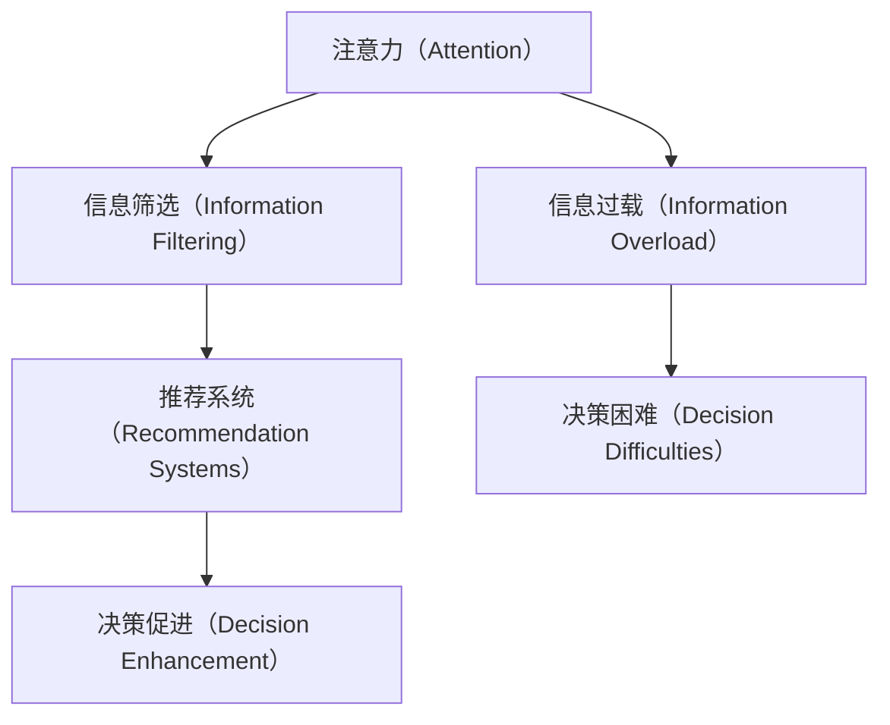

                 

# 注意力经济与个人消费决策的关系

## 1. 背景介绍

随着互联网的迅速发展，信息爆炸已成为我们这个时代的显著特征。大数据、云计算、人工智能等技术的不断进步，使得信息收集、处理和传播的成本大幅降低，信息量呈指数级增长。然而，大量的信息不仅没有提高我们的生活质量，反而造成了信息过载，使人们难以有效筛选和利用这些信息。在这一背景下，"注意力经济"（Attention Economy）应运而生，成为理解互联网时代信息消费行为的重要概念。

### 1.1 注意力经济的概念
注意力经济（Attention Economy）是指在信息泛滥的互联网时代，消费者对信息的注意力变得非常稀缺，而信息供应商通过争夺消费者的注意力来创造价值。这不仅体现在广告、新闻等传统领域，更扩展到了社交媒体、视频网站、电商平台等新兴领域。

### 1.2 信息过载对消费决策的影响
信息过载（Information Overload）是指人们在面对大量信息时，由于无法处理所有信息，而无法做出有效的消费决策。例如，在购买决策时，消费者需要从成千上万的商品中筛选出最符合自身需求的，这不仅费时费力，还可能导致选择错误，降低了消费者满意度。

## 2. 核心概念与联系

### 2.1 核心概念概述

为更好地理解注意力经济与个人消费决策的关系，本节将介绍几个密切相关的核心概念：

- **注意力（Attention）**：消费者在接受信息时所投入的关注度。注意力是消费者消费决策的基础，直接影响信息的价值和传播效果。
- **信息过载（Information Overload）**：消费者面临大量信息时无法有效处理，导致决策困难的情况。
- **信息筛选（Information Filtering）**：消费者在面对海量信息时，通过算法或人工手段进行信息筛选，过滤掉无用信息，保留有价值信息的过程。
- **推荐系统（Recommendation Systems）**：通过分析用户行为和兴趣，推荐符合用户需求的信息和商品，提高信息获取效率和消费决策的准确性。

这些核心概念之间的逻辑关系可以通过以下Mermaid流程图来展示：



这个流程图展示出注意力、信息筛选、推荐系统在信息过载和决策困难中的作用：

1. 消费者面临大量信息时，通过注意力筛选出重要信息。
2. 推荐系统根据用户行为和兴趣推荐信息，减少信息筛选的难度。
3. 推荐系统使得决策更加高效和准确，提高消费满意度。

## 3. 核心算法原理 & 具体操作步骤
### 3.1 算法原理概述

注意力经济与个人消费决策的关系主要体现在消费者如何通过注意力筛选信息，并通过推荐系统获得个性化推荐，从而做出消费决策。以下是对这一过程的算法原理概述：

- **注意力计算（Attention Calculation）**：计算消费者对特定信息或商品的注意力，通常使用余弦相似度等方法计算信息与消费者兴趣之间的相关度。
- **信息筛选（Information Filtering）**：基于注意力计算结果，筛选出与消费者兴趣相关的信息，通过协同过滤、基于内容的推荐等方法实现。
- **推荐系统（Recommendation Systems）**：综合考虑用户历史行为、兴趣、社交网络等多方面因素，推荐符合用户需求的信息和商品，常见方法包括基于协同过滤、深度学习等。
- **消费决策（Consumer Decision）**：消费者基于推荐系统的推荐信息，结合自身需求和偏好，做出消费决策。

### 3.2 算法步骤详解

基于注意力经济与个人消费决策的关系，可以构建一个基于深度学习的推荐系统框架。以下是具体的算法步骤：

**Step 1: 数据预处理**
- 收集消费者行为数据（点击、购买、评分等）
- 收集商品信息（描述、价格、类别等）
- 使用自然语言处理技术对文本信息进行向量化

**Step 2: 注意力计算**
- 对消费者行为数据进行特征提取
- 对商品信息进行特征提取
- 计算消费者对商品信息的注意力，生成注意力权重向量

**Step 3: 信息筛选**
- 使用协同过滤算法或深度学习模型，根据注意力权重向量筛选出相关商品
- 结合用户历史行为，生成推荐列表

**Step 4: 推荐系统**
- 使用深度学习模型（如RNN、LSTM、BERT等）对推荐系统进行优化
- 使用评价指标（如准确率、召回率、F1-score等）评估模型性能
- 定期更新模型参数，以适应用户需求的变化

**Step 5: 消费决策**
- 消费者根据推荐列表，结合自身需求和偏好，做出购买决策
- 收集消费者反馈，用于优化推荐系统

### 3.3 算法优缺点

基于注意力经济与个人消费决策的推荐系统，具有以下优点：

1. **个性化推荐**：通过深度学习模型，能提供更加精准和个性化的推荐，提升消费体验。
2. **减少决策时间**：推荐系统自动筛选相关信息，减少消费者信息筛选的时间成本。
3. **提升决策质量**：推荐系统通过多维度信息融合，提供全面可靠的决策依据。
4. **提高满意度**：通过个性化的推荐，提高用户对商品和服务的满意度。

同时，也存在一些缺点：

1. **数据隐私问题**：收集和处理用户行为数据可能涉及隐私问题，需要严格遵守数据保护法规。
2. **模型复杂性**：深度学习模型参数较多，计算复杂度较高，需要高性能计算资源。
3. **过度拟合**：模型在训练过程中可能过度拟合训练数据，导致泛化性能下降。
4. **冷启动问题**：新用户或新商品的推荐效果较差，需要解决冷启动问题。
5. **算法透明度**：深度学习模型的决策过程复杂，消费者难以理解推荐系统的决策依据。

### 3.4 算法应用领域

基于注意力经济与个人消费决策的推荐系统，在多个领域中都有广泛应用：

- **电商平台**：通过推荐系统，提升用户购物体验，增加销售额。
- **社交媒体**：推荐用户感兴趣的内容，增加用户活跃度和平台黏性。
- **视频网站**：推荐用户喜欢的视频，提升用户体验和观看时长。
- **新闻网站**：推荐用户感兴趣的新闻文章，提高网站流量和点击率。
- **旅游平台**：推荐用户喜欢的旅游目的地，提升预订率和用户满意度。

这些应用领域展示了推荐系统在消费者决策中的重要作用，体现了信息筛选和个性化推荐在信息过载时代的重要性。

## 4. 数学模型和公式 & 详细讲解 & 举例说明

### 4.1 数学模型构建

在推荐系统中，通常使用矩阵分解（Matrix Factorization）方法来表示用户和商品的评分数据。假设用户和商品之间的评分矩阵为 $X$，其中 $X_{ui}$ 表示用户 $u$ 对商品 $i$ 的评分。矩阵分解的目标是将 $X$ 分解为两个低维矩阵 $P$ 和 $Q$ 的乘积，即：

$$
X \approx PQ
$$

其中 $P$ 表示用户矩阵，$Q$ 表示商品矩阵。用户 $u$ 对商品 $i$ 的评分可以表示为：

$$
X_{ui} \approx \sum_{k=1}^K P_{uk} Q_{ik}
$$

其中 $P_{uk}$ 表示用户 $u$ 在维度 $k$ 上的表示，$Q_{ik}$ 表示商品 $i$ 在维度 $k$ 上的表示，$K$ 表示维度数。

### 4.2 公式推导过程

在注意力计算中，通常使用余弦相似度计算消费者对商品信息的注意力权重。假设消费者 $u$ 对商品 $i$ 的注意力权重为 $a_{ui}$，计算公式为：

$$
a_{ui} = \text{cos}(X_u \cdot X_i^T)
$$

其中 $X_u$ 表示消费者 $u$ 的行为向量，$X_i$ 表示商品 $i$ 的特征向量。

在信息筛选和推荐过程中，通常使用协同过滤算法或深度学习模型。协同过滤算法通过计算用户和商品之间的相似度，生成推荐列表。假设用户 $u$ 和商品 $i$ 的相似度为 $s_{ui}$，计算公式为：

$$
s_{ui} = \text{cos}(X_u \cdot X_i^T)
$$

根据相似度矩阵 $S$，可以生成推荐列表，例如基于用户-商品的余弦相似度，推荐列表中商品 $j$ 的得分 $R_{uj}$ 为：

$$
R_{uj} = \sum_{i=1}^N s_{uj} \cdot X_{ij}
$$

其中 $X_{ij}$ 表示商品 $j$ 的特征向量，$N$ 表示商品数量。

在深度学习模型中，通常使用基于RNN、LSTM、BERT等模型的推荐系统。假设使用LSTM模型，模型输入为消费者行为序列 $X_u$ 和商品特征序列 $X_i$，模型输出为推荐分数 $R_{ui}$。LSTM模型的计算过程如下：

$$
h_t = \text{LSTM}(X_t, h_{t-1})
$$

$$
\hat{R}_{ui} = \text{MLP}(h_t)
$$

其中 $h_t$ 表示LSTM模型在时间步 $t$ 的隐藏状态，$\hat{R}_{ui}$ 表示预测的推荐分数。

### 4.3 案例分析与讲解

以下是一个简单的电商推荐系统的案例分析与讲解：

**案例背景**：某电商网站拥有大量的用户行为数据，用户行为包括点击、浏览、购买、评分等。网站希望通过推荐系统，提升用户购物体验，增加销售额。

**数据准备**：
- 收集用户行为数据，包括点击、浏览、购买、评分等行为记录
- 收集商品信息，包括商品描述、价格、类别等
- 使用自然语言处理技术对商品描述进行向量化，生成商品特征向量

**注意力计算**：
- 对用户行为数据进行特征提取，生成用户行为向量 $X_u$
- 对商品信息进行特征提取，生成商品特征向量 $X_i$
- 计算用户 $u$ 对商品 $i$ 的注意力权重 $a_{ui} = \text{cos}(X_u \cdot X_i^T)$

**信息筛选**：
- 使用协同过滤算法，计算用户和商品之间的相似度 $s_{ui} = \text{cos}(X_u \cdot X_i^T)$
- 根据相似度矩阵 $S$，生成推荐列表，推荐列表中商品 $j$ 的得分 $R_{uj} = \sum_{i=1}^N s_{uj} \cdot X_{ij}$

**推荐系统**：
- 使用深度学习模型（如LSTM），训练模型预测推荐分数 $\hat{R}_{ui} = \text{MLP}(h_t)$
- 使用评价指标（如准确率、召回率、F1-score等）评估模型性能
- 定期更新模型参数，以适应用户需求的变化

**消费决策**：
- 消费者根据推荐列表，结合自身需求和偏好，做出购买决策
- 收集消费者反馈，用于优化推荐系统

## 5. 项目实践：代码实例和详细解释说明
### 5.1 开发环境搭建

在进行推荐系统开发前，我们需要准备好开发环境。以下是使用Python进行TensorFlow开发的环境配置流程：

1. 安装Anaconda：从官网下载并安装Anaconda，用于创建独立的Python环境。

2. 创建并激活虚拟环境：
```bash
conda create -n recommendation-env python=3.8 
conda activate recommendation-env
```

3. 安装TensorFlow：根据CUDA版本，从官网获取对应的安装命令。例如：
```bash
conda install tensorflow -c pytorch -c conda-forge
```

4. 安装TensorFlow Addons：增加TensorFlow的扩展库，提供更多的算法和模型支持。
```bash
conda install tensorflow-io tensorflow-addons
```

5. 安装各类工具包：
```bash
pip install numpy pandas scikit-learn matplotlib tqdm jupyter notebook ipython
```

完成上述步骤后，即可在`recommendation-env`环境中开始推荐系统开发。

### 5.2 源代码详细实现

下面我们以电商推荐系统为例，给出使用TensorFlow进行推荐系统开发的PyTorch代码实现。

首先，定义推荐系统的数据处理函数：

```python
import tensorflow as tf
import numpy as np
import pandas as pd
import tensorflow_addons as tfa

class RecommendationSystem(tf.keras.layers.Layer):
    def __init__(self, embedding_dim=128, num_factors=100, learning_rate=0.001, num_epochs=10, batch_size=64):
        super(RecommendationSystem, self).__init__()
        self.embedding_dim = embedding_dim
        self.num_factors = num_factors
        self.learning_rate = learning_rate
        self.num_epochs = num_epochs
        self.batch_size = batch_size

        # 定义模型参数
        self.user_matrix = tf.Variable(tf.random.normal([num_factors, embedding_dim]))
        self.item_matrix = tf.Variable(tf.random.normal([num_factors, embedding_dim]))
        self.bias = tf.Variable(tf.zeros([1]))

    def call(self, inputs):
        user_input, item_input = inputs
        user_embed = tf.matmul(user_input, self.user_matrix)
        item_embed = tf.matmul(item_input, self.item_matrix)
        interaction = tf.multiply(user_embed, item_embed)
        rating = tf.add(interaction, self.bias)
        return rating

# 加载数据
df = pd.read_csv('recommendation_data.csv')
user_input = df['user_id'].values
item_input = df['item_id'].values
rating_input = df['rating'].values
```

然后，定义推荐系统的优化器、损失函数和评价指标：

```python
# 定义优化器
optimizer = tf.keras.optimizers.Adam(learning_rate=self.learning_rate)

# 定义损失函数
loss_fn = tf.keras.losses.MeanSquaredError()

# 定义评价指标
evaluation = tf.keras.metrics.MeanAbsoluteError()
```

接着，定义训练和评估函数：

```python
# 定义训练函数
def train_step(inputs):
    user_input, item_input, rating_input = inputs
    with tf.GradientTape() as tape:
        rating_pred = self(user_input, item_input)
        loss = loss_fn(rating_pred, rating_input)
    gradients = tape.gradient(loss, self.trainable_variables)
    optimizer.apply_gradients(zip(gradients, self.trainable_variables))
    return loss

# 定义评估函数
def evaluate_step(inputs):
    user_input, item_input, rating_input = inputs
    rating_pred = self(user_input, item_input)
    return evaluation.update_state(rating_pred, rating_input)
```

最后，启动训练流程并在测试集上评估：

```python
# 定义模型
recommendation_system = RecommendationSystem(embedding_dim=128, num_factors=100, learning_rate=0.001, num_epochs=10, batch_size=64)

# 定义数据集
train_dataset = tf.data.Dataset.from_tensor_slices((user_input, item_input, rating_input))
train_dataset = train_dataset.shuffle(buffer_size=10000).batch(batch_size)

# 训练模型
for epoch in range(num_epochs):
    for inputs in train_dataset:
        train_step(inputs)
    
    # 评估模型
    test_dataset = tf.data.Dataset.from_tensor_slices((test_user_input, test_item_input, test_rating_input))
    test_dataset = test_dataset.shuffle(buffer_size=10000).batch(batch_size)
    for inputs in test_dataset:
        evaluate_step(inputs)
    print(f'Epoch {epoch+1}, Mean Absolute Error: {evaluation.result().numpy():.4f}')
```

以上就是使用TensorFlow进行电商推荐系统开发的完整代码实现。可以看到，TensorFlow的强大封装使得推荐系统开发变得非常便捷。

### 5.3 代码解读与分析

让我们再详细解读一下关键代码的实现细节：

**RecommendationSystem类**：
- `__init__`方法：初始化模型参数，如用户矩阵、商品矩阵和偏置向量。
- `call`方法：定义模型前向传播过程，计算预测评分。

**训练函数train_step**：
- 使用梯度下降算法计算损失函数，更新模型参数。
- 使用TensorFlow的GradientTape记录梯度信息，方便自动求导。

**评估函数evaluate_step**：
- 计算预测评分和真实评分之间的误差，使用评价指标更新统计数据。

**训练流程**：
- 定义模型、数据集和优化器，循环迭代训练过程。
- 每个epoch内，在训练集上训练模型，在测试集上评估模型性能。

可以看到，TensorFlow提供了丰富的工具和库，极大地方便了推荐系统的开发和部署。开发者可以将更多精力放在模型优化和算法改进上，而不必过多关注底层实现细节。

## 6. 实际应用场景
### 6.1 智能客服系统

智能客服系统通过推荐系统，可以推荐合适的回答模板和解决方案，提升客户服务质量。在实际应用中，可以收集客服对话记录，构建推荐模型，推荐合适的回复。

例如，智能客服系统可以记录用户输入的问题，以及客服人员的回答。通过分析这些历史数据，推荐系统可以推荐最合适的回答模板和解决方案。系统还可以动态更新推荐列表，结合最新对话记录，不断优化推荐效果。

### 6.2 金融舆情监测

金融舆情监测系统通过推荐系统，可以实时监控市场舆论动向，及时预警风险。在实际应用中，可以收集金融领域的新闻、评论等文本数据，构建推荐模型，推荐相关的新闻报道和分析文章。

例如，金融舆情监测系统可以实时抓取金融新闻，分析新闻主题和情感倾向。推荐系统可以根据用户的历史行为和兴趣，推荐相关的新闻报道和分析文章，帮助投资者了解市场动态，规避潜在风险。

### 6.3 个性化推荐系统

个性化推荐系统通过推荐系统，可以为用户推荐最符合其兴趣和需求的商品或服务，提升用户体验。在实际应用中，可以收集用户的浏览、点击、购买等行为数据，构建推荐模型，推荐相关商品。

例如，电商平台可以通过推荐系统，为用户推荐其可能感兴趣的商品。系统可以根据用户的浏览历史、购买记录和评分反馈，动态更新推荐列表，提升推荐效果。

## 7. 工具和资源推荐
### 7.1 学习资源推荐

为了帮助开发者系统掌握推荐系统理论基础和实践技巧，这里推荐一些优质的学习资源：

1. 《推荐系统实战》书籍：详细介绍了推荐系统的原理、算法和工程实现，适合初学者入门。

2. Coursera《Recommender Systems Specialization》课程：由斯坦福大学开设的推荐系统课程，涵盖了推荐系统从理论到实践的多个方面，包括协同过滤、深度学习等算法。

3. Kaggle推荐系统竞赛：通过参加Kaggle推荐系统竞赛，实践推荐算法，提升推荐系统开发能力。

4. HuggingFace官方文档：提供丰富的预训练模型和推荐系统框架，适合初学者上手实践。

5. RecSys会议论文：推荐系统领域的顶级会议论文，涵盖最新的研究成果和趋势，适合深度学习爱好者学习。

通过对这些资源的学习实践，相信你一定能够快速掌握推荐系统的精髓，并用于解决实际的推荐问题。

### 7.2 开发工具推荐

高效的开发离不开优秀的工具支持。以下是几款用于推荐系统开发的常用工具：

1. TensorFlow：基于Python的开源深度学习框架，生产部署方便，适合大规模工程应用。

2. PyTorch：基于Python的开源深度学习框架，灵活的计算图，适合快速迭代研究。

3. TensorFlow Addons：提供丰富的算法和模型支持，扩展了TensorFlow的功能。

4. TensorBoard：TensorFlow配套的可视化工具，可实时监测模型训练状态，提供丰富的图表呈现方式。

5. Weights & Biases：模型训练的实验跟踪工具，可以记录和可视化模型训练过程中的各项指标，方便对比和调优。

6. Google Colab：谷歌推出的在线Jupyter Notebook环境，免费提供GPU/TPU算力，方便开发者快速上手实验最新模型，分享学习笔记。

合理利用这些工具，可以显著提升推荐系统的开发效率，加快创新迭代的步伐。

### 7.3 相关论文推荐

推荐系统的发展源于学界的持续研究。以下是几篇奠基性的相关论文，推荐阅读：

1. "Collaborative Filtering for Implicit Feedback Datasets"：提出了基于协同过滤的推荐算法，成为推荐系统领域的经典之作。

2. "Large-Scale Parallel Collaborative Filtering"：介绍了分布式协同过滤算法的实现，解决了大规模推荐系统中的计算问题。

3. "Neural Factorization Machines for Sponsored Search Advertising"：将深度学习技术引入推荐系统，提升推荐精度和效果。

4. "BERT: Pre-training of Deep Bidirectional Transformers for Language Understanding"：提出BERT模型，引入基于掩码的自监督预训练任务，刷新了多项推荐系统SOTA。

5. "Session-Aware Recommendations Using Deep Neural Networks"：提出基于深度学习的推荐算法，考虑了用户会话行为，提升推荐效果。

这些论文代表了大语言模型推荐系统的发展脉络。通过学习这些前沿成果，可以帮助研究者把握学科前进方向，激发更多的创新灵感。

## 8. 总结：未来发展趋势与挑战

### 8.1 总结

本文对基于注意力经济与个人消费决策的推荐系统进行了全面系统的介绍。首先阐述了注意力经济的概念和信息过载对消费决策的影响，明确了推荐系统在信息过载时代的重要性。其次，从原理到实践，详细讲解了推荐系统的数学模型和关键步骤，给出了推荐系统开发和部署的完整代码实例。同时，本文还广泛探讨了推荐系统在智能客服、金融舆情、个性化推荐等多个领域的应用前景，展示了推荐系统的巨大潜力。

通过本文的系统梳理，可以看到，基于注意力经济与个人消费决策的推荐系统正在成为推荐系统领域的重要范式，极大地拓展了推荐系统的应用边界，催生了更多的落地场景。得益于深度学习技术的发展，推荐系统能够更好地捕捉用户兴趣和行为，提供更加精准和个性化的推荐服务，提升用户满意度和消费体验。未来，伴随推荐系统的不断演进，将带来更多创新和突破，推动人工智能技术在各个领域的应用。

### 8.2 未来发展趋势

展望未来，推荐系统的发展趋势主要体现在以下几个方面：

1. **深度学习技术的应用**：深度学习技术将成为推荐系统的主流，通过神经网络模型捕捉复杂的用户兴趣和行为，提升推荐精度和效果。

2. **多模态数据融合**：推荐系统将更多地融合图像、视频、语音等多模态数据，提升推荐系统的全面性和准确性。

3. **个性化推荐**：推荐系统将更加注重个性化推荐，结合用户行为、兴趣、社交网络等多维度信息，提供量身定制的推荐服务。

4. **跨域推荐**：推荐系统将更加关注跨域推荐，将不同领域的数据进行融合，提升推荐系统的普适性和通用性。

5. **冷启动问题解决**：推荐系统将更加关注冷启动问题，通过用户行为预测、社交网络分析等方法，提升新用户和商品的推荐效果。

6. **隐私保护和伦理问题**：推荐系统将更加注重隐私保护和伦理问题，通过数据匿名化、差分隐私等方法，保护用户隐私和数据安全。

### 8.3 面临的挑战

尽管推荐系统在推荐精度和效果上取得了显著进展，但在迈向更加智能化、普适化应用的过程中，仍面临诸多挑战：

1. **数据隐私问题**：推荐系统需要收集和处理用户行为数据，涉及隐私问题，需要严格遵守数据保护法规。

2. **模型复杂性**：深度学习模型参数较多，计算复杂度较高，需要高性能计算资源。

3. **过度拟合**：推荐系统在训练过程中可能过度拟合训练数据，导致泛化性能下降。

4. **冷启动问题**：新用户或新商品的推荐效果较差，需要解决冷启动问题。

5. **算法透明度**：深度学习模型的决策过程复杂，用户难以理解推荐系统的决策依据。

6. **安全性问题**：推荐系统可能受到恶意攻击，如对抗样本攻击、数据注入攻击等，导致推荐系统的不稳定性。

### 8.4 研究展望

面对推荐系统所面临的挑战，未来的研究需要在以下几个方面寻求新的突破：

1. **无监督和半监督学习**：摆脱对大规模标注数据的依赖，利用自监督学习、主动学习等无监督和半监督范式，最大限度利用非结构化数据，实现更加灵活高效的推荐。

2. **参数高效和计算高效的推荐算法**：开发更加参数高效的推荐算法，在固定大部分预训练参数的同时，只更新极少量的任务相关参数。同时优化推荐系统的计算图，减少前向传播和反向传播的资源消耗，实现更加轻量级、实时性的部署。

3. **因果学习和对比学习**：通过引入因果推断和对比学习思想，增强推荐系统建立稳定因果关系的能力，学习更加普适、鲁棒的语言表征，从而提升推荐系统的泛化性能和鲁棒性。

4. **多模态数据融合**：将符号化的先验知识，如知识图谱、逻辑规则等，与神经网络模型进行巧妙融合，引导推荐过程学习更准确、合理的语言模型。同时加强不同模态数据的整合，实现视觉、语音等多模态信息与文本信息的协同建模。

5. **结合因果分析和博弈论工具**：将因果分析方法引入推荐系统，识别出推荐系统决策的关键特征，增强推荐系统的可解释性。借助博弈论工具刻画人机交互过程，主动探索并规避推荐系统的脆弱点，提高系统稳定性。

6. **纳入伦理道德约束**：在推荐系统训练目标中引入伦理导向的评估指标，过滤和惩罚有偏见、有害的输出倾向。同时加强人工干预和审核，建立推荐系统的监管机制，确保推荐系统输出符合人类价值观和伦理道德。

这些研究方向将推动推荐系统向更加智能化、普适化、可解释化方向发展，为构建安全、可靠、可解释、可控的推荐系统铺平道路。面向未来，推荐系统需要与其他人工智能技术进行更深入的融合，如知识表示、因果推理、强化学习等，多路径协同发力，共同推动人工智能技术在各个领域的应用。只有勇于创新、敢于突破，才能不断拓展推荐系统的边界，让推荐系统更好地服务于人类社会。

## 9. 附录：常见问题与解答

**Q1：推荐系统为什么需要考虑用户兴趣和行为？**

A: 推荐系统通过分析用户兴趣和行为，为用户提供个性化的推荐服务，从而提升用户体验和满意度。用户兴趣和行为是推荐系统实现个性化推荐的基础，通过分析这些数据，推荐系统能够更好地理解用户需求，提供更加精准和贴合的推荐内容。

**Q2：推荐系统如何处理冷启动问题？**

A: 冷启动问题是推荐系统面临的一个常见挑战，尤其是对于新用户和新商品。以下是几种处理冷启动问题的方法：

1. **基于物品的协同过滤**：通过分析相似物品的用户行为，为新的用户或商品提供推荐。

2. **基于用户的协同过滤**：通过分析用户的行为数据，为新用户或商品推荐用户喜欢的物品。

3. **基于内容的推荐**：通过分析物品的特征，为新用户或商品提供推荐。

4. **混合推荐方法**：结合多种推荐算法，提高推荐系统的鲁棒性和泛化性能。

5. **引入先验知识**：通过外部知识库或规则库，为新用户或商品提供推荐。

**Q3：推荐系统如何保证用户隐私？**

A: 推荐系统在处理用户数据时，需要严格遵守数据保护法规，保护用户隐私。以下是几种保护用户隐私的方法：

1. **数据匿名化**：对用户数据进行匿名化处理，去除用户标识信息。

2. **差分隐私**：通过引入噪声，保护用户数据的隐私。

3. **数据访问控制**：限制数据访问权限，只有授权人员可以访问用户数据。

4. **用户选择权**：让用户可以选择是否分享其数据，保护用户隐私权。

5. **透明度和可解释性**：提升推荐系统的透明度和可解释性，让用户理解其数据被如何使用。

**Q4：推荐系统如何处理恶意攻击？**

A: 推荐系统面临恶意攻击的风险，如对抗样本攻击、数据注入攻击等。以下是几种处理恶意攻击的方法：

1. **对抗训练**：通过引入对抗样本，增强推荐系统的鲁棒性。

2. **数据清洗**：对输入数据进行清洗，过滤掉恶意数据。

3. **模型验证**：对推荐系统进行模型验证，检测和修复漏洞。

4. **异常检测**：使用异常检测技术，识别并处理异常推荐。

5. **多重验证机制**：通过多重验证机制，确保推荐系统输出的正确性。

**Q5：推荐系统如何提升推荐精度和效果？**

A: 提升推荐精度和效果是推荐系统的主要目标。以下是几种提升推荐精度和效果的方法：

1. **深度学习技术**：通过神经网络模型，捕捉复杂的用户兴趣和行为，提升推荐精度和效果。

2. **多模态数据融合**：通过融合图像、视频、语音等多模态数据，提升推荐系统的全面性和准确性。

3. **个性化推荐**：通过用户行为、兴趣、社交网络等多维度信息，提供量身定制的推荐服务。

4. **跨域推荐**：通过将不同领域的数据进行融合，提升推荐系统的普适性和通用性。

5. **冷启动问题解决**：通过用户行为预测、社交网络分析等方法，提升新用户和商品的推荐效果。

6. **隐私保护和伦理问题**：通过数据匿名化、差分隐私等方法，保护用户隐私和数据安全。

通过这些方法的综合应用，推荐系统可以不断提升推荐精度和效果，实现更好的用户体验和服务质量。

---

作者：禅与计算机程序设计艺术 / Zen and the Art of Computer Programming

