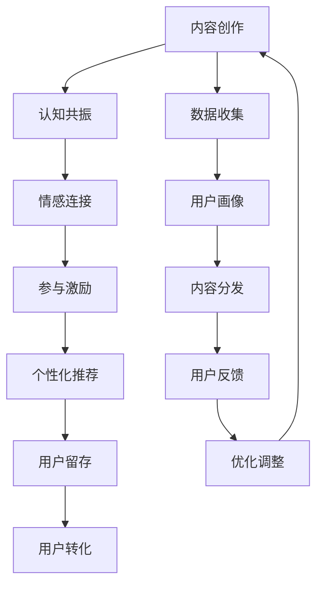

                 

# 注意力经济与内容创作策略：吸引并留住受众的参与和忠诚

在信息爆炸的互联网时代，注意力作为一种稀缺资源，成为了企业获取用户和提升价值的关键要素。内容创作者如何在海量信息中脱颖而出，吸引并留住受众的关注与忠诚，是当今数字化营销和内容运营的重大挑战。本文将围绕注意力经济的核心原理，结合最新技术手段和成功案例，探讨如何制定科学的创作策略，构建用户黏性，实现高效的受众参与和转化。

## 1. 背景介绍

### 1.1 问题由来
在数字化转型加速的今天，内容创作者面临着前所未有的竞争环境。社交媒体的普及、短视频的崛起、长图文内容的日渐式微，使得内容传播的渠道和形式日趋多样化。尽管如此，如何吸引并留住受众的注意力，始终是内容创作者关注的焦点。尤其对于品牌广告、社交电商、在线教育等依赖用户参与和转化的领域，持续的关注度和忠诚度更是成功的基础。

### 1.2 问题核心关键点
为解决这一挑战，内容创作者需要重新审视注意力经济的内涵，明确创作策略与目标受众的关系。核心关键点包括：
- 认知与情感共振：通过高质量内容激发受众的情感共鸣，增强品牌认知。
- 参与与互动激励：提供多样化的互动形式，鼓励受众积极参与，提升用户粘性。
- 个性化与推荐算法：基于用户行为数据，实现内容的精准推送和个性化推荐，满足用户多样化需求。

## 2. 核心概念与联系

### 2.1 核心概念概述
注意力经济（Attention Economy）是一种以注意力为核心的经济形态，强调通过吸引和锁定受众的注意力，来实现商业价值。内容创作者在设计和传播内容时，需要充分理解和运用注意力经济学的原理，以实现内容的有效传播和受众参与。

- **注意力**：用户在接触和处理信息时所投入的注意资源，是内容传播的关键衡量指标。
- **认知共振**：内容通过引发用户的情感共鸣，增强品牌的认知度和好感度。
- **情感连接**：内容通过触动用户的情感，建立深层次的情感联系。
- **参与激励**：通过有趣的互动形式，激发用户积极参与，形成良好的用户体验。
- **个性化推荐**：基于用户行为数据，实现内容的精准推送和个性化展示，提升用户满意度。

### 2.2 核心概念原理和架构的 Mermaid 流程图


这个流程图展示了内容创作与用户留存之间的内在联系，通过认知共鸣、情感连接、参与激励和个性化推荐，最终实现用户留存和转化的闭环。

## 3. 核心算法原理 & 具体操作步骤

### 3.1 算法原理概述
内容创作与传播的过程，本质上是一种信息传递和用户认知的交互过程。创作者通过高质量的内容激发用户的认知共振，并通过情感连接和参与激励，建立起与用户之间的情感纽带。同时，个性化推荐算法能够实现内容的精准推送，提升用户满意度，从而实现内容的广泛传播和深度参与。

核心算法原理包括：
- 认知共振：通过情感化、故事化的内容形式，引发用户的情感共鸣。
- 情感连接：通过具有共情力的内容，建立用户与品牌之间的情感纽带。
- 参与激励：通过互动问答、投票评比、直播互动等形式，激发用户的积极参与。
- 个性化推荐：基于用户的浏览、点击、评分等行为数据，实现内容的精准推送。

### 3.2 算法步骤详解

#### 3.2.1 数据收集与用户画像构建
内容创作前，需要先进行数据收集，建立用户画像。具体步骤如下：
1. **数据源选择**：根据内容类型选择适合的社交媒体、搜索引擎、用户评论等数据源。
2. **数据预处理**：清洗和格式化数据，去除噪声，提取有用信息。
3. **用户画像构建**：通过聚类、分群等方法，对用户进行分类和特征提取，形成详细的用户画像。

#### 3.2.2 内容创作与情感共振
创作具有情感共鸣的内容，需要：
1. **主题选择**：选择与目标用户群体情感相关的题材。
2. **内容设计**：通过故事情节、角色设定等手段，构建情感共鸣点。
3. **情感表达**：使用富有感染力的语言和视觉元素，触动用户情感。

#### 3.2.3 用户参与与互动激励
增强用户参与度，需要：
1. **互动设计**：通过问卷调查、评论互动、直播等形式，鼓励用户参与。
2. **激励机制**：设置奖励机制，如抽奖、积分等，提升用户参与的积极性。
3. **实时反馈**：通过实时互动，及时响应用户反馈，调整内容策略。

#### 3.2.4 个性化推荐
实现个性化推荐，需要：
1. **数据收集**：收集用户的浏览、点击、评分等行为数据。
2. **模型训练**：基于收集到的数据，训练推荐模型。
3. **推荐算法**：应用协同过滤、内容推荐、深度学习等算法，实现个性化推荐。

#### 3.2.5 用户留存与转化
通过上述步骤，可以：
1. **用户留存**：通过持续的高质量内容和情感共鸣，提升用户粘性。
2. **用户转化**：通过个性化推荐和互动激励，实现用户转化的闭环。

### 3.3 算法优缺点
**优点**：
- 数据驱动：基于用户行为数据，实现内容的精准推送和个性化推荐。
- 情感共鸣：通过情感化内容，建立用户与品牌之间的情感连接。
- 用户参与：通过多样化的互动形式，提升用户积极性和粘性。

**缺点**：
- 技术门槛：需要较强的数据分析和算法技术。
- 内容质量：高质量内容的创作需要创意和资源投入。
- 数据隐私：需要严格遵守数据隐私法律法规，保护用户隐私。

### 3.4 算法应用领域
注意力经济的方法广泛应用于各种内容创作和传播场景，包括但不限于：
- 社交媒体广告：通过情感化内容，增强品牌认知和用户粘性。
- 在线教育：通过个性化推荐和互动设计，提升用户参与度和学习效果。
- 社交电商：通过内容创作和直播互动，提升用户转化率。
- 企业内容营销：通过故事化内容，建立品牌形象和客户关系。

## 4. 数学模型和公式 & 详细讲解 & 举例说明

### 4.1 数学模型构建
内容创作与传播的数学模型可以构建为如下形式：
1. **用户画像**：$U=\{u_1,u_2,...,u_n\}$，其中$u_i$表示第$i$个用户。
2. **内容特征**：$C=\{c_1,c_2,...,c_m\}$，其中$c_j$表示第$j$个内容。
3. **情感表达**：$E=\{e_1,e_2,...,e_m\}$，其中$e_j$表示$c_j$的情感评分。
4. **用户行为**：$B=\{b_{ij}\}$，其中$b_{ij}$表示用户$u_i$对内容$c_j$的行为（如点击、点赞等）。

### 4.2 公式推导过程
假设用户$u_i$对内容$c_j$的情感评分和行为评分分别为$e_{ij}$和$b_{ij}$，则用户$u_i$对内容$c_j$的评分$S_{ij}$可以表示为：
$$
S_{ij} = \alpha e_{ij} + \beta b_{ij}
$$
其中$\alpha,\beta$为权重，根据具体场景调整。

基于上述评分模型，内容推荐算法可以设计为协同过滤、基于内容的推荐、深度学习等多种形式。

#### 案例分析与讲解
**案例1：社交电商商品推荐**
假设某电商平台希望基于用户行为数据推荐商品。平台收集了用户点击、浏览、购买等行为数据，并对其进行预处理和特征提取。基于用户画像和商品特征，通过协同过滤算法计算用户对商品的评分，从而实现个性化推荐。

具体实现步骤如下：
1. **数据收集**：收集用户行为数据，包括点击、浏览、购买记录等。
2. **特征提取**：将商品特征和用户画像转化为数值特征。
3. **协同过滤**：基于用户行为数据和商品特征，计算用户对商品的评分，推荐相似商品。

**案例2：在线教育个性化课程推荐**
某在线教育平台希望通过内容创作和个性化推荐，提升用户学习效果。平台收集用户学习行为数据，包括浏览时长、答题情况等。基于用户画像和课程特征，通过深度学习算法计算用户对课程的评分，实现个性化推荐。

具体实现步骤如下：
1. **数据收集**：收集用户学习行为数据，包括学习时长、答题情况等。
2. **特征提取**：将课程特征和用户画像转化为数值特征。
3. **深度学习**：基于用户行为数据和课程特征，训练深度学习模型，实现个性化推荐。

## 5. 项目实践：代码实例和详细解释说明

### 5.1 开发环境搭建
项目实践前，需要搭建开发环境。以下是在Python中使用Pandas、NumPy、Scikit-Learn等工具搭建开发环境的步骤：
1. **安装Python环境**：下载并安装Python，建议使用Anaconda进行环境管理。
2. **安装Python库**：安装Pandas、NumPy、Scikit-Learn等常用库，建议使用pip命令进行安装。
3. **数据准备**：收集和预处理数据，包括用户行为数据、内容特征数据等。

### 5.2 源代码详细实现
以下是基于协同过滤算法的内容推荐系统示例代码，使用Python和Pandas库实现：
```python
import pandas as pd
from sklearn.neighbors import NearestNeighbors

# 读取用户行为数据
data = pd.read_csv('user_behavior.csv')
# 构建用户-商品评分矩阵
matrix = data.groupby(['user_id', 'item_id']).mean().unstack().reset_index()

# 构建用户画像和商品特征
user_profile = matrix.groupby('user_id').mean().reset_index()
item_profile = matrix.groupby('item_id').mean().reset_index()

# 基于协同过滤算法实现内容推荐
k = 10  # 协同过滤的邻居数量
model = NearestNeighbors(n_neighbors=k, algorithm='brute')
model.fit(item_profile.drop(columns=['user_id']))
# 预测用户行为评分
user_predictions = pd.DataFrame({'user_id': data['user_id'].unique()})
user_predictions['scores'] = model.kneighbors(
    user_profile.drop(columns=['user_id']),
    return_distance=False).reshape(-1, k)
```

### 5.3 代码解读与分析
上述代码实现了基于协同过滤算法的内容推荐系统，具体解读如下：
1. **数据读取和预处理**：使用Pandas库读取用户行为数据，并进行预处理，构建用户-商品评分矩阵。
2. **用户画像和商品特征提取**：通过分组计算，提取用户画像和商品特征。
3. **协同过滤模型构建**：使用NearestNeighbors模型，基于用户画像和商品特征，构建协同过滤模型。
4. **内容推荐**：基于构建的协同过滤模型，预测用户行为评分，实现内容推荐。

### 5.4 运行结果展示
运行上述代码后，可以生成用户对商品的推荐列表。例如，对于某用户$u_i$，推荐列表可能包含商品$c_j$，且$c_j$的评分$S_{ij}$可通过以下公式计算：
$$
S_{ij} = \frac{1}{k} \sum_{k=1}^k matrix_{ik} \cdot matrix_{jk}
$$
其中$k$为协同过滤的邻居数量。

## 6. 实际应用场景

### 6.1 社交媒体广告
社交媒体平台通过情感化内容，增强品牌认知和用户粘性。例如，某品牌通过发布与用户情感共鸣的短视频广告，提升品牌曝光和用户互动。

### 6.2 在线教育
在线教育平台通过个性化推荐和互动设计，提升用户参与度和学习效果。例如，某平台通过推荐个性化课程和互动问答，提升用户学习体验和满意度。

### 6.3 社交电商
社交电商平台通过内容创作和直播互动，提升用户转化率。例如，某电商平台通过直播互动和个性化商品推荐，提升用户购买意愿和转化率。

### 6.4 企业内容营销
企业通过故事化内容，建立品牌形象和客户关系。例如，某企业通过发布企业故事和客户见证，提升品牌形象和客户关系。

## 7. 工具和资源推荐

### 7.1 学习资源推荐
- **《内容策略：如何构建用户共鸣》**：一本详细讲解内容策略和用户共鸣构建的经典书籍。
- **Coursera《数字营销》课程**：包含内容创作、品牌传播、用户参与等多个模块的数字营销课程。
- **HubSpot《内容营销》课程**：涵盖内容策略、用户调研、内容运营等多个方面的内容营销课程。

### 7.2 开发工具推荐
- **Visual Studio Code**：轻量级的代码编辑器，支持多种编程语言和开发环境。
- **Jupyter Notebook**：支持代码、数据可视化、文档编写的开发环境，非常适合数据分析和机器学习任务。
- **Git**：版本控制系统，支持代码管理、协作开发和版本追踪。

### 7.3 相关论文推荐
- **《基于情感的内容推荐算法》**：介绍情感化内容推荐算法的研究进展和实现方法。
- **《个性化推荐系统：算法与技术》**：涵盖协同过滤、基于内容的推荐、深度学习等多种推荐算法的研究和实践。

## 8. 总结：未来发展趋势与挑战

### 8.1 研究成果总结
本文详细介绍了基于注意力经济的内容创作与传播策略，探讨了认知共鸣、情感连接、参与激励和个性化推荐的核心原理和操作步骤。通过实际案例和代码示例，展示了注意力经济方法在社交媒体、在线教育、社交电商和企业内容营销等领域的成功应用。

### 8.2 未来发展趋势
未来的内容创作与传播将进一步融合技术手段和用户需求，呈现出以下趋势：
1. **数据驱动**：基于用户行为数据的深度挖掘和分析，实现更加精准的内容推荐和个性化定制。
2. **情感智能**：通过AI情感分析技术，实现对用户情感的精准识别和内容创作。
3. **互动增强**：通过增强现实、虚拟现实等技术，提升用户参与感和互动体验。
4. **多模态融合**：结合文字、图片、视频等多模态内容，增强内容的多样性和传播效果。
5. **智能化推荐**：通过深度学习等技术，实现更加智能和个性化的内容推荐。

### 8.3 面临的挑战
尽管注意力经济方法在内容创作与传播中取得了显著成效，但仍面临诸多挑战：
1. **数据隐私**：用户行为数据的收集和使用需要严格遵守数据隐私法律法规，保护用户隐私。
2. **技术门槛**：数据挖掘和机器学习技术的应用需要较强的专业知识和技能。
3. **内容质量**：高质量内容创作需要创意和资源投入，保持内容多样性和创新性。
4. **用户需求变化**：用户需求的多样性和变化性，需要不断调整和优化内容策略。

### 8.4 研究展望
未来的内容创作与传播研究需要围绕以下几个方向展开：
1. **算法优化**：研发更加高效和智能的推荐算法，提升推荐效果和用户体验。
2. **技术融合**：探索AI情感分析、增强现实等新兴技术在内容创作中的应用。
3. **用户参与**：通过互动问答、直播互动等方式，增强用户参与感和满意度。
4. **内容创新**：不断探索新的内容形式和传播渠道，保持内容的新鲜感和吸引力。

## 9. 附录：常见问题与解答

**Q1：如何构建高质量的用户画像？**
A: 构建高质量的用户画像需要多渠道的数据收集和分析，结合用户行为数据和属性数据，进行聚类、分群等处理。同时，需要不断调整和优化用户画像模型，确保数据的准确性和时效性。

**Q2：如何实现情感智能推荐？**
A: 情感智能推荐需要引入AI情感分析技术，通过自然语言处理和机器学习，识别用户情感倾向。具体步骤包括：
1. **情感分析**：使用情感分析工具，识别用户对内容的情感倾向。
2. **内容匹配**：根据情感分析结果，匹配情感相似的内容。
3. **推荐算法**：应用协同过滤、深度学习等算法，实现情感智能推荐。

**Q3：如何平衡数据隐私和用户体验？**
A: 数据隐私和用户体验的平衡需要多重手段：
1. **数据匿名化**：对用户行为数据进行匿名化处理，保护用户隐私。
2. **数据脱敏**：对敏感数据进行脱敏处理，确保数据安全。
3. **用户知情同意**：在数据收集和使用前，获取用户的知情同意，明确隐私保护措施。

**Q4：如何提高内容创作的效率？**
A: 提高内容创作的效率需要：
1. **自动化工具**：使用自动化内容创作工具，如AI写手、图像生成器等，提升创作效率。
2. **内容管理系统**：使用内容管理系统，实现内容的快速发布和管理。
3. **团队协作**：建立跨部门协作机制，提升内容创作的协同效率。

**Q5：如何评估内容的传播效果？**
A: 评估内容的传播效果需要：
1. **关键指标**：设定关键指标，如点击率、浏览量、互动率等。
2. **数据分析**：使用数据分析工具，实时监测关键指标的变化。
3. **用户反馈**：收集用户反馈，及时调整内容策略。

---

作者：禅与计算机程序设计艺术 / Zen and the Art of Computer Programming

