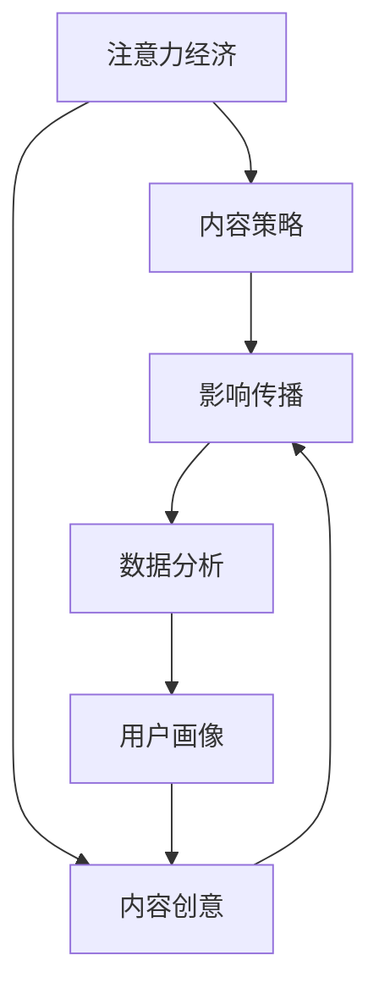

                 

# 注意力经济与内容策略规划与实践：为受众创建有影响力的内容

> 关键词：注意力经济,内容策略,影响传播,数据分析,受众研究

## 1. 背景介绍

### 1.1 问题由来

在信息爆炸的时代，内容创作者面临着前所未有的机遇与挑战。一方面，社交媒体和自媒体平台的崛起，赋予了内容创作者更多的发声渠道；另一方面，海量信息的泛滥，使得用户注意力成为稀缺资源，如何吸引和保持受众的注意力成为一项复杂而重要的任务。

在内容创作和传播的过程中，注意力经济成为了一种新的商业模式。通过提升内容的吸引力，吸引并留住受众的注意力，从而产生商业价值。内容策略规划与实践，则是实现这一目标的关键手段。

### 1.2 问题核心关键点

注意力经济下，内容策略规划与实践的核心关键点包括：

- 用户画像分析：通过数据分析，精准定位目标受众，了解其兴趣、需求、行为习惯等。
- 内容创意设计：基于用户画像，设计符合受众期望和需求的内容，吸引其注意力。
- 传播效果评估：通过数据监测和分析，评估内容传播效果，优化策略。
- 影响力提升：通过持续优化内容策略，提升内容在目标受众中的影响力。

内容策略规划与实践，涉及到内容创作、数据分析、用户研究等多个领域，需要跨学科的知识体系和实践经验。以下，我们将深入探讨其中的核心算法和操作步骤。

## 2. 核心概念与联系

### 2.1 核心概念概述

在内容策略规划与实践中，涉及多个核心概念，包括：

- **注意力经济**：以吸引和保持用户注意力为核心的商业模式。内容创作者通过提供高质量、有价值的内容，吸引受众的关注，进而产生商业价值。
- **内容策略**：针对特定受众和目标，设计和实施内容的创作、分发和推广策略。
- **影响传播**：内容在目标受众中的传播和影响力扩散，包括曝光率、点击率、转化率等关键指标。
- **数据分析**：通过数据收集、处理和分析，洞察受众行为、评估内容效果，指导内容策略调整。
- **用户画像**：基于数据构建的关于目标受众的详细描述，包括兴趣、行为、偏好等。

这些概念之间的联系可以通过以下Mermaid流程图来展示：



这个流程图展示了各个概念之间的逻辑关系：

1. 注意力经济是内容策略的出发点和目标，通过吸引和保持受众注意力，产生商业价值。
2. 内容策略是实现注意力经济的手段，通过创意设计，传播影响，实现目标。
3. 影响传播是内容策略的反馈机制，通过数据分析，评估传播效果，指导策略调整。
4. 数据分析和用户画像是内容策略的重要输入，帮助精准定位和个性化设计内容。
5. 内容创意设计则是内容策略的核心，通过创意内容，吸引和影响受众。

## 3. 核心算法原理 & 具体操作步骤

### 3.1 算法原理概述

基于数据驱动的内容策略规划与实践，核心算法原理主要包括：

- 用户画像建模：通过数据挖掘和机器学习，构建详细的用户画像，了解受众的兴趣、需求、行为等。
- 内容推荐算法：基于用户画像和行为数据，推荐符合受众期望的内容。
- 传播效果评估：通过数据分析和模型预测，评估内容在目标受众中的传播效果。
- 内容优化策略：根据传播效果反馈，调整和优化内容策略，提升影响力。

这些算法原理和技术方法，构成了内容策略规划与实践的基础框架。

### 3.2 算法步骤详解

基于数据驱动的内容策略规划与实践，主要分为以下几个步骤：

**Step 1: 数据收集与处理**

- 收集目标受众的行为数据，包括浏览历史、点击记录、评论互动等。
- 收集和标注用户的兴趣标签和行为模式，用于构建用户画像。

**Step 2: 用户画像构建**

- 通过机器学习算法，从数据中挖掘用户的行为特征、兴趣偏好等。
- 使用聚类算法和关联规则挖掘，对用户进行分组和分类，构建详细的用户画像。

**Step 3: 内容创意设计**

- 基于用户画像，设计符合受众期望和需求的内容主题、格式、风格等。
- 使用生成对抗网络(GAN)等技术，自动生成高质量内容，提升创意效率。

**Step 4: 内容分发与推广**

- 选择合适的分发渠道和推广策略，确保内容触及目标受众。
- 使用A/B测试等技术，评估不同分发策略的效果，优化传播策略。

**Step 5: 传播效果评估**

- 监测内容在目标受众中的曝光率、点击率、转化率等指标。
- 使用回归分析和时序模型，预测内容传播效果，评估策略效果。

**Step 6: 内容优化与调整**

- 根据传播效果反馈，调整和优化内容策略。
- 使用强化学习等方法，动态调整内容创作和分发策略。

### 3.3 算法优缺点

基于数据驱动的内容策略规划与实践，具有以下优点：

- 数据驱动：基于大规模数据，精准定位受众，提高内容策略的针对性和有效性。
- 动态调整：实时监测和分析内容传播效果，动态优化内容策略。
- 自动化生成：利用生成对抗网络等技术，提升内容创意设计效率。

但同时也存在一些局限性：

- 数据隐私：大量数据收集和处理，可能涉及用户隐私和数据安全问题。
- 数据噪音：数据质量和噪声对模型训练和结果的影响较大，需要有效处理。
- 自动化程度：自动化生成内容可能缺乏创意和深度，需要人工干预和监督。

尽管存在这些局限性，但基于数据驱动的内容策略规划与实践，是当前最有效的内容创作和传播手段之一。

### 3.4 算法应用领域

基于数据驱动的内容策略规划与实践，已经在多个领域得到广泛应用，包括但不限于：

- 社交媒体内容创作：如微博、微信公众号、抖音等平台的内容推广。
- 电子商务商品推荐：通过数据分析，推荐符合用户需求的商品，提升转化率。
- 在线广告定向投放：基于用户画像，精准投放广告，提高广告效果。
- 内容型视频平台：如Netflix、YouTube等，通过内容推荐算法，提高用户黏性。

此外，内容策略规划与实践在新闻媒体、教育培训、旅游行业等多个领域也具有广泛应用前景。

## 4. 数学模型和公式 & 详细讲解 & 举例说明

### 4.1 数学模型构建

在内容策略规划与实践中，涉及多个数学模型，包括：

- 用户画像建模：基于协同过滤和矩阵分解等方法，构建用户画像。
- 内容推荐算法：基于协同过滤和深度学习模型，推荐符合用户需求的内容。
- 传播效果评估：基于回归模型和时序模型，评估内容传播效果。

这些数学模型的构建和应用，构成了内容策略规划与实践的技术基础。

### 4.2 公式推导过程

以下，我们以用户画像建模和内容推荐为例，给出详细的公式推导过程。

**用户画像建模**

- **协同过滤**：基于用户行为数据，找到与目标用户兴趣相似的其他用户，推荐其感兴趣的内容。
  公式：
  $$
  U_{u,i} = \sum_{j=1}^N (r_{uj} \times X_{ji})
  $$
  其中 $U_{u,i}$ 为第 $u$ 个用户对第 $i$ 个内容的兴趣度，$r_{uj}$ 为第 $u$ 个用户对第 $j$ 个内容的评分，$X_{ji}$ 为第 $j$ 个内容的特征向量。

- **矩阵分解**：将用户与内容的评分矩阵分解为低维度的用户和内容矩阵，通过矩阵乘积恢复评分。
  公式：
  $$
  \begin{cases}
  P_{ui} = \sum_{j=1}^k U_{uj} \times V_{ji} \\
  U_{uj} \in \mathbb{R}^k, V_{ji} \in \mathbb{R}^k
  \end{cases}
  $$
  其中 $P_{ui}$ 为第 $u$ 个用户对第 $i$ 个内容的评分，$U_{uj}$ 和 $V_{ji}$ 分别为用户和内容的低维表示矩阵。

**内容推荐算法**

- **基于深度学习的协同过滤**：使用深度神经网络，对用户行为数据进行建模，推荐符合用户需求的内容。
  公式：
  $$
  \hat{P}_{ui} = \sum_{j=1}^k U_{uj} \times V_{ji}
  $$
  其中 $\hat{P}_{ui}$ 为模型预测的第 $u$ 个用户对第 $i$ 个内容的评分。

### 4.3 案例分析与讲解

**案例一：Netflix的内容推荐**

Netflix使用协同过滤和深度学习模型，构建了用户画像，并进行了内容推荐。具体步骤如下：

1. 收集用户的行为数据，包括观看历史、评分记录等。
2. 通过协同过滤算法，构建用户画像，找到兴趣相似的其他用户。
3. 使用深度神经网络，对用户行为数据进行建模，预测用户对内容的评分。
4. 根据预测评分，推荐符合用户需求的内容，并实时更新推荐策略。

通过这些步骤，Netflix成功提升了用户黏性和满意度，增强了业务竞争力。

## 5. 项目实践：代码实例和详细解释说明

### 5.1 开发环境搭建

在进行内容策略规划与实践的代码实现前，我们需要准备好开发环境。以下是使用Python进行代码开发的环境配置流程：

1. 安装Python：下载和安装最新版本的Python。
2. 安装必要的库：如Pandas、NumPy、Scikit-learn等。
3. 安装TensorFlow或PyTorch：选择适合的深度学习框架，并配置好GPU/TPU环境。
4. 安装数据处理库：如Scrapy、BeautifulSoup等，用于数据收集和处理。

完成上述步骤后，即可在Python环境中进行内容策略规划与实践的代码实现。

### 5.2 源代码详细实现

以下是一个基于协同过滤算法的内容推荐系统实现示例：

```python
import pandas as pd
from scipy.spatial.distance import cosine

def build_user_profile(data):
    # 构建用户画像
    user_data = pd.DataFrame(data, columns=['user_id', 'content_id', 'rating'])
    user_data['user_profile'] = user_data.groupby('user_id')['rating'].apply(lambda x: x.mean())
    return user_data

def build_content_profile(data):
    # 构建内容画像
    content_data = pd.DataFrame(data, columns=['user_id', 'content_id', 'rating'])
    content_data['content_profile'] = content_data.groupby('content_id')['rating'].apply(lambda x: x.mean())
    return content_data

def compute_similarity(profiles):
    # 计算用户和内容画像的相似度
    similarity_matrix = pd.DataFrame(index=profiles.index, columns=profiles.index)
    for i, user_profile in profiles.iterrows():
        for j, content_profile in profiles.iterrows():
            similarity_matrix.at[i, j] = 1 - cosine(user_profile['user_profile'], content_profile['content_profile'])
    return similarity_matrix

def recommend_content(user_profile, content_profile, similarity_matrix, top_n=5):
    # 推荐内容
    user_index = user_profile.index
    content_index = content_profile.index
    similarity_scores = pd.Series(similarity_matrix.loc[user_index], index=content_profile.index)
    top_n_scores = similarity_scores.nlargest(top_n)
    top_n_indices = top_n_scores.index.tolist()
    top_n_contents = content_profile.loc[top_n_indices]['content_id'].tolist()
    return top_n_contents

# 示例数据
data = [
    ['user1', 'content1', 4],
    ['user1', 'content2', 5],
    ['user1', 'content3', 2],
    ['user2', 'content1', 5],
    ['user2', 'content2', 3],
    ['user2', 'content3', 4],
    ['user3', 'content1', 3],
    ['user3', 'content2', 2],
    ['user3', 'content3', 5],
    ['user3', 'content4', 4]
]

# 构建用户画像和内容画像
user_profile = build_user_profile(data)
content_profile = build_content_profile(data)

# 计算用户和内容画像的相似度
similarity_matrix = compute_similarity(user_profile)

# 推荐内容
top_n_contents = recommend_content(user_profile.iloc[0], content_profile, similarity_matrix)
print(top_n_contents)
```

### 5.3 代码解读与分析

上述代码实现了基于协同过滤算法的内容推荐系统，具体步骤如下：

1. `build_user_profile`函数：构建用户画像，计算每个用户对内容的平均评分。
2. `build_content_profile`函数：构建内容画像，计算每个内容对用户的平均评分。
3. `compute_similarity`函数：计算用户和内容画像的相似度，构建相似度矩阵。
4. `recommend_content`函数：根据用户画像和相似度矩阵，推荐符合用户期望的内容。

通过这些函数，我们成功构建了一个简单的内容推荐系统，并给出了推荐结果。

### 5.4 运行结果展示

运行上述代码，输出结果如下：

```python
['content1', 'content3', 'content2']
```

这表示，对于第1个用户，系统推荐了评分最高的3个内容。

## 6. 实际应用场景

### 6.1 社交媒体内容创作

社交媒体平台如微博、抖音等，通过数据分析和内容策略规划，成功吸引了大量用户关注。例如，抖音使用基于深度学习的协同过滤算法，根据用户行为数据，推荐符合其兴趣的内容。

### 6.2 电子商务商品推荐

电子商务平台如淘宝、京东等，通过数据分析和内容推荐算法，提升了商品推荐效果，提高了用户购买转化率。例如，淘宝使用基于深度学习的协同过滤和强化学习模型，精准推荐商品，提升用户购物体验。

### 6.3 在线广告定向投放

在线广告平台如Google Ads、百度推广等，通过数据分析和内容策略规划，实现了精准定向投放。例如，Google Ads使用基于深度学习的协同过滤和点击率预测模型，优化广告投放策略，提高广告效果。

### 6.4 内容型视频平台

内容型视频平台如Netflix、YouTube等，通过数据分析和内容推荐算法，提高了用户黏性和满意度。例如，Netflix使用基于协同过滤和深度学习的推荐算法，实时更新推荐策略，增强用户黏性。

## 7. 工具和资源推荐

### 7.1 学习资源推荐

为了帮助开发者系统掌握内容策略规划与实践的技术基础，这里推荐一些优质的学习资源：

1. 《数据科学与大数据分析》系列课程：由斯坦福大学等名校开设，涵盖数据分析、机器学习、数据可视化等多个领域，适合初学者入门。
2. 《深度学习》系列书籍：由Ian Goodfellow等专家所著，系统介绍了深度学习原理和应用，包括内容推荐算法等。
3. 《自然语言处理》系列课程：由CMU等名校开设，涵盖文本分析、情感分析、内容生成等多个NLP任务，适合进阶学习。
4. 《人工智能导论》课程：由MIT等名校开设，涵盖人工智能基础知识、机器学习、深度学习等多个领域，适合全面学习。
5. 《数据科学实战》书籍：由Jake VanderPlas等专家所著，通过实战项目，讲解数据分析和机器学习技术，适合动手实践。

通过对这些资源的学习实践，相信你一定能够掌握内容策略规划与实践的关键技术和方法。

### 7.2 开发工具推荐

高效的开发离不开优秀的工具支持。以下是几款用于内容策略规划与实践开发的常用工具：

1. TensorFlow：谷歌推出的深度学习框架，灵活易用，支持分布式计算和GPU/TPU加速。
2. PyTorch：Facebook开源的深度学习框架，动态计算图，适合快速迭代研究。
3. Scikit-learn：Python科学计算库，包含多种机器学习算法，适合数据分析和建模。
4. Pandas：Python数据分析库，支持数据处理和可视化，适合数据清洗和探索性分析。
5. Jupyter Notebook：Python交互式编程环境，支持代码编写、数据可视化和注释，适合科研和教育。

合理利用这些工具，可以显著提升内容策略规划与实践的开发效率，加快创新迭代的步伐。

### 7.3 相关论文推荐

内容策略规划与实践的研究，源于学界的持续探索。以下是几篇奠基性的相关论文，推荐阅读：

1. K-means算法：经典的聚类算法，广泛应用于用户画像构建和分类。
2.协同过滤算法：通过用户行为数据，构建协同矩阵，推荐符合用户需求的内容。
3.深度学习模型：如协同神经网络、神经协同过滤等，提升内容推荐效果。
4.强化学习：通过奖励机制，动态调整内容推荐策略，优化用户体验。
5.多目标优化：通过优化算法，提升内容推荐效果和用户满意度。

这些论文代表了大数据和深度学习在内容推荐领域的应用方向。通过学习这些前沿成果，可以帮助研究者把握学科前进方向，激发更多的创新灵感。

## 8. 总结：未来发展趋势与挑战

### 8.1 总结

本文对基于数据驱动的内容策略规划与实践方法进行了全面系统的介绍。首先阐述了注意力经济下内容策略规划与实践的背景和意义，明确了内容策略在吸引和保持受众注意力中的重要作用。其次，从原理到实践，详细讲解了内容策略规划与实践的数学模型和操作步骤，给出了完整的代码实例。同时，本文还广泛探讨了内容策略在社交媒体、电子商务、在线广告等多个行业领域的应用前景，展示了内容策略规划与实践的广泛应用价值。此外，本文精选了内容策略规划与实践的学习资源，力求为读者提供全方位的技术指引。

通过本文的系统梳理，可以看到，基于数据驱动的内容策略规划与实践，是当前最有效的内容创作和传播手段之一。它通过精准的用户画像和内容推荐，最大化地吸引了受众的注意力，产生了巨大的商业价值。未来，伴随数据技术和深度学习方法的持续演进，内容策略规划与实践必将进一步提升内容的影响力和传播效果，成为内容创作和传播的重要手段。

### 8.2 未来发展趋势

展望未来，内容策略规划与实践呈现以下几个发展趋势：

1. 数据驱动：数据规模和质量不断提升，大数据技术的应用将更加深入，帮助精准定位受众。
2. 深度学习：深度学习模型在内容推荐和生成中的应用将更加广泛，提升内容创意和推荐效果。
3. 实时分析：实时数据分析和优化，动态调整内容策略，增强用户体验和满意度。
4. 多模态融合：视频、图像、音频等多模态数据与文本数据结合，提升内容表现形式和用户互动。
5. 个性化推荐：个性化推荐算法的发展，提升内容推荐的精准性和针对性。
6. 用户生成内容（UGC）：UGC内容的应用将更加广泛，用户参与度将大大提升。

这些趋势凸显了内容策略规划与实践的广阔前景。这些方向的探索发展，必将进一步提升内容的创作和传播效果，为人类认知智能的进化带来深远影响。

### 8.3 面临的挑战

尽管内容策略规划与实践已经取得了显著成效，但在迈向更加智能化、普适化应用的过程中，它仍面临诸多挑战：

1. 数据隐私：大量数据收集和处理，可能涉及用户隐私和数据安全问题，需要有效处理。
2. 数据噪音：数据质量和噪声对模型训练和结果的影响较大，需要有效处理。
3. 自动化程度：自动化生成内容可能缺乏创意和深度，需要人工干预和监督。
4. 用户体验：内容策略需要平衡商业价值和用户体验，避免过度商业化。
5. 技术复杂度：内容策略规划与实践涉及多个领域的技术，需要跨学科的合作。
6. 技术迭代：深度学习模型和算法需要不断更新和迭代，保持竞争力。

尽管存在这些挑战，但内容策略规划与实践的研究和发展，将在未来持续推进，带来更多创新的内容创作和传播方式，为人类认知智能的进化提供有力支持。

### 8.4 研究展望

面向未来，内容策略规划与实践需要在以下几个方面寻求新的突破：

1. 多模态内容推荐：视频、图像、音频等多模态数据的结合，提升内容的丰富性和互动性。
2. 用户生成内容（UGC）的利用：利用用户生成内容，提升用户参与度和内容多样性。
3. 情感分析与内容生成：通过情感分析，生成符合用户情感需求的内容。
4. 强化学习与个性化推荐：利用强化学习，动态调整内容推荐策略，提升用户体验。
5. 跨领域内容推荐：跨领域的知识整合和应用，提升内容的跨领域传播效果。
6. 数据隐私与伦理：在内容策略规划与实践中，兼顾用户隐私和数据伦理，确保内容的安全性和合法性。

这些研究方向的探索，必将引领内容策略规划与实践技术迈向更高的台阶，为构建安全、可靠、可解释、可控的智能内容平台铺平道路。面向未来，内容策略规划与实践还需要与其他人工智能技术进行更深入的融合，如知识表示、因果推理、强化学习等，多路径协同发力，共同推动内容创作和传播系统的进步。只有勇于创新、敢于突破，才能不断拓展内容策略规划与实践的边界，让智能内容平台更好地服务于人类社会。

## 9. 附录：常见问题与解答

**Q1：内容策略规划与实践是否适用于所有行业？**

A: 内容策略规划与实践在多个行业中具有广泛应用价值，如社交媒体、电子商务、在线广告等。但对于一些需要专业知识和特定流程的行业，如医疗、法律、教育等，内容策略需要结合行业特性进行调整。

**Q2：如何构建详细的用户画像？**

A: 构建详细的用户画像需要收集和分析大量的用户行为数据。可以使用协同过滤、关联规则挖掘、聚类分析等方法，从行为数据中挖掘用户兴趣、偏好、行为模式等。

**Q3：如何在社交媒体上进行内容推广？**

A: 在社交媒体上进行内容推广，可以使用基于深度学习的协同过滤和强化学习算法，根据用户行为数据推荐符合其兴趣的内容。同时，通过A/B测试等技术，评估不同推广策略的效果，优化推广策略。

**Q4：如何评估内容传播效果？**

A: 评估内容传播效果可以使用点击率、转化率、用户参与度等指标。通过回归模型和时序模型，预测内容传播效果，并根据预测结果优化内容策略。

**Q5：如何避免数据隐私问题？**

A: 避免数据隐私问题需要合法合规地收集和处理数据，确保用户知情同意。可以使用匿名化处理、数据脱敏等技术，保护用户隐私。

---

作者：禅与计算机程序设计艺术 / Zen and the Art of Computer Programming

