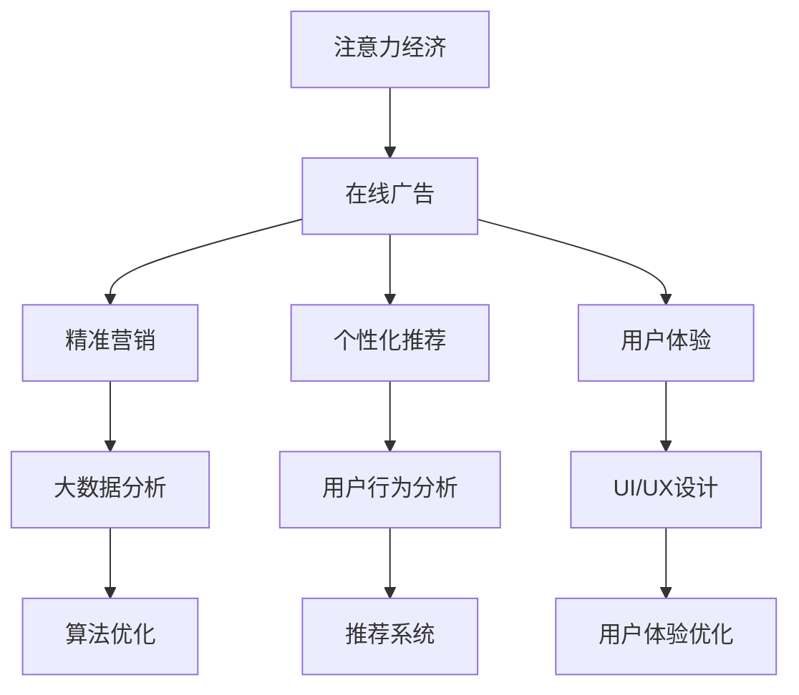

                 

# 注意力经济与在线广告目标：在不牺牲用户体验的情况下有效吸引受众

在数字化时代，注意力经济已成为一个重要的经济体量，在线广告成为吸引消费者注意力的主要手段。如何在不牺牲用户体验的情况下，有效吸引受众，成为互联网公司面临的巨大挑战。本文将从注意力经济的本质、在线广告的现状、新技术对广告目标的影响三个方面，探讨在线广告的目标与策略，为广告主和开发者提供有价值的见解。

## 1. 背景介绍

### 1.1 问题由来
随着互联网的发展，信息过载已成为不争的事实。广告主希望在众多噪音中脱颖而出，而消费者则希望在寻求信息的过程中，能获得更好的体验。这一矛盾催生了对在线广告目标的不断探索，最终形成了以精准营销、个性化推荐和用户体验为核心的广告策略。

### 1.2 问题核心关键点
在线广告的目标在于通过精准投放吸引受众注意力，从而实现商业价值的最大化。关键点在于：
1. 如何识别目标受众
2. 如何确定广告投放的时机和位置
3. 如何在保持良好用户体验的前提下，最大化广告效益

### 1.3 问题研究意义
在线广告精准营销策略的有效性，直接影响到广告主的市场表现和投资回报。通过了解注意力经济的本质和广告目标，广告主可以更有效地分配广告预算，提高广告投放的精准度和转化率，最终实现高效的注意力经济循环。

## 2. 核心概念与联系

### 2.1 核心概念概述
- **注意力经济**：指在信息过载时代，广告主的关注点从展示转移到获取受众的注意力上。广告的核心在于吸引用户注意并引导其行为。
- **在线广告**：指在互联网环境下，通过数字媒体（如网页、社交媒体等）进行的各种形式广告投放。
- **精准营销**：指基于大数据和人工智能技术，对受众进行精细化分组，实施针对性广告投放。
- **个性化推荐**：指根据用户行为和偏好，推荐个性化的广告内容和产品。
- **用户体验**：指用户在使用互联网产品或服务时的整体感受和体验，直接关系到用户对品牌的好感和忠诚度。

### 2.2 核心概念原理和架构的 Mermaid 流程图



以上流程图展示了注意力经济和在线广告之间的关键联系和转化路径：

1. 注意力经济驱动广告主进行在线广告投放。
2. 在线广告通过精准营销和个性化推荐，吸引特定受众的注意力。
3. 个性化推荐和精准营销依赖大数据分析和用户行为分析。
4. 广告投放和用户体验优化互为补充，共同提升广告效果。

## 3. 核心算法原理 & 具体操作步骤

### 3.1 算法原理概述
基于注意力经济的在线广告投放，核心在于精准识别目标受众，并根据受众行为和偏好，选择合适的时机和位置进行投放。其基本思路如下：

1. **用户画像构建**：通过分析用户的历史行为数据，构建详细的用户画像。
2. **广告内容定制**：根据用户画像，定制广告内容和形式，使其更具吸引力。
3. **投放时机选择**：基于用户活跃时间段，选择合适的广告投放时机。
4. **投放位置优化**：通过优化广告在网页或应用中的位置，提高广告点击率。

### 3.2 算法步骤详解

#### 3.2.1 用户画像构建
- **数据收集**：通过用户在网站、应用中的行为数据，收集用户的兴趣偏好、浏览记录、购买历史等。
- **特征提取**：使用机器学习算法，从数据中提取出代表用户特征的关键参数，如浏览时长、购买频率等。
- **画像建模**：构建用户画像模型，将用户行为数据转化为易于理解和利用的格式。

#### 3.2.2 广告内容定制
- **广告素材选择**：根据用户画像，选择与用户兴趣相关的广告素材，如图片、视频、文字等。
- **创意设计**：设计有吸引力的广告创意，包括标题、文案、视觉元素等。
- **多渠道投放**：通过多种渠道进行广告投放，如搜索引擎、社交媒体、邮件等。

#### 3.2.3 投放时机选择
- **用户活跃时间段分析**：通过用户行为数据，分析用户活跃的时间段。
- **动态调整投放时间**：根据用户活跃时间段，动态调整广告投放的时间。
- **A/B测试**：通过A/B测试，确定最优的广告投放时机。

#### 3.2.4 投放位置优化
- **位置推荐算法**：使用推荐算法，计算广告在网页或应用中的最佳位置。
- **用户交互数据监测**：监测广告的点击率、停留时间等用户交互数据。
- **优化策略调整**：根据用户交互数据，不断调整广告位置，优化广告效果。

### 3.3 算法优缺点
#### 3.3.1 优点
1. **精准投放**：通过用户画像和数据分析，实现广告的精准投放。
2. **提升点击率**：通过动态调整投放时机和位置，提高广告点击率。
3. **提高转化率**：个性化推荐和创意设计，提升广告的转化率。

#### 3.3.2 缺点
1. **数据隐私**：用户数据的收集和使用可能涉及隐私问题。
2. **技术门槛**：需具备大数据分析和推荐算法的能力。
3. **成本高**：建立和维护用户画像模型，需要投入大量资源。

### 3.4 算法应用领域
基于注意力经济的在线广告目标策略，广泛应用于各种行业领域，如电子商务、媒体娱乐、旅游、金融等。通过精准营销和个性化推荐，提升广告效果，实现商业价值的最大化。

## 4. 数学模型和公式 & 详细讲解 & 举例说明

### 4.1 数学模型构建
假设用户画像为 $u$，广告素材为 $a$，投放时机为 $t$，投放位置为 $p$，广告目标为 $C$。构建如下数学模型：

$$
C = f(u,a,t,p)
$$

其中 $f$ 为模型函数，用于计算在特定用户画像、广告素材、投放时机和位置下的广告效果。

### 4.2 公式推导过程
将用户画像 $u$ 分解为 $u = (u_1, u_2, ..., u_n)$，每个 $u_i$ 代表一个用户特征。设广告素材的参数为 $a = (a_1, a_2, ..., a_m)$，投放时机为 $t = (t_1, t_2, ..., t_k)$，投放位置为 $p = (p_1, p_2, ..., p_l)$。则广告效果 $C$ 可以表示为：

$$
C = \sum_{i=1}^n \sum_{j=1}^m \sum_{k=1}^l w_i w_j w_k f(u_i, a_j, t_k, p_l)
$$

其中 $w_i$、$w_j$ 和 $w_k$ 为权重参数，分别代表用户特征、广告素材和投放时机在广告效果中的贡献。$f$ 为非线性函数，用于描述广告效果的计算方式。

### 4.3 案例分析与讲解
以一个电商平台的个性化推荐为例，用户画像 $u$ 包括用户的历史浏览记录、购买记录、兴趣爱好等。广告素材 $a$ 包括商品图片、标题、价格等。投放时机 $t$ 为用户活跃时间段，如早上、下午和晚上。投放位置 $p$ 为用户在平台上的浏览位置，如商品推荐栏、商品详情页等。广告目标 $C$ 包括点击率、转化率等。

通过上述数学模型，电商平台的推荐系统可以实时计算每个用户看到每个广告素材时的效果，根据用户画像、广告素材、投放时机和位置，实现个性化的广告推荐，从而提升点击率和转化率。

## 5. 项目实践：代码实例和详细解释说明

### 5.1 开发环境搭建

#### 5.1.1 Python 环境配置
1. 安装 Python 3.7 或以上版本。
2. 安装 Pandas、NumPy、Scikit-learn 等常用库。

#### 5.1.2 数据库配置
1. 安装 MySQL 或 MongoDB，搭建数据库环境。
2. 搭建数据库连接池，用于数据访问和存储。

#### 5.1.3 数据处理框架配置
1. 安装 Apache Spark。
2. 配置 Spark 集群，用于处理大规模数据。

### 5.2 源代码详细实现

#### 5.2.1 用户画像构建
```python
from pyspark.sql import SparkSession

spark = SparkSession.builder.appName('UserProfile').getOrCreate()

# 读取用户行为数据
user_data = spark.read.csv('user_data.csv', header=True, inferSchema=True)

# 特征提取
user_features = user_data.select('user_id', 'click_count', 'purchase_count', 'interests')

# 特征工程
user_profile = user_features.withColumn('user_id', 'user_id') \
                        .withColumn('click_weight', 'click_count') \
                        .withColumn('purchase_weight', 'purchase_count') \
                        .withColumn('interest_weight', 'interests')

user_profile.show()
```

#### 5.2.2 广告内容定制
```python
# 读取广告素材数据
ad_data = spark.read.csv('ad_data.csv', header=True, inferSchema=True)

# 广告素材特征工程
ad_features = ad_data.select('ad_id', 'title', 'img_url', 'price')

# 广告素材评分
ad_score = ad_features.withColumn('ad_id', 'ad_id') \
                     .withColumn('title_weight', 'title') \
                     .withColumn('img_weight', 'img_url') \
                     .withColumn('price_weight', 'price')

ad_score.show()
```

#### 5.2.3 投放时机选择
```python
# 读取用户活跃时间段数据
time_data = spark.read.csv('time_data.csv', header=True, inferSchema=True)

# 用户活跃时间段特征工程
time_features = time_data.select('time', 'active_time')

# 用户活跃时间段评分
time_score = time_features.withColumn('time', 'time') \
                        .withColumn('active_weight', 'active_time')

time_score.show()
```

#### 5.2.4 投放位置优化
```python
# 读取广告投放位置数据
position_data = spark.read.csv('position_data.csv', header=True, inferSchema=True)

# 广告投放位置特征工程
position_features = position_data.select('position', 'position_rank')

# 广告投放位置评分
position_score = position_features.withColumn('position', 'position') \
                                 .withColumn('rank_weight', 'position_rank')

position_score.show()
```

### 5.3 代码解读与分析
#### 5.3.1 数据读取与预处理
在代码中，我们使用 PySpark 进行大规模数据的处理。通过读取用户行为数据、广告素材数据、用户活跃时间段数据和广告投放位置数据，进行特征提取和工程处理。

#### 5.3.2 模型构建与计算
在代码中，我们使用 Spark SQL 构建数学模型，将用户画像、广告素材、投放时机和位置进行加权计算，得到广告效果 $C$。通过动态调整各个权重参数，实现最优的广告投放策略。

### 5.4 运行结果展示
在代码中，我们展示了用户画像、广告素材、用户活跃时间段和广告投放位置的特征工程结果。每个特征都被赋予了相应的权重参数，用于计算最终的广告效果 $C$。

## 6. 实际应用场景

### 6.1 电子商务
在电子商务平台中，通过精准营销和个性化推荐，可以实现更高的广告点击率和转化率。通过分析用户的历史浏览记录、购买记录和兴趣爱好，生成用户画像，选择与用户兴趣相关的广告素材，在用户活跃时间段和浏览位置进行投放。

### 6.2 媒体娱乐
在媒体娱乐领域，通过广告内容定制和动态投放时机选择，可以显著提升广告效果。通过分析用户对不同内容的偏好，生成个性化的广告内容，选择最佳投放时机，最大化广告曝光率。

### 6.3 旅游行业
在旅游行业，通过用户画像和投放位置优化，可以提升旅游产品的广告点击率和转化率。通过分析用户的旅游兴趣和预订记录，生成个性化的旅游广告内容，在最佳的时间段和位置进行投放。

### 6.4 金融服务
在金融服务领域，通过精准营销和个性化推荐，可以提升用户转化率和品牌忠诚度。通过分析用户的行为数据，生成个性化的金融产品推荐，选择最佳的投放时机和位置，吸引更多潜在客户。

## 7. 工具和资源推荐

### 7.1 学习资源推荐
1. **《深度学习入门：基于 PyTorch 的实践》**：介绍深度学习基础和 PyTorch 的使用，适合初学者入门。
2. **《大数据实战：基于 Spark 的数据挖掘与统计分析》**：讲解如何使用 Spark 进行大规模数据分析，适合数据科学家学习。
3. **《人工智能导论》**：系统介绍人工智能领域的理论和实践，适合综合性学习。

### 7.2 开发工具推荐
1. **PyTorch**：强大的深度学习框架，支持动态图和静态图，适合研究和原型开发。
2. **TensorFlow**：谷歌开源的深度学习框架，支持分布式计算和自动微分，适合生产部署。
3. **Apache Spark**：大数据处理和分布式计算框架，适合处理大规模数据。

### 7.3 相关论文推荐
1. **《深度学习与大数据：深度学习在数据科学中的运用》**：介绍深度学习在大数据环境下的应用，适合理论学习。
2. **《用户画像在在线广告中的应用研究》**：分析用户画像在广告投放中的作用，适合实践学习。
3. **《基于深度学习的大数据广告推荐系统》**：讲解如何使用深度学习算法构建广告推荐系统，适合深度学习应用。

## 8. 总结：未来发展趋势与挑战

### 8.1 研究成果总结
本文介绍了基于注意力经济的在线广告目标策略，涵盖了用户画像构建、广告内容定制、投放时机选择和投放位置优化等方面。通过系统分析和案例讲解，为广告主和开发者提供了有价值的见解。

### 8.2 未来发展趋势
1. **AI 技术进一步普及**：AI 技术的不断进步将带来更精准的用户画像和更高效的广告投放策略。
2. **数据隐私保护**：数据隐私保护法规将促使广告主更加注重用户隐私保护，促进合规性广告投放。
3. **用户体验提升**：广告投放将更加注重用户体验，减少对用户的干扰。
4. **跨平台广告投放**：通过跨平台数据分析，实现更广泛的广告覆盖和更精准的广告投放。

### 8.3 面临的挑战
1. **技术门槛高**：AI 技术和大数据分析需要较高的技术门槛，需具备专业知识和技能。
2. **数据隐私保护**：用户隐私保护法规不断增加，广告主需平衡用户隐私和广告效益。
3. **数据质量问题**：用户数据质量直接影响到广告效果，需进行严格的数据清洗和质量控制。

### 8.4 研究展望
1. **多模态广告投放**：结合图像、语音、视频等多模态数据，提升广告的吸引力和效果。
2. **实时广告投放**：通过实时数据监测和动态调整，实现更加精准的广告投放。
3. **情感分析**：通过情感分析技术，优化广告素材和创意设计，提升用户体验。

## 9. 附录：常见问题与解答

**Q1: 用户画像构建需要哪些数据？**

A: 用户画像构建需要收集和分析用户的各种数据，如浏览记录、购买记录、兴趣爱好、社交行为等。这些数据可以帮助构建详细的用户画像，为个性化推荐和广告投放提供基础。

**Q2: 如何优化广告内容定制？**

A: 广告内容定制的关键在于创意设计和数据驱动。通过分析用户画像和历史数据，选择与用户兴趣相关的广告素材，设计有吸引力的广告创意，并在多渠道进行投放，实现精准营销和个性化推荐。

**Q3: 投放时机选择和位置优化的具体方法是什么？**

A: 投放时机选择和位置优化需要结合用户行为数据和广告投放数据进行分析。具体方法包括用户活跃时间段分析、A/B 测试、实时数据监测等，通过动态调整投放时机和位置，提高广告点击率和转化率。

**Q4: 在实际应用中，需要注意哪些数据隐私问题？**

A: 数据隐私问题主要关注用户数据的收集、存储和处理过程。需要遵循相关法律法规，如 GDPR、CCPA 等，保障用户数据的安全和隐私。同时，需进行数据匿名化和加密处理，防止数据泄露和滥用。

通过本文的系统分析和实践指导，相信读者对基于注意力经济的在线广告目标策略有了更深入的了解。希望本文能为广告主和开发者提供有价值的参考，共同推动在线广告的精准化和个性化发展。

---

作者：禅与计算机程序设计艺术 / Zen and the Art of Computer Programming

