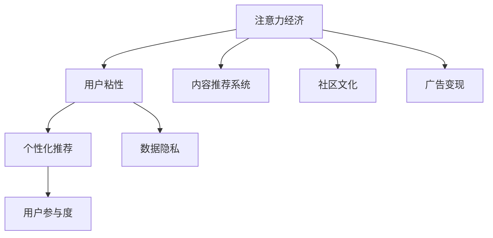

                 

# 注意力经济与在线社区建设策略：吸引并留住忠实的粉丝和受众

## 1. 背景介绍

### 1.1 问题由来

在互联网快速发展的今天，数字经济正成为全球经济增长的新引擎。随着在线平台和社交网络的兴起，数字经济逐步演变为注意力经济（Economy of Attention）。注意力经济的核心在于吸引并最大化利用用户的时间和注意力，实现商业价值和用户体验的双赢。

然而，如何在激烈的互联网竞争中吸引并留住忠实的粉丝和受众，成为各大在线平台和社区建设者的核心挑战。尤其是在用户粘性不高、内容同质化严重的情况下，如何提升用户互动和参与度，是各大社区建设的焦点问题。

### 1.2 问题核心关键点

1. **用户注意力争夺**：在注意力经济的竞争中，平台和社区需要通过优质的内容和互动机制，争夺和最大化用户的时间和注意力。
2. **社区粘性提升**：构建健康、活跃的社区氛围，使用户形成依赖，提高用户粘性。
3. **商业化策略**：在提升用户体验的同时，实现平台的商业化目标，如广告收入、付费订阅等。
4. **个性化推荐**：通过推荐算法，精准匹配用户需求，提升用户体验和平台满意度。

### 1.3 问题研究意义

研究在线社区建设策略，对于拓展在线平台的市场份额、提升用户体验和平台价值具有重要意义：

1. 提高用户粘性：通过优质的内容和互动机制，增强用户对平台的依赖性。
2. 提升广告收入：通过精准的广告投放和社区生态的商业化，增加平台的盈利渠道。
3. 增强用户参与度：通过推荐算法和个性化内容，提升用户互动和反馈，增强社区的活力。
4. 促进社区文化建设：营造健康、积极的社区氛围，形成用户共同的价值追求和行为规范。

## 2. 核心概念与联系

### 2.1 核心概念概述

为更好地理解注意力经济和在线社区建设策略，本节将介绍几个密切相关的核心概念：

- **注意力经济**：在信息爆炸的时代，如何吸引并最大化利用用户的时间和注意力，成为新的经济增长点。注意力经济的核心在于用户价值和商业价值的平衡。
- **用户粘性**：用户对平台的依赖程度，体现为使用频率、停留时间和重复访问率。
- **内容推荐系统**：通过算法，根据用户的历史行为和偏好，推荐个性化的内容，提升用户体验和互动。
- **社区文化**：社区成员共同遵循的行为规范、价值追求和互动方式。
- **广告变现**：通过精准广告投放和社区生态的商业化，实现平台的商业价值。
- **隐私保护**：在数据收集和分析过程中，保障用户隐私和数据安全。

这些核心概念之间的逻辑关系可以通过以下Mermaid流程图来展示：



这个流程图展示了几大核心概念及其之间的关系：

1. 注意力经济推动内容推荐系统发展，提升用户粘性。
2. 内容推荐系统和社区文化协同作用，提升用户参与度和社区活跃度。
3. 社区文化和广告变现相互促进，实现平台商业价值。
4. 数据隐私和个性化推荐相互制约，需要在商业价值和用户隐私之间找到平衡点。

这些核心概念共同构成了在线社区建设的理论框架，为平台运营提供了指导。

## 3. 核心算法原理 & 具体操作步骤

### 3.1 算法原理概述

在线社区建设策略的核心在于通过个性化推荐和社区文化建设，吸引并留住用户。其中，内容推荐系统是吸引用户注意力的关键工具，而社区文化则通过互动机制和用户生成内容（UGC）增强用户粘性。

内容推荐系统基于协同过滤、基于内容的推荐、混合推荐等算法，通过分析用户的历史行为和偏好，推荐个性化的内容。社区文化建设则通过建立社区规范、激励机制和社交网络，促进用户之间的互动和分享，增强社区的凝聚力和用户粘性。

### 3.2 算法步骤详解

1. **数据收集与处理**
   - 收集用户的历史行为数据，包括浏览记录、点击行为、评分等。
   - 分析用户特征，包括兴趣标签、地理位置、设备信息等。

2. **个性化推荐模型训练**
   - 选择适合的推荐算法，如协同过滤、基于内容的推荐、矩阵分解等。
   - 使用用户行为数据进行模型训练，生成推荐模型。
   - 在训练过程中，应用正则化技术、特征选择等方法，提高模型的泛化能力。

3. **内容推荐**
   - 根据用户特征和历史行为，生成推荐列表。
   - 实时监测用户互动反馈，不断优化推荐模型。

4. **社区文化建设**
   - 制定社区规范和行为准则，引导用户积极互动。
   - 建立激励机制，如积分系统、排行榜、奖励计划等。
   - 构建社交网络，促进用户之间的连接和交流。

5. **广告变现**
   - 通过精准的广告投放，实现平台的商业价值。
   - 定期评估广告效果，优化广告策略。

### 3.3 算法优缺点

个性化推荐系统具有以下优点：

- 提高用户满意度：通过推荐系统，用户能够获得感兴趣的内容，提升使用体验。
- 增加平台流量：个性化的内容推荐，可以吸引更多用户进入平台。
- 提升用户粘性：通过推荐系统，用户能够持续访问平台，形成依赖。

同时，该系统也存在以下缺点：

- 数据隐私问题：推荐系统依赖大量的用户数据，数据隐私和安全问题不容忽视。
- 推荐质量不稳定：推荐系统的效果受到用户数据质量的影响，推荐结果可能不稳定。
- 冷启动问题：新用户的推荐数据不足，难以进行有效的个性化推荐。

### 3.4 算法应用领域

个性化推荐和社区文化建设已经被广泛应用于各大在线平台和社交网络，以下是一些典型应用领域：

- 电商网站：通过推荐系统，提升用户购买转化率和平台销售额。
- 视频平台：通过推荐系统，提升用户观看时长和平台粘性。
- 社交网络：通过社区文化建设，增强用户互动和平台粘性。
- 新闻平台：通过推荐系统，提升新闻阅读量和用户留存率。
- 在线教育：通过推荐系统，提升课程选择和用户满意度。

这些领域已经证明了个性化推荐和社区文化建设的强大作用，成为提升平台竞争力和用户体验的关键手段。

## 4. 数学模型和公式 & 详细讲解 & 举例说明

### 4.1 数学模型构建

基于协同过滤的个性化推荐系统，可以表示为：

$$
\hat{y}_{ui} = \hat{R}_{ui}^{(k)} = \sum_{j=1}^{n} \hat{a}_{uj}\hat{b}_{ji} = \left(\sum_{j=1}^{n} \hat{a}_{uj} \right) \left(\sum_{j=1}^{n} \hat{b}_{ji} \right)
$$

其中：
- $\hat{y}_{ui}$ 为预测用户 $u$ 对物品 $i$ 的评分。
- $\hat{R}_{ui}^{(k)}$ 为协同过滤算法的预测评分。
- $\hat{a}_{uj}$ 为用户 $u$ 对物品 $j$ 的评分。
- $\hat{b}_{ji}$ 为物品 $j$ 对用户 $i$ 的评分。

### 4.2 公式推导过程

协同过滤算法可以进一步细化为基于用户的协同过滤和基于物品的协同过滤。以下是基于用户的协同过滤算法公式推导：

假设用户 $u$ 对物品 $j$ 的评分为 $\hat{a}_{uj}$，物品 $i$ 对用户 $v$ 的评分为 $\hat{b}_{vi}$，则基于用户的协同过滤算法可以表示为：

$$
\hat{y}_{ui} = \hat{R}_{ui}^{(k)} = \sum_{j=1}^{n} \hat{a}_{uj}\hat{b}_{ji} = \left(\sum_{j=1}^{n} \frac{\hat{a}_{uj}}{\sqrt{\hat{a}_{uj}^2 + \sigma^2}} \right) \left(\sum_{j=1}^{n} \frac{\hat{b}_{ji}}{\sqrt{\hat{b}_{ji}^2 + \sigma^2}} \right)
$$

其中，$\sigma$ 为平滑因子，防止用户未评分物品的影响。

### 4.3 案例分析与讲解

以电商平台为例，分析协同过滤算法的应用：

1. **数据收集**：
   - 收集用户浏览、购买历史数据，包括点击、浏览、购买行为。
   - 分析用户特征，如年龄、性别、地理位置等。

2. **协同过滤算法训练**：
   - 使用用户行为数据进行基于用户的协同过滤算法训练。
   - 应用正则化技术，防止模型过拟合。

3. **内容推荐**：
   - 根据用户特征和历史行为，生成推荐列表。
   - 实时监测用户互动反馈，不断优化推荐算法。

4. **效果评估**：
   - 使用平均绝对误差（MAE）、均方误差（MSE）等指标，评估推荐系统的效果。
   - 结合用户反馈，调整推荐算法参数。

通过协同过滤算法，电商平台能够实现用户个性化推荐，提升用户购买转化率和平台销售额。

## 5. 项目实践：代码实例和详细解释说明

### 5.1 开发环境搭建

在进行个性化推荐和社区文化建设的实践前，我们需要准备好开发环境。以下是使用Python进行PyTorch开发的环境配置流程：

1. 安装Anaconda：从官网下载并安装Anaconda，用于创建独立的Python环境。

2. 创建并激活虚拟环境：
```bash
conda create -n pytorch-env python=3.8 
conda activate pytorch-env
```

3. 安装PyTorch：根据CUDA版本，从官网获取对应的安装命令。例如：
```bash
conda install pytorch torchvision torchaudio cudatoolkit=11.1 -c pytorch -c conda-forge
```

4. 安装各类工具包：
```bash
pip install numpy pandas scikit-learn matplotlib tqdm jupyter notebook ipython
```

完成上述步骤后，即可在`pytorch-env`环境中开始项目实践。

### 5.2 源代码详细实现

下面以电商平台的个性化推荐系统为例，给出使用PyTorch进行协同过滤算法的实现。

首先，定义协同过滤算法的预测函数：

```python
import torch
import torch.nn as nn
import torch.nn.functional as F

class协同过滤(nn.Module):
    def __init__(self, n_users, n_items, n_factors):
        super().__init__()
        self.n_users = n_users
        self.n_items = n_items
        self.n_factors = n_factors
        
        self.user_factors = nn.Embedding(n_users, n_factors)
        self.item_factors = nn.Embedding(n_items, n_factors)
        self.smooth_factor = nn.Parameter(torch.randn(1, n_factors))
        
        self.two_sums = nn.ParameterList([
            nn.Parameter(torch.randn(1, n_factors)),
            nn.Parameter(torch.randn(1, n_factors))
        ])
        
    def forward(self, user_indices, item_indices):
        user_factors = self.user_factors(user_indices)
        item_factors = self.item_factors(item_indices)
        smooth_factor = self.smooth_factor
        
        user_dot_item = torch.matmul(user_factors, item_factors.t()) + smooth_factor
        
        a_sums = torch.sum(user_factors, 1, keepdim=True)
        b_sums = torch.sum(item_factors, 1, keepdim=True)
        
        a = torch.sum(user_dot_item * a_sums, 1, keepdim=True) / (a_sums**2 + self.two_sums[0]**2)
        b = torch.sum(user_dot_item * b_sums, 0, keepdim=True) / (b_sums**2 + self.two_sums[1]**2)
        
        prediction = torch.matmul(a, b.t())
        
        return prediction
```

然后，定义训练函数和评估函数：

```python
from torch.utils.data import DataLoader
from tqdm import tqdm

def train_model(model, train_loader, optimizer, n_epochs):
    model.train()
    for epoch in range(n_epochs):
        epoch_loss = 0
        for user_indices, item_indices, ratings in tqdm(train_loader):
            optimizer.zero_grad()
            predictions = model(user_indices, item_indices)
            loss = F.mse_loss(predictions, ratings)
            loss.backward()
            optimizer.step()
            epoch_loss += loss.item()
            
        print(f"Epoch {epoch+1}, train loss: {epoch_loss/n_epochs:.3f}")
        
def evaluate_model(model, test_loader):
    model.eval()
    mse = 0
    for user_indices, item_indices, ratings in test_loader:
        predictions = model(user_indices, item_indices)
        mse += F.mse_loss(predictions, ratings).item()
    
    return mse / len(test_loader)
```

最后，启动训练流程并在测试集上评估：

```python
n_epochs = 10
batch_size = 128

# 假设 train_loader 和 test_loader 已经创建好
model =协同过滤(n_users=1000, n_items=1000, n_factors=10)
optimizer = torch.optim.Adam(model.parameters(), lr=0.001)

train_model(model, train_loader, optimizer, n_epochs)
test_mse = evaluate_model(model, test_loader)
print(f"Test MSE: {test_mse:.3f}")
```

以上就是使用PyTorch进行协同过滤算法实现的完整代码。可以看到，代码中通过定义协同过滤算法的前向传播函数，实现了基于用户和物品的协同过滤预测。在训练函数中，使用均方误差损失函数计算预测误差，并应用Adam优化器进行参数更新。最后，在测试函数中，计算模型在测试集上的均方误差。

### 5.3 代码解读与分析

让我们再详细解读一下关键代码的实现细节：

**协同过滤类**：
- `__init__`方法：初始化用户和物品的维度，定义嵌入层和光滑因子。
- `forward`方法：实现协同过滤算法的前向传播过程，计算用户-物品的评分预测。

**训练函数**：
- 使用PyTorch的DataLoader对训练数据进行批次化加载，供模型训练使用。
- 在每个批次上前向传播计算预测结果，计算损失函数并反向传播更新模型参数，最后输出每个epoch的平均损失。

**评估函数**：
- 同样使用DataLoader对测试数据进行批次化加载。
- 在每个批次上前向传播计算预测结果，计算均方误差并累加到总误差中。
- 最后输出整个测试集的均方误差。

**训练流程**：
- 定义总的epoch数和batch size，开始循环迭代
- 每个epoch内，在训练集上训练，输出平均loss
- 在测试集上评估，输出均方误差

可以看到，PyTorch配合各类工具库使得协同过滤算法的实现变得简洁高效。开发者可以将更多精力放在数据处理、模型改进等高层逻辑上，而不必过多关注底层的实现细节。

当然，工业级的系统实现还需考虑更多因素，如模型的保存和部署、超参数的自动搜索、更灵活的任务适配层等。但核心的协同过滤算法基本与此类似。

## 6. 实际应用场景

### 6.1 电商平台个性化推荐

电商平台的个性化推荐系统已经成为提升用户购买转化率和平台销售额的关键手段。通过协同过滤算法，电商平台能够实现用户个性化推荐，提升用户购物体验和满意度。

以亚马逊为例，亚马逊利用协同过滤算法为用户推荐相关商品，极大提升了用户购买转化率和平台销售额。亚马逊的推荐系统通过不断学习和优化，能够实时响应用户的浏览和购买行为，提供个性化的商品推荐，极大提高了用户的购物体验和平台的销售额。

### 6.2 视频平台内容推荐

视频平台的内容推荐系统通过协同过滤算法，为用户推荐相关视频内容，提升用户观看时长和平台粘性。视频平台的内容推荐系统能够根据用户的观看历史和偏好，推荐个性化的视频内容，提升用户观看体验和平台留存率。

以Netflix为例，Netflix利用协同过滤算法为用户推荐相关视频内容，极大提升了用户观看时长和平台粘性。Netflix的推荐系统通过不断学习和优化，能够实时响应用户的观看行为，提供个性化的视频内容推荐，极大提高了用户的观看体验和平台的留存率。

### 6.3 社交网络社区推荐

社交网络的内容推荐系统通过协同过滤算法，为用户推荐相关用户和内容，提升用户互动和平台粘性。社交网络的内容推荐系统能够根据用户的互动行为和偏好，推荐个性化的用户和内容，提升用户的互动体验和平台粘性。

以Facebook为例，Facebook利用协同过滤算法为用户推荐相关朋友和内容，极大提升了用户互动体验和平台粘性。Facebook的推荐系统通过不断学习和优化，能够实时响应用户的互动行为，提供个性化的用户和内容推荐，极大提高了用户的互动体验和平台的粘性。

### 6.4 未来应用展望

随着个性化推荐和社区文化建设的不断发展，基于这些技术的在线平台将实现更加精准、高效的用户体验和平台运营。

在智慧医疗领域，个性化推荐系统可以根据用户的健康数据，推荐个性化的健康建议和医疗资源，提升用户的健康水平和医疗服务体验。

在智能教育领域，个性化推荐系统可以根据学生的学习数据，推荐个性化的学习内容和资源，提升学生的学习效果和教育质量。

在智慧城市治理中，个性化推荐系统可以根据用户的地理位置和行为数据，推荐个性化的城市服务和信息，提升城市居民的幸福感和满意度。

此外，在企业生产、社会治理、文娱传媒等众多领域，个性化推荐和社区文化建设也将不断涌现，为各行各业带来新的价值和变革。

## 7. 工具和资源推荐

### 7.1 学习资源推荐

为了帮助开发者系统掌握个性化推荐和社区文化建设的理论基础和实践技巧，这里推荐一些优质的学习资源：

1. 《推荐系统》书籍：由王斌教授编写，全面介绍了推荐系统的原理、算法和应用，是推荐系统学习的入门读物。
2. 《社交网络分析》课程：斯坦福大学开设的社交网络分析课程，涵盖社交网络的基本概念、算法和应用，适合初学者入门。
3. 《深度学习》书籍：由Ian Goodfellow等人编写，系统介绍了深度学习的基本原理、模型和应用，是深度学习学习的经典教材。
4. 《机器学习实战》书籍：由Peter Harrington编写，通过大量实例展示了机器学习算法的实现和应用，适合实践学习。
5. 《自然语言处理入门》课程：斯坦福大学开设的自然语言处理课程，涵盖自然语言处理的基本概念、算法和应用，适合初学者入门。

通过对这些资源的学习实践，相信你一定能够快速掌握个性化推荐和社区文化建设的精髓，并用于解决实际的NLP问题。

### 7.2 开发工具推荐

高效的开发离不开优秀的工具支持。以下是几款用于个性化推荐和社区文化建设开发的常用工具：

1. PyTorch：基于Python的开源深度学习框架，灵活动态的计算图，适合快速迭代研究。大部分推荐系统模型都有PyTorch版本的实现。
2. TensorFlow：由Google主导开发的开源深度学习框架，生产部署方便，适合大规模工程应用。同样有丰富的推荐系统资源。
3. Spark：用于大数据处理的分布式计算框架，适合处理大规模推荐系统数据。
4. Elasticsearch：用于搜索引擎和数据分析的分布式数据库，适合存储和检索推荐系统数据。
5. Apache Kafka：用于实时数据流的分布式消息系统，适合处理推荐系统中的实时数据。
6. Apache Hadoop：用于大数据处理的分布式计算框架，适合处理大规模推荐系统数据。

合理利用这些工具，可以显著提升个性化推荐和社区文化建设开发的效率，加快创新迭代的步伐。

### 7.3 相关论文推荐

个性化推荐和社区文化建设的发展源于学界的持续研究。以下是几篇奠基性的相关论文，推荐阅读：

1. "Collaborative Filtering for Implicit Feedback Datasets"：该论文提出协同过滤算法的基本思想，为推荐系统奠定了理论基础。
2. "Item-based Collaborative Filtering Recommendation Algorithms"：该论文深入探讨了基于物品的协同过滤算法，提供了推荐的数学模型和优化策略。
3. "A Probabilistic Model of Personalized Recommendation"：该论文从概率模型角度，重新审视推荐系统，提供了新的推荐方法和优化策略。
4. "Social Recommendation: A Survey and Taxonomy"：该论文全面综述了社交推荐系统的理论、算法和应用，提供了丰富的参考文献和研究思路。
5. "Content-Based Recommendation Systems"：该论文深入探讨了基于内容的推荐算法，提供了推荐内容的特征提取和模型优化方法。

这些论文代表了大数据推荐系统的发展脉络。通过学习这些前沿成果，可以帮助研究者把握学科前进方向，激发更多的创新灵感。

## 8. 总结：未来发展趋势与挑战

### 8.1 总结

本文对个性化推荐和社区文化建设的实践进行了全面系统的介绍。首先阐述了注意力经济的概念和在线社区建设的重要性，明确了个性化推荐和社区文化建设在提升用户体验和平台价值方面的关键作用。其次，从原理到实践，详细讲解了协同过滤算法的数学原理和关键步骤，给出了推荐系统开发的完整代码实例。同时，本文还广泛探讨了推荐系统在电商、视频、社交网络等不同领域的应用前景，展示了个性化推荐和社区文化建设在各个行业的广阔应用空间。

通过本文的系统梳理，可以看到，个性化推荐和社区文化建设在数字化时代具有重要价值，为在线平台的运营和发展提供了新的方向和思路。

### 8.2 未来发展趋势

展望未来，个性化推荐和社区文化建设技术将呈现以下几个发展趋势：

1. 推荐系统将更加智能化和个性化。随着深度学习和大数据技术的不断发展，推荐系统能够更好地理解用户需求和行为，提供更加精准和个性化的推荐内容。
2. 推荐系统将更加注重用户隐私和数据安全。在数据收集和分析过程中，推荐系统需要更加重视用户隐私和数据安全，防止数据泄露和滥用。
3. 推荐系统将更加注重多模态数据的融合。未来的推荐系统将融合视觉、语音、文本等多种数据，提供更加全面和准确的内容推荐。
4. 推荐系统将更加注重动态推荐和实时响应。推荐系统需要具备实时响应用户行为的能力，及时更新推荐内容，提升用户体验。
5. 推荐系统将更加注重社区文化的建设。社区文化将与推荐系统协同作用，共同提升用户的参与度和平台粘性。

以上趋势凸显了个性化推荐和社区文化建设技术的广阔前景。这些方向的探索发展，必将进一步提升推荐系统的精准度和用户体验，促进社区文化的繁荣和发展。

### 8.3 面临的挑战

尽管个性化推荐和社区文化建设技术已经取得了不小的成就，但在迈向更加智能化、普适化应用的过程中，仍面临诸多挑战：

1. 数据隐私问题：推荐系统依赖大量的用户数据，数据隐私和安全问题不容忽视。如何在商业价值和用户隐私之间找到平衡点，是推荐系统面临的重要挑战。
2. 推荐质量不稳定：推荐系统的效果受到用户数据质量的影响，推荐结果可能不稳定。如何提升推荐系统的稳定性和可靠性，是推荐系统面临的重要挑战。
3. 冷启动问题：新用户的推荐数据不足，难以进行有效的个性化推荐。如何提升推荐系统的冷启动能力，是推荐系统面临的重要挑战。
4. 推荐系统的鲁棒性：推荐系统面临数据分布变化、用户行为变化等不确定性因素，需要具备一定的鲁棒性。如何提升推荐系统的鲁棒性，是推荐系统面临的重要挑战。
5. 推荐系统的可解释性：推荐系统通常是"黑盒"系统，难以解释其内部工作机制和决策逻辑。如何提升推荐系统的可解释性，是推荐系统面临的重要挑战。

### 8.4 研究展望

面对推荐系统面临的诸多挑战，未来的研究需要在以下几个方面寻求新的突破：

1. 探索无监督和半监督推荐方法。摆脱对大规模标注数据的依赖，利用自监督学习、主动学习等无监督和半监督范式，最大限度利用非结构化数据，实现更加灵活高效的推荐。
2. 研究参数高效和计算高效的推荐范式。开发更加参数高效的推荐方法，在固定大部分推荐参数的同时，只更新极少量的任务相关参数。同时优化推荐模型的计算图，减少前向传播和反向传播的资源消耗，实现更加轻量级、实时性的部署。
3. 引入更多先验知识。将符号化的先验知识，如知识图谱、逻辑规则等，与神经网络模型进行巧妙融合，引导推荐过程学习更准确、合理的推荐内容。同时加强不同模态数据的整合，实现视觉、语音等多模态信息与文本信息的协同建模。
4. 结合因果分析和博弈论工具。将因果分析方法引入推荐模型，识别出推荐决策的关键特征，增强推荐结果的因果性和逻辑性。借助博弈论工具刻画用户行为，主动探索并规避推荐系统的脆弱点，提高系统稳定性。
5. 纳入伦理道德约束。在推荐系统的设计目标中引入伦理导向的评估指标，过滤和惩罚有偏见、有害的推荐内容。同时加强人工干预和审核，建立推荐系统的监管机制，确保推荐内容的公正性和合法性。

这些研究方向的探索，必将引领个性化推荐和社区文化建设技术迈向更高的台阶，为构建安全、可靠、可解释、可控的推荐系统铺平道路。面向未来，个性化推荐和社区文化建设技术还需要与其他人工智能技术进行更深入的融合，如知识表示、因果推理、强化学习等，多路径协同发力，共同推动自然语言理解和智能交互系统的进步。只有勇于创新、敢于突破，才能不断拓展推荐系统的边界，让智能技术更好地造福人类社会。

## 9. 附录：常见问题与解答

**Q1：个性化推荐系统如何处理新用户的问题？**

A: 个性化推荐系统通常会使用冷启动策略来处理新用户的问题。冷启动策略包括：
1. 基于物品的协同过滤：对于新用户，推荐系统中仍可以推荐与该用户有相似兴趣的物品，以填补其兴趣空白。
2. 基于内容的推荐：对于新用户，推荐系统可以根据物品的特征和用户的历史行为，推荐与用户兴趣相关的物品。
3. 新用户引导：通过个性化引导和推荐，帮助新用户快速找到感兴趣的物品，提升其推荐效果。

**Q2：推荐系统如何提升用户体验？**

A: 推荐系统提升用户体验的关键在于提供精准、个性化和多样化的内容推荐。具体策略包括：
1. 数据收集与处理：收集用户的历史行为数据，分析用户特征，如年龄、性别、地理位置等。
2. 推荐算法训练：选择适合的推荐算法，如协同过滤、基于内容的推荐、混合推荐等。
3. 个性化推荐：根据用户特征和历史行为，生成推荐列表。
4. 实时监测与优化：实时监测用户互动反馈，不断优化推荐算法。

**Q3：推荐系统如何平衡商业价值和用户隐私？**

A: 推荐系统在平衡商业价值和用户隐私时，可以采取以下策略：
1. 数据匿名化：对用户数据进行匿名化处理，防止用户隐私泄露。
2. 用户授权：在数据收集和使用前，获得用户明确授权，确保数据使用透明。
3. 隐私保护算法：采用差分隐私等隐私保护算法，保护用户隐私。
4. 数据加密：对用户数据进行加密处理，防止数据泄露。

这些策略需要在数据收集和分析过程中，进行综合考虑，确保推荐系统在商业价值和用户隐私之间找到平衡点。

**Q4：推荐系统如何处理数据分布变化？**

A: 推荐系统处理数据分布变化的关键在于建立稳健的推荐模型，提高系统的鲁棒性。具体策略包括：
1. 数据增强：通过数据增强技术，增加训练数据的丰富度，提升推荐模型的泛化能力。
2. 模型适应性：使用自适应算法，根据数据分布的变化，动态调整推荐模型参数。
3. 鲁棒优化：使用鲁棒优化算法，提高推荐模型的鲁棒性，减少数据变化对推荐效果的影响。
4. 持续学习：使用持续学习算法，保持推荐模型对新数据的学习能力，提高系统的适应性。

这些策略需要在数据收集和分析过程中，进行综合考虑，确保推荐系统在数据分布变化时，仍然能够提供稳定的推荐效果。

**Q5：推荐系统如何提升推荐质量？**

A: 推荐系统提升推荐质量的关键在于选择适合的推荐算法和优化策略。具体策略包括：
1. 数据质量控制：通过数据清洗和特征选择，提高推荐数据的准确性。
2. 推荐算法优化：选择适合的推荐算法，如协同过滤、基于内容的推荐、混合推荐等。
3. 参数调优：通过参数调优，提升推荐算法的性能。
4. 实时反馈优化：实时监测用户互动反馈，不断优化推荐算法。

这些策略需要在数据收集和分析过程中，进行综合考虑，确保推荐系统能够提供高质量的推荐内容。

---

作者：禅与计算机程序设计艺术 / Zen and the Art of Computer Programming

