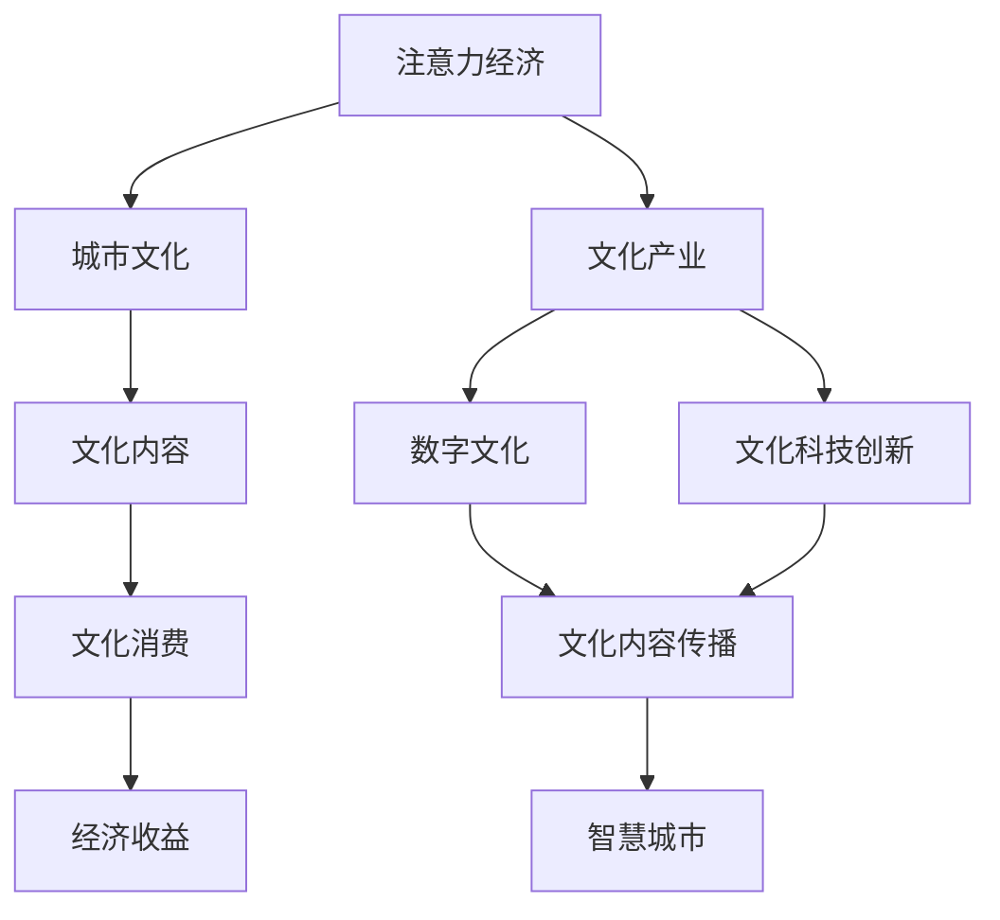

                 

# 注意力经济与城市文化建设

> 关键词：注意力经济,城市文化,文化产业,数字文化,文化科技创新,智慧城市

## 1. 背景介绍

### 1.1 问题由来

在当今数字化时代，注意力成为了一种极其珍贵的资源。无论是消费者、广告商还是内容创作者，都越来越重视如何吸引和保持注意力。随着数字技术的发展，特别是大数据、人工智能、区块链等技术的突破，催生了全新的经济形态——注意力经济。注意力经济的核心在于如何高效地吸引、分配和利用注意力，将其转化为经济价值。

与此同时，城市作为人类社会的文化中心，其文化建设和文化产业的发展也越来越受到重视。文化产业不仅包括了传统艺术、演出、出版等行业，还涵盖了数字文化、文化科技、智慧城市等多个新兴领域。如何将注意力经济与城市文化建设相结合，推动城市文化产业的繁荣发展，成为了当前一个重要的研究方向。

### 1.2 问题核心关键点

注意力经济与城市文化建设的结合，涉及以下几个关键问题：

1. **注意力吸引机制**：如何设计有效的注意力吸引策略，提升城市文化内容的影响力和吸引力。
2. **文化内容的传播与分享**：如何通过数字化手段，广泛传播和分享城市文化内容，扩大其影响范围。
3. **文化产业的创新与转型**：如何利用新技术和新模式，推动城市文化产业的转型升级。
4. **文化消费与经济收益**：如何实现文化消费与经济收益的良性循环，促进城市文化经济的可持续发展。
5. **智慧城市与文化融合**：如何将智慧城市的理念和技术与城市文化建设相结合，构建智慧文化城市。

### 1.3 问题研究意义

注意力经济与城市文化建设的研究具有重要的理论和实践意义：

1. **理论创新**：通过探索注意力经济与文化建设的结合路径，为数字经济和文化产业的发展提供新的理论支持。
2. **技术创新**：利用人工智能、大数据、区块链等前沿技术，推动文化内容的数字化、智能化、全球化，实现文化产业的创新转型。
3. **产业升级**：助力城市文化产业的升级与转型，提升城市文化竞争力，推动城市经济结构的优化升级。
4. **社会进步**：通过文化内容的传播与分享，增强城市文化的社会影响力，促进社会和谐与进步。

## 2. 核心概念与联系

### 2.1 核心概念概述

为更好地理解注意力经济与城市文化建设，本节将介绍几个密切相关的核心概念：

- **注意力经济**：指通过吸引和利用人类注意力，创造经济价值的新型经济形态。其核心在于如何高效地吸引、分配和利用注意力，将其转化为商业价值。
- **城市文化**：指城市在历史发展过程中形成的独特文化形态，包括艺术、建筑、民俗、节庆、科技等多方面内容。城市文化是城市的重要资产，也是提升城市竞争力的关键要素。
- **文化产业**：指以文化内容为核心的经济活动，包括文化产品的生产、销售、传播、消费等环节。文化产业的繁荣发展，是城市文化建设的重要驱动力。
- **数字文化**：指通过数字技术手段，对文化内容进行数字化、网络化、智能化的创新和再造。数字文化是文化产业转型升级的重要方向。
- **文化科技创新**：指利用前沿科技手段，推动文化内容的创新与传播。包括虚拟现实、增强现实、人工智能、大数据等技术在文化领域的应用。
- **智慧城市**：指通过信息技术手段，实现城市管理、公共服务、社会治理等各个方面的智能化、信息化、数字化。智慧城市是现代城市建设的重要目标。

这些核心概念之间的逻辑关系可以通过以下Mermaid流程图来展示：



这个流程图展示了几大核心概念之间的联系：

1. 注意力经济通过吸引和利用注意力，推动城市文化的传播与消费。
2. 城市文化是文化产业的核心，数字文化和文化科技创新是文化产业的重要创新方向。
3. 文化内容通过数字技术和智慧城市的支撑，得以广泛传播和分享。
4. 文化消费与经济收益相互促进，推动文化产业的发展。
5. 智慧城市为文化建设提供技术支持，推动文化产业与城市发展的深度融合。

## 3. 核心算法原理 & 具体操作步骤
### 3.1 算法原理概述

注意力经济与城市文化建设的结合，主要涉及以下几个关键算法和操作步骤：

1. **注意力吸引策略设计**：设计有效的注意力吸引策略，通过社交媒体、搜索引擎、推荐系统等渠道，吸引和保持用户对城市文化内容的关注。
2. **文化内容传播与分享**：利用大数据、人工智能等技术，对文化内容进行精准分析，实现个性化推荐和传播。
3. **文化消费与经济收益**：通过在线销售、广告投放、会员服务等模式，实现文化消费的闭环，最大化经济收益。
4. **智慧城市与文化融合**：通过物联网、云计算、大数据等技术，实现城市文化内容的智能化、数字化，推动智慧城市与文化建设的深度融合。

### 3.2 算法步骤详解

基于注意力经济与城市文化建设的核心算法，本节将详细介绍具体的操作步骤：

**Step 1: 数据采集与分析**

- 收集城市文化相关的数据，包括历史文献、博物馆展览、艺术作品、传统民俗等。
- 利用大数据技术，对收集到的数据进行清洗、标注和分析，提取关键信息。

**Step 2: 注意力吸引策略设计**

- 分析目标用户群体的注意力行为，设计吸引策略，如社交媒体话题、搜索引擎关键词优化、推荐系统算法等。
- 通过A/B测试等方法，评估策略效果，不断优化和迭代。

**Step 3: 文化内容传播与分享**

- 利用人工智能技术，对文化内容进行文本生成、图像处理、视频剪辑等处理，提升内容的吸引力和可传播性。
- 通过社交媒体、搜索引擎、推荐系统等渠道，实现文化内容的广泛传播和分享。

**Step 4: 文化消费与经济收益**

- 开发在线销售平台、广告投放系统、会员服务系统等，实现文化消费的闭环，最大化经济收益。
- 通过数据分析，优化价格策略、促销活动，提升用户购买率和满意度。

**Step 5: 智慧城市与文化融合**

- 利用物联网、云计算、大数据等技术，实现城市文化内容的智能化、数字化。
- 通过智慧城市平台，提供文化内容的在线体验、虚拟旅游、实时互动等新功能。

### 3.3 算法优缺点

注意力经济与城市文化建设结合的算法，具有以下优点：

1. **高效利用注意力**：通过注意力吸引策略设计和精准传播，能够高效利用用户注意力，提升城市文化内容的曝光率和影响力。
2. **精准个性化推荐**：利用人工智能和大数据技术，实现文化内容的个性化推荐，提升用户体验和满意度。
3. **多渠道多平台传播**：通过社交媒体、搜索引擎、推荐系统等多渠道多平台传播，扩大城市文化内容的传播范围。
4. **闭环经济模型**：通过在线销售、广告投放、会员服务等模式，实现文化消费的闭环，最大化经济收益。
5. **智慧城市支撑**：利用智慧城市技术，实现城市文化内容的智能化、数字化，提升城市文化竞争力。

同时，该算法也存在一些局限性：

1. **用户注意力易分散**：在注意力经济时代，用户注意力容易被大量信息分散，如何持续吸引和保持用户的关注是一个挑战。
2. **内容同质化严重**：在内容生成和传播过程中，容易出现内容同质化现象，难以形成差异化和创新。
3. **数据隐私和安全**：在数据采集和分析过程中，需要处理大量敏感信息，如何保护用户隐私和安全是一个重要问题。
4. **技术和成本投入高**：实现高效率的注意力吸引和传播，需要投入大量技术和资金，对中小城市和机构可能是一个挑战。

### 3.4 算法应用领域

注意力经济与城市文化建设结合的算法，广泛应用于以下领域：

- **数字文化产业**：通过数字技术手段，推动文化内容的创新和传播，如数字博物馆、虚拟展览、数字艺术品等。
- **智慧城市建设**：利用智慧城市技术，实现城市文化内容的智能化、数字化，如智慧旅游、智能导览、文化活动推荐等。
- **文化科技融合**：通过人工智能、大数据等技术，推动文化产业的转型升级，如文化数据分析、虚拟现实体验、增强现实互动等。
- **文化创意产业**：利用创意设计和数字技术，推动文化产品的创新和传播，如数字音乐、数字影视、数字出版等。
- **社会文化治理**：通过数字化手段，提升文化活动的组织和参与效率，如社区文化活动、文化志愿者、文化教育等。

## 4. 数学模型和公式 & 详细讲解  
### 4.1 数学模型构建

本节将使用数学语言对注意力经济与城市文化建设的结合过程进行更加严格的刻画。

假设城市文化内容为 $C$，目标用户群体为 $U$，注意力吸引策略为 $S$，文化内容的传播渠道为 $D$，注意力传播模型为 $P$，文化消费为 $C'$，经济收益为 $R$。

定义注意力传播模型为：

$$
P(U, C, S, D) = \text{Pr}(U \mid C, S, D)
$$

表示在特定策略和渠道下，用户对文化内容的关注概率。

文化消费与经济收益的关系可以表示为：

$$
R = f(C', C)
$$

其中 $f$ 为文化消费与经济收益的映射函数。

### 4.2 公式推导过程

以下我们以文化消费与经济收益的关系为例，推导一个简单的数学模型。

假设城市文化内容 $C$ 包括书籍、音乐、艺术等多种形式，目标用户群体 $U$ 分为青少年、成年人、老年人三个年龄段。注意力吸引策略 $S$ 包括社交媒体推广、搜索引擎优化、推荐系统推荐等多种方式。文化消费 $C'$ 分为在线购买、实体购买、订阅服务等模式。

设 $\text{Pr}(U \mid C, S, D)$ 为 $U$ 在 $C$ 下，通过 $S$ 和 $D$ 的关注概率。$P(U \mid C, S, D)$ 可以表示为：

$$
P(U \mid C, S, D) = \sum_{i=1}^3 \text{Pr}(U_i \mid C, S, D)
$$

其中 $U_i$ 表示 $U$ 中的第 $i$ 个年龄段，$i=1,2,3$ 分别表示青少年、成年人、老年人。

设 $f(C', C)$ 为文化消费 $C'$ 与文化内容 $C$ 的经济收益关系。$R$ 可以表示为：

$$
R = \sum_{j=1}^3 \text{Pr}(C'_j \mid C) \cdot f(C'_j, C)
$$

其中 $C'_j$ 表示文化消费中的第 $j$ 个模式，$j=1,2,3$ 分别表示在线购买、实体购买、订阅服务。

通过上述模型，可以计算出不同策略和渠道下，用户对城市文化内容的关注概率以及文化消费的经济收益。

### 4.3 案例分析与讲解

以数字文化博物馆为例，分析其注意力吸引和消费闭环的实现过程：

**Step 1: 数据采集与分析**

- 收集博物馆的展览资料、历史文献、数字藏品等数据。
- 利用大数据技术，对数据进行清洗、标注和分析，提取关键信息。

**Step 2: 注意力吸引策略设计**

- 分析目标用户群体的注意力行为，设计社交媒体话题、搜索引擎关键词优化、推荐系统算法等策略。
- 通过A/B测试等方法，评估策略效果，不断优化和迭代。

**Step 3: 文化内容传播与分享**

- 利用人工智能技术，对博物馆的数字藏品进行文本生成、图像处理、视频剪辑等处理，提升内容的吸引力和可传播性。
- 通过社交媒体、搜索引擎、推荐系统等渠道，实现数字藏品的广泛传播和分享。

**Step 4: 文化消费与经济收益**

- 开发在线销售平台、广告投放系统、会员服务系统等，实现文化消费的闭环，最大化经济收益。
- 通过数据分析，优化价格策略、促销活动，提升用户购买率和满意度。

**Step 5: 智慧城市与文化融合**

- 利用物联网、云计算、大数据等技术，实现数字藏品的智能化、数字化。
- 通过智慧城市平台，提供数字藏品的在线体验、虚拟旅游、实时互动等新功能。

通过上述过程，数字文化博物馆可以高效利用用户注意力，推动文化内容的传播和消费，实现经济收益的闭环，提升城市文化竞争力。

## 5. 项目实践：代码实例和详细解释说明
### 5.1 开发环境搭建

在进行项目实践前，我们需要准备好开发环境。以下是使用Python进行项目开发的环境配置流程：

1. 安装Anaconda：从官网下载并安装Anaconda，用于创建独立的Python环境。

2. 创建并激活虚拟环境：
```bash
conda create -n cultural-economy python=3.8 
conda activate cultural-economy
```

3. 安装必要的Python库：
```bash
pip install pandas numpy scikit-learn jupyter notebook matplotlib seaborn
```

4. 安装必要的Python包：
```bash
pip install torch torchvision transformers tensorboard
```

5. 安装必要的工具和框架：
```bash
pip install flask Django scikit-image pandas-gbq
```

完成上述步骤后，即可在`cultural-economy`环境中开始项目开发。

### 5.2 源代码详细实现

这里我们以开发一个简单的数字文化博物馆网站为例，介绍项目实现的基本流程。

首先，我们需要设计和搭建网站的基本框架：

```python
from flask import Flask, render_template, request
from flask_sqlalchemy import SQLAlchemy
from flask_login import LoginManager, UserMixin, login_user, logout_user, login_required
from werkzeug.security import generate_password_hash, check_password_hash

app = Flask(__name__)
app.config['SQLALCHEMY_DATABASE_URI'] = 'sqlite:///cultural-economy.db'
db = SQLAlchemy(app)
login_manager = LoginManager(app)

class User(db.Model, UserMixin):
    id = db.Column(db.Integer, primary_key=True)
    username = db.Column(db.String(100))
    password_hash = db.Column(db.String(100))
    def __init__(self, username, password):
        self.username = username
        self.password_hash = generate_password_hash(password)

@login_manager.user_loader
def load_user(user_id):
    return User.query.get(int(user_id))

@app.route('/')
def home():
    return render_template('home.html')
```

接着，我们添加数据库迁移和用户认证模块：

```python
db.create_all()

@app.route('/login', methods=['GET', 'POST'])
def login():
    if request.method == 'POST':
        username = request.form.get('username')
        password = request.form.get('password')
        user = User.query.filter_by(username=username).first()
        if user and check_password_hash(user.password_hash, password):
            login_user(user)
            return redirect('/')
        else:
            return render_template('login.html', error='Invalid username or password')
    else:
        return render_template('login.html')
```

然后，我们添加文化内容管理和推荐系统模块：

```python
class CultureContent(db.Model):
    id = db.Column(db.Integer, primary_key=True)
    name = db.Column(db.String(100))
    description = db.Column(db.Text)
    image_url = db.Column(db.String(200))
    def __init__(self, name, description, image_url):
        self.name = name
        self.description = description
        self.image_url = image_url

@app.route('/cultures')
@login_required
def cultures():
    cultures = CultureContent.query.all()
    return render_template('cultures.html', cultures=cultures)
```

最后，我们添加智慧城市集成模块：

```python
from flask_wtf import FlaskForm
from wtforms import StringField
from wtforms.validators import DataRequired

class SearchForm(FlaskForm):
    search = StringField('Search', validators=[DataRequired()])

@app.route('/search', methods=['GET', 'POST'])
@login_required
def search():
    form = SearchForm()
    if form.validate_on_submit():
        search_term = form.search.data
        cultures = CultureContent.query.filter(CultureContent.name.ilike(f'%{search_term}%')).all()
        return render_template('search_results.html', cultures=cultures)
    return render_template('search.html', form=form)
```

完成上述代码后，我们可以运行项目并进行测试：

```bash
python app.py
```

访问`http://localhost:5000`，即可访问数字文化博物馆网站。通过网站的搜索功能，用户可以方便地查找感兴趣的文化内容，并参与到文化消费和传播中来。

### 5.3 代码解读与分析

让我们再详细解读一下关键代码的实现细节：

**Flask应用配置**：
- 配置Flask应用的基本信息，包括数据库连接、登录管理器等。

**User模型和认证模块**：
- 定义用户模型，实现用户注册、登录、退出等功能。

**CultureContent模型和内容管理模块**：
- 定义文化内容模型，实现文化内容的添加、查询等功能。

**推荐系统模块**：
- 实现文化内容的搜索推荐功能，提升用户体验和满意度。

**智慧城市集成模块**：
- 实现智慧城市平台的集成，提供虚拟旅游、实时互动等新功能。

通过上述过程，数字文化博物馆的开发实践展示了如何利用技术手段，高效利用注意力，推动文化内容的传播与消费，实现经济收益的闭环，提升城市文化竞争力。

## 6. 实际应用场景
### 6.1 数字文化博物馆

数字文化博物馆是一个典型的应用场景。通过数字化手段，博物馆可以广泛传播和分享其文化内容，吸引和保持用户的关注，实现文化消费的闭环，最大化经济收益。

在技术实现上，数字文化博物馆可以结合智慧城市技术，提供虚拟导览、实时互动、个性化推荐等功能，进一步提升用户体验和满意度。

### 6.2 智慧城市旅游

智慧城市旅游也是一个重要的应用场景。通过智慧城市平台，游客可以方便地获取城市文化信息，规划旅游路线，提升旅游体验和满意度。

在技术实现上，智慧城市旅游可以利用物联网、云计算、大数据等技术，实现城市文化内容的智能化、数字化，提供实时导览、个性化推荐等服务。

### 6.3 数字文化教育

数字文化教育也是一个重要的应用场景。通过数字化手段，学校可以传播和分享文化知识，提升学生的学习效果和兴趣。

在技术实现上，数字文化教育可以利用在线教育平台、虚拟现实、增强现实等技术，提供生动有趣的学习体验，提升学生的学习动力和效果。

### 6.4 未来应用展望

随着技术的不断进步，注意力经济与城市文化建设的结合将更加紧密，未来有望在更多领域得到应用，带来深远的社会影响：

1. **数字文化展览**：通过虚拟现实、增强现实等技术，实现文化的数字化展示和互动体验，推动传统艺术和文化展览的数字化转型。
2. **智慧城市文化治理**：利用智慧城市技术，提升城市文化活动的组织和参与效率，推动城市文化治理的智能化、信息化。
3. **数字文化创意产业**：利用数字技术和文化创意相结合，推动数字音乐、数字影视、数字出版等新兴文化产业的发展。
4. **文化科技创新**：利用人工智能、大数据等技术，推动文化内容的创新和传播，提升文化内容的智能化水平。
5. **跨文化交流**：通过数字化手段，推动不同文化之间的交流与融合，促进全球文化的多样性和包容性。

以上应用场景展示了注意力经济与城市文化建设结合的广阔前景，相信随着技术的不断进步，这一结合将更加深入，推动城市文化产业的繁荣发展，提升城市的文化竞争力。

## 7. 工具和资源推荐
### 7.1 学习资源推荐

为了帮助开发者系统掌握注意力经济与城市文化建设的相关知识，这里推荐一些优质的学习资源：

1. **《数字文化创新：数字化与文化产业的融合》**：该书系统介绍了数字化技术在文化产业中的应用，以及如何推动文化产业的创新和转型。
2. **《智慧城市技术与应用》**：该书详细介绍了智慧城市技术的基本原理、核心技术以及实际应用案例。
3. **《区块链与文化产业》**：该书探讨了区块链技术在文化产业中的应用，以及如何利用区块链技术实现文化内容的保护与传播。
4. **《数字文化创意产业》**：该书介绍了数字技术和文化创意相结合的新兴产业，以及如何推动数字文化创意产业的发展。
5. **《文化产业创新与转型》**：该书系统探讨了文化产业的创新与转型，包括数字化、智能化、全球化等方面。

通过对这些资源的学习实践，相信你一定能够系统掌握注意力经济与城市文化建设的知识，并应用于实际开发中。

### 7.2 开发工具推荐

高效的开发离不开优秀的工具支持。以下是几款用于注意力经济与城市文化建设开发的常用工具：

1. **Flask**：一个轻量级的Web框架，适合快速开发Web应用，支持多平台部署。
2. **SQLAlchemy**：一个Python ORM库，支持关系型数据库的操作，方便数据管理和查询。
3. **Flask-Login**：一个用户认证扩展，支持用户注册、登录、退出等功能。
4. **Flask-WTF**：一个表单处理库，支持表单验证、数据提交等功能。
5. **TensorFlow**：一个强大的深度学习框架，支持各种深度学习模型的训练和推理。
6. **TensorBoard**：一个可视化工具，支持模型的训练和调试，方便实时监测模型性能。
7. **PyTorch**：一个开源的深度学习库，支持动态图和静态图，适合研究和原型开发。
8. **Jupyter Notebook**：一个交互式编程环境，支持多语言编程，方便数据探索和模型调试。

合理利用这些工具，可以显著提升注意力经济与城市文化建设的开发效率，加快创新迭代的步伐。

### 7.3 相关论文推荐

注意力经济与城市文化建设的研究源于学界的持续研究。以下是几篇奠基性的相关论文，推荐阅读：

1. **《智慧城市与城市文化融合》**：探讨了智慧城市技术在城市文化建设中的应用，以及如何通过智慧城市提升城市文化的智能化水平。
2. **《区块链与文化内容传播》**：探讨了区块链技术在文化内容传播中的应用，以及如何利用区块链技术实现文化内容的保护与传播。
3. **《数字文化创意产业的创新与发展》**：探讨了数字技术与文化创意相结合的新兴产业，以及如何推动数字文化创意产业的发展。
4. **《文化产业的数字化转型》**：探讨了数字化技术在文化产业中的应用，以及如何通过数字化推动文化产业的创新和转型。
5. **《文化产业的智能化建设》**：探讨了智能化技术在文化产业中的应用，以及如何通过智能化推动文化产业的转型升级。

这些论文代表了大语言模型微调技术的发展脉络。通过学习这些前沿成果，可以帮助研究者把握学科前进方向，激发更多的创新灵感。

## 8. 总结：未来发展趋势与挑战
### 8.1 总结

本文对注意力经济与城市文化建设进行了全面系统的介绍。首先阐述了注意力经济与城市文化建设的结合背景和意义，明确了注意力经济在推动城市文化产业发展中的重要价值。其次，从原理到实践，详细讲解了注意力吸引策略设计、文化内容传播与分享、文化消费与经济收益闭环等关键操作步骤，给出了注意力经济与城市文化建设结合的完整代码实例。同时，本文还探讨了智慧城市与文化融合、数字文化创意产业等多个实际应用场景，展示了注意力经济与城市文化建设的广阔前景。

通过本文的系统梳理，可以看到，注意力经济与城市文化建设的结合，正成为推动文化产业创新和转型的重要手段，具有广阔的应用前景和深远的社会影响。

### 8.2 未来发展趋势

展望未来，注意力经济与城市文化建设的结合将呈现以下几个发展趋势：

1. **文化内容的智能化**：利用人工智能技术，推动文化内容的智能化、数字化，提升文化内容的传播效率和用户体验。
2. **文化产业的数字化转型**：通过数字化手段，推动文化产业的转型升级，实现文化内容的在线化、网络化、智能化的创新和再造。
3. **智慧城市与文化融合**：利用智慧城市技术，提升城市文化活动的组织和参与效率，推动城市文化治理的智能化、信息化。
4. **文化科技创新**：利用前沿科技手段，推动文化内容的创新与传播，如虚拟现实、增强现实、人工智能等技术在文化领域的应用。
5. **跨文化交流**：通过数字化手段，推动不同文化之间的交流与融合，促进全球文化的多样性和包容性。

以上趋势凸显了注意力经济与城市文化建设的广阔前景，相信随着技术的不断进步，这一结合将更加深入，推动城市文化产业的繁荣发展，提升城市的文化竞争力。

### 8.3 面临的挑战

尽管注意力经济与城市文化建设的结合带来了诸多机遇，但在迈向更加智能化、普适化应用的过程中，仍面临诸多挑战：

1. **用户注意力分散**：在注意力经济时代，用户注意力容易被大量信息分散，如何持续吸引和保持用户的关注是一个挑战。
2. **内容同质化严重**：在内容生成和传播过程中，容易出现内容同质化现象，难以形成差异化和创新。
3. **数据隐私和安全**：在数据采集和分析过程中，需要处理大量敏感信息，如何保护用户隐私和安全是一个重要问题。
4. **技术和成本投入高**：实现高效率的注意力吸引和传播，需要投入大量技术和资金，对中小城市和机构可能是一个挑战。
5. **智慧城市技术的复杂性**：智慧城市技术的复杂性高，涉及物联网、云计算、大数据等多个领域，需要跨学科的协同合作。

面对这些挑战，未来的研究需要在以下几个方面寻求新的突破：

1. **个性化推荐技术**：开发更加高效的个性化推荐算法，提升文化内容的吸引力和传播效率。
2. **用户注意力管理**：研究有效的用户注意力管理策略，持续吸引和保持用户的关注。
3. **文化内容的创新与创意**：推动文化内容的创新与创意，提升文化内容的差异化和个性化。
4. **数据隐私保护**：研究有效的数据隐私保护技术，保护用户隐私和安全。
5. **智慧城市技术与文化融合**：推动智慧城市技术与文化内容的深度融合，提升城市文化活动的智能化水平。

这些研究方向的探索，必将引领注意力经济与城市文化建设技术迈向更高的台阶，为构建安全、可靠、可解释、可控的智能系统铺平道路。面向未来，注意力经济与城市文化建设技术还需要与其他人工智能技术进行更深入的融合，如知识表示、因果推理、强化学习等，多路径协同发力，共同推动自然语言理解和智能交互系统的进步。只有勇于创新、敢于突破，才能不断拓展文化内容的边界，让智能技术更好地造福人类社会。

### 8.4 研究展望

面对注意力经济与城市文化建设面临的挑战，未来的研究需要在以下几个方面寻求新的突破：

1. **个性化推荐技术的优化**：优化个性化推荐算法，提升文化内容的吸引力和传播效率，减少用户注意力的流失。
2. **用户注意力管理的创新**：研究创新的用户注意力管理策略，持续吸引和保持用户的关注，提升用户体验。
3. **文化内容的创新与创意**：推动文化内容的创新与创意，提升文化内容的差异化和个性化，满足用户的多样化需求。
4. **数据隐私保护技术**：研究有效的数据隐私保护技术，保护用户隐私和安全，增强用户对文化内容的信任度。
5. **智慧城市技术与文化融合**：推动智慧城市技术与文化内容的深度融合，提升城市文化活动的智能化水平，推动城市文化治理的智能化、信息化。

这些研究方向的探索，必将引领注意力经济与城市文化建设技术迈向更高的台阶，为构建安全、可靠、可解释、可控的智能系统铺平道路。面向未来，注意力经济与城市文化建设技术还需要与其他人工智能技术进行更深入的融合，如知识表示、因果推理、强化学习等，多路径协同发力，共同推动自然语言理解和智能交互系统的进步。只有勇于创新、敢于突破，才能不断拓展文化内容的边界，让智能技术更好地造福人类社会。

## 9. 附录：常见问题与解答

**Q1：注意力经济与城市文化建设如何结合？**

A: 注意力经济与城市文化建设的结合，主要通过以下步骤实现：
1. 设计有效的注意力吸引策略，通过社交媒体、搜索引擎、推荐系统等渠道，吸引和保持用户对城市文化内容的关注。
2. 利用大数据、人工智能等技术，对文化内容进行精准分析，实现个性化推荐和传播。
3. 开发在线销售平台、广告投放系统、会员服务系统等，实现文化消费的闭环，最大化经济收益。
4. 利用物联网、云计算、大数据等技术，实现文化内容的智能化、数字化，推动智慧城市与文化建设的深度融合。

**Q2：如何实现文化内容的个性化推荐？**

A: 实现文化内容的个性化推荐，主要通过以下几个步骤：
1. 收集用户的兴趣数据，包括浏览历史、搜索记录、购买行为等。
2. 利用机器学习算法，对用户数据进行分析和建模，识别用户的兴趣点。
3. 根据用户的兴趣点，推荐与其匹配的文化内容，实现精准传播和推广。
4. 通过A/B测试等方法，不断优化推荐算法，提升推荐效果。

**Q3：如何保护用户数据隐私和安全？**

A: 保护用户数据隐私和安全，主要通过以下几个步骤：
1. 数据匿名化处理，去除敏感信息，保护用户隐私。
2. 采用加密技术，对敏感数据进行加密存储和传输，防止数据泄露。
3. 制定严格的数据使用协议，明确数据使用的目的和范围，防止滥用。
4. 实施数据访问控制，限制非授权人员的访问权限，保护数据安全。

**Q4：智慧城市技术在城市文化建设中的应用？**

A: 智慧城市技术在城市文化建设中的应用主要体现在以下几个方面：
1. 智慧旅游：通过物联网、云计算、大数据等技术，实现城市文化内容的智能化、数字化，提供实时导览、个性化推荐等服务。
2. 智慧文化治理：利用智慧城市技术，提升城市文化活动的组织和参与效率，推动城市文化治理的智能化、信息化。
3. 文化内容传播：利用智慧城市平台，实现文化内容的广泛传播和分享，提升文化内容的传播效率和覆盖面。
4. 文化教育：利用智慧城市技术，提升文化教育的互动性和趣味性，增强学生的学习效果和兴趣。

**Q5：未来智慧城市文化建设的发展方向？**

A: 未来智慧城市文化建设的发展方向主要包括以下几个方面：
1. 文化内容的智能化：利用人工智能技术，推动文化内容的智能化、数字化，提升文化内容的传播效率和用户体验。
2. 文化产业的数字化转型：通过数字化手段，推动文化产业的转型升级，实现文化内容的在线化、网络化、智能化的创新和再造。
3. 智慧城市与文化融合：利用智慧城市技术，提升城市文化活动的组织和参与效率，推动城市文化治理的智能化、信息化。
4. 文化科技创新：利用前沿科技手段，推动文化内容的创新与传播，如虚拟现实、增强现实、人工智能等技术在文化领域的应用。
5. 跨文化交流：通过数字化手段，推动不同文化之间的交流与融合，促进全球文化的多样性和包容性。

通过上述问题解答，可以看到，注意力经济与城市文化建设的结合，具有广阔的应用前景和深远的社会影响。相信随着技术的不断进步，这一结合将更加深入，推动城市文化产业的繁荣发展，提升城市的文化竞争力。

---

作者：禅与计算机程序设计艺术 / Zen and the Art of Computer Programming

