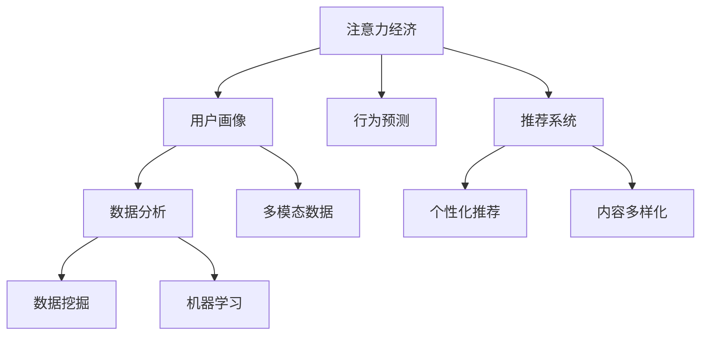

                 

# 注意力经济与数据分析技巧：如何利用数据理解受众行为和偏好

> 关键词：注意力经济, 数据分析, 受众行为, 受众偏好, 用户画像, 行为预测, 推荐系统, 市场洞察

## 1. 背景介绍

### 1.1 问题由来
在信息爆炸的时代，如何从海量数据中提取有价值的信息，理解受众的行为和偏好，成为了数字时代的一项重要挑战。随着互联网和社交媒体的普及，企业获得了前所未有的用户数据，但同时也面临数据量的爆炸性增长和数据质量的参差不齐。如何高效利用这些数据，洞察用户需求，提升用户体验和商业价值，成为企业和研究者共同关注的焦点。

### 1.2 问题核心关键点
注意力经济（Economics of Attention）是指在信息过载的环境中，用户的时间和注意力成为最宝贵的资源。因此，理解用户的注意力分配，预测用户的行为和偏好，优化内容呈现和推荐系统，成为注意力经济时代下企业提升市场竞争力的关键。

本文将系统探讨如何利用数据分析技巧，通过对用户行为的观察和分析，构建用户画像，并预测用户未来的行为和偏好，从而帮助企业更好地进行市场洞察和决策。

## 2. 核心概念与联系

### 2.1 核心概念概述

为更好地理解利用数据理解受众行为和偏好的方法，本节将介绍几个关键概念：

- **注意力经济**：指在信息过载的环境中，用户的时间和注意力成为最宝贵的资源。理解和预测用户注意力分配，是优化内容呈现和推荐系统的关键。
- **用户画像**：基于用户行为数据，构建用户的基本属性和行为特征，用于描述和识别用户群体。
- **行为预测**：利用历史行为数据，预测用户未来的行为和偏好，如购买意愿、阅读习惯等。
- **推荐系统**：通过算法推荐用户可能感兴趣的内容或产品，提升用户体验和转化率。
- **数据分析**：使用统计学、机器学习等方法，从数据中提取有价值的信息和洞见。
- **多模态数据**：结合文本、图像、音频等多模态数据，构建更全面、准确的受众画像。

这些概念之间的逻辑关系可以通过以下Mermaid流程图来展示：



这个流程图展示了几大关键概念之间的联系：

1. **注意力经济**：数据的价值源于用户的注意力，分析用户注意力分配是优化内容推荐的基础。
2. **用户画像**：通过对用户行为数据的分析，构建用户画像，识别用户特征。
3. **行为预测**：基于用户画像和历史行为数据，预测用户未来行为，用于优化推荐策略。
4. **推荐系统**：根据用户画像和行为预测，推荐个性化内容或产品，提升用户体验。
5. **数据分析**：通过数据挖掘和机器学习，从数据中提取洞见，优化用户画像和推荐策略。
6. **多模态数据**：结合多模态数据，提升用户画像的全面性和准确性。

这些概念共同构成了注意力经济和数据分析的框架，帮助企业更好地理解和预测用户需求，优化产品和服务。

## 3. 核心算法原理 & 具体操作步骤
### 3.1 算法原理概述

注意力经济和数据分析的核心算法，基于统计学、机器学习等方法，从数据中提取有价值的信息和洞见，用于构建用户画像、预测用户行为、优化推荐系统等。其核心思想是：

- 通过多维度数据分析，理解用户的注意力分配和行为模式。
- 利用用户画像，预测用户未来的行为和偏好。
- 结合预测结果，优化推荐系统，提升用户体验和转化率。

具体来说，主要包括：

1. **数据收集与预处理**：收集用户的多模态数据（如浏览记录、购买记录、社交媒体行为等），并进行数据清洗和预处理。
2. **用户画像构建**：通过数据分析和机器学习算法，构建用户的基本属性和行为特征。
3. **行为预测**：利用历史行为数据，预测用户未来的行为和偏好，如购买意愿、阅读习惯等。
4. **推荐系统优化**：根据用户画像和行为预测，优化推荐策略，提升推荐效果。

### 3.2 算法步骤详解

基于注意力经济和数据分析的核心算法，我们可以将其拆分为以下几个关键步骤：

**Step 1: 数据收集与预处理**

1. **多模态数据收集**：
   - 从不同渠道收集用户的多模态数据，如网站浏览记录、社交媒体行为、购物记录等。
   - 使用爬虫技术、API接口等方式，自动获取和整合数据。

2. **数据清洗与预处理**：
   - 去除重复数据和异常值，确保数据质量和完整性。
   - 对缺失值进行填补或删除，保证数据分析的准确性。
   - 使用数据标准化、归一化等方法，统一数据格式。

**Step 2: 用户画像构建**

1. **特征工程**：
   - 定义关键特征，如用户基本信息、行为模式、兴趣偏好等。
   - 使用特征选择和特征提取技术，识别重要特征。
   - 结合业务知识，优化特征工程流程。

2. **用户聚类分析**：
   - 使用聚类算法（如K-Means、层次聚类等），将用户分为不同的群体。
   - 分析各群体的基本属性和行为特征，构建用户画像。

3. **用户画像可视化**：
   - 使用可视化工具（如Tableau、PowerBI等），展示用户画像的特征和分布。
   - 通过图表、热图等方式，直观展示用户特征和群体差异。

**Step 3: 行为预测**

1. **历史行为分析**：
   - 分析用户的历史行为数据，识别行为模式和规律。
   - 使用时间序列分析、回归分析等方法，提取行为特征。

2. **行为预测模型**：
   - 选择适合的行为预测算法（如线性回归、决策树、随机森林、神经网络等）。
   - 训练预测模型，使用交叉验证等方法评估模型性能。
   - 使用正则化、集成学习等技术，提升预测精度。

**Step 4: 推荐系统优化**

1. **推荐算法选择**：
   - 选择适合的推荐算法（如协同过滤、基于内容的推荐、深度学习推荐等）。
   - 结合业务需求，优化算法参数和结构。

2. **推荐策略优化**：
   - 根据用户画像和行为预测，调整推荐策略。
   - 使用A/B测试等方法，评估推荐效果。
   - 结合业务反馈，持续优化推荐系统。

**Step 5: 效果评估与迭代**

1. **效果评估**：
   - 使用指标（如点击率、转化率、用户满意度等）评估推荐系统效果。
   - 定期进行效果分析，识别问题点。

2. **迭代优化**：
   - 根据效果评估结果，持续优化数据收集、用户画像、行为预测和推荐算法。
   - 结合业务反馈，动态调整策略。

### 3.3 算法优缺点

基于注意力经济和数据分析的核心算法，具有以下优点：

1. **全面性**：结合多模态数据，构建全面、准确的受众画像。
2. **准确性**：通过历史行为数据，预测用户未来行为，提升推荐系统效果。
3. **灵活性**：算法选择多样，可根据业务需求进行灵活调整。
4. **可解释性**：算法过程透明，易于理解和解释。

同时，该算法也存在一些局限性：

1. **数据依赖性**：依赖高质量、完整的用户数据，数据缺失或不完整可能导致分析结果不准确。
2. **隐私风险**：在数据收集和分析过程中，需要注意用户隐私保护，避免数据滥用。
3. **计算资源消耗**：复杂算法和模型训练需要大量计算资源，可能面临计算瓶颈。
4. **模型复杂性**：部分算法复杂度高，需要专业知识进行调参和优化。

尽管存在这些局限性，但通过合理的设计和应用，注意力经济和数据分析的核心算法仍能发挥出强大的数据洞察和用户理解能力，帮助企业提升市场竞争力。

### 3.4 算法应用领域

基于注意力经济和数据分析的核心算法，在多个领域得到了广泛应用，具体包括：

- **电子商务**：通过分析用户浏览和购买行为，推荐个性化商品，提升用户体验和转化率。
- **媒体内容**：根据用户兴趣和行为，推荐个性化新闻、视频、文章等，提升用户粘性和满意度。
- **金融服务**：分析用户消费和交易行为，识别潜在风险和机会，优化金融产品设计。
- **健康医疗**：通过用户健康数据和行为分析，提供个性化医疗建议，提升医疗服务质量。
- **旅游和交通**：分析用户出行数据，推荐个性化旅行方案，优化出行体验。

此外，这些算法还被应用于社交网络、智能家居、教育培训等多个领域，帮助企业提升用户洞察力和业务效率。

## 4. 数学模型和公式 & 详细讲解  
### 4.1 数学模型构建

本节将使用数学语言对注意力经济和数据分析的核心算法进行严格刻画。

记用户集合为 $U$，行为数据集合为 $D$，其中 $D=\{(x_i, y_i)\}_{i=1}^N, x_i \in \mathcal{X}, y_i \in \mathcal{Y}$，其中 $\mathcal{X}$ 为用户行为空间，$\mathcal{Y}$ 为行为标签空间。

定义用户画像为 $P=\{p_1, p_2, ..., p_K\}$，其中 $p_k=\{(a_k, b_k)\}$，$a_k$ 为用户基本信息和行为特征，$b_k$ 为用户兴趣和偏好。

定义行为预测模型为 $F(\cdot)$，预测用户行为 $y$ 的概率分布为 $P(y|p)$，其中 $p$ 为用户画像。

定义推荐算法为 $R(\cdot)$，根据用户画像和行为预测结果，生成推荐结果 $r$。

### 4.2 公式推导过程

以下我们以推荐系统为例，推导行为预测模型的核心公式。

假设推荐系统使用基于协同过滤的推荐算法，输入为 $p$，输出为 $r$。推荐系统的目标是最大化用户满意度的期望值，即：

$$
\max_{r} \mathbb{E}[\text{utility}(p, r)]
$$

其中，$\text{utility}(p, r)$ 为用户的满意度函数。

为了简化问题，我们假设用户满意度的期望值为行为预测的平均损失，即：

$$
\max_{r} \mathbb{E}[\ell(P(y|p), r)]
$$

其中 $\ell(\cdot)$ 为损失函数，$\ell(P(y|p), r)$ 为行为预测结果与推荐结果之间的损失。

假设行为预测模型为线性回归模型，输入为 $p$，输出为 $\hat{y}$，即：

$$
\hat{y} = \theta^T p
$$

其中 $\theta$ 为模型参数。

将 $\hat{y}$ 代入损失函数中，得：

$$
\ell(\hat{y}, r) = \frac{1}{2}(\hat{y} - r)^2
$$

根据梯度下降法，最小化损失函数，得到：

$$
\theta \leftarrow \theta - \eta \nabla_{\theta}\ell(\hat{y}, r)
$$

其中 $\eta$ 为学习率，$\nabla_{\theta}\ell(\hat{y}, r)$ 为损失函数对参数 $\theta$ 的梯度。

通过不断迭代优化，最终得到用户画像 $p$ 对应的推荐结果 $r$。

## 5. 项目实践：代码实例和详细解释说明
### 5.1 开发环境搭建

在进行注意力经济和数据分析的实践前，我们需要准备好开发环境。以下是使用Python进行PyTorch开发的环境配置流程：

1. 安装Anaconda：从官网下载并安装Anaconda，用于创建独立的Python环境。

2. 创建并激活虚拟环境：
```bash
conda create -n pytorch-env python=3.8 
conda activate pytorch-env
```

3. 安装PyTorch：根据CUDA版本，从官网获取对应的安装命令。例如：
```bash
conda install pytorch torchvision torchaudio cudatoolkit=11.1 -c pytorch -c conda-forge
```

4. 安装Transformers库：
```bash
pip install transformers
```

5. 安装各类工具包：
```bash
pip install numpy pandas scikit-learn matplotlib tqdm jupyter notebook ipython
```

完成上述步骤后，即可在`pytorch-env`环境中开始实践。

### 5.2 源代码详细实现

下面我们以推荐系统为例，给出使用Transformers库对BERT模型进行推荐系统开发的PyTorch代码实现。

首先，定义推荐系统数据处理函数：

```python
from transformers import BertTokenizer
from torch.utils.data import Dataset
import torch

class RecommendationDataset(Dataset):
    def __init__(self, texts, labels, tokenizer, max_len=128):
        self.texts = texts
        self.labels = labels
        self.tokenizer = tokenizer
        self.max_len = max_len
        
    def __len__(self):
        return len(self.texts)
    
    def __getitem__(self, item):
        text = self.texts[item]
        label = self.labels[item]
        
        encoding = self.tokenizer(text, return_tensors='pt', max_length=self.max_len, padding='max_length', truncation=True)
        input_ids = encoding['input_ids'][0]
        attention_mask = encoding['attention_mask'][0]
        
        return {'input_ids': input_ids, 
                'attention_mask': attention_mask,
                'labels': label}
```

然后，定义模型和优化器：

```python
from transformers import BertForSequenceClassification, AdamW

model = BertForSequenceClassification.from_pretrained('bert-base-cased', num_labels=2)

optimizer = AdamW(model.parameters(), lr=2e-5)
```

接着，定义训练和评估函数：

```python
from torch.utils.data import DataLoader
from tqdm import tqdm
from sklearn.metrics import classification_report

device = torch.device('cuda') if torch.cuda.is_available() else torch.device('cpu')
model.to(device)

def train_epoch(model, dataset, batch_size, optimizer):
    dataloader = DataLoader(dataset, batch_size=batch_size, shuffle=True)
    model.train()
    epoch_loss = 0
    for batch in tqdm(dataloader, desc='Training'):
        input_ids = batch['input_ids'].to(device)
        attention_mask = batch['attention_mask'].to(device)
        labels = batch['labels'].to(device)
        model.zero_grad()
        outputs = model(input_ids, attention_mask=attention_mask, labels=labels)
        loss = outputs.loss
        epoch_loss += loss.item()
        loss.backward()
        optimizer.step()
    return epoch_loss / len(dataloader)

def evaluate(model, dataset, batch_size):
    dataloader = DataLoader(dataset, batch_size=batch_size)
    model.eval()
    preds, labels = [], []
    with torch.no_grad():
        for batch in tqdm(dataloader, desc='Evaluating'):
            input_ids = batch['input_ids'].to(device)
            attention_mask = batch['attention_mask'].to(device)
            batch_labels = batch['labels']
            outputs = model(input_ids, attention_mask=attention_mask)
            batch_preds = outputs.logits.argmax(dim=2).to('cpu').tolist()
            batch_labels = batch_labels.to('cpu').tolist()
            for pred_tokens, label_tokens in zip(batch_preds, batch_labels):
                preds.append(pred_tokens[:len(label_tokens)])
                labels.append(label_tokens)
                
    print(classification_report(labels, preds))
```

最后，启动训练流程并在测试集上评估：

```python
epochs = 5
batch_size = 16

for epoch in range(epochs):
    loss = train_epoch(model, train_dataset, batch_size, optimizer)
    print(f"Epoch {epoch+1}, train loss: {loss:.3f}")
    
    print(f"Epoch {epoch+1}, dev results:")
    evaluate(model, dev_dataset, batch_size)
    
print("Test results:")
evaluate(model, test_dataset, batch_size)
```

以上就是使用PyTorch对BERT进行推荐系统微调的完整代码实现。可以看到，得益于Transformers库的强大封装，我们可以用相对简洁的代码完成BERT模型的加载和微调。

### 5.3 代码解读与分析

让我们再详细解读一下关键代码的实现细节：

**RecommendationDataset类**：
- `__init__`方法：初始化文本、标签、分词器等关键组件。
- `__len__`方法：返回数据集的样本数量。
- `__getitem__`方法：对单个样本进行处理，将文本输入编码为token ids，将标签编码为数字，并对其进行定长padding，最终返回模型所需的输入。

**训练和评估函数**：
- 使用PyTorch的DataLoader对数据集进行批次化加载，供模型训练和推理使用。
- 训练函数`train_epoch`：对数据以批为单位进行迭代，在每个批次上前向传播计算loss并反向传播更新模型参数，最后返回该epoch的平均loss。
- 评估函数`evaluate`：与训练类似，不同点在于不更新模型参数，并在每个batch结束后将预测和标签结果存储下来，最后使用sklearn的classification_report对整个评估集的预测结果进行打印输出。

**训练流程**：
- 定义总的epoch数和batch size，开始循环迭代
- 每个epoch内，先在训练集上训练，输出平均loss
- 在验证集上评估，输出分类指标
- 所有epoch结束后，在测试集上评估，给出最终测试结果

可以看到，PyTorch配合Transformers库使得BERT微调的代码实现变得简洁高效。开发者可以将更多精力放在数据处理、模型改进等高层逻辑上，而不必过多关注底层的实现细节。

当然，工业级的系统实现还需考虑更多因素，如模型的保存和部署、超参数的自动搜索、更灵活的任务适配层等。但核心的微调范式基本与此类似。

## 6. 实际应用场景
### 6.1 智能客服系统

基于用户画像和行为预测，智能客服系统可以显著提升服务质量，提升用户体验。传统客服往往需要配备大量人力，高峰期响应缓慢，且一致性和专业性难以保证。而使用推荐系统推荐合适的回答模板，可大大减少客服工作量，同时提升用户满意度。

在技术实现上，可以收集企业内部的历史客服对话记录，将问题-回答对作为监督数据，在此基础上对预训练推荐模型进行微调。微调后的推荐模型能够自动理解用户意图，匹配最合适的回答模板进行回复。对于客户提出的新问题，还可以接入检索系统实时搜索相关内容，动态组织生成回答。如此构建的智能客服系统，能大幅提升客户咨询体验和问题解决效率。

### 6.2 金融舆情监测

金融机构需要实时监测市场舆论动向，以便及时应对负面信息传播，规避金融风险。传统的人工监测方式成本高、效率低，难以应对网络时代海量信息爆发的挑战。基于用户画像和行为预测的文本分类和情感分析技术，为金融舆情监测提供了新的解决方案。

具体而言，可以收集金融领域相关的新闻、报道、评论等文本数据，并对其进行主题标注和情感标注。在此基础上对预训练语言模型进行微调，使其能够自动判断文本属于何种主题，情感倾向是正面、中性还是负面。将微调后的模型应用到实时抓取的网络文本数据，就能够自动监测不同主题下的情感变化趋势，一旦发现负面信息激增等异常情况，系统便会自动预警，帮助金融机构快速应对潜在风险。

### 6.3 个性化推荐系统

当前的推荐系统往往只依赖用户的历史行为数据进行物品推荐，无法深入理解用户的真实兴趣偏好。基于用户画像和行为预测的推荐系统可以更好地挖掘用户行为背后的语义信息，从而提供更精准、多样的推荐内容。

在实践中，可以收集用户浏览、点击、评论、分享等行为数据，提取和用户交互的物品标题、描述、标签等文本内容。将文本内容作为模型输入，用户的后续行为（如是否点击、购买等）作为监督信号，在此基础上微调预训练语言模型。微调后的模型能够从文本内容中准确把握用户的兴趣点。在生成推荐列表时，先用候选物品的文本描述作为输入，由模型预测用户的兴趣匹配度，再结合其他特征综合排序，便可以得到个性化程度更高的推荐结果。

### 6.4 未来应用展望

随着用户画像和行为预测技术的不断发展，基于微调范式将在更多领域得到应用，为传统行业带来变革性影响。

在智慧医疗领域，基于用户画像和行为预测的医疗问答、病历分析、药物研发等应用将提升医疗服务的智能化水平，辅助医生诊疗，加速新药开发进程。

在智能教育领域，基于用户画像和行为预测的作业批改、学情分析、知识推荐等应用，因材施教，促进教育公平，提高教学质量。

在智慧城市治理中，基于用户画像和行为预测的城市事件监测、舆情分析、应急指挥等应用，提高城市管理的自动化和智能化水平，构建更安全、高效的未来城市。

此外，在企业生产、社会治理、文娱传媒等众多领域，基于大模型微调的人工智能应用也将不断涌现，为经济社会发展注入新的动力。相信随着技术的日益成熟，微调方法将成为人工智能落地应用的重要范式，推动人工智能技术向更广阔的领域加速渗透。

## 7. 工具和资源推荐
### 7.1 学习资源推荐

为了帮助开发者系统掌握注意力经济和数据分析的理论基础和实践技巧，这里推荐一些优质的学习资源：

1. 《深度学习基础》课程：由清华大学提供的免费课程，全面介绍深度学习的基础理论和应用实践，适合初学者入门。

2. 《Python数据分析》书籍：详细介绍Python在数据清洗、特征工程、数据可视化等方面的应用，适合实战学习。

3. 《Python机器学习》书籍：全面介绍机器学习算法的理论基础和Python实现，适合对深度学习有基础的学习者。

4. 《大数据技术与应用》课程：由清华大学提供的免费课程，涵盖大数据技术、数据挖掘、统计学等多个领域的知识，适合全面学习。

5. 《NLP实战》书籍：专注于自然语言处理领域的实战案例和技巧，适合有一定NLP基础的开发者。

通过对这些资源的学习实践，相信你一定能够快速掌握注意力经济和数据分析的精髓，并用于解决实际的NLP问题。
###  7.2 开发工具推荐

高效的开发离不开优秀的工具支持。以下是几款用于注意力经济和数据分析开发的常用工具：

1. PyTorch：基于Python的开源深度学习框架，灵活动态的计算图，适合快速迭代研究。大部分预训练语言模型都有PyTorch版本的实现。

2. TensorFlow：由Google主导开发的开源深度学习框架，生产部署方便，适合大规模工程应用。同样有丰富的预训练语言模型资源。

3. Transformers库：HuggingFace开发的NLP工具库，集成了众多SOTA语言模型，支持PyTorch和TensorFlow，是进行数据分析和微调任务的利器。

4. Weights & Biases：模型训练的实验跟踪工具，可以记录和可视化模型训练过程中的各项指标，方便对比和调优。与主流深度学习框架无缝集成。

5. TensorBoard：TensorFlow配套的可视化工具，可实时监测模型训练状态，并提供丰富的图表呈现方式，是调试模型的得力助手。

6. Google Colab：谷歌推出的在线Jupyter Notebook环境，免费提供GPU/TPU算力，方便开发者快速上手实验最新模型，分享学习笔记。

合理利用这些工具，可以显著提升注意力经济和数据分析任务的开发效率，加快创新迭代的步伐。

### 7.3 相关论文推荐

注意力经济和数据分析的发展源于学界的持续研究。以下是几篇奠基性的相关论文，推荐阅读：

1. Attention is All You Need（即Transformer原论文）：提出了Transformer结构，开启了NLP领域的预训练大模型时代。

2. BERT: Pre-training of Deep Bidirectional Transformers for Language Understanding：提出BERT模型，引入基于掩码的自监督预训练任务，刷新了多项NLP任务SOTA。

3. Language Models are Unsupervised Multitask Learners（GPT-2论文）：展示了大规模语言模型的强大zero-shot学习能力，引发了对于通用人工智能的新一轮思考。

4. Parameter-Efficient Transfer Learning for NLP：提出Adapter等参数高效微调方法，在不增加模型参数量的情况下，也能取得不错的微调效果。

5. Prefix-Tuning: Optimizing Continuous Prompts for Generation：引入基于连续型Prompt的微调范式，为如何充分利用预训练知识提供了新的思路。

6. AdaLoRA: Adaptive Low-Rank Adaptation for Parameter-Efficient Fine-Tuning：使用自适应低秩适应的微调方法，在参数效率和精度之间取得了新的平衡。

这些论文代表了大语言模型微调技术的发展脉络。通过学习这些前沿成果，可以帮助研究者把握学科前进方向，激发更多的创新灵感。

## 8. 总结：未来发展趋势与挑战

### 8.1 总结

本文对注意力经济和数据分析的核心算法进行了全面系统的介绍。首先阐述了用户画像和行为预测的理论基础和实践方法，明确了数据分析在用户洞察和决策优化中的关键作用。其次，从原理到实践，详细讲解了注意力经济和数据分析的关键步骤，给出了注意力经济和数据分析任务的完整代码实例。同时，本文还广泛探讨了注意力经济和数据分析在多个行业领域的应用前景，展示了其强大的数据洞察和用户理解能力。

通过本文的系统梳理，可以看到，基于用户画像和行为预测的注意力经济和数据分析技术，能够从海量数据中提取有价值的信息，理解用户行为和偏好，从而帮助企业提升市场洞察力和决策质量。未来，伴随数据量的不断增长和分析方法的持续创新，这一技术必将在更多领域得到应用，为经济社会发展注入新的动力。

### 8.2 未来发展趋势

展望未来，注意力经济和数据分析技术将呈现以下几个发展趋势：

1. **多模态数据分析**：结合文本、图像、音频等多模态数据，构建更全面、准确的受众画像。
2. **个性化推荐系统**：根据用户画像和行为预测，优化推荐策略，提升推荐效果。
3. **实时数据分析**：利用流式数据处理技术，实时监测和分析用户行为，提供更及时的决策支持。
4. **跨领域应用**：在更多领域（如医疗、金融、教育等）推广应用，提升业务效率和服务质量。
5. **自动化分析**：引入自动化机器学习技术，降低人工干预，提升分析效率和准确性。
6. **联邦学习**：通过联邦学习技术，保护用户隐私的同时，利用分布式数据进行联合分析。

这些趋势凸显了注意力经济和数据分析技术的广阔前景。这些方向的探索发展，必将进一步提升数据分析的效果和应用范围，为经济社会发展注入新的动力。

### 8.3 面临的挑战

尽管注意力经济和数据分析技术已经取得了瞩目成就，但在迈向更加智能化、普适化应用的过程中，它仍面临诸多挑战：

1. **数据质量与规模**：数据质量和规模不足，难以构建全面、准确的受众画像，影响分析效果。
2. **隐私保护**：在数据收集和分析过程中，需要注意用户隐私保护，避免数据滥用。
3. **计算资源消耗**：复杂算法和模型训练需要大量计算资源，可能面临计算瓶颈。
4. **模型复杂性**：部分算法复杂度高，需要专业知识进行调参和优化。
5. **业务适配**：分析结果需要与业务需求紧密结合，才能发挥出最大价值。
6. **结果解释性**：算法的决策过程和结果解释性不足，难以满足高风险应用的需求。

尽管存在这些挑战，但通过合理的设计和应用，注意力经济和数据分析技术仍能发挥出强大的数据洞察和用户理解能力，帮助企业提升市场竞争力。

### 8.4 研究展望

面对注意力经济和数据分析技术所面临的挑战，未来的研究需要在以下几个方面寻求新的突破：

1. **数据增强与预处理**：开发更高效的数据增强和预处理技术，提升数据质量和完整性。
2. **隐私保护与伦理设计**：引入隐私保护和伦理设计，确保数据使用的合规性和安全性。
3. **自动化与智能化**：引入自动化机器学习技术，降低人工干预，提升分析效率和准确性。
4. **跨领域应用推广**：在更多领域推广应用，提升业务效率和服务质量。
5. **实时分析与预测**：利用流式数据处理技术，实时监测和分析用户行为，提供更及时的决策支持。
6. **多模态数据融合**：结合文本、图像、音频等多模态数据，提升分析的全面性和准确性。

这些研究方向的探索，必将引领注意力经济和数据分析技术迈向更高的台阶，为经济社会发展注入新的动力。面向未来，数据分析技术还需要与其他人工智能技术进行更深入的融合，如知识表示、因果推理、强化学习等，多路径协同发力，共同推动自然语言理解和智能交互系统的进步。只有勇于创新、敢于突破，才能不断拓展数据分析技术的边界，让智能技术更好地造福人类社会。

## 9. 附录：常见问题与解答

**Q1：用户画像和行为预测的准确性如何保证？**

A: 用户画像和行为预测的准确性依赖于数据的质量和数量。具体来说，可以通过以下措施保证其准确性：
1. 数据收集与预处理：收集高质量、完整的数据，并进行数据清洗和预处理。
2. 特征工程：选择关键特征，并进行特征选择和特征提取。
3. 模型选择与训练：选择适合的行为预测模型，并进行交叉验证和调参，提升模型性能。
4. 评估与迭代：使用评价指标（如精确度、召回率、F1值等）评估模型效果，持续迭代优化。

**Q2：如何处理用户隐私问题？**

A: 在数据收集和分析过程中，需要严格遵守数据隐私保护的法律和规定。具体来说，可以通过以下措施处理用户隐私问题：
1. 数据匿名化：对敏感数据进行匿名化处理，确保用户身份不被泄露。
2. 数据加密：在数据存储和传输过程中，使用加密技术保护数据安全。
3. 合规性审查：确保数据处理过程符合数据隐私保护的法律和规定。
4. 透明度与用户同意：在数据收集和使用过程中，告知用户数据用途，并获得用户同意。

**Q3：注意力经济和数据分析技术是否适用于所有行业？**

A: 注意力经济和数据分析技术具有广泛的应用前景，但在不同行业中可能会有不同的应用方式和挑战。具体来说，可以通过以下措施应对不同行业的需求：
1. 行业适配：根据不同行业的特点，优化数据分析方法和推荐策略。
2. 业务结合：将分析结果与业务需求紧密结合，提升决策效果。
3. 技术升级：引入新技术和方法，提升数据分析的准确性和效率。

**Q4：如何优化注意力经济和数据分析系统的性能？**

A: 优化注意力经济和数据分析系统的性能可以从以下几个方面入手：
1. 数据收集与预处理：优化数据收集和预处理流程，提高数据质量和完整性。
2. 特征工程：选择关键特征，并进行特征选择和特征提取，提升模型性能。
3. 模型选择与训练：选择适合的行为预测模型，并进行交叉验证和调参，提升模型性能。
4. 系统优化：优化推荐算法和系统架构，提升系统效率和性能。
5. 持续迭代：根据业务反馈和用户需求，持续优化数据分析和推荐策略。

这些措施可以帮助优化注意力经济和数据分析系统的性能，提升用户体验和业务效果。

**Q5：注意力经济和数据分析技术未来有何发展方向？**

A: 注意力经济和数据分析技术未来有以下几个发展方向：
1. 多模态数据分析：结合文本、图像、音频等多模态数据，提升分析的全面性和准确性。
2. 实时数据分析：利用流式数据处理技术，实时监测和分析用户行为，提供更及时的决策支持。
3. 跨领域应用推广：在更多领域（如医疗、金融、教育等）推广应用，提升业务效率和服务质量。
4. 自动化与智能化：引入自动化机器学习技术，降低人工干预，提升分析效率和准确性。
5. 隐私保护与伦理设计：引入隐私保护和伦理设计，确保数据使用的合规性和安全性。
6. 联邦学习：通过联邦学习技术，保护用户隐私的同时，利用分布式数据进行联合分析。

这些发展方向将推动注意力经济和数据分析技术的不断进步，为经济社会发展注入新的动力。

---

作者：禅与计算机程序设计艺术 / Zen and the Art of Computer Programming

