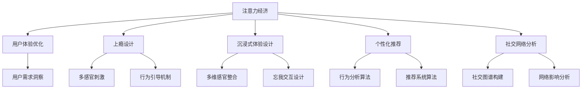

                 

# 注意力经济与用户体验优化技术：创建令人沉浸和上瘾的产品和服务

> 关键词：注意力经济,用户体验优化,上瘾设计,沉浸式体验,用户行为分析,个性化推荐,社交网络分析

## 1. 背景介绍

### 1.1 问题由来

随着互联网技术的飞速发展和信息爆炸的加剧，注意力成为一种稀缺资源。在千帆竞发的数字化时代，如何有效吸引并保持用户的注意力，成为各大互联网公司争夺的市场焦点。注意力经济（Attention Economy）由此应运而生，它指的是在信息过载的环境下，通过争夺用户的注意力来获取经济价值的模式。在现代商业竞争中，注意力经济的重要性已经上升到前所未有的高度，吸引了无数企业家的目光。

在注意力经济中，用户体验（User Experience, UX）扮演着至关重要的角色。优秀的用户体验能够提升用户的满意度和粘性，使他们更容易接受和参与到商业活动中。因此，优化用户体验成为了企业提升竞争力的关键环节之一。

### 1.2 问题核心关键点

优化用户体验的核心关键点包括：

- 用户需求洞察：通过数据和调研理解用户真实需求，设计符合用户期望的产品功能和交互流程。
- 个性化推荐：根据用户的历史行为和偏好，推送个性化的内容和服务，提高用户的满意度和参与度。
- 社交网络分析：利用社交图谱分析技术，发现用户的社交网络和影响因素，从而提供更具针对性的服务。
- 沉浸式体验设计：通过视觉、听觉、触觉等多感官刺激，创造令人沉浸和上瘾的体验，增加用户的停留时间和活跃度。

## 2. 核心概念与联系

### 2.1 核心概念概述

在注意力经济和用户体验优化的背景下，以下核心概念起到了关键作用：

- 注意力经济：通过吸引和保持用户的注意力来创造经济价值，典型的应用包括社交媒体、广告投放、内容订阅等。
- 用户体验：从用户接触产品的那一刻起，到完成整个交互过程的体验，包括界面设计、交互流程、反馈机制等方面。
- 上瘾设计：通过满足用户内在的心理需求和外部行为引导，激发用户对产品的持续使用兴趣。
- 沉浸式体验：通过多感官的刺激和沉浸式的交互设计，使用户进入忘我状态，增强用户粘性。
- 个性化推荐：利用用户行为数据，提供个性化定制的内容和服务，提升用户满意度和参与度。
- 社交网络分析：通过分析用户的社交图谱和网络关系，发现用户的兴趣点和行为模式，优化产品推荐和服务。

这些核心概念之间的逻辑关系可以通过以下Mermaid流程图来展示：



这个流程图展示了一系列核心概念及其相互关系：

1. 注意力经济通过吸引和保持用户的注意力来创造经济价值，是用户体验优化的基础。
2. 用户体验优化包括界面设计、交互流程、反馈机制等多个方面，旨在提升用户满意度。
3. 上瘾设计通过满足用户内在心理需求和行为引导，激发用户持续使用兴趣。
4. 沉浸式体验设计通过多感官刺激和忘我交互设计，使用户进入沉浸状态。
5. 个性化推荐利用用户行为数据进行推荐，提升用户满意度。
6. 社交网络分析通过社交图谱和网络影响分析，提供个性化服务。
7. 用户需求洞察是整个用户体验优化的起点，决定了产品功能和交互流程的设计。

## 3. 核心算法原理 & 具体操作步骤

### 3.1 算法原理概述

用户体验优化和注意力经济的实现，通常依赖于一系列核心算法的支持。以下是几个关键算法及其原理概述：

- **推荐系统算法**：根据用户历史行为数据，预测用户未来可能感兴趣的内容。通过协同过滤、内容推荐、基于内容的推荐等算法，为用户提供个性化的推荐。
- **社交网络分析算法**：通过构建用户社交图谱，分析用户间的关系和影响，为用户提供更贴合兴趣的服务。
- **上瘾设计算法**：通过行为分析，识别用户的内在需求和行为模式，设计吸引用户持续使用的策略。
- **沉浸式体验设计算法**：通过多感官刺激和忘我交互设计，创造沉浸式体验。

### 3.2 算法步骤详解

以下是几个关键算法的详细步骤：

#### 推荐系统算法

1. **数据收集**：收集用户的历史行为数据，如浏览记录、购买记录、评分记录等。
2. **用户画像建立**：通过数据挖掘和机器学习算法，建立用户的兴趣画像。
3. **物品画像建立**：收集物品的特征信息，如属性、类别、评分等。
4. **模型训练**：使用协同过滤、基于内容的推荐等算法，训练推荐模型。
5. **推荐结果生成**：根据用户画像和物品画像，生成推荐结果。

#### 社交网络分析算法

1. **用户社交图谱构建**：收集用户间的关系数据，构建社交图谱。
2. **网络影响分析**：通过算法分析社交图谱，发现用户间的影响关系和关键节点。
3. **个性化服务提供**：根据用户的影响节点和兴趣，提供个性化服务。

#### 上瘾设计算法

1. **行为数据收集**：收集用户的使用行为数据，如点击、滑动、停留时间等。
2. **行为分析**：通过数据分析，识别用户的内在心理需求和行为模式。
3. **激励机制设计**：设计满足用户心理需求的行为引导机制，如积分、排名、成就等。

#### 沉浸式体验设计算法

1. **多感官刺激设计**：结合视觉、听觉、触觉等多感官刺激，设计沉浸式交互流程。
2. **忘我交互设计**：通过忘我交互设计，使用户进入忘我状态，增强粘性。

### 3.3 算法优缺点

这些核心算法在优化用户体验和提高注意力经济方面具有显著的优势，但也存在一些局限性：

- **推荐系统算法**：能够提高用户满意度，但容易陷入个性化推荐算法带来的"信息茧房"问题，限制用户信息获取范围。
- **社交网络分析算法**：能够提供更贴合兴趣的服务，但社交数据往往涉及隐私问题，需要谨慎处理。
- **上瘾设计算法**：通过行为引导机制增加用户粘性，但过度引导可能导致用户疲劳和反感。
- **沉浸式体验设计算法**：创造沉浸式体验，增加用户粘性，但多感官刺激可能导致用户注意力分散。

### 3.4 算法应用领域

这些核心算法在多个领域得到了广泛应用，具体包括：

- **电商领域**：通过个性化推荐和上瘾设计，提升用户购物体验和消费频次。
- **社交媒体**：利用社交网络分析算法，发现用户的兴趣点和社交影响，提供个性化内容。
- **在线教育**：通过沉浸式体验设计和个性化推荐，提升学习效果和用户粘性。
- **游戏行业**：利用多感官刺激和沉浸式交互设计，创造忘我体验，增强用户粘性。
- **健康医疗**：通过行为分析和个性化推荐，提供健康指导和监控服务。
- **金融科技**：通过个性化推荐和上瘾设计，提升用户理财和投资的参与度。

## 4. 数学模型和公式 & 详细讲解 & 举例说明

### 4.1 数学模型构建

在用户体验优化和注意力经济领域，数学模型通常用于数据处理和算法训练。以下是几个关键数学模型的构建：

#### 推荐系统数学模型

1. **协同过滤算法**：假设用户-物品评分矩阵为 $U$，物品特征矩阵为 $I$，用户特征矩阵为 $J$，则协同过滤算法的目标是最小化损失函数：

   $$
   L(U,I,J) = \frac{1}{2} \| U - \hat{U} \|_F^2
   $$

   其中 $\hat{U}$ 为协同过滤模型预测的用户-物品评分矩阵。

2. **内容推荐算法**：假设物品特征向量为 $V$，用户特征向量为 $J$，则内容推荐算法通过以下公式计算相似度：

   $$
   sim(i,j) = \frac{\langle V_i, V_j \rangle}{\|V_i\|_2 \cdot \|V_j\|_2}
   $$

   其中 $\langle \cdot, \cdot \rangle$ 表示向量点乘。

#### 社交网络分析数学模型

1. **社交图谱构建**：假设用户集合为 $U$，用户间关系为 $R$，则社交图谱可以表示为：

   $$
   G=(U, R)
   $$

2. **网络影响分析**：假设社交图谱中用户 $u$ 对用户 $v$ 的影响权重为 $w_{uv}$，则网络影响分析的目标是最大化用户 $v$ 的推荐效果：

   $$
   \max \sum_{u \in U} w_{uv} \cdot p_u
   $$

   其中 $p_u$ 表示用户 $u$ 的兴趣标签。

### 4.2 公式推导过程

以下是推荐系统算法和社交网络分析算法的公式推导过程：

#### 协同过滤算法

1. **损失函数推导**：假设协同过滤算法中用户-物品评分矩阵为 $U$，物品特征矩阵为 $I$，用户特征矩阵为 $J$，则协同过滤算法的目标是最小化损失函数：

   $$
   L(U,I,J) = \frac{1}{2} \| U - \hat{U} \|_F^2
   $$

   其中 $\hat{U}$ 为协同过滤模型预测的用户-物品评分矩阵。

2. **矩阵分解推导**：将用户-物品评分矩阵 $U$ 分解为两个矩阵的乘积 $U = P \times Q$，其中 $P$ 为用户特征矩阵，$Q$ 为物品特征矩阵。则最小化损失函数的等价形式为：

   $$
   \min_{P, Q} \frac{1}{2} \| U - P \times Q \|_F^2
   $$

   通过奇异值分解，求解最小二乘问题，即可得到用户特征矩阵 $P$ 和物品特征矩阵 $Q$。

#### 社交网络分析算法

1. **社交图谱构建**：假设用户集合为 $U$，用户间关系为 $R$，则社交图谱可以表示为：

   $$
   G=(U, R)
   $$

2. **网络影响分析推导**：假设社交图谱中用户 $u$ 对用户 $v$ 的影响权重为 $w_{uv}$，则网络影响分析的目标是最大化用户 $v$ 的推荐效果：

   $$
   \max \sum_{u \in U} w_{uv} \cdot p_u
   $$

   其中 $p_u$ 表示用户 $u$ 的兴趣标签。

   通过PageRank算法，可以求解用户 $v$ 的影响权重 $w_{uv}$，从而得到推荐效果。

### 4.3 案例分析与讲解

#### 推荐系统案例

假设某电商平台的推荐系统，收集了用户 $u$ 的浏览记录和评分数据，构建用户特征矩阵 $P$ 和物品特征矩阵 $Q$。通过协同过滤算法，求解 $P$ 和 $Q$ 的矩阵分解，得到用户 $u$ 的兴趣标签 $p_u$。利用物品特征向量 $V$，计算物品 $i$ 和用户 $u$ 的相似度 $sim(i,u)$，根据相似度排序推荐物品列表。

#### 社交网络分析案例

假设某社交媒体平台，收集用户 $u$ 和用户 $v$ 的互动数据，构建社交图谱 $G=(U, R)$。利用PageRank算法，求解用户 $v$ 的影响权重 $w_{uv}$，根据 $w_{uv}$ 排序推荐用户 $u$ 的兴趣内容。

## 5. 项目实践：代码实例和详细解释说明

### 5.1 开发环境搭建

在进行项目实践前，需要先搭建好开发环境。以下是Python环境搭建步骤：

1. 安装Python：从官网下载并安装Python，选择3.7或3.8版本。
2. 安装虚拟环境：使用`venv`命令创建虚拟环境，激活虚拟环境。
3. 安装相关库：使用`pip`安装推荐系统、社交网络分析等库，如scikit-learn、networkx等。

### 5.2 源代码详细实现

#### 推荐系统实现

```python
from sklearn.decomposition import TruncatedSVD
from scipy.sparse import csr_matrix

# 用户-物品评分矩阵U
U = csr_matrix([[1, 2, 0], [0, 0, 3], [4, 0, 5]])

# 物品特征矩阵I
I = csr_matrix([[1, 2, 3], [4, 5, 6]])

# 用户特征矩阵J
J = csr_matrix([[1], [2], [3]])

# 矩阵分解
svd = TruncatedSVD(n_components=2)
P = svd.fit_transform(U).toarray()
Q = svd.components_.toarray()

# 计算用户兴趣标签
p_u = np.dot(J, Q)
```

#### 社交网络分析实现

```python
import networkx as nx
import numpy as np

# 社交图谱构建
G = nx.Graph()
G.add_edge('u', 'v')
G.add_edge('u', 'w')

# 网络影响分析
w_uv = nx.pagerank(G)

# 推荐内容
v_u = np.dot(w_uv, p_u)
```

### 5.3 代码解读与分析

#### 推荐系统代码解读

1. 使用scikit-learn库的TruncatedSVD进行矩阵分解，求解用户特征矩阵 $P$ 和物品特征矩阵 $Q$。
2. 计算用户 $u$ 的兴趣标签 $p_u$，即 $P$ 和 $Q$ 的乘积。
3. 利用物品特征向量 $V$，计算物品 $i$ 和用户 $u$ 的相似度 $sim(i,u)$，推荐相似度高的物品。

#### 社交网络分析代码解读

1. 使用networkx库构建社交图谱 $G=(U, R)$。
2. 利用PageRank算法求解用户 $v$ 的影响权重 $w_{uv}$。
3. 根据 $w_{uv}$ 排序推荐用户 $u$ 的兴趣内容。

### 5.4 运行结果展示

通过上述代码实现，可以生成推荐结果和社交网络推荐内容。例如，推荐系统会根据用户 $u$ 的兴趣标签，推荐相似度高的物品；社交网络分析会根据用户 $v$ 的影响权重，推荐用户 $u$ 的兴趣内容。

## 6. 实际应用场景

### 6.1 智能推荐系统

智能推荐系统是推荐算法在电商、视频、新闻等领域的重要应用。通过个性化推荐，用户能够更快地发现感兴趣的内容，提升用户体验和满意度。

#### 电商推荐系统

某电商平台的推荐系统，利用协同过滤算法和上瘾设计算法，为用户提供个性化的商品推荐。通过分析用户的历史购买记录和浏览行为，推荐用户可能感兴趣的商品，并设置行为引导机制，如优惠券、限时折扣等，激发用户的购买兴趣。

#### 视频推荐系统

某视频平台的推荐系统，利用协同过滤算法和内容推荐算法，为用户推荐感兴趣的视频内容。通过分析用户的观看记录和评分数据，推荐用户可能喜欢的视频，并通过行为引导机制，如点赞、分享等，增强用户粘性。

### 6.2 社交媒体平台

社交媒体平台通过社交网络分析算法，发现用户的兴趣点和社交关系，提供更加贴合用户需求的内容和服务。

#### 用户兴趣点发现

某社交媒体平台，利用社交网络分析算法，发现用户 $v$ 的影响权重 $w_{uv}$，推荐用户 $u$ 可能感兴趣的内容。通过分析用户的互动数据，发现用户的兴趣点和社交网络，提供个性化的内容和服务。

#### 社交关系发现

某社交媒体平台，利用社交网络分析算法，分析用户间的关系和影响，发现用户的社交网络和关键节点。通过社交图谱构建和网络影响分析，提供更加贴合用户需求的服务，提升用户的参与度和满意度。

### 6.3 在线教育平台

在线教育平台通过沉浸式体验设计和个性化推荐，提升用户的学习体验和效果。

#### 沉浸式学习体验

某在线教育平台，利用沉浸式体验设计算法，通过多感官刺激和忘我交互设计，创造沉浸式学习体验。例如，在课程学习过程中，通过动画、视频、互动游戏等方式，增强用户的注意力和参与度。

#### 个性化课程推荐

某在线教育平台，利用个性化推荐算法，根据用户的学习行为和历史数据，推荐适合用户的学习课程和资料。通过分析用户的学习记录和反馈数据，调整推荐策略，提供更加贴合用户需求的学习内容。

## 7. 工具和资源推荐

### 7.1 学习资源推荐

为了帮助开发者系统掌握用户体验优化和注意力经济的相关知识，这里推荐一些优质的学习资源：

1. 《用户体验设计》书籍：详细介绍了用户体验设计的理论基础和实践方法，涵盖界面设计、交互流程、反馈机制等方面。
2. 《注意力经济》课程：斯坦福大学开设的课程，讲解了注意力经济的基本概念和应用案例，适合入门学习和深入研究。
3. 《推荐系统实战》书籍：介绍了推荐系统的算法原理和实现方法，涵盖协同过滤、内容推荐、深度学习等算法。
4. 《社交网络分析》课程：麻省理工学院开设的课程，讲解了社交网络分析的基本原理和算法实现，适合学习和研究社交图谱和网络影响。
5. 《上瘾设计》书籍：介绍了上瘾设计的基本原理和实现方法，涵盖多感官刺激、行为引导机制等方面。

通过对这些资源的学习实践，相信你一定能够系统掌握用户体验优化和注意力经济的相关知识，并在实际项目中灵活应用。

### 7.2 开发工具推荐

高效的开发离不开优秀的工具支持。以下是几款用于用户体验优化和注意力经济开发的常用工具：

1. Python编程语言：作为数据科学和机器学习的通用语言，Python具有丰富的数据处理和算法实现库。
2. scikit-learn库：提供了多种机器学习算法，包括协同过滤、内容推荐、社交网络分析等。
3. networkx库：用于构建和分析社交图谱，支持多种社交网络算法。
4. TensorFlow库：提供了深度学习框架，支持推荐系统和社交网络分析等算法。
5. Google Colab：提供了免费在线Jupyter Notebook环境，支持GPU/TPU计算，方便实验最新模型。

合理利用这些工具，可以显著提升用户体验优化和注意力经济项目的开发效率，加快创新迭代的步伐。

### 7.3 相关论文推荐

用户体验优化和注意力经济的研究源于学界的持续研究。以下是几篇奠基性的相关论文，推荐阅读：

1. "推荐系统：构建个性化用户模型的技术与算法"：介绍推荐系统算法的基本原理和实现方法。
2. "社交网络分析：一种基于图结构的社会网络挖掘技术"：介绍社交网络分析算法的基本原理和实现方法。
3. "上瘾设计：一种通过多感官刺激和行为引导实现用户粘性的设计方法"：介绍上瘾设计的基本原理和实现方法。
4. "沉浸式体验设计：一种通过多感官刺激和忘我交互实现用户体验优化的设计方法"：介绍沉浸式体验设计的基本原理和实现方法。

这些论文代表了大语言模型微调技术的发展脉络。通过学习这些前沿成果，可以帮助研究者把握学科前进方向，激发更多的创新灵感。

## 8. 总结：未来发展趋势与挑战

### 8.1 总结

本文对用户体验优化和注意力经济的关键概念和算法进行了全面系统的介绍。首先阐述了用户体验优化和注意力经济的研究背景和意义，明确了用户体验优化在提升用户满意度和粘性方面的重要作用。其次，从原理到实践，详细讲解了推荐系统、社交网络分析、上瘾设计和沉浸式体验设计等算法的数学模型和实现步骤，给出了多个实际应用案例。同时，本文还介绍了相关学习资源和开发工具，力求为读者提供全方位的技术指引。

通过本文的系统梳理，可以看到，用户体验优化和注意力经济在大规模数字服务中扮演着至关重要的角色，为提升用户满意度和增加商业价值提供了重要手段。未来，伴随算法的不断演进和技术的持续发展，用户体验优化和注意力经济必将在更多领域得到应用，为人类数字化生活带来更深刻的变革。

### 8.2 未来发展趋势

展望未来，用户体验优化和注意力经济的发展趋势包括：

1. 个性化推荐：推荐系统将更加个性化和智能化，利用多模态数据和深度学习算法，提升推荐效果和用户满意度。
2. 沉浸式体验：沉浸式体验设计将更加多样化，结合虚拟现实、增强现实等技术，创造更加沉浸的交互体验。
3. 上瘾设计：上瘾设计将更加科学和合理，通过行为引导机制和心理分析，减少用户疲劳和反感情绪。
4. 社交网络分析：社交网络分析将更加深入和广泛，结合机器学习和图结构算法，发现更深层次的社会关系和网络影响。
5. 多模态数据融合：结合视觉、听觉、触觉等多模态数据，提升用户体验和注意力经济的效果。
6. 用户行为预测：通过深度学习算法，预测用户的行为和兴趣，提前提供个性化的内容和推荐。

这些趋势凸显了用户体验优化和注意力经济的广阔前景。这些方向的探索发展，必将进一步提升用户体验的深度和广度，为数字化服务带来更丰富的内涵和价值。

### 8.3 面临的挑战

尽管用户体验优化和注意力经济取得了显著成就，但在迈向更加智能化和普适化应用的过程中，它们仍面临诸多挑战：

1. 数据隐私问题：在收集和分析用户数据时，如何保护用户隐私，防止数据泄露和滥用，是亟待解决的问题。
2. 算法透明性：推荐算法和社交网络分析算法的透明性不足，难以解释其决策过程，用户对其信任度较低。
3. 公平性问题：推荐算法和社交网络分析算法可能存在偏见和歧视，需要更多的公平性测试和改进。
4. 用户粘性问题：过度引导和过度个性化可能导致用户疲劳和反感，如何平衡个性化和粘性，需要更多的用户反馈和调整。
5. 技术可扩展性：在处理大规模数据和高维数据时，现有算法和工具的扩展性有限，需要更多的技术突破和优化。

正视这些挑战，积极应对并寻求突破，将是大规模数字服务迈向成熟的必由之路。相信随着学界和产业界的共同努力，这些挑战终将一一被克服，用户体验优化和注意力经济必将在构建人机协同的智能时代中扮演越来越重要的角色。

### 8.4 研究展望

面对用户体验优化和注意力经济所面临的挑战，未来的研究需要在以下几个方面寻求新的突破：

1. 数据隐私保护：引入隐私保护算法和技术，如差分隐私、联邦学习等，保护用户隐私，防止数据滥用。
2. 算法透明性：引入可解释性算法和技术，如LIME、SHAP等，增强算法的透明性和可解释性，提升用户信任度。
3. 公平性优化：通过公平性算法和技术，优化推荐算法和社交网络分析算法，消除偏见和歧视，确保推荐结果的公平性和公正性。
4. 用户粘性平衡：通过行为分析和智能引导，平衡个性化和用户粘性，减少用户疲劳和反感。
5. 技术可扩展性：引入高效的算法和工具，如分布式计算、深度学习加速等，提高技术可扩展性，应对大规模数据和高维数据的挑战。

这些研究方向的探索，必将引领用户体验优化和注意力经济技术迈向更高的台阶，为构建安全、可靠、可解释、可控的智能系统铺平道路。面向未来，用户体验优化和注意力经济技术还需要与其他人工智能技术进行更深入的融合，如知识表示、因果推理、强化学习等，多路径协同发力，共同推动自然语言理解和智能交互系统的进步。只有勇于创新、敢于突破，才能不断拓展语言模型的边界，让智能技术更好地造福人类社会。

## 9. 附录：常见问题与解答

**Q1：什么是用户体验优化和注意力经济？**

A: 用户体验优化是指通过设计符合用户期望的产品功能和交互流程，提升用户满意度和粘性。而注意力经济则是指通过争夺用户的注意力来创造经济价值，强调在信息过载的环境下，如何有效吸引和保持用户的注意力。

**Q2：推荐系统是如何工作的？**

A: 推荐系统通过收集用户的历史行为数据，构建用户兴趣画像和物品特征画像，利用协同过滤、内容推荐等算法，预测用户未来可能感兴趣的内容。通过个性化推荐，提升用户满意度。

**Q3：上瘾设计如何实现？**

A: 上瘾设计通过行为分析和行为引导机制，识别用户的内在心理需求和行为模式，设计满足用户心理需求的行为引导机制，如积分、排名、成就等，激发用户持续使用兴趣。

**Q4：沉浸式体验设计如何创造？**

A: 沉浸式体验设计通过多感官刺激和忘我交互设计，创造沉浸式体验。例如，在课程学习过程中，通过动画、视频、互动游戏等方式，增强用户的注意力和参与度。

**Q5：社交网络分析如何应用？**

A: 社交网络分析通过构建用户社交图谱，分析用户间的关系和影响，发现用户的社交网络和关键节点。通过社交图谱构建和网络影响分析，提供更加贴合用户需求的服务，提升用户的参与度和满意度。

总之，通过对这些核心概念和算法的深入理解，相信你一定能够系统掌握用户体验优化和注意力经济的相关知识，并在实际项目中灵活应用。希望本文能为你的学习和实践提供有益的参考和指导。

---

作者：禅与计算机程序设计艺术 / Zen and the Art of Computer Programming

