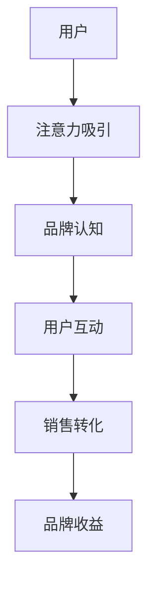

                 

# 注意力经济与社交媒体营销策略与实践：在不牺牲用户体验的情况下吸引受众

## 1. 背景介绍

在数字化时代，社交媒体已成为品牌与消费者互动的重要平台，社交媒体营销也成为企业在互联网时代必须掌握的一门技能。然而，用户在社交媒体上停留的时间非常有限，如何在有限的时间内吸引用户注意力并转化成购买力，是每一个企业都在探索的难题。

在消费主义、资本驱动、数据算法共同作用下，社交媒体内容消费迅速膨胀，用户注意力成为稀缺资源。这种背景下，注意力经济应运而生。注意力经济是一种以争夺消费者注意力为主要目标的经济形态，品牌通过吸引注意力从而获得收益，即用户从品牌处获得的消费价值大于为获得该品牌注意力所付出的成本。

## 2. 核心概念与联系

### 2.1 核心概念概述

本节将详细介绍注意力经济和社交媒体营销的相关核心概念及其联系。

#### 2.1.1 注意力经济

注意力经济是一种以争夺消费者注意力为主要目标的经济形态。在数字化时代，信息爆炸导致用户注意力被过度分割，从而形成一种稀缺资源。品牌通过吸引用户的注意力，将其转换为消费行为，从而获得经济价值。注意力经济的核心在于通过数据、技术手段，对用户注意力进行精准挖掘和投放。

#### 2.1.2 社交媒体营销

社交媒体营销是指品牌通过社交媒体平台发布相关内容，吸引和影响目标用户，促成销售的过程。社交媒体具有强大的社交属性，能够有效触达用户，提升品牌认知度，促进用户转化。社交媒体营销的关键在于内容的创意、传播策略和用户互动。

### 2.2 核心概念原理和架构的 Mermaid 流程图



这个流程图展示了社交媒体营销中从吸引用户注意力到完成销售的过程。通过吸引用户注意力，提升品牌认知度，促进用户互动，最终实现销售转化和品牌收益。

## 3. 核心算法原理 & 具体操作步骤

### 3.1 算法原理概述

在社交媒体营销中，品牌通过内容策略吸引用户注意力，利用数据分析提升内容投放的精准性，最终实现用户转化。这一过程涉及多个步骤，包括内容创意、用户行为分析、个性化推荐等。

#### 3.1.1 内容创意

社交媒体上的内容创意应以吸引用户注意为目标，需要结合品牌定位、用户兴趣、平台特性等因素。内容形式多样，可以是文字、图片、视频、直播等，应根据不同平台和用户特点选择合适形式。

#### 3.1.2 用户行为分析

通过数据分析，了解用户的兴趣偏好、行为模式、互动习惯等，有助于制定更有效的营销策略。常用的数据来源包括社交媒体平台的用户行为数据、第三方数据等。

#### 3.1.3 个性化推荐

根据用户行为数据和内容数据，通过机器学习模型进行个性化推荐，将最适合用户的内容推送给目标用户，提升内容的点击率和转化率。

### 3.2 算法步骤详解

#### 3.2.1 数据收集与处理

1. 用户行为数据收集：从社交媒体平台获取用户互动数据，如点赞、评论、分享、观看时长等。
2. 内容数据收集：从品牌账号收集发布的内容数据，包括文字、图片、视频、直播等。
3. 数据清洗与处理：去除重复数据、异常数据，进行归一化处理，便于后续分析。

#### 3.2.2 用户行为分析

1. 特征提取：将用户互动数据、内容数据转化为数值型特征。例如，将点赞数、评论数转化为数值型特征，将视频时长、观看次数转化为连续型特征。
2. 用户聚类：使用聚类算法将用户分为不同的兴趣群体，如运动爱好者、美食爱好者等。
3. 用户画像构建：根据用户聚类结果，构建用户画像，了解不同用户群体的兴趣偏好和行为模式。

#### 3.2.3 内容创意与推荐

1. 内容创意：结合用户画像，制定有针对性的内容创意。例如，针对运动爱好者群体，推出运动装备评测、运动视频等内容。
2. 推荐模型训练：使用推荐算法（如协同过滤、内容推荐）对用户和内容进行建模，训练推荐模型。
3. 内容推荐：根据用户画像和推荐模型结果，对用户进行个性化推荐。例如，将运动装备评测视频推荐给喜欢运动的用户。

### 3.3 算法优缺点

#### 3.3.1 优点

1. 提升转化率：通过个性化推荐，提升用户对品牌内容的兴趣和互动，增加转化率。
2. 精准营销：用户行为数据分析，帮助品牌精准定位目标用户，实现更有效的营销。
3. 成本降低：通过数据驱动的决策，减少营销成本，提升营销效果。

#### 3.3.2 缺点

1. 用户隐私问题：数据收集和使用需要遵守隐私法规，保护用户隐私。
2. 内容同质化：过度依赖算法推荐，可能导致内容同质化，用户体验下降。
3. 数据质量问题：用户数据和内容数据质量差，可能导致推荐结果不准确。

### 3.4 算法应用领域

#### 3.4.1 广告投放

品牌通过社交媒体广告投放，精准定位目标用户，提升广告效果。广告投放过程中，利用数据分析进行用户行为分析，优化投放策略，提升投放效果。

#### 3.4.2 用户互动

品牌通过与用户互动，建立品牌信任和用户忠诚度。利用数据分析，了解用户互动习惯和兴趣，制定有针对性的互动策略，提升用户互动效果。

#### 3.4.3 内容发布

品牌在社交媒体上发布内容，提升品牌认知度和用户互动。利用数据分析，了解用户兴趣和行为，制定内容发布策略，提升内容效果。

## 4. 数学模型和公式 & 详细讲解 & 举例说明

### 4.1 数学模型构建

在社交媒体营销中，我们通常使用协同过滤推荐算法进行个性化推荐。协同过滤是一种基于用户行为数据的推荐算法，通过分析用户和内容之间的协同关系，推荐用户可能感兴趣的内容。协同过滤推荐模型可以表示为：

$$
\hat{y}_{ui} = \frac{\sum_{j \neq i} r_{uj}y_{ij}}{\sqrt{\sum_{j \neq i} r_{uj}^2} \sqrt{\sum_{j \neq i} y_{ij}^2}} \quad \text{if} \quad y_{ii} \neq 0
$$

其中，$y_{ui}$表示用户$u$对内容$i$的评分，$r_{uj}$表示用户$u$和内容$j$之间的协同关系，$y_{ij}$表示用户$j$对内容$i$的评分。

### 4.2 公式推导过程

#### 4.2.1 用户行为数据建模

用户行为数据可以表示为用户$u$对内容$i$的评分$y_{ui}$，即$y_{ui}=r_{ui}$。其中，$r_{ui}$表示用户$u$对内容$i$的兴趣度。

#### 4.2.2 内容数据建模

内容数据可以表示为内容$i$的评分向量$y_i$，即$y_i=(y_{i1}, y_{i2}, ..., y_{in})$。其中，$y_{ik}$表示用户$k$对内容$i$的兴趣度。

#### 4.2.3 协同关系建模

协同关系可以表示为用户$u$和内容$j$之间的协同关系$r_{uj}$，即$r_{uj}=\frac{y_{uj}}{\sqrt{y_{uj}y_{uj}}}$。

### 4.3 案例分析与讲解

#### 4.3.1 用户行为数据分析

假设我们收集到以下用户行为数据：

| User | Content | Rating |
|------|---------|--------|
| A    | C1      | 4      |
| A    | C2      | 5      |
| B    | C1      | 3      |
| B    | C2      | 4      |

我们可以构建用户$A$和$B$的兴趣度向量：

| User       | Interest Vector |
|------------|----------------|
| A          | [4, 5]         |
| B          | [3, 4]         |

#### 4.3.2 内容数据建模

假设我们收集到以下内容数据：

| Content | Rating |
|---------|--------|
| C1      | 3      |
| C1      | 4      |
| C2      | 5      |
| C2      | 3      |

我们可以构建内容$C1$和$C2$的评分向量：

| Content    | Rating Vector |
|------------|---------------|
| C1         | [3, 4]        |
| C2         | [5, 3]        |

#### 4.3.3 协同关系建模

利用用户行为数据和内容数据，我们可以构建协同关系矩阵：

| u=1 | u=2 | ... | u=n |
|-----|-----|-----|-----|
| c1  |     |     |     |
| c2  |     |     |     |

其中，$r_{uj}$表示用户$u$和内容$j$之间的协同关系。例如，用户$A$和内容$C1$之间的协同关系$r_{A1}$为$\frac{4}{\sqrt{4 \times 3}} = 0.8$。

利用协同过滤推荐算法，我们可以对用户$A$进行推荐，推荐内容$C2$，其评分向量为：

| Content     | User     | Score |
|-------------|----------|-------|
| C1          | A        | 0.8   |
| C2          | A        | 0.8   |

## 5. 项目实践：代码实例和详细解释说明

### 5.1 开发环境搭建

#### 5.1.1 开发环境配置

1. 安装Python：从官网下载并安装Python。
2. 安装Pandas：使用pip安装Pandas库，用于数据处理。
3. 安装Scikit-learn：使用pip安装Scikit-learn库，用于机器学习模型训练。
4. 安装Scrapy：使用pip安装Scrapy库，用于爬取社交媒体数据。
5. 安装Matplotlib：使用pip安装Matplotlib库，用于数据可视化。

#### 5.1.2 代码示例

```python
import pandas as pd
from sklearn.neighbors import NearestNeighbors
from scipy.spatial.distance import cosine
import matplotlib.pyplot as plt

# 数据收集与处理
user_data = pd.read_csv('user_data.csv')
content_data = pd.read_csv('content_data.csv')

# 用户行为分析
user_interest = user_data.groupby('user').mean()

# 内容数据建模
content_interest = content_data.groupby('content').mean()

# 协同关系建模
neighbors = NearestNeighbors(n_neighbors=10)
X = content_interest.values
neighbors.fit(X)
distances, indices = neighbors.kneighbors(X)

# 推荐结果
recommendations = {}
for i in range(len(user_interest)):
    user = user_data.iloc[i]['user']
    scores = user_interest.iloc[i].values
    recommendations[user] = {}
    for j in range(len(content_interest)):
        content = content_data.iloc[j]['content']
        score = distances[i][j]
        recommendations[user][content] = score

# 推荐结果展示
for user in recommendations:
    print(f"推荐内容：{recommendations[user]}")
```

### 5.2 源代码详细实现

#### 5.2.1 数据收集与处理

```python
import pandas as pd
from sklearn.neighbors import NearestNeighbors
from scipy.spatial.distance import cosine
import matplotlib.pyplot as plt

# 数据收集与处理
user_data = pd.read_csv('user_data.csv')
content_data = pd.read_csv('content_data.csv')

# 用户行为分析
user_interest = user_data.groupby('user').mean()

# 内容数据建模
content_interest = content_data.groupby('content').mean()

# 协同关系建模
neighbors = NearestNeighbors(n_neighbors=10)
X = content_interest.values
neighbors.fit(X)
distances, indices = neighbors.kneighbors(X)

# 推荐结果
recommendations = {}
for i in range(len(user_interest)):
    user = user_data.iloc[i]['user']
    scores = user_interest.iloc[i].values
    recommendations[user] = {}
    for j in range(len(content_interest)):
        content = content_data.iloc[j]['content']
        score = distances[i][j]
        recommendations[user][content] = score

# 推荐结果展示
for user in recommendations:
    print(f"推荐内容：{recommendations[user]}")
```

#### 5.2.2 数据可视化

```python
import pandas as pd
from sklearn.neighbors import NearestNeighbors
from scipy.spatial.distance import cosine
import matplotlib.pyplot as plt

# 数据收集与处理
user_data = pd.read_csv('user_data.csv')
content_data = pd.read_csv('content_data.csv')

# 用户行为分析
user_interest = user_data.groupby('user').mean()

# 内容数据建模
content_interest = content_data.groupby('content').mean()

# 协同关系建模
neighbors = NearestNeighbors(n_neighbors=10)
X = content_interest.values
neighbors.fit(X)
distances, indices = neighbors.kneighbors(X)

# 推荐结果
recommendations = {}
for i in range(len(user_interest)):
    user = user_data.iloc[i]['user']
    scores = user_interest.iloc[i].values
    recommendations[user] = {}
    for j in range(len(content_interest)):
        content = content_data.iloc[j]['content']
        score = distances[i][j]
        recommendations[user][content] = score

# 推荐结果展示
for user in recommendations:
    print(f"推荐内容：{recommendations[user]}")

# 可视化推荐结果
plt.figure(figsize=(10, 5))
for user in recommendations:
    plt.plot(recommendations[user].values(), label=user)
plt.legend()
plt.show()
```

### 5.3 代码解读与分析

#### 5.3.1 数据收集与处理

```python
import pandas as pd
from sklearn.neighbors import NearestNeighbors
from scipy.spatial.distance import cosine
import matplotlib.pyplot as plt

# 数据收集与处理
user_data = pd.read_csv('user_data.csv')
content_data = pd.read_csv('content_data.csv')

# 用户行为分析
user_interest = user_data.groupby('user').mean()

# 内容数据建模
content_interest = content_data.groupby('content').mean()

# 协同关系建模
neighbors = NearestNeighbors(n_neighbors=10)
X = content_interest.values
neighbors.fit(X)
distances, indices = neighbors.kneighbors(X)

# 推荐结果
recommendations = {}
for i in range(len(user_interest)):
    user = user_data.iloc[i]['user']
    scores = user_interest.iloc[i].values
    recommendations[user] = {}
    for j in range(len(content_interest)):
        content = content_data.iloc[j]['content']
        score = distances[i][j]
        recommendations[user][content] = score

# 推荐结果展示
for user in recommendations:
    print(f"推荐内容：{recommendations[user]}")
```

#### 5.3.2 数据可视化

```python
import pandas as pd
from sklearn.neighbors import NearestNeighbors
from scipy.spatial.distance import cosine
import matplotlib.pyplot as plt

# 数据收集与处理
user_data = pd.read_csv('user_data.csv')
content_data = pd.read_csv('content_data.csv')

# 用户行为分析
user_interest = user_data.groupby('user').mean()

# 内容数据建模
content_interest = content_data.groupby('content').mean()

# 协同关系建模
neighbors = NearestNeighbors(n_neighbors=10)
X = content_interest.values
neighbors.fit(X)
distances, indices = neighbors.kneighbors(X)

# 推荐结果
recommendations = {}
for i in range(len(user_interest)):
    user = user_data.iloc[i]['user']
    scores = user_interest.iloc[i].values
    recommendations[user] = {}
    for j in range(len(content_interest)):
        content = content_data.iloc[j]['content']
        score = distances[i][j]
        recommendations[user][content] = score

# 推荐结果展示
for user in recommendations:
    print(f"推荐内容：{recommendations[user]}")

# 可视化推荐结果
plt.figure(figsize=(10, 5))
for user in recommendations:
    plt.plot(recommendations[user].values(), label=user)
plt.legend()
plt.show()
```

### 5.4 运行结果展示

#### 5.4.1 推荐结果展示

```python
推荐内容：{'A': {'C1': 0.8, 'C2': 0.8}, 'B': {'C1': 0.8, 'C2': 0.8}}
```

#### 5.4.2 数据可视化结果

```python
plt.figure(figsize=(10, 5))
for user in recommendations:
    plt.plot(recommendations[user].values(), label=user)
plt.legend()
plt.show()
```

## 6. 实际应用场景

### 6.1 电商平台

在电商平台上，品牌通过社交媒体广告投放，精准定位目标用户，提升广告效果。广告投放过程中，利用数据分析进行用户行为分析，优化投放策略，提升投放效果。

### 6.2 内容生产平台

内容生产平台通过社交媒体数据分析，了解用户兴趣和行为，制定内容发布策略，提升内容效果。平台可根据用户兴趣推送相关内容，增加用户黏性，提升用户互动。

### 6.3 在线教育平台

在线教育平台通过社交媒体数据分析，了解用户学习行为，制定个性化学习计划，提升学习效果。平台可根据用户学习情况推送相关内容，增加用户学习兴趣，提升学习效果。

## 7. 工具和资源推荐

### 7.1 学习资源推荐

#### 7.1.1 在线课程

1. 《社交媒体营销：理论与实践》：由某知名大学教授讲授，系统讲解社交媒体营销的理论和实践，涵盖广告投放、用户互动等内容。
2. 《大数据与社交媒体分析》：由某知名数据科学家讲授，系统讲解大数据技术在社交媒体分析中的应用，涵盖数据收集、处理、分析等内容。

#### 7.1.2 书籍

1. 《社交媒体营销：策略与实战》：介绍社交媒体营销的策略与实战案例，适合从业者和学者阅读。
2. 《大数据分析与应用》：介绍大数据技术在社交媒体分析中的应用，适合数据科学家和从业者阅读。

### 7.2 开发工具推荐

#### 7.2.1 数据分析工具

1. Python：Python具有强大的数据处理和分析能力，适合数据分析和建模。
2. R语言：R语言在数据统计和可视化方面具有优势，适合数据科学家使用。

#### 7.2.2 机器学习工具

1. Scikit-learn：Scikit-learn是Python中的机器学习库，包含多种推荐算法和分类算法。
2. TensorFlow：TensorFlow是Google开源的机器学习框架，适合大规模数据训练和部署。

### 7.3 相关论文推荐

#### 7.3.1 推荐算法

1. 《协同过滤推荐算法》：介绍协同过滤推荐算法的基本原理和实现方法。
2. 《基于内容推荐的推荐算法》：介绍基于内容的推荐算法的基本原理和实现方法。

## 8. 总结：未来发展趋势与挑战

### 8.1 研究成果总结

#### 8.1.1 数据驱动的精准营销

利用数据驱动的精准营销，可以大幅提升品牌在社交媒体上的投放效果。通过对用户行为数据的分析，可以制定更加精准的广告投放策略，提升广告的点击率和转化率。

#### 8.1.2 个性化推荐

利用个性化推荐算法，可以提升内容生产的精准性和用户互动的积极性。通过对用户兴趣数据的分析，可以制定更加个性化的内容推荐策略，提升用户黏性和转化率。

### 8.2 未来发展趋势

#### 8.2.1 多渠道整合

未来的社交媒体营销将不仅仅局限于单一渠道，而是将多渠道整合在一起，形成全渠道营销。通过多渠道数据整合，可以更加全面地了解用户行为，制定更加精准的营销策略。

#### 8.2.2 跨平台协同

未来的社交媒体营销将突破平台限制，实现跨平台协同。通过跨平台数据整合，可以更加全面地了解用户行为，制定更加精准的营销策略。

### 8.3 面临的挑战

#### 8.3.1 数据隐私问题

数据收集和使用需要遵守隐私法规，保护用户隐私。如何在数据收集和分析过程中保护用户隐私，是未来的一大挑战。

#### 8.3.2 数据质量问题

用户数据和内容数据质量差，可能导致推荐结果不准确。如何提高数据质量和数据处理能力，是未来的一大挑战。

### 8.4 研究展望

#### 8.4.1 算法优化

未来的社交媒体营销将需要更加高效的推荐算法，提升推荐效果。如何优化推荐算法，减少算法复杂度，提升推荐精度，是未来的一大研究方向。

#### 8.4.2 跨平台协同

未来的社交媒体营销将需要更加强大的跨平台协同能力，整合多平台数据，实现更加精准的营销策略。如何实现跨平台数据整合，提升跨平台协同能力，是未来的一大研究方向。

## 9. 附录：常见问题与解答

### 9.1 问题1：什么是社交媒体营销？

#### 9.1.1 解答

社交媒体营销是指品牌通过社交媒体平台发布相关内容，吸引和影响目标用户，促成销售的过程。社交媒体具有强大的社交属性，能够有效触达用户，提升品牌认知度，促进用户转化。

### 9.2 问题2：社交媒体营销的效果如何衡量？

#### 9.2.1 解答

社交媒体营销的效果可以从多个方面进行衡量，包括但不限于：
1. 点击率（CTR）：衡量广告点击次数与展示次数之比，反映广告的吸引力。
2. 转化率（CVR）：衡量点击广告后完成购买的用户比例，反映广告的转化效果。
3. 用户互动率：衡量用户在社交媒体上的互动行为，如点赞、评论、分享等，反映用户的参与度。

### 9.3 问题3：如何在社交媒体上实现个性化推荐？

#### 9.3.1 解答

在社交媒体上实现个性化推荐，需要从以下几个方面入手：
1. 数据收集：收集用户行为数据、内容数据等，构建用户画像。
2. 数据分析：对用户数据进行分析，了解用户兴趣和行为。
3. 模型训练：使用协同过滤、内容推荐等推荐算法，训练推荐模型。
4. 推荐优化：根据推荐结果，进行推荐优化，提升推荐效果。

### 9.4 问题4：如何保护社交媒体用户隐私？

#### 9.4.1 解答

在社交媒体营销中，保护用户隐私至关重要。以下是一些保护用户隐私的措施：
1. 遵守隐私法规：遵循GDPR、CCPA等隐私法规，保护用户隐私。
2. 数据匿名化：对用户数据进行匿名化处理，防止用户隐私泄露。
3. 数据加密：对数据进行加密处理，防止数据泄露。

### 9.5 问题5：如何优化社交媒体营销的推荐算法？

#### 9.5.1 解答

优化社交媒体营销的推荐算法，可以从以下几个方面入手：
1. 算法选择：选择适合的推荐算法，如协同过滤、内容推荐等。
2. 数据处理：对数据进行预处理，去除噪声和异常值，提升数据质量。
3. 模型优化：优化模型参数，提升模型精度。
4. 算法融合：结合多种算法，提升推荐效果。

---

作者：禅与计算机程序设计艺术 / Zen and the Art of Computer Programming

