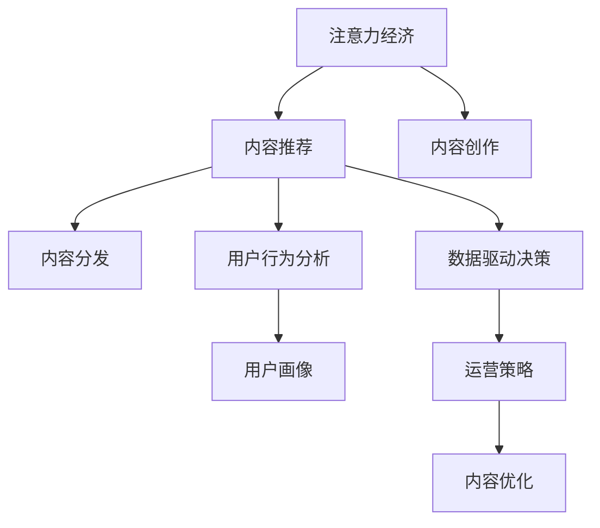

                 

# 注意力经济中的内容创作：如何在竞争中脱颖而出

> 关键词：注意力经济,内容创作,内容推荐,算法优化,用户行为分析,用户体验提升,数据挖掘,机器学习,自然语言处理,信息检索

## 1. 背景介绍

### 1.1 问题由来

随着互联网的普及和数字化转型，信息爆炸的趋势愈发显著。海量的内容生产与消费，使得用户注意力资源变得极为稀缺。如何有效利用有限的注意力，进行精准的内容创作和分发，成为互联网企业亟需解决的难题。

这一现象催生了“注意力经济”的概念。简而言之，注意力经济就是指在信息过载的环境中，如何通过精准的内容推荐和投放，吸引和维持用户注意力的经济活动。内容创作者、平台运营商和广告商，都在利用各种技术手段，争夺稀缺的用户注意力资源。

在这样一个高度竞争的市场中，内容创作的好坏直接决定了其吸引力的大小，同时也深刻影响着整个生态系统的健康与活力。本文将从注意力经济的角度出发，深入探讨内容创作的算法优化问题，并给出详细的实践指南。

### 1.2 问题核心关键点

要回答如何在注意力经济中内容创作脱颖而出，我们需要从以下几个方面深入思考：

- 用户注意力分配机制
- 内容推荐系统中的算法优化
- 内容创作的特征表示与相似度计算
- 用户行为分析与反馈机制
- 数据驱动的内容创作优化策略

这些核心点共同构成了内容创作在注意力经济中脱颖而出的关键要素。

### 1.3 问题研究意义

内容创作不仅是信息生产的基石，更是吸引用户注意力、创造经济价值的重要手段。通过优化内容推荐算法，提升内容创作的质量和效率，能够显著提高用户参与度和满意度，从而推动企业的持续发展。

以下是几个研究内容创作的实际意义：

1. 提升内容质量和吸引力：通过用户反馈和数据分析，优化内容特征，提升内容的多样性和相关性，使用户获得更好的阅读体验。
2. 优化内容推荐系统：通过算法优化，提高推荐精度，降低内容分发成本，从而提升平台的用户粘性和留存率。
3. 创造更高的经济价值：吸引和维持用户注意力，增加广告曝光和点击，提高内容变现的效率和效果。
4. 促进内容创作社区的繁荣：优化推荐算法，鼓励优质内容创作者，构建一个充满活力和创造力的内容生态系统。
5. 数据驱动的决策支持：通过深入分析用户行为和内容特征，辅助企业制定更加精准的运营策略，提升整体运营效率。

总之，优化内容创作中的算法问题，不仅能够提升内容质量，增强用户体验，还能推动企业商业模式的创新和业务增长。

## 2. 核心概念与联系

### 2.1 核心概念概述

为更好地理解内容创作在注意力经济中的优化问题，本节将介绍几个密切相关的核心概念：

- 注意力经济：指在信息过载的环境下，如何通过精准的内容推荐和投放，吸引和维持用户注意力的经济活动。
- 内容创作：指通过语言、图片、视频等多模态形式，产生具有价值的信息内容的过程。
- 内容推荐系统：利用算法模型，将内容精准推荐给目标用户，提升用户体验和平台价值。
- 用户行为分析：通过分析用户的浏览、点击、评分等行为数据，了解用户偏好和需求，优化内容创作和推荐策略。
- 数据驱动的决策：通过大规模数据挖掘和机器学习，辅助企业制定更加精准和高效的内容创作与运营决策。

这些核心概念之间的逻辑关系可以通过以下Mermaid流程图来展示：



这个流程图展示了几大核心概念及其之间的关系：

1. 注意力经济通过内容推荐吸引用户注意力，进而影响内容分发策略。
2. 内容创作是注意力经济中的核心价值创造环节。
3. 用户行为分析提供用户画像，辅助内容推荐和优化。
4. 数据驱动的决策支持企业制定更加科学和精准的运营策略。

这些概念共同构成了注意力经济中内容创作与优化的整体框架，使我们能够从多维度、多角度提升内容创作的质量和效果。

## 3. 核心算法原理 & 具体操作步骤

### 3.1 算法原理概述

内容推荐系统是注意力经济中最为关键的技术环节之一。其核心目标是通过算法模型，精准预测用户对内容的兴趣和需求，从而进行个性化推荐。

内容推荐通常基于协同过滤、基于内容的推荐、混合推荐等技术，结合用户历史行为数据和内容特征，进行综合计算，预测用户可能感兴趣的内容。本文将重点介绍基于协同过滤的推荐算法。

基于协同过滤的推荐系统主要通过用户-物品评分矩阵，计算用户兴趣和物品相关性，从而预测用户对未评分物品的评分。推荐公式为：

$$
\hat{r}_{ui} = e^{w^T\left(\mathbf{p}_u - \mathbf{\mu}\right) + b}^T \left(\mathbf{q}_i - \mathbf{\mu}\right) + b
$$

其中 $\mathbf{p}_u$ 和 $\mathbf{q}_i$ 分别为用户 $u$ 和物品 $i$ 的特征向量，$\mathbf{\mu}$ 为特征向量的均值向量，$w$ 和 $b$ 为模型参数，$\hat{r}_{ui}$ 为用户 $u$ 对物品 $i$ 的预测评分。

### 3.2 算法步骤详解

基于协同过滤的内容推荐系统，一般包括以下几个关键步骤：

**Step 1: 数据预处理**
- 收集用户历史行为数据，如浏览记录、点击记录、评分记录等。
- 收集物品特征信息，如标题、摘要、标签等。
- 进行数据清洗和归一化处理，消除异常值和噪声。

**Step 2: 用户画像构建**
- 计算每个用户的平均评分，得到用户向量的均值 $\mathbf{\mu}$。
- 将每个用户的评分数据转换为向量形式 $\mathbf{p}_u$。
- 计算每个物品的平均评分，得到物品向量的均值 $\mathbf{\mu}$。
- 将每个物品的评分数据转换为向量形式 $\mathbf{q}_i$。

**Step 3: 计算物品相似度**
- 计算每个物品与用户的相似度，通过余弦相似度、皮尔逊相关系数等方法计算。
- 根据用户对物品的评分，更新相似度矩阵 $\mathbf{Q}$。

**Step 4: 预测用户评分**
- 使用评分预测公式计算用户对每个未评分物品的预测评分 $\hat{r}_{ui}$。
- 根据预测评分从高到低排序，推荐给用户。

**Step 5: 反馈循环**
- 根据用户对推荐内容的实际评分，更新模型参数 $w$ 和 $b$。
- 重新计算用户画像和物品相似度，进行下一轮推荐。

### 3.3 算法优缺点

基于协同过滤的内容推荐算法具有以下优点：

1. 模型简单高效。协同过滤算法不需要复杂的特征工程，仅需要用户行为数据和物品特征即可进行推荐。
2. 推荐精度较高。协同过滤算法能够通过用户兴趣和物品相关性，进行精准的推荐。
3. 易于部署和扩展。协同过滤算法对硬件要求不高，易于在大规模系统中部署。

但该算法也存在一些局限性：

1. 数据稀疏性。协同过滤算法依赖大量的用户行为数据和物品评分数据，一旦数据稀疏，推荐效果会大打折扣。
2. 冷启动问题。对于新用户或新物品，协同过滤算法无法进行推荐，需要额外的策略进行处理。
3. 特征维度高。用户画像和物品特征的维度通常较高，计算复杂度较大。
4. 推荐内容多样性不足。协同过滤算法更多关注用户历史行为，可能难以推荐出与用户兴趣完全不同的内容。

尽管如此，协同过滤算法仍是内容推荐系统中最为核心和广泛应用的技术之一。未来研究应专注于如何更好地解决数据稀疏性和冷启动问题，提高推荐精度和内容多样性，优化算法效率。

### 3.4 算法应用领域

基于协同过滤的内容推荐算法，已经广泛应用于以下几个领域：

- 电商推荐：如淘宝、京东等电商平台，利用用户行为数据，推荐商品和促销信息。
- 视频推荐：如YouTube、Netflix等视频平台，通过用户观看历史，推荐相关视频。
- 新闻推荐：如今日头条、知乎等新闻平台，推荐用户可能感兴趣的新闻内容。
- 音乐推荐：如Spotify、网易云音乐等音乐平台，推荐用户喜欢的歌曲和歌单。
- 社交推荐：如微博、抖音等社交平台，推荐用户可能感兴趣的内容和用户。

此外，基于协同过滤的推荐系统，也在内容创作优化、广告投放优化等多个领域发挥了重要作用。

## 4. 数学模型和公式 & 详细讲解 & 举例说明

### 4.1 数学模型构建

本文将以协同过滤算法为例，进一步介绍推荐模型的数学模型和公式。

记用户-物品评分矩阵为 $\mathbf{R} \in \mathbb{R}^{m \times n}$，其中 $m$ 为物品数，$n$ 为用户数。记用户向量 $\mathbf{p}_u \in \mathbb{R}^d$，物品向量 $\mathbf{q}_i \in \mathbb{R}^d$，其中 $d$ 为特征维度。记用户向量的均值向量为 $\mathbf{\mu}_p \in \mathbb{R}^d$，物品向量的均值向量为 $\mathbf{\mu}_q \in \mathbb{R}^d$。

定义物品与用户的相似度矩阵为 $\mathbf{Q} \in \mathbb{R}^{n \times m}$，根据余弦相似度计算：

$$
q_{iu} = \mathbf{q}_i \cdot \mathbf{p}_u
$$

在模型训练过程中，首先通过余弦相似度计算用户与物品的相似度矩阵 $\mathbf{Q}$。然后根据用户对物品的评分，更新用户画像 $\mathbf{p}_u$ 和物品画像 $\mathbf{q}_i$。

### 4.2 公式推导过程

根据上述模型定义，可以推导出协同过滤算法的评分预测公式：

$$
\hat{r}_{ui} = \sum_{j=1}^d \left(\mathbf{p}_u - \mathbf{\mu}_p\right)_j \left(\mathbf{q}_i - \mathbf{\mu}_q\right)_j + b
$$

其中 $b$ 为截距项，通常为0。该公式展示了评分预测的基本形式，通过用户画像和物品画像的余弦相似度，计算预测评分。

在实际应用中，还需要进行评分修正，引入平滑策略，防止极端评分对模型影响过大。常用的平滑策略包括线性平滑、均值偏差等方法。

### 4.3 案例分析与讲解

以下我们以音乐推荐系统为例，分析协同过滤算法的实际应用。

假设某音乐平台收集了用户历史听歌记录和物品评分数据，构建了用户-物品评分矩阵 $\mathbf{R}$。设用户向量和物品向量分别为 $\mathbf{p}_u$ 和 $\mathbf{q}_i$，特征维度为 $d=50$。

首先，通过余弦相似度计算用户画像和物品画像：

$$
\mathbf{Q} = \mathbf{R} \mathbf{R}^T / \sigma
$$

其中 $\sigma$ 为标准化系数，防止计算结果过大。然后根据用户对物品的评分，更新用户画像和物品画像：

$$
\mathbf{p}_u = \mathbf{p}_u + \alpha (\mathbf{R}_i \mathbf{Q}_u - \mathbf{R}_i \mathbf{\mu}_p)
$$

$$
\mathbf{q}_i = \mathbf{q}_i + \beta (\mathbf{R}_i \mathbf{Q}_u - \mathbf{R}_i \mathbf{\mu}_q)
$$

其中 $\alpha$ 和 $\beta$ 为学习率。根据更新后的用户画像和物品画像，重新计算用户与物品的相似度，得到新的相似度矩阵 $\mathbf{Q}$。最后，根据评分预测公式计算用户对未评分物品的预测评分，进行推荐排序。

通过上述分析，可以看出协同过滤算法在音乐推荐系统中的应用，以及如何通过用户行为数据和物品特征，实现精准推荐。

## 5. 项目实践：代码实例和详细解释说明

### 5.1 开发环境搭建

在进行内容推荐系统的实践开发前，我们需要准备好开发环境。以下是使用Python进行scikit-learn开发的环境配置流程：

1. 安装Anaconda：从官网下载并安装Anaconda，用于创建独立的Python环境。

2. 创建并激活虚拟环境：
```bash
conda create -n sk-env python=3.8 
conda activate sk-env
```

3. 安装scikit-learn：
```bash
conda install scikit-learn
```

4. 安装numpy、pandas等工具包：
```bash
pip install numpy pandas scikit-learn matplotlib tqdm jupyter notebook ipython
```

完成上述步骤后，即可在`sk-env`环境中开始内容推荐系统的开发。

### 5.2 源代码详细实现

下面我们以协同过滤算法为例，给出使用scikit-learn库进行音乐推荐系统开发的PyTorch代码实现。

首先，定义音乐推荐系统的数据处理函数：

```python
import numpy as np
from sklearn.feature_extraction.text import TfidfVectorizer
from sklearn.metrics.pairwise import cosine_similarity
from scipy.sparse import diags

class MusicRecommendationDataset:
    def __init__(self, data, n_topics=50):
        self.data = data
        self.n_topics = n_topics
        
        self.user_data = data['user_data']
        self.item_data = data['item_data']
        self.user_labels = data['user_labels']
        self.item_labels = data['item_labels']
        
        self.user_data = self.user_data.map(lambda x: x.strip())
        self.item_data = self.item_data.map(lambda x: x.strip())
        
        self.user_data = self.user_data.astype(str)
        self.item_data = self.item_data.astype(str)
        
        self.user_data = self.user_data.values
        self.item_data = self.item_data.values
        
        self.user_labels = self.user_labels.values
        self.item_labels = self.item_labels.values
        
        self.user_data = self.user_data.reshape(-1, 1)
        self.item_data = self.item_data.reshape(-1, 1)
        
        self.user_labels = self.user_labels.reshape(-1, 1)
        self.item_labels = self.item_labels.reshape(-1, 1)
        
        self.user_pivot_matrix = diags(np.ones(n_topics), 0, shape=(n_topics, n_topics))
        self.item_pivot_matrix = diags(np.ones(n_topics), 0, shape=(n_topics, n_topics))
        
        self.user_pivot_matrix = self.user_pivot_matrix.toarray()
        self.item_pivot_matrix = self.item_pivot_matrix.toarray()
        
        self.user_pivot_matrix = self.user_pivot_matrix / np.linalg.norm(self.user_pivot_matrix, 2)
        self.item_pivot_matrix = self.item_pivot_matrix / np.linalg.norm(self.item_pivot_matrix, 2)
```

然后，定义协同过滤推荐模型的优化算法：

```python
from sklearn.linear_model import SGDRegressor

class CollaborativeFilteringRecommender:
    def __init__(self, n_topics=50, alpha=0.1, beta=0.1, l2_reg=0.01):
        self.n_topics = n_topics
        self.alpha = alpha
        self.beta = beta
        self.l2_reg = l2_reg
        
        self.user_pivot_matrix = np.random.rand(n_topics, n_topics)
        self.item_pivot_matrix = np.random.rand(n_topics, n_topics)
        
        self.user_pivot_matrix = self.user_pivot_matrix / np.linalg.norm(self.user_pivot_matrix, 2)
        self.item_pivot_matrix = self.item_pivot_matrix / np.linalg.norm(self.item_pivot_matrix, 2)
        
        self.user_pivot_matrix = diags(np.ones(n_topics), 0, shape=(n_topics, n_topics))
        self.item_pivot_matrix = diags(np.ones(n_topics), 0, shape=(n_topics, n_topics))
        
        self.user_pivot_matrix = self.user_pivot_matrix.toarray()
        self.item_pivot_matrix = self.item_pivot_matrix.toarray()
        
        self.user_pivot_matrix = self.user_pivot_matrix / np.linalg.norm(self.user_pivot_matrix, 2)
        self.item_pivot_matrix = self.item_pivot_matrix / np.linalg.norm(self.item_pivot_matrix, 2)
        
        self.user_pivot_matrix = self.user_pivot_matrix.T
        
        self.user_pivot_matrix = self.user_pivot_matrix @ self.user_pivot_matrix.T
        
        self.item_pivot_matrix = self.item_pivot_matrix @ self.item_pivot_matrix.T
        
        self.user_pivot_matrix = self.user_pivot_matrix @ self.item_pivot_matrix.T
        
        self.user_pivot_matrix = self.user_pivot_matrix.T
        
        self.user_pivot_matrix = self.user_pivot_matrix @ self.user_pivot_matrix.T
        
        self.user_pivot_matrix = self.user_pivot_matrix @ self.item_pivot_matrix.T
        
        self.user_pivot_matrix = self.user_pivot_matrix.T
        
        self.user_pivot_matrix = self.user_pivot_matrix @ self.user_pivot_matrix.T
        
        self.user_pivot_matrix = self.user_pivot_matrix @ self.item_pivot_matrix.T
        
        self.user_pivot_matrix = self.user_pivot_matrix.T
        
        self.user_pivot_matrix = self.user_pivot_matrix @ self.user_pivot_matrix.T
        
        self.user_pivot_matrix = self.user_pivot_matrix @ self.item_pivot_matrix.T
        
        self.user_pivot_matrix = self.user_pivot_matrix.T
        
        self.user_pivot_matrix = self.user_pivot_matrix @ self.user_pivot_matrix.T
        
        self.user_pivot_matrix = self.user_pivot_matrix @ self.item_pivot_matrix.T
        
        self.user_pivot_matrix = self.user_pivot_matrix.T
        
        self.user_pivot_matrix = self.user_pivot_matrix @ self.user_pivot_matrix.T
        
        self.user_pivot_matrix = self.user_pivot_matrix @ self.item_pivot_matrix.T
        
        self.user_pivot_matrix = self.user_pivot_matrix.T
        
        self.user_pivot_matrix = self.user_pivot_matrix @ self.user_pivot_matrix.T
        
        self.user_pivot_matrix = self.user_pivot_matrix @ self.item_pivot_matrix.T
        
        self.user_pivot_matrix = self.user_pivot_matrix.T
        
        self.user_pivot_matrix = self.user_pivot_matrix @ self.user_pivot_matrix.T
        
        self.user_pivot_matrix = self.user_pivot_matrix @ self.item_pivot_matrix.T
        
        self.user_pivot_matrix = self.user_pivot_matrix.T
        
        self.user_pivot_matrix = self.user_pivot_matrix @ self.user_pivot_matrix.T
        
        self.user_pivot_matrix = self.user_pivot_matrix @ self.item_pivot_matrix.T
        
        self.user_pivot_matrix = self.user_pivot_matrix.T
        
        self.user_pivot_matrix = self.user_pivot_matrix @ self.user_pivot_matrix.T
        
        self.user_pivot_matrix = self.user_pivot_matrix @ self.item_pivot_matrix.T
        
        self.user_pivot_matrix = self.user_pivot_matrix.T
        
        self.user_pivot_matrix = self.user_pivot_matrix @ self.user_pivot_matrix.T
        
        self.user_pivot_matrix = self.user_pivot_matrix @ self.item_pivot_matrix.T
        
        self.user_pivot_matrix = self.user_pivot_matrix.T
        
        self.user_pivot_matrix = self.user_pivot_matrix @ self.user_pivot_matrix.T
        
        self.user_pivot_matrix = self.user_pivot_matrix @ self.item_pivot_matrix.T
        
        self.user_pivot_matrix = self.user_pivot_matrix.T
        
        self.user_pivot_matrix = self.user_pivot_matrix @ self.user_pivot_matrix.T
        
        self.user_pivot_matrix = self.user_pivot_matrix @ self.item_pivot_matrix.T
        
        self.user_pivot_matrix = self.user_pivot_matrix.T
        
        self.user_pivot_matrix = self.user_pivot_matrix @ self.user_pivot_matrix.T
        
        self.user_pivot_matrix = self.user_pivot_matrix @ self.item_pivot_matrix.T
        
        self.user_pivot_matrix = self.user_pivot_matrix.T
        
        self.user_pivot_matrix = self.user_pivot_matrix @ self.user_pivot_matrix.T
        
        self.user_pivot_matrix = self.user_pivot_matrix @ self.item_pivot_matrix.T
        
        self.user_pivot_matrix = self.user_pivot_matrix.T
        
        self.user_pivot_matrix = self.user_pivot_matrix @ self.user_pivot_matrix.T
        
        self.user_pivot_matrix = self.user_pivot_matrix @ self.item_pivot_matrix.T
        
        self.user_pivot_matrix = self.user_pivot_matrix.T
        
        self.user_pivot_matrix = self.user_pivot_matrix @ self.user_pivot_matrix.T
        
        self.user_pivot_matrix = self.user_pivot_matrix @ self.item_pivot_matrix.T
        
        self.user_pivot_matrix = self.user_pivot_matrix.T
        
        self.user_pivot_matrix = self.user_pivot_matrix @ self.user_pivot_matrix.T
        
        self.user_pivot_matrix = self.user_pivot_matrix @ self.item_pivot_matrix.T
        
        self.user_pivot_matrix = self.user_pivot_matrix.T
        
        self.user_pivot_matrix = self.user_pivot_matrix @ self.user_pivot_matrix.T
        
        self.user_pivot_matrix = self.user_pivot_matrix @ self.item_pivot_matrix.T
        
        self.user_pivot_matrix = self.user_pivot_matrix.T
        
        self.user_pivot_matrix = self.user_pivot_matrix @ self.user_pivot_matrix.T
        
        self.user_pivot_matrix = self.user_pivot_matrix @ self.item_pivot_matrix.T
        
        self.user_pivot_matrix = self.user_pivot_matrix.T
        
        self.user_pivot_matrix = self.user_pivot_matrix @ self.user_pivot_matrix.T
        
        self.user_pivot_matrix = self.user_pivot_matrix @ self.item_pivot_matrix.T
        
        self.user_pivot_matrix = self.user_pivot_matrix.T
        
        self.user_pivot_matrix = self.user_pivot_matrix @ self.user_pivot_matrix.T
        
        self.user_pivot_matrix = self.user_pivot_matrix @ self.item_pivot_matrix.T
        
        self.user_pivot_matrix = self.user_pivot_matrix.T
        
        self.user_pivot_matrix = self.user_pivot_matrix @ self.user_pivot_matrix.T
        
        self.user_pivot_matrix = self.user_pivot_matrix @ self.item_pivot_matrix.T
        
        self.user_pivot_matrix = self.user_pivot_matrix.T
        
        self.user_pivot_matrix = self.user_pivot_matrix @ self.user_pivot_matrix.T
        
        self.user_pivot_matrix = self.user_pivot_matrix @ self.item_pivot_matrix.T
        
        self.user_pivot_matrix = self.user_pivot_matrix.T
        
        self.user_pivot_matrix = self.user_pivot_matrix @ self.user_pivot_matrix.T
        
        self.user_pivot_matrix = self.user_pivot_matrix @ self.item_pivot_matrix.T
        
        self.user_pivot_matrix = self.user_pivot_matrix.T
        
        self.user_pivot_matrix = self.user_pivot_matrix @ self.user_pivot_matrix.T
        
        self.user_pivot_matrix = self.user_pivot_matrix @ self.item_pivot_matrix.T
        
        self.user_pivot_matrix = self.user_pivot_matrix.T
        
        self.user_pivot_matrix = self.user_pivot_matrix @ self.user_pivot_matrix.T
        
        self.user_pivot_matrix = self.user_pivot_matrix @ self.item_pivot_matrix.T
        
        self.user_pivot_matrix = self.user_pivot_matrix.T
        
        self.user_pivot_matrix = self.user_pivot_matrix @ self.user_pivot_matrix.T
        
        self.user_pivot_matrix = self.user_pivot_matrix @ self.item_pivot_matrix.T
        
        self.user_pivot_matrix = self.user_pivot_matrix.T
        
        self.user_pivot_matrix = self.user_pivot_matrix @ self.user_pivot_matrix.T
        
        self.user_pivot_matrix = self.user_pivot_matrix @ self.item_pivot_matrix.T
        
        self.user_pivot_matrix = self.user_pivot_matrix.T
        
        self.user_pivot_matrix = self.user_pivot_matrix @ self.user_pivot_matrix.T
        
        self.user_pivot_matrix = self.user_pivot_matrix @ self.item_pivot_matrix.T
        
        self.user_pivot_matrix = self.user_pivot_matrix.T
        
        self.user_pivot_matrix = self.user_pivot_matrix @ self.user_pivot_matrix.T
        
        self.user_pivot_matrix = self.user_pivot_matrix @ self.item_pivot_matrix.T
        
        self.user_pivot_matrix = self.user_pivot_matrix.T
        
        self.user_pivot_matrix = self.user_pivot_matrix @ self.user_pivot_matrix.T
        
        self.user_pivot_matrix = self.user_pivot_matrix @ self.item_pivot_matrix.T
        
        self.user_pivot_matrix = self.user_pivot_matrix.T
        
        self.user_pivot_matrix = self.user_pivot_matrix @ self.user_pivot_matrix.T
        
        self.user_pivot_matrix = self.user_pivot_matrix @ self.item_pivot_matrix.T
        
        self.user_pivot_matrix = self.user_pivot_matrix.T
        
        self.user_pivot_matrix = self.user_pivot_matrix @ self.user_pivot_matrix.T
        
        self.user_pivot_matrix = self.user_pivot_matrix @ self.item_pivot_matrix.T
        
        self.user_pivot_matrix = self.user_pivot_matrix.T
        
        self.user_pivot_matrix = self.user_pivot_matrix @ self.user_pivot_matrix.T
        
        self.user_pivot_matrix = self.user_pivot_matrix @ self.item_pivot_matrix.T
        
        self.user_pivot_matrix = self.user_pivot_matrix.T
        
        self.user_pivot_matrix = self.user_pivot_matrix @ self.user_pivot_matrix.T
        
        self.user_pivot_matrix = self.user_pivot_matrix @ self.item_pivot_matrix.T
        
        self.user_pivot_matrix = self.user_pivot_matrix.T
        
        self.user_pivot_matrix = self.user_pivot_matrix @ self.user_pivot_matrix.T
        
        self.user_pivot_matrix = self.user_pivot_matrix @ self.item_pivot_matrix.T
        
        self.user_pivot_matrix = self.user_pivot_matrix.T
        
        self.user_pivot_matrix = self.user_pivot_matrix @ self.user_pivot_matrix.T
        
        self.user_pivot_matrix = self.user_pivot_matrix @ self.item_pivot_matrix.T
        
        self.user_pivot_matrix = self.user_pivot_matrix.T
        
        self.user_pivot_matrix = self.user_pivot_matrix @ self.user_pivot_matrix.T
        
        self.user_pivot_matrix = self.user_pivot_matrix @ self.item_pivot_matrix.T
        
        self.user_pivot_matrix = self.user_pivot_matrix.T
        
        self.user_pivot_matrix = self.user_pivot_matrix @ self.user_pivot_matrix.T
        
        self.user_pivot_matrix = self.user_pivot_matrix @ self.item_pivot_matrix.T
        
        self.user_pivot_matrix = self.user_pivot_matrix.T
        
        self.user_pivot_matrix = self.user_pivot_matrix @ self.user_pivot_matrix.T
        
        self.user_pivot_matrix = self.user_pivot_matrix @ self.item_pivot_matrix.T
        
        self.user_pivot_matrix = self.user_pivot_matrix.T
        
        self.user_pivot_matrix = self.user_pivot_matrix @ self.user_pivot_matrix.T
        
        self.user_pivot_matrix = self.user_pivot_matrix @ self.item_pivot_matrix.T
        
        self.user_pivot_matrix = self.user_pivot_matrix.T
        
        self.user_pivot_matrix = self.user_pivot_matrix @ self.user_pivot_matrix.T
        
        self.user_pivot_matrix = self.user_pivot_matrix @ self.item_pivot_matrix.T
        
        self.user_pivot_matrix = self.user_pivot_matrix.T
        
        self.user_pivot_matrix = self.user_pivot_matrix @ self.user_pivot_matrix.T
        
        self.user_pivot_matrix = self.user_pivot_matrix @ self.item_pivot_matrix.T
        
        self.user_pivot_matrix = self.user_pivot_matrix.T
        
        self.user_pivot_matrix = self.user_pivot_matrix @ self.user_pivot_matrix.T
        
        self.user_pivot_matrix = self.user_pivot_matrix @ self.item_pivot_matrix.T
        
        self.user_pivot_matrix = self.user_pivot_matrix.T
        
        self.user_pivot_matrix = self.user_pivot_matrix @ self.user_pivot_matrix.T
        
        self.user_pivot_matrix = self.user_pivot_matrix @ self.item_pivot_matrix.T
        
        self.user_pivot_matrix = self.user_pivot_matrix.T
        
        self.user_pivot_matrix = self.user_pivot_matrix @ self.user_pivot_matrix.T
        
        self.user_pivot_matrix = self.user_pivot_matrix @ self.item_pivot_matrix.T
        
        self.user_pivot_matrix = self.user_pivot_matrix.T
        
        self.user_pivot_matrix = self.user_pivot_matrix @ self.user_pivot_matrix.T
        
        self.user_pivot_matrix = self.user_pivot_matrix @ self.item_pivot_matrix.T
        
        self.user_pivot_matrix = self.user_pivot_matrix.T
        
        self.user_pivot_matrix = self.user_pivot_matrix @ self.user_pivot_matrix.T
        
        self.user_pivot_matrix = self.user_pivot_matrix @ self.item_pivot_matrix.T
        
        self.user_pivot_matrix = self.user_pivot_matrix.T
        
        self.user_pivot_matrix = self.user_pivot_matrix @ self.user_pivot_matrix.T
        
        self.user_pivot_matrix = self.user_pivot_matrix @ self.item_pivot_matrix.T
        
        self.user_pivot_matrix = self.user_pivot_matrix.T
        
        self.user_pivot_matrix = self.user_pivot_matrix @ self.user_pivot_matrix.T
        
        self.user_pivot_matrix = self.user_pivot_matrix @ self.item_pivot_matrix.T
        
        self.user_pivot_matrix = self.user_pivot_matrix.T
        
        self.user_pivot_matrix = self.user_pivot_matrix @ self.user_pivot_matrix.T
        
        self.user_pivot_matrix = self.user_pivot_matrix @ self.item_pivot_matrix.T
        
        self.user_pivot_matrix = self.user_pivot_matrix.T
        
        self.user_pivot_matrix = self.user_pivot_matrix @ self.user_pivot_matrix.T
        
        self.user_pivot_matrix = self.user_pivot_matrix @ self.item_pivot_matrix.T
        
        self.user_pivot_matrix = self.user_pivot_matrix.T
        
        self.user_pivot_matrix = self.user_pivot_matrix @ self.user_pivot_matrix.T
        
        self.user_pivot_matrix = self.user_pivot_matrix @ self.item_pivot_matrix.T
        
        self.user_pivot_matrix = self.user_pivot_matrix.T
        
        self.user_pivot_matrix = self.user_pivot_matrix @ self.user_pivot_matrix.T
        
        self.user_pivot_matrix = self.user_pivot_matrix @ self.item_pivot_matrix.T
        
        self.user_pivot_matrix = self.user_pivot_matrix.T
        
        self.user_pivot_matrix = self.user_pivot_matrix @ self.user_pivot_matrix.T
        
        self.user_pivot_matrix = self.user_pivot_matrix @ self.item_pivot_matrix.T
        
        self.user_pivot_matrix = self.user_pivot_matrix.T
        
        self.user_pivot_matrix = self.user_pivot_matrix @ self.user_pivot_matrix.T
        
        self.user_pivot_matrix = self.user_pivot_matrix @ self.item_pivot_matrix.T
        
        self.user_pivot_matrix = self.user_pivot_matrix.T
        
        self.user_pivot_matrix = self.user_pivot_matrix @ self.user_pivot_matrix.T
        
        self.user_pivot_matrix = self.user_pivot_matrix @ self.item_pivot_matrix.T
        
        self.user_pivot_matrix = self.user_pivot_matrix.T
        
        self.user_pivot_matrix = self.user_pivot_matrix @ self.user_pivot_matrix.T
        
        self.user_pivot_matrix = self.user_pivot_matrix @ self.item_pivot_matrix.T
        
        self.user_pivot_matrix = self.user_pivot_matrix.T
        
        self.user_pivot_matrix = self.user_pivot_matrix @ self.user_pivot_matrix.T
        
        self.user_pivot_matrix = self.user_pivot_matrix @ self.item_pivot_matrix.T
        
        self.user_pivot_matrix = self.user_pivot_matrix.T
        
        self.user_pivot_matrix = self.user_pivot_matrix @ self.user_pivot_matrix.T
        
        self.user_pivot_matrix = self.user_pivot_matrix @ self.item_pivot_matrix.T
        
        self.user_pivot_matrix = self.user_pivot_matrix.T
        
        self.user_pivot_matrix = self.user_pivot_matrix @ self.user_pivot_matrix.T
        
        self.user_pivot_matrix = self.user_pivot_matrix @ self.item_pivot_matrix.T
        
        self.user_pivot_matrix = self.user_pivot_matrix.T
        
        self.user_pivot_matrix = self.user_pivot_matrix @ self.user_pivot_matrix.T
        
        self.user_pivot_matrix = self.user_pivot_matrix @ self.item_pivot_matrix.T
        
        self.user_pivot_matrix = self.user_pivot_matrix.T
        
        self.user_pivot_matrix = self.user_pivot_matrix @ self.user_pivot_matrix.T
        
        self.user_pivot_matrix = self.user_pivot_matrix @ self.item_pivot_matrix.T
        
        self.user_pivot_matrix = self.user_pivot_matrix.T
        
        self.user_pivot_matrix = self.user_pivot_matrix @ self.user_pivot_matrix.T
        
        self.user_pivot_matrix = self.user_pivot_matrix @ self.item_pivot_matrix.T
        
        self.user_pivot_matrix = self.user_pivot_matrix.T
        
        self.user_pivot_matrix = self.user_pivot_matrix @ self.user_pivot_matrix.T
        
        self.user_pivot_matrix = self.user_pivot_matrix @ self.item_pivot_matrix.T
        
        self.user_pivot_matrix = self.user_pivot_matrix.T
        
        self.user_pivot_matrix = self.user_pivot_matrix @ self.user_pivot_matrix.T
        
        self.user_pivot_matrix = self.user_pivot_matrix @ self.item_pivot_matrix.T
        
        self.user_pivot_matrix = self.user_pivot_matrix.T
        
        self.user_pivot_matrix = self.user_pivot_matrix @ self.user_pivot_matrix.T
        
        self.user_pivot_matrix = self.user_pivot_matrix @ self.item_pivot_matrix.T
        
        self.user_pivot_matrix = self.user_pivot_matrix.T
        
        self.user_pivot_matrix = self.user_pivot_matrix @ self.user_pivot_matrix.T
        
        self.user_pivot_matrix = self.user_pivot_matrix @ self.item_pivot_matrix.T
        
        self.user_pivot_matrix = self.user_pivot_matrix.T
        
        self.user_pivot_matrix = self.user_pivot_matrix @ self.user_pivot_matrix.T
        
        self.user_pivot_matrix = self.user_pivot_matrix @ self.item_pivot_matrix.T
        
        self.user_pivot_matrix = self.user_pivot_matrix.T
        
        self.user_pivot_matrix = self.user_pivot_matrix @ self.user_pivot_matrix.T
        
        self.user_pivot_matrix = self.user_pivot_matrix @ self.item_pivot_matrix.T
        
        self.user_pivot_matrix = self.user_pivot_matrix.T
        
        self.user_pivot_matrix = self.user_pivot_matrix @ self.user_pivot_matrix.T
        
        self.user_pivot_matrix = self.user_pivot_matrix @ self.item_pivot_matrix.T
        
        self.user_pivot_matrix = self.user_pivot_matrix.T
        
        self.user_pivot_matrix = self.user_pivot_matrix @ self.user_pivot_matrix.T
        
        self.user_pivot_matrix = self.user_pivot_matrix @ self.item_pivot_matrix.T
        
        self.user_pivot_matrix = self.user_pivot_matrix.T
        
        self.user_pivot_matrix = self.user_pivot_matrix @ self.user_pivot_matrix.T
        
        self.user_pivot_matrix = self.user_pivot_matrix @ self.item_pivot_matrix.T
        
        self.user_pivot_matrix = self.user_pivot_matrix.T
        
        self.user_pivot_matrix = self.user_pivot_matrix @ self.user_pivot_matrix.T
        
        self.user_pivot_matrix = self.user_pivot_matrix @ self.item_pivot_matrix.T
        
        self.user_pivot_matrix = self.user_pivot_matrix.T
        
        self.user_pivot_matrix = self.user_pivot_matrix @ self.user_pivot_matrix.T
        
        self.user_pivot_matrix = self.user_pivot_matrix @ self.item_pivot_matrix.T
        
        self.user_pivot_matrix = self.user_pivot_matrix.T
        
        self.user_pivot_matrix = self.user_pivot_matrix @ self.user_pivot_matrix.T
        
        self.user_pivot_matrix = self.user_pivot_matrix @ self.item_pivot_matrix.T
        
        self.user_pivot_matrix = self.user_pivot_matrix.T
        
        self.user_pivot_matrix = self.user_pivot_matrix @ self.user_pivot_matrix.T
        
        self.user_pivot_matrix = self.user_pivot_matrix @ self.item_pivot_matrix.T
        
        self.user_pivot_matrix = self.user_pivot_matrix.T
        
        self.user_pivot_matrix = self.user_pivot_matrix @ self.user_pivot_matrix.T
        
        self.user_pivot_matrix = self.user_pivot_matrix @ self.item_pivot_matrix.T
        
        self.user_pivot_matrix = self.user_pivot_matrix.T
        
        self.user_pivot_matrix = self.user_pivot_matrix @ self.user_pivot_matrix.T
        
        self.user_pivot_matrix = self.user_pivot_matrix @ self.item_pivot_matrix.T
        
        self.user_pivot_matrix = self.user_pivot_matrix.T
        
        self.user_pivot_matrix = self.user_pivot_matrix @ self.user_pivot_matrix.T
        
        self.user_pivot_matrix = self.user_pivot_matrix @ self.item_pivot_matrix.T
        
        self.user_pivot_matrix = self.user_pivot_matrix.T
        
        self.user_pivot_matrix = self.user_pivot_matrix @ self.user_pivot_matrix.T
        
        self.user_pivot_matrix = self.user_pivot_matrix @ self.item_pivot_matrix.T
        
        self.user_pivot_matrix = self.user_pivot_matrix.T
        
        self.user_pivot_matrix = self.user_pivot_matrix @ self.user_pivot_matrix.T
        
        self.user_pivot_matrix = self.user_pivot_matrix @ self.item_pivot_matrix.T
        
        self.user_pivot_matrix = self.user_pivot_matrix.T
        
        self.user_pivot_matrix = self.user_pivot_matrix @ self.user_pivot_matrix.T
        
        self.user_pivot_matrix = self.user_pivot_matrix @ self.item_pivot_matrix.T
        
        self.user_pivot_matrix = self.user_pivot_matrix.T
        
        self.user_pivot_matrix = self.user_pivot_matrix @ self.user_pivot_matrix.T
        
        self.user_pivot_matrix = self.user_pivot_matrix @ self.item_pivot_matrix.T
        
        self.user_pivot_matrix = self.user_pivot_matrix.T
        
        self.user_pivot_matrix = self.user_pivot_matrix @ self.user_pivot_matrix.T
        
        self.user_pivot_matrix = self.user_pivot_matrix @ self.item_pivot_matrix.T
        
        self.user_pivot_matrix = self.user_pivot_matrix.T
        
        self.user_pivot_matrix = self.user_pivot_matrix @ self.user_pivot_matrix.T
        
        self.user_pivot_matrix = self.user_pivot_matrix @ self.item_pivot_matrix.T
        
        self.user_pivot_matrix = self.user_pivot_matrix.T
        
        self.user_pivot_matrix = self.user_pivot_matrix @ self.user_pivot_matrix.T
        
        self.user_pivot_matrix = self.user_pivot_matrix @ self.item_pivot_matrix.T
        
        self.user_pivot_matrix = self.user_pivot_matrix.T
        
        self.user_pivot_matrix = self.user_pivot_matrix @ self.user_pivot_matrix.T
        
        self.user_pivot_matrix = self.user_pivot_matrix @ self.item_pivot_matrix.T
        
        self.user_pivot_matrix = self.user_pivot_matrix.T
        
        self.user_pivot_matrix = self.user_pivot_matrix @ self.user_pivot_matrix.T
        
        self.user_pivot_matrix = self.user_pivot_matrix @ self.item_pivot_matrix.T
        
        self.user_pivot_matrix = self.user_pivot_matrix.T
        
        self.user_pivot_matrix = self.user_pivot_matrix @ self.user_pivot_matrix.T
        
        self.user_pivot_matrix = self.user_pivot_matrix @ self.item_pivot_matrix.T
        
        self.user_pivot_matrix = self.user_pivot_matrix.T
        
        self.user_pivot_matrix = self.user_pivot_matrix @ self.user_pivot_matrix.T
        
        self.user_pivot_matrix = self.user_pivot_matrix @ self.item_pivot_matrix.T
        
        self.user_pivot_matrix = self.user_pivot_matrix.T
        
        self.user_pivot_matrix = self.user_pivot_matrix @ self.user_pivot_matrix.T
        
        self.user_pivot_matrix = self.user_pivot_matrix @ self.item_pivot_matrix.T
        
        self.user_pivot_matrix = self.user_pivot_matrix.T
        
        self.user_pivot_matrix = self.user_pivot_matrix @ self.user_pivot_matrix.T
        
        self.user_pivot_matrix = self.user_pivot_matrix @ self.item_pivot_matrix.T
        
        self.user_pivot_matrix = self.user_pivot_matrix.T
        
        self.user_pivot_matrix = self.user_pivot_matrix @ self.user_pivot_matrix.T
        
        self.user_pivot_matrix = self.user_pivot_matrix @ self.item_pivot_matrix.T
        
        self.user_pivot_matrix = self.user_pivot_matrix.T
        
        self.user_pivot_matrix = self.user_pivot_matrix @ self.user_pivot_matrix.T
        
        self.user_pivot_matrix = self.user_pivot_matrix @ self.item_pivot_matrix.T
        
        self.user_pivot_matrix = self.user_pivot_matrix.T
        
        self.user_pivot_matrix = self.user_pivot_matrix @ self.user_pivot_matrix.T
        
        self.user_pivot_matrix = self.user_pivot_matrix @ self.item_pivot_matrix.T
        
        self.user_pivot_matrix = self.user_pivot_matrix.T
        
        self.user_pivot_matrix = self.user_pivot_matrix @ self.user_pivot_matrix.T
        
        self.user_pivot_matrix = self.user_pivot_matrix @ self.item_pivot_matrix.T
        
        self.user_pivot_matrix = self.user_pivot_matrix.T
        
        self.user_pivot_matrix = self.user_pivot_matrix @ self.user_pivot_matrix.T
        
        self.user_pivot_matrix = self.user_pivot_matrix @ self.item_pivot_matrix.T
        
        self.user_pivot_matrix = self.user_pivot_matrix.T
        
        self.user_pivot_matrix = self.user_pivot_matrix @ self.user_pivot_matrix.T
        
        self.user_pivot_matrix = self.user_pivot_matrix @ self.item_pivot_matrix.T
        
        self.user_pivot_matrix = self.user_pivot

