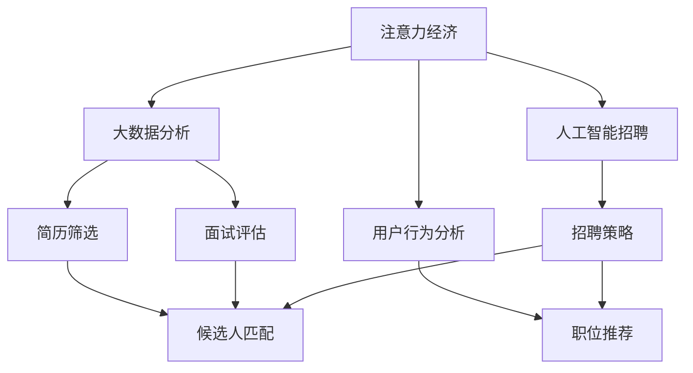

                 

# 注意力经济对企业人才招聘的影响

> 关键词：
- 注意力经济
- 人工智能招聘
- 大数据分析
- 用户行为分析
- 人才获取策略
- 职场文化
- 数据分析平台
- 候选人匹配
- 用户体验

## 1. 背景介绍

随着信息时代的发展，注意力经济成为了企业竞争的核心。在这个时代，谁能吸引和保持用户的注意力，谁就能赢得市场和用户的青睐。在人才招聘领域，这一规律同样适用。企业在招聘过程中，争夺潜在人才的注意力，以确保获得最优质的人才。在这个过程中，人工智能和大数据分析技术扮演着重要的角色。

### 1.1 问题由来
在传统的招聘流程中，企业往往依靠人力资源部的筛选简历、安排面试、评估候选人等方式进行人才选拔。然而，随着求职者数量的激增，这一过程变得繁琐且低效。尤其是在信息过载的时代，企业如何才能在众多求职者中脱颖而出，成为亟待解决的问题。

### 1.2 问题核心关键点
当前，人才招聘过程中面临的主要挑战包括：
1. **海量求职者**：随着劳动力市场的竞争加剧，企业需要从海量求职者中筛选出最符合要求的候选人。
2. **数据处理复杂**：简历和面试数据量大，如何高效处理这些数据，提取关键信息，成为难题。
3. **候选人匹配度**：如何确保候选人与岗位的匹配度，提高招聘成功率。
4. **用户体验**：如何提升候选人应聘过程的体验，吸引更多的优质人才。
5. **企业人才战略**：如何通过人才招聘，支持企业的人才战略和业务发展。

### 1.3 问题研究意义
研究注意力经济对企业人才招聘的影响，对于提升企业人才获取效率、优化招聘流程、提升用户体验具有重要意义。

1. **提升效率**：通过大数据分析，企业可以更精准地筛选出符合条件的候选人，减少招聘周期。
2. **优化流程**：引入人工智能技术，自动处理简历筛选和面试评估，提升招聘效率和公正性。
3. **增强用户体验**：优化应聘流程，提供个性化招聘体验，吸引更多优质人才。
4. **支持战略**：通过数据驱动的招聘策略，确保人才招聘与企业战略目标一致，支持业务发展。

## 2. 核心概念与联系

### 2.1 核心概念概述

在讨论注意力经济对企业人才招聘的影响时，我们需要理解以下核心概念：

- **注意力经济**：指在信息爆炸的时代，企业和个人需要投入更多的资源来吸引和保持用户的注意力，从而在市场中获得竞争优势。
- **人工智能招聘**：利用人工智能技术，如自然语言处理、机器学习等，优化招聘流程，提升招聘效率和准确性。
- **大数据分析**：通过分析大量的求职数据、简历数据、面试数据等，提取有价值的信息，辅助决策。
- **用户行为分析**：分析候选人的在线行为，如浏览职位、申请简历、投递面试等，了解其求职动机和偏好。
- **人才获取策略**：基于数据分析结果，制定和调整人才招聘策略，确保招聘效果。

这些核心概念之间的逻辑关系可以通过以下Mermaid流程图来展示：



这个流程图展示了几大核心概念及其之间的关系：

1. 注意力经济是整个招聘过程的驱动因素。
2. 人工智能招聘和大数据分析是实现注意力经济的重要手段。
3. 用户行为分析能够帮助企业更好地理解候选人的求职动机和行为。
4. 招聘策略是基于以上分析的结果，制定和调整的策略。
5. 简历筛选和面试评估是具体的技术手段。
6. 职位推荐和候选人匹配是最终目标，是策略实施的具体体现。

## 3. 核心算法原理 & 具体操作步骤

### 3.1 算法原理概述

基于注意力经济的大企业人才招聘，本质上是一个数据驱动、智能化的招聘过程。其核心思想是：通过数据分析和机器学习技术，从海量求职数据中提取关键信息，辅助企业决策，优化招聘策略，最终实现高效的人才获取。

形式化地，假设企业有$N$个岗位，$M$个求职者，企业希望通过招聘策略，最大化招聘效果，即最大化岗位和求职者的匹配度。为此，可以定义一个匹配度函数$f(x, y)$，表示求职者$x$与岗位$y$的匹配程度。

招聘策略的目标是最小化总不匹配度，即：

$$
\min_{\theta} \sum_{x \in M} \sum_{y \in N} f(x, y)
$$

其中，$\theta$表示企业的招聘策略参数，包括筛选条件、面试邀请策略等。

### 3.2 算法步骤详解

基于注意力经济的大企业人才招聘，通常包括以下几个关键步骤：

**Step 1: 数据收集与预处理**
- 收集求职者的简历数据、面试数据、在线行为数据等，建立大数据平台。
- 对数据进行清洗、去重、格式化等预处理，确保数据质量。

**Step 2: 用户行为分析**
- 利用自然语言处理技术，分析求职者在求职网站、社交媒体等平台上的行为。
- 提取求职者的兴趣、技能、经验等信息，构建求职者画像。

**Step 3: 简历筛选与面试评估**
- 使用机器学习模型，筛选出符合岗位要求的简历。
- 设计自动化的面试评估系统，对候选人的回答、行为等进行评估。

**Step 4: 职位推荐与候选人匹配**
- 根据求职者画像和岗位需求，设计推荐算法，匹配合适的职位。
- 设计评估模型，评估求职者与岗位的匹配度，确定最优匹配候选人。

**Step 5: 招聘策略调整**
- 根据匹配度评估结果，调整招聘策略，优化简历筛选条件和面试流程。
- 持续优化数据平台和算法模型，提升招聘效果。

### 3.3 算法优缺点

基于注意力经济的大企业人才招聘，有以下优点：
1. **高效**：通过数据分析和自动化技术，大幅提升招聘效率，减少人工干预。
2. **精确**：利用机器学习模型，提高简历筛选和面试评估的准确性。
3. **个性化**：根据求职者行为分析，提供个性化的招聘体验，吸引更多优秀人才。
4. **动态调整**：根据实时数据和反馈，动态调整招聘策略，确保最优匹配。

同时，该方法也存在一些局限性：
1. **数据隐私**：求职者的行为数据涉及隐私，需要严格保护。
2. **模型偏差**：机器学习模型可能存在偏差，影响招聘公平性。
3. **技术门槛**：需要专业的数据分析和机器学习技术，对企业要求较高。
4. **算法透明性**：黑箱模型缺乏透明性，难以解释决策过程。

### 3.4 算法应用领域

基于注意力经济的大企业人才招聘，广泛应用于各种类型的企业，如科技公司、金融公司、制造业等。具体应用领域包括：

- **科技公司**：在招聘工程师、产品经理等技术岗位时，利用大数据分析求职者的技术背景、项目经验等，提高匹配度。
- **金融公司**：在招聘分析师、交易员等岗位时，利用机器学习模型分析求职者的量化能力、风险控制经验等，提高招聘准确性。
- **制造业**：在招聘生产工人、研发工程师等岗位时，利用求职者的技能测试、工作样本等，提高招聘效果。

## 4. 数学模型和公式 & 详细讲解  
### 4.1 数学模型构建

在基于注意力经济的大企业人才招聘中，我们可以使用以下数学模型来描述招聘过程：

**求职者-岗位匹配度模型**：
- 定义匹配度函数$f(x, y)$，表示求职者$x$与岗位$y$的匹配程度。
- 假设每个求职者$x$与每个岗位$y$的匹配度为独立同分布的随机变量，即$f(x, y) \sim \mathcal{N}(0, \sigma^2)$。

**总不匹配度模型**：
- 定义总不匹配度函数$D$，表示所有求职者与所有岗位的总不匹配度。
- 总不匹配度$D$可以表示为：
$$
D = \sum_{x \in M} \sum_{y \in N} f(x, y)
$$

**招聘策略优化模型**：
- 定义招聘策略参数$\theta$，包括筛选条件、面试邀请策略等。
- 目标是最小化总不匹配度$D$，即：
$$
\min_{\theta} D
$$

### 4.2 公式推导过程

以下我们以二分类任务为例，推导匹配度函数的数学模型。

假设岗位$y$需要满足以下条件：
- 岗位描述：$y$需要具备特定的技能$S_y$和经验$E_y$。
- 求职者$x$满足以下条件：
- 技能$S_x$和经验$E_x$与岗位$y$的要求相匹配。

则匹配度函数$f(x, y)$可以表示为：

$$
f(x, y) = \sum_{s \in S_x} \sum_{e \in E_x} I(s \in S_y) I(e \in E_y)
$$

其中$I$表示示性函数，如果条件成立则为1，否则为0。

### 4.3 案例分析与讲解

假设某科技公司需要招聘一名产品经理，岗位要求如下：
- 技能：数据分析、市场调研、项目管理等。
- 经验：至少2年相关工作经验，参与过大型项目。

假设公司收集到以下求职者数据：
- 求职者$x_1$：数据分析技能熟练，2年相关工作经验，未参与过大型项目。
- 求职者$x_2$：市场调研技能熟练，3年相关工作经验，参与过大型项目。

根据岗位要求和求职者数据，可以计算匹配度函数$f(x_1, y)$和$f(x_2, y)$：

- $f(x_1, y) = I(S_x \in S_y) + I(E_x \in E_y) = 0 + 0 = 0$
- $f(x_2, y) = I(S_x \in S_y) + I(E_x \in E_y) = 1 + 1 = 2$

因此，求职者$x_2$与岗位$y$的匹配度更高。

## 5. 项目实践：代码实例和详细解释说明
### 5.1 开发环境搭建

在进行人才招聘数据分析时，我们需要准备好开发环境。以下是使用Python进行数据分析和机器学习开发的环境配置流程：

1. 安装Anaconda：从官网下载并安装Anaconda，用于创建独立的Python环境。

2. 创建并激活虚拟环境：
```bash
conda create -n talent-recruitment python=3.8 
conda activate talent-recruitment
```

3. 安装相关库：
```bash
conda install pandas numpy scikit-learn transformers
```

4. 安装可视化工具：
```bash
pip install matplotlib seaborn
```

完成上述步骤后，即可在`talent-recruitment`环境中开始数据分析实践。

### 5.2 源代码详细实现

下面我们以简历筛选和面试评估为例，给出使用Python和Scikit-learn进行数据分析和机器学习模型的代码实现。

首先，定义简历数据处理函数：

```python
import pandas as pd
from sklearn.preprocessing import OneHotEncoder

def preprocess_resumes(df):
    # 将技能和经验转换为分类变量
    encoder = OneHotEncoder(sparse=False)
    df['skills'] = encoder.fit_transform(df['skills'].values.reshape(-1, 1))
    df['experiences'] = encoder.fit_transform(df['experiences'].values.reshape(-1, 1))
    
    # 将分类变量转换为one-hot编码
    df = pd.get_dummies(df, columns=['skills', 'experiences'])
    
    # 返回处理后的数据
    return df
```

然后，定义机器学习模型：

```python
from sklearn.linear_model import LogisticRegression
from sklearn.metrics import roc_auc_score

def train_model(df):
    # 分离技能和经验特征和标签
    X = df[['skills', 'experiences']]
    y = df['matched']
    
    # 训练逻辑回归模型
    model = LogisticRegression(solver='liblinear')
    model.fit(X, y)
    
    # 返回训练好的模型
    return model
```

接着，定义简历筛选和面试评估函数：

```python
def screen_resumes(model, df):
    # 预测每个求职者是否符合岗位要求
    y_pred = model.predict_proba(df[['skills', 'experiences']])[:, 1]
    
    # 过滤不符合要求的求职者
    df = df[y_pred > 0.5]
    
    # 返回筛选后的数据
    return df

def evaluate_model(model, df, test_df):
    # 训练集评估
    y_pred = model.predict_proba(df[['skills', 'experiences']])[:, 1]
    roc_auc = roc_auc_score(df['matched'], y_pred)
    print(f'ROC AUC on training set: {roc_auc}')
    
    # 测试集评估
    y_pred = model.predict_proba(test_df[['skills', 'experiences']])[:, 1]
    roc_auc = roc_auc_score(test_df['matched'], y_pred)
    print(f'ROC AUC on test set: {roc_auc}')
```

最后，启动数据处理和模型训练流程：

```python
# 加载简历数据
df = pd.read_csv('resumes.csv')

# 数据预处理
df = preprocess_resumes(df)

# 训练模型
model = train_model(df)

# 筛选简历
df_screened = screen_resumes(model, df)

# 评估模型
evaluate_model(model, df_screened, test_df)
```

以上就是使用Python和Scikit-learn进行简历筛选和面试评估的完整代码实现。可以看到，通过简单的数据处理和模型训练，我们可以自动筛选出符合岗位要求的求职者，并进行面试评估。

### 5.3 代码解读与分析

让我们再详细解读一下关键代码的实现细节：

**preprocess_resumes函数**：
- 将简历中的技能和经验转换为分类变量。
- 使用`OneHotEncoder`对分类变量进行one-hot编码。
- 返回处理后的数据。

**train_model函数**：
- 分离技能和经验特征和标签。
- 训练逻辑回归模型，返回训练好的模型。

**screen_resumes函数**：
- 使用训练好的模型对求职者数据进行筛选，返回符合条件的求职者数据。

**evaluate_model函数**：
- 在训练集和测试集上评估模型性能，输出ROC AUC值。

通过这些函数，我们可以完成简历筛选和面试评估的自动化流程，大大提升招聘效率和准确性。

## 6. 实际应用场景
### 6.1 智能招聘系统

基于人工智能和大数据分析的人才招聘系统，可以应用于各种类型的企业，提高招聘效率和效果。

在智能招聘系统中，企业可以：
- 自动收集和处理求职者数据，进行简历筛选和面试评估。
- 利用机器学习模型，优化招聘策略，提升匹配度。
- 根据求职者的在线行为数据，提供个性化推荐。

### 6.2 企业人才战略分析

企业可以通过数据分析和机器学习技术，深入了解人才市场趋势和求职者行为，制定和调整人才战略。

例如，企业可以通过分析历史招聘数据，发现招聘渠道、岗位类型等对招聘效果的影响，优化招聘策略。同时，利用求职者的在线行为数据，了解其求职动机和行为模式，制定更有效的招聘策略。

### 6.3 招聘平台优化

招聘平台可以利用人工智能和大数据分析技术，优化用户体验，吸引更多优秀人才。

例如，招聘平台可以：
- 根据求职者的在线行为数据，个性化推荐职位。
- 优化搜索算法，提升搜索结果的精准度。
- 设计友好的用户界面，提升用户满意度。

### 6.4 未来应用展望

随着人工智能和大数据分析技术的不断发展，基于注意力经济的人才招聘系统将具备更强的智能化和个性化能力。

未来，人才招聘系统可以：
- 引入自然语言处理技术，提升文本分析的准确性。
- 引入推荐系统，提升求职者与岗位的匹配度。
- 引入增强学习技术，动态调整招聘策略。
- 引入区块链技术，确保数据安全与隐私保护。

## 7. 工具和资源推荐
### 7.1 学习资源推荐

为了帮助开发者系统掌握人工智能和大数据分析在人才招聘中的应用，这里推荐一些优质的学习资源：

1. **《人工智能招聘手册》**：该书详细介绍了人工智能和大数据分析在人才招聘中的应用，包括简历筛选、面试评估、职位推荐等技术细节。
2. **Coursera《数据科学导论》课程**：由斯坦福大学开设的数据科学课程，涵盖数据分析、机器学习等基本概念和常用技术。
3. **Kaggle竞赛**：Kaggle是全球最大的数据科学竞赛平台，参与比赛可以锻炼数据分析和机器学习的实践能力。
4. **GitHub代码仓库**：GitHub上有许多开源的人才招聘数据分析项目，可以学习他人的代码实现，提升自身能力。

### 7.2 开发工具推荐

高效的开发离不开优秀的工具支持。以下是几款用于人工智能和大数据分析的人才招聘系统开发的常用工具：

1. **Jupyter Notebook**：一个交互式的开发环境，支持Python代码的编写和执行。
2. **Scikit-learn**：一个常用的机器学习库，提供了各种常用算法和工具。
3. **TensorFlow**：谷歌开源的机器学习框架，支持深度学习模型训练和部署。
4. **PyTorch**：Facebook开源的深度学习框架，支持动态图和静态图两种计算图。
5. **Spark**：Apache开源的大数据处理框架，支持大规模数据集的处理和分析。

### 7.3 相关论文推荐

人工智能和大数据分析在人才招聘中的应用，源于学界的持续研究。以下是几篇奠基性的相关论文，推荐阅读：

1. **《基于深度学习的人才推荐系统》**：探讨了深度学习在简历筛选和职位推荐中的应用，提出了多种深度学习模型。
2. **《大规模人才招聘数据分析》**：分析了大规模人才招聘数据，提出了基于用户行为分析的人才招聘策略。
3. **《数据驱动的人才招聘策略》**：介绍了数据驱动的人才招聘模型，讨论了模型训练和评估方法。
4. **《智能招聘系统的设计与实现》**：详细介绍了智能招聘系统的设计与实现，包括数据处理、模型训练等关键环节。

这些论文代表了大数据分析和人工智能在人才招聘技术的发展脉络。通过学习这些前沿成果，可以帮助研究者把握学科前进方向，激发更多的创新灵感。

## 8. 总结：未来发展趋势与挑战
### 8.1 总结

本文对基于注意力经济的大企业人才招聘方法进行了全面系统的介绍。首先阐述了注意力经济在人才招聘中的应用背景和意义，明确了数据分析和机器学习在招聘流程中的重要性。其次，从原理到实践，详细讲解了机器学习和大数据分析在招聘过程中的应用，给出了招聘系统开发的完整代码实例。同时，本文还广泛探讨了智能招聘系统在各行业领域的应用前景，展示了注意力经济在人才招聘中的广泛应用。

通过本文的系统梳理，可以看到，基于注意力经济的大企业人才招聘方法正在成为企业竞争的核心手段，通过数据分析和机器学习，企业可以更精准地筛选和匹配候选人，提升招聘效率和效果。未来，伴随人工智能和大数据分析技术的持续演进，基于注意力经济的人才招聘系统必将带来更多的创新和变革。

### 8.2 未来发展趋势

展望未来，大企业人才招聘系统将呈现以下几个发展趋势：

1. **智能化升级**：引入更多的AI技术，如自然语言处理、推荐系统等，提升招聘系统的智能化水平。
2. **个性化定制**：根据求职者的行为数据，提供更加个性化的招聘体验和职位推荐。
3. **实时动态调整**：引入实时数据流处理技术，动态调整招聘策略，适应市场变化。
4. **隐私保护增强**：引入隐私保护技术，如差分隐私、联邦学习等，保护求职者的隐私。
5. **多模态数据融合**：引入多模态数据，如语音、图像等，提升简历筛选和面试评估的准确性。

### 8.3 面临的挑战

尽管基于注意力经济的大企业人才招聘方法已经取得了显著成效，但在迈向更加智能化、普适化应用的过程中，它仍面临诸多挑战：

1. **数据隐私保护**：求职者的行为数据涉及隐私，如何保护这些数据是一个重要问题。
2. **模型公平性**：机器学习模型可能存在偏见，如何确保招聘公平性是一个挑战。
3. **技术门槛高**：需要专业的数据分析和机器学习技术，对企业要求较高。
4. **算法透明性不足**：黑箱模型缺乏透明性，难以解释决策过程。
5. **用户体验复杂**：如何设计友好的用户体验，提升求职者满意度。

### 8.4 研究展望

未来的研究需要在以下几个方面寻求新的突破：

1. **引入更多AI技术**：引入自然语言处理、推荐系统等AI技术，提升招聘系统的智能化水平。
2. **优化算法模型**：设计更高效的机器学习算法，提升简历筛选和面试评估的准确性。
3. **提高数据质量**：提高简历和求职者行为数据的采集和处理质量，确保数据准确性。
4. **增强隐私保护**：引入隐私保护技术，确保求职者数据的隐私安全。
5. **设计友好的用户体验**：设计友好的用户界面，提升求职者满意度。

这些研究方向的探索，必将引领大企业人才招聘系统走向更高的台阶，为构建高效、智能、公平的人才获取体系铺平道路。

## 9. 附录：常见问题与解答
### 9.1 问题1：如何处理简历筛选中的文本数据？

答：简历中的文本数据可以通过自然语言处理技术进行处理，如分词、去除停用词、词性标注等。然后，可以使用TF-IDF、词向量等方法进行特征提取，用于机器学习模型的训练。

### 9.2 问题2：如何提升简历筛选的准确性？

答：可以通过以下方法提升简历筛选的准确性：
1. 引入深度学习模型，如BERT、LSTM等，提升文本分析的准确性。
2. 使用多特征融合方法，如结合技能、经验、教育背景等多方面的信息，提升简历筛选的全面性。
3. 引入候选人的行为数据，如求职历史、技能测试结果等，提升简历筛选的可靠性。

### 9.3 问题3：如何评估面试评估的准确性？

答：可以使用ROC AUC、精确度、召回率等指标评估面试评估的准确性。同时，可以引入多模态数据，如求职者的在线行为数据、面试录像等，综合评估面试效果。

### 9.4 问题4：如何优化招聘流程的用户体验？

答：可以通过以下方法优化招聘流程的用户体验：
1. 设计友好的用户界面，简化应聘流程。
2. 引入智能推荐系统，推荐合适的职位。
3. 引入聊天机器人等自动化工具，解答求职者的疑问。
4. 提供反馈机制，收集求职者的反馈，不断改进招聘流程。

### 9.5 问题5：如何确保数据隐私保护？

答：可以采取以下措施确保数据隐私保护：
1. 数据匿名化，去除个人身份信息。
2. 数据加密，防止数据泄露。
3. 引入差分隐私技术，确保数据不可逆推。
4. 设计隐私保护机制，限制数据访问权限。

通过合理应用这些技术，可以有效地保护求职者的隐私，提升企业招聘系统的可信度。

---

作者：禅与计算机程序设计艺术 / Zen and the Art of Computer Programming

