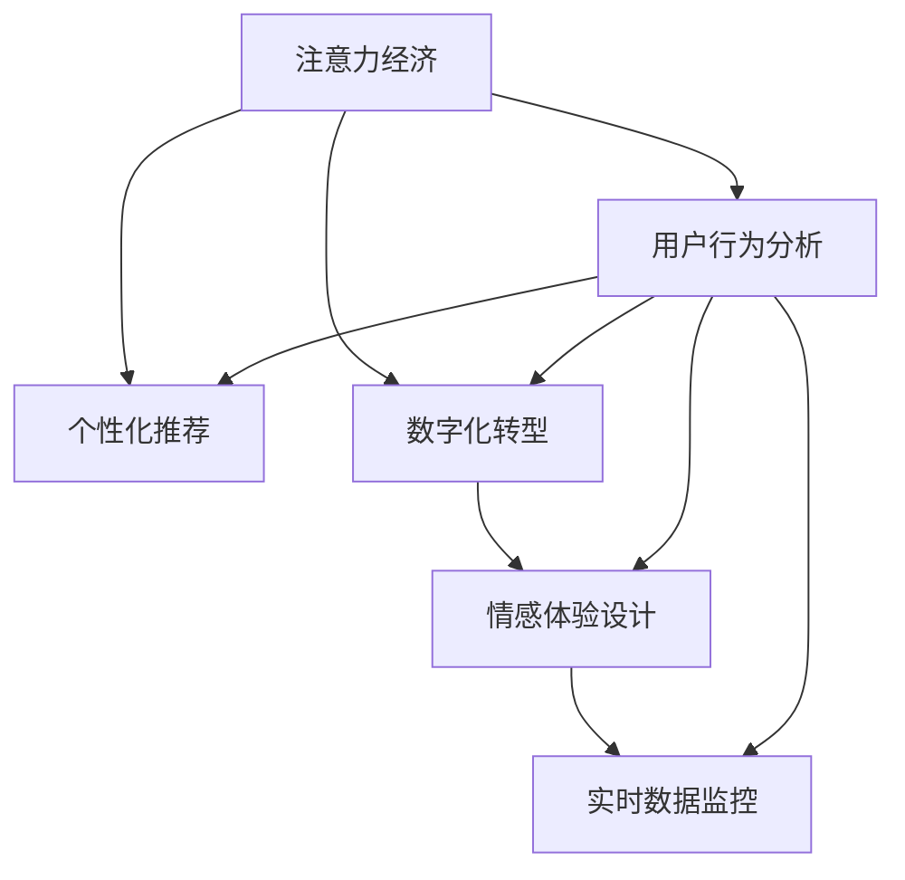

                 

# 注意力经济对传统零售店铺设计的新要求

> 关键词：注意力经济, 零售店铺设计, 用户行为分析, 体验优化, 数字化转型

## 1. 背景介绍

### 1.1 问题由来
在数字经济时代，注意力成为一种稀缺资源，消费者面临大量的信息干扰和选择，如何吸引并保持消费者的注意力成为商家关注的焦点。传统零售店铺设计长期以来依赖物理空间布局、陈列和装修，但在数字化、个性化的需求下，这种设计模式显得力不从心。

随着移动互联网、物联网和大数据技术的发展，零售业逐步进入“注意力经济”时代，通过技术和数据手段提升消费者的注意力、关注度和参与度，成为新商业模型的核心。在这种背景下，传统零售店铺设计面临着一系列新的要求和挑战。

### 1.2 问题核心关键点
本节将梳理“注意力经济”对传统零售店铺设计的关键影响，并明确设计优化方向。

- **用户行为分析**：通过数据挖掘和机器学习，理解用户行为模式，优化店铺布局和陈列。
- **个性化推荐**：基于用户偏好和历史行为，提供定制化商品推荐，提升购物体验。
- **数字化转型**：利用数字技术重塑零售业态，实现线上线下融合，提升运营效率。
- **情感体验**：结合心理物理学原理，设计店铺环境，激发积极情感，增强用户黏性。
- **实时数据监控**：建立智能监控系统，实时收集用户反馈，动态调整店铺策略。

这些关键点共同构成“注意力经济”下零售店铺设计的核心框架，需要在设计、运营和维护过程中全面考虑。

## 2. 核心概念与联系

### 2.1 核心概念概述

为更好地理解注意力经济对零售店铺设计的影响，本节将介绍几个密切相关的核心概念：

- **注意力经济（Economy of Attention）**：在信息爆炸的背景下，用户注意力的稀缺性和重要性日益凸显。商家需要投入更多资源，争夺和维护消费者的注意力。
- **零售店铺设计（Retail Store Design）**：传统上，零售店铺设计注重空间布局、视觉展示和商品陈列，以提升顾客的购物体验和满意度。
- **用户行为分析（User Behavior Analysis）**：通过数据分析技术，理解用户的行为模式和偏好，为店铺设计提供科学依据。
- **个性化推荐系统（Personalized Recommendation System）**：根据用户的历史行为和实时互动，推荐符合其兴趣的商品，提升购买转化率。
- **数字化转型（Digital Transformation）**：利用数字技术改造传统业务流程，实现数字化运营，提升效率和灵活性。
- **情感体验设计（Emotional Experience Design）**：结合心理学和环境设计，创造积极的情感体验，增强用户黏性。
- **实时数据监控（Real-time Data Monitoring）**：通过智能系统实时收集用户反馈和行为数据，动态调整店铺策略，提升运营效果。

这些核心概念之间的逻辑关系可以通过以下Mermaid流程图来展示：



这个流程图展示了一系列的逻辑关系，即注意力经济驱动下的零售店铺设计，需通过用户行为分析，个性化推荐，数字化转型，情感体验设计和实时数据监控，共同实现设计优化和运营提升。

## 3. 核心算法原理 & 具体操作步骤
### 3.1 算法原理概述

注意力经济下，传统零售店铺设计需要融入更多数据驱动和智能化元素。核心算法原理在于：

1. **用户行为分析**：利用机器学习算法，如聚类、关联规则、决策树等，分析用户行为模式，找出购买习惯、偏好和频率。
2. **个性化推荐**：采用协同过滤、内容推荐、混合推荐等算法，结合用户画像，推荐个性化商品。
3. **数字化转型**：引入物联网(IoT)、大数据分析、人工智能(AI)等技术，实现线上线下融合，提升运营效率。
4. **情感体验设计**：结合心理学和环境设计，利用大数据分析用户对店铺环境的情感反应，设计更加用户友好的店铺布局。
5. **实时数据监控**：建立智能监控系统，实时分析用户行为数据，及时调整店铺策略，优化购物体验。

### 3.2 算法步骤详解

以下将详细介绍各个核心算法的具体操作步骤：

**3.2.1 用户行为分析**

步骤1：数据采集
- 利用传感器、监控摄像头等技术，收集店铺内的视频、图片、音频、位置等信息。
- 使用RFID、NFC等技术，记录用户进店、停留、浏览、购买等行为。
- 通过问卷调查、在线互动等方式，收集用户偏好和反馈。

步骤2：数据清洗与预处理
- 去除无效数据、噪音数据和异常值，确保数据的完整性和准确性。
- 对时间序列数据进行归一化、差分等预处理，便于后续分析。

步骤3：特征提取
- 对收集到的数据进行特征提取，如时间、地点、物品、人员、情感等。
- 利用自然语言处理(NLP)技术，提取文本中的关键词和情感信息。
- 使用图像处理技术，提取商品属性和用户面部表情。

步骤4：建模与分析
- 利用聚类算法（如K-means、层次聚类等），对用户进行分群，找出不同群体的行为特征。
- 应用关联规则挖掘算法（如Apriori、FP-growth等），发现不同商品之间的关联关系。
- 使用决策树、随机森林等模型，预测用户购买行为和偏好。

**3.2.2 个性化推荐**

步骤1：用户画像构建
- 基于用户行为数据，构建用户画像，包括年龄、性别、消费习惯、兴趣爱好等。
- 利用社交媒体、电商平台等，补充外部数据，完善用户画像。

步骤2：推荐模型训练
- 采用协同过滤算法（如基于用户的协同过滤、基于项目的协同过滤），根据相似用户的行为推荐商品。
- 应用内容推荐算法（如基于内容的推荐、深度学习推荐），根据商品属性和用户偏好推荐商品。
- 结合多种算法，构建混合推荐系统，提升推荐效果。

步骤3：推荐系统部署
- 将推荐模型集成到店铺系统中，实时计算推荐结果。
- 利用推荐算法，动态调整商品展示和广告投放策略。

**3.2.3 数字化转型**

步骤1：技术基础设施搭建
- 部署云平台，如AWS、Azure、阿里云等，搭建数据存储、处理和分析的云环境。
- 引入物联网(IoT)设备，收集店铺内外的实时数据。
- 集成第三方数据服务，如GIS、天气预报等，丰富数据来源。

步骤2：系统集成与优化
- 将POS系统、CRM系统、供应链系统等传统系统与新平台集成，实现数据共享和协同。
- 优化数据处理流程，提高数据采集和处理的效率。
- 引入人工智能技术，如机器学习、自然语言处理等，提升数据分析和决策能力。

**3.2.4 情感体验设计**

步骤1：情感数据收集
- 利用情感分析技术，分析用户对店铺环境的情感反应。
- 通过问卷调查、现场访谈等方式，收集用户的主观反馈。

步骤2：情感体验优化
- 基于情感数据，优化店铺布局、灯光、音乐、温度等环境设计。
- 结合心理学原理，设计适应用户情感需求的产品陈列和互动体验。
- 利用虚拟现实(VR)、增强现实(AR)技术，提供沉浸式购物体验。

**3.2.5 实时数据监控**

步骤1：数据采集与传输
- 利用传感器、监控摄像头等设备，实时采集店铺内的数据。
- 使用5G、WiFi等技术，保证数据的高速传输。

步骤2：数据存储与处理
- 部署大数据存储系统，如Hadoop、Spark等，存储和管理海量数据。
- 利用实时流处理技术，如Apache Kafka、Apache Flink等，处理和分析实时数据。

步骤3：策略调整与优化
- 根据实时数据分析用户行为和反馈，及时调整店铺策略。
- 利用机器学习算法，预测店铺流量和销售趋势，优化库存和人员配置。
- 结合客户反馈，进行产品和服务优化。

### 3.3 算法优缺点

注意力经济下的零售店铺设计方法具有以下优点：

1. **数据驱动**：通过数据挖掘和机器学习，使店铺设计更加科学和个性化。
2. **实时响应**：利用实时数据分析，动态调整店铺策略，提高运营效率。
3. **个性化推荐**：提高用户购买转化率和满意度，增强用户黏性。
4. **环境优化**：结合心理学和环境设计，提升用户情感体验。

同时，这些方法也存在一定的局限性：

1. **数据隐私**：在数据采集和处理过程中，需要注意用户隐私保护，避免数据泄露和滥用。
2. **技术成本**：数字化转型和智能监控需要投入较大的技术和人力成本。
3. **模型复杂度**：复杂的机器学习模型可能存在模型过拟合或训练耗时长的问题。
4. **技术门槛**：需要一定的技术背景和专业知识，中小型企业可能难以实施。

尽管存在这些局限性，但总体而言，基于注意力经济的大零售店铺设计方法，能够更好地应对数字化时代的需求，提升店铺运营效率和用户体验。

### 3.4 算法应用领域

注意力经济下的零售店铺设计方法，已在多个领域得到应用，取得了显著效果：

- **智能家居**：结合物联网技术，利用传感器和智能设备，为用户提供个性化、智能化的家居服务。
- **智能零售**：通过智能货架、人脸识别、语音助手等技术，提升购物体验，提高销售效率。
- **智慧城市**：利用大数据和人工智能，优化城市交通、环境、公共服务等，提升市民生活质量。
- **个性化医疗**：通过分析患者数据，提供个性化医疗服务，提升诊疗效果。
- **在线教育**：利用推荐系统，根据学生学习行为，推荐个性化的学习内容，提高学习效率。

## 4. 数学模型和公式 & 详细讲解 & 举例说明

### 4.1 数学模型构建

以下我们将构建基于用户行为分析的推荐系统的数学模型。

设用户集合为$U=\{u_1,u_2,\cdots,u_N\}$，商品集合为$I=\{i_1,i_2,\cdots,i_M\}$。设用户$u_i$对商品$i_j$的评分$s_{ij}$和交互次数$C_{ij}$，以及商品$i_j$的属性特征向量$x_{ij}=(x_{ij1},x_{ij2},\cdots,x_{ijd})$，其中$d$为属性维度。

推荐系统的目标是最小化预测评分与实际评分的误差，即最小化损失函数：

$$
\min_{\theta} \sum_{i,j}L(s_{ij},\hat{s}_{ij})
$$

其中$L$为评分误差函数，$\hat{s}_{ij}$为预测评分。

### 4.2 公式推导过程

以协同过滤算法为例，假设用户$u_i$和商品$i_j$的相似度为$\sigma_{ij}$，利用余弦相似度计算方法，有：

$$
\sigma_{ij} = \frac{\sum_kx_{ik}x_{jk}}{\sqrt{\sum_kx_{ik}^2}\sqrt{\sum_kx_{jk}^2}}
$$

将相似度矩阵与用户-商品评分矩阵进行矩阵乘法，得到用户-商品评分预测矩阵：

$$
\hat{S} = \sigma \cdot S
$$

其中$\sigma$为相似度矩阵，$S$为用户-商品评分矩阵。

基于预测评分矩阵，可计算用户$u_i$对商品$i_j$的预测评分$\hat{s}_{ij}$，通过矩阵乘法和向量点乘实现：

$$
\hat{s}_{ij} = \sum_k \sigma_{ik}\hat{r}_{kj}
$$

其中$\hat{r}_{kj}$为模型参数，通过最小二乘法训练得到：

$$
\hat{r}_{kj} = \theta_k \cdot x_{kj}
$$

其中$\theta_k$为模型参数向量。

### 4.3 案例分析与讲解

假设某电商平台有10万用户和1万种商品，通过用户行为数据，收集用户对商品的评分和交互次数。将用户行为数据分为训练集和测试集，利用协同过滤算法进行模型训练和测试。

步骤1：数据准备
- 收集用户-商品评分矩阵，数据量$N=100000$，$M=10000$。
- 利用余弦相似度计算相似度矩阵$\sigma$。

步骤2：模型训练
- 将用户行为数据分为训练集和测试集，比例为70:30。
- 利用最小二乘法训练模型参数$\hat{r}_{kj}$。
- 利用训练集评分误差$L$最小化损失函数。

步骤3：模型测试
- 利用测试集评分误差$L$评估模型预测效果。
- 计算均方根误差(RMSE)和均方误差(MSE)等评价指标。
- 分析预测结果与实际评分的差异，优化模型参数。

通过以上步骤，可以利用协同过滤算法，构建基于用户行为分析的推荐系统，提高电商平台的用户购物体验和转化率。

## 5. 项目实践：代码实例和详细解释说明

### 5.1 开发环境搭建

在进行零售店铺设计项目实践前，我们需要准备好开发环境。以下是使用Python进行TensorFlow开发的环境配置流程：

1. 安装Anaconda：从官网下载并安装Anaconda，用于创建独立的Python环境。

2. 创建并激活虚拟环境：
```bash
conda create -n tf-env python=3.8 
conda activate tf-env
```

3. 安装TensorFlow：根据CUDA版本，从官网获取对应的安装命令。例如：
```bash
conda install tensorflow tensorflow-gpu=cuda110 -c conda-forge
```

4. 安装各类工具包：
```bash
pip install numpy pandas scikit-learn matplotlib tqdm jupyter notebook ipython
```

完成上述步骤后，即可在`tf-env`环境中开始项目实践。

### 5.2 源代码详细实现

这里我们以基于用户行为分析的推荐系统为例，给出使用TensorFlow进行开发的Python代码实现。

首先，定义推荐系统的基础类：

```python
import tensorflow as tf
import numpy as np

class RecommendationSystem(tf.keras.Model):
    def __init__(self, num_users, num_items, num_factors):
        super(RecommendationSystem, self).__init__()
        self.num_users = num_users
        self.num_items = num_items
        self.num_factors = num_factors
        self.W = tf.Variable(tf.random.normal([num_items, num_factors]))
        self.U = tf.Variable(tf.random.normal([num_users, num_factors]))
        self.V = tf.Variable(tf.random.normal([num_factors, num_items]))
    
    def call(self, inputs):
        user_idx, item_idx = inputs
        user_u = tf.nn.embedding_lookup(self.U, user_idx)
        item_i = tf.nn.embedding_lookup(self.W, item_idx)
        predicted_r = tf.matmul(user_u, tf.transpose(item_i))
        predicted_s = tf.matmul(predicted_r, self.V)
        return predicted_s
```

然后，定义用户行为数据准备函数：

```python
def prepare_data(num_users, num_items, num_factors):
    # 构造随机用户行为数据
    np.random.seed(0)
    num_ratings = 10000
    user_idx = np.random.randint(num_users, size=num_ratings)
    item_idx = np.random.randint(num_items, size=num_ratings)
    rating = np.random.uniform(low=-1.0, high=1.0, size=num_ratings)
    rating = rating * np.random.normal(scale=0.5, size=num_ratings)  # 添加噪声
    return user_idx, item_idx, rating
```

接着，定义推荐系统训练函数：

```python
def train_recommendation_system(num_epochs, learning_rate, batch_size):
    # 加载数据
    user_idx, item_idx, rating = prepare_data(num_users, num_items, num_factors)
    
    # 分割数据集
    train_idx = list(range(0, num_ratings, batch_size))
    val_idx = list(range(num_ratings, num_ratings * 2, batch_size))
    test_idx = list(range(num_ratings * 2, num_ratings * 3, batch_size))
    
    # 构建数据集
    train_dataset = tf.data.Dataset.from_tensor_slices((user_idx[:train_idx[-1]], item_idx[:train_idx[-1]])).shuffle(num_ratings).batch(batch_size)
    val_dataset = tf.data.Dataset.from_tensor_slices((user_idx[:val_idx[-1]], item_idx[:val_idx[-1]])).batch(batch_size)
    test_dataset = tf.data.Dataset.from_tensor_slices((user_idx[:test_idx[-1]], item_idx[:test_idx[-1]])).batch(batch_size)
    
    # 构建推荐系统模型
    model = RecommendationSystem(num_users, num_items, num_factors)
    
    # 定义损失函数
    def loss_fn(y_true, y_pred):
        return tf.reduce_mean(tf.square(y_true - y_pred))
    
    # 定义优化器
    optimizer = tf.keras.optimizers.Adam(learning_rate=learning_rate)
    
    # 定义评估指标
    rmse = tf.keras.metrics.Mean(tf.sqrt(tf.square(y_true - y_pred)))
    
    # 训练模型
    for epoch in range(num_epochs):
        model.compile(optimizer=optimizer, loss=loss_fn, metrics=[rmse])
        model.fit(train_dataset, epochs=1, validation_data=val_dataset)
        rmse_result = rmse.update_state(test_dataset)
        print(f"Epoch {epoch+1}, RMSE: {rmse_result:.4f}")
```

最后，启动推荐系统训练流程：

```python
num_users = 100000
num_items = 10000
num_factors = 100
learning_rate = 0.01
batch_size = 32
num_epochs = 100

train_recommendation_system(num_epochs, learning_rate, batch_size)
```

以上就是使用TensorFlow对基于用户行为分析的推荐系统进行开发的完整代码实现。可以看到，得益于TensorFlow的强大封装，我们可以用相对简洁的代码完成推荐系统的搭建和训练。

### 5.3 代码解读与分析

让我们再详细解读一下关键代码的实现细节：

**RecommendationSystem类**：
- `__init__`方法：初始化模型参数，包括用户数、商品数、因子数等。
- `call`方法：前向传播计算预测评分，通过矩阵乘法和embedding lookup实现。

**prepare_data函数**：
- 构造随机用户行为数据，生成用户、商品、评分三个维度的高斯分布数据。
- 添加噪声以增加数据的真实性。

**train_recommendation_system函数**：
- 加载数据集，并按批次分割成训练集、验证集和测试集。
- 定义推荐系统模型和损失函数。
- 使用Adam优化器进行模型训练，定义RMSE评估指标。
- 通过循环迭代训练模型，并实时打印RMSE指标。

**推荐系统训练流程**：
- 定义用户数、商品数、因子数等参数。
- 设置学习率、批量大小和训练轮数。
- 启动推荐系统训练流程，每轮训练后打印RMSE指标。

可以看到，TensorFlow配合Python语言，使得推荐系统的开发和训练过程变得简洁高效。开发者可以将更多精力放在数据处理、模型改进等高层逻辑上，而不必过多关注底层的实现细节。

当然，工业级的系统实现还需考虑更多因素，如模型的保存和部署、超参数的自动搜索、更灵活的任务适配层等。但核心的推荐范式基本与此类似。

## 6. 实际应用场景

### 6.1 智能家居

基于用户行为分析的推荐系统，可以广泛应用于智能家居领域，提升用户的生活体验。通过分析用户的生活习惯、睡眠周期、健康数据等，智能家居系统能够提供个性化的场景推荐和服务。

例如，智能音箱可以根据用户的操作习惯，推荐适合的音乐、新闻和天气信息。智能照明可以根据用户的活动模式，自动调整灯光亮度和颜色，创造舒适的家居环境。智能温控可以根据用户的喜好，自动调节室内温度和湿度，保持舒适的居住环境。

### 6.2 智能零售

零售店铺可以利用推荐系统，根据用户的历史购物行为和实时反馈，提供个性化的商品推荐和促销活动。通过数据分析，店铺可以了解用户的偏好和需求，优化商品陈列和价格策略，提升销售效果。

例如，电商平台可以通过分析用户浏览和购买数据，推荐相关商品和促销活动。实体店铺可以利用推荐系统，根据用户现场的互动行为，动态调整商品展示和广告投放策略，吸引顾客购买。

### 6.3 智慧城市

智慧城市建设需要大量的数据支撑，基于用户行为分析的推荐系统，可以为城市管理提供全面的数据支持。通过分析城市内各区域的人流、交通、环境等数据，城市管理者可以优化交通管理、环境保护和公共服务。

例如，城市交通系统可以根据用户出行习惯，推荐最优的交通路线和交通工具，减少拥堵和污染。智能垃圾处理系统可以根据用户投放垃圾的时间和地点，优化垃圾收集和处理方案，提高资源利用率。智能医疗系统可以根据用户的健康数据，推荐最适合的医疗服务，提升市民的健康水平。

### 6.4 未来应用展望

随着技术的不断进步，基于用户行为分析的推荐系统将在更多领域得到应用，为社会带来深远影响。

在智慧交通领域，推荐系统可以帮助优化交通流量，减少交通拥堵，提升出行效率。在智慧旅游领域，推荐系统可以根据用户的兴趣和需求，推荐最适合的旅游目的地和行程安排，提升旅游体验。在智慧金融领域，推荐系统可以帮助用户进行资产配置和投资决策，提升理财效果。

总之，推荐系统将在数字经济时代扮演越来越重要的角色，成为构建智慧社会的基础设施之一。未来，随着算力、数据和技术的不断进步，推荐系统将更加智能化、个性化，为用户提供更加丰富、便捷的服务体验。

## 7. 工具和资源推荐

### 7.1 学习资源推荐

为了帮助开发者系统掌握推荐系统的理论和实践，这里推荐一些优质的学习资源：

1. 《推荐系统实战》书籍：全面介绍了推荐系统的基本概念、算法和应用，适合入门和进阶学习。
2. Coursera《推荐系统》课程：斯坦福大学开设的推荐系统在线课程，包含理论讲解和实践项目。
3 《Python推荐系统》课程：介绍Python和TensorFlow在推荐系统中的应用，适合实战学习。
4 《Apache Spark推荐系统》课程：讲解Spark在推荐系统中的应用，适合大数据领域的学习者。
5 《深度学习推荐系统》书籍：深入讲解深度学习在推荐系统中的应用，适合深入研究。

通过对这些资源的学习实践，相信你一定能够快速掌握推荐系统的精髓，并用于解决实际的推荐问题。

### 7.2 开发工具推荐

高效的开发离不开优秀的工具支持。以下是几款用于推荐系统开发的常用工具：

1. TensorFlow：基于Python的开源深度学习框架，灵活动态的计算图，适合快速迭代研究。TensorFlow在推荐系统中的应用广泛，具有丰富的工具和资源。
2. PyTorch：基于Python的深度学习框架，易于使用，适合研究与工程兼顾。PyTorch在推荐系统中的应用也日益增多。
3. Apache Spark：大数据处理框架，适合大规模数据集的处理和分析。Spark在推荐系统中的应用，可以处理海量用户行为数据，实现高效推荐。
4. Elasticsearch：搜索引擎，适合存储和检索用户行为数据，支持复杂查询和分析。Elasticsearch在推荐系统中的应用，可以提供实时搜索和分析服务。
5. Apache Flink：实时数据流处理框架，适合处理和分析实时用户行为数据。Flink在推荐系统中的应用，可以实现实时推荐和优化。

合理利用这些工具，可以显著提升推荐系统的开发效率，加快创新迭代的步伐。

### 7.3 相关论文推荐

推荐系统的研究源于学界的持续努力。以下是几篇奠基性的相关论文，推荐阅读：

1. Algorithmic Persuasion: Improving Online Decision Making Using Recommender Systems：介绍推荐系统的推荐机制和改进方法。
2. Matrix Factorization Techniques for Recommender Systems：系统讲解矩阵分解算法在推荐系统中的应用。
3. Deep Ranking with Feature Learning for Recommender Systems：提出深度学习在推荐系统中的特征学习算法。
4. A Hybrid Recommender System with collaborative filtering and knowledge-based filtering：提出基于协同过滤和知识过滤的混合推荐系统。
5. Diversity and Discrepancy in Recommendation Systems：探讨推荐系统的多样性和公平性问题，提出改进策略。

这些论文代表了大推荐系统的研究进展。通过学习这些前沿成果，可以帮助研究者把握学科前进方向，激发更多的创新灵感。

## 8. 总结：未来发展趋势与挑战

### 8.1 总结

本文对基于用户行为分析的推荐系统进行了全面系统的介绍。首先阐述了推荐系统在智能经济时代的核心价值和应用方向，明确了推荐系统的优化目标和方法。其次，从原理到实践，详细讲解了推荐系统的数学模型和核心算法，给出了推荐系统开发的完整代码实例。同时，本文还广泛探讨了推荐系统在多个行业领域的应用前景，展示了推荐系统的重要性和应用潜力。

通过本文的系统梳理，可以看到，基于用户行为分析的推荐系统正在成为智能经济时代的重要工具，提升了多个领域的服务体验和运营效率。推荐系统为消费者提供了更加个性化、便捷的服务，为商家带来了更高的转化率和销售效果，为城市管理提供了全面的数据支持。未来，随着技术的不断进步，推荐系统必将在更广阔的应用领域发挥更大作用。

### 8.2 未来发展趋势

展望未来，推荐系统的发展趋势将呈现出以下几个方向：

1. **多模态融合**：推荐系统将结合图像、视频、语音等多模态数据，提供更加全面、精准的推荐服务。
2. **深度学习优化**：深度学习技术将进一步优化推荐模型的特征提取和决策过程，提升推荐效果。
3. **实时推荐系统**：利用实时流处理技术，实现动态推荐和个性化优化，提升用户体验。
4. **跨领域推荐**：推荐系统将跨越不同领域和应用场景，实现多领域的融合推荐。
5. **智能推荐引擎**：利用AI技术，实现推荐系统的自主学习和优化，提升推荐效果和智能化水平。

这些趋势凸显了推荐系统的广阔前景。这些方向的探索发展，必将进一步提升推荐系统的性能和应用范围，为用户和商家带来更多的价值和体验。

### 8.3 面临的挑战

尽管推荐系统取得了显著成效，但在迈向更加智能化、普适化应用的过程中，它仍面临着诸多挑战：

1. **数据隐私**：在数据采集和处理过程中，需要注意用户隐私保护，避免数据泄露和滥用。
2. **技术门槛**：推荐系统涉及复杂的数学和算法知识，对技术要求较高，需要专业的技术团队支持。
3. **推荐效果**：推荐系统可能面临推荐效果不理想、推荐结果不准确等问题，需要进行反复迭代和优化。
4. **系统稳定**：推荐系统需要高可靠性和稳定性，避免因故障和异常导致服务中断。
5. **用户接受度**：推荐系统需要考虑用户的接受度和使用习惯，避免过度推荐和用户反感。

尽管存在这些挑战，但总体而言，基于用户行为分析的推荐系统仍然具有巨大的应用潜力和发展前景。

### 8.4 研究展望

未来推荐系统研究需要在以下几个方面寻求新的突破：

1. **多领域数据融合**：结合多领域数据，提升推荐系统的泛化能力和应用范围。
2. **隐私保护机制**：设计隐私保护算法，确保用户数据的安全和隐私。
3. **跨领域推荐算法**：研究跨领域推荐算法，提升推荐系统的跨领域迁移能力。
4. **实时推荐系统**：开发实时推荐系统，实现动态调整和优化。
5. **自适应推荐引擎**：研究自适应推荐引擎，提升推荐系统的智能化和自学习能力。

这些研究方向的探索，必将引领推荐系统向更高台阶迈进，为构建更加智能、便捷的社会服务体系提供技术支持。未来，随着技术的不断进步，推荐系统必将在更多领域发挥重要作用，为数字经济时代带来更多的创新和价值。

## 9. 附录：常见问题与解答

**Q1：推荐系统如何提高用户满意度和购买转化率？**

A: 推荐系统通过分析用户行为数据，了解用户的偏好和需求，提供个性化的商品推荐和服务。推荐系统可以根据用户的历史购物行为和实时反馈，动态调整推荐策略，提高用户满意度和购买转化率。通过协同过滤、内容推荐、混合推荐等算法，推荐系统能够提供更精准、更符合用户需求的商品和服务，提升用户体验。

**Q2：推荐系统如何实现个性化推荐？**

A: 推荐系统利用协同过滤、内容推荐、混合推荐等算法，结合用户画像和历史行为数据，推荐符合用户兴趣的商品和服务。协同过滤算法根据用户相似度推荐商品，内容推荐算法根据商品属性和用户偏好推荐商品，混合推荐算法结合多种算法，提供综合推荐结果。推荐系统通过不断优化算法和模型，提升推荐效果和用户满意度。

**Q3：推荐系统面临的主要挑战有哪些？**

A: 推荐系统面临的主要挑战包括数据隐私、技术门槛、推荐效果、系统稳定和用户接受度。数据隐私问题需要设计隐私保护算法，确保用户数据的安全和隐私。技术门槛较高，需要专业的技术团队支持。推荐系统可能面临推荐效果不理想、推荐结果不准确等问题，需要进行反复迭代和优化。推荐系统需要高可靠性和稳定性，避免因故障和异常导致服务中断。用户接受度需要考虑用户的接受度和使用习惯，避免过度推荐和用户反感。

**Q4：推荐系统如何在多模态数据中融合信息？**

A: 推荐系统可以结合图像、视频、语音等多模态数据，提供更加全面、精准的推荐服务。例如，利用图像处理技术，提取商品属性和用户面部表情，结合文本数据和行为数据，提供多模态推荐结果。多模态融合需要设计融合算法，将不同模态的数据融合在一起，提升推荐系统的性能和用户体验。

**Q5：推荐系统如何处理噪声数据和异常值？**

A: 推荐系统在数据采集和处理过程中，需要考虑噪声数据和异常值的影响。可以通过数据清洗和预处理，去除无效数据和异常值，确保数据的完整性和准确性。可以利用机器学习算法，识别和处理噪声数据和异常值，提升推荐系统的性能和稳定性。

总之，推荐系统在数字经济时代具有重要的应用价值，能够提升用户满意度和购买转化率，实现智能化、个性化的服务。然而，推荐系统在发展过程中也面临诸多挑战，需要不断优化和改进，才能更好地服务于用户和商家。通过技术创新和持续优化，推荐系统必将在未来发挥更大的作用，为数字经济时代带来更多的价值和创新。

