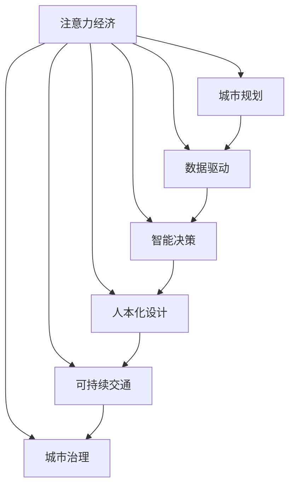

                 

# 注意力经济视角下的城市规划新思路

> 关键词：
  - 注意力经济
  - 城市规划
  - 数据驱动
  - 智能化决策
  - 人本化设计
  - 可持续交通
  - 城市治理

## 1. 背景介绍

### 1.1 问题由来
随着数字化、信息化浪潮的迅猛推进，城市化进程愈发火热。然而，传统城市规划方式往往依赖经验积累，缺乏数据支撑，导致规划不够科学、决策不够精准。为了改变这一现状，许多城市逐渐引入数据驱动、智能化的决策模式。其中，注意力经济（Attention Economy）这一概念为我们提供了全新的视角。

### 1.2 问题核心关键点
注意力经济是一种利用信息注意力来引导决策和行为的经济模式，其核心在于识别和利用信息传播中的关键节点，从而优化资源分配和城市规划。传统的城市规划更多基于地理、历史、社会等因素的物理布局，而注意力经济则更关注信息流动的经济规律，如流量、关注度、热力图等。

### 1.3 问题研究意义
引入注意力经济视角进行城市规划，具有以下重要意义：
1. 提升规划精度。通过对居民关注度和行为流动的深入分析，可以更精准地把握城市资源配置需求，提高城市规划的科学性。
2. 强化决策支持。通过数据驱动的智能决策，可以降低人为偏差，提升规划决策的合理性和可行性。
3. 促进资源优化。利用注意力经济原理，可以在城市资源配置中实现更高效的资源优化，提高资源利用效率。
4. 推动人本化设计。通过关注居民的注意力和行为特征，可以实现更贴合用户需求和习惯的城市规划。
5. 支持可持续发展。利用注意力经济原理，可以实现更加绿色的城市规划，促进经济、社会和环境的可持续发展。

## 2. 核心概念与联系

### 2.1 核心概念概述

为了更好地理解基于注意力经济的城市规划方法，本节将介绍几个关键概念：

- 注意力经济（Attention Economy）：基于信息经济学，强调信息传播中的注意力价值，通过关注节点优化资源配置的经济模式。
- 城市规划（Urban Planning）：设计和管理城市空间和功能布局的过程，包括交通、住房、商业、教育等方面。
- 数据驱动（Data-Driven）：以数据为基础进行决策和规划，利用大数据技术分析城市运行规律。
- 智能决策（Smart Decision Making）：通过智能算法和模型，实现高效、精准的决策支持。
- 人本化设计（Human-Centered Design）：强调城市规划中以人为本的原则，关注居民的实际需求和体验。
- 可持续交通（Sustainable Transportation）：注重环保和节能，推广公共交通和非机动车出行。
- 城市治理（Urban Governance）：涉及城市管理和服务，包含公共安全、环境、治理等方面。

这些核心概念之间的逻辑关系可以通过以下Mermaid流程图来展示：



这个流程图展示了几大核心概念的相互关系和作用机制：

1. 注意力经济强调基于信息的决策，对城市规划有着直接的影响。
2. 数据驱动和智能决策分别提供了注意力经济的分析工具和决策支撑。
3. 人本化设计关注居民需求，推动城市规划更加贴近实际。
4. 可持续交通和城市治理则保障了城市规划的绿色和高效。

## 3. 核心算法原理 & 具体操作步骤
### 3.1 算法原理概述

基于注意力经济的城市规划，本质上是一种数据驱动、智能化的决策过程。其核心思想是：通过深度分析居民对城市不同区域和功能的关注度，利用信息流动的经济规律，进行资源配置和规划优化。

具体而言，可以构建一个城市热力图，表示居民在不同时间和地点的关注度分布。城市规划者可以通过热力图识别出高关注度区域，从而针对性地优化资源配置，如商业、交通、公共服务等设施的布局。

### 3.2 算法步骤详解

基于注意力经济的城市规划主要包括以下几个关键步骤：

**Step 1: 数据收集与处理**

- 收集城市居民在不同时间和地点的行为数据，如手机定位、互联网搜索、社交媒体活动等。
- 清洗和预处理数据，去除噪声和异常值。
- 利用聚类、降维等技术，对数据进行特征提取和降维，提高后续分析的效率。

**Step 2: 构建热力图**

- 对处理后的数据，计算出每个地点和时间的注意力值，构建热力图。
- 热力图的值可以是多维的，如点击量、停留时间、频率等。
- 可视化热力图，分析不同区域、时间段的注意力分布情况。

**Step 3: 识别关键节点**

- 对热力图进行分析，识别出高关注度区域，如商业中心、交通枢纽、公共服务设施等。
- 使用社交网络分析等技术，进一步挖掘这些节点之间的关联性和影响力。
- 根据城市整体规划目标，评估关键节点对城市功能的影响，确定优先优化区域。

**Step 4: 规划优化**

- 利用优化算法，如线性规划、模拟退火等，进行城市规划优化。
- 对关键节点进行合理布局，如商业中心、公园、医院等。
- 调整交通网络，提高通行效率，优化公共交通站点布局。
- 引入智能化设施，如智慧路灯、智能停车等，提升城市管理水平。

**Step 5: 持续监测与调整**

- 对优化后的城市进行持续监测，获取新的数据。
- 定期更新热力图和优化模型，确保城市规划的动态性和时效性。
- 根据新的数据反馈，进行局部调整和优化，确保城市规划的科学性和灵活性。

### 3.3 算法优缺点

基于注意力经济的城市规划方法具有以下优点：
1. 数据驱动。通过大量行为数据的分析，能够更准确地把握城市运行的规律。
2. 智能优化。利用数据和模型进行精准的资源配置和规划优化。
3. 提升居民满意度。更加贴合居民实际需求，提高居民生活质量。
4. 促进可持续发展。通过优化资源配置，提高资源利用效率，促进绿色发展。

同时，该方法也存在一些局限性：
1. 数据隐私问题。大量行为数据的收集和使用，涉及个人隐私保护，需要严格的数据安全措施。
2. 数据偏差问题。数据收集和处理过程中，可能存在数据偏差，影响分析结果的准确性。
3. 技术复杂性。需要借助多种数据技术和分析工具，对技术要求较高。
4. 社会接受度。规划过程中可能存在利益冲突和阻力，需要提高社会接受度。

尽管存在这些局限性，但基于注意力经济的城市规划方法仍具有较大的应用潜力，将在未来城市规划中发挥重要作用。

### 3.4 算法应用领域

基于注意力经济的城市规划方法，已经在多个城市规划项目中得到应用，包括但不限于：

- 商业中心选址：通过热力图分析，识别高关注度区域，优化商业设施布局。
- 交通网络优化：利用热力图和流量数据，优化公共交通站点和线路设计。
- 公共服务设施规划：识别居民高关注度区域，合理布局公园、医院、学校等设施。
- 城市安全管理：分析异常流量和热力图变化，及时发现和应对安全事件。
- 城市环境治理：识别垃圾收集点、垃圾处理设施的高关注度区域，优化环保设施布局。

除了上述这些典型应用外，注意力经济的城市规划方法还可以应用于智能家居、智慧社区、城市应急响应等多个领域，为城市管理提供全方位的支撑。

## 4. 数学模型和公式 & 详细讲解 & 举例说明

### 4.1 数学模型构建

本节将使用数学语言对基于注意力经济的城市规划方法进行更加严格的刻画。

记城市热力图为 $H=\{h_i\}_{i=1}^N$，其中 $h_i$ 表示第 $i$ 个地点的注意力值。假设城市规划的目标是最大化居民满意度 $S$，可以构建如下优化模型：

$$
\max S=\sum_{i=1}^N w_i h_i
$$

其中 $w_i$ 表示第 $i$ 个地点的权重，用于反映该地点对整体满意度的贡献。

### 4.2 公式推导过程

为了进一步简化问题，可以引入熵（Entropy）概念，计算各个地点的注意力分布均衡程度。设 $p_i=\frac{h_i}{\sum_{i=1}^N h_i}$ 表示第 $i$ 个地点的注意力比例，则熵 $E$ 可以定义为：

$$
E=-\sum_{i=1}^N p_i\log p_i
$$

通过最小化熵，可以使得注意力分布更加均衡，从而提升整体满意度。因此，优化模型可以进一步转化为：

$$
\max S=\sum_{i=1}^N w_i h_i, \quad \text{s.t. } \sum_{i=1}^N p_i\log p_i \leq \epsilon
$$

其中 $\epsilon$ 为预设的熵阈值，保证注意力分布不会过于集中。

### 4.3 案例分析与讲解

以一个城市商业中心选址为例，分析注意力经济在城市规划中的应用。

假设城市居民的在线购物数据反映了他们对不同商家的关注度，热力图 $H=\{h_i\}_{i=1}^N$ 表示每个商家的访问量和点击量。城市规划者希望通过选址优化，提升商业设施的整体表现，设定了如下优化模型：

$$
\max S=\sum_{i=1}^N w_i h_i, \quad \text{s.t. } \sum_{i=1}^N p_i\log p_i \leq \epsilon
$$

其中 $w_i$ 表示第 $i$ 个商家的权重，可以通过销售额、客流量等指标确定。$\epsilon$ 设定为 0.1，保证注意力分布不会过于集中。

通过对热力图和熵的计算，可以识别出高关注度的商家，如销售额高、客流量大的商家。进一步分析这些商家的地理位置，可以发现一些商业潜力较大的区域。通过优化选址，可以将这些高关注度商家集中布局，形成商业中心，提升商业整体表现。

## 5. 项目实践：代码实例和详细解释说明

### 5.1 开发环境搭建

在进行城市规划实践前，我们需要准备好开发环境。以下是使用Python进行PyTorch开发的环境配置流程：

1. 安装Anaconda：从官网下载并安装Anaconda，用于创建独立的Python环境。

2. 创建并激活虚拟环境：
```bash
conda create -n pytorch-env python=3.8 
conda activate pytorch-env
```

3. 安装PyTorch：根据CUDA版本，从官网获取对应的安装命令。例如：
```bash
conda install pytorch torchvision torchaudio cudatoolkit=11.1 -c pytorch -c conda-forge
```

4. 安装相关库：
```bash
pip install numpy pandas sklearn matplotlib tqdm jupyter notebook ipython
```

5. 安装城市规划相关库：
```bash
pip install citypy networkx shapely
```

完成上述步骤后，即可在`pytorch-env`环境中开始城市规划实践。

### 5.2 源代码详细实现

下面我们以商业中心选址为例，给出使用PyTorch进行城市规划的代码实现。

首先，定义热力图和熵计算函数：

```python
import torch
from torch import nn
from torch.optim import Adam

def compute_hotmap(data):
    """
    计算热力图
    """
    hotmap = torch.zeros((N, L))
    for i, (x, y) in enumerate(data):
        hotmap[i, x, y] = 1
    return hotmap

def compute_entropy(hotmap):
    """
    计算熵
    """
    p = hotmap / hotmap.sum(dim=(1, 2))
    entropy = -p * torch.log(p).sum(dim=1).mean()
    return entropy
```

然后，定义优化模型和求解函数：

```python
class AttentionOptimizer(nn.Module):
    def __init__(self, data, weights):
        super(AttentionOptimizer, self).__init__()
        self.data = data
        self.weights = weights

    def forward(self, x):
        """
        优化模型
        """
        hotmap = compute_hotmap(x)
        entropy = compute_entropy(hotmap)
        loss = self.weights * (hotmap * torch.exp(-entropy))
        loss = loss.sum()
        optimizer = Adam(self.parameters(), lr=1e-4)
        optimizer.zero_grad()
        loss.backward()
        optimizer.step()
        return loss
```

最后，启动优化流程并获取最优解：

```python
def optimize(data, weights, max_iter=1000, epsilon=0.1):
    """
    优化过程
    """
    optimizer = AttentionOptimizer(data, weights)
    for i in range(max_iter):
        loss = optimizer(data[i])
        if i % 100 == 0:
            print(f"Iteration {i}, loss: {loss:.4f}")
        if loss < epsilon:
            break
    return optimizer.parameters()

# 数据准备
data = ...
weights = ...

# 优化求解
parameters = optimize(data, weights)
```

以上就是使用PyTorch对城市规划进行优化的完整代码实现。可以看到，利用PyTorch进行优化，可以高效地求解多变量最优化问题。

### 5.3 代码解读与分析

让我们再详细解读一下关键代码的实现细节：

**compute_hotmap函数**：
- 计算每个地点的访问次数，构建热力图。

**compute_entropy函数**：
- 计算热力图的熵，反映注意力分布的均衡程度。

**AttentionOptimizer类**：
- 定义优化模型，利用Attention和熵计算损失函数，并使用Adam优化器进行求解。

**optimize函数**：
- 对优化过程进行封装，可以方便地调用优化器求解最优解。

可以看到，代码实现中使用了PyTorch的高阶API和Tensor运算，可以高效地进行数据处理和模型优化。开发者可以根据具体需求，进一步扩展和优化优化模型。

## 6. 实际应用场景

### 6.1 智能交通系统

基于注意力经济的城市规划，可以应用于智能交通系统的优化。传统交通规划往往依赖于交通流量统计，缺乏对出行行为的深入分析。通过热力图和注意力值，可以识别出高关注度区域和热点时间段，进行交通流量的预测和优化。

例如，对于大型城市中心区域的早晚高峰期，可以识别出高关注度路段和节点，调整信号灯和公共交通线路，提高通行效率，减少交通拥堵。通过实时监测和动态调整，可以实现交通流量的智能化管理。

### 6.2 智慧旅游景区

智慧旅游景区的规划和管理，可以引入注意力经济视角。通过热力图和熵计算，可以识别出高关注度景点和区域，优化景区布局和服务设施。

例如，对于热门景区，可以调整游客流线，设置分流点，避免过度拥挤。对于设施配备，可以合理布局餐饮、休息、停车场等设施，提升游客体验。通过智能导览和在线服务，提供个性化的旅游建议，满足不同游客的需求。

### 6.3 环境监测与治理

城市环境监测和治理，可以利用注意力经济视角进行优化。通过热力图和熵计算，可以识别出高关注度区域和污染源，优化环保设施的布局。

例如，对于垃圾分类和回收，可以识别出高关注度垃圾投放点，合理布置垃圾收集点，提高垃圾回收效率。对于污染源监测，可以识别出高关注度区域，增加监测频次，及时处理环境问题。通过智能数据分析，提供环境改善建议，推动绿色发展。

### 6.4 未来应用展望

随着大数据和人工智能技术的发展，基于注意力经济的城市规划方法将具有更广泛的应用前景。未来的发展趋势包括：

1. 数据融合与共享：引入更多维度数据，如物联网、社交网络、气象数据等，进行综合分析，提升规划的科学性和精确度。
2. 智能决策支持：利用机器学习和深度学习技术，提升规划模型的智能水平，支持更复杂的决策需求。
3. 城市治理智能化：将城市规划与智能治理相结合，提升城市管理的自动化和智能化水平，实现更高效、更公平的治理。
4. 绿色城市建设：通过优化资源配置和环保设施布局，推动城市向绿色、低碳、可持续方向发展。
5. 人本化服务设计：强调规划中的人本化设计，注重居民需求和体验，提高城市宜居性和满意度。

## 7. 工具和资源推荐

### 7.1 学习资源推荐

为了帮助开发者系统掌握基于注意力经济的城市规划技术，这里推荐一些优质的学习资源：

1. 《城市规划原理》教材：全面介绍了城市规划的基本概念、方法和应用，是城市规划入门的经典教材。
2. 《数据驱动的城市规划》课程：由知名城市规划专家授课，系统讲解数据在城市规划中的应用，适合专业人士和初学者。
3. 《智能城市》书籍：介绍智能城市建设的技术和管理方法，涵盖智慧交通、智能家居等多个方面。
4. 《城市热力图与智能分析》论文：系统分析城市热力图的数据采集、处理和应用，提供实际案例。
5. 《城市规划技术规范》标准：提供城市规划的标准和规范，为实际项目提供参考。

通过对这些资源的学习实践，相信你一定能够快速掌握基于注意力经济的城市规划技术的精髓，并用于解决实际的规划问题。

### 7.2 开发工具推荐

高效的开发离不开优秀的工具支持。以下是几款用于城市规划开发的常用工具：

1. PyTorch：基于Python的开源深度学习框架，灵活动态的计算图，适合快速迭代研究。支持高阶API和Tensor运算，适用于多变量优化问题。
2. TensorFlow：由Google主导开发的开源深度学习框架，生产部署方便，适合大规模工程应用。支持分布式计算和自动微分，适用于复杂模型的训练。
3. NetworkX：用于分析复杂网络关系的开源工具库，适合进行城市网络模型的构建和分析。
4. Shapely：用于处理几何对象的Python库，适合进行空间数据处理和分析。
5. CityPy：专门用于城市规划模拟和优化的开源平台，提供丰富的插件和工具支持。

合理利用这些工具，可以显著提升城市规划任务的开发效率，加快创新迭代的步伐。

### 7.3 相关论文推荐

城市规划和注意力经济的研究源于学界的持续研究。以下是几篇奠基性的相关论文，推荐阅读：

1. Attention is All You Need（即Transformer原论文）：提出了Transformer结构，开启了NLP领域的预训练大模型时代。
2. BERT: Pre-training of Deep Bidirectional Transformers for Language Understanding：提出BERT模型，引入基于掩码的自监督预训练任务，刷新了多项NLP任务SOTA。
3. Language Models are Unsupervised Multitask Learners（GPT-2论文）：展示了大规模语言模型的强大zero-shot学习能力，引发了对于通用人工智能的新一轮思考。
4. Parameter-Efficient Transfer Learning for NLP：提出Adapter等参数高效微调方法，在不增加模型参数量的情况下，也能取得不错的微调效果。
5. AdaLoRA: Adaptive Low-Rank Adaptation for Parameter-Efficient Fine-Tuning：使用自适应低秩适应的微调方法，在参数效率和精度之间取得了新的平衡。

这些论文代表了大语言模型微调技术的发展脉络。通过学习这些前沿成果，可以帮助研究者把握学科前进方向，激发更多的创新灵感。

## 8. 总结：未来发展趋势与挑战

### 8.1 总结

本文对基于注意力经济的城市规划方法进行了全面系统的介绍。首先阐述了注意力经济视角下的城市规划背景和意义，明确了城市规划中引入注意力经济的必要性和价值。其次，从原理到实践，详细讲解了注意力经济在城市规划中的应用流程和关键步骤，给出了实际应用的代码实例。同时，本文还广泛探讨了注意力经济在智能交通、智慧旅游、环境治理等多个领域的应用前景，展示了其广泛的适用性和潜力。此外，本文精选了城市规划和注意力经济技术的各类学习资源，力求为读者提供全方位的技术指引。

通过本文的系统梳理，可以看到，基于注意力经济的城市规划方法正在成为城市规划的重要范式，极大地拓展了城市规划的科学性和智能化水平，促进了城市管理的现代化进程。

### 8.2 未来发展趋势

展望未来，基于注意力经济的城市规划技术将呈现以下几个发展趋势：

1. 数据融合与共享。引入更多维度的数据，如物联网、社交网络、气象数据等，进行综合分析，提升规划的科学性和精确度。
2. 智能决策支持。利用机器学习和深度学习技术，提升规划模型的智能水平，支持更复杂的决策需求。
3. 城市治理智能化。将城市规划与智能治理相结合，提升城市管理的自动化和智能化水平，实现更高效、更公平的治理。
4. 绿色城市建设。通过优化资源配置和环保设施布局，推动城市向绿色、低碳、可持续方向发展。
5. 人本化服务设计。强调规划中的人本化设计，注重居民需求和体验，提高城市宜居性和满意度。

以上趋势凸显了基于注意力经济的城市规划技术的广阔前景。这些方向的探索发展，必将进一步提升城市规划的科学性和智能化水平，为构建智慧城市提供有力支持。

### 8.3 面临的挑战

尽管基于注意力经济的城市规划技术已经取得了瞩目成就，但在迈向更加智能化、普适化应用的过程中，它仍面临着诸多挑战：

1. 数据隐私问题。大量行为数据的收集和使用，涉及个人隐私保护，需要严格的数据安全措施。
2. 数据偏差问题。数据收集和处理过程中，可能存在数据偏差，影响分析结果的准确性。
3. 技术复杂性。需要借助多种数据技术和分析工具，对技术要求较高。
4. 社会接受度。规划过程中可能存在利益冲突和阻力，需要提高社会接受度。

尽管存在这些挑战，但基于注意力经济的城市规划方法仍具有较大的应用潜力，将在未来城市规划中发挥重要作用。相信随着学界和产业界的共同努力，这些挑战终将一一被克服，大语言模型微调必将在构建安全、可靠、可解释、可控的智能系统铺平道路。

### 8.4 研究展望

面对基于注意力经济的城市规划所面临的种种挑战，未来的研究需要在以下几个方面寻求新的突破：

1. 探索无监督和半监督微调方法。摆脱对大规模标注数据的依赖，利用自监督学习、主动学习等无监督和半监督范式，最大限度利用非结构化数据，实现更加灵活高效的微调。
2. 研究参数高效和计算高效的微调范式。开发更加参数高效的微调方法，在固定大部分预训练参数的同时，只更新极少量的任务相关参数。同时优化微调模型的计算图，减少前向传播和反向传播的资源消耗，实现更加轻量级、实时性的部署。
3. 融合因果和对比学习范式。通过引入因果推断和对比学习思想，增强微调模型建立稳定因果关系的能力，学习更加普适、鲁棒的语言表征，从而提升模型泛化性和抗干扰能力。
4. 引入更多先验知识。将符号化的先验知识，如知识图谱、逻辑规则等，与神经网络模型进行巧妙融合，引导微调过程学习更准确、合理的语言模型。同时加强不同模态数据的整合，实现视觉、语音等多模态信息与文本信息的协同建模。
5. 结合因果分析和博弈论工具。将因果分析方法引入微调模型，识别出模型决策的关键特征，增强输出解释的因果性和逻辑性。借助博弈论工具刻画人机交互过程，主动探索并规避模型的脆弱点，提高系统稳定性。

这些研究方向的探索，必将引领基于注意力经济的城市规划技术迈向更高的台阶，为构建安全、可靠、可解释、可控的智能系统铺平道路。面向未来，基于注意力经济的城市规划技术还需要与其他人工智能技术进行更深入的融合，如知识表示、因果推理、强化学习等，多路径协同发力，共同推动自然语言理解和智能交互系统的进步。只有勇于创新、敢于突破，才能不断拓展语言模型的边界，让智能技术更好地造福人类社会。

## 9. 附录：常见问题与解答

**Q1：基于注意力经济的城市规划是否适用于所有城市？**

A: 基于注意力经济的城市规划方法适用于多种规模和类型城市。但不同城市的发展阶段、资源禀赋、居民行为等差异较大，需要根据具体情况进行调整。例如，在城市中心区域，高关注度热点更多，需要进行精细化管理；在郊区或小城市，高关注度热点较少，可以粗略分析。

**Q2：如何进行多维度数据融合？**

A: 多维度数据融合的关键在于数据对齐和特征提取。可以利用时间同步技术，将不同来源的数据进行对齐，再通过特征提取技术，将不同维度的数据转换为统一的数值型数据。例如，将社交媒体数据、城市交通数据、气象数据等，通过特征提取，转换为城市热力图，进行综合分析。

**Q3：如何处理数据偏差问题？**

A: 数据偏差问题是数据驱动决策的常见挑战。可以通过多源数据交叉验证、异常值检测、数据清洗等手段，尽量减少数据偏差的影响。例如，在热力图计算过程中，可以对数据进行去重、去噪，保证计算结果的准确性。

**Q4：如何进行城市网络模型构建？**

A: 城市网络模型是城市规划的基础工具，用于描述城市中各种要素的关系和结构。可以利用网络X等开源工具库，构建城市交通网络、社会网络、经济网络等模型。例如，通过城市交通数据，可以构建交通网络模型，分析交通流向和瓶颈。

**Q5：如何评估模型效果？**

A: 城市规划模型的效果评估，可以通过多种指标进行衡量，如居民满意度、交通流量、环境污染等。可以通过问卷调查、实验验证、仿真模拟等方法，评估模型的实际效果。例如，在交通优化过程中，可以通过实际交通流量数据，评估模型的效果。

总之，基于注意力经济的城市规划方法具有广阔的应用前景，将在未来的城市管理中发挥重要作用。通过技术创新和实践积累，相信我们可以不断优化城市规划方法，构建更加智慧、宜居、可持续的城市。

---

作者：禅与计算机程序设计艺术 / Zen and the Art of Computer Programming

